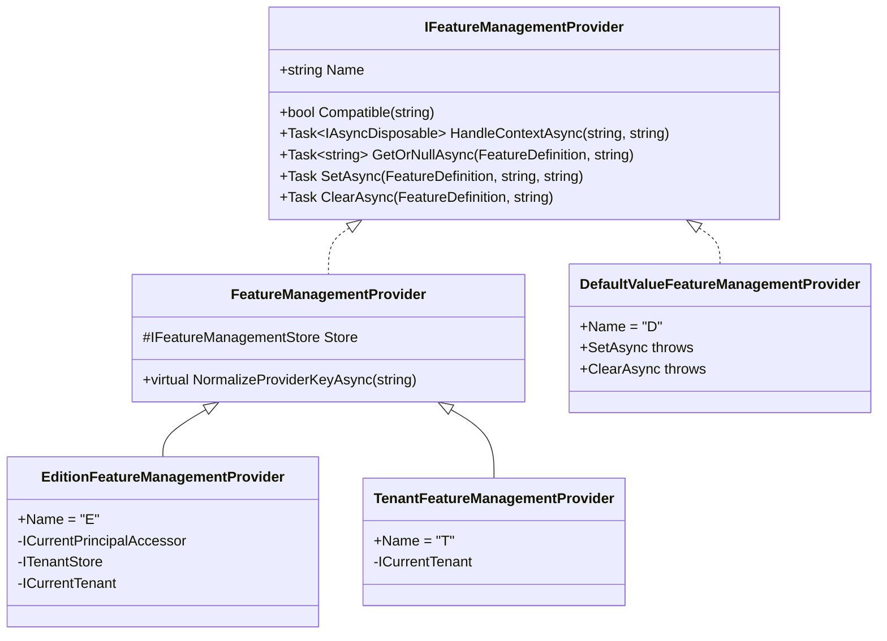

The domain layer of the Feature Management module owns one aggregate (`FeatureValue`), one persistence façade (`FeatureManagementStore` implementing the framework's `IFeatureManagementStore`), one orchestrator (`FeatureManager`), and a small hierarchy of writable providers. Together they form the *write* side of the feature pipeline whose read side is described in the [features framework page](/security/features). If you have not read the [module overview](/modules/feature-management/overview) yet, do that first — it explains the provider ordering and the host/edition/tenant key conventions referenced below.

## Project files at a glance

```
modules/feature-management/src/
├── Volo.Abp.FeatureManagement.Domain.Shared/
│   └── Volo/Abp/FeatureManagement/
│       ├── FeatureValueConsts.cs
│       ├── FeatureValueInvalidException.cs
│       ├── FeatureManagementDomainErrorCodes.cs
│       └── JsonConverters/
└── Volo.Abp.FeatureManagement.Domain/
    └── Volo/Abp/FeatureManagement/
        ├── FeatureValue.cs                       ← aggregate
        ├── IFeatureValueRepository.cs            ← repository contract
        ├── FeatureManagementStore.cs             ← IFeatureManagementStore impl
        ├── FeatureManager.cs                     ← IFeatureManager impl
        ├── IFeatureManagementProvider.cs
        ├── FeatureManagementProvider.cs          ← abstract base
        ├── DefaultValueFeatureManagementProvider.cs
        ├── EditionFeatureManagementProvider.cs
        ├── TenantFeatureManagementProvider.cs
        ├── FeatureValueCacheItem.cs
        ├── FeatureValueCacheItemInvalidator.cs
        ├── FeatureManagementOptions.cs
        ├── DynamicFeatureDefinitionStore.cs
        ├── StaticFeatureSaver.cs
        ├── FeatureDefinitionRecord.cs
        └── FeatureGroupDefinitionRecord.cs
```

The shared project carries constants used by both the EF Core / Mongo column metadata and the runtime validators. The domain project carries everything that touches the database or computes a value.

## The `FeatureValue` aggregate

A `FeatureValue` is a single override of a single feature for a single (provider, key) pair. Its shape is intentionally minimal:

```csharp
// modules/feature-management/src/Volo.Abp.FeatureManagement.Domain/Volo/Abp/FeatureManagement/FeatureValue.cs
public class FeatureValue : Entity<Guid>, IAggregateRoot<Guid>
{
    [NotNull]
    public virtual string Name { get; protected set; }

    [NotNull]
    public virtual string Value { get; internal set; }

    [NotNull]
    public virtual string ProviderName { get; protected set; }

    [CanBeNull]
    public virtual string ProviderKey { get; protected set; }

    protected FeatureValue() { }

    public FeatureValue(
        Guid id,
        [NotNull] string name,
        [NotNull] string value,
        [NotNull] string providerName,
        [CanBeNull] string providerKey)
    {
        Check.NotNull(name, nameof(name));

        Id = id;
        Name = Check.NotNullOrWhiteSpace(name, nameof(name));
        Value = Check.NotNullOrWhiteSpace(value, nameof(value));
        ProviderName = Check.NotNullOrWhiteSpace(providerName, nameof(providerName));
        ProviderKey = providerKey;
    }
}
```

Three things to internalise from this snippet:

1. **`Value` is a string.** The framework's `IStringValueType` (booleans, integers, free strings, selections) is responsible for parsing — every override goes through the validator before it lands here. Numeric features are stored as `"3"`, booleans as `"True"`/`"False"`.
2. **`ProviderKey` is nullable** — `null` keys the host's overrides. A non‑null key is either an `EditionId` or a `TenantId` formatted as `Guid.ToString()`.
3. **`Value` has an `internal set`.** `FeatureManagementStore.SetAsync` re‑assigns it directly, which is the *one* legitimate caller outside the constructor.

### Length constants

The shared project defines the lengths used by EF Core to size the columns:

```csharp
// FeatureValueConsts.cs
public static class FeatureValueConsts
{
    public static int MaxNameLength { get; set; } = 128;
    public static int MaxProviderNameLength { get; set; } = 64;
    public static int MaxProviderKeyLength { get; set; } = 64;
    public static int MaxValueLength { get; set; } = 128;
}
```

The properties are `static` settable so a deployment can widen, say, `MaxValueLength` before `AddMigration` runs. The MongoDB side ignores them — Mongo stores strings without a declared length.

### Validation

Values that don't satisfy the feature's `IStringValueType.Validator` raise `FeatureValueInvalidException` from the `Domain.Shared` project:

```csharp
// FeatureValueInvalidException.cs (excerpt)
public class FeatureValueInvalidException : BusinessException
{
    public FeatureValueInvalidException(string displayName)
        : base(FeatureManagementDomainErrorCodes.InvalidFeatureValue)
    {
        WithData("DisplayName", displayName);
    }
}
```

The error code (`AbpFeatureManagement:000001`) is mapped to the `AbpFeatureManagementResource` in `AbpExceptionLocalizationOptions`, so callers see a localised message rather than the raw code.

## `IFeatureValueRepository`

The repository is a thin extension of `IBasicRepository<FeatureValue, Guid>` with four lookups keyed by the (provider, key, name) tuple:

```csharp
// IFeatureValueRepository.cs
public interface IFeatureValueRepository : IBasicRepository<FeatureValue, Guid>
{
    Task<FeatureValue> FindAsync(
        string name,
        string providerName,
        string providerKey,
        CancellationToken cancellationToken = default);

    Task<List<FeatureValue>> FindAllAsync(
        string name,
        string providerName,
        string providerKey,
        CancellationToken cancellationToken = default);

    Task<List<FeatureValue>> GetListAsync(
        string providerName,
        string providerKey,
        CancellationToken cancellationToken = default);

    Task DeleteAsync(
        string providerName,
        string providerKey,
        CancellationToken cancellationToken = default);
}
```

`FindAllAsync` (plural) exists because the unique index on `(Name, ProviderName, ProviderKey)` is enforced by EF Core but **not** by MongoDB — if you somehow create duplicates by writing to the database directly, the bulk‑delete path in `FeatureManagementStore.DeleteAsync` cleans them up. Both EF Core and MongoDB implementations are covered on the [EF Core & MongoDB page](/modules/feature-management/efcore-mongodb).

## `FeatureManagementStore` — the `IFeatureStore` implementation

`FeatureManagementStore` is the bridge between the framework's read‑side `IFeatureStore` (consumed by the runtime `FeatureValueProvider`s) and the actual database. It is the only `ITransientDependency` implementation of `IFeatureManagementStore` shipped in the box:

```csharp
// FeatureManagementStore.cs (constructor + read path)
public class FeatureManagementStore : IFeatureManagementStore, ITransientDependency
{
    protected IDistributedCache<FeatureValueCacheItem> Cache { get; }
    protected IFeatureDefinitionManager FeatureDefinitionManager { get; }
    protected IFeatureValueRepository FeatureValueRepository { get; }
    protected IGuidGenerator GuidGenerator { get; }

    public FeatureManagementStore(
        IFeatureValueRepository featureValueRepository,
        IGuidGenerator guidGenerator,
        IDistributedCache<FeatureValueCacheItem> cache,
        IFeatureDefinitionManager featureDefinitionManager) { /* … */ }

    [UnitOfWork]
    public virtual async Task<string> GetOrNullAsync(string name, string providerName, string providerKey)
    {
        var cacheItem = await GetCacheItemAsync(name, providerName, providerKey);
        return cacheItem.Value;
    }
}
```

The read path delegates to `GetCacheItemAsync`. On a hit it returns the cached `Value` (which may itself be `null` — meaning "no override, fall through to the next provider"). On a miss it pre‑warms every feature in one round trip:

```csharp
// FeatureManagementStore.cs (cache warmup, excerpt)
private async Task SetCacheItemsAsync(
    string providerName,
    string providerKey,
    string currentName,
    FeatureValueCacheItem currentCacheItem)
{
    var featureDefinitions = await FeatureDefinitionManager.GetAllAsync();
    var featuresDictionary = (await FeatureValueRepository
            .GetListAsync(providerName, providerKey))
        .ToDictionary(s => s.Name, s => s.Value);

    var cacheItems = new List<KeyValuePair<string, FeatureValueCacheItem>>();

    foreach (var featureDefinition in featureDefinitions)
    {
        var featureValue = featuresDictionary.GetOrDefault(featureDefinition.Name);

        cacheItems.Add(
            new KeyValuePair<string, FeatureValueCacheItem>(
                CalculateCacheKey(featureDefinition.Name, providerName, providerKey),
                new FeatureValueCacheItem(featureValue)
            )
        );

        if (featureDefinition.Name == currentName)
        {
            currentCacheItem.Value = featureValue;
        }
    }

    await Cache.SetManyAsync(cacheItems, considerUow: true);
}
```

This is why looking up one feature for a tenant only costs **one** database round trip even when 30 features are defined. The cache key shape is fixed by `FeatureValueCacheItem.CalculateCacheKey`:

```text
pn:{providerName},pk:{providerKey},n:{name}
```

### Write path

`SetAsync` upserts and writes the cache. `DeleteAsync` removes every match for a (name, provider, key) tuple:

```csharp
// FeatureManagementStore.cs (write path)
[UnitOfWork]
public virtual async Task SetAsync(string name, string value, string providerName, string providerKey)
{
    var featureValue = await FeatureValueRepository.FindAsync(name, providerName, providerKey);
    if (featureValue == null)
    {
        featureValue = new FeatureValue(GuidGenerator.Create(), name, value, providerName, providerKey);
        await FeatureValueRepository.InsertAsync(featureValue, true);
    }
    else
    {
        featureValue.Value = value;
        await FeatureValueRepository.UpdateAsync(featureValue, true);
    }

    await Cache.SetAsync(
        CalculateCacheKey(name, providerName, providerKey),
        new FeatureValueCacheItem(featureValue?.Value),
        considerUow: true);
}

[UnitOfWork]
public virtual async Task DeleteAsync(string name, string providerName, string providerKey)
{
    var featureValues = await FeatureValueRepository.FindAllAsync(name, providerName, providerKey);
    foreach (var featureValue in featureValues)
    {
        await FeatureValueRepository.DeleteAsync(featureValue, true);
        await Cache.RemoveAsync(CalculateCacheKey(name, providerName, providerKey), considerUow: true);
    }
}
```

The `considerUow: true` flag is important — every cache write joins the surrounding unit of work so that a rollback leaves no stale entries.

<Tip>
If you replace the store (e.g. to back features with a SaaS configuration service rather than a relational table), implement `IFeatureManagementStore` and register your type as `ITransientDependency`. The provider hierarchy is store‑agnostic; nothing else needs to change.
</Tip>

## Provider hierarchy



### `FeatureManagementProvider` (abstract base)

The base class delegates the database calls to the `IFeatureManagementStore` and gives subclasses one hook — `NormalizeProviderKeyAsync` — to translate "the principal's current edition" or "the current tenant" into a concrete key:

```csharp
// FeatureManagementProvider.cs
public abstract class FeatureManagementProvider : IFeatureManagementProvider
{
    public abstract string Name { get; }
    protected IFeatureManagementStore Store { get; }

    protected FeatureManagementProvider(IFeatureManagementStore store) => Store = store;

    public virtual bool Compatible(string providerName) => providerName == Name;

    public virtual Task<IAsyncDisposable> HandleContextAsync(string providerName, string providerKey)
        => Task.FromResult<IAsyncDisposable>(NullAsyncDisposable.Instance);

    public virtual async Task<string> GetOrNullAsync(FeatureDefinition feature, string providerKey)
        => await Store.GetOrNullAsync(feature.Name, Name, await NormalizeProviderKeyAsync(providerKey));

    public virtual async Task SetAsync(FeatureDefinition feature, string value, string providerKey)
        => await Store.SetAsync(feature.Name, value, Name, await NormalizeProviderKeyAsync(providerKey));

    public virtual async Task ClearAsync(FeatureDefinition feature, string providerKey)
        => await Store.DeleteAsync(feature.Name, Name, await NormalizeProviderKeyAsync(providerKey));

    protected virtual Task<string> NormalizeProviderKeyAsync(string providerKey)
        => Task.FromResult(providerKey);
}
```

`Compatible(string)` is what `FeatureManager` uses to decide whether a chain step should *consume* the requested key. A provider whose `Name` does not match but whose `Compatible` returns `true` (see Edition below) still participates — it just receives `null` for `providerKey` so it falls back to the current principal or tenant.

### `DefaultValueFeatureManagementProvider`

Reads `FeatureDefinition.DefaultValue` and refuses to write. It is registered as `ISingletonDependency` because nothing it does requires per‑request state:

```csharp
// DefaultValueFeatureManagementProvider.cs
public class DefaultValueFeatureManagementProvider : IFeatureManagementProvider, ISingletonDependency
{
    public string Name => DefaultValueFeatureValueProvider.ProviderName; // "D"

    public bool Compatible(string providerName) => providerName == Name;

    public virtual Task<string> GetOrNullAsync(FeatureDefinition feature, string providerKey)
        => Task.FromResult(feature.DefaultValue);

    public virtual Task SetAsync(FeatureDefinition feature, string value, string providerKey)
        => throw new AbpException(
            $"Can not set default value of a feature. It is only possible while defining the feature " +
            $"in a {typeof(IFeatureDefinitionProvider)} implementation.");

    public virtual Task ClearAsync(FeatureDefinition feature, string providerKey)
        => throw new AbpException(/* … */);
}
```

This is the *terminator* of the read chain — every feature has a default, so if no edition/tenant override exists you always get a value back.

### `EditionFeatureManagementProvider`

The edition provider is the most subtle of the three. It is compatible with *both* its own name (`"E"`) **and** the tenant name (`"T"`) — when a tenant write doesn't override a value, the edition row is consulted as a fallback by translating the tenant key into its edition id:

```csharp
// EditionFeatureManagementProvider.cs (excerpt)
public class EditionFeatureManagementProvider : FeatureManagementProvider, ITransientDependency
{
    public override string Name => EditionFeatureValueProvider.ProviderName; // "E"

    protected ICurrentPrincipalAccessor PrincipalAccessor { get; }
    protected ITenantStore TenantStore { get; }
    protected ICurrentTenant CurrentTenant { get; }
    protected string CurrentCompatibleProviderName { get; set; }

    public override bool Compatible(string providerName)
    {
        CurrentCompatibleProviderName = providerName;
        return providerName == TenantFeatureValueProvider.ProviderName || base.Compatible(providerName);
    }

    protected async override Task<string> NormalizeProviderKeyAsync(string providerKey)
        => (await FindEditionIdAsync(providerKey))?.ToString();

    protected virtual async Task<Guid?> FindEditionIdAsync(string providerKey)
    {
        if (Guid.TryParse(providerKey, out var parsedEditionOrTenantId))
        {
            if (CurrentCompatibleProviderName == TenantFeatureValueProvider.ProviderName)
            {
                var tenant = await TenantStore.FindAsync(parsedEditionOrTenantId);
                if (tenant != null)
                {
                    return tenant?.EditionId;
                }
            }
            return parsedEditionOrTenantId;
        }

        if (CurrentTenant.Id.HasValue)
        {
            var tenant = await TenantStore.FindAsync(CurrentTenant.GetId());
            if (tenant != null) return tenant?.EditionId;
        }

        return PrincipalAccessor.Principal?.FindEditionId();
    }
}
```

There are three resolution rules to follow:

1. If the caller passed a parsed `Guid` and is in the tenant‑compatible mode, look the tenant up in `ITenantStore` and use its `EditionId`.
2. Otherwise, if the caller passed a parsed `Guid`, treat it directly as an `EditionId`.
3. Otherwise, fall back to the current tenant's edition, or the `edition_id` claim on the current `ClaimsPrincipal`.

<Warning>
`CurrentCompatibleProviderName` is mutated by `Compatible` and read by `NormalizeProviderKeyAsync` — because the provider is `ITransientDependency`, every CRUD operation gets a fresh instance and no thread races. Keep this pattern when subclassing.
</Warning>

### `TenantFeatureManagementProvider`

The tenant provider is the simplest:

```csharp
// TenantFeatureManagementProvider.cs
public class TenantFeatureManagementProvider : FeatureManagementProvider, ITransientDependency
{
    public override string Name => TenantFeatureValueProvider.ProviderName; // "T"

    protected ICurrentTenant CurrentTenant { get; }

    public TenantFeatureManagementProvider(IFeatureManagementStore store, ICurrentTenant currentTenant)
        : base(store)
    {
        CurrentTenant = currentTenant;
    }

    public override Task<IAsyncDisposable> HandleContextAsync(string providerName, string providerKey)
    {
        if (providerName == Name && !providerKey.IsNullOrWhiteSpace())
        {
            if (Guid.TryParse(providerKey, out var tenantId))
            {
                var disposable = CurrentTenant.Change(tenantId);
                return Task.FromResult<IAsyncDisposable>(new AsyncDisposeFunc(() =>
                {
                    disposable.Dispose();
                    return Task.CompletedTask;
                }));
            }
        }

        return base.HandleContextAsync(providerName, providerKey);
    }

    protected override Task<string> NormalizeProviderKeyAsync(string providerKey)
    {
        if (providerKey != null) return Task.FromResult(providerKey);
        return Task.FromResult(CurrentTenant.Id?.ToString());
    }
}
```

`HandleContextAsync` is interesting — when `FeatureManager.SetAsync` resolves the fallback value, it calls `HandleContextAsync` on the *target* provider first. For the tenant provider that means temporarily switching `ICurrentTenant` to the target tenant so that downstream `EditionFeatureManagementProvider.FindEditionIdAsync` can read that tenant's edition. The disposable from `CurrentTenant.Change(tenantId)` is wrapped in an `AsyncDisposeFunc` so that an `await using` block cleanly restores the previous tenant.

## `FeatureManager` — the orchestrator

`FeatureManager` is the only public entry point that callers (the application service, the modal's save handler, your own admin scripts) should use. It owns the ordered provider list and the validation step:

```csharp
// FeatureManager.cs (provider list, lazily resolved)
public class FeatureManager : IFeatureManager, ISingletonDependency
{
    protected IFeatureDefinitionManager FeatureDefinitionManager { get; }
    protected List<IFeatureManagementProvider> Providers => _lazyProviders.Value;
    protected FeatureManagementOptions Options { get; }
    protected IStringLocalizerFactory StringLocalizerFactory { get; }

    private readonly Lazy<List<IFeatureManagementProvider>> _lazyProviders;

    public FeatureManager(
        IOptions<FeatureManagementOptions> options,
        IServiceProvider serviceProvider,
        IFeatureDefinitionManager featureDefinitionManager,
        IStringLocalizerFactory stringLocalizerFactory)
    {
        FeatureDefinitionManager = featureDefinitionManager;
        StringLocalizerFactory = stringLocalizerFactory;
        Options = options.Value;

        _lazyProviders = new Lazy<List<IFeatureManagementProvider>>(
            () => Options.Providers
                .Select(c => serviceProvider.GetRequiredService(c) as IFeatureManagementProvider)
                .ToList(),
            true);
    }
}
```

The list is materialised once and reused — providers themselves are transient, so any mutable state on them resets per operation, not per resolve.

### `GetAllWithProviderAsync`

This is the method `FeatureAppService.GetAsync` calls. It builds the modal's input by walking the provider chain in reverse:

```csharp
// FeatureManager.cs (read all, excerpt)
public async Task<List<FeatureNameValueWithGrantedProvider>> GetAllWithProviderAsync(
    string providerName, string providerKey, bool fallback = true)
{
    Check.NotNull(providerName, nameof(providerName));

    var featureDefinitions = await FeatureDefinitionManager.GetAllAsync();
    var providers = Enumerable.Reverse(Providers).SkipWhile(c => c.Name != providerName);

    if (!fallback) providers = providers.TakeWhile(c => c.Name == providerName);

    var providerList = providers.ToList();
    if (!providerList.Any()) return new List<FeatureNameValueWithGrantedProvider>();

    var featureValues = new Dictionary<string, FeatureNameValueWithGrantedProvider>();

    foreach (var feature in featureDefinitions)
    {
        var fnvwgp = new FeatureNameValueWithGrantedProvider(feature.Name, null);
        foreach (var provider in providerList)
        {
            string pk = null;
            if (provider.Compatible(providerName)) pk = providerKey;

            var value = await provider.GetOrNullAsync(feature, pk);
            if (value != null)
            {
                fnvwgp.Value = value;
                fnvwgp.Provider = new FeatureValueProviderInfo(provider.Name, pk);
                break;
            }
        }
        if (fnvwgp.Value != null) featureValues[feature.Name] = fnvwgp;
    }

    return featureValues.Values.ToList();
}
```

`fallback = false` is what the Angular UI uses to render the "*this value comes from the edition*" hint — it isolates the target provider so the modal can disable inputs that are inherited.

### `SetAsync`

The set path validates the value, then drops redundant overrides:

```csharp
// FeatureManager.cs (set, excerpt)
public virtual async Task SetAsync(
    string name, string value, string providerName, string providerKey, bool forceToSet = false)
{
    var feature = await FeatureDefinitionManager.GetAsync(name);

    if (feature.ValueType?.Validator.IsValid(value) == false)
    {
        throw new FeatureValueInvalidException(feature.DisplayName.Localize(StringLocalizerFactory));
    }

    var providers = Enumerable.Reverse(Providers).SkipWhile(p => p.Name != providerName).ToList();
    if (!providers.Any())
        throw new AbpException($"Unknown feature value provider: {providerName}");

    if (providers.Count > 1 && !forceToSet && value != null)
    {
        await using (await providers[0].HandleContextAsync(providerName, providerKey))
        {
            var fallbackValue = await GetOrNullInternalAsync(name, providers[1].Name, null);
            if (string.Equals(fallbackValue.Value, value, StringComparison.OrdinalIgnoreCase))
            {
                // Clear the value if it's same as it's fallback value
                value = null;
            }
        }
    }

    providers = providers.TakeWhile(p => p.Name == providerName).ToList();

    if (value == null)
        foreach (var p in providers) await p.ClearAsync(feature, providerKey);
    else
        foreach (var p in providers) await p.SetAsync(feature, value, providerKey);
}
```

The two non‑obvious pieces:

- **`await using providers[0].HandleContextAsync(…)`** — for a tenant write this swaps `ICurrentTenant` so the fallback read uses the *target* tenant's edition, not the caller's. The `await using` ensures the swap is undone even on exception.
- **The `forceToSet` flag** — set to `true` by `FeatureAppService.UpdateAsync` after it confirms a *child* feature was actually persisted on the target provider. Without it, setting a parent feature back to the inherited value would erase the override and the child write you just made would orphan.

### Static convenience extensions

Three extension classes are shipped to avoid repeating the literal provider names:

```csharp
// DefaultValueFeatureManagerExtensions.cs / EditionFeatureManagerExtensions.cs / TenantFeatureManagerExtensions.cs
// All three follow the same shape; example:
public static class TenantFeatureManagerExtensions
{
    public static Task<string> GetOrNullForTenantAsync(
        this IFeatureManager featureManager, string name, Guid tenantId, bool fallback = true)
        => featureManager.GetOrNullAsync(
            name, TenantFeatureValueProvider.ProviderName, tenantId.ToString(), fallback);

    public static Task SetForTenantAsync(
        this IFeatureManager featureManager, Guid tenantId, string name, string value, bool forceToSet = false)
        => featureManager.SetAsync(
            name, value, TenantFeatureValueProvider.ProviderName, tenantId.ToString(), forceToSet);
}
```

Prefer the extensions over typing `"T"` everywhere — the constants in `Volo.Abp.Features` change rarely but searching for them is harder than searching for `SetForTenantAsync`.

## `FeatureManagementOptions`

Configured in `AbpFeatureManagementDomainModule`:

```csharp
// AbpFeatureManagementDomainModule.cs (excerpt)
Configure<FeatureManagementOptions>(options =>
{
    options.Providers.Add<DefaultValueFeatureManagementProvider>();
    options.Providers.Add<EditionFeatureManagementProvider>();

    //TODO: Should be moved to the Tenant Management module
    options.Providers.Add<TenantFeatureManagementProvider>();
    options.ProviderPolicies[TenantFeatureValueProvider.ProviderName]
        = "AbpTenantManagement.Tenants.ManageFeatures";
});
```

The shape:

```csharp
// FeatureManagementOptions.cs
public class FeatureManagementOptions
{
    public ITypeList<IFeatureManagementProvider> Providers { get; }
    public Dictionary<string, string> ProviderPolicies { get; }

    /// <summary>Default: true.</summary>
    public bool SaveStaticFeaturesToDatabase { get; set; } = true;

    /// <summary>Default: false.</summary>
    public bool IsDynamicFeatureStoreEnabled { get; set; }
}
```

`ProviderPolicies` is the authorization map used by the application service — adding a new provider name without an entry will make every call against it throw on `CheckProviderPolicy`. See the [application page](/modules/feature-management/application#provider-policies) for the matching enforcement code.

## Dynamic feature definitions

Outside the override store, the domain project also owns the dynamic *definition* store:

- `FeatureDefinitionRecord` — `Id, GroupName, Name, ParentName, DisplayName, Description, DefaultValue, AllowedProviders, ValueType`. Persisted in `AbpFeatures`.
- `FeatureGroupDefinitionRecord` — `Id, Name, DisplayName`. Persisted in `AbpFeatureGroups`.
- `IFeatureDefinitionSerializer` / `FeatureDefinitionSerializer` — projects in‑memory `FeatureDefinition`s onto `FeatureDefinitionRecord`s.
- `IStaticFeatureSaver` / `StaticFeatureSaver` — invoked once at startup (via Polly retries) to upsert the static definitions when `SaveStaticFeaturesToDatabase` is `true`.
- `IDynamicFeatureDefinitionStore` / `DynamicFeatureDefinitionStore` — the runtime read side used by `FeatureDefinitionManager` when `IsDynamicFeatureStoreEnabled` is `true`. Backed by `IDynamicFeatureDefinitionStoreInMemoryCache` so repeated reads do not hit the database.

The startup orchestration lives in `AbpFeatureManagementDomainModule.InitializeDynamicFeatures` — a Polly‑retried `Task` that runs in the background so that startup is not blocked by a slow database. In a microservice topology, the host that *owns* the definitions has `SaveStaticFeaturesToDatabase = true`; every other service has `IsDynamicFeatureStoreEnabled = true` and `SaveStaticFeaturesToDatabase = false`.

## Cache invalidation

`FeatureValueCacheItemInvalidator` handles `EntityChangedEventData<FeatureValue>` on the local event bus and removes the matching cache entry; the distributed bus relays the change to sibling replicas. Ad‑hoc `UPDATE`s on `AbpFeatureValues` will *not* invalidate the cache — always go through `IFeatureManager` or `IFeatureManagementStore`.

## Where to read next

- [Application layer](/modules/feature-management/application) — `FeatureAppService` composes the providers above.
- [HTTP API](/modules/feature-management/http-api) — `FeaturesController` endpoints and client proxies.
- [Web & Blazor](/modules/feature-management/web-and-blazor) — `FeatureManagementModal`.
- [EF Core & MongoDB](/modules/feature-management/efcore-mongodb) — repository implementations.
- [Features framework](/security/features) — the read side and `[RequiresFeature]`.
- [Tenant Management](/modules/tenant-management/overview) — `ITenantStore` and tenant CRUD.
