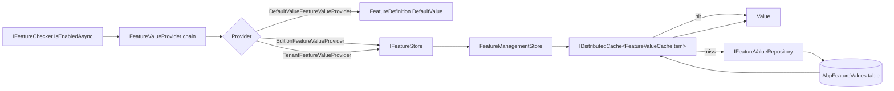
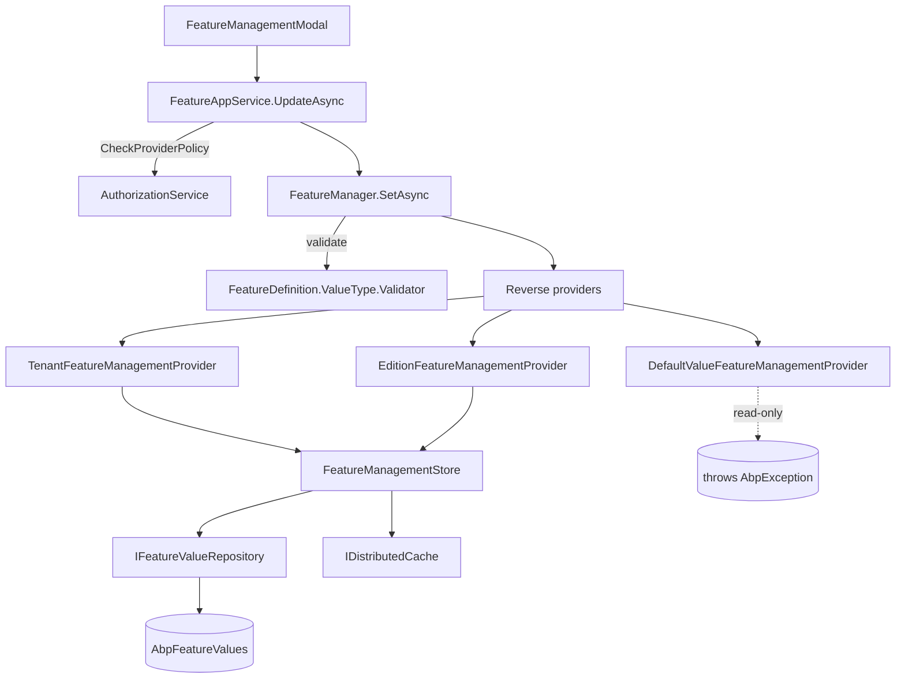

The **Feature Management module** (`Volo.Abp.FeatureManagement.*`) is the persistence and management layer that backs the `IFeatureChecker` runtime. Where the [Features framework](/security/features) defines what a *feature* is (`FeatureDefinition`, `IFeatureDefinitionProvider`, value types, the `[RequiresFeature]` attribute, the `IFeatureChecker` resolver), this module decides *what value each feature actually has for a given tenant, edition, or host*, persists overrides in a `FeatureValue` table, exposes a CRUD application service, and renders the management modal you click on a tenant row.

Read the framework page first if you have not already — every type below assumes you know what `FeatureDefinition`, `FeatureValueProvider`, and `IFeatureChecker` are. The module simply layers persistence, providers, and a UI on top.

<Info>
**Source root.** Every type referenced on these pages lives under [`modules/feature-management/src/`](https://github.com/abpframework/abp/tree/dev/modules/feature-management/src). The 12 projects in that folder map 1‑to‑1 to the layered structure below.
</Info>

## What the module gives you

<CardGroup cols={2}>
  <Card title="FeatureValue store" icon="database">
    A single aggregate — `FeatureValue` (Name, Value, ProviderName, ProviderKey) — stored in the `AbpFeatureValues` table (EF Core) or `AbpFeatureValues` collection (MongoDB) with a unique index on `(Name, ProviderName, ProviderKey)`. Cached through `IDistributedCache<FeatureValueCacheItem>`.
  </Card>
  <Card title="Management providers" icon="layer-group">
    `DefaultValueFeatureManagementProvider`, `EditionFeatureManagementProvider`, and `TenantFeatureManagementProvider` — the writable counterparts of the framework's read‑side `FeatureValueProvider`s. They wrap `IFeatureManagementStore` and resolve the right `ProviderKey` from the current principal / current tenant.
  </Card>
  <Card title="FeatureManager façade" icon="sliders">
    `IFeatureManager` is the high‑level API consumed by the UI: `GetOrNullAsync`, `GetAllAsync`, `SetAsync`, `DeleteAsync`. It walks providers in reverse order, validates values against `IStringValueType.Validator`, and clears redundant overrides that equal the fallback value.
  </Card>
  <Card title="REST + UI" icon="window">
    `FeatureAppService` / `FeaturesController` expose `GET`, `PUT`, `DELETE /api/feature-management/features`. `FeatureManagementModal` (MVC, Blazor, and via Angular `@abp/ng.feature-management`) renders the tabbed dialog that edits feature values per provider.
  </Card>
  <Card title="Dynamic features" icon="bolt">
    When `FeatureManagementOptions.IsDynamicFeatureStoreEnabled` is `true`, `FeatureDefinitionRecord` / `FeatureGroupDefinitionRecord` rows mirror the static `IFeatureDefinitionProvider`s into the database so that other microservices can read the same definitions over the network.
  </Card>
  <Card title="Multi-tenancy aware" icon="building">
    The module is `[IgnoreMultiTenancy]` at the `DbContext` level — overrides for every tenant live in the host DB — but providers honour `ICurrentTenant` so each tenant only sees and edits its own row. See [Tenant Management](/modules/tenant-management/overview) for how this integrates with the tenant CRUD UI.
  </Card>
</CardGroup>

## Project layout

The 12 projects under `modules/feature-management/src/` follow the standard ABP onion:

| Project | Purpose | Page |
| --- | --- | --- |
| `Volo.Abp.FeatureManagement.Domain.Shared` | Constants (`FeatureValueConsts`), exceptions (`FeatureValueInvalidException`), localization. | [Domain](/modules/feature-management/domain) |
| `Volo.Abp.FeatureManagement.Domain` | `FeatureValue` aggregate, `IFeatureValueRepository`, `FeatureManager`, `FeatureManagementStore`, all `FeatureManagementProvider`s. | [Domain](/modules/feature-management/domain) |
| `Volo.Abp.FeatureManagement.Application.Contracts` | `IFeatureAppService`, DTOs (`FeatureDto`, `FeatureGroupDto`, `GetFeatureListResultDto`, `UpdateFeaturesDto`), permissions. | [Application](/modules/feature-management/application) |
| `Volo.Abp.FeatureManagement.Application` | `FeatureAppService` — authorises the call, walks definitions, calls `IFeatureManager`. | [Application](/modules/feature-management/application) |
| `Volo.Abp.FeatureManagement.HttpApi` | `FeaturesController` — `/api/feature-management/features`. | [HTTP API](/modules/feature-management/http-api) |
| `Volo.Abp.FeatureManagement.HttpApi.Client` | Static C# proxies for remote callers. | [HTTP API](/modules/feature-management/http-api) |
| `Volo.Abp.FeatureManagement.Web` | Razor Pages `FeatureManagementModal.cshtml`, JS modal, dynamic JS proxy. | [Web & Blazor](/modules/feature-management/web-and-blazor) |
| `Volo.Abp.FeatureManagement.Blazor` (+ `.Server`, `.WebAssembly`) | Blazorise modal, Blazor component. | [Web & Blazor](/modules/feature-management/web-and-blazor) |
| `Volo.Abp.FeatureManagement.EntityFrameworkCore` | `FeatureManagementDbContext`, EF Core repository implementations, model creating extensions. | [EF Core & MongoDB](/modules/feature-management/efcore-mongodb) |
| `Volo.Abp.FeatureManagement.MongoDB` | `FeatureManagementMongoDbContext`, Mongo repositories. | [EF Core & MongoDB](/modules/feature-management/efcore-mongodb) |

## Read pipeline — how `IFeatureChecker` becomes a database row

The framework's `IFeatureChecker` ultimately walks an ordered list of read‑side `FeatureValueProvider`s (`DefaultValueFeatureValueProvider` → `EditionFeatureValueProvider` → `TenantFeatureValueProvider`). Two of those providers — Edition and Tenant — delegate to `IFeatureStore`, and **this module's `FeatureManagementStore` is the only implementation registered in the box**. From there, the value comes from a distributed cache or, on a miss, from `IFeatureValueRepository`.



Key points to internalise before reading the rest of this section:

- `FeatureManagementStore` is keyed by `(Name, ProviderName, ProviderKey)` and bulk‑warms the cache on every miss — one `GetListAsync(providerName, providerKey)` brings back **all** features for the (tenant, edition, or host) and primes the cache for sibling lookups.
- The read‑side providers (`EditionFeatureValueProvider`, `TenantFeatureValueProvider`) live in `Volo.Abp.Features` and resolve the `ProviderKey` from the current `ClaimsPrincipal` / `ICurrentTenant`. The management providers in *this* module do the same, but for writes.
- `ProviderKey` is `null` for the **host** record, the `EditionId` (as a `Guid` string) for an edition, and the `TenantId` (as a `Guid` string) for a tenant.

## Write pipeline — provider hierarchy

Writes invert the read order. `FeatureManager.SetAsync(name, value, providerName, providerKey)` calls `IFeatureManagementProvider.SetAsync` on every provider whose `Name` matches `providerName`. Each management provider wraps `IFeatureManagementStore.SetAsync`, which stores or updates the row and writes the cache.



Two subtleties worth noting up front:

1. **Redundant overrides are scrubbed.** `FeatureManager.SetAsync` compares the incoming value to the fallback resolved from the *next* provider in the chain. If they match (case‑insensitive), the new value is silenced to `null` and `ClearAsync` is called instead — so editing a tenant's value back to the edition default removes the row rather than duplicating it.
2. **`DefaultValueFeatureManagementProvider` is read‑only.** Its `SetAsync` and `ClearAsync` throw `AbpException` — default values are baked into `IFeatureDefinitionProvider` implementations and cannot be edited at runtime.

## Provider ordering and the host record

The provider list is configured in `AbpFeatureManagementDomainModule`:

```csharp
Configure<FeatureManagementOptions>(options =>
{
    options.Providers.Add<DefaultValueFeatureManagementProvider>();
    options.Providers.Add<EditionFeatureManagementProvider>();

    //TODO: Should be moved to the Tenant Management module
    options.Providers.Add<TenantFeatureManagementProvider>();
    options.ProviderPolicies[TenantFeatureValueProvider.ProviderName]
        = "AbpTenantManagement.Tenants.ManageFeatures";
});
```

Order matters in three places:

- **Reads** walk the list in *reverse*: tenant first, then edition, then default. The first non‑`null` value wins.
- **Writes** also walk in reverse, starting at the requested provider. Anything above the starting provider is skipped — you cannot use `SetAsync` with `providerName = "E"` to also touch a tenant row.
- **The fallback comparison** uses `providers[1]` (one step below the target). For tenant writes, the fallback is the edition value; for edition writes, the fallback is the default.

The special **host record** is `ProviderName = "T"` and `ProviderKey = null`. The UI surfaces it as the "Manage Host features" button and is gated by the `FeatureManagement.ManageHostFeatures` permission rather than `AbpTenantManagement.Tenants.ManageFeatures`.

<Warning>
The `ProviderPolicies` dictionary is what tells `FeatureAppService.CheckProviderPolicy` which permission to require for each provider name. If you register a custom `IFeatureManagementProvider`, you **must** add an entry here or every CRUD call against your provider name will throw `AbpException: "No policy defined to get/set permissions for the provider …"`.
</Warning>

## Static vs dynamic features

The module supports two modes for sourcing feature definitions:

<CardGroup cols={2}>
  <Card title="Static (default)" icon="code">
    `IFeatureDefinitionProvider` implementations are scanned at startup and held in‑memory by `FeatureDefinitionManager`. `FeatureManagementOptions.SaveStaticFeaturesToDatabase = true` (default) also persists them as `FeatureDefinitionRecord` rows so that other services can read them.
  </Card>
  <Card title="Dynamic" icon="bolt-lightning">
    Set `FeatureManagementOptions.IsDynamicFeatureStoreEnabled = true` and the module reads `FeatureDefinitionRecord` / `FeatureGroupDefinitionRecord` from the database through `IDynamicFeatureDefinitionStore` (cached in‑memory by `IDynamicFeatureDefinitionStoreInMemoryCache`). Used by microservice deployments where definitions are owned by another host.
  </Card>
</CardGroup>

`AbpFeatureManagementDomainModule.OnApplicationInitializationAsync` runs a Polly‑retried background `Task` that (a) calls `IStaticFeatureSaver.SaveAsync()` if `SaveStaticFeaturesToDatabase` is `true`, and (b) pre‑warms the dynamic store if it is enabled. Both flags are forced to `false` in data‑migration environments to keep `dotnet ef migrations` deterministic.

## When to use which provider

| Scenario | `providerName` | `providerKey` | Permission |
| --- | --- | --- | --- |
| Edit the host's defaults | `T` | `null` | `FeatureManagement.ManageHostFeatures` |
| Edit a specific tenant | `T` | `tenantId.ToString()` | `AbpTenantManagement.Tenants.ManageFeatures` |
| Edit an edition (SaaS) | `E` | `editionId.ToString()` | configured via `ProviderPolicies["E"]` |
| Resolve a value at runtime | n/a | n/a | use `IFeatureChecker`, not this module |

`T` and `E` are the constants `TenantFeatureValueProvider.ProviderName` and `EditionFeatureValueProvider.ProviderName` from `Volo.Abp.Features`. They are public constants — feel free to reference them by name in your own code rather than hard‑coding the strings.

## Cache shape and invalidation

`FeatureValueCacheItem` is the cached row: a single `Value` property whose key is `pn:{providerName},pk:{providerKey},n:{name}` (computed by `FeatureValueCacheItem.CalculateCacheKey`). `FeatureManagementStore` uses `IDistributedCache<FeatureValueCacheItem>` with `considerUow: true`, so writes inside a unit of work are batched and only flushed on commit.

`FeatureValueCacheItemInvalidator` listens for `EntityChangedEventData<FeatureValue>` on the local event bus and evicts the affected key. The same change is also published as a distributed event so that sibling replicas drop their copies. If your deployment uses Redis, no extra wiring is required — `Volo.Abp.Caching.StackExchangeRedis` already shares one key namespace.

## Installation

Add the appropriate modules to your solution (one DB layer plus the layers your app already has):

```bash
abp add-module Volo.Abp.FeatureManagement
```

The above runs the installer that adds these `DependsOn` references for you:

```csharp
[DependsOn(
    typeof(AbpFeatureManagementDomainModule),
    typeof(AbpFeatureManagementEntityFrameworkCoreModule), // or .MongoDB
    typeof(AbpFeatureManagementApplicationModule),
    typeof(AbpFeatureManagementHttpApiModule),
    typeof(AbpFeatureManagementWebModule) // or .Blazor / .Blazor.Server / .Blazor.WebAssembly
)]
public class MyProjectModule : AbpModule { }
```

For HTTP API consumers (a separate Web host, a console worker, a microservice), depend on `AbpFeatureManagementHttpApiClientModule` instead of `…Application` + `…HttpApi`. See the [HTTP API](/modules/feature-management/http-api) page.

## Database object reference

| Object | Owner project | Notes |
| --- | --- | --- |
| `AbpFeatureValues` | EF Core / MongoDB | The override store. Unique index on `(Name, ProviderName, ProviderKey)`. |
| `AbpFeatureGroups` | EF Core / MongoDB | Dynamic group definitions. Unique on `Name`. |
| `AbpFeatures` | EF Core / MongoDB | Dynamic feature definitions. Unique on `Name`, indexed on `GroupName`. |

All three tables sit in the schema defined by `AbpFeatureManagementDbProperties.DbSchema` and use the prefix `AbpFeatureManagementDbProperties.DbTablePrefix` (default `Abp`). They live in the **host** database — the `DbContext` is marked `[IgnoreMultiTenancy]`.

## How the rest of these pages are organised

<CardGroup cols={2}>
  <Card title="Domain" icon="cube" href="/modules/feature-management/domain">
    `FeatureValue`, `IFeatureValueRepository`, `FeatureManager`, `FeatureManagementStore`, and the provider hierarchy in detail.
  </Card>
  <Card title="Application" icon="layer-group" href="/modules/feature-management/application">
    `FeatureAppService` walkthrough, DTOs, permission checks, `ProviderPolicies` mapping.
  </Card>
  <Card title="HTTP API" icon="globe" href="/modules/feature-management/http-api">
    `FeaturesController` routes, request/response shapes, and the `HttpApi.Client` proxies.
  </Card>
  <Card title="Web & Blazor" icon="window" href="/modules/feature-management/web-and-blazor">
    `FeatureManagementModal` for MVC and Blazor: how the tabs, toggles, and selections are wired.
  </Card>
  <Card title="EF Core & MongoDB" icon="database" href="/modules/feature-management/efcore-mongodb">
    `FeatureManagementDbContext`, `EfCoreFeatureValueRepository`, `MongoFeatureValueRepository`, model‑creating extensions.
  </Card>
  <Card title="Features framework" icon="flag" href="/security/features">
    The runtime side — `FeatureDefinition`, `IFeatureChecker`, `[RequiresFeature]`, value types, and how providers are wired.
  </Card>
</CardGroup>

## Cross‑cutting concerns

- **Multi‑tenancy.** Always edit features through the management API; never reach into `FeatureValue` rows directly. Switching the current tenant with `ICurrentTenant.Change(tenantId)` and then calling `FeatureManager.GetAllAsync("T", tenantId.ToString())` is the supported pattern.
- **Eventing.** Saving a row publishes a domain event picked up by [Tenant Management](/modules/tenant-management/overview) consumers and by `FeatureValueCacheItemInvalidator`. Subscribe to it from your own code rather than polling.
- **Extension properties.** Both `FeatureValue` and `FeatureDefinitionRecord` call `ApplyObjectExtensionMappings()` in `ConfigureFeatureManagement`, so you can add columns via the standard `ObjectExtensionManager` API.
- **Localization.** Display names and descriptions are `ILocalizableString`. The Web / Blazor modal calls `Localize(StringLocalizerFactory)` for you; if you build a custom UI, do the same to honour the tenant's language.

## Working example — onboarding a new tenant

The combined flow looks like this in code (typical SaaS onboarding):

```csharp
public class TenantOnboardingHandler :
    ILocalEventHandler<EntityCreatedEventData<Tenant>>,
    ITransientDependency
{
    private readonly IFeatureManager _featureManager;
    private readonly ICurrentTenant _currentTenant;

    public TenantOnboardingHandler(IFeatureManager featureManager, ICurrentTenant currentTenant)
    {
        _featureManager = featureManager;
        _currentTenant = currentTenant;
    }

    public async Task HandleEventAsync(EntityCreatedEventData<Tenant> eventData)
    {
        var tenant = eventData.Entity;

        using (_currentTenant.Change(tenant.Id))
        {
            await _featureManager.SetForTenantAsync(
                tenantId: tenant.Id,
                name: "MyApp.Reporting",
                value: "true");

            await _featureManager.SetForTenantAsync(
                tenantId: tenant.Id,
                name: "MyApp.MaxProjects",
                value: "5");
        }
    }
}
```

When the `Tenant` aggregate is saved by the Tenant Management module, this handler runs, opens a tenant context, and sets two overrides. The next time `IFeatureChecker.IsEnabledAsync("MyApp.Reporting")` runs under that tenant, the store walks the cache (miss), warms it from `IFeatureValueRepository`, and returns `"true"`. The whole round trip is one SQL query and the cache stays primed for every sibling feature.

## Comparison: features vs settings vs permissions

These three modules sit next to each other in the navigation and are frequently confused. The defining differences:

| | Features | Settings | Permissions |
| --- | --- | --- | --- |
| Module | `Volo.Abp.FeatureManagement` | `Volo.Abp.SettingManagement` | `Volo.Abp.PermissionManagement` |
| Scope | Tenant / edition / host | User / tenant / global | User / role / OU / client |
| Value type | `IStringValueType` (toggle, selection, free) | Free string | Boolean (granted / denied) |
| Runtime resolver | `IFeatureChecker` | `ISettingProvider` | `IPermissionChecker` |
| Common consumer | `[RequiresFeature]` | `IConfiguration`-like reads | `[Authorize]` |

Pick *features* when the value depends on the **tenant's pricing plan** ("max users", "reporting on/off"). Pick *settings* when the value is **operator preference** ("default time zone"). Pick *permissions* when the value is **what a role is allowed to do** ("can delete users").

## Configuration cheat‑sheet

| Option | Lives in | Default | Effect |
| --- | --- | --- | --- |
| `FeatureManagementOptions.Providers` | Domain module | Default, Edition, Tenant | Insertion order = chain order for reads (reversed) and writes. |
| `FeatureManagementOptions.ProviderPolicies` | Domain module | `T` → `AbpTenantManagement.Tenants.ManageFeatures` | Permission required for CRUD against each provider name. |
| `FeatureManagementOptions.SaveStaticFeaturesToDatabase` | Domain module | `true` | Mirror static `IFeatureDefinitionProvider`s into `AbpFeatures`/`AbpFeatureGroups`. |
| `FeatureManagementOptions.IsDynamicFeatureStoreEnabled` | Domain module | `false` | Read `FeatureDefinitionRecord`/`FeatureGroupDefinitionRecord` from the database at runtime. |
| `AbpFeatureManagementDbProperties.DbTablePrefix` | Domain | `"Abp"` | Prefix prepended to every table / collection. |
| `AbpFeatureManagementDbProperties.DbSchema` | Domain | `null` | EF Core schema; ignored by MongoDB. |
| `FeatureValueConsts.MaxValueLength` etc. | Domain.Shared | `128` / `64` / `64` / `128` | EF Core column sizing — set before the first migration. |

## A quick sanity test

After installing the module, smoke‑test the wiring with a single line in any `IApplicationService`:

```csharp
var enabled = await FeatureChecker.IsEnabledAsync("MyApp.Reporting");
```

If it returns the `DefaultValue` you declared in your `IFeatureDefinitionProvider`, the read pipeline is healthy. Open the modal on a tenant, flip the toggle, save, and call the same line again — the value should change without restarting the app. If it does not, the most common culprits are:

1. The distributed cache was not invalidated — confirm `FeatureValueCacheItemInvalidator` is registered (it is by default; only `[Dependency(ReplaceServices = true)]` overrides can hide it).
2. The provider key was wrong — non‑GUID strings silently fall through to the current tenant, so passing `"abc"` instead of a real `Guid` ends up reading the wrong row.
3. A custom `IFeatureManagementProvider` was registered without a `ProviderPolicies` entry — the modal call would have thrown rather than persisting.

Move on to the [domain page](/modules/feature-management/domain) next — that is where `FeatureValue`, `FeatureManager`, and the provider hierarchy are dissected in detail.
