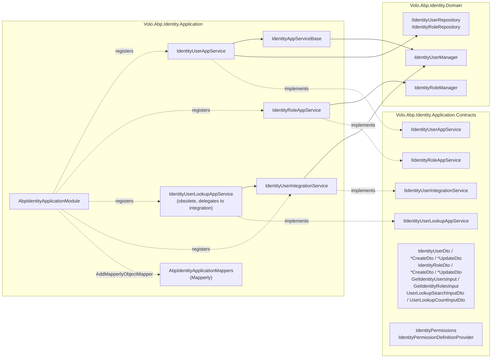
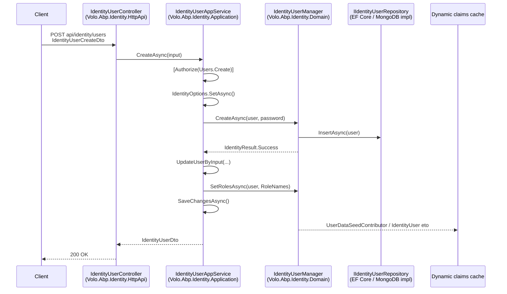

The application layer of the **Identity module** is the public, permission‑checked entry point into everything the [domain layer](/modules/identity/domain) exposes. It lives in two projects under `modules/identity/src/`: the abstractions in `Volo.Abp.Identity.Application.Contracts/` (interfaces, DTOs, permission constants) and the concrete services in `Volo.Abp.Identity.Application/`. Every application service is a thin orchestration layer over the [managers](/modules/identity/managers) (`IdentityUserManager`, `IdentityRoleManager`) — it maps DTOs, runs `[Authorize(...)]` checks, and returns paged DTO results.

This page covers the four services that ship in the open‑source Identity module: `IIdentityUserAppService` / `IdentityUserAppService`, `IIdentityRoleAppService` / `IdentityRoleAppService`, `IIdentityUserLookupAppService` / `IdentityUserLookupAppService`, and the module‑to‑module `IIdentityUserIntegrationService` / `IdentityUserIntegrationService`. They are wired by `AbpIdentityApplicationModule` and surfaced over HTTP by the controllers in [`Volo.Abp.Identity.HttpApi`](/modules/identity/http-api).

<Info>
**Source root.** Everything below is in [`modules/identity/src/Volo.Abp.Identity.Application/`](https://github.com/abpframework/abp/tree/dev/modules/identity/src/Volo.Abp.Identity.Application) and [`modules/identity/src/Volo.Abp.Identity.Application.Contracts/`](https://github.com/abpframework/abp/tree/dev/modules/identity/src/Volo.Abp.Identity.Application.Contracts). Profile, organization‑unit, claim‑type, security‑log, and session application services are **commercial** (ABP Pro) — they are not in this open‑source project.
</Info>

## Layer map



The arrows show the one‑way dependency: contracts know nothing about the implementation, the implementation depends on the domain (`AbpIdentityDomainModule`) and on `AbpPermissionManagementApplicationModule`, and `IdentityAppServiceBase` is just `ApplicationService` rebranded with the `IdentityResource` localization context.

## `AbpIdentityApplicationModule`

`modules/identity/src/Volo.Abp.Identity.Application/Volo/Abp/Identity/AbpIdentityApplicationModule.cs` is intentionally minimal — almost everything is convention‑registered:

```csharp
[DependsOn(
    typeof(AbpIdentityDomainModule),
    typeof(AbpIdentityApplicationContractsModule),
    typeof(AbpMapperlyModule),
    typeof(AbpPermissionManagementApplicationModule)
    )]
public class AbpIdentityApplicationModule : AbpModule
{
    public override void ConfigureServices(ServiceConfigurationContext context)
    {
        context.Services.AddMapperlyObjectMapper<AbpIdentityApplicationModule>();
    }
}
```

What you get from those four dependencies:

| Dependency | What it adds |
| --- | --- |
| `AbpIdentityDomainModule` | `IdentityUserManager`, `IdentityRoleManager`, repositories, stores, dynamic‑claims pipeline. See [Domain](/modules/identity/domain). |
| `AbpIdentityApplicationContractsModule` | DTOs, interfaces, `IdentityPermissions`, `IdentityPermissionDefinitionProvider`, extension‑property hooks for `Role` and `User`. |
| `AbpMapperlyModule` + `AddMapperlyObjectMapper<...>` | Compile‑time DTO mappers in `AbpIdentityApplicationMappers.cs`. |
| `AbpPermissionManagementApplicationModule` | The permission‑grant application service that the role/user "Permissions" buttons call into. |

The contracts module (`modules/identity/src/Volo.Abp.Identity.Application.Contracts/Volo/Abp/Identity/AbpIdentityApplicationContractsModule.cs`) also runs `ModuleExtensionConfigurationHelper.ApplyEntityConfigurationToApi(...)` for `User` and `Role` — that's how extra properties added with `ObjectExtensionManager.Instance.AddOrUpdateProperty<...>(...)` flow into the create/update DTOs automatically.

## DTO mappers (Mapperly)

`modules/identity/src/Volo.Abp.Identity.Application/Volo/Abp/Identity/AbpIdentityApplicationMappers.cs` declares the two mappers used everywhere:

```csharp
[Mapper(RequiredMappingStrategy = RequiredMappingStrategy.Target)]
[MapExtraProperties]
public partial class IdentityUserToIdentityUserDtoMapper : MapperBase<IdentityUser, IdentityUserDto>
{
    public override partial IdentityUserDto Map(IdentityUser source);
    public override partial void Map(IdentityUser source, IdentityUserDto destination);
}

[Mapper(RequiredMappingStrategy = RequiredMappingStrategy.Target)]
[MapExtraProperties]
public partial class IdentityRoleToIdentityRoleDtoMapper : MapperBase<IdentityRole, IdentityRoleDto>
{
    public override partial IdentityRoleDto Map(IdentityRole source);
    public override partial void Map(IdentityRole source, IdentityRoleDto destination);
}
```

`[MapExtraProperties]` is the magic — it copies the `ExtraProperties` dictionary across, which is what makes [object extensions](/ddd/object-extending) appear in every API response without code changes.

## `IdentityAppServiceBase`

`modules/identity/src/Volo.Abp.Identity.Application/Volo/Abp/Identity/IdentityAppServiceBase.cs` is the common base class for every Identity app service. It does one thing — set the localization resource so `L["..."]` lookups inside derived services use `IdentityResource`:

```csharp
public abstract class IdentityAppServiceBase : ApplicationService
{
    protected IdentityAppServiceBase()
    {
        LocalizationResource = typeof(IdentityResource);
        ObjectMapperContext = typeof(AbpIdentityApplicationModule);
    }
}
```

Every method in `IdentityUserAppService`, `IdentityRoleAppService`, and `IdentityUserLookupAppService` inherits `CurrentUser`, `CurrentTenant`, `GuidGenerator`, `ObjectMapper`, and `CurrentUnitOfWork` from `ApplicationService`.

## `IdentityUserAppService`

`modules/identity/src/Volo.Abp.Identity.Application/Volo/Abp/Identity/IdentityUserAppService.cs` implements `IIdentityUserAppService` (`Volo.Abp.Identity.Application.Contracts/Volo/Abp/Identity/IIdentityUserAppService.cs`), which is itself a specialization of `ICrudAppService`:

```csharp
public interface IIdentityUserAppService
    : ICrudAppService<
        IdentityUserDto,
        Guid,
        GetIdentityUsersInput,
        IdentityUserCreateDto,
        IdentityUserUpdateDto>
{
    Task<ListResultDto<IdentityRoleDto>> GetRolesAsync(Guid id);
    Task<ListResultDto<IdentityRoleDto>> GetAssignableRolesAsync();
    Task UpdateRolesAsync(Guid id, IdentityUserUpdateRolesDto input);
    Task<IdentityUserDto> FindByUsernameAsync(string userName);
    Task<IdentityUserDto> FindByEmailAsync(string email);
}
```

### Constructor and dependencies

`IdentityUserAppService` takes only the things it actually orchestrates:

```csharp
public class IdentityUserAppService : IdentityAppServiceBase, IIdentityUserAppService
{
    protected IdentityUserManager UserManager { get; }
    protected IIdentityUserRepository UserRepository { get; }
    protected IIdentityRoleRepository RoleRepository { get; }
    protected IOptions<IdentityOptions> IdentityOptions { get; }
    protected IPermissionChecker PermissionChecker { get; }

    public IdentityUserAppService(
        IdentityUserManager userManager,
        IIdentityUserRepository userRepository,
        IIdentityRoleRepository roleRepository,
        IOptions<IdentityOptions> identityOptions,
        IPermissionChecker permissionChecker)
    {
        UserManager = userManager;
        UserRepository = userRepository;
        RoleRepository = roleRepository;
        IdentityOptions = identityOptions;
        PermissionChecker = permissionChecker;
    }
    // ...
}
```

`IdentityUserManager` and the repositories come from `AbpIdentityDomainModule` — see [Managers](/modules/identity/managers) for what they do. `IdentityOptions` is the Microsoft.AspNetCore.Identity options class; the call `await IdentityOptions.SetAsync()` (an extension on `IOptions<IdentityOptions>`) re‑hydrates password/lockout/user/sign‑in rules from `ISettingProvider` per request so that **tenant‑level settings actually win**.

### Method-by-method

`CreateAsync` is the canonical example of how create paths are wired:

```csharp
[Authorize(IdentityPermissions.Users.Create)]
public virtual async Task<IdentityUserDto> CreateAsync(IdentityUserCreateDto input)
{
    await IdentityOptions.SetAsync();

    var user = new IdentityUser(
        GuidGenerator.Create(),
        input.UserName,
        input.Email,
        CurrentTenant.Id
    );

    input.MapExtraPropertiesTo(user);

    (await UserManager.CreateAsync(user, input.Password)).CheckErrors();
    await UpdateUserByInput(user, input);
    (await UserManager.UpdateAsync(user)).CheckErrors();

    await CurrentUnitOfWork.SaveChangesAsync();

    return ObjectMapper.Map<IdentityUser, IdentityUserDto>(user);
}
```

Things worth noting in that snippet, all in `modules/identity/src/Volo.Abp.Identity.Application/Volo/Abp/Identity/IdentityUserAppService.cs`:

- The `[Authorize]` attribute uses the constant `IdentityPermissions.Users.Create` (`"AbpIdentity.Users.Create"`).
- `input.MapExtraPropertiesTo(user)` copies the dictionary‑backed extra properties — this is how custom extension fields flow into the aggregate.
- `(await UserManager.CreateAsync(...)).CheckErrors()` is the ABP idiom that turns `IdentityResult` failures into a `BusinessException` (`AbpIdentityResultExtensions.CheckErrors` in the domain layer — see [Domain](/modules/identity/domain)).
- `CurrentTenant.Id` is captured so the aggregate is multi‑tenant from creation.

`UpdateAsync` does the same dance — pass through `IdentityOptions.SetAsync()`, load by id, refresh extras, optionally rotate the password — and then `UpdateUserByInput` centralizes the per‑field calls (email, phone, lockout, name, surname, roles):

```csharp
protected virtual async Task UpdateUserByInput(IdentityUser user, IdentityUserCreateOrUpdateDtoBase input)
{
    if (!string.Equals(user.Email, input.Email, StringComparison.InvariantCultureIgnoreCase))
    {
        (await UserManager.SetEmailAsync(user, input.Email)).CheckErrors();
    }

    if (!string.Equals(user.PhoneNumber, input.PhoneNumber, StringComparison.InvariantCultureIgnoreCase))
    {
        (await UserManager.SetPhoneNumberAsync(user, input.PhoneNumber)).CheckErrors();
    }

    (await UserManager.SetLockoutEnabledAsync(user, input.LockoutEnabled)).CheckErrors();

    if (user.Id != CurrentUser.Id)
    {
        user.SetIsActive(input.IsActive);
    }

    user.Name = input.Name?.Trim();
    user.Surname = input.Surname?.Trim();
    (await UserManager.UpdateAsync(user)).CheckErrors();

    if (input.RoleNames != null && await PermissionChecker.IsGrantedAsync(IdentityPermissions.Users.ManageRoles))
    {
        (await UserManager.SetRolesAsync(user, input.RoleNames)).CheckErrors();
    }
}
```

The last `if` is a runtime permission check rather than an `[Authorize]` attribute — it's the `Update.ManageRoles` child permission and it gates the role assignment specifically. This is why a user with `Users.Update` but without `Users.Update.ManageRoles` will see the edit modal succeed but the roles silently won't change.

`DeleteAsync` has a single domain rule on top of the permission:

```csharp
[Authorize(IdentityPermissions.Users.Delete)]
public virtual async Task DeleteAsync(Guid id)
{
    if (CurrentUser.Id == id)
    {
        throw new BusinessException(code: IdentityErrorCodes.UserSelfDeletion);
    }

    var user = await UserManager.FindByIdAsync(id.ToString());
    if (user == null)
    {
        return;
    }

    (await UserManager.DeleteAsync(user)).CheckErrors();
}
```

`IdentityErrorCodes.UserSelfDeletion` is `"Volo.Abp.Identity:010002"` — the localization for it lives in `IdentityResource`.

### Read paths

`GetAsync`, `GetListAsync`, `GetRolesAsync`, `GetAssignableRolesAsync`, `FindByUsernameAsync`, and `FindByEmailAsync` are read‑only and all guarded by `[Authorize(IdentityPermissions.Users.Default)]`. The list method paginates through `IIdentityUserRepository.GetListAsync` + `GetCountAsync` (defined in `modules/identity/src/Volo.Abp.Identity.Domain/Volo/Abp/Identity/IIdentityUserRepository.cs`) using the `GetIdentityUsersInput` DTO (extends `PagedAndSortedResultRequestDto` and adds a `Filter`):

```csharp
[Authorize(IdentityPermissions.Users.Default)]
public virtual async Task<PagedResultDto<IdentityUserDto>> GetListAsync(GetIdentityUsersInput input)
{
    var count = await UserRepository.GetCountAsync(input.Filter);
    var list = await UserRepository.GetListAsync(
        input.Sorting, input.MaxResultCount, input.SkipCount, input.Filter);

    return new PagedResultDto<IdentityUserDto>(
        count,
        ObjectMapper.Map<List<IdentityUser>, List<IdentityUserDto>>(list)
    );
}
```

`GetRolesAsync` has a `//TODO` comment noting that the result should include OU‑inherited roles — today it returns only directly assigned roles via `IIdentityUserRepository.GetRolesAsync(id)`. The OU role union is performed inside the repository for `GetRoleNamesAsync` (used by the dynamic‑claims pipeline), but is **not** mirrored in this DTO method.

### `UpdateRolesAsync`

This is the dedicated endpoint for the "Edit roles" modal:

```csharp
[Authorize(IdentityPermissions.Users.Update)]
public virtual async Task UpdateRolesAsync(Guid id, IdentityUserUpdateRolesDto input)
{
    await IdentityOptions.SetAsync();
    var user = await UserManager.GetByIdAsync(id);
    (await UserManager.SetRolesAsync(user, input.RoleNames)).CheckErrors();
    await UserRepository.UpdateAsync(user);
}
```

Note it only requires `Users.Update`, not `Users.Update.ManageRoles` — that's a quirk of the current open‑source code; the runtime check inside `UpdateUserByInput` is the stricter path. The route mapped by [`IdentityUserController`](/modules/identity/http-api) is `PUT api/identity/users/{id}/roles`.

## `IdentityRoleAppService`

`modules/identity/src/Volo.Abp.Identity.Application/Volo/Abp/Identity/IdentityRoleAppService.cs` is a much smaller class — roles are a simpler aggregate.

```csharp
[Authorize(IdentityPermissions.Roles.Default)]
public class IdentityRoleAppService : IdentityAppServiceBase, IIdentityRoleAppService
{
    protected IdentityRoleManager RoleManager { get; }
    protected IIdentityRoleRepository RoleRepository { get; }

    public IdentityRoleAppService(
        IdentityRoleManager roleManager,
        IIdentityRoleRepository roleRepository)
    {
        RoleManager = roleManager;
        RoleRepository = roleRepository;
    }
    // ...
}
```

The class‑level `[Authorize(IdentityPermissions.Roles.Default)]` covers reads; method‑level `[Authorize(...)]` attributes layer on the mutation permissions:

| Method | Permission | Route (via `IdentityRoleController`) |
| --- | --- | --- |
| `GetAsync(Guid id)` | `Roles` (class‑level) | `GET api/identity/roles/{id}` |
| `GetListAsync(GetIdentityRolesInput)` | `Roles` | `GET api/identity/roles` |
| `GetAllListAsync()` | `Roles` | `GET api/identity/roles/all` |
| `CreateAsync(IdentityRoleCreateDto)` | `Roles.Create` | `POST api/identity/roles` |
| `UpdateAsync(Guid, IdentityRoleUpdateDto)` | `Roles.Update` | `PUT api/identity/roles/{id}` |
| `DeleteAsync(Guid)` | `Roles.Delete` | `DELETE api/identity/roles/{id}` |

`CreateAsync` shows the same `MapExtraPropertiesTo` + `CheckErrors` + `SaveChangesAsync` pattern as the user service:

```csharp
[Authorize(IdentityPermissions.Roles.Create)]
public virtual async Task<IdentityRoleDto> CreateAsync(IdentityRoleCreateDto input)
{
    var role = new IdentityRole(
        GuidGenerator.Create(),
        input.Name,
        CurrentTenant.Id
    )
    {
        IsDefault = input.IsDefault,
        IsPublic = input.IsPublic
    };

    input.MapExtraPropertiesTo(role);

    (await RoleManager.CreateAsync(role)).CheckErrors();
    await CurrentUnitOfWork.SaveChangesAsync();

    return ObjectMapper.Map<IdentityRole, IdentityRoleDto>(role);
}
```

`UpdateAsync` honours `IdentityRoleUpdateDto.ConcurrencyStamp` — a stale stamp throws `DbUpdateConcurrencyException` from the underlying EF/Mongo store:

```csharp
role.SetConcurrencyStampIfNotNull(input.ConcurrencyStamp);

if (role.Name != input.Name)
{
    (await RoleManager.SetRoleNameAsync(role, input.Name)).CheckErrors();
}

role.IsDefault = input.IsDefault;
role.IsPublic = input.IsPublic;
// ...
```

`IsDefault` and `IsPublic` are the two role flags from the domain: `IsDefault` auto‑assigns the role on user creation (consumed by `IdentityUserManager.CreateAsync`), `IsPublic` opts the role into self‑service enrolment scenarios in higher‑level Pro modules.

## `IdentityUserLookupAppService` (obsolete)

`modules/identity/src/Volo.Abp.Identity.Application/Volo/Abp/Identity/IdentityUserLookupAppService.cs` is marked `[Obsolete]`:

```csharp
[Obsolete("Use IdentityUserIntegrationService for module-to-module (or service-to-service) communication.")]
[Authorize(IdentityPermissions.UserLookup.Default)]
public class IdentityUserLookupAppService : IdentityAppServiceBase, IIdentityUserLookupAppService
{
    protected IIdentityUserIntegrationService IdentityUserIntegrationService { get; }

    public IdentityUserLookupAppService(
        IIdentityUserIntegrationService identityUserIntegrationService)
    {
        IdentityUserIntegrationService = identityUserIntegrationService;
    }

    public virtual async Task<UserData> FindByIdAsync(Guid id)
        => await IdentityUserIntegrationService.FindByIdAsync(id);

    public virtual async Task<UserData> FindByUserNameAsync(string userName)
        => await IdentityUserIntegrationService.FindByUserNameAsync(userName);

    public virtual async Task<ListResultDto<UserData>> SearchAsync(UserLookupSearchInputDto input)
        => await IdentityUserIntegrationService.SearchAsync(input);

    public virtual async Task<long> GetCountAsync(UserLookupCountInputDto input)
        => await IdentityUserIntegrationService.GetCountAsync(input);
}
```

It exists to keep the legacy route `api/identity/users/lookup` working (see [`IdentityUserLookupController`](/modules/identity/http-api)). New code calling between microservices should use `IIdentityUserIntegrationService` directly. The protection is `IdentityPermissions.UserLookup.Default`, which by convention is granted to **client** principals (it's registered `.WithProviders(ClientPermissionValueProvider.ProviderName)` in `IdentityPermissionDefinitionProvider`), not human users.

## `IdentityUserIntegrationService`

The integration service is the modern, server‑to‑server replacement. Source: `modules/identity/src/Volo.Abp.Identity.Application/Volo/Abp/Identity/Integration/IdentityUserIntegrationService.cs`. It surfaces a small subset of `IIdentityUserAppService` plus `GetRoleNamesAsync`:

```csharp
public interface IIdentityUserIntegrationService : IApplicationService
{
    Task<UserData> FindByIdAsync(Guid id);
    Task<UserData> FindByUserNameAsync(string userName);
    Task<ListResultDto<UserData>> SearchAsync(UserLookupSearchInputDto input);
    Task<long> GetCountAsync(UserLookupCountInputDto input);
    Task<string[]> GetRoleNamesAsync(Guid id);
}
```

The implementation maps `IdentityUser` to the `UserData` DTO from `Volo.Abp.Users` so that **other modules don't need to depend on `Volo.Abp.Identity.Application.Contracts`** — they only need `Volo.Abp.Users.Abstractions`. The HTTP route is mounted under `integration-api/identity/users` by [`IdentityUserIntegrationController`](/modules/identity/http-api).

This is the call used by `HttpClientExternalUserLookupServiceProvider` (in `modules/identity/src/Volo.Abp.Identity.HttpApi.Client/Volo/Abp/Identity/HttpClientExternalUserLookupServiceProvider.cs`) and by `HttpClientUserRoleFinder` — i.e. by every microservice that needs to resolve a user by id without hosting Identity itself.

## Permissions reference

`modules/identity/src/Volo.Abp.Identity.Application.Contracts/Volo/Abp/Identity/IdentityPermissions.cs` defines the full string surface area:

```csharp
public static class IdentityPermissions
{
    public const string GroupName = "AbpIdentity";

    public static class Roles
    {
        public const string Default = GroupName + ".Roles";
        public const string Create = Default + ".Create";
        public const string Update = Default + ".Update";
        public const string Delete = Default + ".Delete";
        public const string ManagePermissions = Default + ".ManagePermissions";
    }

    public static class Users
    {
        public const string Default = GroupName + ".Users";
        public const string Create = Default + ".Create";
        public const string Update = Default + ".Update";
        public const string Delete = Default + ".Delete";
        public const string ManagePermissions = Default + ".ManagePermissions";
        public const string ManageRoles = Update + ".ManageRoles";
    }

    public static class UserLookup
    {
        public const string Default = GroupName + ".UserLookup";
    }
}
```

And `IdentityPermissionDefinitionProvider` (same folder) registers them with localization keys and parent/child relationships:

```csharp
var identityGroup = context.AddGroup(IdentityPermissions.GroupName, L("Permission:IdentityManagement"));

var rolesPermission = identityGroup.AddPermission(IdentityPermissions.Roles.Default, L("Permission:RoleManagement"));
rolesPermission.AddChild(IdentityPermissions.Roles.Create, L("Permission:Create"));
rolesPermission.AddChild(IdentityPermissions.Roles.Update, L("Permission:Edit"));
rolesPermission.AddChild(IdentityPermissions.Roles.Delete, L("Permission:Delete"));
rolesPermission.AddChild(IdentityPermissions.Roles.ManagePermissions, L("Permission:ChangePermissions"));

var usersPermission = identityGroup.AddPermission(IdentityPermissions.Users.Default, L("Permission:UserManagement"));
usersPermission.AddChild(IdentityPermissions.Users.Create, L("Permission:Create"));
var editPermission = usersPermission.AddChild(IdentityPermissions.Users.Update, L("Permission:Edit"));
editPermission.AddChild(IdentityPermissions.Users.ManageRoles, L("Permission:ManageRoles"));
usersPermission.AddChild(IdentityPermissions.Users.Delete, L("Permission:Delete"));
usersPermission.AddChild(IdentityPermissions.Users.ManagePermissions, L("Permission:ChangePermissions"));

identityGroup
    .AddPermission(IdentityPermissions.UserLookup.Default, L("Permission:UserLookup"))
    .WithProviders(ClientPermissionValueProvider.ProviderName);
```

Note how `Users.Update.ManageRoles` is a **child of** `Users.Update` — granting `Update` does not implicitly grant `ManageRoles`, and revoking `Update` automatically blocks `ManageRoles`. See [Permission management](/security/permissions) for how those grants are stored and evaluated.

## DTO shapes worth remembering

The four most‑used DTOs all live in `modules/identity/src/Volo.Abp.Identity.Application.Contracts/Volo/Abp/Identity/`:

`IdentityUserDto` — the response shape. `Id`, `UserName`, `Email`, `Name`, `Surname`, `PhoneNumber`, `IsActive`, `LockoutEnabled`, `LockoutEnd`, `AccessFailedCount`, `EmailConfirmed`, `PhoneNumberConfirmed`, `TwoFactorEnabled`, `ConcurrencyStamp`, `TenantId`, plus `IHasExtraProperties` for object‑extension data.

`IdentityUserCreateDto` and `IdentityUserUpdateDto` both extend `IdentityUserCreateOrUpdateDtoBase`, which carries `Name`, `Surname`, `Email`, `PhoneNumber`, `IsActive`, `LockoutEnabled`, and `RoleNames`. Create adds `UserName` + `Password`; Update adds `UserName` + (optional) `Password` + `ConcurrencyStamp`.

`GetIdentityUsersInput` extends `PagedAndSortedResultRequestDto` and adds `Filter` — a free‑text filter that `IIdentityUserRepository.GetListAsync` applies across user name, email, name, surname, and phone.

`IdentityUserUpdateRolesDto` is just `string[] RoleNames` — pass role *names*, not ids.

## How a request flows end‑to‑end



The dynamic‑claims invalidation step is what makes a role change visible on the user's next request without a re‑login — the manager publishes a distributed event that bumps the cache key in `IdentityDynamicClaimsPrincipalContributorCache` (see [Domain](/modules/identity/domain)).

## Extending an application service

The recommended pattern is to subclass and re‑expose the same interface — DI replacement is automatic because each base class is registered as the interface implementation. Override the virtual method, call `base`, and add your behaviour:

```csharp
public class MyIdentityUserAppService : IdentityUserAppService
{
    public MyIdentityUserAppService(
        IdentityUserManager userManager,
        IIdentityUserRepository userRepository,
        IIdentityRoleRepository roleRepository,
        IOptions<IdentityOptions> identityOptions,
        IPermissionChecker permissionChecker)
        : base(userManager, userRepository, roleRepository, identityOptions, permissionChecker)
    {
    }

    public override async Task<IdentityUserDto> CreateAsync(IdentityUserCreateDto input)
    {
        // pre-hook: enforce corporate domain
        if (!input.Email.EndsWith("@mycompany.com", StringComparison.OrdinalIgnoreCase))
        {
            throw new UserFriendlyException("Only corporate emails are allowed.");
        }

        var dto = await base.CreateAsync(input);

        // post-hook: send welcome
        await _welcome.SendAsync(dto.Id);

        return dto;
    }
}
```

If you only need to add fields to the create/update DTO, prefer [object extensions](/ddd/object-extending) over subclassing — `MapExtraPropertiesTo` will already wire them through.

## Related pages

- [Identity overview](/modules/identity/overview) — the module's layered map.
- [Entities](/modules/identity/entities) — what `IdentityUser` and `IdentityRole` actually hold.
- [Managers](/modules/identity/managers) — the domain services these app services delegate to.
- [Domain](/modules/identity/domain) — `AbpIdentityOptions`, `AbpUserClaimsPrincipalFactory`, dynamic claims.
- [HTTP API](/modules/identity/http-api) — the controllers and client proxies that wrap these services.
- [Permission management](/security/permissions) — how `IdentityPermissions.*` are granted, stored, and evaluated.
- [Account module](/modules/account/overview) — the user‑facing login/register UI that uses these services.
- [OpenIddict module](/modules/openiddict/overview) — the token endpoint that signs in users issued by this layer.
