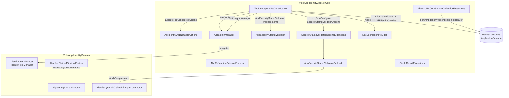

The `Volo.Abp.Identity.AspNetCore` project is the bridge between ABP's `Volo.Abp.Identity.Domain` (entities, managers, repository interfaces) and the ASP.NET Core authentication stack (`Microsoft.AspNetCore.Identity` + cookie schemes). It is *only* about composition — there is no entity, repository, or DTO in this assembly. What it does is configure `IdentityBuilder`, replace `SignInManager`, register a custom `SecurityStampValidator`, install the `IdentityConstants.ApplicationScheme` cookie scheme, and post‑configure `SecurityStampValidatorOptions` so that the dynamic‑claims pipeline (`IdentityDynamicClaimsPrincipalContributor`) re‑hydrates claims on every cookie refresh. This page walks every file in the project and shows the exact wiring order across `PreConfigureServices`, `ConfigureServices`, and `PostConfigureServices`.

<Info>
**Source root for this page:** [`modules/identity/src/Volo.Abp.Identity.AspNetCore/`](https://github.com/abpframework/abp/tree/dev/modules/identity/src/Volo.Abp.Identity.AspNetCore). `ls` of that folder shows two subtrees: `Volo/Abp/Identity/AspNetCore/` (the module + nine concrete classes) and `Microsoft/AspNetCore/Extensions/DependencyInjection/` (a single static extension class). Plus the usual `*.csproj`, `*.abppkg`, and `FodyWeavers.*` files.
</Info>

## Layout



The takeaway: the `Domain` module already calls `AddAbpIdentity(...).AddClaimsPrincipalFactory<AbpUserClaimsPrincipalFactory>()` (in `modules/identity/src/Volo.Abp.Identity.Domain/Microsoft/Extensions/DependencyInjection/AbpIdentityServiceCollectionExtensions.cs`). What this assembly adds is **the cookie / sign‑in / security‑stamp side** of the stack, plus the post‑configuration that keeps the dynamic claims (e.g. permission claims) intact across cookie validation refreshes.

## The csproj

`modules/identity/src/Volo.Abp.Identity.AspNetCore/Volo.Abp.Identity.AspNetCore.csproj` uses the `Microsoft.NET.Sdk.Web` SDK because it consumes ASP.NET Core types:

```xml
<Project Sdk="Microsoft.NET.Sdk.Web">

  <Import Project="..\..\..\..\configureawait.props" />
  <Import Project="..\..\..\..\common.props" />

  <PropertyGroup>
    <TargetFramework>net10.0</TargetFramework>
    <AssemblyName>Volo.Abp.Identity.AspNetCore</AssemblyName>
    <PackageId>Volo.Abp.Identity.AspNetCore</PackageId>
    <IsPackable>true</IsPackable>
    <OutputType>Library</OutputType>
    <RootNamespace />
  </PropertyGroup>

  <ItemGroup>
    <ProjectReference Include="..\Volo.Abp.Identity.Domain\Volo.Abp.Identity.Domain.csproj" />
  </ItemGroup>

</Project>
```

A single project reference — to `Volo.Abp.Identity.Domain` — and the root `common.props` import for package metadata (see [Build System](/overview/build-system)).

## `AbpIdentityAspNetCoreModule` — the wiring

`modules/identity/src/Volo.Abp.Identity.AspNetCore/Volo/Abp/Identity/AspNetCore/AbpIdentityAspNetCoreModule.cs` is the centerpiece. It implements all three lifecycle hooks and depends only on `AbpIdentityDomainModule`:

```csharp
// modules/identity/src/Volo.Abp.Identity.AspNetCore/Volo/Abp/Identity/AspNetCore/AbpIdentityAspNetCoreModule.cs
using System;
using Microsoft.AspNetCore.Identity;
using Microsoft.Extensions.DependencyInjection;
using Microsoft.Extensions.Options;
using Volo.Abp.Modularity;
using static Volo.Abp.Identity.AspNetCore.AbpSecurityStampValidatorCallback;

namespace Volo.Abp.Identity.AspNetCore;

[DependsOn(typeof(AbpIdentityDomainModule))]
public class AbpIdentityAspNetCoreModule : AbpModule
{
    public override void PreConfigureServices(ServiceConfigurationContext context)
    {
        PreConfigure<IdentityBuilder>(builder =>
        {
            builder
                .AddDefaultTokenProviders()
                .AddTokenProvider<LinkUserTokenProvider>(LinkUserTokenProviderConsts.LinkUserTokenProviderName)
                .AddSignInManager<AbpSignInManager>()
                .AddUserValidator<AbpIdentityUserValidator>();
        });
    }

    public override void ConfigureServices(ServiceConfigurationContext context)
    {
        context.Services.AddScoped<AbpSecurityStampValidator>();
        context.Services.AddScoped(typeof(SecurityStampValidator<IdentityUser>),
            provider => provider.GetService(typeof(AbpSecurityStampValidator)));
        context.Services.AddScoped(typeof(ISecurityStampValidator),
            provider => provider.GetService(typeof(AbpSecurityStampValidator)));

        var options = context.Services.ExecutePreConfiguredActions(new AbpIdentityAspNetCoreOptions());

        if (options.ConfigureAuthentication)
        {
            context.Services
                .AddAuthentication(o =>
                {
                    o.DefaultScheme = IdentityConstants.ApplicationScheme;
                    o.DefaultSignInScheme = IdentityConstants.ExternalScheme;
                })
                .AddIdentityCookies();
        }
    }

    public override void PostConfigureServices(ServiceConfigurationContext context)
    {
        context.Services.AddOptions<SecurityStampValidatorOptions>()
            .Configure<IServiceProvider>((securityStampValidatorOptions, serviceProvider) =>
            {
                var abpRefreshingPrincipalOptions = serviceProvider
                    .GetRequiredService<IOptions<AbpRefreshingPrincipalOptions>>().Value;
                securityStampValidatorOptions.UpdatePrincipal(abpRefreshingPrincipalOptions);
            });
    }
}
```

Three phases, each with a distinct job:

<Steps>
  <Step title="PreConfigureServices — IdentityBuilder">
    Runs *before* the host's `AddAbpIdentity()` finishes (because [pre‑configurations are applied during the call chain](/core/options-and-configuration)). It adds the link‑user token provider, replaces `SignInManager<IdentityUser>` with `AbpSignInManager`, and chains in `AbpIdentityUserValidator` (defined in `Volo.Abp.Identity.Domain`).
  </Step>
  <Step title="ConfigureServices — security stamp + cookies">
    Registers `AbpSecurityStampValidator` as the implementation for both `SecurityStampValidator<IdentityUser>` and `ISecurityStampValidator`. Then, gated on `AbpIdentityAspNetCoreOptions.ConfigureAuthentication`, calls `AddAuthentication(...).AddIdentityCookies()` to install the application, external, two‑factor‑user, and two‑factor‑remember‑me cookies that ASP.NET Core Identity ships.
  </Step>
  <Step title="PostConfigureServices — dynamic claims callback">
    Uses `AddOptions<SecurityStampValidatorOptions>().Configure<IServiceProvider>(...)` to call `UpdatePrincipal(abpRefreshingPrincipalOptions)` on the options. This chains an `OnRefreshingPrincipal` callback that keeps the previous principal's claims (notably `AbpClaimTypes.SessionId`) alive across re‑validation, which is what makes the dynamic‑claims pipeline survive cookie refreshes.
  </Step>
</Steps>

<Note>
The lifecycle order — `PreConfigureServices` → `ConfigureServices` → `PostConfigureServices` — is what allows this module to first *modify* the `IdentityBuilder` that downstream modules build, then *configure* the cookie scheme, then *patch* an option type owned by `Microsoft.AspNetCore.Identity` after the framework has had its say. See [Modularity](/core/modularity) for the call ordering.
</Note>

## `AbpIdentityAspNetCoreOptions` — opt out of cookies

`modules/identity/src/Volo.Abp.Identity.AspNetCore/Volo/Abp/Identity/AspNetCore/AbpIdentityAspNetCoreOptions.cs` is a five‑line POCO:

```csharp
// modules/identity/src/Volo.Abp.Identity.AspNetCore/Volo/Abp/Identity/AspNetCore/AbpIdentityAspNetCoreOptions.cs
namespace Volo.Abp.Identity.AspNetCore;

public class AbpIdentityAspNetCoreOptions
{
    /// <summary>
    /// Default: true.
    /// </summary>
    public bool ConfigureAuthentication { get; set; } = true;
}
```

Set `ConfigureAuthentication = false` from `PreConfigureServices` if your host already builds its own `AddAuthentication` pipeline (for example, an API host that uses JWT bearer only and forwards to the cookie via [`ForwardIdentityAuthenticationForBearer`](#bearer-cookie-forwarding) below).

## `AbpSignInManager`

`modules/identity/src/Volo.Abp.Identity.AspNetCore/Volo/Abp/Identity/AspNetCore/AbpSignInManager.cs` extends `SignInManager<IdentityUser>` to support **external login providers chained from the username/password flow** — useful for LDAP, Active Directory, or any other provider that authenticates by username and password. The class declaration:

```csharp
// modules/identity/src/Volo.Abp.Identity.AspNetCore/Volo/Abp/Identity/AspNetCore/AbpSignInManager.cs
public class AbpSignInManager : SignInManager<IdentityUser>
{
    protected AbpIdentityOptions AbpOptions { get; }
    protected ISettingProvider SettingProvider { get; }

    public AbpSignInManager(
        IdentityUserManager userManager,
        IHttpContextAccessor contextAccessor,
        IUserClaimsPrincipalFactory<IdentityUser> claimsFactory,
        IOptions<IdentityOptions> optionsAccessor,
        ILogger<SignInManager<IdentityUser>> logger,
        IAuthenticationSchemeProvider schemes,
        IUserConfirmation<IdentityUser> confirmation,
        IOptions<AbpIdentityOptions> options,
        ISettingProvider settingProvider)
        : base(userManager, contextAccessor, claimsFactory, optionsAccessor,
               logger, schemes, confirmation)
    {
        SettingProvider = settingProvider;
        AbpOptions = options.Value;
    }

    public async override Task<SignInResult> PasswordSignInAsync(
        string userName, string password,
        bool isPersistent, bool lockoutOnFailure)
    {
        foreach (var externalLoginProviderInfo in AbpOptions.ExternalLoginProviders.Values)
        {
            var externalLoginProvider = (IExternalLoginProvider)Context.RequestServices
                .GetRequiredService(externalLoginProviderInfo.Type);

            if (await externalLoginProvider.TryAuthenticateAsync(userName, password))
            {
                var user = await UserManager.FindByNameAsync(userName);
                // ... creates or updates the local user, then signs in
            }
        }
        return await base.PasswordSignInAsync(userName, password, isPersistent, lockoutOnFailure);
    }
    // ... more overrides
}
```

The constructor signature is the *full* `SignInManager<IdentityUser>` signature plus `IOptions<AbpIdentityOptions>` and `ISettingProvider`. The override of `PasswordSignInAsync` iterates `AbpIdentityOptions.ExternalLoginProviders` — see [Identity Managers](/modules/identity/managers) for how `IExternalLoginProvider` is registered.

## `AbpSecurityStampValidator`

`modules/identity/src/Volo.Abp.Identity.AspNetCore/Volo/Abp/Identity/AspNetCore/AbpSecurityStampValidator.cs` extends the framework `SecurityStampValidator<IdentityUser>` to make the validation **tenant‑aware**:

```csharp
// modules/identity/src/Volo.Abp.Identity.AspNetCore/Volo/Abp/Identity/AspNetCore/AbpSecurityStampValidator.cs
public class AbpSecurityStampValidator : SecurityStampValidator<IdentityUser>
{
    protected ITenantConfigurationProvider TenantConfigurationProvider { get; }
    protected ICurrentTenant CurrentTenant { get; }

    public AbpSecurityStampValidator(
        IOptions<SecurityStampValidatorOptions> options,
        SignInManager<IdentityUser> signInManager,
        ILoggerFactory loggerFactory,
        ITenantConfigurationProvider tenantConfigurationProvider,
        ICurrentTenant currentTenant)
        : base(options, signInManager, loggerFactory)
    {
        TenantConfigurationProvider = tenantConfigurationProvider;
        CurrentTenant = currentTenant;
    }

    [UnitOfWork]
    public async override Task ValidateAsync(CookieValidatePrincipalContext context)
    {
        TenantConfiguration tenant = null;
        try
        {
            tenant = await TenantConfigurationProvider.GetAsync(saveResolveResult: false);
        }
        catch (Exception e)
        {
            Logger.LogException(e);
        }

        using (CurrentTenant.Change(tenant?.Id, tenant?.Name))
        {
            await base.ValidateAsync(context);
        }
    }
}
```

The `[UnitOfWork]` attribute wraps the whole validation in an ABP unit of work, and `CurrentTenant.Change(...)` ensures the underlying database queries are issued against the correct tenant scope. Without this, every cookie validation on a tenant subdomain would either fail or query the host database.

## `AbpSecurityStampValidatorCallback` — keep claims across refresh

`modules/identity/src/Volo.Abp.Identity.AspNetCore/Volo/Abp/Identity/AspNetCore/AbpSecurityStampValidatorCallback.cs` defines the static method that the post‑configured `OnRefreshingPrincipal` calls. It exists to preserve claims that ASP.NET Core Identity does *not* re‑add when it rebuilds the principal from the user store:

```csharp
// modules/identity/src/Volo.Abp.Identity.AspNetCore/Volo/Abp/Identity/AspNetCore/AbpSecurityStampValidatorCallback.cs
public class AbpSecurityStampValidatorCallback
{
    /// Implements callback for SecurityStampValidator's OnRefreshingPrincipal event.
    /// https://github.com/IdentityServer/IdentityServer4/blob/main/src/AspNetIdentity/src/SecurityStampValidatorCallback.cs
    public class SecurityStampValidatorCallback
    {
        public static Task UpdatePrincipal(
            SecurityStampRefreshingPrincipalContext context,
            AbpRefreshingPrincipalOptions refreshingPrincipalOptions)
        {
            var newClaimTypes = context.NewPrincipal.Claims.Select(x => x.Type).ToArray();
            var currentClaimsToKeep = context.CurrentPrincipal.Claims
                .Where(x => !newClaimTypes.Contains(x.Type)).ToArray();

            var id = context.NewPrincipal.Identities.First();
            id.AddClaims(currentClaimsToKeep);

            if (refreshingPrincipalOptions.CurrentPrincipalKeepClaimTypes.Any())
            {
                foreach (var claimType in refreshingPrincipalOptions.CurrentPrincipalKeepClaimTypes)
                {
                    var sessionIdClaim = context.CurrentPrincipal.Claims
                        .FirstOrDefault(x => x.Type == claimType);
                    if (sessionIdClaim != null)
                    {
                        id.AddOrReplace(sessionIdClaim);
                    }
                }
            }

            return Task.CompletedTask;
        }
    }
}
```

In words: when the cookie middleware rebuilds the principal from the user store, copy every claim the *old* principal had that the new one doesn't — and **always** preserve the claim types listed in `AbpRefreshingPrincipalOptions.CurrentPrincipalKeepClaimTypes` (defaulting to `AbpClaimTypes.SessionId`). This is what keeps `IdentitySession` tracking working across browser sessions.

## `AbpRefreshingPrincipalOptions` — which claims to keep

`modules/identity/src/Volo.Abp.Identity.AspNetCore/Volo/Abp/Identity/AspNetCore/AbpRefreshingPrincipalOptions.cs` is the option type the callback above reads:

```csharp
// modules/identity/src/Volo.Abp.Identity.AspNetCore/Volo/Abp/Identity/AspNetCore/AbpRefreshingPrincipalOptions.cs
using System.Collections.Generic;
using Volo.Abp.Security.Claims;

namespace Volo.Abp.Identity.AspNetCore;

public class AbpRefreshingPrincipalOptions
{
    public List<string> CurrentPrincipalKeepClaimTypes { get; set; }

    public AbpRefreshingPrincipalOptions()
    {
        CurrentPrincipalKeepClaimTypes = new List<string>
        {
            AbpClaimTypes.SessionId
        };
    }
}
```

`AbpClaimTypes.SessionId` is the one claim type that *must* survive — it's what links the principal back to its `IdentitySession` row. Add more claim types here if your app issues custom claims at login that you want to preserve (e.g. an `impersonator_id` you set during impersonation).

## `SecurityStampValidatorOptionsExtensions` — chain the callback

`modules/identity/src/Volo.Abp.Identity.AspNetCore/Volo/Abp/Identity/AspNetCore/SecurityStampValidatorOptionsExtensions.cs` is the glue between the module's `PostConfigureServices` and the callback. It chains a new `OnRefreshingPrincipal` *after* whatever was already there:

```csharp
// modules/identity/src/Volo.Abp.Identity.AspNetCore/Volo/Abp/Identity/AspNetCore/SecurityStampValidatorOptionsExtensions.cs
public static class SecurityStampValidatorOptionsExtensions
{
    public static SecurityStampValidatorOptions UpdatePrincipal(
        this SecurityStampValidatorOptions options,
        AbpRefreshingPrincipalOptions abpRefreshingPrincipalOptions)
    {
        var previousOnRefreshingPrincipal = options.OnRefreshingPrincipal;
        options.OnRefreshingPrincipal = async context =>
        {
            await SecurityStampValidatorCallback.UpdatePrincipal(context, abpRefreshingPrincipalOptions);
            if (previousOnRefreshingPrincipal != null)
            {
                await previousOnRefreshingPrincipal.Invoke(context);
            }
        };
        return options;
    }
}
```

By preserving `previousOnRefreshingPrincipal`, this extension is safe to call multiple times — useful if other modules (e.g. an OpenIddict integration) also want to hook the same event.

## `LinkUserTokenProvider`

`modules/identity/src/Volo.Abp.Identity.AspNetCore/Volo/Abp/Identity/AspNetCore/LinkUserTokenProvider.cs` is a one‑line derivation of `DataProtectorTokenProvider<IdentityUser>` used by the user‑linking feature (cross‑tenant linked users — see [Identity entities](/modules/identity/entities) for `IdentityLinkUser`):

```csharp
// modules/identity/src/Volo.Abp.Identity.AspNetCore/Volo/Abp/Identity/AspNetCore/LinkUserTokenProvider.cs
public class LinkUserTokenProvider : DataProtectorTokenProvider<IdentityUser>
{
    public LinkUserTokenProvider(
        IDataProtectionProvider dataProtectionProvider,
        IOptions<DataProtectionTokenProviderOptions> options,
        ILogger<DataProtectorTokenProvider<IdentityUser>> logger)
        : base(dataProtectionProvider, options, logger) { }
}
```

The module registers it via `AddTokenProvider<LinkUserTokenProvider>(LinkUserTokenProviderConsts.LinkUserTokenProviderName)` in `PreConfigureServices`, so `UserManager<IdentityUser>` can mint and validate user‑link tokens.

## `SignInResultExtensions` — sign‑in → security‑log mapping

`modules/identity/src/Volo.Abp.Identity.AspNetCore/Volo/Abp/Identity/AspNetCore/SignInResultExtensions.cs` maps a `SignInResult` to one of the `IdentitySecurityLogActionConsts`, so that the [Account module](/modules/account/overview) can write a uniform security log row for every sign‑in outcome:

```csharp
// modules/identity/src/Volo.Abp.Identity.AspNetCore/Volo/Abp/Identity/AspNetCore/SignInResultExtensions.cs
public static class SignInResultExtensions
{
    public static string ToIdentitySecurityLogAction(this SignInResult result)
    {
        if (result.Succeeded)       return IdentitySecurityLogActionConsts.LoginSucceeded;
        if (result.IsLockedOut)     return IdentitySecurityLogActionConsts.LoginLockedout;
        if (result.RequiresTwoFactor) return IdentitySecurityLogActionConsts.LoginRequiresTwoFactor;
        if (result.IsNotAllowed)    return IdentitySecurityLogActionConsts.LoginNotAllowed;
        if (!result.Succeeded)      return IdentitySecurityLogActionConsts.LoginFailed;
        return IdentitySecurityLogActionConsts.LoginFailed;
    }
}
```

## Bearer ↔ cookie forwarding {#bearer-cookie-forwarding}

`modules/identity/src/Volo.Abp.Identity.AspNetCore/Microsoft/AspNetCore/Extensions/DependencyInjection/AbpAspNetCoreServiceCollectionExtensions.cs` is the *only* file outside the `Volo/Abp/Identity/AspNetCore/` subtree. It exposes a single helper:

```csharp
// modules/identity/src/Volo.Abp.Identity.AspNetCore/Microsoft/AspNetCore/Extensions/DependencyInjection/AbpAspNetCoreServiceCollectionExtensions.cs
using System;
using Microsoft.Extensions.DependencyInjection;

namespace Microsoft.AspNetCore.Extensions.DependencyInjection;

public static class AbpAspNetCoreServiceCollectionExtensions
{
    public static IServiceCollection ForwardIdentityAuthenticationForBearer(
        this IServiceCollection services, string jwtBearerScheme = "Bearer")
    {
        services.ConfigureApplicationCookie(options =>
        {
            options.ForwardDefaultSelector = ctx =>
            {
                string authorization = ctx.Request.Headers.Authorization;
                if (!authorization.IsNullOrWhiteSpace()
                    && authorization.StartsWith("Bearer ", StringComparison.OrdinalIgnoreCase))
                {
                    return jwtBearerScheme;
                }

                return null;
            };
        });

        return services;
    }
}
```

This is the canonical fix for the "API host wants cookies *and* JWT" scenario: cookies handle browser sessions, and any request with an `Authorization: Bearer …` header is forwarded to the JWT scheme instead. Without this, ASP.NET Core would unconditionally try the application cookie and 401 on API calls. The namespace is intentionally `Microsoft.AspNetCore.Extensions.DependencyInjection` so the extension shows up on `IServiceCollection` in any host that imports that namespace.

## Dynamic claims — how the pieces meet

The "dynamic claims" pipeline does not live in this assembly — it lives in `Volo.Abp.Identity.Domain` as `IdentityDynamicClaimsPrincipalContributor` (`modules/identity/src/Volo.Abp.Identity.Domain/Volo/Abp/Identity/IdentityDynamicClaimsPrincipalContributor.cs`). What `Volo.Abp.Identity.AspNetCore` does is make sure that contributor's effects survive ASP.NET Core's cookie validation:

```csharp
// modules/identity/src/Volo.Abp.Identity.Domain/Volo/Abp/Identity/IdentityDynamicClaimsPrincipalContributor.cs (excerpt)
public class IdentityDynamicClaimsPrincipalContributor : AbpDynamicClaimsPrincipalContributorBase
{
    public async override Task ContributeAsync(AbpClaimsPrincipalContributorContext context)
    {
        var identity = context.ClaimsPrincipal.Identities.FirstOrDefault();
        var userId = identity?.FindUserId();
        if (userId == null) return;

        var dynamicClaimsCache = context.GetRequiredService<IdentityDynamicClaimsPrincipalContributorCache>();
        var dynamicClaims = await dynamicClaimsCache.GetAsync(userId.Value, identity.FindTenantId());

        if (dynamicClaims.Claims.IsNullOrEmpty()) return;
        await AddDynamicClaimsAsync(context, identity, dynamicClaims.Claims);
    }
}
```

The contributor runs whenever `IAbpClaimsPrincipalFactory` builds a principal. The bridge between cookie refresh and contributor is:

<Steps>
  <Step title="Cookie validation triggers SecurityStampValidator">
    `AbpSecurityStampValidator.ValidateAsync` runs inside a `CurrentTenant.Change(...)` scope.
  </Step>
  <Step title="Identity rebuilds the principal">
    `SecurityStampValidator<IdentityUser>` calls the inner `SignInManager.CreateUserPrincipalAsync(user)`, which calls `IUserClaimsPrincipalFactory<IdentityUser>` — already replaced by `AbpUserClaimsPrincipalFactory`.
  </Step>
  <Step title="AbpUserClaimsPrincipalFactory delegates to IAbpClaimsPrincipalFactory">
    `modules/identity/src/Volo.Abp.Identity.Domain/Volo/Abp/Identity/AbpUserClaimsPrincipalFactory.cs` chains in every registered `IAbpClaimsPrincipalContributor`, including `IdentityDynamicClaimsPrincipalContributor`.
  </Step>
  <Step title="OnRefreshingPrincipal preserves session claim">
    The `SecurityStampValidatorOptions.OnRefreshingPrincipal` chained in `PostConfigureServices` invokes `AbpSecurityStampValidatorCallback.UpdatePrincipal`, which copies leftover claims and forces `AbpClaimTypes.SessionId` to come from the *current* principal.
  </Step>
</Steps>

The net effect: a long‑lived cookie keeps its `SessionId` claim, and every cookie refresh re‑hydrates permission claims from the database via `IdentityDynamicClaimsPrincipalContributorCache`.

## How `Volo.Abp.Identity.Domain` registers the factory

For completeness, here is the registration this assembly relies on, in `modules/identity/src/Volo.Abp.Identity.Domain/Microsoft/Extensions/DependencyInjection/AbpIdentityServiceCollectionExtensions.cs`:

```csharp
public static IdentityBuilder AddAbpIdentity(this IServiceCollection services,
    Action<IdentityOptions> setupAction)
{
    services.TryAddScoped<IdentityRoleManager>();
    services.TryAddScoped(typeof(RoleManager<IdentityRole>),
        provider => provider.GetService(typeof(IdentityRoleManager)));

    services.TryAddScoped<IdentityUserManager>();
    services.TryAddScoped(typeof(UserManager<IdentityUser>),
        provider => provider.GetService(typeof(IdentityUserManager)));

    services.TryAddScoped<IdentityUserStore>();
    services.TryAddScoped(typeof(IUserStore<IdentityUser>),
        provider => provider.GetService(typeof(IdentityUserStore)));

    services.TryAddScoped<IdentityRoleStore>();
    services.TryAddScoped(typeof(IRoleStore<IdentityRole>),
        provider => provider.GetService(typeof(IdentityRoleStore)));

    return services
        .AddIdentityCore<IdentityUser>(setupAction)
        .AddRoles<IdentityRole>()
        .AddClaimsPrincipalFactory<AbpUserClaimsPrincipalFactory>();
}
```

`AddIdentityCore<IdentityUser>().AddRoles<IdentityRole>().AddClaimsPrincipalFactory<AbpUserClaimsPrincipalFactory>()` is the seed `IdentityBuilder` that this module's `PreConfigure<IdentityBuilder>(builder => ...)` further mutates.

## Customising the pipeline

<Accordion title="Disable the built-in cookie wiring">
```csharp
public override void PreConfigureServices(ServiceConfigurationContext context)
{
    PreConfigure<AbpIdentityAspNetCoreOptions>(options =>
    {
        options.ConfigureAuthentication = false;
    });
}
```
Useful when your host already calls `AddAuthentication` — for example an API host that wants only JWT.
</Accordion>

<Accordion title="Add an extra claim to keep across refresh">
```csharp
Configure<AbpRefreshingPrincipalOptions>(options =>
{
    options.CurrentPrincipalKeepClaimTypes.Add("impersonator_user_id");
});
```
The callback in `AbpSecurityStampValidatorCallback` will then copy `impersonator_user_id` from the old principal to the new one on every cookie refresh.
</Accordion>

<Accordion title="Forward bearer requests to JWT in an API host">
```csharp
// HttpApi.Host module
public override void ConfigureServices(ServiceConfigurationContext context)
{
    context.Services.ForwardIdentityAuthenticationForBearer();
}
```
A request with `Authorization: Bearer …` skips the cookie scheme entirely.
</Accordion>

<Accordion title="Plug in an external login provider">
External login providers are registered through `AbpIdentityOptions.ExternalLoginProviders`; `AbpSignInManager.PasswordSignInAsync` will call them before the local credential check. See [Identity Managers](/modules/identity/managers).
</Accordion>

## File map

<CardGroup cols={2}>
  <Card title="AbpIdentityAspNetCoreModule.cs" icon="screwdriver-wrench">
    The module — `PreConfigureServices` (`IdentityBuilder`), `ConfigureServices` (cookies + security stamp), `PostConfigureServices` (refresh callback).
  </Card>
  <Card title="AbpIdentityAspNetCoreOptions.cs" icon="toggle-on">
    Single `ConfigureAuthentication` switch. Default `true`.
  </Card>
  <Card title="AbpRefreshingPrincipalOptions.cs" icon="list-check">
    `CurrentPrincipalKeepClaimTypes` list — defaults to `AbpClaimTypes.SessionId`.
  </Card>
  <Card title="AbpSignInManager.cs" icon="right-to-bracket">
    Replacement for `SignInManager<IdentityUser>` with external‑login‑provider chaining.
  </Card>
  <Card title="AbpSecurityStampValidator.cs" icon="shield">
    Tenant‑aware override of `SecurityStampValidator<IdentityUser>`.
  </Card>
  <Card title="AbpSecurityStampValidatorCallback.cs" icon="rotate">
    Static `UpdatePrincipal` — preserves claim types across refresh.
  </Card>
  <Card title="SecurityStampValidatorOptionsExtensions.cs" icon="link">
    Chains `OnRefreshingPrincipal` to call the callback above.
  </Card>
  <Card title="LinkUserTokenProvider.cs" icon="link-simple">
    Data‑protector‑backed token provider for cross‑tenant user linking.
  </Card>
  <Card title="SignInResultExtensions.cs" icon="scroll">
    `SignInResult → IdentitySecurityLogActionConsts` mapping.
  </Card>
  <Card title="AbpAspNetCoreServiceCollectionExtensions.cs" icon="arrow-right-arrow-left">
    `ForwardIdentityAuthenticationForBearer` — cookie‑to‑JWT forwarding.
  </Card>
</CardGroup>

## What's next

<CardGroup cols={2}>
  <Card title="Identity Managers" icon="gears" href="/modules/identity/managers">
    `IdentityUserManager`, `IdentityRoleManager`, `IExternalLoginProvider` — the domain services that `AbpSignInManager` calls.
  </Card>
  <Card title="Identity Domain" icon="cubes" href="/modules/identity/domain">
    `AbpUserClaimsPrincipalFactory`, `IdentityDynamicClaimsPrincipalContributor`, and the dynamic‑claims cache.
  </Card>
  <Card title="Identity HTTP API" icon="plug" href="/modules/identity/http-api">
    The MVC controllers and pages that depend on the cookie scheme this module installs.
  </Card>
  <Card title="Architecture & Lifecycle" icon="diagram-project" href="/overview/architecture">
    How `PreConfigureServices` / `ConfigureServices` / `PostConfigureServices` are sequenced across modules.
  </Card>
</CardGroup>
