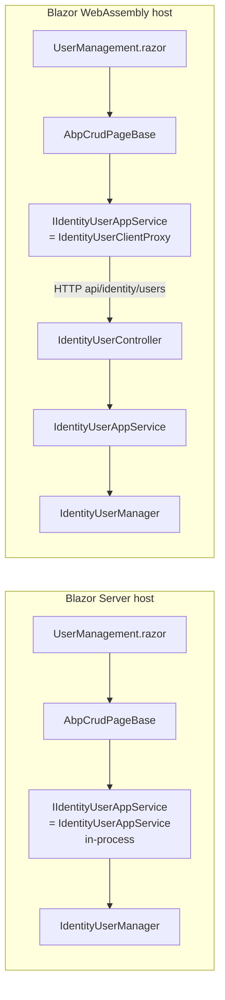

The Identity module ships a Blazor management UI across three projects under `modules/identity/src/`: **`Volo.Abp.Identity.Blazor`** (the shared `.razor` components and the framework module), **`Volo.Abp.Identity.Blazor.Server`** (the Blazor Server hosting module), and **`Volo.Abp.Identity.Blazor.WebAssembly`** (the WASM hosting module). The first project is where almost all the code lives; the other two are tiny: they only `[DependsOn]` the shared module plus the matching hosting module from `Volo.Abp.PermissionManagement.Blazor.*`.

Like the [Razor Pages UI](/modules/identity/web-ui), the open‑source Blazor UI exposes **two** management pages — `UserManagement` and `RoleManagement`. Profile, ClaimType, SecurityLog, Session, and OrganizationUnit screens are part of the commercial Identity Pro module and are not in this project.

<Info>
**Source roots:** [`modules/identity/src/Volo.Abp.Identity.Blazor/`](https://github.com/abpframework/abp/tree/dev/modules/identity/src/Volo.Abp.Identity.Blazor), [`Volo.Abp.Identity.Blazor.Server/`](https://github.com/abpframework/abp/tree/dev/modules/identity/src/Volo.Abp.Identity.Blazor.Server), [`Volo.Abp.Identity.Blazor.WebAssembly/`](https://github.com/abpframework/abp/tree/dev/modules/identity/src/Volo.Abp.Identity.Blazor.WebAssembly). All pages are under `Pages/Identity/`.
</Info>

## Project layout

| Project | Purpose | Key types |
| --- | --- | --- |
| `Volo.Abp.Identity.Blazor` | The actual UI. Razor components, menu contributor, framework module. | `AbpIdentityBlazorModule`, `AbpIdentityWebMainMenuContributor`, `UserManagement`, `RoleManagement`, `RoleNameComponent`. |
| `Volo.Abp.Identity.Blazor.Server` | Bridges the shared UI into a Blazor Server host. | `AbpIdentityBlazorServerModule` (depends on `AbpIdentityBlazorModule` + `AbpPermissionManagementBlazorServerModule`). |
| `Volo.Abp.Identity.Blazor.WebAssembly` | Bridges into a Blazor WebAssembly host and adds the HTTP API client. | `AbpIdentityBlazorWebAssemblyModule` (depends on the shared module + `AbpPermissionManagementBlazorWebAssemblyModule` + `AbpIdentityHttpApiClientModule`). |

The split exists because Blazor Server can resolve `IIdentityUserAppService` in‑process, while WASM needs the HTTP client proxies — both hosting modules share the same UI components.

## `AbpIdentityBlazorModule`

`modules/identity/src/Volo.Abp.Identity.Blazor/AbpIdentityBlazorModule.cs`:

```csharp
[DependsOn(
    typeof(AbpIdentityApplicationContractsModule),
    typeof(AbpMapperlyModule),
    typeof(AbpPermissionManagementBlazorModule),
    typeof(AbpBlazoriseUIModule)
    )]
public class AbpIdentityBlazorModule : AbpModule
{
    private static readonly OneTimeRunner OneTimeRunner = new OneTimeRunner();

    public override void ConfigureServices(ServiceConfigurationContext context)
    {
        context.Services.AddMapperlyObjectMapper<AbpIdentityBlazorModule>();

        Configure<AbpNavigationOptions>(options =>
        {
            options.MenuContributors.Add(new AbpIdentityWebMainMenuContributor());
        });

        Configure<AbpRouterOptions>(options =>
        {
            options.AdditionalAssemblies.Add(typeof(AbpIdentityBlazorModule).Assembly);
        });

        Configure<AbpLocalizationOptions>(options =>
        {
            options.Resources
                .Get<IdentityResource>()
                .AddBaseTypes(
                    typeof(AbpUiResource)
                );
        });
    }

    public override void PostConfigureServices(ServiceConfigurationContext context)
    {
        OneTimeRunner.Run(() =>
        {
            ModuleExtensionConfigurationHelper
                .ApplyEntityConfigurationToUi(
                    IdentityModuleExtensionConsts.ModuleName,
                    IdentityModuleExtensionConsts.EntityNames.Role,
                    createFormTypes: new[] { typeof(IdentityRoleCreateDto) },
                    editFormTypes: new[] { typeof(IdentityRoleUpdateDto) }
                );

            ModuleExtensionConfigurationHelper
                .ApplyEntityConfigurationToUi(
                    IdentityModuleExtensionConsts.ModuleName,
                    IdentityModuleExtensionConsts.EntityNames.User,
                    createFormTypes: new[] { typeof(IdentityUserCreateDto) },
                    editFormTypes: new[] { typeof(IdentityUserUpdateDto) }
                );
        });
    }
}
```

Four things to notice:

1. **`AbpRouterOptions.AdditionalAssemblies`** — Blazor's router uses reflection over the host's assembly to discover `@page` routes; ABP's `AbpRouter` lets module assemblies add their own. This is what makes `/identity/users` resolvable without the host re‑declaring the route.
2. **`AbpNavigationOptions.MenuContributors`** — the Blazor menu contributor (a separate class from the MVC one) renders the same Administration → Identity Management → Roles/Users tree.
3. **`AddMapperlyObjectMapper<AbpIdentityBlazorModule>()`** — Mapperly mappings are registered for any view models defined in this assembly.
4. **`ApplyEntityConfigurationToUi(...)` for User and Role** — passes the create / update DTOs directly (not a separate view‑model class as in MVC) because the Blazor pages bind directly to the DTOs.

## Hosting modules

`modules/identity/src/Volo.Abp.Identity.Blazor.Server/AbpIdentityBlazorServerModule.cs`:

```csharp
[DependsOn(
    typeof(AbpIdentityBlazorModule),
    typeof(AbpPermissionManagementBlazorServerModule)
)]
public class AbpIdentityBlazorServerModule : AbpModule
{
}
```

Nothing else. In a Blazor Server host, `IIdentityUserAppService` is the in‑process implementation from `Volo.Abp.Identity.Application` — typically referenced by the same host.

`modules/identity/src/Volo.Abp.Identity.Blazor.WebAssembly/AbpIdentityBlazorWebAssemblyModule.cs`:

```csharp
[DependsOn(
    typeof(AbpIdentityBlazorModule),
    typeof(AbpPermissionManagementBlazorWebAssemblyModule),
    typeof(AbpIdentityHttpApiClientModule)
)]
public class AbpIdentityBlazorWebAssemblyModule : AbpModule
{
}
```

The extra dependency on `AbpIdentityHttpApiClientModule` is what registers `IdentityUserClientProxy` against `IIdentityUserAppService` (see [HTTP API](/modules/identity/http-api)). The same `UserManagement` component then runs unchanged against a remote API.

## Menu contributor

`modules/identity/src/Volo.Abp.Identity.Blazor/AbpIdentityWebMainMenuContributor.cs`:

```csharp
public class AbpIdentityWebMainMenuContributor : IMenuContributor
{
    public virtual Task ConfigureMenuAsync(MenuConfigurationContext context)
    {
        if (context.Menu.Name != StandardMenus.Main)
        {
            return Task.CompletedTask;
        }

        var administrationMenu = context.Menu.GetAdministration();

        var l = context.GetLocalizer<IdentityResource>();

        var identityMenuItem = new ApplicationMenuItem(IdentityMenuNames.GroupName, l["Menu:IdentityManagement"],
            icon: "far fa-id-card");
        administrationMenu.AddItem(identityMenuItem);

        identityMenuItem.AddItem(new ApplicationMenuItem(
                IdentityMenuNames.Roles,
                l["Roles"],
                url: "~/identity/roles").RequirePermissions(IdentityPermissions.Roles.Default));

        identityMenuItem.AddItem(new ApplicationMenuItem(
            IdentityMenuNames.Users,
            l["Users"],
            url: "~/identity/users").RequirePermissions(IdentityPermissions.Users.Default));

        return Task.CompletedTask;
    }
}
```

It mirrors the MVC version but the URLs are lowercase to match the Blazor router conventions. `IdentityMenuNames` is defined locally in `modules/identity/src/Volo.Abp.Identity.Blazor/IdentityMenuNames.cs` (a separate file from the MVC `Navigation/IdentityMenuNames.cs` — they're distinct types in distinct assemblies; both happen to share the same string values).

## `UserManagement.razor`

`modules/identity/src/Volo.Abp.Identity.Blazor/Pages/Identity/UserManagement.razor` declares the `@page` route and inherits the ABP generic CRUD base class:

```razor
@page "/identity/users"
@attribute [Authorize(IdentityPermissions.Users.Default)]
@inherits AbpCrudPageBase<IIdentityUserAppService, IdentityUserDto, Guid,
    GetIdentityUsersInput, IdentityUserCreateDto, IdentityUserUpdateDto>
```

That `@inherits` line is the heart of it — `AbpCrudPageBase` (from `Volo.Abp.AspNetCore.Components.Web`) gives you `Entities`, `TotalCount`, `CurrentPage`, `OpenCreateModalAsync`, `OpenEditModalAsync`, `DeleteEntityAsync`, the `Toolbar`, the `BreadcrumbItems`, and all the wiring to call the matching app service interface (`IIdentityUserAppService`).

### Code‑behind constructor

`modules/identity/src/Volo.Abp.Identity.Blazor/Pages/Identity/UserManagement.razor.cs` wires the permission policy names and the mapper context:

```csharp
public UserManagement()
{
    ObjectMapperContext = typeof(AbpIdentityBlazorModule);
    LocalizationResource = typeof(IdentityResource);

    CreatePolicyName = IdentityPermissions.Users.Create;
    UpdatePolicyName = IdentityPermissions.Users.Update;
    DeletePolicyName = IdentityPermissions.Users.Delete;
    ManagePermissionsPolicyName = IdentityPermissions.Users.ManagePermissions;
}
```

The base class evaluates `CreatePolicyName` / `UpdatePolicyName` / `DeletePolicyName` against `IAuthorizationService` and sets `HasCreatePermission` / `HasUpdatePermission` / `HasDeletePermission` flags, which the markup uses to toggle button visibility. The custom `ManagePermissionsPolicyName` is opened against an extra flag the page computes itself:

```csharp
protected override async Task SetPermissionsAsync()
{
    await base.SetPermissionsAsync();

    HasManagePermissionsPermission =
        await AuthorizationService.IsGrantedAsync(IdentityPermissions.Users.ManagePermissions);
}
```

### Loading assignable roles

The component asks the application service for the role list once, on init:

```csharp
protected override async Task OnInitializedAsync()
{
    await base.OnInitializedAsync();

    try
    {
        Roles = (await AppService.GetAssignableRolesAsync()).Items;
    }
    catch (Exception ex)
    {
        await HandleErrorAsync(ex);
    }
}
```

Each time the Create modal opens, `OpenCreateModalAsync` builds an `AssignedRoleViewModel[]` pre‑checked with the roles that have `IsDefault = true`:

```csharp
protected override async Task OpenCreateModalAsync()
{
    CreateModalSelectedTab = DefaultSelectedTab;

    NewUserRoles = Roles.Select(x => new AssignedRoleViewModel
    {
        Name = x.Name,
        IsAssigned = x.IsDefault
    }).ToArray();

    ChangePasswordTextRole(TextRole.Password);
    await base.OpenCreateModalAsync();

    NewEntity.IsActive = true;
    NewEntity.LockoutEnabled = true;
}
```

On save the same method's `OnCreatingEntityAsync` hook copies the chosen roles back into the DTO:

```csharp
protected override Task OnCreatingEntityAsync()
{
    NewEntity.RoleNames = NewUserRoles.Where(x => x.IsAssigned).Select(x => x.Name).ToArray();
    return base.OnCreatingEntityAsync();
}
```

`AbpCrudPageBase` then calls `AppService.CreateAsync(NewEntity)` — `AppService` being `IIdentityUserAppService`, which in Server is the application service and in WASM is the `IdentityUserClientProxy`.

### Entity actions and table columns

The page registers three actions in `SetEntityActionsAsync` — Edit, Permissions (opens the `PermissionManagementModal`), and Delete — gated by the appropriate flag plus a self‑delete guard:

```csharp
new EntityAction
{
    Text = L["Delete"],
    Visible = (data) => HasDeletePermission && CurrentUser.GetId() != data.As<IdentityUserDto>().Id,
    Clicked = async (data) => await DeleteEntityAsync(data.As<IdentityUserDto>()),
    ConfirmationMessage = (data) => GetDeleteConfirmationMessage(data.As<IdentityUserDto>())
}
```

`GetDeleteConfirmationMessage` localizes through `IdentityResource`:

```csharp
protected override string GetDeleteConfirmationMessage(IdentityUserDto entity)
{
    return string.Format(L["UserDeletionConfirmationMessage"], entity.UserName);
}
```

`SetTableColumnsAsync` declares the columns (Actions, UserName, Email, PhoneNumber) and then merges in any extension columns:

```csharp
UserManagementTableColumns.AddRange(await GetExtensionTableColumnsAsync(IdentityModuleExtensionConsts.ModuleName,
    IdentityModuleExtensionConsts.EntityNames.User));
```

So a custom property registered with `ObjectExtensionManager.Instance.AddOrUpdateProperty<IdentityUser, T>(...)` and flagged for the grid will appear here automatically.

### Toolbar

`SetToolbarItemsAsync` adds the green "+ New User" button:

```csharp
protected override ValueTask SetToolbarItemsAsync()
{
    Toolbar.AddButton(L["NewUser"], OpenCreateModalAsync,
        IconName.Add,
        requiredPolicyName: CreatePolicyName);

    return base.SetToolbarItemsAsync();
}
```

The `requiredPolicyName` makes the button invisible to users without `IdentityPermissions.Users.Create`.

## `RoleManagement.razor`

The role page follows the same pattern with less ceremony — there are no role list, roles, or self‑delete guard to worry about.

`modules/identity/src/Volo.Abp.Identity.Blazor/Pages/Identity/RoleManagement.razor`:

```razor
@page "/identity/roles"
@attribute [Authorize(IdentityPermissions.Roles.Default)]
@inherits AbpCrudPageBase<IIdentityRoleAppService, IdentityRoleDto, Guid,
    GetIdentityRolesInput, IdentityRoleCreateDto, IdentityRoleUpdateDto>
```

Code‑behind constructor:

```csharp
public RoleManagement()
{
    ObjectMapperContext = typeof(AbpIdentityBlazorModule);
    LocalizationResource = typeof(IdentityResource);

    CreatePolicyName = IdentityPermissions.Roles.Create;
    UpdatePolicyName = IdentityPermissions.Roles.Update;
    DeletePolicyName = IdentityPermissions.Roles.Delete;
    ManagePermissionsPolicyName = IdentityPermissions.Roles.ManagePermissions;
}
```

The breadcrumb path it builds is **Administration → Identity Management → Roles**. The entity actions are Edit + Permissions + Delete, and the table column is `RoleName` plus the extension columns.

A small companion `modules/identity/src/Volo.Abp.Identity.Blazor/Pages/Identity/RoleNameComponent.razor` renders the role pill with the `IsDefault` / `IsPublic` flag badges — it's reused outside the role page (for example by the user edit dialog) so it lives next to the role page rather than inline.

## Permission Management modal

Both pages keep a reference to a `PermissionManagementModal` (from `AbpPermissionManagementBlazorModule`) and open it from the action menu:

```csharp
new EntityAction
{
    Text = L["Permissions"],
    Visible = (data) => HasManagePermissionsPermission,
    Clicked = async (data) =>
    {
        await PermissionManagementModal.OpenAsync(PermissionProviderName,
            data.As<IdentityUserDto>().Id.ToString(),
            data.As<IdentityUserDto>().UserName);
    }
}
```

`PermissionProviderName = "U"` for users, `"R"` for roles — these match the two `IPermissionManagementProvider` strings registered by `Volo.Abp.PermissionManagement.Identity`. See [Permission management](/security/permissions) for the wider story.

## Server vs WebAssembly request flow



The Razor component (`UserManagement.razor`) is the **same file** in both hosts — the only difference is which `IIdentityUserAppService` implementation DI hands the base class.

## Extending the Blazor UI

Same pattern as the [Razor Pages UI](/modules/identity/web-ui):

- **New column on the grid** — register the property with `ObjectExtensionManager.Instance.AddOrUpdateProperty<IdentityUser, T>(p => { p.UI.OnTable.IsVisible = true; })`. `GetExtensionTableColumnsAsync` will pick it up.
- **New field on the create / edit modal** — same registration, with `p.UI.OnCreateForm.IsVisible = true`. The modal renders extension fields via `<ExtensibleFormFields />` already declared in `UserManagement.razor`.
- **Custom toolbar button** — `Configure<AbpPageToolbarOptions>(options => options.Configure<Volo.Abp.Identity.Blazor.Pages.Identity.UserManagement>(t => t.AddButton(...)))` in your own module.
- **Replace the component** — Blazor supports component substitution via `@inherits` plus a small DI trick; the cleanest path is to register a derived component and route it to `/identity/users` ahead of the shipped one by removing the default page in `AbpRouterOptions`.

## Related pages

- [Identity overview](/modules/identity/overview)
- [Application layer](/modules/identity/application) — the services the components call.
- [HTTP API](/modules/identity/http-api) — the proxies used by the WASM host.
- [Web UI](/modules/identity/web-ui) — the MVC equivalent of these pages.
- [Entities](/modules/identity/entities), [Managers](/modules/identity/managers), [Domain](/modules/identity/domain)
- [Permission management](/security/permissions) — what the "Permissions" entity action opens.
- [Account module](/modules/account/overview) — the login UI in front of these pages.
- [OpenIddict module](/modules/openiddict/overview) — issues the bearer tokens carried by WASM proxy calls.
