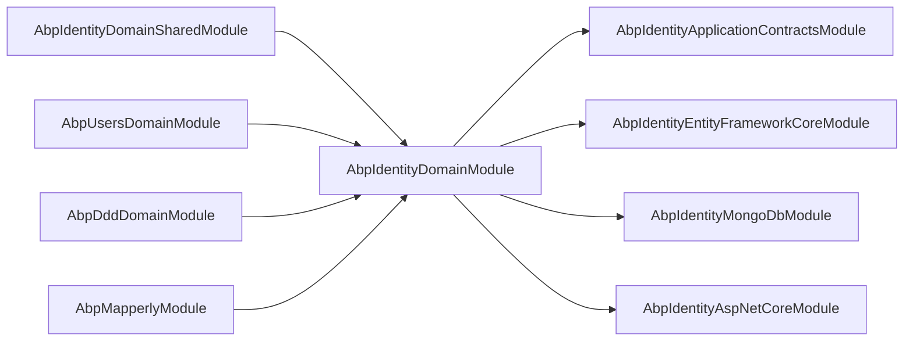

This page covers the supporting types in `modules/identity/src/Volo.Abp.Identity.Domain/Volo/Abp/Identity/` that are **not** entities or managers. These are the integration points the rest of ABP — and your custom code — uses to extend the Identity module: the module class, options, the localized error descriptor, the claims principal factory, the dynamic-claims pipeline, the setting provider, and the external-login contract.

For the aggregates themselves see [entities](/modules/identity/entities); for `IdentityUserManager` and friends see [managers](/modules/identity/managers).

## `AbpIdentityDomainModule`

File: `AbpIdentityDomainModule.cs`. This is the bootstrap of the domain layer. Every other Identity project depends on it.

```csharp
[DependsOn(
    typeof(AbpDddDomainModule),
    typeof(AbpIdentityDomainSharedModule),
    typeof(AbpUsersDomainModule),
    typeof(AbpMapperlyModule)
)]
public class AbpIdentityDomainModule : AbpModule
{
    private static readonly OneTimeRunner OneTimeRunner = new OneTimeRunner();

    public override void PreConfigureServices(ServiceConfigurationContext context)
    {
        PreConfigure<AbpClaimsPrincipalFactoryOptions>(options =>
        {
            options.IsRemoteRefreshEnabled = false;
        });
    }

    public override void ConfigureServices(ServiceConfigurationContext context)
    {
        context.Services.AddMapperlyObjectMapper<AbpIdentityDomainModule>();

        Configure<AbpDistributedEntityEventOptions>(options =>
        {
            options.EtoMappings.Add<IdentityUser, UserEto>(typeof(AbpIdentityDomainModule));
            options.EtoMappings.Add<IdentityClaimType, IdentityClaimTypeEto>(typeof(AbpIdentityDomainModule));
            options.EtoMappings.Add<IdentityRole, IdentityRoleEto>(typeof(AbpIdentityDomainModule));
            options.EtoMappings.Add<OrganizationUnit, OrganizationUnitEto>(typeof(AbpIdentityDomainModule));

            options.AutoEventSelectors.Add<IdentityUser>();
            options.AutoEventSelectors.Add<IdentityRole>();
        });

        var identityBuilder = context.Services.AddAbpIdentity(options =>
        {
            options.User.RequireUniqueEmail = true;
        });

        context.Services.AddObjectAccessor(identityBuilder);
        context.Services.ExecutePreConfiguredActions(identityBuilder);

        Configure<IdentityOptions>(options =>
        {
            options.ClaimsIdentity.UserIdClaimType   = AbpClaimTypes.UserId;
            options.ClaimsIdentity.UserNameClaimType = AbpClaimTypes.UserName;
            options.ClaimsIdentity.RoleClaimType     = AbpClaimTypes.Role;
            options.ClaimsIdentity.EmailClaimType    = AbpClaimTypes.Email;
        });

        context.Services.AddAbpDynamicOptions<IdentityOptions, AbpIdentityOptionsManager>();
    }

    public override void PostConfigureServices(ServiceConfigurationContext context)
    {
        OneTimeRunner.Run(() =>
        {
            ModuleExtensionConfigurationHelper.ApplyEntityConfigurationToEntity(
                IdentityModuleExtensionConsts.ModuleName,
                IdentityModuleExtensionConsts.EntityNames.User,
                typeof(IdentityUser)
            );
            // ... Role + OrganizationUnit too
        });
    }
}
```

Key things this module does:

1. **Calls `services.AddAbpIdentity(...)`** — an extension that internally invokes `AddIdentity<IdentityUser, IdentityRole>()`, registers `IdentityUserStore` / `IdentityRoleStore` as the `IUserStore` / `IRoleStore`, and exposes the `IdentityBuilder` to other modules via `AddObjectAccessor` so they can chain `AddTokenProvider`, `AddSignInManager`, etc. (See [aspnetcore-integration](/modules/identity/aspnetcore-integration).)
2. **Remaps the claim type names** — `AbpClaimTypes.UserId` (`"sub"`), `AbpClaimTypes.UserName` (`"unique_name"`), `AbpClaimTypes.Role` (`"role"`), `AbpClaimTypes.Email` (`"email"`). This makes the `ClaimsPrincipal` produced by `AbpUserClaimsPrincipalFactory` directly consumable by OIDC consumers.
3. **Turns on `AbpDynamicOptions`** — `AbpIdentityOptionsManager` reloads password / lockout / two-factor option values from `ISettingProvider` on every read, so settings-page changes take effect without a restart.
4. **Registers ETO mappings** — so `IdentityUser` saves automatically publish `UserEto` events on the distributed event bus, and other bounded contexts (Tenant Management, custom modules) can react.
5. **Pre-configures `AbpClaimsPrincipalFactoryOptions.IsRemoteRefreshEnabled = false`** — the dynamic claim refresh runs locally in-process; it does not need the remote HTTP fetch path (see the cross-cutting claims principal docs).
6. **Applies extension property metadata** via `ModuleExtensionConfigurationHelper.ApplyEntityConfigurationToEntity` so the User / Role / OU aggregates pick up any extra properties registered by the host module's `ObjectExtensionManager.Instance.AddOrUpdate<IdentityUser>(...)` configuration.

## `AbpIdentityOptions`

```csharp
public class AbpIdentityOptions
{
    public ExternalLoginProviderDictionary ExternalLoginProviders { get; }

    public AbpIdentityOptions()
    {
        ExternalLoginProviders = new ExternalLoginProviderDictionary();
    }
}
```

A near-empty bag. Its single property is the registry of `ExternalLoginProviderInfo` records keyed by provider name (e.g. `"LDAP"`, `"AzureAD"`). Application code populates it during module configuration:

```csharp
Configure<AbpIdentityOptions>(options =>
{
    options.ExternalLoginProviders.Add<MyLdapExternalLoginProvider>("LDAP");
});
```

`AbpSignInManager.PasswordSignInAsync(...)` iterates this dictionary before falling back to the local `PasswordHash` so a single sign-in form can authenticate against multiple sources transparently.

## `AbpIdentityErrorDescriber`

File: `AbpIdentityErrorDescriber.cs`. Replaces the default Microsoft `IdentityErrorDescriber` so every `IdentityResult` message comes from the localizable `IdentityResource`.

```csharp
[Dependency(ServiceLifetime.Scoped, ReplaceServices = true)]
[ExposeServices(typeof(IdentityErrorDescriber))]
public class AbpIdentityErrorDescriber : IdentityErrorDescriber
{
    protected IStringLocalizer<IdentityResource> Localizer { get; }

    public AbpIdentityErrorDescriber(IStringLocalizer<IdentityResource> localizer)
    {
        Localizer = localizer;
    }

    public override IdentityError InvalidUserName([CanBeNull] string userName)
    {
        using (CultureHelper.Use("en"))
        {
            return new IdentityError
            {
                Code = nameof(InvalidUserName),
                Description = Localizer["Volo.Abp.Identity:InvalidUserName", userName ?? ""]
            };
        }
    }
}
```

The class overrides every method on the base (`DuplicateUserName`, `InvalidEmail`, `PasswordTooShort`, `PasswordRequiresDigit`, ...) and substitutes a `Volo.Abp.Identity:<Code>` resource key. The `CultureHelper.Use("en")` block forces the `Code` itself (i.e. the error name) to be culture-invariant; only `Description` is localized.

Because `ReplaceServices = true` is set on `[Dependency]`, **any** code that resolves `IdentityErrorDescriber` from DI — including `UserManager<IdentityUser>` constructed by `Microsoft.AspNetCore.Identity` — gets the ABP version automatically.

## `AbpUserClaimsPrincipalFactory`

File: `AbpUserClaimsPrincipalFactory.cs`. Extends `UserClaimsPrincipalFactory<IdentityUser, IdentityRole>` so the `ClaimsPrincipal` produced at sign-in includes ABP-specific claims (`tenantid`, `name`, `surname`, `phone_number`, `phone_number_verified`, `email_verified`) and then runs through the framework-level `IAbpClaimsPrincipalFactory`:

```csharp
public class AbpUserClaimsPrincipalFactory
    : UserClaimsPrincipalFactory<IdentityUser, IdentityRole>, ITransientDependency
{
    protected ICurrentPrincipalAccessor CurrentPrincipalAccessor { get; }
    protected IAbpClaimsPrincipalFactory AbpClaimsPrincipalFactory { get; }

    [UnitOfWork]
    public async override Task<ClaimsPrincipal> CreateAsync(IdentityUser user)
    {
        var principal = await base.CreateAsync(user);
        var identity = principal.Identities.First();

        if (user.TenantId.HasValue)
            identity.AddIfNotContains(new Claim(AbpClaimTypes.TenantId, user.TenantId.ToString()));

        if (!user.Name.IsNullOrWhiteSpace())
            identity.AddIfNotContains(new Claim(AbpClaimTypes.Name, user.Name));

        if (!user.Surname.IsNullOrWhiteSpace())
            identity.AddIfNotContains(new Claim(AbpClaimTypes.SurName, user.Surname));

        if (!user.PhoneNumber.IsNullOrWhiteSpace())
            identity.AddIfNotContains(new Claim(AbpClaimTypes.PhoneNumber, user.PhoneNumber));

        identity.AddIfNotContains(
            new Claim(AbpClaimTypes.PhoneNumberVerified, user.PhoneNumberConfirmed.ToString()));

        if (!user.Email.IsNullOrWhiteSpace())
            identity.AddIfNotContains(new Claim(AbpClaimTypes.Email, user.Email));

        identity.AddIfNotContains(new Claim(AbpClaimTypes.EmailVerified, user.EmailConfirmed.ToString()));

        using (CurrentPrincipalAccessor.Change(identity))
        {
            await AbpClaimsPrincipalFactory.CreateAsync(principal);
        }

        return principal;
    }
}
```

The `using (CurrentPrincipalAccessor.Change(identity))` is the important detail: it makes the half-built identity the **current** principal so every `IAbpClaimsPrincipalContributor` (session, impersonation, tenant, dynamic claims, edition, ...) sees a coherent view while it appends its own claims.

## Dynamic claims

ABP's claim model deliberately splits **stable** claims (in the cookie) from **dynamic** ones (recomputed per request).

### `IdentityDynamicClaimsPrincipalContributor`

```csharp
public class IdentityDynamicClaimsPrincipalContributor : AbpDynamicClaimsPrincipalContributorBase
{
    public async override Task ContributeAsync(AbpClaimsPrincipalContributorContext context)
    {
        var identity = context.ClaimsPrincipal.Identities.FirstOrDefault();
        var userId = identity?.FindUserId();
        if (userId == null) return;

        var dynamicClaimsCache = context.GetRequiredService<IdentityDynamicClaimsPrincipalContributorCache>();
        AbpDynamicClaimCacheItem dynamicClaims;
        try
        {
            dynamicClaims = await dynamicClaimsCache.GetAsync(userId.Value, identity.FindTenantId());
        }
        catch (EntityNotFoundException e)
        {
            // In case if user not found, We force to clear the claims principal.
            context.ClaimsPrincipal = new ClaimsPrincipal(new ClaimsIdentity());
            var logger = context.GetRequiredService<ILogger<IdentityDynamicClaimsPrincipalContributor>>();
            logger.LogWarning(e, $"User not found: {userId.Value}");
            return;
        }

        if (dynamicClaims.Claims.IsNullOrEmpty()) return;

        await AddDynamicClaimsAsync(context, identity, dynamicClaims.Claims);
    }
}
```

The contributor:

- Extracts the user id from the existing identity.
- Asks `IdentityDynamicClaimsPrincipalContributorCache` for the cached set of dynamic claims (roles, tenant-level claim types, custom claim contributors).
- If the user has been deleted, **clears** the principal so the request becomes anonymous and the security stamp validator rejects the cookie.
- Otherwise merges the cached claims into the identity (`AddDynamicClaimsAsync` is on the base class and respects `AbpClaimsPrincipalFactoryOptions.DynamicClaims` — only configured claim types are allowed in).

### `IdentityDynamicClaimsPrincipalContributorCache`

```csharp
public class IdentityDynamicClaimsPrincipalContributorCache : ITransientDependency
{
    protected IDistributedCache<AbpDynamicClaimCacheItem> DynamicClaimCache { get; }
    protected ICurrentTenant CurrentTenant { get; }
    protected IdentityUserManager UserManager { get; }
    protected IUserClaimsPrincipalFactory<IdentityUser> UserClaimsPrincipalFactory { get; }
    protected IOptions<AbpClaimsPrincipalFactoryOptions> AbpClaimsPrincipalFactoryOptions { get; }
    protected IOptions<IdentityDynamicClaimsPrincipalContributorCacheOptions> CacheOptions { get; }

    public virtual async Task<AbpDynamicClaimCacheItem> GetAsync(Guid userId, Guid? tenantId = null)
    {
        Logger.LogDebug($"Get dynamic claims cache for user: {userId}");

        if (AbpClaimsPrincipalFactoryOptions.Value.DynamicClaims.IsNullOrEmpty())
        {
            var emptyCacheItem = new AbpDynamicClaimCacheItem();
            await DynamicClaimCache.SetAsync(
                AbpDynamicClaimCacheItem.CalculateCacheKey(userId, tenantId),
                emptyCacheItem,
                new DistributedCacheEntryOptions
                {
                    AbsoluteExpirationRelativeToNow = CacheOptions.Value.CacheAbsoluteExpiration
                });

            return emptyCacheItem;
        }
        // ... otherwise build by signing the user in via UserManager + UserClaimsPrincipalFactory
        //     and copying only DynamicClaims-listed entries into the cache item
    }
}
```

The cache stores entries under `IDistributedCache<AbpDynamicClaimCacheItem>` (so Redis is shared across nodes) with expiration controlled by `IdentityDynamicClaimsPrincipalContributorCacheOptions.CacheAbsoluteExpiration` (default: 1 minute). The cache **key** is `(userId, tenantId)`.

Invalidation paths:

- `IdentityUserManager.AddToRoleAsync` / `RemoveFromRoleAsync` / `SetRolesAsync` invalidate via `DynamicClaimCache.RemoveAsync(...)`.
- `IdentityRoleManager.ChangeNameAsync` invalidates every user in the role.
- `OrganizationUnitManager.AddRoleToOrganizationUnitAsync` / `RemoveRoleFromOrganizationUnitAsync` invalidate every user under that OU.

See [aspnetcore-integration](/modules/identity/aspnetcore-integration) for how `AbpSecurityStampValidator` reuses this cache to refresh the principal on every request.

## `AbpIdentitySettingDefinitionProvider`

File: `AbpIdentitySettingDefinitionProvider.cs`. Declares every Identity setting against the framework-level [settings system](/security/settings). Each call to `context.Add(new SettingDefinition(name, default, displayName, description, isVisibleToClients))` registers one knob exposed in the admin UI.

```csharp
public class AbpIdentitySettingDefinitionProvider : SettingDefinitionProvider
{
    public override void Define(ISettingDefinitionContext context)
    {
        context.Add(
            new SettingDefinition(IdentitySettingNames.Password.RequiredLength,
                6.ToString(), L("DisplayName:Abp.Identity.Password.RequiredLength"),
                L("Description:Abp.Identity.Password.RequiredLength"), true),

            new SettingDefinition(IdentitySettingNames.Password.RequiredUniqueChars,
                1.ToString(), /* ... */, true),

            new SettingDefinition(IdentitySettingNames.Password.RequireNonAlphanumeric,
                true.ToString(), /* ... */, true),

            new SettingDefinition(IdentitySettingNames.Password.RequireLowercase,
                true.ToString(), /* ... */, true),
            new SettingDefinition(IdentitySettingNames.Password.RequireUppercase,
                true.ToString(), /* ... */, true),
            new SettingDefinition(IdentitySettingNames.Password.RequireDigit,
                true.ToString(), /* ... */, true),

            new SettingDefinition(IdentitySettingNames.Password.ForceUsersToPeriodicallyChangePassword,
                false.ToString(), /* ... */, true),
            new SettingDefinition(IdentitySettingNames.Password.PasswordChangePeriodDays,
                0.ToString(), /* ... */, true),

            new SettingDefinition(IdentitySettingNames.Lockout.AllowedForNewUsers,
                true.ToString(), /* ... */, true),
            new SettingDefinition(IdentitySettingNames.Lockout.LockoutDuration,
                (5 * 60).ToString(), /* ... */, true),
            new SettingDefinition(IdentitySettingNames.Lockout.MaxFailedAccessAttempts,
                5.ToString(), /* ... */, true),

            new SettingDefinition(IdentitySettingNames.SignIn.RequireConfirmedEmail,
                false.ToString(), /* ... */, true),
            new SettingDefinition(IdentitySettingNames.SignIn.RequireConfirmedPhoneNumber,
                false.ToString(), /* ... */, true),

            new SettingDefinition(IdentitySettingNames.User.IsUserNameUpdateEnabled,
                true.ToString(), /* ... */, true),
            new SettingDefinition(IdentitySettingNames.User.IsEmailUpdateEnabled,
                true.ToString(), /* ... */, true),

            new SettingDefinition(IdentitySettingNames.OrganizationUnit.MaxUserMembershipCount,
                int.MaxValue.ToString(), /* ... */, true)
        );
    }
}
```

`AbpIdentityOptionsManager` (a dynamic-options manager) reads these settings on every `IOptions<IdentityOptions>` resolve and overwrites the corresponding `IdentityOptions.Password.*`, `IdentityOptions.Lockout.*`, `IdentityOptions.SignIn.*`. That's why changing a setting in the admin UI takes effect immediately — there's no need to restart the host. The mapping is value-by-value, so for example `IdentitySettingNames.Password.RequiredLength` updates `IdentityOptions.Password.RequiredLength` (an `int`).

See the framework [settings page](/security/settings) for how setting providers chain (global → tenant → user) and how to add new settings.

## External login providers

The three external-login types together let you front the local store with any number of out-of-process identity sources (LDAP, AD, an existing SaaS user database, a custom OIDC).

### `IExternalLoginProvider`

```csharp
public interface IExternalLoginProvider
{
    /// <summary>Used to try authenticate a user by this source.</summary>
    Task<bool> TryAuthenticateAsync(string userName, string plainPassword);

    /// <summary>Called when a user is authenticated by this source but the user does not exist yet.</summary>
    Task<IdentityUser> CreateUserAsync(string userName, string providerName);

    /// <summary>Called after an existing user is authenticated by this source — to sync profile updates.</summary>
    Task UpdateUserAsync(IdentityUser user, string providerName);

    /// <summary>Return a value indicating whether this source is enabled.</summary>
    Task<bool> IsEnabledAsync();
}
```

### `IExternalLoginProviderWithPassword`

For providers that need the *plain* password — e.g. LDAP bind — there's a second contract:

```csharp
public interface IExternalLoginProviderWithPassword
{
    bool CanObtainUserInfoWithoutPassword { get; }

    Task<IdentityUser> CreateUserAsync(string userName, string providerName, string plainPassword);
    Task UpdateUserAsync(IdentityUser user, string providerName, string plainPassword);
}
```

`CanObtainUserInfoWithoutPassword` controls whether the provider can be invoked for *lookups* (e.g. the Account "forgot password" flow) without an active sign-in.

### `ExternalLoginProviderBase`

The convenient base for new providers. It implements `IExternalLoginProvider` and centralizes the `IdentityUser` creation flow:

```csharp
public abstract class ExternalLoginProviderBase : IExternalLoginProvider
{
    protected IGuidGenerator GuidGenerator { get; }
    protected ICurrentTenant CurrentTenant { get; }
    protected IdentityUserManager UserManager { get; }
    protected IIdentityUserRepository IdentityUserRepository { get; }
    protected IOptions<IdentityOptions> IdentityOptions { get; }

    public abstract Task<bool> TryAuthenticateAsync(string userName, string plainPassword);
    public abstract Task<bool> IsEnabledAsync();

    public virtual async Task<IdentityUser> CreateUserAsync(string userName, string providerName)
    {
        await IdentityOptions.SetAsync();

        var externalUser = await GetUserInfoAsync(userName);

        return await CreateUserAsync(externalUser, userName, providerName);
    }

    protected virtual async Task<IdentityUser> CreateUserAsync(
        ExternalLoginUserInfo externalUser, string userName, string providerName)
    {
        NormalizeExternalLoginUserInfo(externalUser, userName);

        var user = new IdentityUser(
            GuidGenerator.Create(),
            userName,
            externalUser.Email,
            tenantId: CurrentTenant.Id);

        user.Name = externalUser.Name;
        user.Surname = externalUser.Surname;
        user.IsExternal = true;

        user.SetEmailConfirmed(externalUser.EmailConfirmed ?? false);
        user.SetPhoneNumber(externalUser.PhoneNumber, externalUser.PhoneNumberConfirmed ?? false);

        (await UserManager.CreateAsync(user)).CheckErrors();

        if (externalUser.TwoFactorEnabled != null)
            (await UserManager.SetTwoFactorEnabledAsync(user, externalUser.TwoFactorEnabled.Value)).CheckErrors();

        (await UserManager.AddDefaultRolesAsync(user)).CheckErrors();
        (await UserManager.AddLoginAsync(
            user,
            new UserLoginInfo(providerName, externalUser.ProviderKey, providerName)
        )).CheckErrors();

        return user;
    }

    protected abstract Task<ExternalLoginUserInfo> GetUserInfoAsync(string userName);
}
```

Note the careful sequencing:

1. Call `IdentityOptions.SetAsync()` — that's the dynamic-options refresh, so password / lockout policy is current.
2. Mark the user `IsExternal = true` and copy profile fields from the source.
3. Always `AddDefaultRolesAsync` so any `IdentityRole.IsDefault == true` gets assigned, just like a self-registering user.
4. Persist the `IdentityUserLogin` row through `AddLoginAsync` so future sign-ins go straight to this provider without the user even seeing a password box.

### `ExternalLoginProviderWithPasswordBase`

A second base — `ExternalLoginProviderWithPasswordBase` — implements **both** interfaces for providers that need the password (LDAP / AD), wiring `IExternalLoginProviderWithPassword.CreateUserAsync(userName, providerName, plainPassword)` onto the same template.

### Wiring into the module

```csharp
public class MyLdapExternalLoginProvider : ExternalLoginProviderWithPasswordBase
{
    public override async Task<bool> IsEnabledAsync()
        => await SettingProvider.GetAsync<bool>("MyLdap.IsEnabled");

    public override async Task<bool> TryAuthenticateAsync(string userName, string plainPassword)
    {
        // LDAP bind ...
    }

    protected override async Task<ExternalLoginUserInfo> GetUserInfoAsync(string userName)
    {
        // LDAP search ...
    }
}

[DependsOn(typeof(AbpIdentityDomainModule))]
public class MyAuthModule : AbpModule
{
    public override void ConfigureServices(ServiceConfigurationContext context)
    {
        Configure<AbpIdentityOptions>(options =>
        {
            options.ExternalLoginProviders.Add<MyLdapExternalLoginProvider>("LDAP");
        });
    }
}
```

`AbpSignInManager.PasswordSignInAsync` walks `AbpIdentityOptions.ExternalLoginProviders` before consulting `PasswordHash` — so an LDAP-only user can sign in even though their `PasswordHash` is `null`.

## Module dependencies



## Cross-references

- [Entities](/modules/identity/entities) — the aggregates these options and contributors operate on.
- [Managers](/modules/identity/managers) — `IdentityUserManager` consumes `AbpIdentityOptions` to iterate external providers.
- [ASP.NET Core integration](/modules/identity/aspnetcore-integration) — wires `AbpSignInManager`, `AbpUserClaimsPrincipalFactory`, and the security stamp validator.
- [Settings](/security/settings) — the global settings system that powers `AbpIdentitySettingDefinitionProvider`.
- [Permissions](/security/permissions) — how `IdentityPermissions` is consumed by `IPermissionChecker`.
- [Account module](/modules/account/overview) — the user-facing login / register / profile UI that consumes everything on this page.
