The Identity module's entity model lives in `modules/identity/src/Volo.Abp.Identity.Domain/Volo/Abp/Identity/`. Every aggregate is a plain C# class that inherits one of the ABP base types (`FullAuditedAggregateRoot<Guid>`, `AggregateRoot<Guid>`, `BasicAggregateRoot<Guid>`, `Entity`, `Entity<Guid>`, `CreationAuditedEntity`) and uses `protected internal` setters so state changes go through methods on the aggregate or one of its [managers](/modules/identity/managers).

## At a glance

| Type | File | Base | Multi-tenant | Audited | Purpose |
| --- | --- | --- | --- | --- | --- |
| `IdentityUser` | `IdentityUser.cs` | `FullAuditedAggregateRoot<Guid>`, `IUser`, `IHasEntityVersion` | ✅ | Full | Authenticated user aggregate |
| `IdentityRole` | `IdentityRole.cs` | `AggregateRoot<Guid>`, `IMultiTenant`, `IHasEntityVersion`, `IHasCreationTime` | ✅ | Creation | Role aggregate (collects claims) |
| `IdentityClaim` (abstract) | `IdentityClaim.cs` | `Entity<Guid>`, `IMultiTenant` | ✅ | — | Shared base for user / role claims |
| `IdentityUserClaim` | `IdentityUserClaim.cs` | `IdentityClaim` | ✅ | — | Claim attached to a single user |
| `IdentityRoleClaim` | `IdentityRoleClaim.cs` | `IdentityClaim` | ✅ | — | Claim attached to a role |
| `IdentityUserLogin` | `IdentityUserLogin.cs` | `Entity`, `IMultiTenant` | ✅ | — | External login provider link |
| `IdentityUserRole` | `IdentityUserRole.cs` | `Entity`, `IMultiTenant` | ✅ | — | (UserId, RoleId) link |
| `IdentityUserToken` | `IdentityUserToken.cs` | `Entity`, `IMultiTenant` | ✅ | — | Auth token per user / provider |
| `IdentityClaimType` | `IdentityClaimType.cs` | `AggregateRoot<Guid>`, `IHasCreationTime` | — | Creation | Metadata for custom claim types |
| `IdentitySession` | `IdentitySession.cs` | `BasicAggregateRoot<Guid>`, `IHasExtraProperties`, `IMultiTenant` | ✅ | — | Active sign-in session |
| `IdentitySecurityLog` | `IdentitySecurityLog.cs` | `AggregateRoot<Guid>`, `IMultiTenant` | ✅ | — | Audit trail of security events |
| `IdentityLinkUser` | `IdentityLinkUser.cs` | `BasicAggregateRoot<Guid>` | ⚠️ cross-tenant | — | Link between two `(UserId, TenantId)` pairs |
| `IdentityLinkUserInfo` | `IdentityLinkUserInfo.cs` | value object | — | — | `(UserId, TenantId?)` tuple |
| `IdentityUserDelegation` | `IdentityUserDelegation.cs` | `BasicAggregateRoot<Guid>`, `IMultiTenant` | ✅ | — | Time-bounded source → target delegation |
| `OrganizationUnit` | `OrganizationUnit.cs` | `FullAuditedAggregateRoot<Guid>`, `IMultiTenant`, `IHasEntityVersion` | ✅ | Full | Hierarchical OU |
| `OrganizationUnitRole` | `OrganizationUnitRole.cs` | `CreationAuditedEntity`, `IMultiTenant` | ✅ | Creation | (OuId, RoleId) link |
| `IdentityUserOrganizationUnit` | `IdentityUserOrganizationUnit.cs` | `CreationAuditedEntity`, `IMultiTenant` | ✅ | Creation | (UserId, OuId) link |

All `Guid?` `TenantId` fields are honored by EF Core / Mongo data filters when the host module is configured for multi-tenancy.

## Relationships

```mermaid
erDiagram
    IdentityUser ||--o{ IdentityUserRole : "Roles"
    IdentityRole ||--o{ IdentityUserRole : "members"
    IdentityUser ||--o{ IdentityUserClaim : "Claims"
    IdentityUser ||--o{ IdentityUserLogin : "Logins"
    IdentityUser ||--o{ IdentityUserToken : "Tokens"
    IdentityRole ||--o{ IdentityRoleClaim : "Claims"
    IdentityUser ||--o{ IdentityUserOrganizationUnit : "OrganizationUnits"
    OrganizationUnit ||--o{ IdentityUserOrganizationUnit : "members"
    OrganizationUnit ||--o{ OrganizationUnitRole : "Roles"
    IdentityRole ||--o{ OrganizationUnitRole : "ous"
    OrganizationUnit ||--o| OrganizationUnit : "ParentId"
    IdentityUser ||--o{ IdentitySession : "sessions"
    IdentityUser ||--o{ IdentitySecurityLog : "events"
    IdentityUser ||--o{ IdentityUserDelegation : "source/target"
    IdentityClaimType ||--o{ IdentityUserClaim : "type metadata"
    IdentityClaimType ||--o{ IdentityRoleClaim : "type metadata"

    IdentityUser {
        Guid Id PK
        Guid TenantId
        string UserName
        string NormalizedUserName
        string Email
        string NormalizedEmail
        string PasswordHash
        string SecurityStamp
        bool IsActive
        bool TwoFactorEnabled
        bool LockoutEnabled
        int AccessFailedCount
        bool ShouldChangePasswordOnNextLogin
        int EntityVersion
    }
    IdentityRole {
        Guid Id PK
        Guid TenantId
        string Name
        string NormalizedName
        bool IsDefault
        bool IsStatic
        bool IsPublic
        int EntityVersion
    }
    IdentityUserRole {
        Guid UserId FK
        Guid RoleId FK
        Guid TenantId
    }
    IdentityUserClaim {
        Guid Id PK
        Guid UserId FK
        string ClaimType
        string ClaimValue
    }
    IdentityRoleClaim {
        Guid Id PK
        Guid RoleId FK
        string ClaimType
        string ClaimValue
    }
    IdentityUserLogin {
        Guid UserId FK
        string LoginProvider
        string ProviderKey
        string ProviderDisplayName
    }
    IdentityUserToken {
        Guid UserId FK
        string LoginProvider
        string Name
        string Value
    }
    OrganizationUnit {
        Guid Id PK
        Guid TenantId
        Guid ParentId FK
        string Code
        string DisplayName
        int EntityVersion
    }
    OrganizationUnitRole {
        Guid OrganizationUnitId FK
        Guid RoleId FK
    }
    IdentityUserOrganizationUnit {
        Guid UserId FK
        Guid OrganizationUnitId FK
    }
    IdentityClaimType {
        Guid Id PK
        string Name
        bool Required
        bool IsStatic
        string Regex
        IdentityClaimValueType ValueType
    }
    IdentitySession {
        Guid Id PK
        string SessionId
        Guid UserId FK
        Guid TenantId
        string Device
        string DeviceInfo
        string ClientId
        DateTime SignedIn
    }
    IdentitySecurityLog {
        Guid Id PK
        Guid TenantId
        string ApplicationName
        string Identity
        string Action
        Guid UserId FK
        string ClientIpAddress
    }
    IdentityUserDelegation {
        Guid Id PK
        Guid SourceUserId FK
        Guid TargetUserId FK
        DateTime StartTime
        DateTime EndTime
    }
    IdentityLinkUser {
        Guid Id PK
        Guid SourceUserId
        Guid SourceTenantId
        Guid TargetUserId
        Guid TargetTenantId
    }
```



The same model is realized at the database layer by [`IdentityDbContextModelBuilderExtensions.ConfigureIdentity()`](https://github.com/abpframework/abp/blob/dev/modules/identity/src/Volo.Abp.Identity.EntityFrameworkCore/Volo/Abp/Identity/EntityFrameworkCore/IdentityDbContextModelBuilderExtensions.cs) for EF Core and by `AbpIdentityMongoDbContext.CreateModel` for MongoDB. See [efcore](/modules/identity/efcore) and [mongodb](/modules/identity/mongodb) for the table/collection mapping.

## `IdentityUser`

File: `modules/identity/src/Volo.Abp.Identity.Domain/Volo/Abp/Identity/IdentityUser.cs`.

```csharp
public class IdentityUser : FullAuditedAggregateRoot<Guid>, IUser, IHasEntityVersion
{
    public virtual Guid? TenantId { get; protected set; }

    public virtual string UserName { get; protected internal set; }
    [DisableAuditing]
    public virtual string NormalizedUserName { get; protected internal set; }

    [CanBeNull] public virtual string Name { get; set; }
    [CanBeNull] public virtual string Surname { get; set; }

    public virtual string Email { get; protected internal set; }
    [DisableAuditing] public virtual string NormalizedEmail { get; protected internal set; }
    public virtual bool EmailConfirmed { get; protected internal set; }

    [DisableAuditing] public virtual string PasswordHash { get; protected internal set; }
    [DisableAuditing] public virtual string SecurityStamp { get; protected internal set; }

    public virtual bool IsExternal { get; set; }

    [CanBeNull] public virtual string PhoneNumber { get; protected internal set; }
    public virtual bool PhoneNumberConfirmed { get; protected internal set; }

    public virtual bool IsActive { get; protected internal set; }
    public virtual bool TwoFactorEnabled { get; protected internal set; }

    public virtual DateTimeOffset? LockoutEnd { get; protected internal set; }
    public virtual bool LockoutEnabled { get; protected internal set; }
    public virtual int AccessFailedCount { get; protected internal set; }

    public virtual bool ShouldChangePasswordOnNextLogin { get; protected internal set; }
    public virtual int EntityVersion { get; protected set; }
    public virtual DateTimeOffset? LastPasswordChangeTime { get; protected set; }

    public virtual ICollection<IdentityUserRole> Roles { get; protected set; }
    public virtual ICollection<IdentityUserClaim> Claims { get; protected set; }
    public virtual ICollection<IdentityUserLogin> Logins { get; protected set; }
    public virtual ICollection<IdentityUserToken> Tokens { get; protected set; }
    public virtual ICollection<IdentityUserOrganizationUnit> OrganizationUnits { get; protected set; }
}
```

The constructor accepts `(Guid id, string userName, string email, Guid? tenantId = null)` and initializes the navigation collections, the `SecurityStamp`, and `ConcurrencyStamp`:

```csharp
public IdentityUser(Guid id, [NotNull] string userName, [NotNull] string email, Guid? tenantId = null)
    : base(id)
{
    Check.NotNull(userName, nameof(userName));
    Check.NotNull(email, nameof(email));

    TenantId = tenantId;
    UserName = userName;
    NormalizedUserName = userName.ToUpperInvariant();
    Email = email;
    NormalizedEmail = email.ToUpperInvariant();
    ConcurrencyStamp = Guid.NewGuid().ToString("N");
    SecurityStamp = Guid.NewGuid().ToString();
    IsActive = true;

    Roles = new Collection<IdentityUserRole>();
    Claims = new Collection<IdentityUserClaim>();
    Logins = new Collection<IdentityUserLogin>();
    Tokens = new Collection<IdentityUserToken>();
    OrganizationUnits = new Collection<IdentityUserOrganizationUnit>();
}
```

### Aggregate methods

The aggregate exposes invariant-preserving operations rather than letting callers mutate the collections directly:

```csharp
public virtual void AddRole(Guid roleId)
{
    Check.NotNull(roleId, nameof(roleId));
    if (IsInRole(roleId)) return;
    Roles.Add(new IdentityUserRole(Id, roleId, TenantId));
}

public virtual void RemoveRole(Guid roleId) { /* ... */ }
public virtual bool IsInRole(Guid roleId)   => Roles.Any(r => r.RoleId == roleId);

public virtual void AddClaim(IGuidGenerator guidGenerator, Claim claim) { /* ... */ }
public virtual void RemoveClaim(Claim claim) { /* ... */ }
public virtual void ReplaceClaim(Claim claim, Claim newClaim) { /* ... */ }

public virtual void AddLogin(UserLoginInfo login) { /* ... */ }
public virtual void RemoveLogin(string loginProvider, string providerKey) { /* ... */ }

public virtual void AddOrganizationUnit(Guid organizationUnitId) { /* ... */ }
public virtual void RemoveOrganizationUnit(Guid organizationUnitId) { /* ... */ }
public virtual bool IsInOrganizationUnit(Guid organizationUnitId) { /* ... */ }

public virtual void SetToken(string loginProvider, string name, string value) { /* ... */ }
public virtual void RemoveToken(string loginProvider, string name) { /* ... */ }
```

`IdentityUserManager` delegates to these methods rather than touching the collections — so domain rules (no duplicate role assignment, tenant propagation to link entities, etc.) are enforced everywhere.

<Info>
`IsExternal` is set by `ExternalLoginProviderBase.CreateUserAsync` (see [domain](/modules/identity/domain)) when a user is created from an LDAP / AD / OIDC provider. UI flows use it to hide local-password operations.
</Info>

## `IdentityRole`

File: `IdentityRole.cs`.

```csharp
public class IdentityRole : AggregateRoot<Guid>, IMultiTenant, IHasEntityVersion, IHasCreationTime
{
    public virtual Guid? TenantId { get; protected set; }
    public virtual string Name { get; protected internal set; }
    [DisableAuditing] public virtual string NormalizedName { get; protected internal set; }

    public virtual ICollection<IdentityRoleClaim> Claims { get; protected set; }

    /// <summary>A default role is automatically assigned to a new user.</summary>
    public virtual bool IsDefault { get; set; }
    /// <summary>A static role can not be deleted/renamed.</summary>
    public virtual bool IsStatic { get; set; }
    /// <summary>A user can see other user's public roles.</summary>
    public virtual bool IsPublic { get; set; }

    public virtual int EntityVersion { get; protected set; }
    public virtual DateTime CreationTime { get; protected set; }
}
```

Methods on the aggregate mirror those on `IdentityUser`: `AddClaim`, `RemoveClaim`, `ReplaceClaim`, `ChangeName(string)` (raises `IdentityRoleNameChangedEvent` so projections — e.g. user `role` claims — can react).

`IsDefault = true` causes `IdentityUserManager.AddDefaultRolesAsync(user)` to assign the role at creation time. `IsStatic = true` blocks deletion and renaming. `IsPublic = true` controls whether the role is visible to non-administrator users.

## `IdentityClaim`, `IdentityUserClaim`, `IdentityRoleClaim`

`IdentityClaim` is an abstract base shared by user and role claims:

```csharp
public abstract class IdentityClaim : Entity<Guid>, IMultiTenant
{
    public virtual Guid? TenantId { get; protected set; }
    public virtual string ClaimType { get; protected set; }
    public virtual string ClaimValue { get; protected set; }

    protected IdentityClaim(Guid id, [NotNull] Claim claim, Guid? tenantId)
    {
        Id = id; TenantId = tenantId;
        ClaimType = claim.Type; ClaimValue = claim.Value;
    }

    public virtual void SetClaim(Claim claim) { /* ... */ }
    public virtual Claim ToClaim() => new(ClaimType, ClaimValue);
}
```

`IdentityUserClaim` adds `Guid UserId`; `IdentityRoleClaim` adds `Guid RoleId`. The `Claim` constructor argument is the standard `System.Security.Claims.Claim`, so they integrate naturally with `ClaimsPrincipal`.

## `IdentityClaimType`

`IdentityClaimType` declares a tenant-wide custom claim contract: what value type it carries, whether it's required, whether it has a validating regex, and whether it's static (i.e. built-in and not deletable). It's used by the Pro / Account UI to render strongly-typed claim editors.

```csharp
public class IdentityClaimType : AggregateRoot<Guid>, IHasCreationTime
{
    public virtual string Name { get; protected set; }
    public virtual bool Required { get; set; }
    public virtual bool IsStatic { get; protected set; }
    public virtual string Regex { get; set; }
    public virtual string RegexDescription { get; set; }
    public virtual string Description { get; set; }
    public virtual IdentityClaimValueType ValueType { get; set; }
    public virtual DateTime CreationTime { get; protected set; }

    public IdentityClaimType(
        Guid id,
        [NotNull] string name,
        bool required = false,
        bool isStatic = false,
        [CanBeNull] string regex = null,
        [CanBeNull] string regexDescription = null,
        [CanBeNull] string description = null,
        IdentityClaimValueType valueType = IdentityClaimValueType.String)
    {
        Id = id;
        SetName(name);
        Required = required; IsStatic = isStatic;
        Regex = regex; RegexDescription = regexDescription;
        Description = description; ValueType = valueType;
    }
}
```

`IdentityClaimTypeManager.CreateAsync` enforces uniqueness via `IIdentityClaimTypeRepository.AnyAsync(name)` and raises `IdentityErrorCodes.ClaimNameExist`.

## `IdentityUserLogin`

```csharp
public class IdentityUserLogin : Entity, IMultiTenant
{
    public virtual Guid? TenantId { get; protected set; }
    public virtual Guid UserId { get; protected set; }
    public virtual string LoginProvider { get; protected set; }
    public virtual string ProviderKey { get; protected set; }
    public virtual string ProviderDisplayName { get; protected set; }
}
```

Primary key is composite `(UserId, LoginProvider)`. Created by `AbpSignInManager` after a successful external sign-in.

## `IdentityUserRole`

```csharp
public class IdentityUserRole : Entity, IMultiTenant
{
    public virtual Guid? TenantId { get; protected set; }
    public virtual Guid UserId { get; protected set; }
    public virtual Guid RoleId { get; protected set; }
}
```

PK: `(UserId, RoleId)`. Maintained exclusively through `IdentityUser.AddRole(roleId)` / `RemoveRole(roleId)` and `IdentityUserManager.SetRolesAsync(...)`.

## `IdentityUserToken`

```csharp
public class IdentityUserToken : Entity, IMultiTenant
{
    public virtual Guid? TenantId { get; protected set; }
    public virtual Guid UserId { get; protected set; }
    public virtual string LoginProvider { get; protected set; }
    public virtual string Name { get; protected set; }
    public virtual string Value { get; protected set; }
}
```

PK: `(UserId, LoginProvider, Name)`. Used by ASP.NET Core Identity for authenticator keys, recovery codes (`AuthenticatorKey`, `RecoveryCodes`), refresh tokens for external providers, etc.

## `IdentitySession`

```csharp
public class IdentitySession : BasicAggregateRoot<Guid>, IHasExtraProperties, IMultiTenant
{
    public virtual string SessionId { get; protected set; }
    public virtual string Device { get; protected set; }           // "Web", "Mobile", ...
    public virtual string DeviceInfo { get; protected set; }
    public virtual Guid? TenantId { get; protected set; }
    public virtual Guid UserId { get; protected set; }
    public virtual string ClientId { get; set; }
    public virtual string IpAddresses { get; protected set; }
    public virtual DateTime SignedIn { get; protected set; }
    /* LastAccessed, ExpiredAt, ExtraProperties ... */
}
```

Created on every sign-in by the Account / OpenIddict pipeline. Used to render a "manage active sessions" UI and to remotely sign a user out by `Id`.

## `IdentitySecurityLog`

```csharp
public class IdentitySecurityLog : AggregateRoot<Guid>, IMultiTenant
{
    public virtual Guid? TenantId { get; protected set; }
    public virtual string ApplicationName { get; protected set; }
    public virtual string Identity { get; protected set; }       // "IdentityServer", "OpenIddict", ...
    public virtual string Action { get; protected set; }         // "Login", "Logout", "ChangePassword", ...
    public virtual Guid? UserId { get; protected set; }
    public virtual string UserName { get; protected set; }
    public virtual string TenantName { get; protected set; }
    public virtual string ClientId { get; protected set; }
    public virtual string CorrelationId { get; protected set; }
    public virtual string ClientIpAddress { get; protected set; }
    /* BrowserInfo, ExtraProperties, CreationTime ... */
}
```

Written through `IdentitySecurityLogManager.SaveAsync(IdentitySecurityLogContext)` which composes the row from `ICurrentUser`, `ICurrentTenant`, and the request context.

## `IdentityLinkUser` and `IdentityLinkUserInfo`

`IdentityLinkUser` lets a single human be a *single sign-on link* between two tenants (e.g. a host admin who is also a tenant user). It is intentionally **not** tenant-scoped:

```csharp
public class IdentityLinkUser : BasicAggregateRoot<Guid>
{
    public virtual Guid SourceUserId { get; protected set; }
    public virtual Guid? SourceTenantId { get; protected set; }
    public virtual Guid TargetUserId { get; protected set; }
    public virtual Guid? TargetTenantId { get; protected set; }

    public IdentityLinkUser(Guid id, IdentityLinkUserInfo sourceUser, IdentityLinkUserInfo targetUser) : base(id) { /* ... */ }
}

public class IdentityLinkUserInfo
{
    public virtual Guid UserId { get; set; }
    public virtual Guid? TenantId { get; set; }

    public IdentityLinkUserInfo(Guid userId, Guid? tenantId = null) { UserId = userId; TenantId = tenantId; }
}
```

`IdentityLinkUserManager` always queries inside `using (CurrentTenant.Change(null))` so both directions are visible.

## `IdentityUserDelegation`

A time-bounded "act as me" permission a user grants to a colleague:

```csharp
public class IdentityUserDelegation : BasicAggregateRoot<Guid>, IMultiTenant
{
    public virtual Guid? TenantId { get; protected set; }
    public virtual Guid SourceUserId { get; protected set; }
    public virtual Guid TargetUserId { get; protected set; }
    public virtual DateTime StartTime { get; protected set; }
    public virtual DateTime EndTime { get; protected set; }
}
```

The `IdentityUserDelegationManager.DelegateNewUserAsync` method rejects `sourceUserId == targetUserId` with `IdentityErrorCodes.YouCannotDelegateYourself`. The Account UI uses these rows to offer "Switch user" actions; the `AbpSignInManager` and `AbpClaimsPrincipalFactory` honor an impersonated identity.

## Organization units

`OrganizationUnit` models a hierarchical tree (departments, teams, regions). The hierarchy uses a denormalized **materialized path** `Code` so subtree queries are an index seek:

```csharp
public class OrganizationUnit : FullAuditedAggregateRoot<Guid>, IMultiTenant, IHasEntityVersion
{
    public virtual Guid? TenantId { get; protected set; }
    public virtual Guid? ParentId { get; internal set; }

    /// <summary>Hierarchical Code of this organization unit. Example: "00001.00042.00005".</summary>
    public virtual string Code { get; internal set; }

    public virtual string DisplayName { get; set; }
    public virtual int EntityVersion { get; set; }

    public virtual ICollection<OrganizationUnitRole> Roles { get; protected set; }

    public static string CreateCode(params int[] numbers) { /* "00004.00002" */ }
    public static string AppendCode(string parentCode, string childCode) { /* ... */ }
    public static string GetParentCode(string code) { /* ... */ }
}
```

`OrganizationUnitManager` (see [managers](/modules/identity/managers)) is the only class that mutates `Code` and `ParentId` — `CreateAsync`, `MoveAsync`, and `DeleteAsync` keep the codes consistent and emit cache invalidations.

### Link tables

```csharp
public class OrganizationUnitRole : CreationAuditedEntity, IMultiTenant
{
    public virtual Guid? TenantId { get; protected set; }
    public virtual Guid RoleId { get; protected set; }
    public virtual Guid OrganizationUnitId { get; protected set; }
}

public class IdentityUserOrganizationUnit : CreationAuditedEntity, IMultiTenant
{
    public virtual Guid? TenantId { get; protected set; }
    public virtual Guid UserId { get; protected set; }
    public virtual Guid OrganizationUnitId { get; protected set; }
}
```

When `IdentityUserManager.GetRolesAsync(user)` runs, it returns the union of `IdentityUserRole` plus every `OrganizationUnitRole` reachable via `IdentityUserOrganizationUnit` for that user. This is also how [permission-management](/modules/permission-management/overview) projects "permissions of all roles a user gets through their OUs" into `IPermissionChecker`.

## Domain events

Several entities publish ABP distributed events when they change. From `AbpIdentityDomainModule.ConfigureServices`:

```csharp
Configure<AbpDistributedEntityEventOptions>(options =>
{
    options.EtoMappings.Add<IdentityUser, UserEto>(typeof(AbpIdentityDomainModule));
    options.EtoMappings.Add<IdentityClaimType, IdentityClaimTypeEto>(typeof(AbpIdentityDomainModule));
    options.EtoMappings.Add<IdentityRole, IdentityRoleEto>(typeof(AbpIdentityDomainModule));
    options.EtoMappings.Add<OrganizationUnit, OrganizationUnitEto>(typeof(AbpIdentityDomainModule));

    options.AutoEventSelectors.Add<IdentityUser>();
    options.AutoEventSelectors.Add<IdentityRole>();
});
```

Plus the explicit `IdentityRoleNameChangedEvent` raised by `IdentityRole.ChangeName(...)` and handled by `UserEntityUpdatedOrDeletedEventHandler` (which invalidates the dynamic-claim cache so role renames propagate).

## How they map to tables / collections

- **EF Core** — `IdentityDbContextModelBuilderExtensions.ConfigureIdentity()` (see [efcore](/modules/identity/efcore)) prefixes every table with `AbpIdentityDbProperties.DbTablePrefix` (`"Abp"`) under schema `AbpIdentityDbProperties.DbSchema` (default: none). So `AbpUsers`, `AbpRoles`, `AbpUserRoles`, `AbpUserClaims`, `AbpUserLogins`, `AbpUserTokens`, `AbpRoleClaims`, `AbpClaimTypes`, `AbpOrganizationUnits`, `AbpOrganizationUnitRoles`, `AbpUserOrganizationUnits`, `AbpSecurityLogs`, `AbpSessions`, `AbpLinkUsers`, `AbpUserDelegations`.
- **MongoDB** — `AbpIdentityMongoDbContext` exposes one `IMongoCollection<T>` per aggregate root; link entities live inside their parent aggregate (`IdentityUser.Roles`, `IdentityUser.Claims`, ...) as embedded documents (see [mongodb](/modules/identity/mongodb)).

## Next

- [Managers](/modules/identity/managers) — `IdentityUserManager`, `IdentityRoleManager`, `OrganizationUnitManager`, and how they hook into `Microsoft.AspNetCore.Identity.UserManager<IdentityUser>`.
- [Domain types](/modules/identity/domain) — options, error descriptor, claims principal factory, dynamic-claim contributor, external login providers.
- [EF Core](/modules/identity/efcore) — the model builder, repositories, and table prefixes.
- [MongoDB](/modules/identity/mongodb) — the collection layout and ID conventions.
