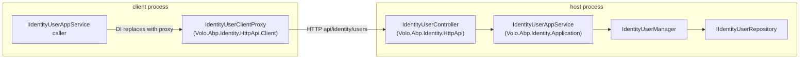

The HTTP layer of the **Identity module** has two halves. The server‑side **`Volo.Abp.Identity.HttpApi`** project hosts ASP.NET Core MVC controllers that wrap each application service from [`Volo.Abp.Identity.Application`](/modules/identity/application). The **`Volo.Abp.Identity.HttpApi.Client`** project ships the matching client proxies — `IdentityUserClientProxy`, `IdentityRoleClientProxy`, `IdentityUserLookupClientProxy`, `IdentityUserIntegrationClientProxy` — that make a remote call look exactly like an in‑process service call. Both projects live under `modules/identity/src/`.

This page documents both projects: the controllers, their routes, the auto‑generated client proxies, and the two `HttpClient*` helpers that exist for legacy lookup scenarios. The server side ships only as REST — there is no separate gRPC project in the open‑source repo.

<Info>
**Source roots:** [`modules/identity/src/Volo.Abp.Identity.HttpApi/`](https://github.com/abpframework/abp/tree/dev/modules/identity/src/Volo.Abp.Identity.HttpApi) and [`modules/identity/src/Volo.Abp.Identity.HttpApi.Client/`](https://github.com/abpframework/abp/tree/dev/modules/identity/src/Volo.Abp.Identity.HttpApi.Client). Every controller in the open‑source module is in `Volo/Abp/Identity/`. Pro‑only services (Profile, OrganizationUnit, ClaimType, SecurityLog, Session) ship in the commercial Identity Pro module, not here.
</Info>

## How the pieces connect



The proxy is registered with `[Dependency(ReplaceServices = true)]` and `[ExposeServices(typeof(IIdentityUserAppService), ...)]` (see `IdentityUserClientProxy.Generated.cs`), so any code that takes `IIdentityUserAppService` from DI gets the remote proxy whenever `AbpIdentityHttpApiClientModule` is referenced instead of `AbpIdentityApplicationModule`.

## `AbpIdentityHttpApiModule` (server)

`modules/identity/src/Volo.Abp.Identity.HttpApi/Volo/Abp/Identity/AbpIdentityHttpApiModule.cs`:

```csharp
[DependsOn(typeof(AbpIdentityApplicationContractsModule), typeof(AbpAspNetCoreMvcModule))]
public class AbpIdentityHttpApiModule : AbpModule
{
    public override void PreConfigureServices(ServiceConfigurationContext context)
    {
        PreConfigure<IMvcBuilder>(mvcBuilder =>
        {
            mvcBuilder.AddApplicationPartIfNotExists(typeof(AbpIdentityHttpApiModule).Assembly);
        });
    }

    public override void ConfigureServices(ServiceConfigurationContext context)
    {
        Configure<AbpLocalizationOptions>(options =>
        {
            options.Resources
                .Get<IdentityResource>()
                .AddBaseTypes(
                    typeof(AbpUiResource)
                );
        });
    }
}
```

Two things:

1. `AddApplicationPartIfNotExists(typeof(AbpIdentityHttpApiModule).Assembly)` — registers the controllers contained in **this** assembly with ASP.NET Core MVC. Without it the controllers would never be discovered when this module is referenced as a NuGet package from another host.
2. The `IdentityResource` localization gains `AbpUiResource` as a base, so generic UI strings like `"Save"`/`"Cancel"` resolve in error responses.

Note that this module depends on `AbpIdentityApplicationContractsModule` (the DTOs and interfaces) but **not** on `AbpIdentityApplicationModule` — the controllers wire themselves to whatever implementation of `IIdentityUserAppService` is present in the DI container. That's deliberate: a microservice gateway can host these controllers while the real application services run elsewhere, or the controllers can be paired with the local in‑process implementation.

## Controller anatomy

All Identity controllers inherit `AbpControllerBase` and follow the same conventions:

```csharp
[RemoteService(Name = IdentityRemoteServiceConsts.RemoteServiceName)]   // "AbpIdentity"
[Area(IdentityRemoteServiceConsts.ModuleName)]                          // "identity"
[ControllerName("User")]
[Route("api/identity/users")]
public class IdentityUserController : AbpControllerBase, IIdentityUserAppService
{
    protected IIdentityUserAppService UserAppService { get; }

    public IdentityUserController(IIdentityUserAppService userAppService)
    {
        UserAppService = userAppService;
    }
    // ...
}
```

`IdentityRemoteServiceConsts` (in `modules/identity/src/Volo.Abp.Identity.Application.Contracts/Volo/Abp/Identity/IdentityRemoteServiceConsts.cs`) carries those two constants:

```csharp
public static class IdentityRemoteServiceConsts
{
    public const string RemoteServiceName = "AbpIdentity";
    public const string ModuleName = "identity";
}
```

`RemoteServiceName` is the key used in `appsettings.json -> RemoteServices`, the area name powers Swagger grouping, and the controller implements the same interface as the application service so the proxy generator can match arguments by interface type.

### `IdentityUserController`

`modules/identity/src/Volo.Abp.Identity.HttpApi/Volo/Abp/Identity/IdentityUserController.cs` maps every method on `IIdentityUserAppService`:

| HTTP | Route | Method | App service call |
| --- | --- | --- | --- |
| `GET` | `api/identity/users/{id}` | `GetAsync(Guid)` | `UserAppService.GetAsync` |
| `GET` | `api/identity/users` | `GetListAsync(GetIdentityUsersInput)` | `UserAppService.GetListAsync` |
| `POST` | `api/identity/users` | `CreateAsync(IdentityUserCreateDto)` | `UserAppService.CreateAsync` |
| `PUT` | `api/identity/users/{id}` | `UpdateAsync(Guid, IdentityUserUpdateDto)` | `UserAppService.UpdateAsync` |
| `DELETE` | `api/identity/users/{id}` | `DeleteAsync(Guid)` | `UserAppService.DeleteAsync` |
| `GET` | `api/identity/users/{id}/roles` | `GetRolesAsync(Guid)` | `UserAppService.GetRolesAsync` |
| `GET` | `api/identity/users/assignable-roles` | `GetAssignableRolesAsync()` | `UserAppService.GetAssignableRolesAsync` |
| `PUT` | `api/identity/users/{id}/roles` | `UpdateRolesAsync(Guid, IdentityUserUpdateRolesDto)` | `UserAppService.UpdateRolesAsync` |
| `GET` | `api/identity/users/by-username/{userName}` | `FindByUsernameAsync(string)` | `UserAppService.FindByUsernameAsync` |
| `GET` | `api/identity/users/by-email/{email}` | `FindByEmailAsync(string)` | `UserAppService.FindByEmailAsync` |

A representative method:

```csharp
[HttpPut]
[Route("{id}/roles")]
public virtual Task UpdateRolesAsync(Guid id, IdentityUserUpdateRolesDto input)
{
    return UserAppService.UpdateRolesAsync(id, input);
}
```

`UpdateRolesAsync` takes `{ string[] RoleNames }`. Authorization lives on `IdentityUserAppService` itself (`[Authorize(IdentityPermissions.Users.Update)]`) — the controller is a transparent passthrough.

### `IdentityRoleController`

`modules/identity/src/Volo.Abp.Identity.HttpApi/Volo/Abp/Identity/IdentityRoleController.cs`:

| HTTP | Route | Method |
| --- | --- | --- |
| `GET` | `api/identity/roles/all` | `GetAllListAsync()` |
| `GET` | `api/identity/roles` | `GetListAsync(GetIdentityRolesInput)` |
| `GET` | `api/identity/roles/{id}` | `GetAsync(Guid)` |
| `POST` | `api/identity/roles` | `CreateAsync(IdentityRoleCreateDto)` |
| `PUT` | `api/identity/roles/{id}` | `UpdateAsync(Guid, IdentityRoleUpdateDto)` |
| `DELETE` | `api/identity/roles/{id}` | `DeleteAsync(Guid)` |

`GetAllListAsync` is the unpaged variant used by dropdowns (the role picker in the user edit modal calls it).

### `IdentityUserLookupController`

`modules/identity/src/Volo.Abp.Identity.HttpApi/Volo/Abp/Identity/IdentityUserLookupController.cs` is preserved for backward compatibility with the obsolete `IdentityUserLookupAppService`:

```csharp
[RemoteService(Name = IdentityRemoteServiceConsts.RemoteServiceName)]
[Area(IdentityRemoteServiceConsts.ModuleName)]
[ControllerName("UserLookup")]
[Route("api/identity/users/lookup")]
public class IdentityUserLookupController : AbpControllerBase, IIdentityUserLookupAppService
{
    // GET api/identity/users/lookup/{id}
    // GET api/identity/users/lookup/by-username/{userName}
    // GET api/identity/users/lookup/search
    // GET api/identity/users/lookup/count
}
```

New code should ignore it in favour of the integration controller below.

### `IdentityUserIntegrationController`

`modules/identity/src/Volo.Abp.Identity.HttpApi/Volo/Abp/Identity/Integration/IdentityUserIntegrationController.cs` is the modern, machine‑to‑machine endpoint:

```csharp
[RemoteService(Name = IdentityRemoteServiceConsts.RemoteServiceName)]
[Area(IdentityRemoteServiceConsts.ModuleName)]
[ControllerName("UserIntegration")]
[Route("integration-api/identity/users")]
public class IdentityUserIntegrationController : AbpControllerBase, IIdentityUserIntegrationService
{
    // GET integration-api/identity/users/{id}/role-names
    // GET integration-api/identity/users/{id}
    // GET integration-api/identity/users/by-username/{userName}
    // GET integration-api/identity/users/search
    // GET integration-api/identity/users/count
}
```

The `integration-api/...` route prefix is convention — it signals "this is for service‑to‑service traffic, not the human UI". Microservice gateways typically apply different auth policies to `integration-api/*` than to `api/*` (client‑credentials only, no end‑user cookie).

## `AbpIdentityHttpApiClientModule` (client)

`modules/identity/src/Volo.Abp.Identity.HttpApi.Client/Volo/Abp/Identity/AbpIdentityHttpApiClientModule.cs`:

```csharp
[DependsOn(
    typeof(AbpIdentityApplicationContractsModule),
    typeof(AbpHttpClientModule))]
public class AbpIdentityHttpApiClientModule : AbpModule
{
    public override void ConfigureServices(ServiceConfigurationContext context)
    {
        context.Services.AddStaticHttpClientProxies(
            typeof(AbpIdentityApplicationContractsModule).Assembly,
            IdentityRemoteServiceConsts.RemoteServiceName
        );

        Configure<AbpVirtualFileSystemOptions>(options =>
        {
            options.FileSets.AddEmbedded<AbpIdentityHttpApiClientModule>();
        });
    }
}
```

`AddStaticHttpClientProxies(...)` scans the Application.Contracts assembly for every `IRemoteService`/`IApplicationService` interface and registers the corresponding compiled proxy class. The static proxies are the ones with the `*.Generated.cs` suffix in `modules/identity/src/Volo.Abp.Identity.HttpApi.Client/ClientProxies/`.

## Generated client proxies

The four generated proxies are:

- `ClientProxies/Volo/Abp/Identity/IdentityUserClientProxy.Generated.cs`
- `ClientProxies/Volo/Abp/Identity/IdentityRoleClientProxy.Generated.cs`
- `ClientProxies/Volo/Abp/Identity/IdentityUserLookupClientProxy.Generated.cs`
- `ClientProxies/Volo/Abp/Identity/Integration/IdentityUserIntegrationClientProxy.Generated.cs`

Each is a `partial class` so you can add overrides in the non‑generated `*.cs` sibling file (`IdentityUserClientProxy.cs`) without re‑running the generator. The top of `IdentityUserClientProxy.Generated.cs` shows the pattern:

```csharp
[Dependency(ReplaceServices = true)]
[ExposeServices(typeof(IIdentityUserAppService), typeof(IdentityUserClientProxy))]
public partial class IdentityUserClientProxy : ClientProxyBase<IIdentityUserAppService>, IIdentityUserAppService
{
    public virtual async Task<IdentityUserDto> GetAsync(Guid id)
    {
        return await RequestAsync<IdentityUserDto>(nameof(GetAsync), new ClientProxyRequestTypeValue
        {
            { typeof(Guid), id }
        });
    }

    public virtual async Task<PagedResultDto<IdentityUserDto>> GetListAsync(GetIdentityUsersInput input)
    {
        return await RequestAsync<PagedResultDto<IdentityUserDto>>(nameof(GetListAsync), new ClientProxyRequestTypeValue
        {
            { typeof(GetIdentityUsersInput), input }
        });
    }

    public virtual async Task<IdentityUserDto> CreateAsync(IdentityUserCreateDto input)
    {
        return await RequestAsync<IdentityUserDto>(nameof(CreateAsync), new ClientProxyRequestTypeValue
        {
            { typeof(IdentityUserCreateDto), input }
        });
    }
    // ...
}
```

`ClientProxyBase<T>.RequestAsync` is responsible for:

1. Looking up the route map (`api/identity/users/{id}`) from the application‑modeling metadata downloaded at startup,
2. Building the request (route values, query string, body) from the `ClientProxyRequestTypeValue` dictionary,
3. Resolving an `HttpClient` configured for the `"AbpIdentity"` remote service from `appsettings.json`,
4. Adding auth headers via the configured `IAccessTokenProvider`,
5. Deserializing the response, handling `RemoteServiceErrorResponse`, and re‑throwing as the same `BusinessException`/`AbpAuthorizationException` the server raised.

That's why the calling site can just write `await _userAppService.CreateAsync(dto)` and treat it exactly like an in‑process service. See `modules/identity/src/Volo.Abp.Identity.HttpApi.Client/ClientProxies/Volo/Abp/Identity/IdentityRoleClientProxy.Generated.cs` for the role version — same structure, same conventions.

## Legacy HTTP helpers (`HttpClient*`)

There are two non‑proxy helpers in `modules/identity/src/Volo.Abp.Identity.HttpApi.Client/Volo/Abp/Identity/` that pre‑date the integration service:

### `HttpClientExternalUserLookupServiceProvider`

```csharp
[Dependency(TryRegister = true)]
public class HttpClientExternalUserLookupServiceProvider : IExternalUserLookupServiceProvider, ITransientDependency
{
    protected IIdentityUserIntegrationService IdentityUserIntegrationService { get; }

    public HttpClientExternalUserLookupServiceProvider(
        IIdentityUserIntegrationService identityUserIntegrationService)
    {
        IdentityUserIntegrationService = identityUserIntegrationService;
    }

    public virtual async Task<IUserData> FindByIdAsync(Guid id, CancellationToken cancellationToken = default)
        => await IdentityUserIntegrationService.FindByIdAsync(id);
    // ...
}
```

`IExternalUserLookupServiceProvider` is the abstraction `Volo.Abp.Users` exposes for "find a user that may live in another microservice." When this assembly is referenced and the `Identity.Application` module is *not* available locally, this implementation wins (`TryRegister = true`) and reroutes every lookup through the proxy → `IdentityUserIntegrationController`.

### `HttpClientUserRoleFinder`

`modules/identity/src/Volo.Abp.Identity.HttpApi.Client/Volo/Abp/Identity/HttpClientUserRoleFinder.cs` is the matching implementation of `IUserRoleFinder` — it calls `IdentityUserIntegrationService.GetRoleNamesAsync(id)` so the [dynamic claims pipeline](/modules/identity/domain) on a remote host can still resolve role membership.

## Auto‑generated JS proxies (MVC UI)

The Razor Pages UI doesn't use the C# client proxies — it uses ABP's dynamic JavaScript proxy generator (`AbpAjax`) instead, except that `AbpIdentityWebModule` opts the Identity module **out** of the dynamic generator so the embedded static `*.js` files in `modules/identity/src/Volo.Abp.Identity.Web/wwwroot/client-proxies/` are served as‑is. The relevant config (from [`AbpIdentityWebModule`](/modules/identity/web-ui)):

```csharp
Configure<DynamicJavaScriptProxyOptions>(options =>
{
    options.DisableModule(IdentityRemoteServiceConsts.ModuleName);
});
```

The static `.js` proxies are emitted by the same code generator that produces the C# `*.Generated.cs` files and ship as embedded resources — they're picked up by the embedded virtual file system registered in `AbpIdentityHttpApiClientModule`.

## Wiring a console / microservice client

A minimal `Program.cs` for a console app that calls `api/identity/users`:

```csharp
[DependsOn(
    typeof(AbpIdentityHttpApiClientModule),
    typeof(AbpAutofacModule),
    typeof(AbpHttpClientIdentityModelModule)   // adds OpenID-Connect token acquisition
)]
public class ConsoleClientModule : AbpModule
{
    public override void ConfigureServices(ServiceConfigurationContext context)
    {
        var configuration = context.Services.GetConfiguration();

        Configure<AbpRemoteServiceOptions>(options =>
        {
            options.RemoteServices.Default = new RemoteServiceConfiguration(
                configuration["RemoteServices:Default:BaseUrl"]
            );
        });
    }
}
```

And the matching `appsettings.json`:

```json
{
  "RemoteServices": {
    "Default": {
      "BaseUrl": "https://your-identity-host/"
    },
    "AbpIdentity": {
      "BaseUrl": "https://your-identity-host/"
    }
  },
  "IdentityClients": {
    "Default": {
      "GrantType": "client_credentials",
      "ClientId": "console-client",
      "ClientSecret": "1q2w3e*",
      "Authority": "https://your-auth-host/",
      "Scope": "AbpIdentity"
    }
  }
}
```

The application then resolves `IIdentityUserAppService` and calls `await userAppService.GetListAsync(...)` exactly as it would in process; the `IdentityUserClientProxy` does the HTTP round‑trip.

## What gets logged at the server

Because the controllers are passthroughs and the application services are guarded by `[Authorize(IdentityPermissions.*)]`, the per‑request audit log will record:

- The fully‑qualified service method (`Volo.Abp.Identity.IdentityUserAppService.CreateAsync`),
- The DTO captured by the parameter binder (with `Password` redacted via the `[DisableAuditing]` attribute on the DTO property),
- The user `Sub` claim and tenant id,
- HTTP status code returned to the caller.

`BusinessException` raised by `CheckErrors()` becomes a `400 Bad Request` with a structured payload via the ABP `ExceptionHttpStatusCodeOptions`. See the matching translations in `IdentityResource` (`modules/identity/src/Volo.Abp.Identity.Domain.Shared/Volo/Abp/Identity/Localization/Resources/en.json`).

## Versioning

All controllers carry `using Asp.Versioning;` and are versioned by URL segment when the host enables it. The default ABP application template registers `1.0` as the only version, so `api/identity/users` is implicitly `api/v1.0/identity/users` only if `UseApiVersioning(...)` is set up — otherwise the routes shown above are exact.

## Related pages

- [Identity overview](/modules/identity/overview) — module structure.
- [Application layer](/modules/identity/application) — what the controllers wrap.
- [Web UI](/modules/identity/web-ui) — MVC pages that consume the same routes via static JS proxies.
- [Blazor UI](/modules/identity/blazor-ui) — Blazor pages that consume the C# client proxies.
- [ASP.NET Core integration](/modules/identity/aspnetcore-integration) — cookie / bearer wiring used by these controllers.
- [Account module](/modules/account/overview) — login flow that produces the cookie/token presented here.
- [OpenIddict module](/modules/openiddict/overview) — issues the bearer tokens carried by `Authorization: Bearer ...`.
- [Permission management](/security/permissions) — how the `[Authorize(...)]` checks resolve.
