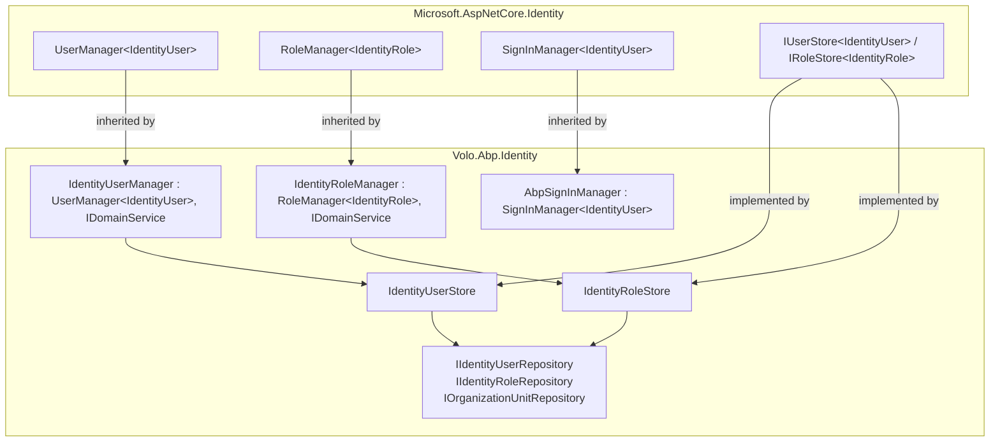

ABP's identity managers are **domain services**: they are the only objects allowed to mutate the state of identity aggregates. The two principal ones, `IdentityUserManager` and `IdentityRoleManager`, do something subtle — they inherit directly from Microsoft's `UserManager<IdentityUser>` and `RoleManager<IdentityRole>`. That means every ASP.NET Core Identity convention you already know (`UpdatePasswordHash`, `CheckPasswordAsync`, `GenerateTwoFactorTokenAsync`, password / user validators, token providers, lockout, security stamps, ...) keeps working — you simply gain ABP-specific operations on top.

All files referenced here live under `modules/identity/src/Volo.Abp.Identity.Domain/Volo/Abp/Identity/`.

## How ABP interleaves with `Microsoft.AspNetCore.Identity`



`services.AddAbpIdentity(...)` (called from `AbpIdentityDomainModule.ConfigureServices`) is the call that:

- Invokes `services.AddIdentity<IdentityUser, IdentityRole>()` internally.
- Substitutes `IdentityUserStore` for the default `IUserStore<IdentityUser>` and `IdentityRoleStore` for `IRoleStore<IdentityRole>`.
- Replaces `IdentityErrorDescriber` with `AbpIdentityErrorDescriber` (see [domain](/modules/identity/domain)).
- Adds `AbpSignInManager` and `AbpUserClaimsPrincipalFactory` to DI (the actual call is delayed to `AbpIdentityAspNetCoreModule.PreConfigureServices`, see [aspnetcore-integration](/modules/identity/aspnetcore-integration)).

So when you resolve `UserManager<IdentityUser>` from DI in legacy code, you actually get an `IdentityUserManager` — and when you write `IdentityUserManager UserManager` (the ABP convention), you also gain `[Authorize]`-compatible methods, ABP repository access, multi-tenancy, distributed event publication, and dynamic-claim cache invalidation.

## `IdentityUserManager`

File: `IdentityUserManager.cs`.

```csharp
public class IdentityUserManager : UserManager<IdentityUser>, IDomainService
{
    protected IIdentityRoleRepository RoleRepository { get; }
    protected IIdentityUserRepository UserRepository { get; }
    protected IOrganizationUnitRepository OrganizationUnitRepository { get; }
    protected ISettingProvider SettingProvider { get; }
    protected ICancellationTokenProvider CancellationTokenProvider { get; }
    protected IDistributedEventBus DistributedEventBus { get; }
    protected IIdentityLinkUserRepository IdentityLinkUserRepository { get; }
    protected IDistributedCache<AbpDynamicClaimCacheItem> DynamicClaimCache { get; }
    protected override CancellationToken CancellationToken => CancellationTokenProvider.Token;

    public IdentityUserManager(
        IdentityUserStore store,
        IIdentityRoleRepository roleRepository,
        IIdentityUserRepository userRepository,
        IOptions<IdentityOptions> optionsAccessor,
        IPasswordHasher<IdentityUser> passwordHasher,
        IEnumerable<IUserValidator<IdentityUser>> userValidators,
        IEnumerable<IPasswordValidator<IdentityUser>> passwordValidators,
        ILookupNormalizer keyNormalizer,
        IdentityErrorDescriber errors,
        IServiceProvider services,
        ILogger<IdentityUserManager> logger,
        ICancellationTokenProvider cancellationTokenProvider,
        IOrganizationUnitRepository organizationUnitRepository,
        ISettingProvider settingProvider,
        IDistributedEventBus distributedEventBus,
        IIdentityLinkUserRepository identityLinkUserRepository,
        IDistributedCache<AbpDynamicClaimCacheItem> dynamicClaimCache)
        : base(store, optionsAccessor, passwordHasher, userValidators, passwordValidators,
               keyNormalizer, errors, services, logger)
    {
        OrganizationUnitRepository = organizationUnitRepository;
        SettingProvider = settingProvider;
        DistributedEventBus = distributedEventBus;
        RoleRepository = roleRepository;
        UserRepository = userRepository;
        IdentityLinkUserRepository = identityLinkUserRepository;
        DynamicClaimCache = dynamicClaimCache;
        CancellationTokenProvider = cancellationTokenProvider;
    }
}
```

Notice the constructor passes the **ABP** `IdentityUserStore` straight to the `base(...)` call. From the perspective of the base class, the user store is exactly what `Microsoft.AspNetCore.Identity` expects.

### Create / update / delete

```csharp
public virtual async Task<IdentityResult> CreateAsync(
    IdentityUser user, string password, bool validatePassword)
{
    var result = await UpdatePasswordHash(user, password, validatePassword);
    if (!result.Succeeded) return result;

    return await CreateAsync(user);
}

public async override Task<IdentityResult> DeleteAsync(IdentityUser user)
{
    user.Claims.Clear();
    user.Roles.Clear();
    user.Tokens.Clear();
    user.Logins.Clear();
    user.OrganizationUnits.Clear();
    await IdentityLinkUserRepository.DeleteAsync(
        new IdentityLinkUserInfo(user.Id, user.TenantId), CancellationToken);
    await UpdateAsync(user);

    return await base.DeleteAsync(user);
}

protected async override Task<IdentityResult> UpdateUserAsync(IdentityUser user)
{
    var result = await base.UpdateUserAsync(user);
    if (result.Succeeded)
    {
        await DynamicClaimCache.RemoveAsync(
            AbpDynamicClaimCacheItem.CalculateCacheKey(user.Id, user.TenantId),
            token: CancellationToken);
    }
    return result;
}
```

Two important details:

- `DeleteAsync` first detaches everything that has a foreign key into the user, then **persists the cleared user** via `UpdateAsync` so EF Core's cascade rules — which are configured as `DeleteBehavior.Cascade` only for collections, not for things like `IdentityLinkUser` — don't throw FK violations.
- `UpdateUserAsync` invalidates the dynamic-claim cache so role / claim changes flow into the next request without forcing a sign-out.

### Roles

```csharp
public virtual async Task<IdentityResult> SetRolesAsync(
    [NotNull] IdentityUser user, [NotNull] IEnumerable<string> roleNames)
{
    Check.NotNull(user, nameof(user));
    Check.NotNull(roleNames, nameof(roleNames));

    var currentRoleNames = await GetRolesAsync(user);

    var result = await RemoveFromRolesAsync(user, currentRoleNames.Except(roleNames).Distinct());
    if (!result.Succeeded) return result;

    result = await AddToRolesAsync(user, roleNames.Except(currentRoleNames).Distinct());
    if (!result.Succeeded) return result;

    return IdentityResult.Success;
}
```

`RemoveFromRolesAsync` and `AddToRolesAsync` are the inherited Microsoft methods — `SetRolesAsync` simply diffs against the current set. The Account / admin UI uses this to replace a user's full role list in one round trip.

### Organization units

```csharp
public virtual async Task<bool> IsInOrganizationUnitAsync(Guid userId, Guid ouId)
{
    var user = await UserRepository.GetAsync(userId, cancellationToken: CancellationToken);
    return user.IsInOrganizationUnit(ouId);
}

public virtual async Task AddToOrganizationUnitAsync(IdentityUser user, OrganizationUnit ou)
{
    await UserRepository.EnsureCollectionLoadedAsync(user, u => u.OrganizationUnits,
        CancellationTokenProvider.Token);

    if (user.OrganizationUnits.Any(cou => cou.OrganizationUnitId == ou.Id))
        return;

    await CheckMaxUserOrganizationUnitMembershipCountAsync(user.OrganizationUnits.Count + 1);
    user.AddOrganizationUnit(ou.Id);
    await UpdateAsync(user);
}
```

`CheckMaxUserOrganizationUnitMembershipCountAsync` reads `IdentitySettingNames.OrganizationUnit.MaxUserMembershipCount` (see `AbpIdentitySettingDefinitionProvider` in [domain](/modules/identity/domain)), and `EnsureCollectionLoadedAsync` is the EF Core lazy-load hook that becomes a no-op on MongoDB (where the OU collection is embedded).

### Working with external login providers

```csharp
public virtual async Task<IdentityResult> AddDefaultRolesAsync([NotNull] IdentityUser user)
{
    await UserRepository.EnsureCollectionLoadedAsync(user, u => u.Roles, CancellationToken);

    var defaultRoles = await RoleRepository.GetDefaultOnesAsync(cancellationToken: CancellationToken);
    foreach (var role in defaultRoles)
    {
        if (user.IsInRole(role.Id)) continue;
        user.AddRole(role.Id);
    }

    return await UpdateAsync(user);
}
```

This is what `ExternalLoginProviderBase.CreateUserAsync` calls (see [domain](/modules/identity/domain)) so every externally-provisioned user starts with the same role set as a self-registered one.

### Cache-invalidating overrides

In addition to `UpdateUserAsync`, the manager overrides `AddToRoleAsync`, `RemoveFromRoleAsync`, `AddClaimsAsync`, `RemoveClaimsAsync`, and `ReplaceClaimAsync` to call `DynamicClaimCache.RemoveAsync(...)` on success. That's the *invalidation* half of the dynamic-claim story (the *materialization* half is in `IdentityDynamicClaimsPrincipalContributor`).

## `IdentityRoleManager`

File: `IdentityRoleManager.cs`.

```csharp
public class IdentityRoleManager : RoleManager<IdentityRole>, IDomainService
{
    protected override CancellationToken CancellationToken => CancellationTokenProvider.Token;

    protected IStringLocalizer<IdentityResource> Localizer { get; }
    protected ICancellationTokenProvider CancellationTokenProvider { get; }
    protected IIdentityUserRepository UserRepository { get; }
    protected IOrganizationUnitRepository OrganizationUnitRepository { get; }
    protected OrganizationUnitManager OrganizationUnitManager { get; }
    protected IDistributedCache<AbpDynamicClaimCacheItem> DynamicClaimCache { get; }

    public IdentityRoleManager(
        IdentityRoleStore store,
        IEnumerable<IRoleValidator<IdentityRole>> roleValidators,
        ILookupNormalizer keyNormalizer,
        IdentityErrorDescriber errors,
        ILogger<IdentityRoleManager> logger,
        IStringLocalizer<IdentityResource> localizer,
        ICancellationTokenProvider cancellationTokenProvider,
        IIdentityUserRepository userRepository,
        IOrganizationUnitRepository organizationUnitRepository,
        OrganizationUnitManager organizationUnitManager,
        IDistributedCache<AbpDynamicClaimCacheItem> dynamicClaimCache)
        : base(store, roleValidators, keyNormalizer, errors, logger)
    {
        /* ... */
    }
}
```

Key behaviors:

- **Cannot rename or delete static roles.** `IdentityRoleManager.DeleteAsync` / `SetRoleNameAsync` overrides check `IdentityRole.IsStatic` and throw `BusinessException(IdentityErrorCodes.StaticRoleRenameOrDelete)` if violated.
- **Rename publishes `IdentityRoleNameChangedEvent`.** `UserEntityUpdatedOrDeletedEventHandler` listens and clears the dynamic-claim cache for every user in the role so `role` claims stay current.
- **Cache invalidation on member changes.** When you remove a role that has members, the manager iterates members and invalidates each user's `AbpDynamicClaimCacheItem`.
- **Inherited claim methods just work.** `AddClaimAsync(role, claim)`, `RemoveClaimAsync(role, claim)`, `GetClaimsAsync(role)` — all inherited from `RoleManager<IdentityRole>` — operate against `IdentityRoleStore` which writes `IdentityRoleClaim` rows.

## `OrganizationUnitManager`

File: `OrganizationUnitManager.cs`.

```csharp
public class OrganizationUnitManager : DomainService
{
    protected IOrganizationUnitRepository OrganizationUnitRepository { get; }
    protected IStringLocalizer<IdentityResource> Localizer { get; }
    protected IIdentityRoleRepository IdentityRoleRepository { get; }
    protected IDistributedCache<AbpDynamicClaimCacheItem> DynamicClaimCache { get; }
    protected ICancellationTokenProvider CancellationTokenProvider { get; }

    public OrganizationUnitManager(
        IOrganizationUnitRepository organizationUnitRepository,
        IStringLocalizer<IdentityResource> localizer,
        IIdentityRoleRepository identityRoleRepository,
        IDistributedCache<AbpDynamicClaimCacheItem> dynamicClaimCache,
        ICancellationTokenProvider cancellationTokenProvider) { /* ... */ }

    public virtual async Task CreateAsync(OrganizationUnit ou) { /* allocates Code = NextChildCodeAsync(ou.ParentId) */ }
    public virtual async Task UpdateAsync(OrganizationUnit ou) { /* ... */ }
    public virtual async Task<string> GetNextChildCodeAsync(Guid? parentId) { /* ... */ }
    public virtual async Task<OrganizationUnit> GetLastChildOrNullAsync(Guid? parentId) { /* ... */ }
    public virtual async Task DeleteAsync(Guid id) { /* recursive: deletes all descendants */ }
    public virtual async Task MoveAsync(Guid id, Guid? parentId) { /* recomputes Code for entire subtree */ }
    public virtual async Task AddRoleToOrganizationUnitAsync(Guid roleId, Guid ouId) { /* + cache invalidation */ }
    public virtual async Task RemoveRoleFromOrganizationUnitAsync(Guid roleId, Guid ouId) { /* + cache invalidation */ }
}
```

The hierarchical `Code` (e.g. `"00001.00042.00005"`) is allocated by `GetNextChildCodeAsync(parentId)` which calls `GetLastChildOrNullAsync(parentId)` and increments. `MoveAsync` rewrites the codes of every descendant under the moved subtree. This is **the** reason the OU code lives on the entity itself rather than being derived — subtree queries become `WHERE Code LIKE 'parentcode.%'`, which is index-friendly on both EF Core and MongoDB.

When OU ↔ role mappings change, `AddRoleToOrganizationUnitAsync` / `RemoveRoleFromOrganizationUnitAsync` find every user inside the OU and invalidate their dynamic-claim cache items, so role-via-OU works as immediately as direct role assignment.

## `IdentityUserDelegationManager`

File: `IdentityUserDelegationManager.cs`.

```csharp
public class IdentityUserDelegationManager : DomainService
{
    protected IIdentityUserDelegationRepository IdentityUserDelegationRepository { get; }

    public IdentityUserDelegationManager(IIdentityUserDelegationRepository identityUserDelegationRepository)
    {
        IdentityUserDelegationRepository = identityUserDelegationRepository;
    }

    public virtual async Task<List<IdentityUserDelegation>> GetListAsync(
        Guid? sourceUserId = null, Guid? targetUserId = null, CancellationToken cancellationToken = default)
        => await IdentityUserDelegationRepository.GetListAsync(sourceUserId, targetUserId, cancellationToken: cancellationToken);

    public virtual async Task<List<IdentityUserDelegation>> GetActiveDelegationsAsync(
        Guid targetUseId, CancellationToken cancellationToken = default)
        => await IdentityUserDelegationRepository.GetActiveDelegationsAsync(targetUseId, cancellationToken: cancellationToken);

    public virtual async Task<IdentityUserDelegation> FindActiveDelegationByIdAsync(
        Guid id, CancellationToken cancellationToken = default)
        => await IdentityUserDelegationRepository.FindActiveDelegationByIdAsync(id, cancellationToken: cancellationToken);

    public virtual async Task DelegateNewUserAsync(
        Guid sourceUserId, Guid targetUserId, DateTime startTime, DateTime endTime, CancellationToken cancellationToken = default)
    {
        if (sourceUserId == targetUserId)
            throw new BusinessException(IdentityErrorCodes.YouCannotDelegateYourself);

        await IdentityUserDelegationRepository.InsertAsync(/* ... */);
    }
}
```

`AbpSignInManager` and `AbpClaimsPrincipalFactory` honor active delegations by exposing a "Switch user" option in the Account UI — the user signs in as themselves first, then can pivot to act as anyone who delegated to them, with the original identity preserved in `AbpClaimTypes.ImpersonatorUserId`.

## `IdentityLinkUserManager`

```csharp
public class IdentityLinkUserManager : DomainService
{
    protected IIdentityLinkUserRepository IdentityLinkUserRepository { get; }
    protected IdentityUserManager UserManager { get; }
    protected new ICurrentTenant CurrentTenant { get; }

    public async Task<List<IdentityLinkUser>> GetListAsync(
        IdentityLinkUserInfo linkUserInfo, bool includeIndirect = false, int batchSize = 100 * 100,
        CancellationToken cancellationToken = default)
    {
        using (CurrentTenant.Change(null))
        {
            var users = await IdentityLinkUserRepository.GetListAsync(linkUserInfo, cancellationToken: cancellationToken);
            if (!includeIndirect) return users;

            var allUsers = await IdentityLinkUserRepository.GetListAsync(batchSize, cancellationToken: cancellationToken);
            return await GetAllRelatedLinksAsync(allUsers, linkUserInfo);
        }
    }
}
```

Two things to note:

- The `using (CurrentTenant.Change(null))` block is mandatory because `IdentityLinkUser` is cross-tenant — the link from `(SourceUserId, SourceTenantId)` to `(TargetUserId, TargetTenantId)` would otherwise be filtered out by ABP's tenant data filter.
- `includeIndirect: true` builds the *transitive closure*: if A is linked to B and B is linked to C, A can reach C in one hop.

`AbpSignInManager.LinkUserAsync` consumes this in the Account UI's "Linked Users" dropdown — a host admin who has linked their tenant accounts can switch between them without re-entering credentials.

## `IdentitySecurityLogManager`

File: `IdentitySecurityLogManager.cs`.

```csharp
public class IdentitySecurityLogManager : ITransientDependency
{
    protected ISecurityLogManager SecurityLogManager { get; }
    protected IdentityUserManager UserManager { get; }
    protected ICurrentPrincipalAccessor CurrentPrincipalAccessor { get; }
    protected IUserClaimsPrincipalFactory<IdentityUser> UserClaimsPrincipalFactory { get; }
    protected ICurrentUser CurrentUser { get; }

    public async Task SaveAsync(IdentitySecurityLogContext context)
    {
        Action<SecurityLogInfo> securityLogAction = securityLog =>
        {
            securityLog.Identity = context.Identity;
            securityLog.Action = context.Action;

            if (!context.UserName.IsNullOrWhiteSpace())
                securityLog.UserName = context.UserName;
            // ... copy ClientId, CorrelationId, Exception, ExtraProperties
        };

        if (context.User != null)
        {
            var principal = await UserClaimsPrincipalFactory.CreateAsync(context.User);
            using (CurrentPrincipalAccessor.Change(principal))
            {
                await SecurityLogManager.SaveAsync(securityLogAction);
            }
        }
        else
        {
            await SecurityLogManager.SaveAsync(securityLogAction);
        }
    }
}
```

This isn't a domain *service* in the strict DDD sense — it's a thin façade that uses `ICurrentPrincipalAccessor` to temporarily *become* the user being logged (so `ICurrentUser` inside `ISecurityLogManager.SaveAsync` sees the right identity / tenant), then writes to the framework-level [security log subsystem](https://github.com/abpframework/abp/blob/dev/framework/src/Volo.Abp.Security/Volo/Abp/SecurityLog/) which ultimately produces an `IdentitySecurityLog` row.

Account, OpenIddict, and IdentityServer all push `IdentitySecurityLogContext` records here on every Login / Logout / ChangePassword / PasswordReset / TwoFactorLogin event.

## `IdentityClaimTypeManager`

File: `IdentityClaimTypeManager.cs`.

```csharp
public class IdentityClaimTypeManager : DomainService
{
    protected IIdentityClaimTypeRepository IdentityClaimTypeRepository { get; }
    protected IIdentityUserRepository IdentityUserRepository { get; }
    protected IIdentityRoleRepository IdentityRoleRepository { get; }

    public virtual async Task<IdentityClaimType> CreateAsync(IdentityClaimType claimType)
    {
        if (await IdentityClaimTypeRepository.AnyAsync(claimType.Name))
            throw new BusinessException(IdentityErrorCodes.ClaimNameExist).WithData("0", claimType.Name);

        return await IdentityClaimTypeRepository.InsertAsync(claimType);
    }

    public virtual async Task<IdentityClaimType> UpdateAsync(IdentityClaimType claimType)
    {
        if (await IdentityClaimTypeRepository.AnyAsync(claimType.Name, claimType.Id))
            throw new BusinessException(IdentityErrorCodes.ClaimNameExist).WithData("0", claimType.Name);

        // ... update user / role claims with the new name when applicable
        return await IdentityClaimTypeRepository.UpdateAsync(claimType);
    }
}
```

The manager enforces the unique-name invariant and (in its full form) cascades a `Name` change to every `IdentityUserClaim` / `IdentityRoleClaim` row that references the old name.

## Stores

### `IdentityUserStore`

File: `IdentityUserStore.cs`. This is what `Microsoft.AspNetCore.Identity`'s `UserManager<IdentityUser>` calls into. It implements **every** user-store interface that ASP.NET Core ships:

```csharp
public class IdentityUserStore :
    IUserLoginStore<IdentityUser>,
    IUserRoleStore<IdentityUser>,
    IUserClaimStore<IdentityUser>,
    IUserPasswordStore<IdentityUser>,
    IUserSecurityStampStore<IdentityUser>,
    IUserEmailStore<IdentityUser>,
    IUserLockoutStore<IdentityUser>,
    IUserPhoneNumberStore<IdentityUser>,
    IUserTwoFactorStore<IdentityUser>,
    IUserAuthenticationTokenStore<IdentityUser>,
    IUserAuthenticatorKeyStore<IdentityUser>,
    IUserTwoFactorRecoveryCodeStore<IdentityUser>,
    ITransientDependency
{
    private const string InternalLoginProvider = "[AspNetUserStore]";
    private const string AuthenticatorKeyTokenName = "AuthenticatorKey";
    private const string RecoveryCodeTokenName = "RecoveryCodes";

    /* depends on IIdentityUserRepository, IIdentityRoleRepository, ILookupNormalizer,
       IGuidGenerator, IIdentityClaimTypeRepository, IdentityErrorDescriber */
}
```

Every interface method delegates to `IIdentityUserRepository` (the ABP repository) — so the **same** repository abstraction is used by application services and by the Microsoft `UserManager` plumbing. The internal token names `AuthenticatorKey` and `RecoveryCodes` are how 2FA recovery codes and authenticator app secrets are persisted into the `IdentityUserToken` table without inventing new columns.

### `IdentityRoleStore`

```csharp
public class IdentityRoleStore :
    IRoleStore<IdentityRole>,
    IRoleClaimStore<IdentityRole>,
    ITransientDependency
{
    protected IIdentityRoleRepository RoleRepository { get; }
    protected ILogger<IdentityRoleStore> Logger { get; }
    protected IGuidGenerator GuidGenerator { get; }
}
```

Same idea, role-side. Implements both `IRoleStore<IdentityRole>` and `IRoleClaimStore<IdentityRole>` and uses `IIdentityRoleRepository`.

## Putting it together — a sign-in walk

```mermaid
sequenceDiagram
    participant Page as Account/Login.cshtml
    participant Mgr as AbpSignInManager
    participant U as IdentityUserManager
    participant Store as IdentityUserStore
    participant Repo as IIdentityUserRepository
    participant Cache as IDistributedCache&lt;AbpDynamicClaimCacheItem&gt;

    Page->>Mgr: PasswordSignInAsync(userName, password)
    Mgr->>U: FindByNameAsync(userName)
    U->>Store: FindByNameAsync
    Store->>Repo: FindByNormalizedUserNameAsync
    Repo-->>Store: IdentityUser
    Store-->>U: IdentityUser
    U-->>Mgr: IdentityUser
    Mgr->>U: CheckPasswordAsync(user, password)
    U-->>Mgr: true
    Mgr->>U: UpdateAsync(user) // last sign-in
    U->>Store: UpdateAsync(user)
    Store->>Repo: UpdateAsync
    U->>Cache: RemoveAsync(userId, tenantId)
    Mgr-->>Page: SignInResult.Success
```

The exact same call graph services external-login providers — the only branch is at the very top, where `AbpSignInManager.PasswordSignInAsync` walks `AbpIdentityOptions.ExternalLoginProviders` first.

## Where to next

- [Application services](/modules/identity/application) — `IdentityUserAppService` / `IdentityRoleAppService` consume these managers under `[Authorize(IdentityPermissions.Users.*)]`.
- [ASP.NET Core integration](/modules/identity/aspnetcore-integration) — `AbpSignInManager` and the security stamp validator that complete the sign-in story.
- [EF Core](/modules/identity/efcore) — how `EfCoreIdentityUserRepository` implements the `IIdentityUserRepository` calls these stores rely on.
- [MongoDB](/modules/identity/mongodb) — the Mongo equivalent.
- [Permissions](/security/permissions) — `IPermissionChecker` consumes role / OU role membership to authorize requests.
