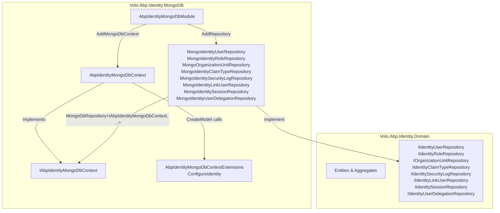

The MongoDB provider for the Identity module is the canonical alternative to the EF Core provider. It ships as `Volo.Abp.Identity.MongoDB` (twelve files under `modules/identity/src/Volo.Abp.Identity.MongoDB/Volo/Abp/Identity/MongoDB/`) and mirrors the EF Core project file‑for‑file: a concrete `DbContext`, a marker interface, eight repositories, and a module. The repositories are typed against the interface, exactly like the EF Core ones, which is what lets your application's main Mongo `DbContext` play the role of "the Identity context." This page walks each file with real excerpts and points to the matching EF Core symbols in [Identity EF Core](/modules/identity/efcore) when the two diverge.

<Info>
**Source root for this page:** [`modules/identity/src/Volo.Abp.Identity.MongoDB/`](https://github.com/abpframework/abp/tree/dev/modules/identity/src/Volo.Abp.Identity.MongoDB). `ls` of that folder shows two files at the top (`Volo.Abp.Identity.MongoDB.csproj`, `Volo.Abp.Identity.MongoDB.abppkg`) plus a `Volo/Abp/Identity/MongoDB/` subtree with the twelve C# files referenced below. There is no `Microsoft/` subfolder here — unlike the [AspNetCore integration](/modules/identity/aspnetcore-integration), nothing extends `IServiceCollection` at this layer.
</Info>

## Layout

The provider is intentionally flat — every type lives in one folder, `modules/identity/src/Volo.Abp.Identity.MongoDB/Volo/Abp/Identity/MongoDB/`:



The repositories are typed against **`IAbpIdentityMongoDbContext`** — never the concrete `AbpIdentityMongoDbContext`. That's the seam that lets a custom MongoDB context play the role of the Identity context.

## The csproj

`modules/identity/src/Volo.Abp.Identity.MongoDB/Volo.Abp.Identity.MongoDB.csproj` is short:

```xml
<Project Sdk="Microsoft.NET.Sdk">

  <Import Project="..\..\..\..\configureawait.props" />
  <Import Project="..\..\..\..\common.props" />

  <PropertyGroup>
    <TargetFramework>net10.0</TargetFramework>
    <AssemblyName>Volo.Abp.Identity.MongoDB</AssemblyName>
    <PackageId>Volo.Abp.Identity.MongoDB</PackageId>
    <RootNamespace />
  </PropertyGroup>

  <ItemGroup>
    <ProjectReference Include="..\Volo.Abp.Identity.Domain\Volo.Abp.Identity.Domain.csproj" />
    <ProjectReference Include="..\..\..\users\src\Volo.Abp.Users.MongoDB\Volo.Abp.Users.MongoDB.csproj" />
  </ItemGroup>

</Project>
```

Two project references only: `Volo.Abp.Identity.Domain` (the entities and repository interfaces) and `Volo.Abp.Users.MongoDB` (the users sub‑module's Mongo collection mappings). The root‑level `common.props` covers package metadata — see [Build System](/overview/build-system) for what it sets.

## `AbpIdentityMongoDbModule`

The module class wires everything up. Source: `modules/identity/src/Volo.Abp.Identity.MongoDB/Volo/Abp/Identity/MongoDB/AbpIdentityMongoDbModule.cs`:

```csharp
using Microsoft.Extensions.DependencyInjection;
using Volo.Abp.Modularity;
using Volo.Abp.Users.MongoDB;

namespace Volo.Abp.Identity.MongoDB;

[DependsOn(
    typeof(AbpIdentityDomainModule),
    typeof(AbpUsersMongoDbModule)
    )]
public class AbpIdentityMongoDbModule : AbpModule
{
    public override void ConfigureServices(ServiceConfigurationContext context)
    {
        context.Services.AddMongoDbContext<AbpIdentityMongoDbContext>(options =>
        {
            options.AddRepository<IdentityUser, MongoIdentityUserRepository>();
            options.AddRepository<IdentityRole, MongoIdentityRoleRepository>();
            options.AddRepository<IdentityClaimType, MongoIdentityClaimTypeRepository>();
            options.AddRepository<OrganizationUnit, MongoOrganizationUnitRepository>();
            options.AddRepository<IdentitySecurityLog, MongoIdentitySecurityLogRepository>();
            options.AddRepository<IdentityLinkUser, MongoIdentityLinkUserRepository>();
            options.AddRepository<IdentityUserDelegation, MongoIdentityUserDelegationRepository>();
            options.AddRepository<IdentitySession, MongoIdentitySessionRepository>();
        });
    }
}
```

Three things to notice:

1.  It depends on `AbpIdentityDomainModule` (entities + interfaces) and `AbpUsersMongoDbModule` (so that `IdentityUser` inherits the Users‑module's collection name conventions).
2.  It calls `AddMongoDbContext<AbpIdentityMongoDbContext>` — the standard ABP MongoDB entry point covered in [MongoDB](/data/mongodb).
3.  Every aggregate is registered via `options.AddRepository<TEntity, TRepository>()` — there are exactly eight registrations, matching the eight aggregates Identity owns.

## `AbpIdentityMongoDbContext` and `IAbpIdentityMongoDbContext`

`modules/identity/src/Volo.Abp.Identity.MongoDB/Volo/Abp/Identity/MongoDB/AbpIdentityMongoDbContext.cs` is the concrete context, and `modules/identity/src/Volo.Abp.Identity.MongoDB/Volo/Abp/Identity/MongoDB/IAbpIdentityMongoDbContext.cs` is the interface the repositories speak to.

<Tabs>
  <Tab title="Concrete context">
```csharp
// modules/identity/src/Volo.Abp.Identity.MongoDB/Volo/Abp/Identity/MongoDB/AbpIdentityMongoDbContext.cs
using MongoDB.Driver;
using Volo.Abp.Data;
using Volo.Abp.MongoDB;

namespace Volo.Abp.Identity.MongoDB;

[ConnectionStringName(AbpIdentityDbProperties.ConnectionStringName)]
public class AbpIdentityMongoDbContext : AbpMongoDbContext, IAbpIdentityMongoDbContext
{
    public IMongoCollection<IdentityUser> Users => Collection<IdentityUser>();
    public IMongoCollection<IdentityRole> Roles => Collection<IdentityRole>();
    public IMongoCollection<IdentityClaimType> ClaimTypes => Collection<IdentityClaimType>();
    public IMongoCollection<OrganizationUnit> OrganizationUnits => Collection<OrganizationUnit>();
    public IMongoCollection<IdentitySecurityLog> SecurityLogs => Collection<IdentitySecurityLog>();
    public IMongoCollection<IdentityLinkUser> LinkUsers => Collection<IdentityLinkUser>();
    public IMongoCollection<IdentityUserDelegation> UserDelegations => Collection<IdentityUserDelegation>();
    public IMongoCollection<IdentitySession> Sessions => Collection<IdentitySession>();

    protected override void CreateModel(IMongoModelBuilder modelBuilder)
    {
        base.CreateModel(modelBuilder);
        modelBuilder.ConfigureIdentity();
    }
}
```
  </Tab>
  <Tab title="Marker interface">
```csharp
// modules/identity/src/Volo.Abp.Identity.MongoDB/Volo/Abp/Identity/MongoDB/IAbpIdentityMongoDbContext.cs
using MongoDB.Driver;
using Volo.Abp.Data;
using Volo.Abp.MongoDB;

namespace Volo.Abp.Identity.MongoDB;

[ConnectionStringName(AbpIdentityDbProperties.ConnectionStringName)]
public interface IAbpIdentityMongoDbContext : IAbpMongoDbContext
{
    IMongoCollection<IdentityUser> Users { get; }
    IMongoCollection<IdentityRole> Roles { get; }
    IMongoCollection<IdentityClaimType> ClaimTypes { get; }
    IMongoCollection<OrganizationUnit> OrganizationUnits { get; }
    IMongoCollection<IdentitySecurityLog> SecurityLogs { get; }
    IMongoCollection<IdentityLinkUser> LinkUsers { get; }
    IMongoCollection<IdentityUserDelegation> UserDelegations { get; }
    IMongoCollection<IdentitySession> Sessions { get; }
}
```
  </Tab>
</Tabs>

The `[ConnectionStringName]` attribute on both the class *and* the interface lets ABP's connection string resolver find this context whether code resolves it as `AbpIdentityMongoDbContext` or `IAbpIdentityMongoDbContext`. The constant `AbpIdentityDbProperties.ConnectionStringName` is defined in `modules/identity/src/Volo.Abp.Identity.Domain/Volo/Abp/Identity/AbpIdentityDbProperties.cs` and is shared with the EF Core provider.

<Note>
`CreateModel` overrides `AbpMongoDbContext.CreateModel` — calling `base.CreateModel(modelBuilder)` first preserves anything bases of `AbpMongoDbContext` configured (notably the audit‑logging / object‑extending model), then `modelBuilder.ConfigureIdentity()` (defined in `AbpIdentityMongoDbContextExtensions`) sets the collection names.
</Note>

## `AbpIdentityMongoDbContextExtensions` — collection naming

`modules/identity/src/Volo.Abp.Identity.MongoDB/Volo/Abp/Identity/MongoDB/AbpIdentityMongoDbContextExtensions.cs` declares one extension method, `ConfigureIdentity`, that maps each entity to a collection name based on `AbpIdentityDbProperties.DbTablePrefix`:

```csharp
// modules/identity/src/Volo.Abp.Identity.MongoDB/Volo/Abp/Identity/MongoDB/AbpIdentityMongoDbContextExtensions.cs
using Volo.Abp.MongoDB;

namespace Volo.Abp.Identity.MongoDB;

public static class AbpIdentityMongoDbContextExtensions
{
    public static void ConfigureIdentity(this IMongoModelBuilder builder)
    {
        Check.NotNull(builder, nameof(builder));

        builder.Entity<IdentityUser>(b =>
        {
            b.CollectionName = AbpIdentityDbProperties.DbTablePrefix + "Users";
        });
        builder.Entity<IdentityRole>(b =>
        {
            b.CollectionName = AbpIdentityDbProperties.DbTablePrefix + "Roles";
        });
        builder.Entity<IdentityClaimType>(b =>
        {
            b.CollectionName = AbpIdentityDbProperties.DbTablePrefix + "ClaimTypes";
        });
        builder.Entity<OrganizationUnit>(b =>
        {
            b.CollectionName = AbpIdentityDbProperties.DbTablePrefix + "OrganizationUnits";
        });
        builder.Entity<IdentitySecurityLog>(b =>
        {
            b.CollectionName = AbpIdentityDbProperties.DbTablePrefix + "SecurityLogs";
        });
        builder.Entity<IdentityLinkUser>(b =>
        {
            b.CollectionName = AbpIdentityDbProperties.DbTablePrefix + "LinkUsers";
        });
        builder.Entity<IdentityUserDelegation>(b =>
        {
            b.CollectionName = AbpIdentityDbProperties.DbTablePrefix + "UserDelegations";
        });
        builder.Entity<IdentitySession>(b =>
        {
            b.CollectionName = AbpIdentityDbProperties.DbTablePrefix + "Sessions";
        });
    }
}
```

This is the MongoDB analogue of EF Core's `IdentityDbContextModelBuilderExtensions.ConfigureIdentity` (under `modules/identity/src/Volo.Abp.Identity.EntityFrameworkCore/`) — both are extension methods that an application's own `DbContext` calls from its `OnModelCreating` / `CreateModel`.

## The eight repositories

Every repository under `modules/identity/src/Volo.Abp.Identity.MongoDB/Volo/Abp/Identity/MongoDB/` follows the same pattern: derive from `MongoDbRepository<IAbpIdentityMongoDbContext, TEntity, TKey>`, implement the matching `I*Repository` interface from `Volo.Abp.Identity.Domain`, and inject a `IMongoDbContextProvider<IAbpIdentityMongoDbContext>`.

### `MongoIdentityUserRepository`

`MongoIdentityUserRepository.cs` (510 lines) is the largest. The class declaration and the canonical `FindByNormalizedUserNameAsync` excerpt:

```csharp
// modules/identity/src/Volo.Abp.Identity.MongoDB/Volo/Abp/Identity/MongoDB/MongoIdentityUserRepository.cs
public class MongoIdentityUserRepository
    : MongoDbRepository<IAbpIdentityMongoDbContext, IdentityUser, Guid>,
      IIdentityUserRepository
{
    public MongoIdentityUserRepository(
        IMongoDbContextProvider<IAbpIdentityMongoDbContext> dbContextProvider)
        : base(dbContextProvider) { }

    public virtual async Task<IdentityUser> FindByNormalizedUserNameAsync(
        string normalizedUserName,
        bool includeDetails = true,
        CancellationToken cancellationToken = default)
    {
        return await (await GetQueryableAsync(cancellationToken))
            .OrderBy(x => x.Id)
            .FirstOrDefaultAsync(
                u => u.NormalizedUserName == normalizedUserName,
                GetCancellationToken(cancellationToken));
    }

    public virtual async Task<List<string>> GetRoleNamesAsync(
        Guid id, CancellationToken cancellationToken = default)
    {
        cancellationToken = GetCancellationToken(cancellationToken);
        var user = await GetAsync(id, cancellationToken: cancellationToken);
        var organizationUnitIds = user.OrganizationUnits
            .Select(r => r.OrganizationUnitId).ToList();

        var organizationUnits = await (await GetQueryableAsync<OrganizationUnit>(cancellationToken))
            .Where(ou => organizationUnitIds.Contains(ou.Id))
            .ToListAsync(cancellationToken: cancellationToken);

        var orgUnitRoleIds = organizationUnits.SelectMany(x => x.Roles.Select(r => r.RoleId)).ToList();
        var roleIds = user.Roles.Select(r => r.RoleId).ToList();
        var allRoleIds = orgUnitRoleIds.Union(roleIds).ToList();

        return await (await GetQueryableAsync<IdentityRole>(cancellationToken))
            .Where(r => allRoleIds.Contains(r.Id))
            .Select(r => r.Name)
            .ToListAsync(cancellationToken);
    }
    // ... ~30 more virtual methods implementing IIdentityUserRepository
}
```

`GetQueryableAsync<T>()` is the ABP MongoDB idiom for queries that touch multiple collections — the second collection (`OrganizationUnit`, `IdentityRole`) is resolved through the same `IAbpIdentityMongoDbContext` because `AddMongoDbContext` registers the context once and the same `IMongoDbContextProvider` services all the queryables.

### `MongoIdentityRoleRepository`

`MongoIdentityRoleRepository.cs` (131 lines) implements `IIdentityRoleRepository`:

```csharp
// modules/identity/src/Volo.Abp.Identity.MongoDB/Volo/Abp/Identity/MongoDB/MongoIdentityRoleRepository.cs
public class MongoIdentityRoleRepository
    : MongoDbRepository<IAbpIdentityMongoDbContext, IdentityRole, Guid>,
      IIdentityRoleRepository
{
    public MongoIdentityRoleRepository(
        IMongoDbContextProvider<IAbpIdentityMongoDbContext> dbContextProvider)
        : base(dbContextProvider) { }

    public virtual async Task<IdentityRole> FindByNormalizedNameAsync(
        string normalizedRoleName, bool includeDetails = true,
        CancellationToken cancellationToken = default)
    {
        return await (await GetQueryableAsync(cancellationToken))
            .OrderBy(x => x.Id)
            .FirstOrDefaultAsync(r => r.NormalizedName == normalizedRoleName,
                GetCancellationToken(cancellationToken));
    }

    public virtual async Task<List<IdentityRoleWithUserCount>> GetListWithUserCountAsync(
        string sorting = null, int maxResultCount = int.MaxValue, int skipCount = 0,
        string filter = null, bool includeDetails = false,
        CancellationToken cancellationToken = default)
    {
        var roles = await GetListInternalAsync(sorting, maxResultCount, skipCount, filter,
            includeDetails, cancellationToken: cancellationToken);
        var roleIds = roles.Select(x => x.Id).ToList();
        var userCount = await (await GetQueryableAsync<IdentityUser>(cancellationToken))
            .Where(user => user.Roles.Any(role => roleIds.Contains(role.RoleId)))
            .SelectMany(user => user.Roles)
            .GroupBy(userRole => userRole.RoleId)
            .Select(x => new { RoleId = x.Key, Count = x.Count() })
            .ToListAsync(GetCancellationToken(cancellationToken));

        return roles.Select(role => new IdentityRoleWithUserCount(role,
            userCount.FirstOrDefault(x => x.RoleId == role.Id)?.Count ?? 0)).ToList();
    }
    // ...
}
```

`GetListWithUserCountAsync` shows the two‑collection pattern again — roles are joined against the embedded `Roles` array on `IdentityUser`.

### `MongoOrganizationUnitRepository`

`MongoOrganizationUnitRepository.cs` (295 lines) implements `IOrganizationUnitRepository`:

```csharp
// modules/identity/src/Volo.Abp.Identity.MongoDB/Volo/Abp/Identity/MongoDB/MongoOrganizationUnitRepository.cs
public class MongoOrganizationUnitRepository
    : MongoDbRepository<IAbpIdentityMongoDbContext, OrganizationUnit, Guid>,
      IOrganizationUnitRepository
{
    public MongoOrganizationUnitRepository(
        IMongoDbContextProvider<IAbpIdentityMongoDbContext> dbContextProvider)
        : base(dbContextProvider) { }

    public virtual async Task<List<OrganizationUnit>> GetChildrenAsync(
        Guid? parentId, bool includeDetails = false,
        CancellationToken cancellationToken = default)
    {
        return await (await GetQueryableAsync(cancellationToken))
            .Where(ou => ou.ParentId == parentId)
            .ToListAsync(GetCancellationToken(cancellationToken));
    }

    public virtual async Task<List<OrganizationUnit>> GetAllChildrenWithParentCodeAsync(
        string code, Guid? parentId, bool includeDetails = false,
        CancellationToken cancellationToken = default)
    {
        return await (await GetQueryableAsync(cancellationToken))
            .Where(ou => ou.Code.StartsWith(code) && ou.Id != parentId)
            .ToListAsync(GetCancellationToken(cancellationToken));
    }
    // ...
}
```

Organization units form a tree, and `Code` is a sortable materialized‑path. `GetAllChildrenWithParentCodeAsync` is the same pattern the EF Core repository uses — see [Identity EF Core](/modules/identity/efcore).

### `MongoIdentityClaimTypeRepository`

`MongoIdentityClaimTypeRepository.cs` (76 lines) implements `IIdentityClaimTypeRepository`:

```csharp
// modules/identity/src/Volo.Abp.Identity.MongoDB/Volo/Abp/Identity/MongoDB/MongoIdentityClaimTypeRepository.cs
public class MongoIdentityClaimTypeRepository
    : MongoDbRepository<IAbpIdentityMongoDbContext, IdentityClaimType, Guid>,
      IIdentityClaimTypeRepository
{
    public MongoIdentityClaimTypeRepository(
        IMongoDbContextProvider<IAbpIdentityMongoDbContext> dbContextProvider)
        : base(dbContextProvider) { }

    public virtual async Task<bool> AnyAsync(
        string name, Guid? ignoredId = null,
        CancellationToken cancellationToken = default)
    {
        if (ignoredId == null)
        {
            return await (await GetQueryableAsync(cancellationToken))
                .Where(ct => ct.Name == name)
                .AnyAsync(GetCancellationToken(cancellationToken));
        }
        // ...
    }
}
```

### `MongoIdentitySecurityLogRepository`

`MongoIdentitySecurityLogRepository.cs` (121 lines) is the busiest filter‑oriented repository:

```csharp
// modules/identity/src/Volo.Abp.Identity.MongoDB/Volo/Abp/Identity/MongoDB/MongoIdentitySecurityLogRepository.cs
public class MongoIdentitySecurityLogRepository :
    MongoDbRepository<IAbpIdentityMongoDbContext, IdentitySecurityLog, Guid>,
    IIdentitySecurityLogRepository
{
    public MongoIdentitySecurityLogRepository(
        IMongoDbContextProvider<IAbpIdentityMongoDbContext> dbContextProvider)
        : base(dbContextProvider) { }

    public virtual async Task<List<IdentitySecurityLog>> GetListAsync(
        string sorting = null, int maxResultCount = int.MaxValue, int skipCount = 0,
        DateTime? startTime = null, DateTime? endTime = null,
        string applicationName = null, string identity = null, string action = null,
        Guid? userId = null, string userName = null, string clientId = null,
        string correlationId = null, string clientIpAddress = null,
        bool includeDetails = false,
        CancellationToken cancellationToken = default)
    {
        var query = await GetListQueryAsync(startTime, endTime, applicationName,
            identity, action, userId, userName, clientId, correlationId,
            clientIpAddress, cancellationToken);
        // ...
    }
}
```

The thirteen optional filter arguments mirror the EF Core repository signature exactly so that the [`IIdentitySecurityLogRepository`](/modules/identity/domain) contract is single‑sourced.

### `MongoIdentitySessionRepository`

`MongoIdentitySessionRepository.cs` (99 lines) implements `IIdentitySessionRepository`:

```csharp
// modules/identity/src/Volo.Abp.Identity.MongoDB/Volo/Abp/Identity/MongoDB/MongoIdentitySessionRepository.cs
public class MongoIdentitySessionRepository
    : MongoDbRepository<IAbpIdentityMongoDbContext, IdentitySession, Guid>,
      IIdentitySessionRepository
{
    public MongoIdentitySessionRepository(
        IMongoDbContextProvider<IAbpIdentityMongoDbContext> dbContextProvider)
        : base(dbContextProvider) { }

    public virtual async Task<IdentitySession> FindAsync(
        string sessionId, CancellationToken cancellationToken = default)
    {
        return await (await GetQueryableAsync(GetCancellationToken(cancellationToken)))
            .FirstOrDefaultAsync(x => x.SessionId == sessionId,
                GetCancellationToken(cancellationToken));
    }

    public virtual async Task<IdentitySession> GetAsync(
        string sessionId, CancellationToken cancellationToken = default)
    {
        var session = await FindAsync(sessionId, cancellationToken);
        if (session == null)
            throw new EntityNotFoundException(typeof(IdentitySession));
        return session;
    }
}
```

Sessions track active logins for the dynamic‑claims pipeline; see [AspNetCore integration](/modules/identity/aspnetcore-integration) for how the cookie validator reads `AbpClaimTypes.SessionId`.

### `MongoIdentityLinkUserRepository`

`MongoIdentityLinkUserRepository.cs` (80 lines) implements `IIdentityLinkUserRepository` for cross‑tenant user linking:

```csharp
// modules/identity/src/Volo.Abp.Identity.MongoDB/Volo/Abp/Identity/MongoDB/MongoIdentityLinkUserRepository.cs
public class MongoIdentityLinkUserRepository
    : MongoDbRepository<IAbpIdentityMongoDbContext, IdentityLinkUser, Guid>,
      IIdentityLinkUserRepository
{
    public MongoIdentityLinkUserRepository(
        IMongoDbContextProvider<IAbpIdentityMongoDbContext> dbContextProvider)
        : base(dbContextProvider) { }

    public virtual async Task<IdentityLinkUser> FindAsync(
        IdentityLinkUserInfo sourceLinkUserInfo,
        IdentityLinkUserInfo targetLinkUserInfo,
        CancellationToken cancellationToken = default)
    {
        return await (await GetQueryableAsync(cancellationToken))
            .OrderBy(x => x.Id).FirstOrDefaultAsync(x =>
                x.SourceUserId == sourceLinkUserInfo.UserId && x.SourceTenantId == sourceLinkUserInfo.TenantId &&
                x.TargetUserId == targetLinkUserInfo.UserId && x.TargetTenantId == targetLinkUserInfo.TenantId ||
                x.TargetUserId == sourceLinkUserInfo.UserId && x.TargetTenantId == sourceLinkUserInfo.TenantId &&
                x.SourceUserId == targetLinkUserInfo.UserId && x.SourceTenantId == targetLinkUserInfo.TenantId,
            cancellationToken: GetCancellationToken(cancellationToken));
    }
}
```

The symmetric `Source ↔ Target` predicate is what makes the link bi‑directional.

### `MongoIdentityUserDelegationRepository`

`MongoIdentityUserDelegationRepository.cs` (52 lines) implements `IIdentityUserDelegationRepository`:

```csharp
// modules/identity/src/Volo.Abp.Identity.MongoDB/Volo/Abp/Identity/MongoDB/MongoIdentityUserDelegationRepository.cs
public class MongoIdentityUserDelegationRepository
    : MongoDbRepository<IAbpIdentityMongoDbContext, IdentityUserDelegation, Guid>,
      IIdentityUserDelegationRepository
{
    protected IClock Clock { get; }

    public MongoIdentityUserDelegationRepository(
        IMongoDbContextProvider<IAbpIdentityMongoDbContext> dbContextProvider,
        IClock clock) : base(dbContextProvider)
    {
        Clock = clock;
    }

    public virtual async Task<List<IdentityUserDelegation>> GetListAsync(
        Guid? sourceUserId, Guid? targetUserId,
        CancellationToken cancellationToken = default)
    {
        return await (await GetQueryableAsync(cancellationToken))
            .WhereIf(sourceUserId.HasValue, x => x.SourceUserId == sourceUserId)
            .WhereIf(targetUserId.HasValue, x => x.TargetUserId == targetUserId)
            .ToListAsync(cancellationToken: cancellationToken);
    }
}
```

Note the extra `IClock` dependency — delegations are time‑boxed and the repository needs the framework's clock abstraction. See [Timing](/core/timing).

## Using the provider in your application

There are two ways to opt in. Both ultimately rely on `[ConnectionStringName(AbpIdentityDbProperties.ConnectionStringName)]` for connection resolution.

<Tabs>
  <Tab title="Standalone — separate Mongo context">
    Depend on `AbpIdentityMongoDbModule` from your `*MongoDbModule`. ABP wires `AbpIdentityMongoDbContext`, and Identity uses its own collection set. Use this when Identity has its own database.

    ```csharp
    [DependsOn(typeof(AbpIdentityMongoDbModule))]
    public class MyProjectNameMongoDbModule : AbpModule { }
    ```
  </Tab>
  <Tab title="Replaced — your context plays the role">
    Have your own MongoDB context implement `IAbpIdentityMongoDbContext`, then register it as the replacement using `AddMongoDbContext<TYourContext>(opts => opts.ReplaceDbContext<IAbpIdentityMongoDbContext>())`. The repositories speak to the interface, so they bind to your context.

    ```csharp
    public class MyProjectNameMongoDbContext
        : AbpMongoDbContext, IAbpIdentityMongoDbContext
    {
        public IMongoCollection<IdentityUser> Users => Collection<IdentityUser>();
        // ...the rest of IAbpIdentityMongoDbContext...

        protected override void CreateModel(IMongoModelBuilder modelBuilder)
        {
            base.CreateModel(modelBuilder);
            modelBuilder.ConfigureIdentity();
        }
    }
    ```
  </Tab>
</Tabs>

## EF Core vs MongoDB at a glance

<Accordion title="Per-file comparison">
| Concept                         | EF Core file                                                  | MongoDB file                                              |
| ------------------------------- | ------------------------------------------------------------- | --------------------------------------------------------- |
| `DbContext` (concrete)          | `IdentityDbContext.cs`                                        | `AbpIdentityMongoDbContext.cs`                            |
| `DbContext` (marker interface)  | `IIdentityDbContext.cs`                                       | `IAbpIdentityMongoDbContext.cs`                           |
| Model builder                   | `IdentityDbContextModelBuilderExtensions.ConfigureIdentity()` | `AbpIdentityMongoDbContextExtensions.ConfigureIdentity()` |
| Module                          | `AbpIdentityEntityFrameworkCoreModule.cs`                     | `AbpIdentityMongoDbModule.cs`                             |
| User repo                       | `EfCoreIdentityUserRepository.cs`                             | `MongoIdentityUserRepository.cs`                          |
| Role repo                       | `EfCoreIdentityRoleRepository.cs`                             | `MongoIdentityRoleRepository.cs`                          |
| OU repo                         | `EfCoreOrganizationUnitRepository.cs`                         | `MongoOrganizationUnitRepository.cs`                      |
| Claim type repo                 | `EfCoreIdentityClaimTypeRepository.cs`                        | `MongoIdentityClaimTypeRepository.cs`                     |
| Security log repo               | `EfCoreIdentitySecurityLogRepository.cs`                      | `MongoIdentitySecurityLogRepository.cs`                   |
| Session repo                    | `EfCoreIdentitySessionRepository.cs`                          | `MongoIdentitySessionRepository.cs`                       |
| Link user repo                  | `EfCoreIdentityLinkUserRepository.cs`                         | `MongoIdentityLinkUserRepository.cs`                      |
| User delegation repo            | `EfCoreIdentityUserDelegationRepository.cs`                   | `MongoIdentityUserDelegationRepository.cs`                |
</Accordion>

Every line of public contract is shared via `Volo.Abp.Identity.Domain`, so swapping providers is purely a host‑level decision.

## What's next

<CardGroup cols={2}>
  <Card title="Identity Domain" icon="cubes" href="/modules/identity/domain">
    The aggregates and repository interfaces — `IIdentityUserRepository`, `IIdentityRoleRepository`, etc. — that this provider implements.
  </Card>
  <Card title="Identity EF Core" icon="database" href="/modules/identity/efcore">
    The sibling provider; everything above mirrors that page.
  </Card>
  <Card title="AspNetCore Integration" icon="plug" href="/modules/identity/aspnetcore-integration">
    Where the cookies, `SignInManager`, and dynamic‑claims pipeline are wired on top of whatever persistence you chose.
  </Card>
  <Card title="ABP MongoDB" icon="leaf" href="/data/mongodb">
    The underlying `AbpMongoDbContext`, `MongoDbRepository`, and `AddMongoDbContext` machinery.
  </Card>
</CardGroup>
