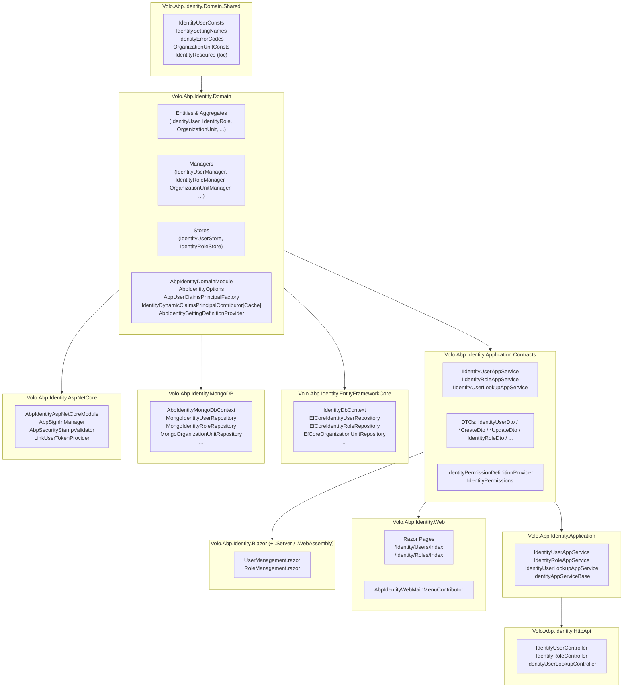
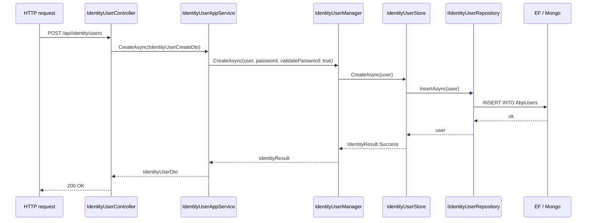

The **Identity module** (`Volo.Abp.Identity.*`) is the persistence, domain, and management layer behind every authenticated user in an ABP application. It owns `IdentityUser`, `IdentityRole`, `OrganizationUnit`, claim types, sessions, security logs, user delegations, and external link users. It plugs straight into Microsoft's `Microsoft.AspNetCore.Identity` (`UserManager<IdentityUser>`, `RoleManager<IdentityRole>`, `SignInManager<IdentityUser>`) and extends it with ABP idioms: domain services, repositories, distributed events, dynamic claims, multi-tenancy, and modular extension properties.

It is the engine; the [Account module](/modules/account/overview) is the user-facing UI on top, [OpenIddict](/modules/openiddict/overview) consumes its `SignInManager` to issue tokens, and [Permission Management](/modules/permission-management/overview) binds permissions to its roles, users, and organization units.

<Info>
**Source root.** Every type referenced on these pages lives under [`modules/identity/src/`](https://github.com/abpframework/abp/tree/dev/modules/identity/src) in the ABP repository. The 12 projects in that folder map 1‑to‑1 to the layered structure below.
</Info>

## What the module gives you

<CardGroup cols={2}>
  <Card title="Entities & aggregates" icon="database" href="/modules/identity/entities">
    `IdentityUser`, `IdentityRole`, `IdentityClaim`, `IdentityClaimType`, `IdentityUserClaim`, `IdentityUserLogin`, `IdentityUserRole`, `IdentityUserToken`, `IdentityRoleClaim`, `IdentitySession`, `IdentitySecurityLog`, `IdentityLinkUser`, `IdentityUserDelegation`, `OrganizationUnit`, `OrganizationUnitRole`, `IdentityUserOrganizationUnit`.
  </Card>
  <Card title="Domain services" icon="gears" href="/modules/identity/managers">
    `IdentityUserManager : UserManager<IdentityUser>`, `IdentityRoleManager : RoleManager<IdentityRole>`, `OrganizationUnitManager`, `IdentityUserDelegationManager`, `IdentityLinkUserManager`, `IdentitySecurityLogManager`, `IdentityClaimTypeManager`.
  </Card>
  <Card title="Application services" icon="layer-group" href="/modules/identity/application">
    `IdentityUserAppService` / `IIdentityUserAppService`, `IdentityRoleAppService` / `IIdentityRoleAppService`, `IdentityUserLookupAppService`. DTOs in `Volo.Abp.Identity.Application.Contracts`.
  </Card>
  <Card title="HTTP API" icon="plug" href="/modules/identity/http-api">
    `IdentityUserController` (`api/identity/users`), `IdentityRoleController` (`api/identity/roles`), `IdentityUserLookupController` (`api/identity/users/lookup`).
  </Card>
  <Card title="MVC UI" icon="window-maximize" href="/modules/identity/web-ui">
    Razor Pages: `/Identity/Users/Index`, `/Identity/Roles/Index`, the `CreateModal` + `EditModal` partials, the `AbpIdentityWebMainMenuContributor` menu, page authorization conventions.
  </Card>
  <Card title="Blazor UI" icon="bolt" href="/modules/identity/blazor-ui">
    `UserManagement.razor`, `RoleManagement.razor`, both `Blazor.Server` and `Blazor.WebAssembly` hosting modules. Built on `AbpCrudPageBase<TService, TDto, TKey, TGetListInput, TCreateInput, TUpdateInput>`.
  </Card>
  <Card title="EF Core provider" icon="table" href="/modules/identity/efcore">
    `IdentityDbContext`, `IdentityDbContextModelBuilderExtensions.ConfigureIdentity()`, `EfCoreIdentityUserRepository`, `EfCoreIdentityRoleRepository`, `EfCoreOrganizationUnitRepository`, and the rest of the `EfCore*Repository` family.
  </Card>
  <Card title="MongoDB provider" icon="leaf" href="/modules/identity/mongodb">
    `AbpIdentityMongoDbContext`, `MongoIdentityUserRepository`, `MongoIdentityRoleRepository`, `MongoOrganizationUnitRepository`, and the equivalent Mongo repositories for sessions, security logs, link users, and delegations.
  </Card>
  <Card title="ASP.NET Core wiring" icon="key" href="/modules/identity/aspnetcore-integration">
    `AbpIdentityAspNetCoreModule` registers `AddIdentity<IdentityUser, IdentityRole>()`, `AddIdentityCookies()`, the `AbpSignInManager`, `LinkUserTokenProvider`, and the `AbpSecurityStampValidator` callback that drives dynamic claim refresh.
  </Card>
  <Card title="Domain types" icon="cube" href="/modules/identity/domain">
    `AbpIdentityDomainModule`, `AbpIdentityOptions`, `AbpIdentityErrorDescriber`, `AbpUserClaimsPrincipalFactory`, `IdentityDynamicClaimsPrincipalContributor[Cache]`, `AbpIdentitySettingDefinitionProvider`, `ExternalLoginProviderBase` / `IExternalLoginProvider` / `IExternalLoginProviderWithPassword`.
  </Card>
</CardGroup>

## Layered structure



Every concrete arrow above is a `[DependsOn(...)]` attribute on the corresponding `AbpModule`. For example `AbpIdentityApplicationModule` declares `[DependsOn(typeof(AbpIdentityDomainModule), typeof(AbpIdentityApplicationContractsModule), typeof(AbpMapperlyModule), typeof(AbpPermissionManagementApplicationModule))]`, and `AbpIdentityHttpApiModule` only depends on `AbpIdentityApplicationContractsModule` (it does **not** reference the application implementation, so the same controllers work as remote proxies on the client).

## Project layout under `modules/identity/src/`

```text
Volo.Abp.Identity.Domain.Shared/        Constants, settings names, error codes, IdentityResource
Volo.Abp.Identity.Domain/               Entities, managers, stores, options, ext-login API
Volo.Abp.Identity.Application.Contracts/ DTOs, IIdentityUserAppService, IdentityPermissions
Volo.Abp.Identity.Application/          AppService implementations, Mapperly mappers
Volo.Abp.Identity.HttpApi/              Auto-API + explicit controllers under api/identity/*
Volo.Abp.Identity.HttpApi.Client/       Remote service proxies (Refit-style)
Volo.Abp.Identity.Web/                  MVC Razor Pages (/Identity/Users, /Identity/Roles)
Volo.Abp.Identity.Blazor/               Shared Blazor pages (UserManagement, RoleManagement)
Volo.Abp.Identity.Blazor.Server/        Hosting module for Blazor Server
Volo.Abp.Identity.Blazor.WebAssembly/   Hosting module for Blazor WebAssembly
Volo.Abp.Identity.AspNetCore/           AddIdentity + cookie auth + security stamp validator
Volo.Abp.Identity.EntityFrameworkCore/  IdentityDbContext + EF Core repositories
Volo.Abp.Identity.MongoDB/              AbpIdentityMongoDbContext + Mongo repositories
Volo.Abp.Identity.Installer/            CLI installer metadata
```

## Module dependency cheatsheet

| Module | DependsOn (excerpt) | What it adds to DI |
| --- | --- | --- |
| `AbpIdentityDomainSharedModule` | `AbpUsersDomainSharedModule`, `AbpSecurityModule` | Localization, consts |
| `AbpIdentityDomainModule` | `AbpIdentityDomainSharedModule`, `AbpDddDomainModule`, `AbpUsersDomainModule`, `AbpMapperlyModule` | Managers, stores, `AbpIdentityOptions`, calls `services.AddAbpIdentity(...)` |
| `AbpIdentityApplicationContractsModule` | `AbpIdentityDomainSharedModule`, `AbpDddApplicationContractsModule`, `AbpPermissionManagementApplicationContractsModule` | DTOs, `IdentityPermissions`, `IdentityPermissionDefinitionProvider` |
| `AbpIdentityApplicationModule` | `AbpIdentityDomainModule`, `AbpIdentityApplicationContractsModule`, `AbpPermissionManagementApplicationModule` | `IdentityUserAppService`, `IdentityRoleAppService`, Mapperly mappers |
| `AbpIdentityHttpApiModule` | `AbpIdentityApplicationContractsModule`, `AbpAspNetCoreMvcModule` | Controllers under `api/identity/*` |
| `AbpIdentityWebModule` | `AbpIdentityApplicationContractsModule`, `AbpPermissionManagementWebModule`, `AbpAspNetCoreMvcUiThemeSharedModule` | Razor Pages, menu contributor |
| `AbpIdentityBlazorModule` | `AbpIdentityApplicationContractsModule`, `AbpPermissionManagementBlazorModule`, `AbpBlazoriseUIModule` | `UserManagement.razor`, `RoleManagement.razor` |
| `AbpIdentityEntityFrameworkCoreModule` | `AbpIdentityDomainModule`, `AbpUsersEntityFrameworkCoreModule` | `IdentityDbContext` + EF repositories |
| `AbpIdentityMongoDbModule` | `AbpIdentityDomainModule`, `AbpUsersMongoDbModule` | `AbpIdentityMongoDbContext` + Mongo repositories |
| `AbpIdentityAspNetCoreModule` | `AbpIdentityDomainModule` | Cookie auth, `AbpSignInManager`, security stamp validator |

## How it composes at runtime



`IdentityUserManager` derives from `Microsoft.AspNetCore.Identity.UserManager<IdentityUser>` (see [managers](/modules/identity/managers)) so password hashing, lockout, two-factor, security stamps, and validators all keep working exactly as ASP.NET Core defines them — the only thing ABP swaps is the `IUserStore<IdentityUser>` (its own `IdentityUserStore`) and the `IdentityErrorDescriber` (its localized `AbpIdentityErrorDescriber`).

## Dynamic claims

ABP keeps `ClaimsPrincipal` cookies small. Instead of stuffing every role and permission into the cookie, only stable identity claims (`sub`, `email`, `name`, `tenantid`, ...) are baked in at sign-in. **Volatile** claims (`role`, custom claim types, anything from `IdentityClaimType`) are re-projected on every request by:

1. `IdentityDynamicClaimsPrincipalContributor` (`Volo.Abp.Identity.Domain`) — implements `AbpDynamicClaimsPrincipalContributorBase` and runs as part of `IAbpClaimsPrincipalFactory.CreateAsync(...)`.
2. `IdentityDynamicClaimsPrincipalContributorCache` — a per-user distributed cache of `AbpDynamicClaimCacheItem` so the database is not hit on every request.
3. `AbpSecurityStampValidator` (`Volo.Abp.Identity.AspNetCore`) — wires `SecurityStampValidatorOptions.OnRefreshingPrincipal` to the cache so that role/claim changes propagate without forcing a sign-out.

See [domain types](/modules/identity/domain) for the `IdentityDynamicClaimsPrincipalContributor` source and [aspnetcore-integration](/modules/identity/aspnetcore-integration) for the validator hookup.

## Multi-tenancy

Every aggregate that can belong to a tenant implements `IMultiTenant`:

- `IdentityUser`, `IdentityRole`, `OrganizationUnit`, `IdentitySession`, `IdentitySecurityLog`, `IdentityUserDelegation`, `IdentityClaim`, `IdentityUserRole`, `OrganizationUnitRole`, `IdentityUserOrganizationUnit`.

The current tenant is resolved by `ICurrentTenant` (from `Volo.Abp.MultiTenancy`) before any repository call, so cross-tenant queries are automatically filtered. `IdentityLinkUser` is the one aggregate that intentionally crosses tenant boundaries (it links a `(SourceUserId, SourceTenantId)` to a `(TargetUserId, TargetTenantId)`), and `IdentityLinkUserManager` uses `CurrentTenant.Change(null)` when it queries.

## Settings, permissions, and where to look next

- **Settings** (`AbpIdentitySettingDefinitionProvider`) — password length, lockout duration, two-factor, organization-unit visibility. Read on the [domain page](/modules/identity/domain) and see the cross-cutting [settings system](/security/settings).
- **Permissions** (`IdentityPermissionDefinitionProvider`, `IdentityPermissions`) — `AbpIdentity.Users`, `AbpIdentity.Roles`, `AbpIdentity.UserLookup`. Wired through [permission management](/modules/permission-management/overview) and the framework-level [permissions system](/security/permissions).
- **External logins** — `IExternalLoginProvider` / `IExternalLoginProviderWithPassword` / `ExternalLoginProviderBase`. LDAP, Active Directory, custom SSO providers all plug in here. See [domain page](/modules/identity/domain).
- **Account UI** — login/register/forgot-password lives in the [Account module](/modules/account/overview); it delegates to `IdentityUserManager` and `SignInManager<IdentityUser>`.
- **Token issuance** — when you front the identity store with OIDC, the [OpenIddict module](/modules/openiddict/overview) consumes the same `SignInManager<IdentityUser>` and dynamic claims pipeline.

## Reading order

<Steps>
  <Step title="Entities">
    Start with [entities](/modules/identity/entities) — the ER diagram shows the foreign keys you'll see everywhere else.
  </Step>
  <Step title="Domain types">
    Then [domain](/modules/identity/domain) for `AbpIdentityDomainModule`, options, the dynamic claims contributor, and external-login extension points.
  </Step>
  <Step title="Managers">
    [managers](/modules/identity/managers) explains how `IdentityUserManager` extends `UserManager<IdentityUser>` and where `IdentityUserStore` / `IdentityRoleStore` fit.
  </Step>
  <Step title="Application + HTTP API">
    [application](/modules/identity/application) and [http-api](/modules/identity/http-api) for the REST contract.
  </Step>
  <Step title="UI">
    [web-ui](/modules/identity/web-ui) (MVC) and [blazor-ui](/modules/identity/blazor-ui) (Blazor Server / WebAssembly).
  </Step>
  <Step title="Persistence">
    Pick [efcore](/modules/identity/efcore) or [mongodb](/modules/identity/mongodb).
  </Step>
  <Step title="ASP.NET Core wiring">
    Finish with [aspnetcore-integration](/modules/identity/aspnetcore-integration) to see how `AddIdentity` + cookie auth + dynamic claims come together.
  </Step>
</Steps>
