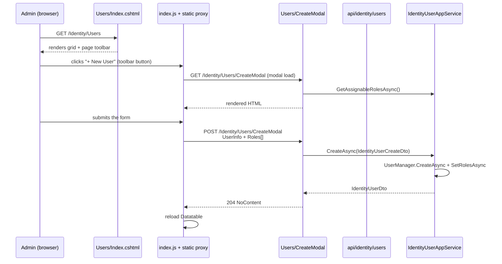

The **MVC / Razor Pages UI** of the Identity module lives in `Volo.Abp.Identity.Web`, a single assembly that hosts the user and role management screens, the administration menu entry, and a small set of page‑level conventions. It depends on `AbpIdentityApplicationContractsModule` (DTO + permission constants), `AbpPermissionManagementWebModule` (the permission grid you see behind the "Permissions" button), and `AbpAspNetCoreMvcUiThemeSharedModule` (theming).

The open‑source Identity module ships **two** management screens here — Users and Roles. Claim‑types, security‑logs, sessions, and organization‑units screens are part of the commercial Identity Pro module and are not in this project.

<Info>
**Source root:** [`modules/identity/src/Volo.Abp.Identity.Web/`](https://github.com/abpframework/abp/tree/dev/modules/identity/src/Volo.Abp.Identity.Web). All Razor Pages are under `Pages/Identity/Users/` and `Pages/Identity/Roles/`. The menu contributor and menu name constants are under `Navigation/`.
</Info>

## What the user sees

The administration menu gains an **"Identity management"** group with two items, **Roles** and **Users**, each protected by `IdentityPermissions.*.Default`. Clicking either opens a Datatables grid with a "+ New …" toolbar button, an action column with edit / permissions / delete, and modal forms for create and edit.

## `AbpIdentityWebModule`

`modules/identity/src/Volo.Abp.Identity.Web/AbpIdentityWebModule.cs` is the entry point. It is intentionally rich — most of the Razor Pages' behaviour is wired declaratively here rather than inside the page models.

```csharp
[DependsOn(typeof(AbpIdentityApplicationContractsModule))]
[DependsOn(typeof(AbpMapperlyModule))]
[DependsOn(typeof(AbpPermissionManagementWebModule))]
[DependsOn(typeof(AbpAspNetCoreMvcUiThemeSharedModule))]
public class AbpIdentityWebModule : AbpModule
{
    public override void PreConfigureServices(ServiceConfigurationContext context)
    {
        context.Services.PreConfigure<AbpMvcDataAnnotationsLocalizationOptions>(options =>
        {
            options.AddAssemblyResource(
                typeof(IdentityResource),
                typeof(AbpIdentityWebModule).Assembly,
                typeof(AbpIdentityApplicationContractsModule).Assembly
            );
        });

        PreConfigure<IMvcBuilder>(mvcBuilder =>
        {
            mvcBuilder.AddApplicationPartIfNotExists(typeof(AbpIdentityWebModule).Assembly);
        });
    }
    // ... ConfigureServices and PostConfigureServices below
}
```

`AddAssemblyResource(...)` is what makes `[Display(Name = "DisplayName:UserName")]` attributes on the view models resolve against the `IdentityResource` localization. `AddApplicationPartIfNotExists(...)` registers the Razor Pages contained in this assembly with the MVC pipeline so the host doesn't need to know about them.

### `ConfigureServices`

```csharp
public override void ConfigureServices(ServiceConfigurationContext context)
{
    Configure<AbpNavigationOptions>(options =>
    {
        options.MenuContributors.Add(new AbpIdentityWebMainMenuContributor());
    });

    Configure<AbpVirtualFileSystemOptions>(options =>
    {
        options.FileSets.AddEmbedded<AbpIdentityWebModule>();
    });

    context.Services.AddMapperlyObjectMapper<AbpIdentityWebModule>();

    Configure<RazorPagesOptions>(options =>
    {
        options.Conventions.AuthorizePage("/Identity/Users/Index", IdentityPermissions.Users.Default);
        options.Conventions.AuthorizePage("/Identity/Users/CreateModal", IdentityPermissions.Users.Create);
        options.Conventions.AuthorizePage("/Identity/Users/EditModal", IdentityPermissions.Users.Update);
        options.Conventions.AuthorizePage("/Identity/Roles/Index", IdentityPermissions.Roles.Default);
        options.Conventions.AuthorizePage("/Identity/Roles/CreateModal", IdentityPermissions.Roles.Create);
        options.Conventions.AuthorizePage("/Identity/Roles/EditModal", IdentityPermissions.Roles.Update);
    });

    Configure<AbpPageToolbarOptions>(options =>
    {
        options.Configure<Volo.Abp.Identity.Web.Pages.Identity.Users.IndexModel>(
            toolbar =>
            {
                toolbar.AddButton(
                    LocalizableString.Create<IdentityResource>("NewUser"),
                    icon: "plus",
                    name: "CreateUser",
                    requiredPolicyName: IdentityPermissions.Users.Create
                );
            }
        );

        options.Configure<Volo.Abp.Identity.Web.Pages.Identity.Roles.IndexModel>(
            toolbar =>
            {
                toolbar.AddButton(
                    LocalizableString.Create<IdentityResource>("NewRole"),
                    icon: "plus",
                    name: "CreateRole",
                    requiredPolicyName: IdentityPermissions.Roles.Create
                );
            }
        );
    });

    Configure<DynamicJavaScriptProxyOptions>(options =>
    {
        options.DisableModule(IdentityRemoteServiceConsts.ModuleName);
    });
}
```

There are five things happening here, each driving a piece of the runtime behaviour:

1. **Menu contributor** — see the next section.
2. **Embedded file set** — the `.cshtml`, `.js`, and `.css` files for the pages ship as embedded resources, served by `Volo.Abp.VirtualFileSystem`.
3. **Mapperly object mapper** — view models ↔ DTO mappings. The source is `modules/identity/src/Volo.Abp.Identity.Web/AbpIdentityWebMappers.cs`.
4. **Razor Pages conventions** — each page is protected by an `[Authorize(...)]`‑equivalent convention. This is in addition to the `[Authorize(IdentityPermissions.Users.Default)]` already on `IdentityUserAppService`; it stops an unauthorized user from even reaching the HTML.
5. **Page toolbars** — the green "New User" / "New Role" toolbar buttons on the index pages are not in the `.cshtml` markup; they're injected via `AbpPageToolbarOptions` so other modules can add buttons without editing the source.

The last `Configure<DynamicJavaScriptProxyOptions>` call **disables** the dynamic `/api/abp/service-proxies?modules=identity` script for this module — instead the pages load the pre‑generated static proxies from `wwwroot/client-proxies/` (embedded with the file set above). That's a perf optimization: the dynamic generator scans every controller in the host at runtime.

### `PostConfigureServices`

```csharp
public override void PostConfigureServices(ServiceConfigurationContext context)
{
    OneTimeRunner.Run(() =>
    {
        ModuleExtensionConfigurationHelper
            .ApplyEntityConfigurationToUi(
                IdentityModuleExtensionConsts.ModuleName,
                IdentityModuleExtensionConsts.EntityNames.Role,
                createFormTypes: new[] { typeof(Volo.Abp.Identity.Web.Pages.Identity.Roles.CreateModalModel.RoleInfoModel) },
                editFormTypes: new[] { typeof(Volo.Abp.Identity.Web.Pages.Identity.Roles.EditModalModel.RoleInfoModel) }
            );

        ModuleExtensionConfigurationHelper
            .ApplyEntityConfigurationToUi(
                IdentityModuleExtensionConsts.ModuleName,
                IdentityModuleExtensionConsts.EntityNames.User,
                createFormTypes: new[] { typeof(Volo.Abp.Identity.Web.Pages.Identity.Users.CreateModalModel.UserInfoViewModel) },
                editFormTypes: new[] { typeof(Volo.Abp.Identity.Web.Pages.Identity.Users.EditModalModel.UserInfoViewModel) }
            );
    });
}
```

This is the second half of the object‑extensions wiring — the contracts module exposed extras to the API DTOs in `PostConfigureServices`, here we mirror those extras into the Razor Page view‑models so any custom property added with `ObjectExtensionManager.Instance.AddOrUpdateProperty<...>(...)` automatically renders in the create / edit modals.

## Menu — `AbpIdentityWebMainMenuContributor`

`modules/identity/src/Volo.Abp.Identity.Web/Navigation/AbpIdentityWebMainMenuContributor.cs`:

```csharp
public class AbpIdentityWebMainMenuContributor : IMenuContributor
{
    public virtual Task ConfigureMenuAsync(MenuConfigurationContext context)
    {
        if (context.Menu.Name != StandardMenus.Main)
        {
            return Task.CompletedTask;
        }

        var l = context.GetLocalizer<IdentityResource>();

        var identityMenuItem = new ApplicationMenuItem(
            IdentityMenuNames.GroupName,
            l["Menu:IdentityManagement"],
            icon: "fa fa-id-card-o");

        identityMenuItem.AddItem(
            new ApplicationMenuItem(IdentityMenuNames.Roles, l["Roles"], url: "~/Identity/Roles")
                .RequirePermissions(IdentityPermissions.Roles.Default));

        identityMenuItem.AddItem(
            new ApplicationMenuItem(IdentityMenuNames.Users, l["Users"], url: "~/Identity/Users")
                .RequirePermissions(IdentityPermissions.Users.Default));

        context.Menu.GetAdministration().AddItem(identityMenuItem);

        return Task.CompletedTask;
    }
}
```

A few details worth noting:

- The contributor short‑circuits unless `context.Menu.Name == StandardMenus.Main`. ABP also raises `Configure` for the user menu (`StandardMenus.User`) — this contributor deliberately ignores it.
- `context.Menu.GetAdministration()` looks up (or lazily creates) the standard **Administration** menu group, so Identity always lives under it next to Tenant Management, Settings, etc.
- `IdentityMenuNames` (`modules/identity/src/Volo.Abp.Identity.Web/Navigation/IdentityMenuNames.cs`) is just three string constants:
  ```csharp
  public class IdentityMenuNames
  {
      public const string GroupName = "AbpIdentity";
      public const string Roles = GroupName + ".Roles";
      public const string Users = GroupName + ".Users";
  }
  ```
  Using constants here means another module (e.g. a custom plugin) can locate `"AbpIdentity"` and insert its own items underneath without re‑declaring the parent.

## Razor Pages — file inventory

Every page lives under `modules/identity/src/Volo.Abp.Identity.Web/Pages/Identity/`:

| File | Page model class | Route |
| --- | --- | --- |
| `IdentityPageModel.cs` | `IdentityPageModel : AbpPageModel` | (base class) |
| `_ViewImports.cshtml` | — | (tag helpers, namespaces) |
| `Users/Index.cshtml` + `.cs` + `index.js` + `index.css` | `Users.IndexModel` | `/Identity/Users` |
| `Users/CreateModal.cshtml` + `.cs` | `Users.CreateModalModel` | `/Identity/Users/CreateModal` |
| `Users/EditModal.cshtml` + `.cs` | `Users.EditModalModel` | `/Identity/Users/EditModal` |
| `Roles/Index.cshtml` + `.cs` + `index.js` | `Roles.IndexModel` | `/Identity/Roles` |
| `Roles/CreateModal.cshtml` + `.cs` | `Roles.CreateModalModel` | `/Identity/Roles/CreateModal` |
| `Roles/EditModal.cshtml` + `.cs` | `Roles.EditModalModel` | `/Identity/Roles/EditModal` |

### `IdentityPageModel` base

`modules/identity/src/Volo.Abp.Identity.Web/Pages/Identity/IdentityPageModel.cs` is a trivial base class that just sets the `ObjectMapperContext`:

```csharp
public abstract class IdentityPageModel : AbpPageModel
{
    protected IdentityPageModel()
    {
        ObjectMapperContext = typeof(AbpIdentityWebModule);
    }
}
```

That single line is what tells `ObjectMapper` to use the Mapperly mapper registered for `AbpIdentityWebModule` — i.e. the view‑model ↔ DTO mapping you can see in `AbpIdentityWebMappers.cs`.

### Users — Index

`modules/identity/src/Volo.Abp.Identity.Web/Pages/Identity/Users/Index.cshtml.cs`:

```csharp
public class IndexModel : IdentityPageModel
{
    public virtual Task<IActionResult> OnGetAsync()
    {
        return Task.FromResult<IActionResult>(Page());
    }

    public virtual Task<IActionResult> OnPostAsync()
    {
        return Task.FromResult<IActionResult>(Page());
    }
}
```

It's deliberately empty — all the actual rendering happens on the client. `index.js` calls `volo.abp.identity.identityUser.getList(...)` (the static proxy), populates the Datatable, and wires the toolbar / row actions.

### Users — `CreateModal`

`modules/identity/src/Volo.Abp.Identity.Web/Pages/Identity/Users/CreateModal.cshtml.cs` carries the view‑model **and** the inner DTO‑style class with data‑annotations:

```csharp
public class CreateModalModel : IdentityPageModel
{
    [BindProperty]
    public UserInfoViewModel UserInfo { get; set; }

    [BindProperty]
    public AssignedRoleViewModel[] Roles { get; set; }

    protected IIdentityUserAppService IdentityUserAppService { get; }

    public CreateModalModel(IIdentityUserAppService identityUserAppService)
    {
        IdentityUserAppService = identityUserAppService;
    }

    public virtual async Task<IActionResult> OnGetAsync()
    {
        UserInfo = new UserInfoViewModel();

        var roleDtoList = (await IdentityUserAppService.GetAssignableRolesAsync()).Items;

        Roles = ObjectMapper.Map<IReadOnlyList<IdentityRoleDto>, AssignedRoleViewModel[]>(roleDtoList);

        foreach (var role in Roles)
        {
            role.IsAssigned = role.IsDefault;
        }

        return Page();
    }

    public virtual async Task<NoContentResult> OnPostAsync()
    {
        ValidateModel();

        var input = ObjectMapper.Map<UserInfoViewModel, IdentityUserCreateDto>(UserInfo);
        input.RoleNames = Roles.Where(r => r.IsAssigned).Select(r => r.Name).ToArray();

        await IdentityUserAppService.CreateAsync(input);

        return NoContent();
    }

    public class UserInfoViewModel : ExtensibleObject
    {
        [Required]
        [DynamicStringLength(typeof(IdentityUserConsts), nameof(IdentityUserConsts.MaxUserNameLength))]
        public string UserName { get; set; }

        [DynamicStringLength(typeof(IdentityUserConsts), nameof(IdentityUserConsts.MaxNameLength))]
        public string Name { get; set; }

        [DynamicStringLength(typeof(IdentityUserConsts), nameof(IdentityUserConsts.MaxSurnameLength))]
        public string Surname { get; set; }

        [Required]
        [DataType(DataType.Password)]
        [DisableAuditing]
        [DynamicStringLength(typeof(IdentityUserConsts), nameof(IdentityUserConsts.MaxPasswordLength))]
        public string Password { get; set; }

        [Required]
        [EmailAddress]
        [DynamicStringLength(typeof(IdentityUserConsts), nameof(IdentityUserConsts.MaxEmailLength))]
        public string Email { get; set; }

        [DynamicStringLength(typeof(IdentityUserConsts), nameof(IdentityUserConsts.MaxPhoneNumberLength))]
        public string PhoneNumber { get; set; }

        public bool IsActive { get; set; } = true;
        public bool LockoutEnabled { get; set; } = true;
    }
    // ...
}
```

Three things worth highlighting:

- `[DynamicStringLength(typeof(IdentityUserConsts), nameof(...))]` — instead of hard‑coding `[StringLength(64)]`, ABP looks up the constant at runtime so changes to `IdentityUserConsts.MaxUserNameLength` (in `Volo.Abp.Identity.Domain.Shared`) flow automatically.
- `[DisableAuditing]` on `Password` strips it from audit log payloads.
- `UserInfoViewModel : ExtensibleObject` — the view model itself is extensible, so the `PostConfigureServices` registration above can inject extra UI fields.

### Users — `EditModal`

Same structure as `CreateModal`, but `OnGetAsync` populates the form from `await IdentityUserAppService.GetAsync(id)` and `OnPostAsync` calls `UpdateAsync(id, input)`. The view model carries `ConcurrencyStamp` so optimistic concurrency conflicts surface as a friendly error.

### Roles

`modules/identity/src/Volo.Abp.Identity.Web/Pages/Identity/Roles/CreateModal.cshtml.cs`:

```csharp
public class CreateModalModel : IdentityPageModel
{
    [BindProperty]
    public RoleInfoModel Role { get; set; }

    protected IIdentityRoleAppService IdentityRoleAppService { get; }

    public CreateModalModel(IIdentityRoleAppService identityRoleAppService)
    {
        IdentityRoleAppService = identityRoleAppService;
    }
    // OnGetAsync sets Role = new RoleInfoModel();
    // OnPostAsync maps RoleInfoModel -> IdentityRoleCreateDto and calls CreateAsync
}
```

`RoleInfoModel` exposes `Name`, `IsDefault`, `IsPublic`. The "Permissions" button on the role grid opens the [Permission Management](/security/permissions) modal, which is registered by `AbpPermissionManagementWebModule` (a dependency of this one).

## Static JS proxies and client‑side wiring

`Pages/Identity/Users/index.js` (embedded in the assembly) is a small jQuery DataTable that calls the **static** JavaScript proxies emitted into `wwwroot/client-proxies/` by the proxy generator. The build copies them in via:

```text
modules/identity/src/Volo.Abp.Identity.Web/wwwroot/client-proxies/
    identity-proxy.js
    identity-proxy.min.js
```

These map directly to the routes you saw in [HTTP API](/modules/identity/http-api). The `DisableModule("identity")` call in `AbpIdentityWebModule` makes sure the dynamic proxy generator does not re‑emit them at runtime.

## Putting it together — the lifecycle of "New User"



The toolbar button is the one registered in `AbpPageToolbarOptions`; the page authorization conventions guard the modal endpoints; the static proxy carries the antiforgery token via the `RequestVerificationToken` header.

## Extending the UI

The two recommended extension surfaces:

1. **Add a field** to the create / edit modal — define it with `ObjectExtensionManager.Instance.AddOrUpdateProperty<IdentityUser, T>(...)`. Because the `UserInfoViewModel` is `ExtensibleObject` and `PostConfigureServices` calls `ApplyEntityConfigurationToUi`, the new field renders automatically.
2. **Add a toolbar button** to the index page — call `Configure<AbpPageToolbarOptions>(options => options.Configure<Volo.Abp.Identity.Web.Pages.Identity.Users.IndexModel>(t => t.AddButton(...)))` in your own module.

For a brand‑new page (say `/Identity/MySection`), subclass `IdentityPageModel`, add the convention with `RazorPagesOptions.Conventions.AuthorizePage(...)`, and register a menu item by adding your own `IMenuContributor` to `AbpNavigationOptions.MenuContributors`.

## Related pages

- [Identity overview](/modules/identity/overview)
- [Application layer](/modules/identity/application) — services the page models call.
- [HTTP API](/modules/identity/http-api) — the routes exposed by static JS proxies.
- [Blazor UI](/modules/identity/blazor-ui) — the Blazor equivalent of these pages.
- [Entities](/modules/identity/entities), [Managers](/modules/identity/managers)
- [Permission management](/security/permissions) — what the "Permissions" button opens.
- [Account module](/modules/account/overview) — the login UI that lets users reach `/Identity/Users` in the first place.
- [OpenIddict module](/modules/openiddict/overview) — the token endpoint behind the cookie auth used here.
