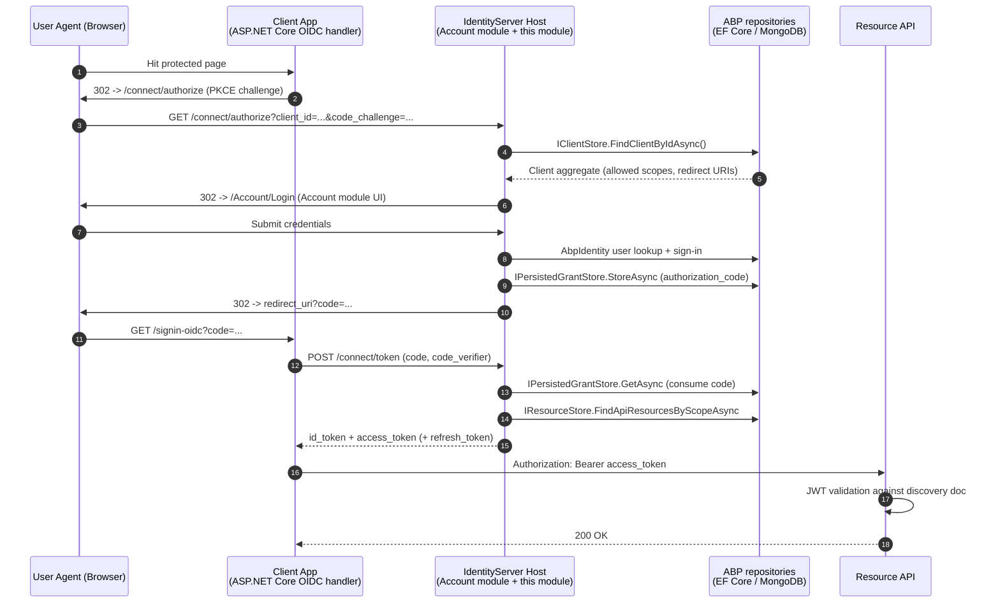

<Warning>
**Legacy module.** This module wraps the [IdentityServer4](https://github.com/IdentityServer/IdentityServer4) (and Duende IdentityServer in commercial editions) authorization server. It is retained so existing applications can be maintained and upgraded, but **new applications should use the [OpenIddict module](/modules/openiddict/overview)**, which is the default forward path on ABP.

If you are building a fresh solution, start with OpenIddict and `Volo.Abp.OpenIddict.AspNetCore` — its data model, repositories, and host integration are conceptually similar but actively developed against current standards.
</Warning>

## What this module gives you

The `Volo.Abp.IdentityServer` module turns an ABP application into a full **OpenID Connect provider** and **OAuth 2.0 authorization server**. It owns the persistence model for IdentityServer4's configuration and operational stores, plugs them into ABP's repository and Unit-of-Work pipeline, and integrates with the [Identity module](/modules/identity/overview) (`AbpIdentityDomainModule`) so the same `IdentityUser`/`IdentityRole` aggregates are used as the local user store.

Concretely, the module:

- Persists **`Client`**, **`ApiResource`**, **`ApiScope`**, **`IdentityResource`**, **`PersistedGrant`** and **`DeviceFlowCodes`** aggregates as ABP entities with `FullAuditedAggregateRoot<Guid>` semantics, change tracking, and entity-extension support.
- Registers ABP-backed `IClientStore`, `IResourceStore`, `IPersistedGrantStore`, `IDeviceFlowStore`, and `ICorsPolicyService` implementations on top of `IIdentityServerBuilder`.
- Ships a background worker (`TokenCleanupBackgroundWorker`) that periodically prunes expired `PersistedGrant` and `DeviceFlowCodes` rows.
- Provides EF Core and MongoDB providers via `Volo.Abp.IdentityServer.EntityFrameworkCore` and `Volo.Abp.IdentityServer.MongoDB`.
- Defines distributed event ETOs (`ClientEto`, `ApiResourceEto`, `IdentityResourceEto`, `DeviceFlowCodesEto`) so other services can react to config changes.

The module is consumed by the hostable **Account / IdentityServer host** application (see [`/modules/account/identityserver-host`](/modules/account/identityserver-host)) which provides the login UI, consent screen, and discovery endpoints.

## Module layout

```text
modules/identityserver/src/
├── Volo.Abp.IdentityServer.Domain.Shared/         # consts, ETOs, localization
├── Volo.Abp.IdentityServer.Domain/                # entities, repositories, IS4 plumbing
├── Volo.Abp.IdentityServer.EntityFrameworkCore/   # EF Core DbContext + repositories
├── Volo.Abp.IdentityServer.MongoDB/               # MongoDB context + repositories
├── Volo.Abp.IdentityServer.Installer/             # ABP CLI installer
└── Volo.Abp.PermissionManagement.Domain.IdentityServer/  # permission integration
```

## Where to go next

<CardGroup cols={2}>
  <Card title="Domain layer" icon="cube" href="/modules/identityserver/domain">
    Aggregate roots — `Client`, `ApiResource`, `ApiScope`, `IdentityResource`, `PersistedGrant`, `DeviceFlowCodes` — repository contracts, the `AbpIdentityServerDomainModule`, and how ABP wires its stores into `IIdentityServerBuilder`.
  </Card>
  <Card title="EF Core provider" icon="database" href="/modules/identityserver/efcore">
    `IdentityServerDbContext`, the EF Core repository implementations, `ConfigureIdentityServer()` model builder, and table layout under the `IdentityServer` prefix in the `AbpIdentityServer` connection string.
  </Card>
  <Card title="MongoDB provider" icon="leaf" href="/modules/identityserver/mongodb">
    `AbpIdentityServerMongoDbContext`, the embedded-document layout for clients and resources, and the `Mongo*Repository` classes.
  </Card>
  <Card title="OpenIddict (recommended)" icon="shield-check" href="/modules/openiddict/overview">
    The replacement module for new applications. Same conceptual role; actively developed against current OpenID Connect specs.
  </Card>
  <Card title="Account / IdentityServer host" icon="house-lock" href="/modules/account/identityserver-host">
    The opinionated host application that exposes the OIDC endpoints and ties this module to the Account login UI.
  </Card>
  <Card title="Identity module" icon="users" href="/modules/identity/overview">
    Local user/role aggregate roots. `AbpIdentityServerDomainModule` depends on `AbpIdentityDomainModule` for its user store.
  </Card>
  <Card title="OIDC client integration" icon="key" href="/aspnetcore/auth-openidconnect">
    How an ABP web app consumes an IdentityServer (or OpenIddict) provider via the standard ASP.NET Core OpenID Connect handler.
  </Card>
</CardGroup>

## The legacy authorization-server flow

The diagram below summarises a typical **authorization code + PKCE** flow when this module is hosted as the OIDC provider. Note that the steps in green are pure IdentityServer4 internals — ABP plugs into them by supplying persistence — while the blue path shows where ABP-specific stores intercept requests.



A few things to notice:

- **`IClientStore`**, **`IResourceStore`**, **`IPersistedGrantStore`** and **`IDeviceFlowStore`** are the IdentityServer4 interfaces. The Domain module replaces the default in-memory implementations with ABP-backed ones whenever the EF Core or MongoDB module is also referenced (see how `AddAbpStores()` is invoked from `PreConfigureServices` in the provider modules).
- **`PersistedGrant`** is the operational store. Authorization codes, refresh tokens, reference tokens, user consent, and device codes are all serialised into it. The background `TokenCleanupService` deletes expired rows so the table does not grow unbounded.
- **`Client`**, **`ApiResource`**, **`ApiScope`**, and **`IdentityResource`** are the configuration store — they describe *what* the server is willing to issue tokens for. They are managed through ABP application services in the host.

## Adding the module to a host

The module set you reference depends on the database provider:

<Tabs>
  <Tab title="EF Core">
```csharp
[DependsOn(
    typeof(AbpIdentityServerEntityFrameworkCoreModule),
    typeof(AbpAccountWebIdentityServerModule), // host UI
    typeof(AbpIdentityEntityFrameworkCoreModule)
)]
public class MyAuthServerModule : AbpModule
{
    public override void ConfigureServices(ServiceConfigurationContext context)
    {
        Configure<AbpDbContextOptions>(options =>
        {
            options.UseSqlServer();
        });
    }
}
```
  </Tab>
  <Tab title="MongoDB">
```csharp
[DependsOn(
    typeof(AbpIdentityServerMongoDbModule),
    typeof(AbpAccountWebIdentityServerModule),
    typeof(AbpIdentityMongoDbModule)
)]
public class MyAuthServerModule : AbpModule
{
    public override void ConfigureServices(ServiceConfigurationContext context)
    {
        Configure<AbpDbConnectionOptions>(options =>
        {
            options.ConnectionStrings.Default =
                context.Services.GetConfiguration().GetConnectionString("Default");
        });
    }
}
```
  </Tab>
</Tabs>

In `Program.cs`, the host calls `app.UseAbpClaimsMap()` and `app.UseIdentityServer()` in the pipeline. The `AbpIdentityServerDomainModule` itself configures the `IIdentityServerBuilder` with `AddRequiredPlatformServices()`, `AddCoreServices()`, `AddDefaultEndpoints()`, `AddPluggableServices()`, validators, response generators, and the default secret parsers/validators — see [the domain layer page](/modules/identityserver/domain) for the exact call chain.

## In-memory fallback

When neither the EF Core nor MongoDB module is referenced, the Domain module falls back to **in-memory** stores so that local development and unit tests still work:

```csharp
// AbpIdentityServerDomainModule.AddIdentityServer (excerpt)
if (!services.IsAdded<IClientStore>())
{
    identityServerBuilder.AddInMemoryClients(
        configuration.GetSection("IdentityServer:Clients"));
}

if (!services.IsAdded<IResourceStore>())
{
    identityServerBuilder.AddInMemoryApiResources(
        configuration.GetSection("IdentityServer:ApiResources"));
    identityServerBuilder.AddInMemoryIdentityResources(
        configuration.GetSection("IdentityServer:IdentityResources"));
}
```

This makes it possible to declare a small test client purely in `appsettings.json`. It is **not** suitable for production — use a real provider.

## Cleanup worker

The Domain module registers a `TokenCleanupBackgroundWorker` that wakes every `CleanupPeriod` milliseconds (default 1 hour) and calls `TokenCleanupService.CleanAsync()`, which delegates to:

```csharp
[UnitOfWork]
public virtual async Task CleanAsync()
{
    await RemoveGrantsAsync();      // PersistentGrantRepository.DeleteExpirationAsync(DateTime.UtcNow)
    await RemoveDeviceCodesAsync(); // DeviceFlowCodesRepository.DeleteExpirationAsync(DateTime.UtcNow)
}
```

You can disable it by setting `TokenCleanupOptions.IsCleanupEnabled = false` from your host module.

## Migration to OpenIddict

Volo provides a one-time data migration tool that copies the IdentityServer4 configuration store (`Client`, `ApiResource`, `ApiScope`, `IdentityResource`) into the OpenIddict tables. The persisted-grant table is **not** migrated — outstanding refresh tokens and authorization codes need to be re-issued. After migration:

1. Swap `AbpIdentityServer*` module dependencies for the matching `AbpOpenIddict*` modules.
2. Replace `AddIdentityServer()` calls with the equivalent OpenIddict registration (handled by `AbpOpenIddictAspNetCoreModule`).
3. Re-issue any long-lived refresh tokens for connected clients.

See [`/modules/openiddict/overview`](/modules/openiddict/overview) for the target topology.

## What runs at startup

`AbpIdentityServerDomainModule.OnApplicationInitializationAsync` does only one thing — start the cleanup worker if it is enabled:

```csharp
public async override Task OnApplicationInitializationAsync(
    ApplicationInitializationContext context)
{
    var options = context.ServiceProvider
        .GetRequiredService<IOptions<TokenCleanupOptions>>().Value;
    if (options.IsCleanupEnabled)
    {
        await context.ServiceProvider
            .GetRequiredService<IBackgroundWorkerManager>()
            .AddAsync(
                context.ServiceProvider
                    .GetRequiredService<TokenCleanupBackgroundWorker>()
            );
    }
}
```

Everything else — registering stores on `IIdentityServerBuilder`, mapping ETOs, applying entity extensions — happens in `ConfigureServices` / `PostConfigureServices`. The host's middleware pipeline still needs to insert `app.UseIdentityServer()` between authentication and authorization.

## Tenant context in issued tokens

Because the Domain module pre-populates `AbpClaimsServiceOptions.RequestedClaims` with `AbpClaimTypes.TenantId` and `AbpClaimTypes.EditionId`, every access token and id token automatically carries the user's tenant context **if** the client has `AlwaysIncludeUserClaimsInIdToken` enabled or the relevant scopes are requested:

```csharp
// AbpIdentityServerDomainModule.ConfigureServices (excerpt)
Configure<AbpClaimsServiceOptions>(options =>
{
    options.RequestedClaims.AddRange(new[]{
        AbpClaimTypes.TenantId,
        AbpClaimTypes.EditionId
    });
});
```

A downstream API can then resolve the current tenant from `ICurrentTenant` without any extra configuration — ABP's claims-principal accessor reads `tenantid` from the bearer token.

## Configuration store vs operational store

IdentityServer4 splits its persistence model into two halves, and this module preserves the distinction:

| Half | Aggregates | Churn | Where it lives |
|------|------------|-------|----------------|
| **Configuration store** | `Client`, `ApiResource`, `ApiScope`, `IdentityResource` | Edited by admins (low) | Same DbContext / Mongo collection as the rest of the host config |
| **Operational store** | `PersistedGrant`, `DeviceFlowCodes` | Every login / token refresh (high) | Same context, but separate tables / collections and indexes optimised for time-based DELETE |

Because the two halves live in the same connection-string context, you do not need a second database — but if you scale out, the operational tables are the ones that grow fastest and benefit most from background cleanup and from being sharded onto faster storage.

## Distributed event ETOs

The module wires the four configuration aggregates into ABP's [distributed entity event](/eventbus) pipeline:

```csharp
Configure<AbpDistributedEntityEventOptions>(options =>
{
    options.EtoMappings.Add<ApiResource, ApiResourceEto>(typeof(AbpIdentityServerDomainModule));
    options.EtoMappings.Add<Client, ClientEto>(typeof(AbpIdentityServerDomainModule));
    options.EtoMappings.Add<DeviceFlowCodes, DeviceFlowCodesEto>(typeof(AbpIdentityServerDomainModule));
    options.EtoMappings.Add<IdentityResource, IdentityResourceEto>(typeof(AbpIdentityServerDomainModule));
});
```

When a client is created/updated/deleted, the matching `EntityCreatedEto<ClientEto>` etc. is published on the message bus. Cache invalidation is wired up via `IdentityServerCacheItemInvalidator` and `AllowedCorsOriginsCacheItemInvalidator` so peers re-load `Client`/`ApiResource`/`IdentityResource` definitions on their next request. The `PersistedGrant` aggregate is deliberately **not** included in this set — operational-store churn would saturate the bus.

## Permission integration

A separate package — `Volo.Abp.PermissionManagement.Domain.IdentityServer` — bridges this module into ABP's [permission management](/security/permissions). It teaches the permission system how to load and persist `Client`-scoped permissions, so an admin UI can grant a *client* (machine account) permissions distinct from any user. This is mainly used by the [Account host](/modules/account/identityserver-host) for the "Manage permissions" button on the client-management screen.

## Default lifetimes

The `Client(Guid, string)` constructor in the [domain layer](/modules/identityserver/domain#client) seeds the typical IS4 token lifetimes:

| Property | Default | Meaning |
|----------|---------|---------|
| `IdentityTokenLifetime` | `300` s | `id_token` validity |
| `AccessTokenLifetime` | `3600` s | `access_token` validity |
| `AuthorizationCodeLifetime` | `300` s | `code` validity at the token endpoint |
| `AbsoluteRefreshTokenLifetime` | `2_592_000` s (30 d) | Maximum refresh-token age |
| `SlidingRefreshTokenLifetime` | `1_296_000` s (15 d) | Sliding renewal window |
| `DeviceCodeLifetime` | `300` s | Device-flow `device_code` validity |
| `RefreshTokenUsage` | `OneTimeOnly` | Rotate the refresh token on every use |
| `RefreshTokenExpiration` | `Absolute` | Stop refreshing after the absolute lifetime |
| `AccessTokenType` | `Jwt` | Self-contained access token |

Override these via the admin UI or by setting the properties directly when seeding a client from code.

## When to keep using this module

- You already have a production deployment of an ABP application built against this module and need to ship maintenance updates.
- You depend on IS4-specific features that have no direct OpenIddict equivalent yet (custom `IExtensionGrantValidator`, custom token-request validators, IS4 admin UI packages).
- You are mid-migration and need both providers running side-by-side for a window.

For everything else, plan a move to [OpenIddict](/modules/openiddict/overview).

## Cross-references

<CardGroup cols={3}>
  <Card title="Domain layer" icon="cube" href="/modules/identityserver/domain" />
  <Card title="EF Core" icon="database" href="/modules/identityserver/efcore" />
  <Card title="MongoDB" icon="leaf" href="/modules/identityserver/mongodb" />
  <Card title="OpenIddict overview" icon="shield-check" href="/modules/openiddict/overview" />
  <Card title="Identity module" icon="users" href="/modules/identity/overview" />
  <Card title="Account / IS host" icon="house-lock" href="/modules/account/identityserver-host" />
  <Card title="OIDC client" icon="key" href="/aspnetcore/auth-openidconnect" />
  <Card title="Eventbus" icon="bolt" href="/eventbus" />
  <Card title="Permission system" icon="lock" href="/security/permissions" />
</CardGroup>
