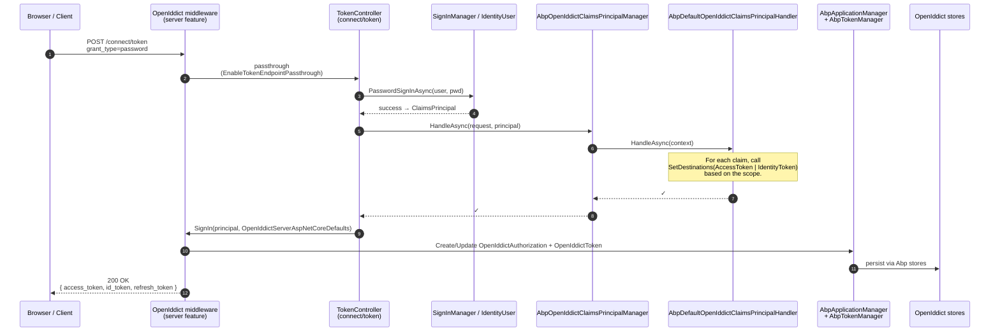

`Volo.Abp.OpenIddict.AspNetCore` is the package that **mounts the authorization server on HTTP**. It depends on the domain layer (which already replaced OpenIddict's managers, stores, and caches — see [domain](/modules/openiddict/domain)), then adds the ASP.NET Core server feature: token / authorize / userinfo / endsession (logout) controllers, claim‑destination handlers, wildcard‑domain redirect URI handlers, validation middleware, and the `AbpOpenIddictAspNetCoreOptions` knobs you use to tune the whole thing.

Folder covered: `modules/openiddict/src/Volo.Abp.OpenIddict.AspNetCore/Volo/Abp/OpenIddict/` (plus the `Microsoft/AspNetCore/Builder/` extension and `Microsoft/Extensions/DependencyInjection/` helpers).

## Module declaration

`AbpOpenIddictAspNetCoreModule` depends on the MVC UI theme module, the multi‑tenancy module, and the OpenIddict domain module:

```csharp
// modules/openiddict/src/Volo.Abp.OpenIddict.AspNetCore/Volo/Abp/OpenIddict/AbpOpenIddictAspNetCoreModule.cs
[DependsOn(
    typeof(AbpAspNetCoreMvcUiThemeSharedModule),
    typeof(AbpAspNetCoreMultiTenancyModule),
    typeof(AbpOpenIddictDomainModule)
)]
public class AbpOpenIddictAspNetCoreModule : AbpModule
{
    public override void ConfigureServices(ServiceConfigurationContext context)
    {
        AddOpenIddictServer(context.Services);

        Configure<AbpOpenIddictClaimsPrincipalOptions>(options =>
        {
            options.ClaimsPrincipalHandlers.Add<AbpDefaultOpenIddictClaimsPrincipalHandler>();
        });

        Configure<RazorViewEngineOptions>(options =>
        {
            options.ViewLocationFormats.Add("/Volo/Abp/OpenIddict/Views/{1}/{0}.cshtml");
        });
    }
}
```

Three things happen in `ConfigureServices`:

1. `AddOpenIddictServer(...)` calls `services.AddOpenIddict().AddServer(...)` with ABP's full preset.
2. The default claim handler is appended to `AbpOpenIddictClaimsPrincipalOptions.ClaimsPrincipalHandlers`.
3. A view‑location format is registered so the bundled `Authorize.cshtml`, `Error.cshtml`, etc. can be discovered by the Razor view engine.

## The request pipeline



The token response is shaped by the **claim destinations** that the handler set. A claim with `Destinations.AccessToken` ends up in the JWT access token; `Destinations.IdentityToken` puts it in the `id_token`. A claim with no destinations is discarded.

## AddOpenIddict().AddServer wiring

`AddOpenIddictServer` is the heart of the module. It reads `AbpOpenIddictAspNetCoreOptions` (via the pre‑configured action chain) and feeds them into OpenIddict's server builder:

```csharp
// modules/openiddict/src/Volo.Abp.OpenIddict.AspNetCore/Volo/Abp/OpenIddict/AbpOpenIddictAspNetCoreModule.cs
private void AddOpenIddictServer(IServiceCollection services)
{
    var builderOptions = services.ExecutePreConfiguredActions<AbpOpenIddictAspNetCoreOptions>();

    if (builderOptions.UpdateAbpClaimTypes)
    {
        AbpClaimTypes.UserId = OpenIddictConstants.Claims.Subject;
        AbpClaimTypes.Role = OpenIddictConstants.Claims.Role;
        AbpClaimTypes.UserName = OpenIddictConstants.Claims.PreferredUsername;
        AbpClaimTypes.Name = OpenIddictConstants.Claims.GivenName;
        AbpClaimTypes.SurName = OpenIddictConstants.Claims.FamilyName;
        AbpClaimTypes.PhoneNumber = OpenIddictConstants.Claims.PhoneNumber;
        AbpClaimTypes.PhoneNumberVerified = OpenIddictConstants.Claims.PhoneNumberVerified;
        AbpClaimTypes.Email = OpenIddictConstants.Claims.Email;
        AbpClaimTypes.EmailVerified = OpenIddictConstants.Claims.EmailVerified;
        AbpClaimTypes.ClientId = OpenIddictConstants.Claims.ClientId;
    }

    var openIddictBuilder = services.AddOpenIddict()
        .AddServer(builder =>
        {
            builder
                .SetAuthorizationEndpointUris("connect/authorize", "connect/authorize/callback")
                .SetDeviceAuthorizationEndpointUris("device")
                .SetIntrospectionEndpointUris("connect/introspect")
                .SetEndSessionEndpointUris("connect/endsession")
                .SetPushedAuthorizationEndpointUris("connect/par")
                .SetRevocationEndpointUris("connect/revocat")
                .SetTokenEndpointUris("connect/token")
                .SetUserInfoEndpointUris("connect/userinfo")
                .SetEndUserVerificationEndpointUris("connect/verify");

            builder
                .AllowAuthorizationCodeFlow()
                .AllowHybridFlow()
                .AllowImplicitFlow()
                .AllowPasswordFlow()
                .AllowClientCredentialsFlow()
                .AllowRefreshTokenFlow()
                .AllowDeviceAuthorizationFlow()
                .AllowNoneFlow()
                .AllowTokenExchangeFlow();

            builder.RegisterScopes(new[]
            {
                OpenIddictConstants.Scopes.OpenId,
                OpenIddictConstants.Scopes.Email,
                OpenIddictConstants.Scopes.Profile,
                OpenIddictConstants.Scopes.Phone,
                OpenIddictConstants.Scopes.Roles,
                OpenIddictConstants.Scopes.Address,
                OpenIddictConstants.Scopes.OfflineAccess
            });

            builder.UseAspNetCore()
                .EnableAuthorizationEndpointPassthrough()
                .EnableTokenEndpointPassthrough()
                .EnableUserInfoEndpointPassthrough()
                .EnableEndSessionEndpointPassthrough()
                .EnableEndUserVerificationEndpointPassthrough()
                .EnableStatusCodePagesIntegration();

            if (builderOptions.AddDevelopmentEncryptionAndSigningCertificate)
            {
                builder
                    .AddDevelopmentEncryptionCertificate()
                    .AddDevelopmentSigningCertificate();
            }

            builder.DisableAccessTokenEncryption();
            // ... wildcard‑domain handlers ...
            builder.AddEventHandler(RemoveClaimsFromClientCredentialsGrantType.Descriptor);
            builder.AddEventHandler(AttachScopes.Descriptor);
            builder.AddEventHandler(AttachCultureInfo.Descriptor);

            services.ExecutePreConfiguredActions(builder);
        });
}
```

Three things are worth noting here:

- **`EnableTokenEndpointPassthrough()`** (and friends) tell OpenIddict to *not* respond itself — instead let the request flow through to the MVC pipeline and the `[Route("connect/token")] TokenController`. ABP's controllers then choose the right grant type handler.
- **`DisableAccessTokenEncryption()`** ships JWT access tokens unencrypted (still signed), which is what resource APIs and inspector tools expect.
- **`AddDevelopmentEncryptionCertificate` / `AddDevelopmentSigningCertificate`** are gated by `AbpOpenIddictAspNetCoreOptions.AddDevelopmentEncryptionAndSigningCertificate`. **Turn this off in production** and register real certificates via a `PreConfigureServices` override:

```csharp
PreConfigure<OpenIddictServerBuilder>(builder =>
{
    builder.AddSigningCertificate(LoadFromStore("..."));
    builder.AddEncryptionCertificate(LoadFromStore("..."));
});

PreConfigure<AbpOpenIddictAspNetCoreOptions>(options =>
{
    options.AddDevelopmentEncryptionAndSigningCertificate = false;
});
```

## AbpOpenIddictAspNetCoreOptions

```csharp
// modules/openiddict/src/Volo.Abp.OpenIddict.AspNetCore/Volo/Abp/OpenIddict/AbpOpenIddictOptions.cs
public class AbpOpenIddictAspNetCoreOptions
{
    /// <summary>
    /// Updates <see cref="AbpClaimTypes"/> to be compatible with OpenIddict claims.
    /// Default: true.
    /// </summary>
    public bool UpdateAbpClaimTypes { get; set; } = true;

    /// <summary>
    /// Set false to suppress AddDeveloperSigningCredential() call on the OpenIddictBuilder.
    /// Default: true.
    /// </summary>
    public bool AddDevelopmentEncryptionAndSigningCertificate { get; set; } = true;

    /// <summary>
    /// Attach auth server current culture info to response.
    /// </summary>
    public bool AttachCultureInfo { get; set; } = true;

    /// <summary>
    /// Set the url of the select account page.
    /// </summary>
    public string SelectAccountPage { get; set; } = "~/Account/SelectAccount";
}
```

| Property | Purpose |
| --- | --- |
| `UpdateAbpClaimTypes` | Aligns `AbpClaimTypes.UserId`, `Role`, `UserName`, `Email`, etc. with `OpenIddictConstants.Claims.*` so every place in the framework reads the same key out of the principal. |
| `AddDevelopmentEncryptionAndSigningCertificate` | Convenience for non‑production. Turn it off in prod and supply real certs. |
| `AttachCultureInfo` | Registers the `AttachCultureInfo` server event handler that appends the current culture to the token response. |
| `SelectAccountPage` | The URL `AuthorizeController` redirects to when `prompt=select_account` is requested. |

## Claim destinations

The most ABP‑specific part of the integration. Before signing a principal in, controllers ask `AbpOpenIddictClaimsPrincipalManager` to walk every registered handler:

```csharp
// modules/openiddict/src/Volo.Abp.OpenIddict.AspNetCore/Volo/Abp/OpenIddict/Claims/AbpOpenIddictClaimsPrincipalManager.cs
public class AbpOpenIddictClaimsPrincipalManager : ISingletonDependency
{
    protected IServiceScopeFactory ServiceScopeFactory { get; }
    protected IOptions<AbpOpenIddictClaimsPrincipalOptions> Options { get; }

    public virtual async Task HandleAsync(OpenIddictRequest openIddictRequest, ClaimsPrincipal principal)
    {
        using (var scope = ServiceScopeFactory.CreateScope())
        {
            foreach (var providerType in Options.Value.ClaimsPrincipalHandlers)
            {
                var provider = (IAbpOpenIddictClaimsPrincipalHandler)
                    scope.ServiceProvider.GetRequiredService(providerType);
                await provider.HandleAsync(new AbpOpenIddictClaimsPrincipalHandlerContext(
                    scope.ServiceProvider, openIddictRequest, principal));
            }
        }
    }
}
```

The handler list lives on `AbpOpenIddictClaimsPrincipalOptions`:

```csharp
public class AbpOpenIddictClaimsPrincipalOptions
{
    public ITypeList<IAbpOpenIddictClaimsPrincipalHandler> ClaimsPrincipalHandlers { get; }
        = new TypeList<IAbpOpenIddictClaimsPrincipalHandler>();
}
```

The handler contract:

```csharp
public interface IAbpOpenIddictClaimsPrincipalHandler
{
    Task HandleAsync(AbpOpenIddictClaimsPrincipalHandlerContext context);
}

public class AbpOpenIddictClaimsPrincipalHandlerContext
{
    public IServiceProvider ScopeServiceProvider { get; }
    public OpenIddictRequest OpenIddictRequest { get; }
    public ClaimsPrincipal Principal { get; }
}
```

### The default handler

`AbpDefaultOpenIddictClaimsPrincipalHandler` is the only handler registered by the module. For each claim on the principal it picks a destination set based on the claim type and the requested scopes:

```csharp
// modules/openiddict/src/Volo.Abp.OpenIddict.AspNetCore/Volo/Abp/OpenIddict/Claims/AbpDefaultOpenIddictClaimsPrincipalHandler.cs
public virtual Task HandleAsync(AbpOpenIddictClaimsPrincipalHandlerContext context)
{
    var securityStampClaimType = context
        .ScopeServiceProvider
        .GetRequiredService<IOptions<IdentityOptions>>().Value
        .ClaimsIdentity.SecurityStampClaimType;

    foreach (var claim in context.Principal.Claims)
    {
        if (claim.Type == AbpClaimTypes.TenantId)
        {
            claim.SetDestinations(Destinations.AccessToken, Destinations.IdentityToken);
            continue;
        }

        if (claim.Type == AbpClaimTypes.SessionId)
        {
            claim.SetDestinations(Destinations.AccessToken, Destinations.IdentityToken);
            continue;
        }

        switch (claim.Type)
        {
            case OpenIddictConstants.Claims.PreferredUsername:
                claim.SetDestinations(Destinations.AccessToken);
                if (context.Principal.HasScope(OpenIddictConstants.Scopes.Profile))
                    claim.SetDestinations(Destinations.AccessToken, Destinations.IdentityToken);
                break;

            case OpenIddictConstants.Claims.Email:
                claim.SetDestinations(Destinations.AccessToken);
                if (context.Principal.HasScope(OpenIddictConstants.Scopes.Email))
                    claim.SetDestinations(Destinations.AccessToken, Destinations.IdentityToken);
                break;

            case OpenIddictConstants.Claims.Role:
                claim.SetDestinations(Destinations.AccessToken);
                if (context.Principal.HasScope(OpenIddictConstants.Scopes.Roles))
                    claim.SetDestinations(Destinations.AccessToken, Destinations.IdentityToken);
                break;

            default:
                // Never include the security stamp in the access and identity tokens.
                if (claim.Type != securityStampClaimType)
                    claim.SetDestinations(Destinations.AccessToken);
                break;
        }
    }

    return Task.CompletedTask;
}
```

Rules of thumb:

| Claim | Access token | Identity token | Requires scope |
| --- | --- | --- | --- |
| `tenant_id` (`AbpClaimTypes.TenantId`) | ✓ | ✓ | — |
| `session_id` (`AbpClaimTypes.SessionId`) | ✓ | ✓ | — |
| `preferred_username` / `unique_name` | ✓ | ✓ if `profile` | — / `profile` |
| `email` | ✓ | ✓ if `email` | — / `email` |
| `role` | ✓ | ✓ if `roles` | — / `roles` |
| Security stamp | ✗ | ✗ | — |
| Anything else | ✓ | ✗ | — |

### Writing a custom handler

Append your own type to the option list — it runs *after* the default so it can override or remove destinations:

```csharp
Configure<AbpOpenIddictClaimsPrincipalOptions>(options =>
{
    options.ClaimsPrincipalHandlers.Add<HideInternalClaimsHandler>();
});

public class HideInternalClaimsHandler : IAbpOpenIddictClaimsPrincipalHandler, ITransientDependency
{
    public Task HandleAsync(AbpOpenIddictClaimsPrincipalHandlerContext context)
    {
        foreach (var claim in context.Principal.Claims)
            if (claim.Type.StartsWith("internal:"))
                claim.SetDestinations(); // no destinations -> stripped from both tokens
        return Task.CompletedTask;
    }
}
```

## Username & client_id contribution

A different angle on claims: `OpenIddictClaimsPrincipalContributor : IAbpClaimsPrincipalContributor` runs on **every** ABP principal build, not just OpenIddict's sign‑in flow. It maps the configured username claim into OpenIddict's `preferred_username` + `unique_name` and pushes the active `client_id` into the identity:

```csharp
// modules/openiddict/src/Volo.Abp.OpenIddict.AspNetCore/Volo/Abp/OpenIddict/OpenIddictClaimsPrincipalContributor.cs
public class OpenIddictClaimsPrincipalContributor : IAbpClaimsPrincipalContributor, ITransientDependency
{
    public Task ContributeAsync(AbpClaimsPrincipalContributorContext context)
    {
        var identity = context.ClaimsPrincipal.Identities.FirstOrDefault();
        if (identity != null)
        {
            var options = context.ServiceProvider.GetRequiredService<IOptions<IdentityOptions>>().Value;
            var usernameClaim = identity.FindFirst(options.ClaimsIdentity.UserNameClaimType);
            if (usernameClaim != null)
            {
                identity.AddIfNotContains(new Claim(OpenIddictConstants.Claims.PreferredUsername, usernameClaim.Value));
                identity.AddIfNotContains(new Claim(JwtRegisteredClaimNames.UniqueName, usernameClaim.Value));
            }

            var httpContext = context.ServiceProvider
                .GetRequiredService<IHttpContextAccessor>().HttpContext;
            if (httpContext != null)
            {
                var clientId = httpContext.GetOpenIddictServerRequest()?.ClientId;
                if (clientId != null)
                    identity.AddClaim(OpenIddictConstants.Claims.ClientId, clientId);
            }
        }
        return Task.CompletedTask;
    }
}
```

## Server event handlers

ABP plugs three custom server‑pipeline handlers into OpenIddict.

### RemoveClaimsFromClientCredentialsGrantType

Strips `sub` and `preferred_username` from a sign‑in principal that's being created by the client credentials grant — there's no user, so those claims are meaningless:

```csharp
// modules/openiddict/src/Volo.Abp.OpenIddict.AspNetCore/Volo/Abp/OpenIddict/RemoveClaimsFromClientCredentialsGrantType.cs
public class RemoveClaimsFromClientCredentialsGrantType
    : IOpenIddictServerHandler<OpenIddictServerEvents.ProcessSignInContext>
{
    public static OpenIddictServerHandlerDescriptor Descriptor { get; }
        = OpenIddictServerHandlerDescriptor.CreateBuilder<OpenIddictServerEvents.ProcessSignInContext>()
            .AddFilter<OpenIddictServerHandlerFilters.RequireAccessTokenGenerated>()
            .UseSingletonHandler<RemoveClaimsFromClientCredentialsGrantType>()
            .SetOrder(OpenIddictServerHandlers.PrepareAccessTokenPrincipal.Descriptor.Order - 1)
            .SetType(OpenIddictServerHandlerType.Custom)
            .Build();

    public virtual ValueTask HandleAsync(OpenIddictServerEvents.ProcessSignInContext context)
    {
        if (context.Request.IsClientCredentialsGrantType())
        {
            if (context.Principal != null)
            {
                context.Principal.RemoveClaims(OpenIddictConstants.Claims.Subject);
                context.Principal.RemoveClaims(OpenIddictConstants.Claims.PreferredUsername);
            }
        }
        return default;
    }
}
```

### AttachScopes

Runs against the OpenID Connect discovery configuration response (`/.well-known/openid-configuration`) and adds every dynamic scope from `IOpenIddictScopeRepository` to the `scopes_supported` array:

```csharp
// modules/openiddict/src/Volo.Abp.OpenIddict.AspNetCore/Volo/Abp/OpenIddict/Scopes/AttachScopes.cs
public class AttachScopes : IOpenIddictServerHandler<OpenIddictServerEvents.HandleConfigurationRequestContext>
{
    private readonly IOpenIddictScopeRepository _scopeRepository;

    public virtual async ValueTask HandleAsync(
        OpenIddictServerEvents.HandleConfigurationRequestContext context)
    {
        var scopes = await _scopeRepository.GetListAsync();
        context.Scopes.UnionWith(scopes.Select(x => x.Name));
    }
}
```

### AttachCultureInfo

Attaches the current `CultureInfo` to the token response, gated by `AbpOpenIddictAspNetCoreOptions.AttachCultureInfo`. Useful for clients that need to render UI in the same language the user picked at the IdP.

## Wildcard‑domain support

If you enable `AbpOpenIddictWildcardDomainOptions.EnableWildcardDomainSupport`, the module replaces five upstream OpenIddict event handlers with ABP versions that interpret the leading `*.` in a registered redirect URI as a hostname wildcard:

```csharp
// modules/openiddict/src/Volo.Abp.OpenIddict.AspNetCore/Volo/Abp/OpenIddict/AbpOpenIddictAspNetCoreModule.cs
if (wildcardDomainsOptions.EnableWildcardDomainSupport)
{
    var preActions = services.GetPreConfigureActions<AbpOpenIddictWildcardDomainOptions>();
    Configure<AbpOpenIddictWildcardDomainOptions>(options => { preActions.Configure(options); });

    builder.RemoveEventHandler(
        OpenIddictServerHandlers.Authentication.ValidateClientRedirectUri.Descriptor);
    builder.AddEventHandler(AbpValidateClientRedirectUri.Descriptor);

    builder.RemoveEventHandler(
        OpenIddictServerHandlers.Authentication.ValidateRedirectUriParameter.Descriptor);
    builder.AddEventHandler(AbpValidateRedirectUriParameter.Descriptor);

    builder.RemoveEventHandler(
        OpenIddictServerHandlers.Session.ValidateClientPostLogoutRedirectUri.Descriptor);
    builder.AddEventHandler(AbpValidateClientPostLogoutRedirectUri.Descriptor);

    builder.RemoveEventHandler(
        OpenIddictServerHandlers.Session.ValidatePostLogoutRedirectUriParameter.Descriptor);
    builder.AddEventHandler(AbpValidatePostLogoutRedirectUriParameter.Descriptor);

    builder.RemoveEventHandler(
        OpenIddictServerHandlers.Session.ValidateAuthorizedParty.Descriptor);
    builder.AddEventHandler(AbpValidateAuthorizedParty.Descriptor);
}
```

All five replacement handlers derive from `AbpOpenIddictWildcardDomainBase`, which compares the incoming URL host against the registered pattern after replacing the wildcard with a regex group.

```csharp
PreConfigure<AbpOpenIddictWildcardDomainOptions>(options =>
{
    options.EnableWildcardDomainSupport = true;
    options.WildcardDomainsFormat.Add("https://{0}.tenant.example.com/signin-oidc");
});
```

## Controllers

The token / authorize / userinfo / endsession endpoints are real MVC controllers under `Volo/Abp/OpenIddict/Controllers/`. They all derive from `AbpOpenIdDictControllerBase`, which exposes helpers for reading the OpenIddict server request, the localizer (`L`), the current user / tenant, and the claim‑principal manager.

`TokenController` is split into one file per grant type for readability:

```csharp
// modules/openiddict/src/Volo.Abp.OpenIddict.AspNetCore/Volo/Abp/OpenIddict/Controllers/TokenController.cs
[Route("connect/token")]
[IgnoreAntiforgeryToken]
[ApiExplorerSettings(IgnoreApi = true)]
public partial class TokenController : AbpOpenIdDictControllerBase
{
    [HttpGet, HttpPost, Produces("application/json")]
    public virtual async Task<IActionResult> HandleAsync()
    {
        var request = await GetOpenIddictServerRequestAsync(HttpContext);

        if (request.IsPasswordGrantType())          return await HandlePasswordAsync(request);
        if (request.IsAuthorizationCodeGrantType()) return await HandleAuthorizationCodeAsync(request);
        if (request.IsRefreshTokenGrantType())      return await HandleRefreshTokenAsync(request);
        if (request.IsDeviceCodeGrantType())        return await HandleDeviceCodeAsync(request);
        if (request.IsClientCredentialsGrantType()) return await HandleClientCredentialsAsync(request);
        if (request.IsTokenExchangeGrantType())     return await HandleTokenExchangeGrantTypeAsync(request);

        var extensionGrantsOptions = HttpContext.RequestServices
            .GetRequiredService<IOptions<AbpOpenIddictExtensionGrantsOptions>>();
        var extensionTokenGrant = extensionGrantsOptions.Value
            .Find<ITokenExtensionGrant>(request.GrantType);
        if (extensionTokenGrant != null)
            return await extensionTokenGrant.HandleAsync(
                new ExtensionGrantContext(HttpContext, request));

        throw new AbpException(string.Format(
            L["TheSpecifiedGrantTypeIsNotImplemented"], request.GrantType));
    }
}
```

The matching files are `TokenController.Password.cs`, `TokenController.ClientCredentials.cs`, `TokenController.AuthorizationCode.cs`, `TokenController.RefreshToken.cs`, `TokenController.DeviceCode.cs`, and `TokenController.TokenExchange.cs`. Each one runs the grant‑specific validation, builds a `ClaimsPrincipal`, asks `AbpOpenIddictClaimsPrincipalManager.HandleAsync` to set destinations, and returns `SignIn(principal, OpenIddictServerAspNetCoreDefaults.AuthenticationScheme)`.

Other controllers:

| Controller | Routes | Notes |
| --- | --- | --- |
| `AuthorizeController` | `connect/authorize`, `connect/authorize/callback` | Interactive code / implicit / hybrid / none flows. Reads `AbpOpenIddictAspNetCoreOptions.SelectAccountPage` for `prompt=select_account`. |
| `UserInfoController` | `connect/userinfo` | Returns the userinfo dictionary derived from the bearer token. |
| `LogoutController` (file `EndSessionController.cs`) | `connect/endsession` | RP‑initiated logout — calls `SignInManager.SignOutAsync()` and returns `SignOut(OpenIddictServerAspNetCoreDefaults.AuthenticationScheme)` so OpenIddict redirects to `post_logout_redirect_uri`. |

## Extension grants

You can plug in arbitrary OAuth 2.0 grant types via `AbpOpenIddictExtensionGrantsOptions`:

```csharp
Configure<AbpOpenIddictExtensionGrantsOptions>(options =>
{
    options.Grants.Add("api_key", new ApiKeyExtensionGrant());
});

public class ApiKeyExtensionGrant : ITokenExtensionGrant
{
    public string Name => "api_key";

    public async Task<IActionResult> HandleAsync(ExtensionGrantContext context)
    {
        // Validate the request, build a principal, sign in.
    }
}
```

`TokenController.HandleAsync` looks up the grant by `request.GrantType` and delegates if found.

## Resource API validation

Resource APIs use `UseAbpOpenIddictValidation()` to authenticate incoming bearer tokens. It is a tiny middleware that authenticates the request once if it has no identity yet:

```csharp
// modules/openiddict/src/Volo.Abp.OpenIddict.AspNetCore/Microsoft/AspNetCore/Builder/ApplicationBuilderAbpOpenIddictMiddlewareExtension.cs
public static class ApplicationBuilderAbpOpenIddictMiddlewareExtension
{
    public static IApplicationBuilder UseAbpOpenIddictValidation(
        this IApplicationBuilder app,
        string schema = OpenIddictValidationAspNetCoreDefaults.AuthenticationScheme)
    {
        return app.Use(async (ctx, next) =>
        {
            if (ctx.User.Identity?.IsAuthenticated != true)
            {
                var result = await ctx.AuthenticateAsync(schema);
                if (result.Succeeded && result.Principal != null)
                    ctx.User = result.Principal;
            }
            await next();
        });
    }
}
```

Place it after `UseAuthentication()` in the resource API's startup:

```csharp
app.UseAuthentication();
app.UseAbpClaimsMap();
app.UseAuthorization();
app.UseAbpOpenIddictValidation();
```

## SignIn / SignOut helpers

`AbpSignInResultExtensions` adds a few `WithProperties(...)` / `WithScopes(...)` chained‑builder methods over the standard `SignInResult` so controllers can stay declarative:

```csharp
return SignIn(principal, OpenIddictServerAspNetCoreDefaults.AuthenticationScheme)
    .WithScopes(request.GetScopes())
    .WithResources(await GetResourcesAsync(request.GetScopes()));
```

## Quick reference

| Concept | Type | File |
| --- | --- | --- |
| Module | `AbpOpenIddictAspNetCoreModule` | `AbpOpenIddictAspNetCoreModule.cs` |
| Options | `AbpOpenIddictAspNetCoreOptions` | `AbpOpenIddictOptions.cs` |
| Options | `AbpOpenIddictClaimsPrincipalOptions` | `Claims/AbpOpenIddictClaimsPrincipalOptions.cs` |
| Options | `AbpOpenIddictWildcardDomainOptions` | `WildcardDomains/AbpOpenIddictWildcardDomainOptions.cs` |
| Options | `AbpOpenIddictExtensionGrantsOptions` | `ExtensionGrantTypes/AbpOpenIddictExtensionGrantsOptions.cs` |
| Principal pipeline | `AbpOpenIddictClaimsPrincipalManager` | `Claims/AbpOpenIddictClaimsPrincipalManager.cs` |
| Default handler | `AbpDefaultOpenIddictClaimsPrincipalHandler` | `Claims/AbpDefaultOpenIddictClaimsPrincipalHandler.cs` |
| Contributor | `OpenIddictClaimsPrincipalContributor` | `OpenIddictClaimsPrincipalContributor.cs` |
| Event handler | `RemoveClaimsFromClientCredentialsGrantType` | `RemoveClaimsFromClientCredentialsGrantType.cs` |
| Event handler | `AttachScopes` | `Scopes/AttachScopes.cs` |
| Event handler | `AttachCultureInfo` | `Globalization/AttachCultureInfo.cs` |
| Wildcard handlers | `AbpValidateClientRedirectUri`, `AbpValidateRedirectUriParameter`, `AbpValidateClientPostLogoutRedirectUri`, `AbpValidatePostLogoutRedirectUriParameter`, `AbpValidateAuthorizedParty` | `WildcardDomains/` |
| Controllers | `TokenController`, `AuthorizeController`, `UserInfoController`, `EndSessionController` | `Controllers/` |
| Middleware | `UseAbpOpenIddictValidation` | `Microsoft/AspNetCore/Builder/ApplicationBuilderAbpOpenIddictMiddlewareExtension.cs` |

## See also

- Entities, managers, stores: [/modules/openiddict/domain](/modules/openiddict/domain)
- EF Core repositories and the `OpenIddictDbContext`: [/modules/openiddict/efcore](/modules/openiddict/efcore)
- MongoDB repositories and the `OpenIddictMongoDbContext`: [/modules/openiddict/mongodb](/modules/openiddict/mongodb)
- The login UI that wraps `AuthorizeController`: [/modules/account/openiddict-host](/modules/account/openiddict-host)
- Browser apps: [/aspnetcore/auth-openidconnect](/aspnetcore/auth-openidconnect)
- Subjects, roles, security stamps: [/modules/identity/overview](/modules/identity/overview)
- Granting permissions to clients: [/security/permissions](/security/permissions)
