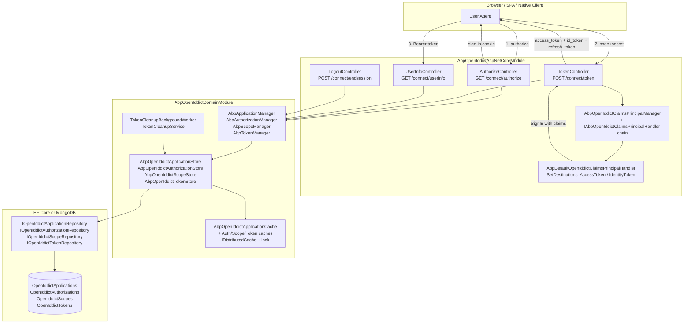

The OpenIddict module is ABP's **OAuth 2.0 / OpenID Connect authorization server**. It re‑hosts the open‑source [OpenIddict](https://github.com/openiddict/openiddict-core) stack inside the ABP module system — wrapping its `OpenIddictApplication` / `OpenIddictAuthorization` / `OpenIddictScope` / `OpenIddictToken` entities behind ABP repositories, replacing OpenIddict's default stores and managers with ABP‑aware ones, plugging into ABP's audit / multi‑tenant / unit‑of‑work pipelines, and shipping ready‑to‑use `connect/token`, `connect/authorize`, `connect/userinfo`, `connect/endsession`, `connect/introspect`, `connect/revocat`, and device‑flow endpoints.

Module path: `modules/openiddict/src/`.

<Info>
**Why this module exists.** OpenIddict gives you a high‑quality, spec‑compliant server. ABP gives you DDD entities, repositories, multi‑tenancy, distributed caching, audit logs, extensible objects, and a UI. This module is the bridge — every OpenIddict abstraction (`IOpenIddictApplicationStore`, `OpenIddictApplicationManager`, `IOpenIddictApplicationCache`, …) has an ABP replacement (`AbpOpenIddictApplicationStore`, `AbpApplicationManager`, `AbpOpenIddictApplicationCache`, …) that funnels everything through `IOpenIddictApplicationRepository` and the rest of the ABP framework.
</Info>

## Packages at a glance

The module is shipped as five focused NuGet packages — one per ABP layer:

| Package | Folder | Role |
| --- | --- | --- |
| `Volo.Abp.OpenIddict.Domain.Shared` | `Volo.Abp.OpenIddict.Domain.Shared/` | Constants (`OpenIddictApplicationConsts`, `OpenIddictTokenConsts`…), localization keys, module‑extension consts. |
| `Volo.Abp.OpenIddict.Domain` | `Volo.Abp.OpenIddict.Domain/` | `OpenIddictApplication` / `OpenIddictAuthorization` / `OpenIddictScope` / `OpenIddictToken` aggregate roots, the `Abp*` managers and stores that replace OpenIddict's defaults, distributed caches, and the `TokenCleanupBackgroundWorker`. |
| `Volo.Abp.OpenIddict.EntityFrameworkCore` | `Volo.Abp.OpenIddict.EntityFrameworkCore/` | `OpenIddictDbContext`, `IOpenIddictDbContext`, `EfCoreOpenIddict*Repository` implementations. |
| `Volo.Abp.OpenIddict.MongoDB` | `Volo.Abp.OpenIddict.MongoDB/` | `OpenIddictMongoDbContext` and `MongoOpenIddict*Repository` implementations. |
| `Volo.Abp.OpenIddict.AspNetCore` | `Volo.Abp.OpenIddict.AspNetCore/` | `AbpOpenIddictAspNetCoreModule` that calls `AddOpenIddict().AddServer(...)`, the controllers (`TokenController`, `AuthorizeController`, `UserInfoController`, `LogoutController` — file `EndSessionController.cs`), the claim‑destination pipeline, wildcard‑domain handlers, and extension grant types. |

## What flows through the server

The diagram below traces the three core interactions an OpenID Connect server handles — interactive code flow at `connect/authorize`, token issuance at `connect/token`, and userinfo lookup at `connect/userinfo` — and shows where each piece lives in the module.



The key handoff points:

1. **Endpoint registration.** `AbpOpenIddictAspNetCoreModule.AddOpenIddictServer` calls `services.AddOpenIddict().AddServer(builder => builder.SetTokenEndpointUris("connect/token")…)`. The standard OpenIddict ASP.NET Core middleware then routes those URIs to ABP's `TokenController`, `AuthorizeController`, etc. via `EnableTokenEndpointPassthrough()`.
2. **Manager / store replacement.** `AbpOpenIddictDomainModule.AddOpenIddictCore` calls `builder.ReplaceApplicationManager<…, AbpApplicationManager>()` and `ReplaceApplicationStore<…, AbpOpenIddictApplicationStore>()` (and similarly for authorization / scope / token). Every call OpenIddict makes — `FindByClientIdAsync`, `CreateAsync`, `PruneAsync` — flows through ABP repositories.
3. **Claim destinations.** Before `SignIn(...)`, the token controllers call `AbpOpenIddictClaimsPrincipalManager.HandleAsync(...)`. It runs every registered `IAbpOpenIddictClaimsPrincipalHandler` — the default `AbpDefaultOpenIddictClaimsPrincipalHandler` decides whether each claim ends up in the access token, the identity token, both, or neither.
4. **Background cleanup.** `TokenCleanupBackgroundWorker` prunes expired authorizations and tokens on a configurable interval (`TokenCleanupOptions.CleanupPeriod`, default 1 hour).

## Where it sits in your solution

<CardGroup cols={2}>
<Card title="Authorization server" icon="key">
This module **issues** tokens. Pair it with [/modules/account/openiddict-host](/modules/account/openiddict-host), which provides the login UI, consent screen, and the `IdentityUser` ↔ `OpenIddictApplication` glue, to get a working IdP.
</Card>
<Card title="Identity store" icon="users">
Subjects, roles, and claims come from [/modules/identity/overview](/modules/identity/overview). The claim‑principal handler reads the security stamp from `IdentityOptions.ClaimsIdentity.SecurityStampClaimType` and routes role claims via `AbpClaimTypes.Role` → `OpenIddictConstants.Claims.Role`.
</Card>
<Card title="OIDC client" icon="globe">
Browser apps consume the issued tokens via [/aspnetcore/auth-openidconnect](/aspnetcore/auth-openidconnect) (cookie + OIDC handler with ABP dynamic claims). Resource APIs validate them with `UseAbpOpenIddictValidation()`.
</Card>
<Card title="Permissions" icon="shield-halved">
The companion package `Volo.Abp.PermissionManagement.Domain.OpenIddict` lets you grant permissions directly to an `OpenIddictApplication` (machine‑to‑machine). See [/security/permissions](/security/permissions).
</Card>
</CardGroup>

## Read the rest of this section

<CardGroup cols={2}>
<Card title="Domain layer" icon="cube" href="/modules/openiddict/domain">
The four aggregate roots, the `Abp*Manager` / `Abp*Store` classes that replace OpenIddict's defaults, the distributed caches, identifier conversion, and the token cleanup worker.
</Card>
<Card title="ASP.NET Core integration" icon="server" href="/modules/openiddict/aspnetcore-integration">
`AbpOpenIddictAspNetCoreModule`, the `AddOpenIddict().AddServer(...)` wiring, claim destination handlers, wildcard‑domain support, the `connect/*` controllers, and `UseAbpOpenIddictValidation()`.
</Card>
<Card title="Entity Framework Core" icon="database" href="/modules/openiddict/efcore">
`OpenIddictDbContext`, the `ConfigureOpenIddict()` model‑builder extension, `EfCoreOpenIddict*Repository`, and the concurrency‑exception handler.
</Card>
<Card title="MongoDB" icon="leaf" href="/modules/openiddict/mongodb">
`OpenIddictMongoDbContext`, `ConfigureOpenIddict()` for `IMongoModelBuilder`, and the `MongoOpenIddict*Repository` implementations.
</Card>
<Card title="Account host (login UI)" icon="user-lock" href="/modules/account/openiddict-host">
The companion module that hosts the `connect/authorize` consent page, login forms, and external login wiring on top of this server.
</Card>
<Card title="Identity module" icon="users" href="/modules/identity/overview">
Where `IdentityUser`, roles, and the security‑stamp validator live — they back every subject the OpenIddict server issues tokens for.
</Card>
</CardGroup>

## Endpoints the module exposes

`AbpOpenIddictAspNetCoreModule.AddOpenIddictServer` configures the full set of OpenID Connect endpoints. Every URI here is mounted by the OpenIddict middleware and routed to a controller in `Volo.Abp.OpenIddict.AspNetCore/Volo/Abp/OpenIddict/Controllers/`:

```csharp
// modules/openiddict/src/Volo.Abp.OpenIddict.AspNetCore/Volo/Abp/OpenIddict/AbpOpenIddictAspNetCoreModule.cs
builder
    .SetAuthorizationEndpointUris("connect/authorize", "connect/authorize/callback")
    .SetDeviceAuthorizationEndpointUris("device")
    .SetIntrospectionEndpointUris("connect/introspect")
    .SetEndSessionEndpointUris("connect/endsession")
    .SetPushedAuthorizationEndpointUris("connect/par")
    .SetRevocationEndpointUris("connect/revocat")
    .SetTokenEndpointUris("connect/token")
    .SetUserInfoEndpointUris("connect/userinfo")
    .SetEndUserVerificationEndpointUris("connect/verify");

builder
    .AllowAuthorizationCodeFlow()
    .AllowHybridFlow()
    .AllowImplicitFlow()
    .AllowPasswordFlow()
    .AllowClientCredentialsFlow()
    .AllowRefreshTokenFlow()
    .AllowDeviceAuthorizationFlow()
    .AllowNoneFlow()
    .AllowTokenExchangeFlow();
```

| URI | Controller | Purpose |
| --- | --- | --- |
| `GET /connect/authorize` | `AuthorizeController` | Interactive authorization code / implicit / hybrid / none flows. |
| `POST /connect/token` | `TokenController` (`.Password`, `.ClientCredentials`, `.AuthorizationCode`, `.RefreshToken`, `.DeviceCode`, `.TokenExchange`) | All grant types. |
| `GET /connect/userinfo` | `UserInfoController` | Returns claims for a bearer token. |
| `GET /connect/endsession` | `LogoutController` | RP‑initiated logout (the controller class is `LogoutController`; the file is `EndSessionController.cs`). |
| `POST /connect/introspect` | (OpenIddict built‑in) | Token introspection. |
| `POST /connect/revocat` | (OpenIddict built‑in) | Token revocation. |
| `POST /device` & `GET /connect/verify` | `TokenController.DeviceCode` | OAuth 2.0 device authorization grant. |
| `POST /connect/par` | (OpenIddict built‑in) | Pushed Authorization Requests. |

## Token cleanup

`TokenCleanupBackgroundWorker` (in `Volo.Abp.OpenIddict.Domain/Volo/Abp/OpenIddict/Tokens/`) runs the cleanup loop. It is registered by `AbpOpenIddictDomainModule.OnApplicationInitializationAsync` only if `TokenCleanupOptions.IsCleanupEnabled` is true:

```csharp
// modules/openiddict/src/Volo.Abp.OpenIddict.Domain/Volo/Abp/OpenIddict/AbpOpenIddictDomainModule.cs
public async override Task OnApplicationInitializationAsync(ApplicationInitializationContext context)
{
    var options = context.ServiceProvider.GetRequiredService<IOptions<TokenCleanupOptions>>().Value;
    if (options.IsCleanupEnabled)
    {
        await context.ServiceProvider
            .GetRequiredService<IBackgroundWorkerManager>()
            .AddAsync(context.ServiceProvider.GetRequiredService<TokenCleanupBackgroundWorker>());
    }
}
```

Defaults from `TokenCleanupOptions`:

| Property | Default | Effect |
| --- | --- | --- |
| `IsCleanupEnabled` | `true` | Master switch. Also gated by `AbpBackgroundWorkerOptions.IsEnabled`. |
| `CleanupPeriod` | `3_600_000` ms (1 h) | How often the worker fires. |
| `DisableAuthorizationPruning` | `false` | Skip pruning `OpenIddictAuthorization` rows. |
| `DisableTokenPruning` | `false` | Skip pruning `OpenIddictToken` rows. |

Cleanup itself is delegated to `TokenCleanupService`, which calls the OpenIddict managers' `PruneAsync(...)` methods.

## Multi‑tenancy

All four aggregate roots and both DbContexts are marked **single‑database** for OpenIddict data:

```csharp
// modules/openiddict/src/Volo.Abp.OpenIddict.EntityFrameworkCore/Volo/Abp/OpenIddict/EntityFrameworkCore/IOpenIddictDbContext.cs
[IgnoreMultiTenancy]
[ConnectionStringName(AbpOpenIddictDbProperties.ConnectionStringName)] // "AbpOpenIddict"
public interface IOpenIddictDbContext : IEfCoreDbContext { ... }
```

```csharp
// modules/openiddict/src/Volo.Abp.OpenIddict.MongoDB/Volo/Abp/OpenIddict/MongoDB/OpenIddictMongoDbContext.cs
[IgnoreMultiTenancy]
[ConnectionStringName(AbpOpenIddictDbProperties.ConnectionStringName)]
public class OpenIddictMongoDbContext : AbpMongoDbContext, IOpenIddictMongoDbContext { ... }
```

The `AbpOpenIddict` connection string lets you point applications, authorizations, scopes, and tokens at a dedicated database — and `[IgnoreMultiTenancy]` ensures they live in the host store regardless of `ICurrentTenant`.

## Wildcard‑domain redirect URIs

ABP adds an opt‑in extension that lets you register clients with wildcard hostnames (e.g. `https://*.tenant.example.com/signin-oidc`). When `AbpOpenIddictWildcardDomainOptions.EnableWildcardDomainSupport` is true, the module swaps OpenIddict's default redirect‑URI / post‑logout‑URI / authorized‑party validation event handlers for ABP versions:

```csharp
// modules/openiddict/src/Volo.Abp.OpenIddict.AspNetCore/Volo/Abp/OpenIddict/AbpOpenIddictAspNetCoreModule.cs
if (wildcardDomainsOptions.EnableWildcardDomainSupport)
{
    builder.RemoveEventHandler(OpenIddictServerHandlers.Authentication.ValidateClientRedirectUri.Descriptor);
    builder.AddEventHandler(AbpValidateClientRedirectUri.Descriptor);

    builder.RemoveEventHandler(OpenIddictServerHandlers.Authentication.ValidateRedirectUriParameter.Descriptor);
    builder.AddEventHandler(AbpValidateRedirectUriParameter.Descriptor);

    builder.RemoveEventHandler(OpenIddictServerHandlers.Session.ValidateClientPostLogoutRedirectUri.Descriptor);
    builder.AddEventHandler(AbpValidateClientPostLogoutRedirectUri.Descriptor);

    builder.RemoveEventHandler(OpenIddictServerHandlers.Session.ValidatePostLogoutRedirectUriParameter.Descriptor);
    builder.AddEventHandler(AbpValidatePostLogoutRedirectUriParameter.Descriptor);

    builder.RemoveEventHandler(OpenIddictServerHandlers.Session.ValidateAuthorizedParty.Descriptor);
    builder.AddEventHandler(AbpValidateAuthorizedParty.Descriptor);
}
```

This is the same trick used by every other ABP override — *remove the upstream handler descriptor, add ours*. See [aspnetcore-integration](/modules/openiddict/aspnetcore-integration) for the full set of event handlers.

## Storage providers

You pick the storage layer by referencing exactly one of the two integration packages:

<CardGroup cols={2}>
<Card title="Entity Framework Core" icon="database" href="/modules/openiddict/efcore">
`AbpOpenIddictEntityFrameworkCoreModule` registers `OpenIddictDbContext` and the four `EfCoreOpenIddict*Repository` classes; `ConfigureOpenIddict()` sets up tables, indices, and FK from `OpenIddictAuthorization` to `OpenIddictApplication`.
</Card>
<Card title="MongoDB" icon="leaf" href="/modules/openiddict/mongodb">
`AbpOpenIddictMongoDbModule` registers `OpenIddictMongoDbContext` and the `MongoOpenIddict*Repository` classes; `ConfigureOpenIddict()` maps the four collections.
</Card>
</CardGroup>

In both cases the table / collection names share the `OpenIddict` prefix defined by `AbpOpenIddictDbProperties.DbTablePrefix`.

## Identifier conversion

OpenIddict's abstractions deal in `string` IDs; ABP uses `Guid`. `AbpOpenIddictIdentifierConverter` (in `Volo.Abp.OpenIddict.Domain/Volo/Abp/OpenIddict/`) sits between them: every store call that crosses the boundary (e.g. `IOpenIddictApplicationStore<TModel>.FindByIdAsync(string id, ct)`) is funnelled through `ConvertIdentifierFromString` / `ToString`. You almost never touch this directly — it's a plumbing component that `AbpOpenIddictStoreBase<TRepository>` and every `Abp*Manager` already depends on.

## The `*Model` vs the entity

OpenIddict's core works against in‑memory POCOs (`OpenIddictApplicationModel`, `OpenIddictAuthorizationModel`, `OpenIddictScopeModel`, `OpenIddictTokenModel`). ABP's stores translate to and from the persisted aggregate roots using extension methods like `ToEntity()` / `ToModel()` (see `OpenIddictApplicationExtensions.cs`, `OpenIddictAuthorizationExtensions.cs`, …). The aggregate roots (`OpenIddictApplication`, `OpenIddictAuthorization`, `OpenIddictScope`, `OpenIddictToken`) are what go into your `DbContext` / `IMongoCollection` and what extensible‑object customizations attach extra columns to.

That distinction matters when you're writing a custom `IAbpOpenIddictClaimsPrincipalHandler` or a custom event handler: at runtime the OpenIddict pipeline hands you the **model**, not the entity. If you need the entity, resolve `IOpenIddictApplicationRepository.FindByClientIdAsync(...)` from DI.

## Default flows enabled

The module turns on **every** OAuth 2.0 / OIDC flow OpenIddict supports — you opt clients *out* by configuring their per‑client permissions rather than turning flows off globally. The full list comes from `AbpOpenIddictAspNetCoreModule.AddOpenIddictServer`:

```csharp
// modules/openiddict/src/Volo.Abp.OpenIddict.AspNetCore/Volo/Abp/OpenIddict/AbpOpenIddictAspNetCoreModule.cs
builder
    .AllowAuthorizationCodeFlow()
    .AllowHybridFlow()
    .AllowImplicitFlow()
    .AllowPasswordFlow()
    .AllowClientCredentialsFlow()
    .AllowRefreshTokenFlow()
    .AllowDeviceAuthorizationFlow()
    .AllowNoneFlow()
    .AllowTokenExchangeFlow();
```

To restrict a single client, set its `Permissions` JSON array (managed through the application manager / admin UI) so it only contains the grant types you want it to use. See the per‑grant `TokenController.*.cs` files in [aspnetcore-integration](/modules/openiddict/aspnetcore-integration).

## Default scopes registered

The module pre‑registers the standard OIDC scopes so they appear in `.well-known/openid-configuration` even before you create any `OpenIddictScope` rows:

```csharp
builder.RegisterScopes(new[]
{
    OpenIddictConstants.Scopes.OpenId,        // "openid"
    OpenIddictConstants.Scopes.Email,         // "email"
    OpenIddictConstants.Scopes.Profile,       // "profile"
    OpenIddictConstants.Scopes.Phone,         // "phone"
    OpenIddictConstants.Scopes.Roles,         // "roles"
    OpenIddictConstants.Scopes.Address,       // "address"
    OpenIddictConstants.Scopes.OfflineAccess  // "offline_access"
});
```

Any *additional* scope you create through `IAbpScopeManager.CreateAsync(...)` is dynamically published by the `AttachScopes` server event handler (see [aspnetcore-integration](/modules/openiddict/aspnetcore-integration)).

## Where to go next

- Domain layer with entity field reference: [/modules/openiddict/domain](/modules/openiddict/domain)
- AspNetCore wiring, claim destinations, and event handlers: [/modules/openiddict/aspnetcore-integration](/modules/openiddict/aspnetcore-integration)
- EF Core schema and repositories: [/modules/openiddict/efcore](/modules/openiddict/efcore)
- MongoDB collections and repositories: [/modules/openiddict/mongodb](/modules/openiddict/mongodb)
- Login UI and consent screen: [/modules/account/openiddict-host](/modules/account/openiddict-host)
- Client side — cookie + OIDC handler with dynamic claims: [/aspnetcore/auth-openidconnect](/aspnetcore/auth-openidconnect)
- Identity store: [/modules/identity/overview](/modules/identity/overview)
- Granting permissions to client apps: [/security/permissions](/security/permissions)
