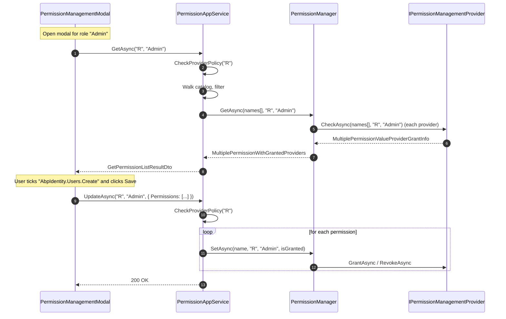

The application layer of **ABP's Permission Management module** is intentionally thin — one application service, one interface, and a small bag of DTOs. Everything lives in `Volo.Abp.PermissionManagement.Application.Contracts` (the shareable contracts package) and `Volo.Abp.PermissionManagement.Application` (the implementation). The service is the boundary the admin UI and HTTP API call when an operator clicks a check-box in the **Permissions** modal of a user, role, or OpenIddict application.

The application service composes three domain pieces — `IPermissionDefinitionManager` (the catalog), `IPermissionManager` (the provider-aware writer), `ISimpleStateCheckerManager<PermissionDefinition>` (feature flags and the like) — into a tree of DTOs the UI can render and round-trip. Authorization itself is *also* enforced here, via `PermissionManagementOptions.ProviderPolicies`.

## Source layout

`modules/permission-management/src/Volo.Abp.PermissionManagement.Application.Contracts/Volo/Abp/PermissionManagement/`

- `IPermissionAppService.cs`
- `PermissionManagementRemoteServiceConsts.cs`
- `GetPermissionListResultDto.cs`
- `PermissionGroupDto.cs`
- `PermissionGrantInfoDto.cs`
- `ProviderInfoDto.cs`
- `UpdatePermissionsDto.cs`
- `UpdatePermissionDto.cs`
- `Integration/IPermissionIntegrationService.cs`

`modules/permission-management/src/Volo.Abp.PermissionManagement.Application/Volo/Abp/PermissionManagement/`

- `AbpPermissionManagementApplicationModule.cs`
- `PermissionAppService.cs`
- `Integration/PermissionIntegrationService.cs`

The `Application.Contracts` module also brings the `Volo.Abp.PermissionManagement.Domain.Shared` types (`IsGrantedRequest`, `IsGrantedResponse`, the localization resource) into scope so client-only packages don't have to depend on `Domain`.

## `IPermissionAppService`

The contract is minimal:

```csharp
public interface IPermissionAppService : IApplicationService
{
    Task<GetPermissionListResultDto> GetAsync([NotNull] string providerName, [NotNull] string providerKey);

    Task<GetPermissionListResultDto> GetByGroupAsync(
        [NotNull] string groupName,
        [NotNull] string providerName,
        [NotNull] string providerKey);

    Task UpdateAsync([NotNull] string providerName, [NotNull] string providerKey, UpdatePermissionsDto input);
}
```

- `GetAsync` returns *every* permission group/permission for the subject, with `IsGranted` populated by `PermissionManager.GetAsync` (which is the provider-aware union of all `IPermissionManagementProvider` results).
- `GetByGroupAsync` is the same call filtered to a single `PermissionGroupDefinition.Name` — used by the Blazor modal to lazy-load one tab.
- `UpdateAsync` replays a list of `(Name, IsGranted)` pairs through `PermissionManager.SetAsync`.

`RemoteServiceName` and `ModuleName` are fixed by `PermissionManagementRemoteServiceConsts`:

```csharp
public class PermissionManagementRemoteServiceConsts
{
    public const string RemoteServiceName = "AbpPermissionManagement";
    public const string ModuleName = "permissionManagement";
}
```

That `RemoteServiceName` is the one a non-default `RemoteServices` config block needs to override if you front the module behind an API gateway.

## DTOs

The DTOs form a tree that mirrors what the UI renders:

```text
GetPermissionListResultDto
├── EntityDisplayName   : string         // "Admin" / "user@host.com" / "WebClient"
└── Groups              : PermissionGroupDto[]
    ├── Name            : string         // "AbpIdentity"
    ├── DisplayName     : string         // localized
    ├── DisplayNameKey  : string         // raw L10n key
    ├── DisplayNameResource : string     // L10n resource type name
    └── Permissions     : PermissionGrantInfoDto[]
        ├── Name              : string   // "AbpIdentity.Users.Create"
        ├── DisplayName       : string
        ├── ParentName        : string   // null for root permissions
        ├── IsGranted         : bool
        ├── AllowedProviders  : List<string>          // empty = all providers
        └── GrantedProviders  : List<ProviderInfoDto> // who granted it
                                ├── ProviderName : string  // "U" / "R" / "C"
                                └── ProviderKey  : string  // user id / role name / client id
```

<Tabs>
  <Tab title="GetPermissionListResultDto">
    ```csharp
    public class GetPermissionListResultDto
    {
        public string EntityDisplayName { get; set; }
        public List<PermissionGroupDto> Groups { get; set; }
    }
    ```

    `EntityDisplayName` defaults to the `providerKey` itself; the UI normally overrides it via a `ProviderKeyDisplayName` query-string parameter so the modal can show "Permissions — Admin" rather than "Permissions — 3fa…f1ad".
  </Tab>
  <Tab title="PermissionGroupDto">
    ```csharp
    public class PermissionGroupDto
    {
        public string Name { get; set; }
        public string DisplayName { get; set; }
        public string DisplayNameKey { get; set; }
        public string DisplayNameResource { get; set; }
        public List<PermissionGrantInfoDto> Permissions { get; set; }
    }
    ```

    `DisplayNameKey` and `DisplayNameResource` are populated when the source `PermissionGroupDefinition.DisplayName` was a `LocalizableString`, letting the UI re-localize on the client side.
  </Tab>
  <Tab title="PermissionGrantInfoDto">
    ```csharp
    public class PermissionGrantInfoDto
    {
        public string Name { get; set; }
        public string DisplayName { get; set; }
        public string ParentName { get; set; }
        public bool IsGranted { get; set; }
        public List<string> AllowedProviders { get; set; }
        public List<ProviderInfoDto> GrantedProviders { get; set; }
    }
    ```

    `AllowedProviders` mirrors `PermissionDefinition.Providers` — an empty list means *all* providers. `GrantedProviders` is the union of every provider that returned `IsGranted=true` from `PermissionManager.GetAsync`.
  </Tab>
  <Tab title="UpdatePermissionsDto">
    ```csharp
    public class UpdatePermissionsDto
    {
        public UpdatePermissionDto[] Permissions { get; set; }
    }

    public class UpdatePermissionDto
    {
        public string Name { get; set; }
        public bool IsGranted { get; set; }
    }
    ```

    The UI sends the **full** list, both granted and revoked. `PermissionAppService.UpdateAsync` short-circuits unchanged entries inside `PermissionManager.SetAsync` (it compares to the current state before calling the provider), so the round-trip is safe and idempotent.
  </Tab>
  <Tab title="ProviderInfoDto">
    ```csharp
    public class ProviderInfoDto
    {
        public string ProviderName { get; set; }
        public string ProviderKey { get; set; }
    }
    ```
  </Tab>
</Tabs>

## `PermissionAppService`

The implementation (in [`PermissionAppService.cs`](https://github.com/abpframework/abp/blob/dev/modules/permission-management/src/Volo.Abp.PermissionManagement.Application/Volo/Abp/PermissionManagement/PermissionAppService.cs)) is annotated `[Authorize]` — every operation requires an authenticated principal, on top of the provider-specific policy check described below:

```csharp
[Authorize]
public class PermissionAppService : ApplicationService, IPermissionAppService
{
    protected PermissionManagementOptions Options { get; }
    protected IPermissionManager PermissionManager { get; }
    protected IPermissionDefinitionManager PermissionDefinitionManager { get; }
    protected ISimpleStateCheckerManager<PermissionDefinition> SimpleStateCheckerManager { get; }

    public PermissionAppService(
        IPermissionManager permissionManager,
        IPermissionDefinitionManager permissionDefinitionManager,
        IOptions<PermissionManagementOptions> options,
        ISimpleStateCheckerManager<PermissionDefinition> simpleStateCheckerManager)
    {
        LocalizationResource = typeof(AbpPermissionManagementResource);
        ObjectMapperContext = typeof(AbpPermissionManagementApplicationModule);

        Options = options.Value;
        PermissionManager = permissionManager;
        PermissionDefinitionManager = permissionDefinitionManager;
        SimpleStateCheckerManager = simpleStateCheckerManager;
    }
}
```

### Per-provider authorization

Every public method routes through `CheckProviderPolicy`:

```csharp
protected virtual async Task CheckProviderPolicy(string providerName)
{
    var policyName = Options.ProviderPolicies.GetOrDefault(providerName);
    if (policyName.IsNullOrEmpty())
    {
        throw new AbpException(
            $"No policy defined to get/set permissions for the provider '{providerName}'. " +
            $"Use {nameof(PermissionManagementOptions)} to map the policy.");
    }

    await AuthorizationService.CheckAsync(policyName);
}
```

This is the indirection that lets each consumer module own its own permission policy:

- `Volo.Abp.PermissionManagement.Domain.Identity` maps `"U"` → `IdentityPermissions.Users.ManagePermissions` and `"R"` → `IdentityPermissions.Roles.ManagePermissions`.
- `Volo.Abp.PermissionManagement.Domain.OpenIddict` maps `"C"` → the OpenIddict-side manage policy for applications.

<Warning>
If you add a custom subject type (a custom `IPermissionValueProvider` plus a custom `PermissionManagementProvider`), you **must** also add a `ProviderPolicies[providerName] = "your.policy.name"` entry. Without it, `PermissionAppService` throws `AbpException` and the UI cannot read or write that provider's grants.
</Warning>

### `GetAsync` / `GetByGroupAsync`

Both methods delegate to the shared `GetInternalAsync(groupName, providerName, providerKey)`. The full body, slightly abbreviated, is:

```csharp
protected virtual async Task<GetPermissionListResultDto> GetInternalAsync(
    string groupName, string providerName, string providerKey)
{
    await CheckProviderPolicy(providerName);

    var result = new GetPermissionListResultDto
    {
        EntityDisplayName = providerKey,
        Groups = new List<PermissionGroupDto>()
    };

    var multiTenancySide = CurrentTenant.GetMultiTenancySide();
    var permissionGroups = new List<PermissionGroupDto>();

    foreach (var group in (await PermissionDefinitionManager.GetGroupsAsync())
                            .WhereIf(!groupName.IsNullOrWhiteSpace(), x => x.Name == groupName))
    {
        var groupDto = CreatePermissionGroupDto(group);
        var permissions = group.GetPermissionsWithChildren()
            .Where(x => x.IsEnabled)
            .Where(x => !x.Providers.Any() || x.Providers.Contains(providerName))
            .Where(x => x.MultiTenancySide.HasFlag(multiTenancySide));

        var neededCheckPermissions = new List<PermissionDefinition>();
        foreach (var permission in permissions)
        {
            if (permission.Parent != null && !neededCheckPermissions.Contains(permission.Parent))
            {
                continue; // hide child if parent was hidden
            }

            if (await SimpleStateCheckerManager.IsEnabledAsync(permission))
            {
                neededCheckPermissions.Add(permission);
            }
        }

        if (!neededCheckPermissions.Any()) { continue; }

        groupDto.Permissions.AddRange(neededCheckPermissions.Select(CreatePermissionGrantInfoDto));
        permissionGroups.Add(groupDto);
    }

    var multipleGrantInfo = await PermissionManager.GetAsync(
        permissionGroups.SelectMany(g => g.Permissions).Select(p => p.Name).ToArray(),
        providerName, providerKey);

    foreach (var permissionGroup in permissionGroups)
    {
        foreach (var permission in permissionGroup.Permissions)
        {
            var grantInfo = multipleGrantInfo.Result.FirstOrDefault(x => x.Name == permission.Name);
            if (grantInfo == null) { continue; }

            permission.IsGranted = grantInfo.IsGranted;
            permission.GrantedProviders = grantInfo.Providers.Select(x => new ProviderInfoDto
            {
                ProviderName = x.Name,
                ProviderKey = x.Key,
            }).ToList();
        }

        if (permissionGroup.Permissions.Any()) { result.Groups.Add(permissionGroup); }
    }

    return result;
}
```

The flow:

<Steps>
  <Step title="Authorize the provider">
    `CheckProviderPolicy(providerName)` throws if the caller cannot manage permissions for that provider.
  </Step>
  <Step title="Walk the catalog">
    `PermissionDefinitionManager.GetGroupsAsync()` returns the in-memory tree of `PermissionGroupDefinition` → `PermissionDefinition`. `GetPermissionsWithChildren()` flattens each group's tree depth-first.
  </Step>
  <Step title="Filter by provider, tenant side, feature flags">
    A permission is shown only when (a) `IsEnabled`, (b) its `Providers` whitelist is empty or contains `providerName`, (c) its `MultiTenancySide` matches the current side, (d) its parent is also visible, and (e) every registered `ISimpleStateChecker<PermissionDefinition>` votes enabled.
  </Step>
  <Step title="Materialize DTOs">
    `CreatePermissionGroupDto` and `CreatePermissionGrantInfoDto` build the tree and capture `DisplayNameKey` / `DisplayNameResource` for client-side re-localization.
  </Step>
  <Step title="Fetch grants in one batch">
    `PermissionManager.GetAsync(names[], providerName, providerKey)` walks `ManagementProviders` once and returns the union — that is the moment when `RolePermissionManagementProvider` resolves a user's effective roles and `ApplicationPermissionManagementProvider` switches into the host tenant.
  </Step>
  <Step title="Project grant info onto DTOs">
    For each permission, copy `IsGranted` and convert `PermissionValueProviderInfo` → `ProviderInfoDto`. Empty groups are dropped from the response.
  </Step>
</Steps>

### `CreatePermissionGroupDto`

The group DTO captures the localization metadata so a Blazor WebAssembly client can render the title in the user's language without making another call:

```csharp
protected virtual PermissionGroupDto CreatePermissionGroupDto(PermissionGroupDefinition group)
{
    var localizableDisplayName = group.DisplayName as LocalizableString;

    return new PermissionGroupDto
    {
        Name = group.Name,
        DisplayName = group.DisplayName?.Localize(StringLocalizerFactory),
        DisplayNameKey = localizableDisplayName?.Name,
        DisplayNameResource = localizableDisplayName?.ResourceType != null
            ? LocalizationResourceNameAttribute.GetName(localizableDisplayName.ResourceType)
            : null,
        Permissions = new List<PermissionGrantInfoDto>()
    };
}
```

### `CreatePermissionGrantInfoDto`

```csharp
protected virtual PermissionGrantInfoDto CreatePermissionGrantInfoDto(PermissionDefinition permission)
{
    return new PermissionGrantInfoDto
    {
        Name = permission.Name,
        DisplayName = permission.DisplayName?.Localize(StringLocalizerFactory),
        ParentName = permission.Parent?.Name,
        AllowedProviders = permission.Providers,
        GrantedProviders = new List<ProviderInfoDto>()
    };
}
```

`ParentName` is what lets the UI render the hierarchical check-box tree (a child auto-grants its parent when ticked, a parent auto-revokes its children when un-ticked).

### `UpdateAsync`

Compact and serial:

```csharp
public virtual async Task UpdateAsync(string providerName, string providerKey, UpdatePermissionsDto input)
{
    await CheckProviderPolicy(providerName);

    foreach (var permissionDto in input.Permissions)
    {
        await PermissionManager.SetAsync(permissionDto.Name, providerName, providerKey, permissionDto.IsGranted);
    }
}
```

The loop is serial because `PermissionManager.SetAsync` reads the current grant before deciding what to insert / delete — running it in parallel against the same `(providerName, providerKey)` would race on the unique index `(TenantId, Name, ProviderName, ProviderKey)`.

`PermissionManager.SetAsync` itself does the validation and the no-op check:

- Silently ignores `UpdatePermissionDto` entries whose `Name` is no longer in the definition catalog (e.g. removed by a deploy).
- Throws `ApplicationException` if `permission.IsEnabled` is false or any `ISimpleStateChecker` denies.
- Throws `ApplicationException` if the permission's `Providers` whitelist excludes `providerName`.
- Throws if `permission.MultiTenancySide` does not match `CurrentTenant.GetMultiTenancySide()`.
- No-ops when the requested state equals the current state.

<Note>
`UpdateAsync` does **not** wrap the loop in an explicit unit of work. The ASP.NET Core convention pipeline (`AbpUnitOfWorkMiddleware` + `UnitOfWork` interceptor) opens one transaction around the whole controller action, so either every grant is committed or none of them are.
</Note>

## `IPermissionIntegrationService`

`PermissionIntegrationService` (in `Volo.Abp.PermissionManagement.Application/Volo/Abp/PermissionManagement/Integration/`) is the **inter-service** API consumed by `HttpClientPermissionFinder` when the auth-check needs to cross a service boundary. It exposes one method, `IsGrantedAsync(List<IsGrantedRequest>)`, that returns a `ListResultDto<IsGrantedResponse>` — the lightweight subset of the full permission tree that a service mesh actually needs.

The HTTP route for it is described in [the HTTP API page](/modules/permission-management/http-api).

## How the UI calls the service

The Razor Pages and Blazor permission modals both go through `IPermissionAppService` — directly in-process when the UI is hosted in the same app, or via the `PermissionsClientProxy` HTTP client when they run separately. The client proxy is regenerated by ABP's static proxy generator and lives in `Volo.Abp.PermissionManagement.HttpApi.Client`.

Typical sequence when an admin clicks a check-box:



## Application module wiring

```csharp
[DependsOn(
    typeof(AbpPermissionManagementApplicationContractsModule),
    typeof(AbpPermissionManagementDomainModule),
    typeof(AbpAutoMapperModule),
    typeof(AbpDddApplicationModule))]
public class AbpPermissionManagementApplicationModule : AbpModule
{
    public override void ConfigureServices(ServiceConfigurationContext context)
    {
        Configure<AbpAutoMapperOptions>(options =>
        {
            options.AddProfile<AbpPermissionManagementApplicationModuleAutoMapperProfile>(validate: true);
        });
    }
}
```

The mapper profile is small — it only exists to map domain primitives (`PermissionValueProviderInfo`) into `ProviderInfoDto` in case a downstream module overrides the projection. The service itself does the mapping by hand inside `GetInternalAsync` for clarity.

## Customization patterns

<Accordion title="Override the service to hide an entire group">
Inherit and decorate one of the protected hooks. The most common need is hiding a sensitive group (e.g. `"FeatureManagement"`) from non-host tenants:

```csharp
[Dependency(ReplaceServices = true)]
[ExposeServices(typeof(IPermissionAppService), typeof(PermissionAppService))]
public class MyPermissionAppService : PermissionAppService
{
    public MyPermissionAppService(/* same ctor args */) : base(/* … */) { }

    protected override PermissionGroupDto CreatePermissionGroupDto(PermissionGroupDefinition group)
    {
        var dto = base.CreatePermissionGroupDto(group);
        // tag the group for the UI to optionally style
        return dto;
    }
}
```

`Dependency(ReplaceServices = true)` + `ExposeServices(typeof(IPermissionAppService), typeof(PermissionAppService))` is the canonical replacement pattern — it keeps `IPermissionAppService` consumers happy and also keeps any code that still resolves the concrete `PermissionAppService` directly.
</Accordion>

<Accordion title="Add a custom provider policy">
If you add a fourth subject — for example, an `Edition` provider — register both the `IPermissionManagementProvider` and the policy:

```csharp
public class MyPermissionManagementModule : AbpModule
{
    public override void ConfigureServices(ServiceConfigurationContext context)
    {
        Configure<PermissionManagementOptions>(options =>
        {
            options.ManagementProviders.Add<EditionPermissionManagementProvider>();
            options.ProviderPolicies["E"] = MyPermissions.Editions.ManagePermissions;
        });
    }
}
```

`PermissionAppService.GetAsync("E", editionId)` will then call `AuthorizationService.CheckAsync(MyPermissions.Editions.ManagePermissions)` before doing anything else.
</Accordion>

## Cross-references

<CardGroup cols={2}>
  <Card title="HTTP API" icon="plug" href="/modules/permission-management/http-api">
    `PermissionsController` and its routes, plus the `PermissionsClientProxy` regenerated from this service.
  </Card>
  <Card title="Domain internals" icon="cube" href="/modules/permission-management/domain">
    `PermissionManager`, `PermissionStore`, `PermissionManagementProvider` — the writers and readers behind these DTOs.
  </Card>
  <Card title="Web & Blazor UI" icon="window-maximize" href="/modules/permission-management/web-and-blazor">
    The Razor Pages and Blazor permission modal that consume `IPermissionAppService`.
  </Card>
  <Card title="Permission system" icon="key" href="/security/permissions">
    `PermissionDefinition`, `PermissionGroupDefinition`, `ISimpleStateChecker<PermissionDefinition>` — the catalog this service walks.
  </Card>
  <Card title="Authorization" icon="shield-halved" href="/security/authorization">
    `IAuthorizationService.CheckAsync` is the same API used by `CheckProviderPolicy` here.
  </Card>
  <Card title="Identity module" icon="user" href="/modules/identity/overview">
    Owner of the `Users.ManagePermissions` / `Roles.ManagePermissions` policies that gate `"U"` / `"R"` access.
  </Card>
</CardGroup>
