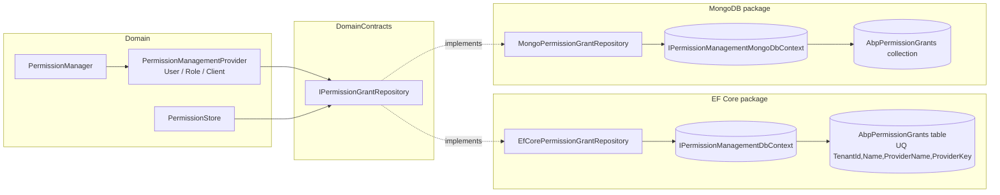

The persistence layer of **ABP's Permission Management module** ships in two interchangeable NuGet packages: `Volo.Abp.PermissionManagement.EntityFrameworkCore` for relational stores and `Volo.Abp.PermissionManagement.MongoDB` for MongoDB. Both implement the same three repository contracts (`IPermissionGrantRepository`, `IPermissionDefinitionRecordRepository`, `IPermissionGroupDefinitionRecordRepository`) from `Volo.Abp.PermissionManagement.Domain`, so the rest of the module — `PermissionStore`, `PermissionManager`, the providers, the application service — is database-agnostic.

This page covers the DbContexts, the model-builder extensions, and the repository implementations. The schema is intentionally minimal — three entities, one of which (`PermissionGrant`) is the only one that grows per tenant: the other two are bookkeeping for the dynamic permission catalog and only get touched on app start.

## Source layout

<Tabs>
  <Tab title="EntityFrameworkCore">
    `modules/permission-management/src/Volo.Abp.PermissionManagement.EntityFrameworkCore/Volo/Abp/PermissionManagement/EntityFrameworkCore/`
    - `AbpPermissionManagementEntityFrameworkCoreModule.cs`
    - `AbpPermissionManagementDbContextModelBuilderExtensions.cs`
    - `IPermissionManagementDbContext.cs`
    - `PermissionManagementDbContext.cs`
    - `EfCorePermissionGrantRepository.cs`
    - `EfCorePermissionDefinitionRecordRepository.cs`
    - `EfCorePermissionGroupDefinitionRecordRepository.cs`
  </Tab>
  <Tab title="MongoDB">
    `modules/permission-management/src/Volo.Abp.PermissionManagement.MongoDB/Volo/Abp/PermissionManagement/MongoDb/`
    - `AbpPermissionManagementMongoDbModule.cs`
    - `AbpPermissionManagementMongoDbContextExtensions.cs`
    - `IPermissionManagementMongoDbContext.cs`
    - `PermissionManagementMongoDbContext.cs`
    - `MongoPermissionGrantRepository.cs`
    - `MongoPermissionDefinitionRecordRepository.cs`
    - `MongoPermissionGroupDefinitionRecordRepository.cs`
  </Tab>
</Tabs>

The three tables / collections are:

| Entity | Stores | Touched by |
|--------|--------|------------|
| `PermissionGrant` | runtime grants: `(TenantId, Name, ProviderName, ProviderKey)` | `IPermissionGrantRepository`, `PermissionManager`, `PermissionStore` |
| `PermissionDefinitionRecord` | one row per dynamic permission, copied from `PermissionDefinitionProvider`s | `IStaticPermissionSaver`, `DynamicPermissionDefinitionStore` |
| `PermissionGroupDefinitionRecord` | one row per dynamic permission group | same |

Per-grant constants live in `AbpPermissionManagementDbProperties` (`Volo.Abp.PermissionManagement.Domain.Shared`):

```csharp
public static class AbpPermissionManagementDbProperties
{
    public static string DbTablePrefix { get; set; } = AbpCommonDbProperties.DbTablePrefix;
    public static string DbSchema      { get; set; } = AbpCommonDbProperties.DbSchema;
    public const  string ConnectionStringName = "AbpPermissionManagement";
}
```

`AbpCommonDbProperties.DbTablePrefix` defaults to `"Abp"`, so the resulting table names are `AbpPermissionGrants`, `AbpPermissions`, `AbpPermissionGroups`. Override `AbpPermissionManagementDbProperties.DbTablePrefix` *before* the host's `OnApplicationInitialization` if you need a custom prefix.

## EF Core: the DbContext

`IPermissionManagementDbContext` is the interface every consuming `DbContext` exposes — most apps use ABP's "single DbContext" pattern, where the application's own `MyAppDbContext` implements `IPermissionManagementDbContext` (alongside `IIdentityDbContext`, `IOpenIddictDbContext`, …) and routes everything through one connection.

```csharp
[ConnectionStringName(AbpPermissionManagementDbProperties.ConnectionStringName)]
public interface IPermissionManagementDbContext : IEfCoreDbContext
{
    DbSet<PermissionGroupDefinitionRecord> PermissionGroups { get; }
    DbSet<PermissionDefinitionRecord> Permissions { get; }
    DbSet<PermissionGrant> PermissionGrants { get; }
}
```

The standalone implementation is in `PermissionManagementDbContext`:

```csharp
[ConnectionStringName(AbpPermissionManagementDbProperties.ConnectionStringName)]
public class PermissionManagementDbContext
    : AbpDbContext<PermissionManagementDbContext>, IPermissionManagementDbContext
{
    public DbSet<PermissionGroupDefinitionRecord> PermissionGroups { get; set; }
    public DbSet<PermissionDefinitionRecord> Permissions { get; set; }
    public DbSet<PermissionGrant> PermissionGrants { get; set; }

    public PermissionManagementDbContext(DbContextOptions<PermissionManagementDbContext> options)
        : base(options) { }

    protected override void OnModelCreating(ModelBuilder builder)
    {
        base.OnModelCreating(builder);
        builder.ConfigurePermissionManagement();
    }
}
```

`AbpDbContext` does the heavy lifting: it wires `IAbpEntityChangeEventHelper` so writes to `PermissionGrant` automatically raise the `EntityChangedEventData<PermissionGrant>` event handled by `PermissionGrantCacheItemInvalidator` (see [the domain page](/modules/permission-management/domain)).

<Note>
`PermissionManagementDbContext` is only **used as a standalone DbContext for migrations** in the `DbMigrator` console app shipped with ABP templates. Production apps point `[ReplaceDbContext(typeof(IPermissionManagementDbContext))]` at their own composite DbContext to keep everything in one EF Core model.
</Note>

## EF Core: `ConfigurePermissionManagement`

The model builder extension is the single place all three tables are mapped. Excerpt from [`AbpPermissionManagementDbContextModelBuilderExtensions.cs`](https://github.com/abpframework/abp/blob/dev/modules/permission-management/src/Volo.Abp.PermissionManagement.EntityFrameworkCore/Volo/Abp/PermissionManagement/EntityFrameworkCore/AbpPermissionManagementDbContextModelBuilderExtensions.cs):

```csharp
public static void ConfigurePermissionManagement([NotNull] this ModelBuilder builder)
{
    Check.NotNull(builder, nameof(builder));

    builder.Entity<PermissionGrant>(b =>
    {
        b.ToTable(AbpPermissionManagementDbProperties.DbTablePrefix + "PermissionGrants",
                  AbpPermissionManagementDbProperties.DbSchema);

        b.ConfigureByConvention();

        b.Property(x => x.Name).HasMaxLength(PermissionDefinitionRecordConsts.MaxNameLength).IsRequired();
        b.Property(x => x.ProviderName).HasMaxLength(PermissionGrantConsts.MaxProviderNameLength).IsRequired();
        b.Property(x => x.ProviderKey).HasMaxLength(PermissionGrantConsts.MaxProviderKeyLength).IsRequired();

        b.HasIndex(x => new { x.TenantId, x.Name, x.ProviderName, x.ProviderKey }).IsUnique();

        b.ApplyObjectExtensionMappings();
    });

    if (builder.IsHostDatabase())
    {
        builder.Entity<PermissionGroupDefinitionRecord>(b =>
        {
            b.ToTable(AbpPermissionManagementDbProperties.DbTablePrefix + "PermissionGroups",
                      AbpPermissionManagementDbProperties.DbSchema);

            b.ConfigureByConvention();

            b.Property(x => x.Name).HasMaxLength(PermissionGroupDefinitionRecordConsts.MaxNameLength).IsRequired();
            b.Property(x => x.DisplayName)
                .HasMaxLength(PermissionGroupDefinitionRecordConsts.MaxDisplayNameLength).IsRequired();
            b.HasIndex(x => new { x.Name }).IsUnique();
            b.ApplyObjectExtensionMappings();
        });

        builder.Entity<PermissionDefinitionRecord>(b =>
        {
            b.ToTable(AbpPermissionManagementDbProperties.DbTablePrefix + "Permissions",
                      AbpPermissionManagementDbProperties.DbSchema);

            b.ConfigureByConvention();

            b.Property(x => x.GroupName)
                .HasMaxLength(PermissionGroupDefinitionRecordConsts.MaxNameLength).IsRequired();
            b.Property(x => x.Name).HasMaxLength(PermissionDefinitionRecordConsts.MaxNameLength).IsRequired();
            b.Property(x => x.ParentName).HasMaxLength(PermissionDefinitionRecordConsts.MaxNameLength);
            b.Property(x => x.DisplayName)
                .HasMaxLength(PermissionDefinitionRecordConsts.MaxDisplayNameLength).IsRequired();
            b.Property(x => x.Providers).HasMaxLength(PermissionDefinitionRecordConsts.MaxProvidersLength);
            b.Property(x => x.StateCheckers)
                .HasMaxLength(PermissionDefinitionRecordConsts.MaxStateCheckersLength);

            b.HasIndex(x => new { x.Name }).IsUnique();
            b.HasIndex(x => new { x.GroupName });
            b.ApplyObjectExtensionMappings();
        });
    }

    builder.TryConfigureObjectExtensions<PermissionManagementDbContext>();
}
```

Key points:

- The unique index `(TenantId, Name, ProviderName, ProviderKey)` is what prevents duplicate grants — `PermissionManagementProvider.GrantAsync` relies on `FindAsync` first, but the index is the ultimate guard against a race.
- `builder.IsHostDatabase()` — `PermissionDefinitionRecord` and `PermissionGroupDefinitionRecord` only live in the **host** schema in a multi-tenant deploy. Tenants share the dynamic catalog with the host; only `AbpPermissionGrants` is per-tenant.
- `ConfigureByConvention()` applies multi-tenant column conventions (`TenantId`) and audit columns (`CreationTime`, `CreatorId`, `ConcurrencyStamp`).
- `ApplyObjectExtensionMappings()` and `TryConfigureObjectExtensions()` are the ABP entity-extension hooks — you can add columns to `AbpPermissionGrants` from your own module without subclassing.

### Generated schema (SQL Server)

<Accordion title="AbpPermissionGrants table">
```sql
CREATE TABLE [AbpPermissionGrants] (
    [Id]              uniqueidentifier NOT NULL,
    [TenantId]        uniqueidentifier NULL,
    [Name]            nvarchar(128)    NOT NULL,
    [ProviderName]    nvarchar(64)     NOT NULL,
    [ProviderKey]     nvarchar(64)     NOT NULL,
    [ExtraProperties] nvarchar(max)    NULL,
    [ConcurrencyStamp] nvarchar(40)    NULL,
    CONSTRAINT [PK_AbpPermissionGrants] PRIMARY KEY ([Id])
);

CREATE UNIQUE INDEX [IX_AbpPermissionGrants_TenantId_Name_ProviderName_ProviderKey]
    ON [AbpPermissionGrants] ([TenantId], [Name], [ProviderName], [ProviderKey]);
```

`MaxNameLength` (128), `MaxProviderNameLength` (64), `MaxProviderKeyLength` (64), `MaxDisplayNameLength` (256), `MaxProvidersLength` (128), `MaxStateCheckersLength` (256) are all in `PermissionGrantConsts`, `PermissionDefinitionRecordConsts`, `PermissionGroupDefinitionRecordConsts` (in `Domain.Shared`).
</Accordion>

## EF Core: `EfCorePermissionGrantRepository`

The repository implementation is intentionally direct — every query maps 1:1 to the SQL the runtime needs:

```csharp
public class EfCorePermissionGrantRepository
    : EfCoreRepository<IPermissionManagementDbContext, PermissionGrant, Guid>,
      IPermissionGrantRepository
{
    public EfCorePermissionGrantRepository(IDbContextProvider<IPermissionManagementDbContext> dbContextProvider)
        : base(dbContextProvider) { }

    public virtual async Task<PermissionGrant> FindAsync(
        string name, string providerName, string providerKey,
        CancellationToken cancellationToken = default)
    {
        return await (await GetDbSetAsync())
            .OrderBy(x => x.Id)
            .FirstOrDefaultAsync(s =>
                s.Name == name &&
                s.ProviderName == providerName &&
                s.ProviderKey == providerKey,
                GetCancellationToken(cancellationToken));
    }

    public virtual async Task<List<PermissionGrant>> GetListAsync(
        string providerName, string providerKey,
        CancellationToken cancellationToken = default)
    {
        return await (await GetDbSetAsync())
            .Where(s => s.ProviderName == providerName && s.ProviderKey == providerKey)
            .ToListAsync(GetCancellationToken(cancellationToken));
    }

    public virtual async Task<List<PermissionGrant>> GetListAsync(
        string[] names, string providerName, string providerKey,
        CancellationToken cancellationToken = default)
    {
        return await (await GetDbSetAsync())
            .Where(s =>
                names.Contains(s.Name) &&
                s.ProviderName == providerName &&
                s.ProviderKey == providerKey)
            .ToListAsync(GetCancellationToken(cancellationToken));
    }
}
```

The three methods cover the entire access pattern:

<Steps>
  <Step title="FindAsync(name, providerName, providerKey)">
    Used by `PermissionManagementProvider.GrantAsync` / `RevokeAsync` to decide whether to `INSERT` or `DELETE`. Hits the unique index directly — single-row look-up.
  </Step>
  <Step title="GetListAsync(providerName, providerKey)">
    Used by `PermissionStore.SetCacheItemsAsync` on a cache miss for a subject. Pulls every grant for the subject in one round-trip and primes the cache for *every* permission in the catalog.
  </Step>
  <Step title="GetListAsync(names, providerName, providerKey)">
    Used by `PermissionManagementProvider.CheckAsync` (multi-name path) and by `PermissionStore`'s multi-name path when only a subset of cache entries missed. Filtered to `WHERE Name IN (...)`.
  </Step>
</Steps>

### Why `OrderBy(x => x.Id)` on `FindAsync`?

The unique index is what guarantees that *at most one* row matches the filter. The `.OrderBy(x => x.Id)` is a safety net for the migration windows when the unique index has not yet been applied — picking the deterministic "oldest" row keeps the behavior predictable.

## EF Core: module registration

```csharp
[DependsOn(typeof(AbpPermissionManagementDomainModule))]
[DependsOn(typeof(AbpEntityFrameworkCoreModule))]
public class AbpPermissionManagementEntityFrameworkCoreModule : AbpModule
{
    public override void ConfigureServices(ServiceConfigurationContext context)
    {
        context.Services.AddAbpDbContext<PermissionManagementDbContext>(options =>
        {
            options.AddDefaultRepositories<IPermissionManagementDbContext>();

            options.AddRepository<PermissionGroupDefinitionRecord,
                                  EfCorePermissionGroupDefinitionRecordRepository>();
            options.AddRepository<PermissionDefinitionRecord,
                                  EfCorePermissionDefinitionRecordRepository>();
            options.AddRepository<PermissionGrant,
                                  EfCorePermissionGrantRepository>();
        });
    }
}
```

`AddDefaultRepositories` registers the boilerplate `IRepository<T>` and `IRepository<T, TKey>` for every entity, while `AddRepository<T, TImpl>` overrides the default with the custom class.

## MongoDB: the DbContext

`IPermissionManagementMongoDbContext` mirrors the EF Core interface:

```csharp
[ConnectionStringName(AbpPermissionManagementDbProperties.ConnectionStringName)]
public interface IPermissionManagementMongoDbContext : IAbpMongoDbContext
{
    IMongoCollection<PermissionGroupDefinitionRecord> PermissionGroups { get; }
    IMongoCollection<PermissionDefinitionRecord> Permissions { get; }
    IMongoCollection<PermissionGrant> PermissionGrants { get; }
}
```

Implementation:

```csharp
[ConnectionStringName(AbpPermissionManagementDbProperties.ConnectionStringName)]
public class PermissionManagementMongoDbContext : AbpMongoDbContext, IPermissionManagementMongoDbContext
{
    public IMongoCollection<PermissionGroupDefinitionRecord> PermissionGroups
        => Collection<PermissionGroupDefinitionRecord>();
    public IMongoCollection<PermissionDefinitionRecord> Permissions
        => Collection<PermissionDefinitionRecord>();
    public IMongoCollection<PermissionGrant> PermissionGrants
        => Collection<PermissionGrant>();

    protected override void CreateModel(IMongoModelBuilder modelBuilder)
    {
        base.CreateModel(modelBuilder);
        modelBuilder.ConfigurePermissionManagement();
    }
}
```

And the model-builder extension is dramatically simpler than the EF Core one — MongoDB doesn't have schema, just collection names:

```csharp
public static void ConfigurePermissionManagement(this IMongoModelBuilder builder)
{
    Check.NotNull(builder, nameof(builder));

    builder.Entity<PermissionGroupDefinitionRecord>(b =>
    {
        b.CollectionName = AbpPermissionManagementDbProperties.DbTablePrefix + "PermissionGroups";
    });

    builder.Entity<PermissionDefinitionRecord>(b =>
    {
        b.CollectionName = AbpPermissionManagementDbProperties.DbTablePrefix + "Permissions";
    });

    builder.Entity<PermissionGrant>(b =>
    {
        b.CollectionName = AbpPermissionManagementDbProperties.DbTablePrefix + "PermissionGrants";
    });
}
```

<Warning>
The MongoDB provider **does not create the unique index** for you. Application bootstrap should issue:

```csharp
await PermissionGrants.Indexes.CreateOneAsync(
    new CreateIndexModel<PermissionGrant>(
        Builders<PermissionGrant>.IndexKeys
            .Ascending(x => x.TenantId)
            .Ascending(x => x.Name)
            .Ascending(x => x.ProviderName)
            .Ascending(x => x.ProviderKey),
        new CreateIndexOptions { Unique = true }));
```

ABP solution templates do this in the data-migrator project. Without the index, concurrent `GrantAsync` calls on the same `(name, providerName, providerKey)` can create duplicate documents.
</Warning>

## MongoDB: `MongoPermissionGrantRepository`

The three repository methods mirror the EF Core ones, with `IMongoQueryable` extensions:

```csharp
public class MongoPermissionGrantRepository
    : MongoDbRepository<IPermissionManagementMongoDbContext, PermissionGrant, Guid>,
      IPermissionGrantRepository
{
    public MongoPermissionGrantRepository(
        IMongoDbContextProvider<IPermissionManagementMongoDbContext> dbContextProvider)
        : base(dbContextProvider) { }

    public virtual async Task<PermissionGrant> FindAsync(
        string name, string providerName, string providerKey,
        CancellationToken cancellationToken = default)
    {
        cancellationToken = GetCancellationToken(cancellationToken);
        return await (await GetQueryableAsync(cancellationToken))
            .OrderBy(x => x.Id)
            .FirstOrDefaultAsync(s =>
                s.Name == name &&
                s.ProviderName == providerName &&
                s.ProviderKey == providerKey,
                cancellationToken);
    }

    public virtual async Task<List<PermissionGrant>> GetListAsync(
        string providerName, string providerKey,
        CancellationToken cancellationToken = default)
    {
        cancellationToken = GetCancellationToken(cancellationToken);
        return await (await GetQueryableAsync(cancellationToken))
            .Where(s => s.ProviderName == providerName && s.ProviderKey == providerKey)
            .ToListAsync(cancellationToken);
    }

    public virtual async Task<List<PermissionGrant>> GetListAsync(
        string[] names, string providerName, string providerKey,
        CancellationToken cancellationToken = default)
    {
        cancellationToken = GetCancellationToken(cancellationToken);
        return await (await GetQueryableAsync(cancellationToken))
            .Where(s =>
                names.AsEnumerable().Contains(s.Name) &&
                s.ProviderName == providerName &&
                s.ProviderKey == providerKey)
            .ToListAsync(cancellationToken);
    }
}
```

The `names.AsEnumerable().Contains(s.Name)` shape is important: without `.AsEnumerable()`, the MongoDB LINQ provider tries to translate it server-side and falls over on string arrays in some driver versions. The shape forces the in-memory representation that the driver knows how to convert to `$in`.

## MongoDB: module registration

```csharp
[DependsOn(
    typeof(AbpPermissionManagementDomainModule),
    typeof(AbpMongoDbModule))]
public class AbpPermissionManagementMongoDbModule : AbpModule
{
    public override void ConfigureServices(ServiceConfigurationContext context)
    {
        context.Services.AddMongoDbContext<PermissionManagementMongoDbContext>(options =>
        {
            options.AddDefaultRepositories<IPermissionManagementMongoDbContext>();

            options.AddRepository<PermissionGroupDefinitionRecord,
                                  MongoPermissionGroupDefinitionRecordRepository>();
            options.AddRepository<PermissionDefinitionRecord,
                                  MongoPermissionDefinitionRecordRepository>();
            options.AddRepository<PermissionGrant,
                                  MongoPermissionGrantRepository>();
        });
    }
}
```

Same shape as the EF Core counterpart — pick the package that matches your store, drop the `[DependsOn]` on your application module, done.

## Choosing between the two

<Tabs>
  <Tab title="EF Core">
    Pick `Volo.Abp.PermissionManagement.EntityFrameworkCore` when:
    - Your application already uses EF Core for `Volo.Abp.Identity.EntityFrameworkCore` / `Volo.Abp.OpenIddict.EntityFrameworkCore`. Sharing one `DbContext` keeps grants, users, roles, and clients in one ACID transaction during a `PermissionManager.SetAsync`.
    - You need the unique-index enforcement at the schema layer.
    - You want to use EF Core migrations to manage prefix / schema changes.
  </Tab>
  <Tab title="MongoDB">
    Pick `Volo.Abp.PermissionManagement.MongoDB` when:
    - The rest of your app already runs on MongoDB.
    - You can tolerate the manual unique-index step at bootstrap.
    - You need horizontal scaling on grants — `(ProviderName, ProviderKey)` makes a natural shard key.
  </Tab>
</Tabs>

## Migrations and seeding

When the EF Core module is present, the standard ABP `DbMigrator` console app runs:

1. `Database.MigrateAsync()` — applies the EF Core migration that creates `AbpPermissionGrants`, `AbpPermissions`, `AbpPermissionGroups`.
2. `IDataSeeder.SeedAsync` — `PermissionDataSeedContributor` (from `Volo.Abp.PermissionManagement.Domain`) calls `PermissionManager.SetAsync` for the default grants (e.g. the `admin` role gets every permission, host-only permissions are seeded for the host tenant).

`PermissionDataSeedContributor` is what assigns the "admin gets everything" default on a fresh install. You can replace it via `Dependency(ReplaceServices = true)` if you want a different bootstrap policy.

## Wiring a custom DbContext

The pattern for sharing one application `DbContext`:

```csharp
public class MyAppDbContext : AbpDbContext<MyAppDbContext>,
                              IIdentityDbContext,
                              IOpenIddictDbContext,
                              IPermissionManagementDbContext
{
    public DbSet<PermissionGroupDefinitionRecord> PermissionGroups { get; set; }
    public DbSet<PermissionDefinitionRecord> Permissions { get; set; }
    public DbSet<PermissionGrant> PermissionGrants { get; set; }
    // …Identity, OpenIddict DbSets…

    protected override void OnModelCreating(ModelBuilder builder)
    {
        base.OnModelCreating(builder);
        builder.ConfigurePermissionManagement();
        builder.ConfigureIdentity();
        builder.ConfigureOpenIddict();
    }
}
```

Then in the EF Core module of your app:

```csharp
context.Services.AddAbpDbContext<MyAppDbContext>(options =>
{
    options.ReplaceDbContext<IPermissionManagementDbContext>();
    options.AddDefaultRepositories(includeAllEntities: true);
});
```

`ReplaceDbContext` is the ABP idiom that re-routes every repository registered against `IPermissionManagementDbContext` (the three from `AbpPermissionManagementEntityFrameworkCoreModule`) to your `MyAppDbContext` instance instead. The repository code is untouched.

## Persistence at a glance



## Cross-references

<CardGroup cols={2}>
  <Card title="Domain internals" icon="cube" href="/modules/permission-management/domain">
    `PermissionGrant`, `PermissionStore`, and the `PermissionManagementProvider` hierarchy that calls into these repositories.
  </Card>
  <Card title="Application services" icon="layer-group" href="/modules/permission-management/application">
    `PermissionAppService` operations that bubble down to `IPermissionGrantRepository.Insert` / `Delete`.
  </Card>
  <Card title="HTTP API" icon="plug" href="/modules/permission-management/http-api">
    `PermissionsController` — the HTTP surface that ultimately triggers the database writes documented here.
  </Card>
  <Card title="Permission system" icon="key" href="/security/permissions">
    `PermissionDefinitionProvider` discovery and the dynamic permission catalog backed by `AbpPermissions` / `AbpPermissionGroups`.
  </Card>
  <Card title="Identity module" icon="user" href="/modules/identity/overview">
    Co-tenant of the same DbContext in most apps; users and roles' lifecycle drives grant inserts and deletes.
  </Card>
  <Card title="OpenIddict module" icon="lock" href="/modules/openiddict/overview">
    Owner of the `OpenIddictApplication.ClientId` that becomes the `ProviderKey` for client-scoped grants.
  </Card>
</CardGroup>
