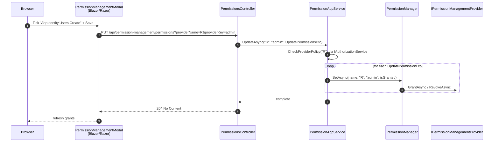

The HTTP edge of **ABP's Permission Management module** is exposed by two MVC controllers and two static client proxies. `Volo.Abp.PermissionManagement.HttpApi` hosts the controllers; `Volo.Abp.PermissionManagement.HttpApi.Client` wraps them in `ClientProxyBase`-derived proxies that any other ABP service can swap in for the real `IPermissionAppService` via DI.

The two controllers serve very different audiences. `PermissionsController` is the **admin** surface — a human (through the Razor Pages or Blazor modal) reads and updates grants for a user, role, or client. `PermissionIntegrationController` is the **service-to-service** surface — another microservice that needs to ask "is user X granted permission Y?" without round-tripping the full permission tree.

## Source layout

`modules/permission-management/src/Volo.Abp.PermissionManagement.HttpApi/Volo/Abp/PermissionManagement/`

- `AbpPermissionManagementHttpApiModule.cs`
- `PermissionsController.cs`
- `Integration/PermissionIntegrationController.cs`

`modules/permission-management/src/Volo.Abp.PermissionManagement.HttpApi.Client/`

- `Volo/Abp/PermissionManagement/AbpPermissionManagementHttpApiClientModule.cs`
- `Volo/Abp/PermissionManagement/HttpClientPermissionFinder.cs`
- `ClientProxies/Volo/Abp/PermissionManagement/PermissionsClientProxy.cs`
- `ClientProxies/Volo/Abp/PermissionManagement/PermissionsClientProxy.Generated.cs`
- `ClientProxies/Volo/Abp/PermissionManagement/Integration/PermissionIntegrationClientProxy.cs`
- `ClientProxies/Volo/Abp/PermissionManagement/Integration/PermissionIntegrationClientProxy.Generated.cs`

## `AbpPermissionManagementHttpApiModule`

```csharp
[DependsOn(
    typeof(AbpPermissionManagementApplicationContractsModule),
    typeof(AbpAspNetCoreMvcModule))]
public class AbpPermissionManagementHttpApiModule : AbpModule
{
    public override void PreConfigureServices(ServiceConfigurationContext context)
    {
        PreConfigure<IMvcBuilder>(mvcBuilder =>
        {
            mvcBuilder.AddApplicationPartIfNotExists(typeof(AbpPermissionManagementHttpApiModule).Assembly);
        });
    }

    public override void ConfigureServices(ServiceConfigurationContext context)
    {
        Configure<AbpLocalizationOptions>(options =>
        {
            options.Resources.Get<AbpPermissionManagementResource>()
                             .AddBaseTypes(typeof(AbpUiResource));
        });
    }
}
```

`AddApplicationPartIfNotExists` is what makes the controllers discoverable when this module is referenced as a NuGet package (no `[assembly: …]` attribute exists, so the part has to be added by the modular framework). The localization registration ensures the strings used by validation errors (the `AbpUi` resource for `[Required]` and friends) are available in the API responses.

## `PermissionsController`

```csharp
[RemoteService(Name = PermissionManagementRemoteServiceConsts.RemoteServiceName)]
[Area(PermissionManagementRemoteServiceConsts.ModuleName)]
[Route("api/permission-management/permissions")]
public class PermissionsController : AbpControllerBase, IPermissionAppService
{
    protected IPermissionAppService PermissionAppService { get; }

    public PermissionsController(IPermissionAppService permissionAppService)
    {
        PermissionAppService = permissionAppService;
    }

    [HttpGet]
    public virtual Task<GetPermissionListResultDto> GetAsync(string providerName, string providerKey)
        => PermissionAppService.GetAsync(providerName, providerKey);

    [HttpGet]
    [Route("by-group")]
    public virtual Task<GetPermissionListResultDto> GetByGroupAsync(
        string groupName, string providerName, string providerKey)
        => PermissionAppService.GetByGroupAsync(groupName, providerName, providerKey);

    [HttpPut]
    public virtual Task UpdateAsync(string providerName, string providerKey, UpdatePermissionsDto input)
        => PermissionAppService.UpdateAsync(providerName, providerKey, input);
}
```

It implements `IPermissionAppService` and forwards every call — the same dependency-injection identity is reused so an override of `IPermissionAppService` (see [the application page](/modules/permission-management/application)) automatically propagates here.

### Routes

| HTTP | Route | Method | Auth |
|------|-------|--------|------|
| `GET` | `/api/permission-management/permissions?providerName={n}&providerKey={k}` | `GetAsync` | `[Authorize]` + `ProviderPolicies[n]` |
| `GET` | `/api/permission-management/permissions/by-group?groupName={g}&providerName={n}&providerKey={k}` | `GetByGroupAsync` | same |
| `PUT` | `/api/permission-management/permissions?providerName={n}&providerKey={k}` (body: `UpdatePermissionsDto`) | `UpdateAsync` | same |

`Area("permissionManagement")` and `RemoteService(Name = "AbpPermissionManagement")` make the controller addressable both from ABP's static client proxy generator and from the Swagger / OpenAPI grouping conventions.

<Tabs>
  <Tab title="GET /api/permission-management/permissions">
    Read the full permission tree for a subject.

    ```http
    GET /api/permission-management/permissions?providerName=R&providerKey=admin HTTP/1.1
    Authorization: Bearer …
    ```

    ```json
    {
      "entityDisplayName": "admin",
      "groups": [
        {
          "name": "AbpIdentity",
          "displayName": "Identity management",
          "displayNameKey": "Permission:AbpIdentity",
          "displayNameResource": "AbpIdentity",
          "permissions": [
            {
              "name": "AbpIdentity.Users",
              "displayName": "User management",
              "parentName": null,
              "isGranted": true,
              "allowedProviders": [],
              "grantedProviders": [ { "providerName": "R", "providerKey": "admin" } ]
            }
          ]
        }
      ]
    }
    ```

    `providerName` is the value provider key: `"U"`, `"R"`, `"C"`, or any custom provider you register. `providerKey` is the subject identifier (user id as string, role name, OpenIddict client id).
  </Tab>
  <Tab title="GET /by-group">
    Read one tab of the modal at a time.

    ```http
    GET /api/permission-management/permissions/by-group?groupName=AbpIdentity&providerName=R&providerKey=admin
    ```

    Response shape is identical to `GetAsync`, except `groups` will contain at most one entry — the one whose `Name == groupName`.
  </Tab>
  <Tab title="PUT /api/permission-management/permissions">
    Update grants for a subject.

    ```http
    PUT /api/permission-management/permissions?providerName=R&providerKey=admin HTTP/1.1
    Content-Type: application/json
    Authorization: Bearer …

    {
      "permissions": [
        { "name": "AbpIdentity.Users.Create", "isGranted": true  },
        { "name": "AbpIdentity.Users.Delete", "isGranted": false }
      ]
    }
    ```

    Returns `204 No Content` on success. Returns `403 Forbidden` if the caller does not satisfy the `ProviderPolicies[providerName]` policy. Returns `400` with an `AbpException` payload if a permission's `Providers` whitelist disallows the chosen provider or the permission is disabled / not compatible with the current multitenancy side.
  </Tab>
</Tabs>

## `PermissionIntegrationController`

```csharp
[RemoteService(Name = PermissionManagementRemoteServiceConsts.RemoteServiceName)]
[Area(PermissionManagementRemoteServiceConsts.ModuleName)]
[ControllerName("PermissionIntegration")]
[Route("integration-api/permission-management/permissions")]
public class PermissionIntegrationController : AbpControllerBase, IPermissionIntegrationService
{
    protected IPermissionIntegrationService PermissionIntegrationService { get; }

    public PermissionIntegrationController(IPermissionIntegrationService permissionIntegrationService)
    {
        PermissionIntegrationService = permissionIntegrationService;
    }

    [HttpGet]
    [Route("is-granted")]
    public virtual Task<ListResultDto<IsGrantedResponse>> IsGrantedAsync(List<IsGrantedRequest> input)
        => PermissionIntegrationService.IsGrantedAsync(input);
}
```

The route is intentionally separated from the human-facing API:

- **Prefix `/integration-api/`** — a separate prefix lets gateways apply different policies (lower latency, mTLS, internal-only network) than `/api/`.
- **`[IntegrationService]`** on `IPermissionIntegrationService` marks the proxy as a service-to-service endpoint, so it bypasses some of the client proxy retry / interactive-auth logic that is normal for user-facing APIs.

The DTOs are minimal:

```csharp
public class IsGrantedRequest
{
    public Guid UserId { get; set; }
    public string[] PermissionNames { get; set; }
}

public class IsGrantedResponse
{
    public Guid UserId { get; set; }
    public Dictionary<string, bool> Permissions { get; set; }
}
```

The route is:

| HTTP | Route | Method |
|------|-------|--------|
| `GET` | `/integration-api/permission-management/permissions/is-granted` (body: `List<IsGrantedRequest>`) | `IsGrantedAsync` |

The response is a `ListResultDto<IsGrantedResponse>`, where each entry maps a user id to a `{ permissionName: bool }` dictionary — one round trip resolves grants for an arbitrary number of users and permission names.

<Note>
The integration route is the missing piece in a distributed authorization story: when service A needs to check a permission for a user from service B, the user's identity travels in the bearer token, but the grant data lives in B's permission DB. A's `IPermissionChecker` is configured (via `HttpClientPermissionFinder`) to call `/integration-api/permission-management/permissions/is-granted` on B, getting a typed answer back without exposing the full `PermissionsController` surface.
</Note>

## Client proxies

### `AbpPermissionManagementHttpApiClientModule`

```csharp
[DependsOn(
    typeof(AbpPermissionManagementApplicationContractsModule),
    typeof(AbpHttpClientModule))]
public class AbpPermissionManagementHttpApiClientModule : AbpModule
{
    public override void ConfigureServices(ServiceConfigurationContext context)
    {
        context.Services.AddStaticHttpClientProxies(
            typeof(AbpPermissionManagementApplicationContractsModule).Assembly,
            PermissionManagementRemoteServiceConsts.RemoteServiceName
        );

        Configure<AbpVirtualFileSystemOptions>(options =>
        {
            options.FileSets.AddEmbedded<AbpPermissionManagementHttpApiClientModule>();
        });
    }
}
```

`AddStaticHttpClientProxies` registers the generated `*ClientProxy` types as implementations of the contract interfaces (`IPermissionAppService`, `IPermissionIntegrationService`). The `RemoteServiceName` argument is the same constant the controller uses, so a non-default `RemoteServices` config block routes both ends consistently.

### `PermissionsClientProxy`

The generated proxy (in `ClientProxies/Volo/Abp/PermissionManagement/PermissionsClientProxy.Generated.cs`) is registered to replace `IPermissionAppService` in the client app's DI container:

```csharp
[Dependency(ReplaceServices = true)]
[ExposeServices(typeof(IPermissionAppService), typeof(PermissionsClientProxy))]
public partial class PermissionsClientProxy : ClientProxyBase<IPermissionAppService>, IPermissionAppService
{
    public virtual async Task<GetPermissionListResultDto> GetAsync(string providerName, string providerKey)
    {
        return await RequestAsync<GetPermissionListResultDto>(nameof(GetAsync), new ClientProxyRequestTypeValue
        {
            { typeof(string), providerName },
            { typeof(string), providerKey }
        });
    }

    public virtual async Task<GetPermissionListResultDto> GetByGroupAsync(
        string groupName, string providerName, string providerKey)
    {
        return await RequestAsync<GetPermissionListResultDto>(nameof(GetByGroupAsync), new ClientProxyRequestTypeValue
        {
            { typeof(string), groupName },
            { typeof(string), providerName },
            { typeof(string), providerKey }
        });
    }

    public virtual async Task UpdateAsync(string providerName, string providerKey, UpdatePermissionsDto input)
    {
        await RequestAsync(nameof(UpdateAsync), new ClientProxyRequestTypeValue
        {
            { typeof(string), providerName },
            { typeof(string), providerKey },
            { typeof(UpdatePermissionsDto), input }
        });
    }
}
```

`ClientProxyBase<IPermissionAppService>` calls the underlying `IHttpClientProxy` which:

1. Resolves the action descriptor of the original `IPermissionAppService` method by name and parameter signature.
2. Computes the URL, query string, and HTTP method from the controller metadata that ABP shipped via the API definition manager.
3. Forwards the call, deserializes the response into the declared return type, and surfaces any `AbpRemoteCallException` as a thrown exception with the same `Code` / `Message` the server emitted.

The hand-written `PermissionsClientProxy.cs` companion file is empty — it exists so consumers can drop partial methods into a stable type without touching the generated file.

### `PermissionIntegrationClientProxy`

```csharp
[Dependency(ReplaceServices = true)]
[ExposeServices(typeof(IPermissionIntegrationService), typeof(PermissionIntegrationClientProxy))]
[IntegrationService]
public partial class PermissionIntegrationClientProxy
    : ClientProxyBase<IPermissionIntegrationService>, IPermissionIntegrationService
{
    public virtual async Task<ListResultDto<IsGrantedResponse>> IsGrantedAsync(List<IsGrantedRequest> input)
    {
        return await RequestAsync<ListResultDto<IsGrantedResponse>>(nameof(IsGrantedAsync),
            new ClientProxyRequestTypeValue
            {
                { typeof(List<IsGrantedRequest>), input }
            });
    }
}
```

Same shape, different contract. The `[IntegrationService]` attribute is what tells the `HttpClientProxy` infrastructure to use the integration HTTP client (which is configured against the internal route prefix).

### `HttpClientPermissionFinder`

This is the bridge that the **authorization pipeline** uses on a service-to-service edge:

```csharp
[Dependency(TryRegister = true)]
public class HttpClientPermissionFinder : IPermissionFinder, ITransientDependency
{
    protected IPermissionIntegrationService PermissionIntegrationService { get; }

    public HttpClientPermissionFinder(IPermissionIntegrationService permissionIntegrationService)
    {
        PermissionIntegrationService = permissionIntegrationService;
    }

    public virtual async Task<List<IsGrantedResponse>> IsGrantedAsync(List<IsGrantedRequest> requests)
    {
        return (await PermissionIntegrationService.IsGrantedAsync(requests)).Items.ToList();
    }
}
```

`TryRegister = true` means: only become `IPermissionFinder` if nothing else already registered one. In the **permission-management host** (the service that owns the DB), the domain layer's in-process `PermissionFinder` wins; in any **client** service that references `Volo.Abp.PermissionManagement.HttpApi.Client` *without* the domain package, `HttpClientPermissionFinder` is what plugs in.

## How a client service consumes the API

<Steps>
  <Step title="Reference the client package">
    Add `Volo.Abp.PermissionManagement.HttpApi.Client` to the client service and declare a `[DependsOn(typeof(AbpPermissionManagementHttpApiClientModule))]` on its module.
  </Step>
  <Step title="Configure the remote service endpoint">
    In `appsettings.json`, the `RemoteServices:AbpPermissionManagement:BaseUrl` (or the default endpoint) tells the static proxy where the permission management host lives.

    ```json
    "RemoteServices": {
      "AbpPermissionManagement": { "BaseUrl": "https://internal.permissions.local/" }
    }
    ```
  </Step>
  <Step title="Inject IPermissionAppService anywhere">
    `IPermissionAppService` resolves to `PermissionsClientProxy`, which transparently calls `PermissionsController`. The same is true for `IPermissionIntegrationService` ➝ `PermissionIntegrationClientProxy` ➝ `PermissionIntegrationController`.
  </Step>
  <Step title="Let HttpClientPermissionFinder feed authorization">
    `Volo.Abp.Authorization.Permissions.IPermissionChecker` resolves `IPermissionFinder` from DI; since the host's in-process implementation is absent in this app, `HttpClientPermissionFinder` is the one selected, and every `[Authorize("X")]` check becomes a cross-service call.
  </Step>
</Steps>

<Warning>
Cross-service permission checks are **not** free. `HttpClientPermissionFinder` calls the integration endpoint on the hot path of every authorization decision. In a high-throughput service, prefer the **claims-on-token** strategy — issue a token that carries the user's permission claims and rely on `Volo.Abp.Authorization.Permissions.UserPermissionValueProvider`'s claim-based path. Use the integration endpoint only for sparse "look up an exotic permission" checks.
</Warning>

## Sequence — admin updates a grant



## Sequence — service-to-service permission check

```mermaid
sequenceDiagram
    autonumber
    participant Caller as Caller service<br/>(IAuthorizationService)
    participant Finder as HttpClientPermissionFinder
    participant Proxy as PermissionIntegrationClientProxy
    participant Ctrl as PermissionIntegrationController
    participant SvcImpl as PermissionIntegrationService

    Caller->>Finder: IsGrantedAsync([ { UserId, [perm1, perm2] } ])
    Finder->>Proxy: IsGrantedAsync(List&lt;IsGrantedRequest&gt;)
    Proxy->>Ctrl: GET /integration-api/permission-management/permissions/is-granted
    Ctrl->>SvcImpl: IsGrantedAsync(input)
    SvcImpl-->>Ctrl: ListResultDto&lt;IsGrantedResponse&gt;
    Ctrl-->>Proxy: 200 OK
    Proxy-->>Finder: ListResultDto&lt;IsGrantedResponse&gt;
    Finder-->>Caller: List&lt;IsGrantedResponse&gt;
```

## Cross-references

<CardGroup cols={2}>
  <Card title="Application services" icon="layer-group" href="/modules/permission-management/application">
    The `IPermissionAppService` contract the controller forwards to.
  </Card>
  <Card title="Web & Blazor UI" icon="window-maximize" href="/modules/permission-management/web-and-blazor">
    The Razor Pages and Blazor permission modal that hit these endpoints.
  </Card>
  <Card title="Domain internals" icon="cube" href="/modules/permission-management/domain">
    The `PermissionManager` / `PermissionStore` types ultimately invoked by these routes.
  </Card>
  <Card title="Authorization" icon="shield-halved" href="/security/authorization">
    `IPermissionChecker` and the `[Authorize]` pipeline that calls `IPermissionFinder` on cross-service requests.
  </Card>
  <Card title="Permission system" icon="key" href="/security/permissions">
    Where provider names like `"U"`, `"R"`, `"C"` are defined as `IPermissionValueProvider.Name`.
  </Card>
  <Card title="OpenIddict module" icon="lock" href="/modules/openiddict/overview">
    Issues the bearer token used to authenticate against both API surfaces.
  </Card>
</CardGroup>
