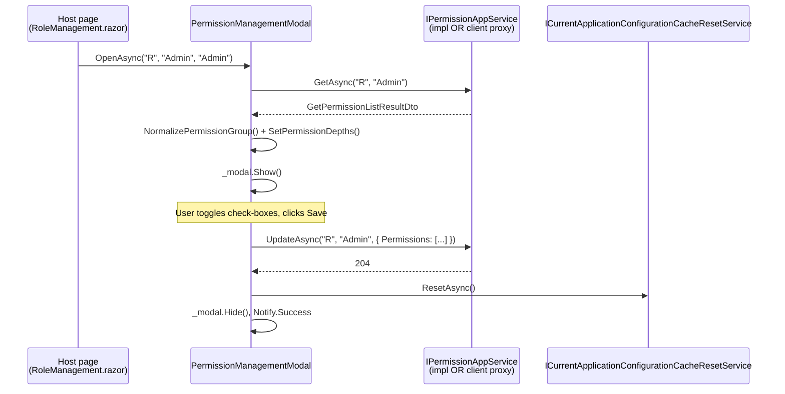

The user-facing UI of **ABP's Permission Management module** is one modal — the **Permissions** dialog that opens when an administrator clicks the "Permissions" action on a user, role, or OpenIddict client row. The module ships two parallel implementations: a Razor Pages dialog in `Volo.Abp.PermissionManagement.Web` and a Blazor component in `Volo.Abp.PermissionManagement.Blazor`. The Blazor variant is then hosted by either `Volo.Abp.PermissionManagement.Blazor.Server` or `Volo.Abp.PermissionManagement.Blazor.WebAssembly`.

All three packages talk to `IPermissionAppService` — the one from [the application page](/modules/permission-management/application) — through DI. In a same-process MVC app, that means `PermissionAppService`; in a Blazor WebAssembly app, that means `PermissionsClientProxy` from the [HTTP API client](/modules/permission-management/http-api).

## Source layout

<Tabs>
  <Tab title="Web (Razor Pages)">
    `modules/permission-management/src/Volo.Abp.PermissionManagement.Web/`
    - `AbpPermissionManagementWebModule.cs`
    - `AbpPermissionManagementWebMappers.cs` (Mapperly profile)
    - `Pages/AbpPermissionManagement/PermissionManagementModal.cshtml`
    - `Pages/AbpPermissionManagement/PermissionManagementModal.cshtml.cs`
    - `Pages/AbpPermissionManagement/_ViewImports.cshtml`
    - `Pages/AbpPermissionManagement/permission-management-modal.js`
    - `Pages/AbpPermissionManagement/permission-management-modal.css`
    - `Utils/FlatTreeDepthFinder.cs`, `Utils/IFlatTreeItem.cs`
  </Tab>
  <Tab title="Blazor">
    `modules/permission-management/src/Volo.Abp.PermissionManagement.Blazor/`
    - `AbpPermissionManagementBlazorModule.cs`
    - `Components/PermissionManagementModal.razor`
    - `Components/PermissionManagementModal.razor.cs`
    - `Components/PermissionManagementModal.razor.css`
    - `_Imports.razor`
  </Tab>
  <Tab title="Blazor.Server / WebAssembly">
    `modules/permission-management/src/Volo.Abp.PermissionManagement.Blazor.Server/AbpPermissionManagementBlazorServerModule.cs`

    `modules/permission-management/src/Volo.Abp.PermissionManagement.Blazor.WebAssembly/AbpPermissionManagementBlazorWebAssemblyModule.cs`

    Both are empty marker modules whose only job is to bring in the right theming module and (for WebAssembly) the HTTP API client.
  </Tab>
</Tabs>

## `AbpPermissionManagementWebModule`

```csharp
[DependsOn(typeof(AbpPermissionManagementApplicationContractsModule))]
[DependsOn(typeof(AbpAspNetCoreMvcUiBootstrapModule))]
[DependsOn(typeof(AbpMapperlyModule))]
public class AbpPermissionManagementWebModule : AbpModule
{
    public override void PreConfigureServices(ServiceConfigurationContext context)
    {
        context.Services.PreConfigure<AbpMvcDataAnnotationsLocalizationOptions>(options =>
        {
            options.AddAssemblyResource(
                typeof(AbpPermissionManagementResource),
                typeof(AbpPermissionManagementWebModule).Assembly,
                typeof(AbpPermissionManagementApplicationContractsModule).Assembly);
        });

        PreConfigure<IMvcBuilder>(mvcBuilder =>
        {
            mvcBuilder.AddApplicationPartIfNotExists(typeof(AbpPermissionManagementWebModule).Assembly);
        });
    }

    public override void ConfigureServices(ServiceConfigurationContext context)
    {
        Configure<AbpVirtualFileSystemOptions>(options =>
        {
            options.FileSets.AddEmbedded<AbpPermissionManagementWebModule>();
        });

        context.Services.AddMapperlyObjectMapper<AbpPermissionManagementWebModule>();

        Configure<DynamicJavaScriptProxyOptions>(options =>
        {
            options.DisableModule(PermissionManagementRemoteServiceConsts.ModuleName);
        });
    }
}
```

Notable bits:

- **`AddEmbedded`** ships the embedded `.cshtml`, `.js`, `.css` so the host app gets them via the virtual file system without copying anything to disk.
- **`AddMapperlyObjectMapper`** registers the Mapperly profile (`AbpPermissionManagementWebMappers`) that converts `PermissionGroupDto` ➝ `PermissionGroupViewModel` and `PermissionGrantInfoDto` ➝ `PermissionGrantInfoViewModel`. Mapperly is compile-time, so the conversion is zero-allocation.
- **`DisableModule("permissionManagement")`** prevents the *legacy* dynamic JavaScript proxy from being generated for the module; ABP nowadays prefers the static client proxies in `HttpApi.Client`.

## `PermissionManagementModal` (Razor Pages)

`Pages/AbpPermissionManagement/PermissionManagementModal.cshtml.cs` is a regular `AbpPageModel` with three bound properties and the standard `OnGet` / `OnPost` pair:

```csharp
public class PermissionManagementModal : AbpPageModel
{
    [Required, HiddenInput, BindProperty(SupportsGet = true)] public string ProviderName { get; set; }
    [Required, HiddenInput, BindProperty(SupportsGet = true)] public string ProviderKey { get; set; }
    [BindProperty(SupportsGet = true)]                         public string ProviderKeyDisplayName { get; set; }

    [BindProperty] public List<PermissionGroupViewModel> Groups { get; set; }

    public string EntityDisplayName { get; set; }
    public bool SelectAllInThisTab { get; set; }
    public bool SelectAllInAllTabs { get; set; }

    protected IPermissionAppService PermissionAppService { get; }
    protected ILocalEventBus LocalEventBus { get; }
    public AbpLocalizationOptions LocalizationOptions { get; }

    public PermissionManagementModal(
        IPermissionAppService permissionAppService,
        ILocalEventBus localEventBus,
        IOptions<AbpLocalizationOptions> localizationOptions)
    {
        ObjectMapperContext = typeof(AbpPermissionManagementWebModule);
        PermissionAppService = permissionAppService;
        LocalEventBus = localEventBus;
        LocalizationOptions = localizationOptions.Value;
    }
}
```

### `OnGetAsync`

```csharp
public virtual async Task<IActionResult> OnGetAsync()
{
    ValidateModel();

    var result = await PermissionAppService.GetAsync(ProviderName, ProviderKey);

    EntityDisplayName = !string.IsNullOrWhiteSpace(ProviderKeyDisplayName)
        ? ProviderKeyDisplayName
        : result.EntityDisplayName;

    Groups = ObjectMapper
        .Map<List<PermissionGroupDto>, List<PermissionGroupViewModel>>(result.Groups)
        .OrderBy(g => g.DisplayName)
        .ToList();

    foreach (var group in Groups)
    {
        new FlatTreeDepthFinder<PermissionGrantInfoViewModel>().SetDepths(group.Permissions);
    }

    foreach (var group in Groups)
    {
        group.IsAllPermissionsGranted = group.Permissions.All(p => p.IsGranted);
    }

    SelectAllInAllTabs = Groups.All(g => g.IsAllPermissionsGranted);

    return Page();
}
```

`FlatTreeDepthFinder<PermissionGrantInfoViewModel>` walks the `(Name, ParentName)` adjacency list in `IFlatTreeItem` and stamps a depth onto each entry — that depth is what the `.cshtml` view uses to indent each check-box. Sorting `Groups` by `DisplayName` keeps the tab order stable across deploys.

### `OnPostAsync`

```csharp
public virtual async Task<IActionResult> OnPostAsync()
{
    ValidateModel();

    var updatePermissionDtos = Groups
        .SelectMany(g => g.Permissions)
        .Select(p => new UpdatePermissionDto
        {
            Name = p.Name,
            IsGranted = p.IsGranted
        })
        .ToArray();

    await PermissionAppService.UpdateAsync(
        ProviderName,
        ProviderKey,
        new UpdatePermissionsDto
        {
            Permissions = updatePermissionDtos
        });

    await LocalEventBus.PublishAsync(new CurrentApplicationConfigurationCacheResetEventData());

    return NoContent();
}
```

Two things to notice:

1. **The full grant tree is shipped on every save** — granted *and* revoked. `PermissionAppService.UpdateAsync` no-ops unchanged entries inside `PermissionManager.SetAsync`, so the round-trip is safe.
2. **`CurrentApplicationConfigurationCacheResetEventData`** invalidates the per-user `application-configuration` cache that the front-end script loader uses to learn the user's effective permissions, so the change is visible to the caller's *own* UI without a page reload.

### View models

The page model nests three `class`es used by the Razor view and the AutoMapper / Mapperly profile:

```csharp
public class PermissionGroupViewModel
{
    public string Name { get; set; }
    public bool IsAllPermissionsGranted { get; set; }
    public string DisplayName { get; set; }
    public List<PermissionGrantInfoViewModel> Permissions { get; set; }

    public string GetNormalizedGroupName() => Name.Replace(".", "_");

    public bool IsDisabled(string currentProviderName)
    {
        var grantedProviders = Permissions.SelectMany(x => x.GrantedProviders);
        return Permissions.All(x => x.IsGranted) &&
               grantedProviders.All(p => p.ProviderName != currentProviderName);
    }
}

public class PermissionGrantInfoViewModel : IFlatTreeItem
{
    [Required, HiddenInput] public string Name { get; set; }
    public string DisplayName { get; set; }
    public int Depth { get; set; }
    public string ParentName { get; set; }
    public bool IsGranted { get; set; }
    public List<string> AllowedProviders { get; set; }
    public List<ProviderInfoViewModel> GrantedProviders { get; set; }

    public bool IsDisabled(string currentProviderName)
        => IsGranted && GrantedProviders.All(p => p.ProviderName != currentProviderName);

    public string GetShownName(string currentProviderName)
    {
        if (!IsDisabled(currentProviderName)) return DisplayName;
        return string.Format("{0} ({1})", DisplayName,
            GrantedProviders.Where(p => p.ProviderName != currentProviderName)
                            .Select(p => p.ProviderName).JoinAsString(", "));
    }
}

public class ProviderInfoViewModel
{
    public string ProviderName { get; set; }
    public string ProviderKey { get; set; }
}
```

`IsDisabled` is the rule that grays-out a check-box: a permission already granted by *another* provider — e.g. when looking at a user, a permission inherited from one of their roles — cannot be revoked from this modal because the grant does not live on this subject. `GetShownName` appends the other provider's name to make it obvious *why*.

<Note>
The `(currentProviderName)` argument is how the same view file works for users, roles and clients without conditional rendering. `ProviderName == "U"` will gray out role-granted permissions for the user; `ProviderName == "R"` will gray out nothing (a role can always toggle its own grants); `ProviderName == "C"` similarly.
</Note>

## Opening the modal from a Razor Page

The Razor Page is designed to be embedded by other modules (Identity, OpenIddict, …) via the standard ABP modal opener — typically wired to an action button in a row's dropdown. The modal URL is `/Pages/AbpPermissionManagement/PermissionManagementModal` and accepts the three query-string parameters above:

```
/Pages/AbpPermissionManagement/PermissionManagementModal
    ?ProviderName=R
    &ProviderKey=Admin
    &ProviderKeyDisplayName=Admin
```

`Volo.Abp.Identity.Web` issues that URL from the role row action; `Volo.Abp.OpenIddict.Pro.Web` issues it with `ProviderName=C&ProviderKey={clientId}`.

## Blazor: `PermissionManagementModal` component

`Components/PermissionManagementModal.razor.cs` is the partial code-behind for the Blazorise `<Modal>` defined in the matching `.razor` file. The component is **opened imperatively** — the parent component holds a `@ref` and calls `OpenAsync`:

```csharp
public partial class PermissionManagementModal
{
    [Inject] protected IPermissionAppService PermissionAppService { get; set; }
    [Inject] protected ICurrentApplicationConfigurationCacheResetService
                       CurrentApplicationConfigurationCacheResetService { get; set; }
    [Inject] protected IOptions<AbpLocalizationOptions> LocalizationOptions { get; set; }

    protected Modal _modal;

    protected string _providerName;
    protected string _providerKey;
    protected string _entityDisplayName;

    protected List<PermissionGroupDto> _allGroups;
    protected List<PermissionGroupDto> _groups;
    protected List<PermissionGrantInfoDto> _disabledPermissions = new();

    protected string _selectedTabName;
    protected bool _selectAllDisabled;
    protected string _permissionGroupSearchText;

    protected bool GrantAll { get; set; }
    protected bool GrantAny { get; set; }

    protected Dictionary<string, int> _permissionDepths = new();

    public PermissionManagementModal()
    {
        LocalizationResource = typeof(AbpPermissionManagementResource);
    }

    public virtual async Task OpenAsync(
        string providerName, string providerKey, string entityDisplayName = null)
    {
        try
        {
            _providerName = providerName;
            _providerKey = providerKey;
            _permissionGroupSearchText = null;

            var result = await PermissionAppService.GetAsync(_providerName, _providerKey);

            _entityDisplayName = entityDisplayName ?? result.EntityDisplayName;
            _allGroups = result.Groups.OrderBy(x => x.DisplayName).ToList();
            _groups = _allGroups.ToList();

            NormalizePermissionGroup();

            GrantAll = _groups.SelectMany(x => x.Permissions).All(p => p.IsGranted);
            GrantAny = !GrantAll && _groups.SelectMany(x => x.Permissions).Any(p => p.IsGranted);

            await InvokeAsync(_modal.Show);
        }
        catch (Exception ex)
        {
            await HandleErrorAsync(ex);
        }
    }
}
```

### `NormalizePermissionGroup`

Run after each load *and* after each search filter change:

```csharp
protected virtual void NormalizePermissionGroup(bool checkDisabledPermissions = true)
{
    _selectAllDisabled = _groups.All(IsPermissionGroupDisabled);

    if (checkDisabledPermissions)
    {
        _disabledPermissions.Clear();
    }

    foreach (var permission in _groups.SelectMany(x => x.Permissions))
    {
        if (checkDisabledPermissions &&
            permission.IsGranted &&
            permission.GrantedProviders.All(x => x.ProviderName != _providerName))
        {
            _disabledPermissions.Add(permission);
        }
    }

    foreach (var group in _groups)
    {
        SetPermissionDepths(group.Permissions, null, 0);
    }

    if (_groups.Count != 0)
    {
        _selectedTabName = GetNormalizedGroupName(_groups.First().Name);
    }
}
```

The `_disabledPermissions` list mirrors the Razor Pages `IsDisabled(providerName)` logic: any permission granted by *another* provider stays read-only. `SetPermissionDepths` walks the `(Name, ParentName)` adjacency list recursively, populating `_permissionDepths` so the `.razor` template can indent each check-box by `Depth * 24px`.

### `SaveAsync`

```csharp
protected virtual async Task SaveAsync()
{
    try
    {
        var updateDto = new UpdatePermissionsDto
        {
            Permissions = _allGroups
                .SelectMany(g => g.Permissions)
                .Select(p => new UpdatePermissionDto { IsGranted = p.IsGranted, Name = p.Name })
                .ToArray()
        };

        if (!updateDto.Permissions.Any(x => x.IsGranted))
        {
            if (!await Message.Confirm(L["SaveWithoutAnyPermissionsWarningMessage"].Value))
            {
                return;
            }
        }

        await PermissionAppService.UpdateAsync(_providerName, _providerKey, updateDto);

        await CurrentApplicationConfigurationCacheResetService.ResetAsync();

        await InvokeAsync(_modal.Hide);
        await Notify.Success(L["SavedSuccessfully"]);
    }
    catch (Exception ex)
    {
        await HandleErrorAsync(ex);
    }
}
```

The same "warn before saving an empty grant list" confirmation that the Razor Pages dialog has. `CurrentApplicationConfigurationCacheResetService.ResetAsync()` is the Blazor equivalent of the Razor Page's `LocalEventBus.PublishAsync(new CurrentApplicationConfigurationCacheResetEventData())` — it invalidates the cached `ApplicationConfigurationDto` so the next render uses fresh permission claims.

### `GrantAllAsync`

The "Select all in all tabs" check-box at the top is a tri-state (`true` / `false` / `Indeterminate`) driven by `GrantAll` and `GrantAny`:

```csharp
protected virtual async Task GrantAllAsync(bool grantAll)
{
    GrantAll = grantAll;
    GrantAny = false;

    if (_allGroups == null) { return; }

    await ResetSearchTextAsync();

    foreach (var permission in _allGroups.SelectMany(x => x.Permissions))
    {
        if (IsDisabledPermission(permission)) { continue; }
        permission.IsGranted = grantAll;
    }

    await InvokeAsync(StateHasChanged);
}
```

The disabled permissions are skipped so a parent-grant doesn't silently flip a check-box the user cannot toggle.

### The Blazorise template

The `.razor` template wraps everything in a Blazorise `<Modal>` with two `<Tabs>` columns — one for the group list (left) and one for the permission tree (right):

```razor
<Modal @ref="_modal" Closing="@ClosingModal">
    <ModalContent Size="ModalSize.Large" Centered="true">
        <ModalHeader>
            <ModalTitle>@L["Permissions"] - @_entityDisplayName</ModalTitle>
            <CloseButton Clicked="CloseModal" />
        </ModalHeader>
        <ModalBody Overflow="Overflow.Hidden">
            <!-- search + Select all in all tabs -->
            <Row Class="row d-flex align-items-center mb-2">
                <Column>
                    <Field Class="mb-2">
                        <Addons>
                            <Addon AddonType="AddonType.Start"><Icon Name="IconName.Search"/></Addon>
                            <Addon AddonType="AddonType.Body">
                                <TextEdit Text="@_permissionGroupSearchText"
                                          TextChanged="OnPermissionGroupSearchTextChangedAsync"/>
                            </Addon>
                        </Addons>
                    </Field>
                </Column>
                <Column ColumnSize="ColumnSize.IsAuto">
                    <Check Disabled="_selectAllDisabled" Cursor="Cursor.Pointer"
                           CheckedChanged="@GrantAllAsync" Checked="@GrantAll"
                           TValue="bool" Indeterminate="@GrantAny">
                        @L["SelectAllInAllTabs"]
                    </Check>
                </Column>
            </Row>

            <fieldset class="border rounded-4 p-3">
                <legend class="px-1 h5 mb-0">@L["PermissionGroup"]</legend>
                <Tabs @key="_groups"
                      VerticalItemsColumnSize="ColumnSize.Is4.OnDesktop"
                      TabPosition="TabPosition.Start"
                      Pills="true"
                      SelectedTab="@_selectedTabName"
                      SelectedTabChanged="@OnSelectedTabChangedAsync">
                    <Items> … one <Tab> per group … </Items>
                    <Content> … one <TabPanel> per group with the permission check-boxes … </Content>
                </Tabs>
            </fieldset>
        </ModalBody>
    </ModalContent>
</Modal>
```

## Blazor.Server and Blazor.WebAssembly hosting modules

Both are tiny — they exist only to wire the modal's runtime into the host environment:

```csharp
// AbpPermissionManagementBlazorServerModule
[DependsOn(
    typeof(AbpPermissionManagementBlazorModule),
    typeof(AbpAspNetCoreComponentsServerThemingModule))]
public class AbpPermissionManagementBlazorServerModule : AbpModule { }

// AbpPermissionManagementBlazorWebAssemblyModule
[DependsOn(
    typeof(AbpPermissionManagementBlazorModule),
    typeof(AbpAspNetCoreComponentsWebAssemblyThemingModule),
    typeof(AbpPermissionManagementHttpApiClientModule))]
public class AbpPermissionManagementBlazorWebAssemblyModule : AbpModule { }
```

The WebAssembly module *additionally* depends on `AbpPermissionManagementHttpApiClientModule` because in a stand-alone Blazor WebAssembly app there is no in-process `PermissionAppService` — the modal must hit the HTTP API.

<Tabs>
  <Tab title="Blazor Server">
    The host is an ASP.NET Core MVC app that also serves `_Host.cshtml` (or `App.razor` in .NET 8 hosting). The same `PermissionAppService` instance is used by Razor Pages *and* Blazor, so a server-side rendered modal and a Blazor-rendered modal both share a single transaction scope when nested inside a unit-of-work middleware.
  </Tab>
  <Tab title="Blazor WebAssembly">
    The host bootstraps via `WebAssemblyHostBuilder`. `IPermissionAppService` resolves to `PermissionsClientProxy`, every `OpenAsync` triggers a `GET /api/permission-management/permissions?…`, and `SaveAsync` triggers a `PUT`. The JWT bearer token comes from the OpenIddict client configured in the app's bootstrap module.
  </Tab>
</Tabs>

## How other modules open the modal

<Tabs>
  <Tab title="Identity (role list)">
    `Volo.Abp.Identity.Blazor` has a `<PermissionManagementModal @ref="_permissionManagementModal" />` in its `RoleManagement.razor` page. The row action calls:

    ```csharp
    await _permissionManagementModal.OpenAsync(
        RolePermissionValueProvider.ProviderName,  // "R"
        role.Name,
        role.Name);
    ```
  </Tab>
  <Tab title="Identity (user list)">
    Same pattern in `UserManagement.razor`:

    ```csharp
    await _permissionManagementModal.OpenAsync(
        UserPermissionValueProvider.ProviderName,  // "U"
        user.Id.ToString(),
        user.UserName);
    ```
  </Tab>
  <Tab title="OpenIddict (client list)">
    Pro / commercial OpenIddict UI invokes it for client applications:

    ```csharp
    await _permissionManagementModal.OpenAsync(
        ClientPermissionValueProvider.ProviderName, // "C"
        application.ClientId,
        application.DisplayName);
    ```
  </Tab>
</Tabs>

## Lifecycle in a single picture



<Warning>
**Do not bypass the modal to write grants from the UI.** The modal honors the disabled-by-other-provider rule (`IsDisabled(providerName)`) that ensures, for example, a user-modal admin cannot accidentally try to flip an inherited role grant. `PermissionManager.SetAsync` would silently accept the request (it would create a redundant `PermissionGrant` row keyed on `("U", userId)` even though the user already has it via `("R", roleName)`), making the audit story confusing.
</Warning>

## Cross-references

<CardGroup cols={2}>
  <Card title="Application services" icon="layer-group" href="/modules/permission-management/application">
    `IPermissionAppService` + its DTOs — the contract the modal binds to.
  </Card>
  <Card title="HTTP API" icon="plug" href="/modules/permission-management/http-api">
    `PermissionsController` + `PermissionsClientProxy` — what the Blazor WebAssembly variant actually calls.
  </Card>
  <Card title="Domain internals" icon="cube" href="/modules/permission-management/domain">
    `PermissionManager.SetAsync` / `PermissionStore` — the layer behind every Save click.
  </Card>
  <Card title="Identity module" icon="user" href="/modules/identity/overview">
    The role / user pages that mount this modal.
  </Card>
  <Card title="OpenIddict module" icon="lock" href="/modules/openiddict/overview">
    The client application page that mounts this modal for `ProviderName = "C"`.
  </Card>
  <Card title="Permissions system" icon="key" href="/security/permissions">
    `PermissionDefinition.Providers`, `MultiTenancySide`, and feature flags that drive the gray-out logic.
  </Card>
</CardGroup>
