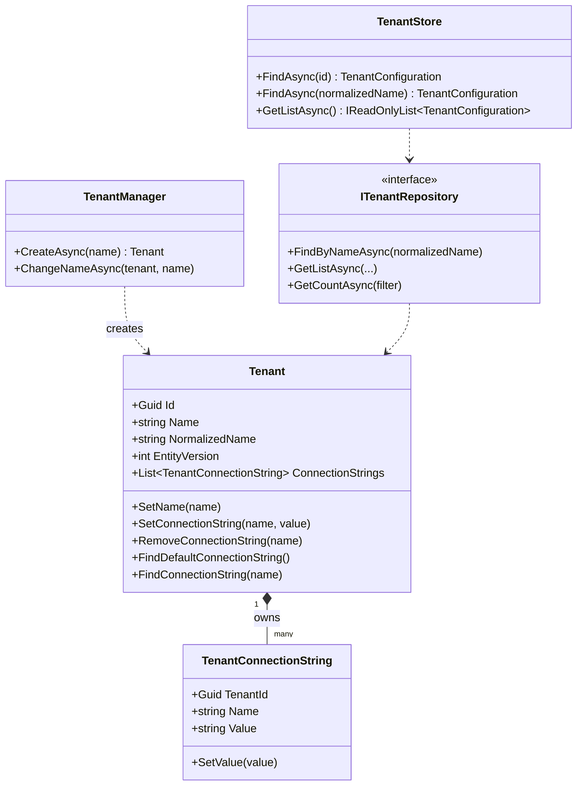

# Domain Layer

The Tenant Management domain is split into two packages:

- **`Volo.Abp.TenantManagement.Domain.Shared`** — constants, ETOs (distributed event objects), localization keys.
- **`Volo.Abp.TenantManagement.Domain`** — the `Tenant` aggregate, the `TenantConnectionString` child entity, `ITenantRepository`, `TenantManager`, `TenantStore`.

```
modules/tenant-management/src/Volo.Abp.TenantManagement.Domain.Shared/
└── Volo/Abp/TenantManagement/
    ├── AbpTenantManagementDomainSharedModule.cs
    ├── TenantConnectionStringConsts.cs
    ├── TenantConsts.cs
    ├── TenantEto.cs
    └── Localization/

modules/tenant-management/src/Volo.Abp.TenantManagement.Domain/
└── Volo/Abp/TenantManagement/
    ├── AbpTenantManagementDomainModule.cs
    ├── AbpTenantManagementDbProperties.cs
    ├── AbpTenantManagementDomainMapperlyMappers.cs
    ├── AbpTenantValidator.cs
    ├── ITenantManager.cs
    ├── ITenantRepository.cs
    ├── ITenantValidator.cs
    ├── Tenant.cs
    ├── TenantConfigurationCacheItemInvalidator.cs
    ├── TenantConnectionString.cs
    ├── TenantManager.cs
    └── TenantStore.cs
```

## Aggregate model



## `Tenant` aggregate root

File: `Volo.Abp.TenantManagement.Domain/Volo/Abp/TenantManagement/Tenant.cs`

`Tenant` is a `FullAuditedAggregateRoot<Guid>` and implements `IHasEntityVersion` (so each save bumps the cached `TenantConfiguration` version).

```csharp
namespace Volo.Abp.TenantManagement;

public class Tenant : FullAuditedAggregateRoot<Guid>, IHasEntityVersion
{
    public virtual string Name { get; protected set; }

    public virtual string NormalizedName { get; protected set; }

    public virtual int EntityVersion { get; protected set; }

    public virtual List<TenantConnectionString> ConnectionStrings { get; protected set; }

    protected Tenant() { }

    protected internal Tenant(Guid id, [NotNull] string name, [CanBeNull] string normalizedName)
        : base(id)
    {
        SetName(name);
        SetNormalizedName(normalizedName);

        ConnectionStrings = new List<TenantConnectionString>();
    }
}
```

<Warning>
The constructor is `protected internal`. You never call `new Tenant(...)` directly — always go through `ITenantManager.CreateAsync`, which validates uniqueness via `ITenantValidator`.
</Warning>

### Name management

```csharp
protected internal virtual void SetName([NotNull] string name)
{
    Name = Check.NotNullOrWhiteSpace(name, nameof(name), TenantConsts.MaxNameLength);
}

protected internal virtual void SetNormalizedName([CanBeNull] string normalizedName)
{
    NormalizedName = normalizedName;
}
```

`TenantConsts.MaxNameLength` defaults to **64** (mutable, in `TenantConsts.cs`):

```csharp
public static class TenantConsts
{
    public static int MaxNameLength { get; set; } = 64;
    public static int MaxPasswordLength { get; set; } = 128;
    public static int MaxAdminEmailAddressLength { get; set; } = 256;
}
```

### Connection-string helpers

The aggregate exposes a tiny, intent-revealing API for managing per-tenant connection strings — instead of letting consumers mutate the `ConnectionStrings` list directly.

```csharp
[CanBeNull]
public virtual string FindDefaultConnectionString()
{
    return FindConnectionString(Data.ConnectionStrings.DefaultConnectionStringName);
}

[CanBeNull]
public virtual string FindConnectionString(string name)
{
    return ConnectionStrings.FirstOrDefault(c => c.Name == name)?.Value;
}

public virtual void SetDefaultConnectionString(string connectionString)
{
    SetConnectionString(Data.ConnectionStrings.DefaultConnectionStringName, connectionString);
}

public virtual void SetConnectionString(string name, string connectionString)
{
    var tenantConnectionString = ConnectionStrings.FirstOrDefault(x => x.Name == name);

    if (tenantConnectionString != null)
    {
        tenantConnectionString.SetValue(connectionString);
    }
    else
    {
        ConnectionStrings.Add(new TenantConnectionString(Id, name, connectionString));
    }
}

public virtual void RemoveConnectionString(string name)
{
    var tenantConnectionString = ConnectionStrings.FirstOrDefault(x => x.Name == name);
    if (tenantConnectionString != null)
    {
        ConnectionStrings.Remove(tenantConnectionString);
    }
}
```

The string `Data.ConnectionStrings.DefaultConnectionStringName` is `"Default"` — the same constant ABP's [/data/connection-strings](/data/connection-strings) uses when no `[ConnectionStringName(...)]` attribute is present.

## `TenantConnectionString` entity

File: `Volo.Abp.TenantManagement.Domain/Volo/Abp/TenantManagement/TenantConnectionString.cs`

```csharp
namespace Volo.Abp.TenantManagement;

public class TenantConnectionString : Entity
{
    public virtual Guid TenantId { get; protected set; }

    public virtual string Name { get; protected set; }

    public virtual string Value { get; protected set; }

    protected TenantConnectionString() { }

    public TenantConnectionString(Guid tenantId, [NotNull] string name, [NotNull] string value)
    {
        TenantId = tenantId;
        Name = Check.NotNullOrWhiteSpace(name, nameof(name), TenantConnectionStringConsts.MaxNameLength);
        SetValue(value);
    }

    public virtual void SetValue([NotNull] string value)
    {
        Value = Check.NotNullOrWhiteSpace(value, nameof(value), TenantConnectionStringConsts.MaxValueLength);
    }

    public override object[] GetKeys()
    {
        return new object[] { TenantId, Name };
    }
}
```

Notes:

- **Composite key**: `{ TenantId, Name }` — there is exactly one row per `(tenant, connection-string-name)` pair. Trying to add a second one with the same `Name` collides on insert; the aggregate's `SetConnectionString` deliberately avoids this by mutating the existing row.
- **Field limits**: `TenantConnectionStringConsts.MaxNameLength = 64`, `MaxValueLength = 1024`.

## `ITenantRepository`

File: `ITenantRepository.cs`

```csharp
public interface ITenantRepository : IBasicRepository<Tenant, Guid>
{
    Task<Tenant> FindByNameAsync(
        string normalizedName,
        bool includeDetails = true,
        CancellationToken cancellationToken = default);

    Task<List<Tenant>> GetListAsync(
        string sorting = null,
        int maxResultCount = int.MaxValue,
        int skipCount = 0,
        string filter = null,
        bool includeDetails = false,
        CancellationToken cancellationToken = default);

    Task<long> GetCountAsync(
        string filter = null,
        CancellationToken cancellationToken = default);
}
```

It is intentionally a `IBasicRepository<>` (not the queryable `IRepository<>`) — so the surface is small and stable across both EF Core and MongoDB providers. The full implementations are documented at [efcore-mongodb](/modules/tenant-management/efcore-mongodb).

## `TenantManager` — the domain service

File: `TenantManager.cs`

```csharp
public class TenantManager : DomainService, ITenantManager
{
    protected ITenantValidator TenantValidator { get; }
    protected ITenantNormalizer TenantNormalizer { get; }
    protected ILocalEventBus LocalEventBus { get; }

    public TenantManager(
        ITenantValidator tenantValidator,
        ITenantNormalizer tenantNormalizer,
        ILocalEventBus localEventBus)
    {
        TenantValidator = tenantValidator;
        TenantNormalizer = tenantNormalizer;
        LocalEventBus = localEventBus;
    }

    public virtual async Task<Tenant> CreateAsync(string name)
    {
        Check.NotNull(name, nameof(name));

        var tenant = new Tenant(GuidGenerator.Create(), name, TenantNormalizer.NormalizeName(name));
        await TenantValidator.ValidateAsync(tenant);
        return tenant;
    }

    public virtual async Task ChangeNameAsync(Tenant tenant, string name)
    {
        Check.NotNull(tenant, nameof(tenant));
        Check.NotNull(name, nameof(name));

        await LocalEventBus.PublishAsync(new TenantChangedEvent(tenant.Id, tenant.NormalizedName));

        tenant.SetName(name);
        tenant.SetNormalizedName(TenantNormalizer.NormalizeName(name));
        await TenantValidator.ValidateAsync(tenant);
    }
}
```

Two things to note:

1. **`ITenantNormalizer`** comes from `Volo.Abp.MultiTenancy.Abstractions` — typically `UpperInvariantTenantNormalizer`, which `ToUpper()`-folds names so that lookups are case-insensitive.
2. **`TenantChangedEvent`** (defined in the same abstractions package) is broadcast on the **local** event bus **before** the mutation. The `TenantConfigurationCacheItemInvalidator` subscribes to it and evicts the stale entry from `IDistributedCache<TenantConfigurationCacheItem>`.

```csharp
// Volo.Abp.MultiTenancy.Abstractions/Volo/Abp/MultiTenancy/TenantChangedEvent.cs
public class TenantChangedEvent
{
    public Guid? Id { get; set; }
    public string? NormalizedName { get; set; }

    public TenantChangedEvent(Guid? id = null, string? normalizedName = null) { /* ... */ }
}
```

### `AbpTenantValidator`

`ITenantManager.CreateAsync` runs the tenant through an `ITenantValidator`. The default implementation enforces non-empty `Name` / `NormalizedName` and a uniqueness check:

```csharp
public class AbpTenantValidator : ITenantValidator, ITransientDependency
{
    protected ITenantRepository TenantRepository { get; }

    public AbpTenantValidator(ITenantRepository tenantRepository)
        => TenantRepository = tenantRepository;

    public virtual async Task ValidateAsync(Tenant tenant)
    {
        Check.NotNullOrWhiteSpace(tenant.Name, nameof(tenant.Name));
        Check.NotNullOrWhiteSpace(tenant.NormalizedName, nameof(tenant.NormalizedName));

        var owner = await TenantRepository.FindByNameAsync(tenant.NormalizedName);
        if (owner != null && owner.Id != tenant.Id)
        {
            throw new BusinessException("Volo.Abp.TenantManagement:DuplicateTenantName")
                .WithData("Name", tenant.NormalizedName);
        }
    }
}
```

Replace it by registering your own `ITenantValidator` if you want extra rules (reserved-name lists, character whitelists, etc).

## `TenantStore` — `ITenantStore` implementation

File: `TenantStore.cs`

`TenantStore` is what makes this module the production-grade replacement for the in-memory `DefaultTenantStore` shipped in `Volo.Abp.MultiTenancy.Abstractions`. It implements the `ITenantStore` contract from [/tenancy/overview](/tenancy/overview).

```csharp
public class TenantStore : ITenantStore, ITransientDependency
{
    protected ITenantRepository TenantRepository { get; }
    protected IObjectMapper<AbpTenantManagementDomainModule> ObjectMapper { get; }
    protected ICurrentTenant CurrentTenant { get; }
    protected IDistributedCache<TenantConfigurationCacheItem> Cache { get; }

    public TenantStore(
        ITenantRepository tenantRepository,
        IObjectMapper<AbpTenantManagementDomainModule> objectMapper,
        ICurrentTenant currentTenant,
        IDistributedCache<TenantConfigurationCacheItem> cache)
    {
        TenantRepository = tenantRepository;
        ObjectMapper = objectMapper;
        CurrentTenant = currentTenant;
        Cache = cache;
    }

    public virtual async Task<TenantConfiguration> FindAsync(string normalizedName)
        => (await GetCacheItemAsync(null, normalizedName)).Value;

    public virtual async Task<TenantConfiguration> FindAsync(Guid id)
        => (await GetCacheItemAsync(id, null)).Value;

    public virtual async Task<IReadOnlyList<TenantConfiguration>> GetListAsync(bool includeDetails = false)
        => ObjectMapper.Map<List<Tenant>, List<TenantConfiguration>>(
               await TenantRepository.GetListAsync(includeDetails));
}
```

### Cache-aside lookup

The heart of the store is `GetCacheItemAsync`:

```csharp
protected virtual async Task<TenantConfigurationCacheItem> GetCacheItemAsync(Guid? id, string normalizedName)
{
    var cacheKey = CalculateCacheKey(id, normalizedName);

    var cacheItem = await Cache.GetAsync(cacheKey, considerUow: true);
    if (cacheItem?.Value != null)
    {
        return cacheItem;
    }

    if (id.HasValue)
    {
        using (CurrentTenant.Change(null)) // host-side query
        {
            var tenant = await TenantRepository.FindAsync(id.Value);
            return await SetCacheAsync(cacheKey, tenant);
        }
    }

    if (!normalizedName.IsNullOrWhiteSpace())
    {
        using (CurrentTenant.Change(null))
        {
            var tenant = await TenantRepository.FindByNameAsync(normalizedName);
            return await SetCacheAsync(cacheKey, tenant);
        }
    }

    throw new AbpException("Both id and normalizedName can't be invalid.");
}
```

Three subtleties:

<Steps>
  <Step title="`considerUow: true`">
    The distributed-cache read/write participates in the current unit of work — if the request rolls back, cache writes also roll back. Critical so a half-committed tenant edit doesn't pollute the cache for the next request.
  </Step>
  <Step title="`CurrentTenant.Change(null)`">
    Tenants are *host-side* data, but in code paths invoked by a tenant request `ICurrentTenant.Id` is non-null. `Change(null)` temporarily switches to host context so that any `IMultiTenant` data-filter on the `Tenant` table doesn't accidentally hide rows. See [/tenancy/overview](/tenancy/overview) on `ICurrentTenant`.
  </Step>
  <Step title="Mapping to `TenantConfiguration`">
    `SetCacheAsync` projects the `Tenant` aggregate (entity) into the `TenantConfiguration` DTO (the abstraction surface) using Mapperly. `TenantConfiguration.ConnectionStrings` is a `ConnectionStrings` dictionary populated from the `TenantConnectionString` rows.
  </Step>
</Steps>

```csharp
protected virtual async Task<TenantConfigurationCacheItem> SetCacheAsync(string cacheKey, [CanBeNull] Tenant tenant)
{
    var tenantConfiguration = tenant != null
        ? ObjectMapper.Map<Tenant, TenantConfiguration>(tenant)
        : null;
    var cacheItem = new TenantConfigurationCacheItem(tenantConfiguration);
    await Cache.SetAsync(cacheKey, cacheItem, considerUow: true);
    return cacheItem;
}
```

### Cache invalidation

`TenantConfigurationCacheItemInvalidator` handles `TenantChangedEvent` (raised by `TenantManager`) **and** the standard EF Core change-tracking events for `Tenant`. Whenever a tenant's name changes or it is deleted, the corresponding cache key — derived from `TenantConfigurationCacheItem.CalculateCacheKey(id, normalizedName)` — is evicted.

## Distributed events

File: `Volo.Abp.TenantManagement.Domain.Shared/Volo/Abp/TenantManagement/TenantEto.cs`

The module defines a shared `TenantEto` payload type used by other ABP modules that subscribe to tenant changes:

```csharp
[Serializable]
public class TenantEto : IHasEntityVersion
{
    public Guid Id { get; set; }
    public string Name { get; set; }
    public int EntityVersion { get; set; }
}
```

It works in concert with the canonical ETOs from `Volo.Abp.MultiTenancy.Abstractions`:

<CardGroup cols={3}>
  <Card title="TenantCreatedEto" icon="plus">
    `[EventName("abp.multi_tenancy.tenant.created")]` — fired by `TenantAppService.CreateAsync` with the new tenant Id, Name, and (in `Properties`) the admin email / password used to seed the tenant database.
  </Card>
  <Card title="TenantUpdatedEto" icon="pen">
    Emitted via ABP's standard `EntityChangeEventHelper` when the `Tenant` aggregate is updated. Consumers should reload any cached `TenantConfiguration`.
  </Card>
  <Card title="TenantDeletedEto" icon="trash">
    Emitted via the entity-change-event subsystem on delete. Consumers should drop tenant-scoped caches, feature values, and queued background jobs.
  </Card>
</CardGroup>

The two relevant source files:

```csharp
// framework/src/Volo.Abp.MultiTenancy.Abstractions/Volo/Abp/MultiTenancy/TenantCreatedEto.cs
[Serializable]
[EventName("abp.multi_tenancy.tenant.created")]
public class TenantCreatedEto : EtoBase
{
    public Guid Id { get; set; }
    public string Name { get; set; } = default!;
}
```

```csharp
// framework/src/Volo.Abp.MultiTenancy.Abstractions/Volo/Abp/MultiTenancy/TenantChangedEvent.cs
public class TenantChangedEvent
{
    public Guid? Id { get; set; }
    public string? NormalizedName { get; set; }
}
```

`TenantChangedEvent` is **local** only (used for cache invalidation inside the host process). `TenantCreatedEto` / `TenantUpdatedEto` / `TenantDeletedEto` cross the wire via `IDistributedEventBus`.

## DB property constants

File: `AbpTenantManagementDbProperties.cs`

```csharp
public static class AbpTenantManagementDbProperties
{
    public static string DbTablePrefix { get; set; } = AbpCommonDbProperties.DbTablePrefix;
    public static string DbSchema { get; set; } = AbpCommonDbProperties.DbSchema;
    public const string ConnectionStringName = "AbpTenantManagement";
}
```

The `ConnectionStringName` constant is what the `[ConnectionStringName("AbpTenantManagement")]` attribute on `TenantManagementDbContext` / `TenantManagementMongoDbContext` resolves against — see [/data/connection-strings](/data/connection-strings) for the resolution algorithm.

## Mapperly object mappings

File: `AbpTenantManagementDomainMapperlyMappers.cs`

The domain layer registers static, Mapperly-generated mappers from `Tenant` (and its connection-string children) to `TenantConfiguration` — this is what `TenantStore.SetCacheAsync` calls. The mappings are intentionally inside the domain assembly so that `TenantStore` can run without any application-layer dependency.

## Next

- [application](/modules/tenant-management/application) — `TenantAppService`, DTO contracts, distributed-event dispatch on `CreateAsync`.
- [http-api](/modules/tenant-management/http-api) — `TenantController` routing.
- [efcore-mongodb](/modules/tenant-management/efcore-mongodb) — repository implementations and DB mapping.
- [/tenancy/overview](/tenancy/overview) — the abstractions (`ITenantStore`, `ICurrentTenant`, …) that this layer fulfils.
