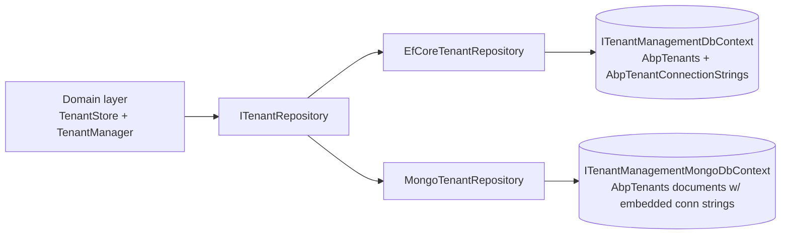

# EF Core & MongoDB Stores

The Tenant Management module ships two repository implementations of `ITenantRepository` so you can keep tenant metadata in either a relational database or a MongoDB collection:

- **`Volo.Abp.TenantManagement.EntityFrameworkCore`** — `EfCoreTenantRepository`, `TenantManagementDbContext`, table mappings.
- **`Volo.Abp.TenantManagement.MongoDB`** — `MongoTenantRepository`, `TenantManagementMongoDbContext`, collection mappings.

Both providers persist exactly the same conceptual data: the `Tenant` aggregate plus its `ConnectionStrings` child collection (see [domain](/modules/tenant-management/domain)).

```
modules/tenant-management/src/Volo.Abp.TenantManagement.EntityFrameworkCore/
└── Volo/Abp/TenantManagement/EntityFrameworkCore/
    ├── AbpTenantManagementDbContextModelCreatingExtensions.cs
    ├── AbpTenantManagementEntityFrameworkCoreModule.cs
    ├── EfCoreTenantRepository.cs
    ├── ITenantManagementDbContext.cs
    ├── TenantManagementDbContext.cs
    └── TenantManagementEfCoreQueryableExtensions.cs

modules/tenant-management/src/Volo.Abp.TenantManagement.MongoDB/
└── Volo/Abp/TenantManagement/MongoDb/
    ├── AbpTenantManagementMongoDbContextExtensions.cs
    ├── AbpTenantManagementMongoDbModule.cs
    ├── ITenantManagementMongoDbContext.cs
    ├── MongoTenantRepository.cs
    └── TenantManagementMongoDbContext.cs
```

## EF Core provider

### `ITenantManagementDbContext`

The module exposes an interface so consumers (and the repository) can depend on **abstractions, not the concrete `DbContext`**, which makes it possible to merge this module's tables into an application's own `DbContext` via the standard ABP pattern.

```csharp
[IgnoreMultiTenancy]
[ConnectionStringName(AbpTenantManagementDbProperties.ConnectionStringName)]
public interface ITenantManagementDbContext : IEfCoreDbContext
{
    DbSet<Tenant> Tenants { get; }
    DbSet<TenantConnectionString> TenantConnectionStrings { get; }
}
```

Two attributes are critical:

<CardGroup cols={2}>
  <Card title="[IgnoreMultiTenancy]" icon="globe">
    Marks the context as host-only — ABP's `IMultiTenant` data filter is *not* applied. Without this, a tenant-scoped request would read zero rows from `Tenants`.
  </Card>
  <Card title="[ConnectionStringName(...)]" icon="plug">
    Binds this context to the logical connection-string name `"AbpTenantManagement"`. The connection-string resolver from [/data/connection-strings](/data/connection-strings) uses this name when picking the actual connection string at runtime.
  </Card>
</CardGroup>

### `TenantManagementDbContext`

```csharp
[IgnoreMultiTenancy]
[ConnectionStringName(AbpTenantManagementDbProperties.ConnectionStringName)]
public class TenantManagementDbContext
    : AbpDbContext<TenantManagementDbContext>, ITenantManagementDbContext
{
    public DbSet<Tenant> Tenants { get; set; }
    public DbSet<TenantConnectionString> TenantConnectionStrings { get; set; }

    public TenantManagementDbContext(DbContextOptions<TenantManagementDbContext> options)
        : base(options)
    {
    }

    protected override void OnModelCreating(ModelBuilder builder)
    {
        base.OnModelCreating(builder);
        builder.ConfigureTenantManagement();
    }
}
```

`base.OnModelCreating` runs ABP's standard conventions (audit columns, soft-delete filter, concurrency tokens). `ConfigureTenantManagement()` then applies the module-specific mappings.

### Model creating extensions

File: `AbpTenantManagementDbContextModelCreatingExtensions.cs`

```csharp
public static class AbpTenantManagementDbContextModelCreatingExtensions
{
    public static void ConfigureTenantManagement(this ModelBuilder builder)
    {
        Check.NotNull(builder, nameof(builder));

        if (builder.IsTenantOnlyDatabase())
        {
            return;
        }

        builder.Entity<Tenant>(b =>
        {
            b.ToTable(AbpTenantManagementDbProperties.DbTablePrefix + "Tenants",
                      AbpTenantManagementDbProperties.DbSchema);

            b.ConfigureByConvention();

            b.Property(t => t.Name).IsRequired().HasMaxLength(TenantConsts.MaxNameLength);
            b.Property(t => t.NormalizedName).IsRequired().HasMaxLength(TenantConsts.MaxNameLength);

            b.HasMany(u => u.ConnectionStrings).WithOne().HasForeignKey(uc => uc.TenantId).IsRequired();

            b.HasIndex(u => u.Name);
            b.HasIndex(u => u.NormalizedName);

            b.ApplyObjectExtensionMappings();
        });

        builder.Entity<TenantConnectionString>(b =>
        {
            b.ToTable(AbpTenantManagementDbProperties.DbTablePrefix + "TenantConnectionStrings",
                      AbpTenantManagementDbProperties.DbSchema);

            b.ConfigureByConvention();

            b.HasKey(x => new { x.TenantId, x.Name });

            b.Property(cs => cs.Name).IsRequired().HasMaxLength(TenantConnectionStringConsts.MaxNameLength);
            b.Property(cs => cs.Value).IsRequired().HasMaxLength(TenantConnectionStringConsts.MaxValueLength);

            b.ApplyObjectExtensionMappings();
        });

        builder.TryConfigureObjectExtensions<TenantManagementDbContext>();
    }
}
```

Key points:

- **Tables**: `AbpTenants` and `AbpTenantConnectionStrings` (the `Abp` prefix comes from `AbpCommonDbProperties.DbTablePrefix`).
- **Composite key** on `TenantConnectionString`: `{ TenantId, Name }` — matches the `GetKeys()` override in the entity ([domain](/modules/tenant-management/domain#tenantconnectionstring-entity)).
- **Indexes** on `Name` and `NormalizedName` make `FindByNameAsync` constant-time.
- **`IsTenantOnlyDatabase()` short-circuit**: in a database-per-tenant setup the tenant's own database does **not** need a copy of the host-side `Tenants` table — this guard prevents EF Core migrations from spuriously creating empty tables in tenant DBs.
- **`ApplyObjectExtensionMappings()`** and **`TryConfigureObjectExtensions<...>()`** wire up any extra columns added through the ABP object-extending system.

### `EfCoreTenantRepository`

File: `EfCoreTenantRepository.cs`

```csharp
public class EfCoreTenantRepository
    : EfCoreRepository<ITenantManagementDbContext, Tenant, Guid>, ITenantRepository
{
    public EfCoreTenantRepository(IDbContextProvider<ITenantManagementDbContext> dbContextProvider)
        : base(dbContextProvider)
    {
    }

    public virtual async Task<Tenant> FindByNameAsync(
        string normalizedName,
        bool includeDetails = true,
        CancellationToken cancellationToken = default)
    {
        return await (await GetDbSetAsync())
            .IncludeDetails(includeDetails)
            .OrderBy(t => t.Id)
            .FirstOrDefaultAsync(t => t.NormalizedName == normalizedName,
                                  GetCancellationToken(cancellationToken));
    }

    public virtual async Task<List<Tenant>> GetListAsync(
        string sorting = null,
        int maxResultCount = int.MaxValue,
        int skipCount = 0,
        string filter = null,
        bool includeDetails = false,
        CancellationToken cancellationToken = default)
    {
        return await (await GetDbSetAsync())
            .IncludeDetails(includeDetails)
            .WhereIf(
                !filter.IsNullOrWhiteSpace(),
                u => u.Name.Contains(filter)
            )
            .OrderBy(sorting.IsNullOrEmpty() ? nameof(Tenant.Name) : sorting)
            .PageBy(skipCount, maxResultCount)
            .ToListAsync(GetCancellationToken(cancellationToken));
    }

    public virtual async Task<long> GetCountAsync(
        string filter = null,
        CancellationToken cancellationToken = default)
    {
        return await (await GetQueryableAsync())
            .WhereIf(
                !filter.IsNullOrWhiteSpace(),
                u => u.Name.Contains(filter)
            ).CountAsync(cancellationToken: GetCancellationToken(cancellationToken));
    }

    public override async Task<IQueryable<Tenant>> WithDetailsAsync()
    {
        return (await GetQueryableAsync()).IncludeDetails();
    }
}
```

A few things to note:

<Steps>
  <Step title="`OrderBy(t => t.Id)` before `FirstOrDefaultAsync`">
    Some database providers (notably SQL Server with `READ_COMMITTED_SNAPSHOT` disabled) do not guarantee a stable row when no `ORDER BY` is supplied. The explicit `OrderBy` ensures `FindByNameAsync` is deterministic.
  </Step>
  <Step title="`IncludeDetails(true)` pulls `ConnectionStrings`">
    See the queryable extension below — it's a single-purpose `Include(x => x.ConnectionStrings)`.
  </Step>
  <Step title="`WhereIf` + `Contains`">
    `WhereIf` is ABP's null-safe conditional `Where`. The `Contains` translates to `LIKE '%filter%'` — for very large tenant lists, consider adding a full-text index or switching to a prefix match (`StartsWith`).
  </Step>
  <Step title="`PageBy(skipCount, maxResultCount)`">
    ABP's helper produces `Skip(skipCount).Take(maxResultCount)` while clamping `maxResultCount > 0`.
  </Step>
</Steps>

### `IncludeDetails`

File: `TenantManagementEfCoreQueryableExtensions.cs`

```csharp
public static class TenantManagementEfCoreQueryableExtensions
{
    public static IQueryable<Tenant> IncludeDetails(this IQueryable<Tenant> queryable, bool include = true)
    {
        if (!include)
        {
            return queryable;
        }

        return queryable.Include(x => x.ConnectionStrings);
    }
}
```

The convention — every aggregate's repository pulls "details" through a `IncludeDetails(bool)` extension — keeps the eager-loading surface explicit. `TenantStore.GetListAsync` passes `false` (no details needed, it just maps `Name` and `Id`), whereas `TenantStore.FindAsync` (single row) ends up at `TenantRepository.FindAsync(...)` and the EF Core change-tracker has already eager-loaded what is needed for mapping.

### EF Core module wiring

File: `AbpTenantManagementEntityFrameworkCoreModule.cs`

```csharp
[DependsOn(typeof(AbpTenantManagementDomainModule))]
[DependsOn(typeof(AbpEntityFrameworkCoreModule))]
public class AbpTenantManagementEntityFrameworkCoreModule : AbpModule
{
    public override void ConfigureServices(ServiceConfigurationContext context)
    {
        context.Services.AddAbpDbContext<TenantManagementDbContext>(options =>
        {
            options.AddDefaultRepositories<ITenantManagementDbContext>();
        });
    }
}
```

`AddDefaultRepositories<ITenantManagementDbContext>()` registers `EfCoreRepository<...>` for every aggregate that is a `DbSet` on the context — *and* discovers the explicit `EfCoreTenantRepository : ITenantRepository` implementation by convention. The result: `ITenantRepository` resolves to `EfCoreTenantRepository` automatically.

### Hosting in your application's DbContext

If you don't want a separate DbContext, merge the tables into your application's main DbContext:

```csharp
public class MyAppDbContext : AbpDbContext<MyAppDbContext>, ITenantManagementDbContext
{
    public DbSet<Tenant> Tenants { get; set; }
    public DbSet<TenantConnectionString> TenantConnectionStrings { get; set; }

    protected override void OnModelCreating(ModelBuilder builder)
    {
        base.OnModelCreating(builder);
        builder.ConfigureTenantManagement();
        // ... your own ConfigureXxx() calls
    }
}
```

Then in your application's EF Core module:

```csharp
context.Services.AddAbpDbContext<MyAppDbContext>(options =>
{
    options.AddDefaultRepositories(includeAllEntities: true);
    options.ReplaceDbContext<ITenantManagementDbContext>();
});
```

`ReplaceDbContext` reroutes every `IDbContextProvider<ITenantManagementDbContext>` request to `MyAppDbContext`, which is what makes `EfCoreTenantRepository` use *your* context.

## MongoDB provider

### `ITenantManagementMongoDbContext`

```csharp
[IgnoreMultiTenancy]
[ConnectionStringName(AbpTenantManagementDbProperties.ConnectionStringName)]
public interface ITenantManagementMongoDbContext : IAbpMongoDbContext
{
    IMongoCollection<Tenant> Tenants { get; }
}
```

The same two attributes (`IgnoreMultiTenancy` + `ConnectionStringName`) as the EF Core context — the multi-tenancy abstraction does not care which provider you're on.

<Note>
The MongoDB provider does **not** expose a separate `TenantConnectionStrings` collection. MongoDB stores the child entities **embedded** inside the `Tenant` document, so they live in the same `AbpTenants` collection.
</Note>

### `TenantManagementMongoDbContext`

```csharp
[IgnoreMultiTenancy]
[ConnectionStringName(AbpTenantManagementDbProperties.ConnectionStringName)]
public class TenantManagementMongoDbContext
    : AbpMongoDbContext, ITenantManagementMongoDbContext
{
    public IMongoCollection<Tenant> Tenants => Collection<Tenant>();

    protected override void CreateModel(IMongoModelBuilder modelBuilder)
    {
        base.CreateModel(modelBuilder);
        modelBuilder.ConfigureTenantManagement();
    }
}
```

### Collection mapping

File: `AbpTenantManagementMongoDbContextExtensions.cs`

```csharp
public static class AbpTenantManagementMongoDbContextExtensions
{
    public static void ConfigureTenantManagement(this IMongoModelBuilder builder)
    {
        Check.NotNull(builder, nameof(builder));

        builder.Entity<Tenant>(b =>
        {
            b.CollectionName = AbpTenantManagementDbProperties.DbTablePrefix + "Tenants";
        });
    }
}
```

That's the entire mapping — `Tenant.ConnectionStrings` is a public CLR property of type `List<TenantConnectionString>`, so MongoDB's BSON serializer embeds the child collection as a sub-document array without any extra configuration.

### `MongoTenantRepository`

```csharp
public class MongoTenantRepository
    : MongoDbRepository<ITenantManagementMongoDbContext, Tenant, Guid>, ITenantRepository
{
    public MongoTenantRepository(IMongoDbContextProvider<ITenantManagementMongoDbContext> dbContextProvider)
        : base(dbContextProvider) { }

    public virtual async Task<Tenant> FindByNameAsync(
        string normalizedName,
        bool includeDetails = true,
        CancellationToken cancellationToken = default)
    {
        return await (await GetQueryableAsync(cancellationToken))
            .FirstOrDefaultAsync(t => t.NormalizedName == normalizedName,
                                 GetCancellationToken(cancellationToken));
    }

    public virtual async Task<List<Tenant>> GetListAsync(
        string sorting = null,
        int maxResultCount = int.MaxValue,
        int skipCount = 0,
        string filter = null,
        bool includeDetails = false,
        CancellationToken cancellationToken = default)
    {
        return await (await GetQueryableAsync(cancellationToken))
            .WhereIf(
                !filter.IsNullOrWhiteSpace(),
                u => u.Name.Contains(filter)
            )
            .OrderBy(sorting.IsNullOrEmpty() ? nameof(Tenant.Name) : sorting)
            .PageBy(skipCount, maxResultCount)
            .ToListAsync(GetCancellationToken(cancellationToken));
    }

    public virtual async Task<long> GetCountAsync(
        string filter = null,
        CancellationToken cancellationToken = default)
    {
        return await (await GetQueryableAsync(cancellationToken))
            .WhereIf(
                !filter.IsNullOrWhiteSpace(),
                u => u.Name.Contains(filter)
            ).CountAsync(cancellationToken: GetCancellationToken(cancellationToken));
    }
}
```

Notice the `includeDetails` parameter is accepted but **ignored** — embedded children are always loaded with the parent document in MongoDB. That is fine: the consumer-side `Tenant.FindConnectionString(name)` does not care whether the data came from a JOIN or an embedded array.

### MongoDB module wiring

```csharp
[DependsOn(
    typeof(AbpTenantManagementDomainModule),
    typeof(AbpMongoDbModule)
    )]
public class AbpTenantManagementMongoDbModule : AbpModule
{
    public override void ConfigureServices(ServiceConfigurationContext context)
    {
        context.Services.AddMongoDbContext<TenantManagementMongoDbContext>(options =>
        {
            options.AddDefaultRepositories<ITenantManagementMongoDbContext>();
            options.AddRepository<Tenant, MongoTenantRepository>();
        });
    }
}
```

The explicit `AddRepository<Tenant, MongoTenantRepository>()` is what binds `ITenantRepository` to the Mongo implementation (rather than letting the default `MongoDbRepository<...>` win the registration race).

## Provider comparison

| Concern | EF Core | MongoDB |
|---|---|---|
| Storage of `TenantConnectionString` | Separate table `AbpTenantConnectionStrings`, FK to `AbpTenants` | Embedded array inside the `AbpTenants` document |
| Composite key on `TenantConnectionString` | `{ TenantId, Name }` | Implicit (array position) |
| `IncludeDetails` semantics | `Include(x => x.ConnectionStrings)` | No-op (always embedded) |
| Schema migrations | EF Core migrations via `dotnet ef …` | No schema; relies on BSON conventions |
| Soft-delete filter | EF Core global filter on `IsDeleted` | ABP `IsDeleted` filter applied via `AbpMongoDbContext` |
| Index on `NormalizedName` | Explicit in `ConfigureTenantManagement` | Create manually via `Tenants.Indexes.CreateOne(...)` |



## Reads vs. ICurrentTenant

Recall from [domain](/modules/tenant-management/domain) that `TenantStore.GetCacheItemAsync` wraps every repository call in `using (CurrentTenant.Change(null))`. Both providers respect this: the `[IgnoreMultiTenancy]` attribute on the contexts means even *without* the `Change(null)` wrap, the providers wouldn't accidentally apply an `IMultiTenant` filter to the `Tenants` table. The wrap is defence in depth, especially for setups where the application's own DbContext (which is **not** `[IgnoreMultiTenancy]`) replaces `ITenantManagementDbContext`.

## Related

- [domain](/modules/tenant-management/domain) — `ITenantRepository` contract and `TenantStore` cache.
- [application](/modules/tenant-management/application) — how `TenantAppService` calls into the repository.
- [/data/connection-strings](/data/connection-strings) — `[ConnectionStringName]` resolution and what `TenantConnectionString.Name` / `.Value` actually do at runtime.
- [/tenancy/overview](/tenancy/overview) — `ICurrentTenant`, `ITenantStore`, and how the rest of the framework consumes this store.
- [/tenancy/tenant-management-module](/tenancy/tenant-management-module) — host-side installation steps including which EF Core / Mongo migration assemblies to reference.
