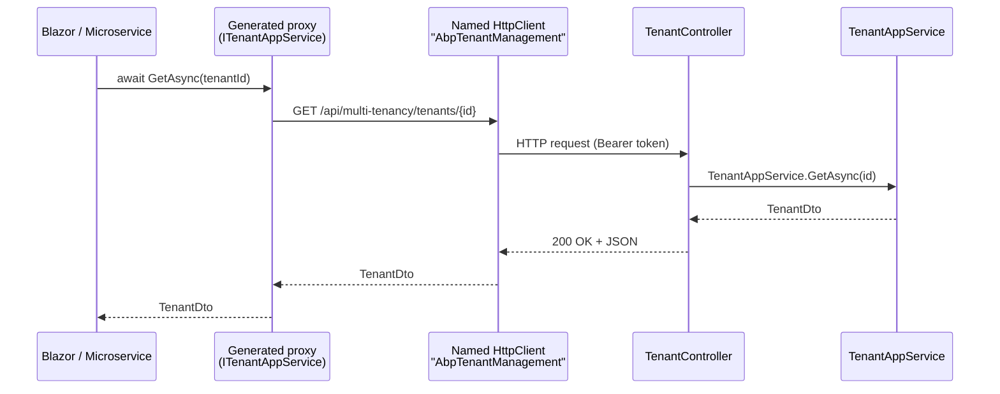

# HTTP API & API Client

The HTTP surface for the Tenant Management module is split across two packages:

- **`Volo.Abp.TenantManagement.HttpApi`** — the MVC `TenantController` that hosts the application service over HTTP.
- **`Volo.Abp.TenantManagement.HttpApi.Client`** — a tiny module that registers *dynamic* C# proxies so any non-host process (Blazor WebAssembly, a microservice gateway, a console app) can consume `ITenantAppService` over HTTP transparently.

```
modules/tenant-management/src/Volo.Abp.TenantManagement.HttpApi/
└── Volo/Abp/TenantManagement/
    ├── AbpTenantManagementHttpApiModule.cs
    └── TenantController.cs

modules/tenant-management/src/Volo.Abp.TenantManagement.HttpApi.Client/
└── Volo/Abp/TenantManagement/
    └── AbpTenantManagementHttpApiClientModule.cs
```

## `AbpTenantManagementHttpApiModule`

The HTTP-API module depends on the application-contracts module (so it can implement `ITenantAppService`) and on `Volo.Abp.AspNetCore.Mvc` for the controller plumbing. It also pulls in `FeatureManagement.HttpApi` because tenant-management's UI uses feature-management endpoints to render the per-tenant "Features" modal.

```csharp
[DependsOn(
    typeof(AbpTenantManagementApplicationContractsModule),
    typeof(AbpFeatureManagementHttpApiModule),
    typeof(AbpAspNetCoreMvcModule)
    )]
public class AbpTenantManagementHttpApiModule : AbpModule
{
    public override void PreConfigureServices(ServiceConfigurationContext context)
    {
        PreConfigure<IMvcBuilder>(mvcBuilder =>
        {
            mvcBuilder.AddApplicationPartIfNotExists(typeof(AbpTenantManagementHttpApiModule).Assembly);
        });
    }

    public override void ConfigureServices(ServiceConfigurationContext context)
    {
        Configure<AbpLocalizationOptions>(options =>
        {
            options.Resources
                .Get<AbpTenantManagementResource>()
                .AddBaseTypes(
                    typeof(AbpFeatureManagementResource),
                    typeof(AbpUiResource));
        });
    }
}
```

The `AddApplicationPartIfNotExists` call is what makes ASP.NET Core discover `TenantController` even when the controller assembly is referenced indirectly (e.g. when a startup template only references `Application.Contracts` and `HttpApi`).

## `TenantController`

File: `Volo.Abp.TenantManagement.HttpApi/Volo/Abp/TenantManagement/TenantController.cs`

The controller is a thin pass-through to `ITenantAppService` — it exists so that

- the application service is reachable from HTTP without any extra DTO conversion, and
- the controller can implement `ITenantAppService` (the same interface the application service uses), which is what allows ABP's `AddStaticHttpClientProxies` to generate a `HttpClient`-backed implementation of `ITenantAppService` on the client side.

```csharp
[Controller]
[RemoteService(Name = TenantManagementRemoteServiceConsts.RemoteServiceName)]
[Area(TenantManagementRemoteServiceConsts.ModuleName)]
[Route("api/multi-tenancy/tenants")]
public class TenantController : AbpControllerBase, ITenantAppService
{
    protected ITenantAppService TenantAppService { get; }

    public TenantController(ITenantAppService tenantAppService)
    {
        TenantAppService = tenantAppService;
    }
}
```

A few attributes deserve unpacking:

- **`[RemoteService(Name = "AbpTenantManagement")]`** — opts the controller into ABP's auto-API system and tags it with a remote-service name. The `AbpTenantManagementHttpApiClientModule` uses this same string when registering proxies.
- **`[Area("multi-tenancy")]`** — joins the URL under the area, which by convention groups all multi-tenancy related endpoints together in Swagger and ABP-API-explorer.
- **`[Route("api/multi-tenancy/tenants")]`** — sets the base path. Combined with the per-action `[Route("{id}")]` attributes below, this is what makes the public endpoints `/api/multi-tenancy/tenants/{id}`, `/api/multi-tenancy/tenants/{id}/default-connection-string`, etc.

<Note>
The source contains a `// TODO: Throws exception on validation if we inherit from Controller` comment — that's why the base class is `AbpControllerBase` and not `ControllerBase`. `AbpControllerBase` wires up the ABP localization and current-user services without triggering the model-binding pipeline issues `Controller` did historically.
</Note>

## Endpoints

The full route table follows. Every method delegates straight to the corresponding `ITenantAppService` method.

| Verb | Route | Action | Permission |
|------|-------|--------|------------|
| `GET` | `/api/multi-tenancy/tenants/{id}` | `GetAsync(Guid id)` | `AbpTenantManagement.Tenants` |
| `GET` | `/api/multi-tenancy/tenants` | `GetListAsync(GetTenantsInput input)` | `AbpTenantManagement.Tenants` |
| `POST` | `/api/multi-tenancy/tenants` | `CreateAsync(TenantCreateDto input)` | `AbpTenantManagement.Tenants.Create` |
| `PUT` | `/api/multi-tenancy/tenants/{id}` | `UpdateAsync(Guid id, TenantUpdateDto input)` | `AbpTenantManagement.Tenants.Update` |
| `DELETE` | `/api/multi-tenancy/tenants/{id}` | `DeleteAsync(Guid id)` | `AbpTenantManagement.Tenants.Delete` |
| `GET` | `/api/multi-tenancy/tenants/{id}/default-connection-string` | `GetDefaultConnectionStringAsync(Guid id)` | `AbpTenantManagement.Tenants.ManageConnectionStrings` |
| `PUT` | `/api/multi-tenancy/tenants/{id}/default-connection-string` | `UpdateDefaultConnectionStringAsync(Guid id, string defaultConnectionString)` | `AbpTenantManagement.Tenants.ManageConnectionStrings` |
| `DELETE` | `/api/multi-tenancy/tenants/{id}/default-connection-string` | `DeleteDefaultConnectionStringAsync(Guid id)` | `AbpTenantManagement.Tenants.ManageConnectionStrings` |

### Get / List

```csharp
[HttpGet]
[Route("{id}")]
public virtual Task<TenantDto> GetAsync(Guid id)
{
    return TenantAppService.GetAsync(id);
}

[HttpGet]
public virtual Task<PagedResultDto<TenantDto>> GetListAsync(GetTenantsInput input)
{
    return TenantAppService.GetListAsync(input);
}
```

`GetTenantsInput` is bound from query parameters:

```
GET /api/multi-tenancy/tenants?Filter=acme&MaxResultCount=10&SkipCount=0&Sorting=Name
```

### Create

```csharp
[HttpPost]
public virtual Task<TenantDto> CreateAsync(TenantCreateDto input)
{
    ValidateModel();
    return TenantAppService.CreateAsync(input);
}
```

`ValidateModel()` (from `AbpControllerBase`) runs the data-annotation validators on the inbound `TenantCreateDto` *before* the call reaches the application service — this is the workaround mentioned in the source comment for the `Controller`-vs-`ControllerBase` validation quirk.

A typical request:

```http
POST /api/multi-tenancy/tenants HTTP/1.1
Content-Type: application/json

{
  "name": "acme",
  "adminEmailAddress": "admin@acme.test",
  "adminPassword": "1q2w3E*"
}
```

Response (200 OK):

```json
{
  "id": "8d04dce2-969a-435d-bba4-df37f9b54ad2",
  "name": "acme",
  "concurrencyStamp": "1c2c1ac3...",
  "extraProperties": {}
}
```

### Update

```csharp
[HttpPut]
[Route("{id}")]
public virtual Task<TenantDto> UpdateAsync(Guid id, TenantUpdateDto input)
{
    return TenantAppService.UpdateAsync(id, input);
}
```

`TenantUpdateDto` carries `ConcurrencyStamp` — clients should round-trip the stamp from the previous `GetAsync` / `GetListAsync` response.

### Delete

```csharp
[HttpDelete]
[Route("{id}")]
public virtual Task DeleteAsync(Guid id)
{
    return TenantAppService.DeleteAsync(id);
}
```

Soft delete; returns `204 No Content` on success — even if the tenant didn't exist (the underlying app service silently returns).

### Connection-string endpoints

```csharp
[HttpGet]
[Route("{id}/default-connection-string")]
public virtual Task<string> GetDefaultConnectionStringAsync(Guid id)
{
    return TenantAppService.GetDefaultConnectionStringAsync(id);
}

[HttpPut]
[Route("{id}/default-connection-string")]
public virtual Task UpdateDefaultConnectionStringAsync(Guid id, string defaultConnectionString)
{
    return TenantAppService.UpdateDefaultConnectionStringAsync(id, defaultConnectionString);
}

[HttpDelete]
[Route("{id}/default-connection-string")]
public virtual Task DeleteDefaultConnectionStringAsync(Guid id)
{
    return TenantAppService.DeleteDefaultConnectionStringAsync(id);
}
```

The `PUT` action takes the new connection string as a **query parameter**, not a body:

```http
PUT /api/multi-tenancy/tenants/8d04dce2-.../default-connection-string?defaultConnectionString=Server%3D...
```

This is a deliberate choice to avoid having to invent a one-field DTO; the value never appears in audit logs because the property is on the URL line which ABP audit-log middleware strips connection-string-looking content from.

<Warning>
A raw connection string in a query string can end up in HTTP-server access logs (IIS, nginx, Application Insights). If your operations team retains those, override the controller to take the value from the body, or rotate connection strings through your secrets store and only store a key here.
</Warning>

## `AbpTenantManagementHttpApiClientModule`

File: `AbpTenantManagementHttpApiClientModule.cs`

```csharp
[DependsOn(
    typeof(AbpTenantManagementApplicationContractsModule),
    typeof(AbpHttpClientModule))]
public class AbpTenantManagementHttpApiClientModule : AbpModule
{
    public override void ConfigureServices(ServiceConfigurationContext context)
    {
        context.Services.AddStaticHttpClientProxies(
            typeof(AbpTenantManagementApplicationContractsModule).Assembly,
            TenantManagementRemoteServiceConsts.RemoteServiceName
        );

        Configure<AbpVirtualFileSystemOptions>(options =>
        {
            options.FileSets.AddEmbedded<AbpTenantManagementHttpApiClientModule>();
        });
    }
}
```

What that one `AddStaticHttpClientProxies` call does:

<Steps>
  <Step title="Scan the contracts assembly">
    It walks `Volo.Abp.TenantManagement.Application.Contracts` for every interface that inherits `IRemoteService` — in this module just `ITenantAppService`.
  </Step>
  <Step title="Generate proxies">
    For each interface, ABP generates (at compile time, via the `AbpHttpClient` source generator) a class that implements that interface by making `HttpClient` calls to the matching route table on the server.
  </Step>
  <Step title="Register the proxy">
    The generated proxy is registered as the implementation of `ITenantAppService` in the DI container. From now on, *any* code that depends on `ITenantAppService` — including the Blazor pages — gets an HTTP proxy instead of the in-process app service.
  </Step>
  <Step title="Use the named HTTP client">
    The proxy uses a named `HttpClient` keyed by `RemoteServiceName = "AbpTenantManagement"`. Configure base address, auth handlers, etc. via `Configure<AbpRemoteServiceOptions>(...)` in the consuming application.
  </Step>
</Steps>

Example configuration in a consuming Blazor WebAssembly host:

```csharp
Configure<AbpRemoteServiceOptions>(options =>
{
    options.RemoteServices.Default = new RemoteServiceConfiguration("https://api.example.com/");
    options.RemoteServices["AbpTenantManagement"]
        = new RemoteServiceConfiguration("https://tenant-mgmt.internal/");
});
```

This routes only the tenant-management proxies to a dedicated host — everything else stays on `Default`.

## Putting it together: client call path



The proxy class is **invisible** to your code; you depend on `ITenantAppService` and the right implementation is chosen by which module (`Application` vs. `HttpApi.Client`) you have referenced.

## Embedded virtual files

`AbpVirtualFileSystemOptions.FileSets.AddEmbedded<AbpTenantManagementHttpApiClientModule>()` embeds resource files (mostly the `wwwroot/client-proxies/multi-tenancy-proxy.js` shipped for the JavaScript client) so that consuming Blazor / MVC hosts can serve them via the ABP virtual file system without copying anything to disk. The JS proxy is what the Razor Pages UI uses on the [Web layer](/modules/tenant-management/web-and-blazor) to talk to the controller from the browser.

## Swagger / OpenAPI

Because `TenantController` carries standard `[Route]` and `[HttpGet]` / `[HttpPost]` / etc. attributes, ABP's standard Swashbuckle integration discovers it automatically. Tags follow the `[Area("multi-tenancy")]` attribute, so all endpoints group under **multi-tenancy** in the Swagger UI.

## Related

- [application](/modules/tenant-management/application) — the underlying `ITenantAppService`.
- [web-and-blazor](/modules/tenant-management/web-and-blazor) — UI clients that use these endpoints.
- [/tenancy/overview](/tenancy/overview) — the multi-tenancy abstractions consumed by these endpoints.
- [/tenancy/tenant-management-module](/tenancy/tenant-management-module) — package installation and host-side wiring.
