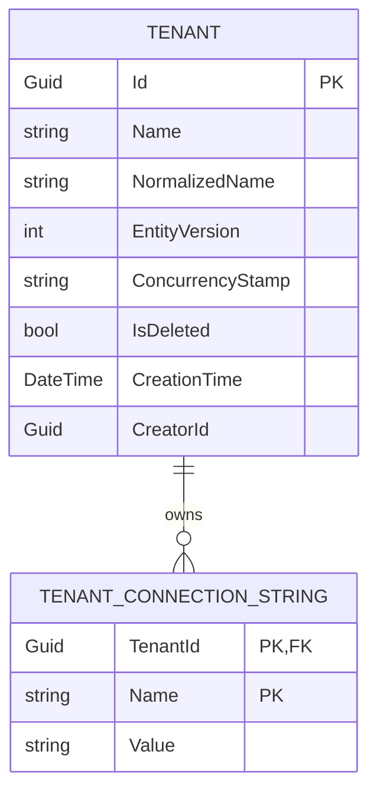
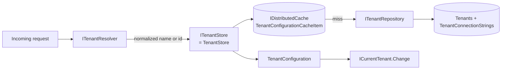
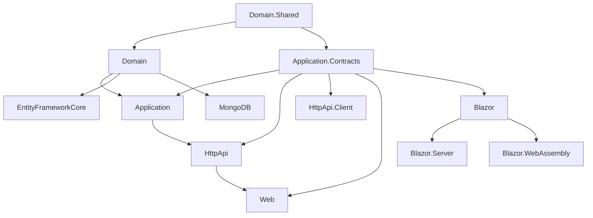
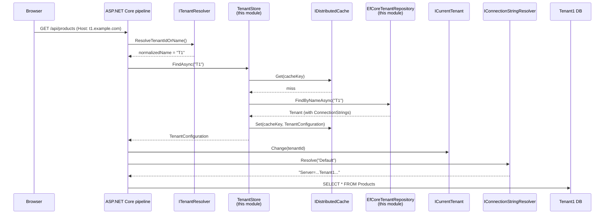

# Overview

The **Tenant Management** module is a ready-to-use, pre-built ABP module that adds a database-backed `Tenant` aggregate, an `ITenantStore` implementation, and an admin UI for creating / updating / deleting tenants and managing their per-tenant **connection strings**.

It sits on top of the `Volo.Abp.MultiTenancy` abstractions (see [/tenancy/overview](/tenancy/overview)). Where `Volo.Abp.MultiTenancy` defines *what* a tenant is (`ITenant`, `ICurrentTenant`, `ITenantStore`, `ITenantResolver`), this module provides *where the tenants come from* — a relational/document store plus the CRUD plumbing around it.

<Info>
If you are looking for end-user setup (NuGet packages, module dependencies, UI screenshots), see the dedicated guide at [/tenancy/tenant-management-module](/tenancy/tenant-management-module). This section documents the internals of each layer.
</Info>

## What the module provides

<CardGroup cols={2}>
  <Card title="Tenant aggregate" icon="building" href="/modules/tenant-management/domain">
    `Tenant` full-audited aggregate root with `Name`, `NormalizedName`, `EntityVersion`, and a child `ConnectionStrings` collection.
  </Card>
  <Card title="ITenantStore implementation" icon="database" href="/modules/tenant-management/domain">
    `TenantStore` reads tenants from `ITenantRepository`, maps them to `TenantConfiguration`, and caches them in a distributed cache.
  </Card>
  <Card title="Application services" icon="layer-group" href="/modules/tenant-management/application">
    `TenantAppService` exposes `Create / Update / Delete / GetList / GetById` plus default-connection-string operations.
  </Card>
  <Card title="HTTP API" icon="cloud" href="/modules/tenant-management/http-api">
    `TenantController` publishes the application service under `/api/multi-tenancy/tenants`.
  </Card>
  <Card title="Web & Blazor UI" icon="window" href="/modules/tenant-management/web-and-blazor">
    Razor Pages and Blazor components for listing and editing tenants, plus a connection-strings modal.
  </Card>
  <Card title="EF Core & MongoDB" icon="server" href="/modules/tenant-management/efcore-mongodb">
    `EfCoreTenantRepository` and `MongoTenantRepository` ship with the module.
  </Card>
</CardGroup>

## Source layout

The module lives under `modules/tenant-management/src/` in the ABP repository. It follows the standard ABP DDD layering:

```
modules/tenant-management/src/
├── Volo.Abp.TenantManagement.Domain.Shared/        # Constants, ETOs, localization
├── Volo.Abp.TenantManagement.Domain/                # Tenant aggregate, TenantManager, TenantStore
├── Volo.Abp.TenantManagement.Application.Contracts/ # DTOs, ITenantAppService, permissions
├── Volo.Abp.TenantManagement.Application/           # TenantAppService
├── Volo.Abp.TenantManagement.HttpApi/               # TenantController
├── Volo.Abp.TenantManagement.HttpApi.Client/        # Dynamic C# proxies
├── Volo.Abp.TenantManagement.Web/                   # Razor Pages UI
├── Volo.Abp.TenantManagement.Blazor/                # Blazor Server / WASM UI
├── Volo.Abp.TenantManagement.Blazor.Server/         # Server-side host integration
├── Volo.Abp.TenantManagement.Blazor.WebAssembly/    # WASM host integration
├── Volo.Abp.TenantManagement.EntityFrameworkCore/   # EfCoreTenantRepository
├── Volo.Abp.TenantManagement.MongoDB/               # MongoTenantRepository
└── Volo.Abp.TenantManagement.Installer/             # `abp add-module` installer
```

## Conceptual model

The `Tenant` aggregate composes a value-object-like child entity, `TenantConnectionString`, whose `Name` field is keyed against the well-known constants in [`Volo.Abp.Data.ConnectionStrings`](/data/connection-strings) — the default one being `"Default"`.



The `Name` portion of the composite key on `TenantConnectionString` is **either** `"Default"` (the default connection string used by every `IDbContext` / `IMongoDbContext` for that tenant) **or** a logical connection-string-name registered by a feature module (for example, `"AbpAuditLogging"`, `"AbpIdentity"`, …). See [/data/connection-strings](/data/connection-strings) for how ABP picks the right connection string at runtime.

## How `TenantStore` plugs into the multi-tenancy pipeline

`Volo.Abp.MultiTenancy` ships an `ITenantStore` abstraction with a default in-memory implementation. When you add **Tenant Management** to your solution, its `TenantStore` overrides that registration — every tenant resolver in the request pipeline now looks up tenants from your database via `ITenantRepository`, with a `IDistributedCache<TenantConfigurationCacheItem>` in front to avoid hitting the DB on every request.



When a tenant is **created**, **updated**, or **deleted** the application service emits both a local `TenantChangedEvent` (to invalidate the cache and any in-memory state) and a distributed `TenantCreatedEto` so other microservices can react. See [domain](/modules/tenant-management/domain) for the full event catalogue.

## Module dependency graph



Every package transitively pulls in `Volo.Abp.MultiTenancy.Abstractions` so that `Tenant` ↔ `TenantConfiguration` mapping (via Mapperly) is available everywhere.

## Permissions

The module defines a single permission group, `AbpTenantManagement`, with one root permission, `AbpTenantManagement.Tenants`, and four child permissions:

| Constant | Permission |
|----------|------------|
| `TenantManagementPermissions.Tenants.Default` | `AbpTenantManagement.Tenants` |
| `TenantManagementPermissions.Tenants.Create` | `AbpTenantManagement.Tenants.Create` |
| `TenantManagementPermissions.Tenants.Update` | `AbpTenantManagement.Tenants.Update` |
| `TenantManagementPermissions.Tenants.Delete` | `AbpTenantManagement.Tenants.Delete` |
| `TenantManagementPermissions.Tenants.ManageFeatures` | `AbpTenantManagement.Tenants.ManageFeatures` |
| `TenantManagementPermissions.Tenants.ManageConnectionStrings` | `AbpTenantManagement.Tenants.ManageConnectionStrings` |

These are declared in `TenantManagementPermissions.cs` and registered by `AbpTenantManagementPermissionDefinitionProvider`. The full source lives at `modules/tenant-management/src/Volo.Abp.TenantManagement.Application.Contracts/Volo/Abp/TenantManagement/TenantManagementPermissions.cs`.

## Remote service constants

```csharp
// modules/tenant-management/src/Volo.Abp.TenantManagement.Application.Contracts/
//   Volo/Abp/TenantManagement/TenantManagementRemoteServiceConsts.cs
public class TenantManagementRemoteServiceConsts
{
    public const string RemoteServiceName = "AbpTenantManagement";
    public const string ModuleName = "multi-tenancy";
}
```

`RemoteServiceName` is used by `AbpTenantManagementHttpApiClientModule` when it calls `AddStaticHttpClientProxies(...)`; `ModuleName` becomes the MVC `[Area(...)]` segment on `TenantController`, which is why every endpoint is mounted under `/api/multi-tenancy/tenants/...`.

## Distributed event surface

The module raises three distributed ETOs (defined in `Volo.Abp.MultiTenancy.Abstractions` and re-emitted here):

<Tabs>
  <Tab title="TenantCreatedEto">
    Published from `TenantAppService.CreateAsync` after the tenant row is committed. Used downstream by `IdentityPro`, `Saas`, `AuditLogging`, etc. to seed per-tenant data.
  </Tab>
  <Tab title="TenantUpdatedEto / TenantChangedEvent">
    `TenantChangedEvent` is a *local* event used inside the host process to invalidate the `TenantConfigurationCacheItem` cache. A distributed counterpart (`TenantUpdatedEto`) is dispatched by ABP's standard `EntityChangeEventHelper` for auditing.
  </Tab>
  <Tab title="TenantDeletedEto">
    Dispatched automatically by ABP's distributed-entity-event subsystem on `DeleteAsync`. Consumers should drop tenant-scoped caches and feature values.
  </Tab>
</Tabs>

The list of event types is enumerated in detail in [domain](/modules/tenant-management/domain#distributed-events).

## When to use this module vs. roll-your-own

<AccordionGroup>
  <Accordion title="You already use ABP and want SaaS / multi-tenancy">
    Use this module. It is the canonical implementation that wires straight into `ICurrentTenant`, `IDataFilter<IMultiTenant>`, `IConnectionStringResolver`, and the Feature Management module.
  </Accordion>
  <Accordion title="You want to read tenants from an external system (Auth0, internal API)">
    Don't use this module. Implement `ITenantStore` directly in your application — see [/tenancy/overview](/tenancy/overview) for the required signature and contract.
  </Accordion>
  <Accordion title="You want database-per-tenant with sharding logic">
    Use this module. The `TenantConnectionString` child entity is exactly the integration point — combine it with `IConnectionStringResolver` from [/data/connection-strings](/data/connection-strings) to route each tenant to a different physical database.
  </Accordion>
</AccordionGroup>

## Lifecycle of a request

This section traces a single tenant-scoped HTTP request from the wire all the way to a tenant-specific database connection. Most of the boxes are not part of this module — they live in `Volo.Abp.MultiTenancy` and `Volo.Abp.Data`. The Tenant Management module contributes exactly two of them: `TenantStore` and `EfCoreTenantRepository` (or `MongoTenantRepository`).



The two boxes contributed by this module are `TenantStore` (which calls `Repo`) and `EfCoreTenantRepository` (or its Mongo cousin). Everything else lives in `Volo.Abp.MultiTenancy.Abstractions`, `Volo.Abp.MultiTenancy`, `Volo.Abp.AspNetCore.MultiTenancy`, and `Volo.Abp.Data`.

## What this module does **not** do

<AccordionGroup>
  <Accordion title="Tenant resolution from the request">
    Resolution (host header → tenant id, JWT claim → tenant id, query string → tenant id, …) lives in `Volo.Abp.AspNetCore.MultiTenancy` via `ITenantResolveContributor`. The module here only answers *"given a normalized name, what is the configuration?"*. See [/tenancy/overview](/tenancy/overview) for the resolver pipeline.
  </Accordion>
  <Accordion title="Per-tenant feature management">
    Feature values are stored by the `Volo.Abp.FeatureManagement` module. Tenant Management depends on it transitively (the UI shows a **Features** button per row) but does not own the storage.
  </Accordion>
  <Accordion title="Database creation / migration when a tenant is created">
    `TenantAppService.CreateAsync` publishes a `TenantCreatedEto` but does **not** create or migrate the per-tenant database. You wire that up via a distributed event handler — typically running EF Core migrations against the new tenant's connection string.
  </Accordion>
  <Accordion title="Tenant impersonation">
    Impersonation ("log in as tenant X without leaving the host UI") is provided by `Volo.Abp.AccountPro` / `Volo.Abp.IdentityPro`. It works *with* this module but is implemented elsewhere.
  </Accordion>
</AccordionGroup>

## Caching strategy at a glance

`TenantStore` sits behind every request that needs to know about a tenant — that's potentially **every** request. Without caching, even a small SaaS app would hammer the tenants table thousands of times per minute. The store therefore wraps each repository read in a distributed cache:

| Cache type | Key | TTL |
|---|---|---|
| `IDistributedCache<TenantConfigurationCacheItem>` | `TenantConfigurationCacheItem.CalculateCacheKey(id, normalizedName)` | Sliding, set by `AbpDistributedCacheOptions` |

Invalidation is event-driven, not TTL-driven:

- `TenantManager.ChangeNameAsync` publishes a local `TenantChangedEvent` **before** mutating the aggregate.
- `TenantConfigurationCacheItemInvalidator` subscribes and evicts the entry.
- Connection-string changes from `TenantAppService.UpdateDefaultConnectionStringAsync` raise the same event.

If you operate a Redis-backed `IDistributedCache` across multiple host instances, all of them are invalidated transparently because the underlying cache is shared.

## Multi-tenancy side: host-only

Every permission in this module is declared `multiTenancySide: MultiTenancySides.Host`. That means even if you grant `AbpTenantManagement.Tenants.Create` to a role inside a tenant, ABP's permission checker will deny the operation at request time. The model is deliberate: **tenants are not allowed to create other tenants**. If you need a "reseller can onboard sub-tenants" flow, you need a different domain model — typically a separate `Reseller` aggregate in your own module that calls `ITenantAppService` from a host-bound background job.

## Configuration knobs

The module exposes very few options because most behaviour is determined by lower-level abstractions (`AbpDataOptions`, `AbpDistributedCacheOptions`, `AbpMultiTenancyOptions`). The ones you can tweak directly:

| Option | Where | Default |
|---|---|---|
| `TenantConsts.MaxNameLength` | `Domain.Shared` | `64` |
| `TenantConsts.MaxPasswordLength` | `Domain.Shared` | `128` |
| `TenantConsts.MaxAdminEmailAddressLength` | `Domain.Shared` | `256` |
| `TenantConnectionStringConsts.MaxNameLength` | `Domain.Shared` | `64` |
| `TenantConnectionStringConsts.MaxValueLength` | `Domain.Shared` | `1024` |
| `AbpTenantManagementDbProperties.DbTablePrefix` | `Domain` | `AbpCommonDbProperties.DbTablePrefix` (`"Abp"`) |
| `AbpTenantManagementDbProperties.DbSchema` | `Domain` | `AbpCommonDbProperties.DbSchema` |
| `AbpTenantManagementDbProperties.ConnectionStringName` | `Domain` | `"AbpTenantManagement"` |

All `Max*Length` properties are `static set;` — so the right place to override them is in your module's `PreConfigureServices`, before any `DbContext` model-building runs.

```csharp
public override void PreConfigureServices(ServiceConfigurationContext context)
{
    TenantConsts.MaxNameLength = 128;
    TenantConsts.MaxAdminEmailAddressLength = 320; // RFC 5321 maximum
}
```

## Extension points

Most of the module's collaborators are interface-based, so you can swap them out service-by-service through standard ABP DI:

<CardGroup cols={2}>
  <Card title="Replace ITenantStore" icon="rotate">
    `TenantStore` is `[ITransientDependency]`. Register your own `ITenantStore` (e.g. one that reads from an external HR system) with a higher precedence to override.
  </Card>
  <Card title="Replace ITenantRepository" icon="database">
    Swap in a hand-tuned implementation if you need bespoke read patterns (e.g. partitioned queries against a sharded SQL Server). Keep `EfCoreTenantRepository` or `MongoTenantRepository` as a base class to inherit the boilerplate.
  </Card>
  <Card title="Replace ITenantValidator" icon="shield-check">
    `AbpTenantValidator` enforces non-empty name + uniqueness. Add character whitelists, reserved-name lists, or DNS lookups by overriding.
  </Card>
  <Card title="Object-extending Tenant" icon="puzzle-piece">
    Add custom fields (`Region`, `SubscriptionTier`, …) to `Tenant` via `ObjectExtensionManager`. The DB column, DTO property, validator, and UI field appear with no manual plumbing. See [/data/connection-strings](/data/connection-strings) for the extending API.
  </Card>
</CardGroup>

## Related reading

- [/tenancy/overview](/tenancy/overview) — `ICurrentTenant`, `ITenantStore`, `ITenantResolver` from the abstractions package.
- [/tenancy/tenant-management-module](/tenancy/tenant-management-module) — end-user setup guide.
- [/data/connection-strings](/data/connection-strings) — how ABP resolves connection strings (and why the `Name` field on `TenantConnectionString` matters).
- [domain](/modules/tenant-management/domain), [application](/modules/tenant-management/application), [http-api](/modules/tenant-management/http-api), [web-and-blazor](/modules/tenant-management/web-and-blazor), [efcore-mongodb](/modules/tenant-management/efcore-mongodb) — layer-by-layer source walkthrough.
