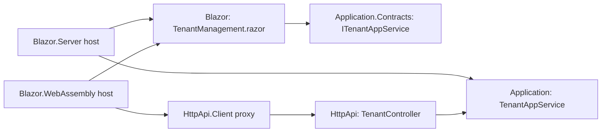

# Web & Blazor UI

The Tenant Management module ships UI in four flavours:

- **`Volo.Abp.TenantManagement.Web`** — MVC / Razor Pages with the ABP Bootstrap theme.
- **`Volo.Abp.TenantManagement.Blazor`** — Blazorise-based components, shared by both Server and WASM.
- **`Volo.Abp.TenantManagement.Blazor.Server`** — host glue for Blazor Server.
- **`Volo.Abp.TenantManagement.Blazor.WebAssembly`** — host glue for Blazor WebAssembly.

```
modules/tenant-management/src/
├── Volo.Abp.TenantManagement.Web/
│   ├── AbpTenantManagementWebModule.cs
│   ├── Navigation/
│   │   ├── AbpTenantManagementWebMainMenuContributor.cs
│   │   └── TenantManagementMenuNames.cs
│   ├── Pages/TenantManagement/
│   │   ├── _ViewImports.cshtml
│   │   └── Tenants/
│   │       ├── CreateModal.cshtml(.cs)
│   │       ├── EditModal.cshtml(.cs)
│   │       ├── Index.cshtml(.cs)
│   │       ├── Index.js
│   │       ├── Create.js
│   │       └── TenantManagementPageModel.cs
│   └── wwwroot/client-proxies/multi-tenancy-proxy.js
├── Volo.Abp.TenantManagement.Blazor/
│   ├── _Imports.razor
│   └── Pages/TenantManagement/
│       ├── TenantManagement.razor
│       └── TenantManagement.razor.cs
├── Volo.Abp.TenantManagement.Blazor.Server/
└── Volo.Abp.TenantManagement.Blazor.WebAssembly/
```

## MVC / Razor Pages

### `AbpTenantManagementWebModule`

The module depends on the application-contracts (for DTOs and the service interface), Feature Management's Web module (to host the per-tenant features modal), and `Volo.Abp.Mapperly`:

```csharp
[DependsOn(typeof(AbpTenantManagementApplicationContractsModule))]
[DependsOn(typeof(AbpAspNetCoreMvcUiBootstrapModule))]
[DependsOn(typeof(AbpFeatureManagementWebModule))]
[DependsOn(typeof(AbpMapperlyModule))]
public class AbpTenantManagementWebModule : AbpModule
{
    public override void PreConfigureServices(ServiceConfigurationContext context)
    {
        context.Services.PreConfigure<AbpMvcDataAnnotationsLocalizationOptions>(options =>
        {
            options.AddAssemblyResource(
                typeof(AbpTenantManagementResource),
                typeof(AbpTenantManagementWebModule).Assembly,
                typeof(AbpTenantManagementApplicationContractsModule).Assembly
            );
        });
        // ...
    }
}
```

This wires the `AbpTenantManagementResource` into MVC's `DataAnnotationsLocalization` system so that `[Required]` / `[EmailAddress]` validators on `TenantCreateDto.AdminEmailAddress` produce localized error messages.

### Main menu contributor

File: `Navigation/AbpTenantManagementWebMainMenuContributor.cs`

```csharp
public class AbpTenantManagementWebMainMenuContributor : IMenuContributor
{
    public virtual Task ConfigureMenuAsync(MenuConfigurationContext context)
    {
        if (context.Menu.Name != StandardMenus.Main)
        {
            return Task.CompletedTask;
        }

        var administrationMenu = context.Menu.GetAdministration();
        var l = context.GetLocalizer<AbpTenantManagementResource>();

        var tenantManagementMenuItem = new ApplicationMenuItem(
            TenantManagementMenuNames.GroupName,
            l["Menu:TenantManagement"],
            icon: "fa fa-users");
        administrationMenu.AddItem(tenantManagementMenuItem);

        tenantManagementMenuItem.AddItem(new ApplicationMenuItem(
            TenantManagementMenuNames.Tenants,
            l["Tenants"],
            url: "~/TenantManagement/Tenants")
            .RequirePermissions(TenantManagementPermissions.Tenants.Default));

        return Task.CompletedTask;
    }
}
```

The "Tenants" item is hung under the standard **Administration** menu. `RequirePermissions(...Default)` hides the entry from users who lack `AbpTenantManagement.Tenants` — but a host-side admin who has been granted only `ManageFeatures` will still see it (the parent permission grants visibility).

### `TenantManagementPageModel` base

```csharp
public abstract class TenantManagementPageModel : AbpPageModel
{
    public TenantManagementPageModel()
    {
        ObjectMapperContext = typeof(AbpTenantManagementWebModule);
    }
}
```

Every Razor Page in the module inherits this so that the auto-mapped `TenantInfoModel <-> TenantCreateDto / TenantUpdateDto` Mapperly registration resolves out of the `Web` module.

### `Index` page

```csharp
public class IndexModel : TenantManagementPageModel
{
    public virtual Task<IActionResult> OnGetAsync()
    {
        return Task.FromResult<IActionResult>(Page());
    }

    public virtual Task<IActionResult> OnPostAsync()
    {
        return Task.FromResult<IActionResult>(Page());
    }
}
```

The C# is a no-op — *everything* is rendered by JavaScript using ABP's DataTables wrapper. The `.cshtml` is just a card with an `<abp-table>`:

```cshtml
@page
@model IndexModel
@inject IHtmlLocalizer<AbpTenantManagementResource> L
@inject IPageLayout PageLayout
@{
    PageLayout.Content.Title = L["Tenants"].Value;
    PageLayout.Content.BreadCrumb.Add(LUiNavigation["Menu:Administration"].Value);
    PageLayout.Content.BreadCrumb.Add(L["Menu:TenantManagement"].Value);
    PageLayout.Content.MenuItemName = TenantManagementMenuNames.Tenants;
}
@section scripts {
    <abp-script-bundle name="@typeof(IndexModel).FullName">
        <abp-script src="/client-proxies/multi-tenancy-proxy.js" />
        <abp-script src="/Pages/FeatureManagement/feature-management-modal.js"/>
        <abp-script src="/Pages/TenantManagement/Tenants/Index.js" />
        <abp-script src="/Pages/TenantManagement/Tenants/Create.js" />
    </abp-script-bundle>
}
<abp-card id="TenantsWrapper">
    <abp-card-body>
        <abp-table class="nowrap"></abp-table>
    </abp-card-body>
</abp-card>
```

`multi-tenancy-proxy.js` is the auto-generated JS proxy that mirrors `TenantController` route by route — it gives the client `volo.abp.tenantManagement.tenant.delete(id)`, `…getList(...)`, etc. It is served from the embedded virtual file system declared in [http-api](/modules/tenant-management/http-api).

### `Index.js` — actions + columns

The DataTable rows are wired up entirely through ABP's extensibility system:

```js
var l = abp.localization.getResource('AbpTenantManagement');
var _tenantAppService = volo.abp.tenantManagement.tenant;

var _editModal     = new abp.ModalManager(abp.appPath + 'TenantManagement/Tenants/EditModal');
var _createModal   = new abp.ModalManager(abp.appPath + 'TenantManagement/Tenants/CreateModal');
var _featuresModal = new abp.ModalManager(abp.appPath + 'FeatureManagement/FeatureManagementModal');

abp.ui.extensions.entityActions.get('tenantManagement.tenant').addContributor(
    function (actionList) {
        return actionList.addManyTail([
            { text: l('Edit'),     visible: abp.auth.isGranted('AbpTenantManagement.Tenants.Update'),
              action: function (data) { _editModal.open({ id: data.record.id }); } },
            { text: l('Features'), visible: abp.auth.isGranted('AbpTenantManagement.Tenants.ManageFeatures'),
              action: function (data) {
                  _featuresModal.open({ providerName: 'T',
                                        providerKey: data.record.id,
                                        providerKeyDisplayName: data.record.name });
              } },
            { text: l('Delete'),   visible: abp.auth.isGranted('AbpTenantManagement.Tenants.Delete'),
              confirmMessage: function (data) {
                  return l('TenantDeletionConfirmationMessage', data.record.name);
              },
              action: function (data) {
                  _tenantAppService.delete(data.record.id).then(function () {
                      _dataTable.ajax.reloadEx();
                      abp.notify.success(l('DeletedSuccessfully'));
                  });
              } }
        ]);
    }
);
```

Custom modules can register their own contributors to inject extra row actions (for example, an "Impersonate" action shipped by `LeptonX`).

### `CreateModal` — TenantInfoModel

File: `CreateModal.cshtml.cs`

```csharp
public class CreateModalModel : TenantManagementPageModel
{
    [BindProperty]
    public TenantInfoModel Tenant { get; set; }

    protected ITenantAppService TenantAppService { get; }

    public CreateModalModel(ITenantAppService tenantAppService)
        => TenantAppService = tenantAppService;

    public virtual Task<IActionResult> OnGetAsync()
    {
        Tenant = new TenantInfoModel();
        return Task.FromResult<IActionResult>(Page());
    }

    public virtual async Task<IActionResult> OnPostAsync()
    {
        ValidateModel();

        var input = ObjectMapper.Map<TenantInfoModel, TenantCreateDto>(Tenant);
        await TenantAppService.CreateAsync(input);

        return NoContent();
    }

    public class TenantInfoModel : ExtensibleObject
    {
        [Required]
        [DynamicStringLength(typeof(TenantConsts), nameof(TenantConsts.MaxNameLength))]
        [Display(Name = "DisplayName:TenantName")]
        public string Name { get; set; }

        [Required]
        [EmailAddress]
        [DynamicStringLength(typeof(TenantConsts), nameof(TenantConsts.MaxAdminEmailAddressLength))]
        public string AdminEmailAddress { get; set; }

        [Required]
        [DataType(DataType.Password)]
        [DynamicStringLength(typeof(TenantConsts), nameof(TenantConsts.MaxPasswordLength))]
        public string AdminPassword { get; set; }
    }
}
```

The inner `TenantInfoModel` is **not** the DTO from the application contract — it is the view-model bound to the form. The `ObjectMapper` (Mapperly) maps it to `TenantCreateDto` on submit.

### `EditModal`

```csharp
public class EditModalModel : TenantManagementPageModel
{
    [BindProperty]
    public TenantInfoModel Tenant { get; set; }

    protected ITenantAppService TenantAppService { get; }

    public EditModalModel(ITenantAppService tenantAppService)
        => TenantAppService = tenantAppService;

    public virtual async Task<IActionResult> OnGetAsync(Guid id)
    {
        Tenant = ObjectMapper.Map<TenantDto, TenantInfoModel>(
            await TenantAppService.GetAsync(id)
        );
        return Page();
    }

    public virtual async Task<IActionResult> OnPostAsync()
    {
        ValidateModel();

        var input = ObjectMapper.Map<TenantInfoModel, TenantUpdateDto>(Tenant);
        await TenantAppService.UpdateAsync(Tenant.Id, input);

        return NoContent();
    }

    public class TenantInfoModel : ExtensibleObject, IHasConcurrencyStamp
    {
        [HiddenInput]
        public Guid Id { get; set; }

        [Required]
        [DynamicStringLength(typeof(TenantConsts), nameof(TenantConsts.MaxNameLength))]
        [Display(Name = "DisplayName:TenantName")]
        public string Name { get; set; }

        [HiddenInput]
        public string ConcurrencyStamp { get; set; }
    }
}
```

The `ConcurrencyStamp` round-trips as a hidden input so optimistic concurrency works through the modal.

### `ConnectionStringsModal`

<Note>
The MVC layer in the ABP repository **does not** ship a `ConnectionStringsModal` page by default — the host application is expected to call the `/api/multi-tenancy/tenants/{id}/default-connection-string` endpoints directly. Commercial UIs (`Volo.Abp.LeptonTheme.*`, the ABP Suite-generated SaaS module) provide a fuller modal that also handles **named** connection strings; that modal mutates the `Tenant` aggregate through a custom app service. See [/data/connection-strings](/data/connection-strings) for how additional connection strings are looked up at runtime.
</Note>

A minimal hand-rolled modal in your host would look like:

```cshtml
@* Pages/TenantManagement/Tenants/ConnectionStringsModal.cshtml *@
@page "{id:guid}"
@model ConnectionStringsModalModel
<abp-modal>
    <abp-modal-header title="@L[\"ConnectionStrings\"].Value"></abp-modal-header>
    <abp-modal-body>
        <abp-input asp-for="DefaultConnectionString" />
    </abp-modal-body>
    <abp-modal-footer buttons="Save|Cancel"/>
</abp-modal>
```

…backed by a page model that calls `TenantAppService.UpdateDefaultConnectionStringAsync(Id, DefaultConnectionString)`.

## Blazor

### Module composition

The Blazor UI is delivered as a Blazorise component, `TenantManagement.razor` (partial class — markup in `.razor`, behaviour in `.razor.cs`), hosted at the route `/tenant-management/tenants`.

```razor
@page "/tenant-management/tenants"
@attribute [Authorize(TenantManagementPermissions.Tenants.Default)]
@inherits AbpCrudPageBase<ITenantAppService, TenantDto, Guid, GetTenantsInput,
                         TenantCreateDto, TenantUpdateDto>

<Card>
    <CardHeader>
        <PageHeader Title="@L[\"Tenants\"]"
                    BreadcrumbItems="@BreadcrumbItems"
                    Toolbar="@Toolbar">
        </PageHeader>
    </CardHeader>
    <CardBody>
        <AbpExtensibleDataGrid TItem="TenantDto"
                               Data="@Entities"
                               ReadData="@OnDataGridReadAsync"
                               TotalItems="@TotalCount"
                               ShowPager="true"
                               PageSize="@PageSize"
                               CurrentPage="@CurrentPage"
                               Columns="@TenantManagementTableColumns">
        </AbpExtensibleDataGrid>
    </CardBody>
</Card>
```

By inheriting `AbpCrudPageBase<...>` the component gets `Entities`, `TotalCount`, `OnDataGridReadAsync`, `OpenCreateModalAsync`, `OpenEditModalAsync`, `DeleteEntityAsync`, etc. all for free.

### `TenantManagement.razor.cs` — partial class

```csharp
public partial class TenantManagement
{
    protected const string FeatureProviderName = "T";

    protected bool HasManageFeaturesPermission;
    protected string ManageFeaturesPolicyName;

    protected FeatureManagementModal FeatureManagementModal;
    protected bool ShowPassword { get; set; }
    protected PageToolbar Toolbar { get; } = new();

    protected List<TableColumn> TenantManagementTableColumns
        => TableColumns.Get<TenantManagement>();

    public TenantManagement()
    {
        LocalizationResource = typeof(AbpTenantManagementResource);
        ObjectMapperContext = typeof(AbpTenantManagementBlazorModule);

        CreatePolicyName = TenantManagementPermissions.Tenants.Create;
        UpdatePolicyName = TenantManagementPermissions.Tenants.Update;
        DeletePolicyName = TenantManagementPermissions.Tenants.Delete;

        ManageFeaturesPolicyName = TenantManagementPermissions.Tenants.ManageFeatures;
    }
}
```

### Toolbar & breadcrumbs

```csharp
protected override ValueTask SetBreadcrumbItemsAsync()
{
    BreadcrumbItems.Add(new BlazoriseUI.BreadcrumbItem(LUiNavigation["Menu:Administration"]));
    BreadcrumbItems.Add(new BlazoriseUI.BreadcrumbItem(L["Menu:TenantManagement"]));
    BreadcrumbItems.Add(new BlazoriseUI.BreadcrumbItem(L["Tenants"]));
    return base.SetBreadcrumbItemsAsync();
}

protected override ValueTask SetToolbarItemsAsync()
{
    Toolbar.AddButton(L["NewTenant"],
        OpenCreateModalAsync,
        IconName.Add,
        requiredPolicyName: CreatePolicyName);
    return base.SetToolbarItemsAsync();
}
```

### Per-row actions

```csharp
protected override ValueTask SetEntityActionsAsync()
{
    EntityActions
        .Get<TenantManagement>()
        .AddRange(new EntityAction[]
        {
            new EntityAction
            {
                Text = L["Edit"],
                Visible = (data) => HasUpdatePermission,
                Clicked = async (data) => { await OpenEditModalAsync(data.As<TenantDto>()); }
            },
            new EntityAction
            {
                Text = L["Features"],
                Visible = (data) => HasManageFeaturesPermission,
                Clicked = async (data) =>
                {
                    var tenant = data.As<TenantDto>();
                    await FeatureManagementModal.OpenAsync(
                        FeatureProviderName, tenant.Id.ToString(), tenant.Name);
                }
            },
            new EntityAction
            {
                Text = L["Delete"],
                Visible = (data) => HasDeletePermission,
                Clicked = async (data) => await DeleteEntityAsync(data.As<TenantDto>()),
                ConfirmationMessage = (data) => GetDeleteConfirmationMessage(data.As<TenantDto>())
            }
        });

    return base.SetEntityActionsAsync();
}
```

The `FeatureProviderName = "T"` constant maps to the per-tenant feature provider in Feature Management — the same one the Razor Pages UI passes (`providerName: 'T'`).

### Table columns

```csharp
protected override async ValueTask SetTableColumnsAsync()
{
    TenantManagementTableColumns.AddRange(new TableColumn[]
    {
        new TableColumn
        {
            Title = L["Actions"],
            Actions = EntityActions.Get<TenantManagement>(),
        },
        new TableColumn
        {
            Title = L["TenantName"],
            Sortable = true,
            Data = nameof(TenantDto.Name),
        },
    });

    TenantManagementTableColumns.AddRange(await GetExtensionTableColumnsAsync(
        TenantManagementModuleExtensionConsts.ModuleName,
        TenantManagementModuleExtensionConsts.EntityNames.Tenant));

    await base.SetTableColumnsAsync();
}
```

`GetExtensionTableColumnsAsync` appends any columns added through ABP's object-extending API.

### Create modal — markup

The Create modal (rendered conditionally based on `HasCreatePermission`) contains the same three fields as the Razor Pages variant, with a show / hide eye toggle for the admin password:

```razor
@if (HasCreatePermission)
{
    <Modal @ref="CreateModal" Closing="@ClosingCreateModal">
        <ModalContent Centered="true">
            <Form>
                <ModalHeader>
                    <ModalTitle>@L[\"NewTenant\"]</ModalTitle>
                    <CloseButton Clicked="CloseCreateModalAsync"/>
                </ModalHeader>
                <ModalBody>
                    <Validations @ref="@CreateValidationsRef" Model="@NewEntity" ValidateOnLoad="false">
                        <Validation MessageLocalizer="@LH.Localize">
                            <Field>
                                <FieldLabel>@L[\"TenantName\"] *</FieldLabel>
                                <TextEdit @bind-Text="@NewEntity.Name" Autofocus="true" />
                            </Field>
                        </Validation>
                        <Validation MessageLocalizer="@LH.Localize">
                            <Field>
                                <FieldLabel>@L[\"DisplayName:AdminEmailAddress\"] *</FieldLabel>
                                <TextEdit Role="TextRole.Email" @bind-Text="@NewEntity.AdminEmailAddress" />
                            </Field>
                        </Validation>
                        <Validation MessageLocalizer="@LH.Localize">
                            <Field>
                                <FieldLabel>@L[\"DisplayName:AdminPassword\"] *</FieldLabel>
                                <Addons>
                                    <Addon AddonType="AddonType.Body">
                                        <TextEdit Role="ShowPassword ? TextRole.Text : TextRole.Password"
                                                  @bind-Text="@NewEntity.AdminPassword" />
                                    </Addon>
                                    <Addon AddonType="AddonType.End">
                                        <Button Color="Color.Secondary"
                                                Clicked="@(() => TogglePasswordVisibility())">
                                            <Icon Name="ShowPassword ? IconName.Eye : IconName.EyeSlash" />
                                        </Button>
                                    </Addon>
                                </Addons>
                            </Field>
                        </Validation>
                        <ExtensionProperties TEntityType="TenantCreateDto"
                                             TResourceType="AbpTenantManagementResource"
                                             Entity="@NewEntity"
                                             LH="@LH"
                                             ModalType="ExtensionPropertyModalType.CreateModal" />
                    </Validations>
                </ModalBody>
                <ModalFooter>
                    <Button Color="Color.Primary" Outline Clicked="CloseCreateModalAsync">@L[\"Cancel\"]</Button>
                    <SubmitButton Clicked="@CreateEntityAsync"/>
                </ModalFooter>
            </Form>
        </ModalContent>
    </Modal>
}
```

`TogglePasswordVisibility` is defined in the partial class:

```csharp
protected virtual void TogglePasswordVisibility()
{
    ShowPassword = !ShowPassword;
}
```

### Blazor Server / WASM hosts

`Volo.Abp.TenantManagement.Blazor.Server` and `.Blazor.WebAssembly` are wafer-thin modules whose only job is to register `AbpTenantManagementBlazorModule` in the right host pipeline (and, in the WASM case, to pull in `AbpTenantManagementHttpApiClientModule` so that `ITenantAppService` resolves to an HTTP proxy — see [http-api](/modules/tenant-management/http-api)).



## Related

- [application](/modules/tenant-management/application) — the `ITenantAppService` these pages call.
- [http-api](/modules/tenant-management/http-api) — the controller served to JS / WASM clients.
- [/tenancy/tenant-management-module](/tenancy/tenant-management-module) — installation guide that shows how to plug these UI modules into a startup template.
- [/data/connection-strings](/data/connection-strings) — what the connection-string fields control.
- [/tenancy/overview](/tenancy/overview) — `ICurrentTenant`, `ITenantStore`.
