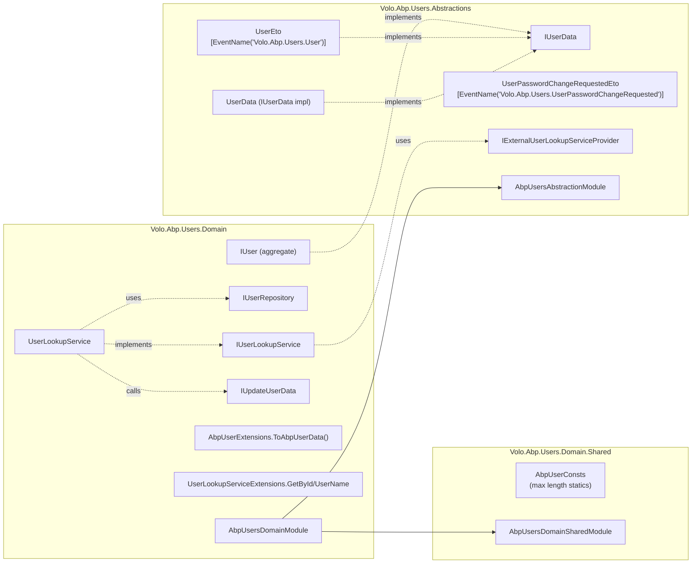
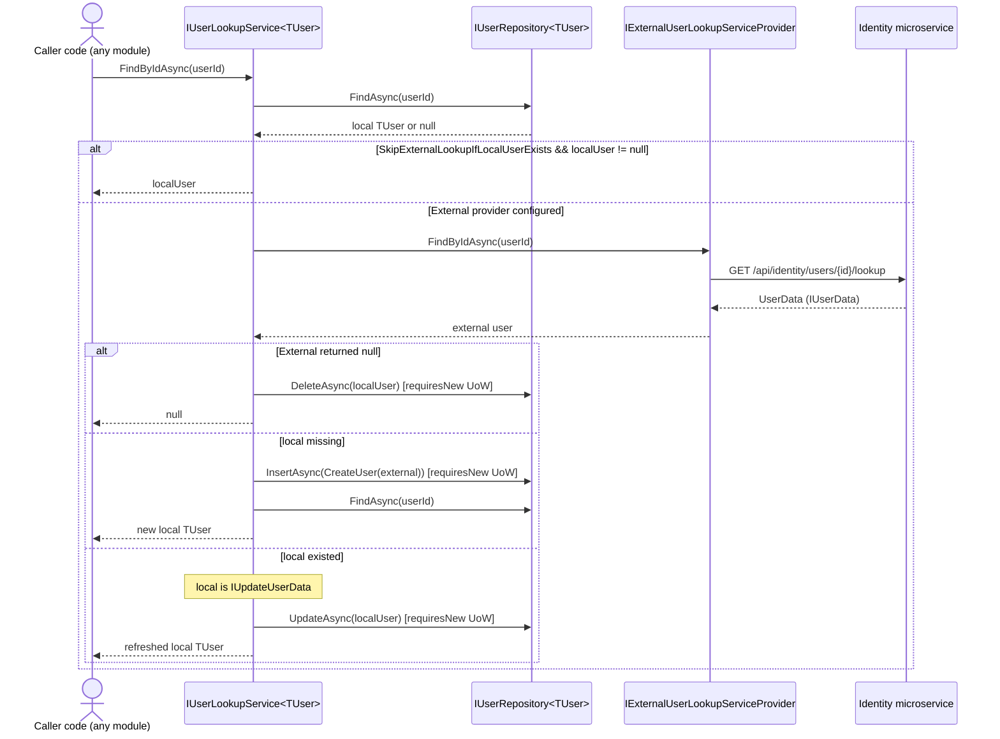

The **Users module** (`Volo.Abp.Users.*`) is the smallest shared contract surface in ABP — it carries the abstractions every other module uses when it needs to *talk about a user* without depending on the [Identity module](/modules/identity/overview). It defines `IUserData` (the read shape), `IUser` (the aggregate shape), `IExternalUserLookupServiceProvider` (the cross-process resolution port), the in-process `IUserLookupService<TUser>`, the lookup service base class, the standard `UserEto` distributed event payload, and `UserPasswordChangeRequestedEto`.

Source: [`modules/users/src`](https://github.com/abpframework/abp/tree/dev/modules/users/src).

<Info>
**Distributed events available:** the Abstractions assembly ships `UserEto` (event name `Volo.Abp.Users.User`) and `UserPasswordChangeRequestedEto` (event name `Volo.Abp.Users.UserPasswordChangeRequested`). There is **no** `UserUpdateEto` or `UserDeleteEto` in this module — those names do not exist in the source. Update/delete signalling is carried by the standard ABP distributed entity-change events (`EntityUpdatedEto`/`EntityDeletedEto`) that the [Identity module](/modules/identity/overview) publishes for `IdentityUser`.
</Info>

## Why this module exists

Other modules — [Permission Management](/modules/permission-management/overview), [Setting Management](/modules/setting-management/overview), [Audit Logging](/auditing/audit-logging-module), [Background Jobs](/background/overview) — need to express "this thing applies to user X". They cannot directly reference `IdentityUser` from `Volo.Abp.Identity.Domain` without dragging the entire Identity stack along. The Users module solves that by:

- defining the minimal `IUserData` and `IUser` shapes that every concrete user type (`IdentityUser`, microservice-side proxies, BFF stand-ins) implements;
- defining `IExternalUserLookupServiceProvider`, the contract a microservice front-end implements to fetch user data from an Identity service over HTTP;
- providing `UserLookupService<TUser, TUserRepository>`, the abstract base for the in-process side that lazily syncs an external user into the local DB.



Every box above maps to a file under `modules/users/src/<Project>/Volo/Abp/Users/`.

## Abstractions: the cross-module contract

`modules/users/src/Volo.Abp.Users.Abstractions/Volo/Abp/Users/` holds everything that must be referenceable from any layer (microservice clients, Blazor WASM, host modules) without pulling in DDD.

### IUserData — the read shape

`IUserData` is the canonical "I have a user, here is what I know about them" contract. It carries identifiers, the basic profile, and `IHasExtraProperties` so consumers can attach extra properties via [Object Extending](/ddd/object-extending).

```csharp modules/users/src/Volo.Abp.Users.Abstractions/Volo/Abp/Users/IUserData.cs
using System;
using JetBrains.Annotations;
using Volo.Abp.Data;

namespace Volo.Abp.Users;

public interface IUserData : IHasExtraProperties
{
    Guid Id { get; }

    Guid? TenantId { get; }

    string UserName { get; }

    string Name { get; }

    string Surname { get; }

    bool IsActive { get; }

    [CanBeNull]
    string Email { get; }

    bool EmailConfirmed { get; }

    [CanBeNull]
    string PhoneNumber { get; }

    bool PhoneNumberConfirmed { get; }
}
```

The interface is read-only (no setters). Anything that produces user data — `IdentityUser`, `UserEto`, microservice DTOs — implements it; anything that consumes user data — distributed events, audit log enrichers — depends on it.

### UserData — the default implementation

`UserData.cs` is the default DTO every microservice client gets back. It also includes a copy constructor that lets you wrap an arbitrary `IUserData` instance.

```csharp modules/users/src/Volo.Abp.Users.Abstractions/Volo/Abp/Users/UserData.cs
public class UserData : IUserData
{
    public Guid Id { get; set; }
    public Guid? TenantId { get; set; }
    public string UserName { get; set; }
    public string Name { get; set; }
    public string Surname { get; set; }
    public bool IsActive { get; set; }
    public string Email { get; set; }
    public bool EmailConfirmed { get; set; }
    public string PhoneNumber { get; set; }
    public bool PhoneNumberConfirmed { get; set; }

    public ExtraPropertyDictionary ExtraProperties { get; }

    public UserData() { }

    public UserData(IUserData userData)
    {
        Id = userData.Id;
        UserName = userData.UserName;
        Email = userData.Email;
        Name = userData.Name;
        Surname = userData.Surname;
        IsActive = userData.IsActive;
        EmailConfirmed = userData.EmailConfirmed;
        PhoneNumber = userData.PhoneNumber;
        PhoneNumberConfirmed = userData.PhoneNumberConfirmed;
        TenantId = userData.TenantId;
        ExtraProperties = userData.ExtraProperties;
    }

    public UserData(
        Guid id,
        [NotNull] string userName,
        [CanBeNull] string email = null,
        [CanBeNull] string name = null,
        [CanBeNull] string surname = null,
        bool emailConfirmed = false,
        [CanBeNull] string phoneNumber = null,
        bool phoneNumberConfirmed = false,
        Guid? tenantId = null,
        bool isActive = true,
        ExtraPropertyDictionary extraProperties = null)
    {
        Id = id;
        UserName = userName;
        Email = email;
        Name = name;
        Surname = surname;
        IsActive = isActive;
        EmailConfirmed = emailConfirmed;
        PhoneNumber = phoneNumber;
        PhoneNumberConfirmed = phoneNumberConfirmed;
        TenantId = tenantId;
        ExtraProperties = extraProperties;
    }
}
```

`UserData` is the type `IExternalUserLookupServiceProvider` typically returns — see [microservice flow](#microservice-flow) below.

### UserEto — the distributed event payload

`UserEto.cs` is the *event* shape used when the [distributed event bus](/eventbus/overview) needs to transmit user information across processes.

```csharp modules/users/src/Volo.Abp.Users.Abstractions/Volo/Abp/Users/UserEto.cs
using System;
using Volo.Abp.Data;
using Volo.Abp.EventBus;
using Volo.Abp.MultiTenancy;

namespace Volo.Abp.Users;

[EventName("Volo.Abp.Users.User")]
public class UserEto : IUserData, IMultiTenant
{
    public Guid Id { get; set; }
    public Guid? TenantId { get; set; }
    public string UserName { get; set; }
    public string Name { get; set; }
    public string Surname { get; set; }
    public bool IsActive { get; set; }
    public string Email { get; set; }
    public bool EmailConfirmed { get; set; }
    public string PhoneNumber { get; set; }
    public bool PhoneNumberConfirmed { get; set; }
    public ExtraPropertyDictionary ExtraProperties { get; set; }
}
```

Notes:

- The `[EventName("Volo.Abp.Users.User")]` attribute (from [`Volo.Abp.EventBus`](/eventbus/overview)) is what message brokers like RabbitMQ key the event topic on.
- Implementing `IUserData` means **consumers can subscribe to `UserEto` and feed it directly to anything that takes `IUserData`** — no mapping step.
- `IMultiTenant` is the standard ABP tenancy marker; subscribers automatically receive the event in the right tenant scope when ABP rehydrates `ICurrentTenant`.

### UserPasswordChangeRequestedEto

```csharp modules/users/src/Volo.Abp.Users.Abstractions/Volo/Abp/Users/UserPasswordChangeRequestedEto.cs
using System;
using Volo.Abp.EventBus;
using Volo.Abp.MultiTenancy;

namespace Volo.Abp.Users;

[Serializable]
[EventName("Volo.Abp.Users.UserPasswordChangeRequested")]
public class UserPasswordChangeRequestedEto : IMultiTenant
{
    public Guid? TenantId { get; set; }

    public string UserName { get; set; }

    public string Password { get; set; }
}
```

This event is published by Identity-adjacent modules (e.g. self-registration flows that want a separate microservice to set the password) when a user needs a password reset signalled across processes. Consumers should *never* persist the `Password` value — handle and discard.

### IExternalUserLookupServiceProvider — the cross-process port

`IExternalUserLookupServiceProvider.cs` is the contract the microservice / BFF side implements when it needs to fetch user data from an external Identity service.

```csharp modules/users/src/Volo.Abp.Users.Abstractions/Volo/Abp/Users/IExternalUserLookupServiceProvider.cs
public interface IExternalUserLookupServiceProvider
{
    Task<IUserData> FindByIdAsync(Guid id, CancellationToken cancellationToken = default);

    Task<IUserData> FindByUserNameAsync(string userName, CancellationToken cancellationToken = default);

    Task<List<IUserData>> SearchAsync(
        string sorting = null,
        string filter = null,
        int maxResultCount = int.MaxValue,
        int skipCount = 0,
        CancellationToken cancellationToken = default);

    Task<long> GetCountAsync(
        string filter = null,
        CancellationToken cancellationToken = default
    );
}
```

The framework does not ship a concrete implementation in this module. The expectation is that:

- monoliths register **no** implementation — `UserLookupService` then short-circuits to the local repository.
- microservices register a typed HTTP client that calls the Identity service's `IIdentityUserLookupAppService` ([Identity application layer](/modules/identity/application)) and projects results to `UserData`.

### AbpUsersAbstractionModule

```csharp modules/users/src/Volo.Abp.Users.Abstractions/Volo/Abp/Users/AbpUsersAbstractionModule.cs
//TODO: Consider to (somehow) move this to the framework to the same assemblily of ICurrentUser!

[DependsOn(
    typeof(AbpMultiTenancyModule),
    typeof(AbpEventBusModule)
    )]
public class AbpUsersAbstractionModule : AbpModule
{

}
```

Two dependencies: `AbpMultiTenancyModule` (because `IMultiTenant` lives there) and `AbpEventBusModule` (because `[EventName]` lives there). The TODO comment is a long-standing note about possibly relocating these types next to `ICurrentUser` — but it has not happened.

## Domain.Shared: constants

`modules/users/src/Volo.Abp.Users.Domain.Shared/Volo/Abp/Users/` carries only `AbpUserConsts.cs` plus the empty `AbpUsersDomainSharedModule`. The constants drive column lengths in [Identity EF Core / MongoDB providers](/modules/identity/efcore) and are honoured by validation.

```csharp modules/users/src/Volo.Abp.Users.Domain.Shared/Volo/Abp/Users/AbpUserConsts.cs
public class AbpUserConsts
{
    public static int MaxUserNameLength { get; set; } = 256;
    public static int MaxNameLength { get; set; } = 64;
    public static int MaxSurnameLength { get; set; } = 64;
    public static int MaxEmailLength { get; set; } = 256;
    public static int MaxPhoneNumberLength { get; set; } = 16;
}
```

All five are mutable statics so you can widen them in `PreConfigureServices` before EF Core builds the model.

## Domain: the in-process side

`modules/users/src/Volo.Abp.Users.Domain/Volo/Abp/Users/` is what host applications actually depend on at the domain layer. It carries:

- `IUser` — the aggregate contract Identity's `IdentityUser` implements;
- `IUserRepository<TUser>` — the basic repository the lookup service sits on top of;
- `IUserLookupService<TUser>` and the abstract `UserLookupService<TUser, TUserRepository>` base class;
- `IUpdateUserData`, `AbpUserExtensions`, and `UserLookupServiceExtensions`.

### IUser — the aggregate shape

```csharp modules/users/src/Volo.Abp.Users.Domain/Volo/Abp/Users/IUser.cs
public interface IUser : IAggregateRoot<Guid>, IMultiTenant, IHasExtraProperties
{
    string UserName { get; }

    [CanBeNull]
    string Email { get; }

    [CanBeNull]
    string Name { get; }

    [CanBeNull]
    string Surname { get; }

    bool IsActive { get; }

    bool EmailConfirmed { get; }

    [CanBeNull]
    string PhoneNumber { get; }

    bool PhoneNumberConfirmed { get; }
}
```

`IUser` is the aggregate contract — note it inherits from [`IAggregateRoot<Guid>`](/ddd/entities-and-aggregates) and combines `IMultiTenant` + `IHasExtraProperties`. `IdentityUser` (in the Identity module's Domain assembly) implements it; so do any custom user aggregates you might write for a non-Identity user store.

### IUserRepository&lt;TUser&gt;

```csharp modules/users/src/Volo.Abp.Users.Domain/Volo/Abp/Users/IUserRepository.cs
public interface IUserRepository<TUser> : IBasicRepository<TUser, Guid>
    where TUser : class, IUser, IAggregateRoot<Guid>
{
    Task<TUser> FindByUserNameAsync(string userName, CancellationToken cancellationToken = default);

    Task<List<TUser>> GetListAsync(IEnumerable<Guid> ids, CancellationToken cancellationToken = default);

    Task<List<TUser>> SearchAsync(
        string sorting = null,
        int maxResultCount = int.MaxValue,
        int skipCount = 0,
        string filter = null,
        CancellationToken cancellationToken = default
    );

    Task<long> GetCountAsync(
        string filter = null,
        CancellationToken cancellationToken = default);
}
```

Generic over `TUser` so Identity, microservice projections, and test doubles can all implement it for their own aggregate.

### IUserLookupService&lt;TUser&gt;

```csharp modules/users/src/Volo.Abp.Users.Domain/Volo/Abp/Users/IUserLookupService.cs
public interface IUserLookupService<TUser>
    where TUser : class, IUser
{
    Task<TUser> FindByIdAsync(
        Guid id,
        CancellationToken cancellationToken = default
    );

    Task<TUser> FindByUserNameAsync(
        string userName,
        CancellationToken cancellationToken = default
    );

    Task<List<IUserData>> SearchAsync(
        string sorting = null,
        string filter = null,
        int maxResultCount = int.MaxValue,
        int skipCount = 0,
        CancellationToken cancellationToken = default);

    Task<long> GetCountAsync(
        string filter = null,
        CancellationToken cancellationToken = default);
}
```

Note the asymmetry between `Find` (returns `TUser`) and `Search` (returns `List<IUserData>`). Search hits the external provider directly when one is present — it never tries to materialise local aggregates from a remote result set, because the remote IDs might not correspond to any local row yet.

### UserLookupService — the abstract base

`UserLookupService<TUser, TUserRepository>` implements both flavours of `Find*` with the same two-tier "look local first, fall back to external, optionally sync external into local" strategy. The decision table:

| local | external | result |
| --- | --- | --- |
| present, `SkipExternalLookupIfLocalUserExists = true` (default) | — | local |
| present, but `SkipExternalLookupIfLocalUserExists = false` | present | external syncs over local via `IUpdateUserData.Update` |
| present, but no external | external throws | local (logged) |
| present, no external row found | `null` returned by external | local is **deleted** in a new UoW |
| missing | present | external is materialised (`CreateUser`) and inserted via a new UoW |
| missing | missing | `null` |

```csharp modules/users/src/Volo.Abp.Users.Domain/Volo/Abp/Users/UserLookupService.cs
public abstract class UserLookupService<TUser, TUserRepository> : IUserLookupService<TUser>, ITransientDependency
    where TUser : class, IUser
    where TUserRepository : IUserRepository<TUser>
{
    protected bool SkipExternalLookupIfLocalUserExists { get; set; } = true;

    public IExternalUserLookupServiceProvider ExternalUserLookupServiceProvider { get; set; }
    public ILogger<UserLookupService<TUser, TUserRepository>> Logger { get; set; }

    private readonly TUserRepository _userRepository;
    private readonly IUnitOfWorkManager _unitOfWorkManager;

    protected UserLookupService(
        TUserRepository userRepository,
        IUnitOfWorkManager unitOfWorkManager)
    {
        _userRepository = userRepository;
        _unitOfWorkManager = unitOfWorkManager;

        Logger = NullLogger<UserLookupService<TUser, TUserRepository>>.Instance;
    }
```

The two interesting design points:

- `ExternalUserLookupServiceProvider` is a **property** with a public setter — ABP's property injection wires it only if a registration exists, which is how monoliths "automatically" skip the external path.
- `IUnitOfWorkManager` is used to `Begin(requiresNew: true)` for the insert/update/delete — because the lookup call may happen inside another UoW (e.g. while building an audit log entry), and we do not want to entangle the user sync with that outer transaction.

The core flow inside `FindByIdAsync` is:

```csharp modules/users/src/Volo.Abp.Users.Domain/Volo/Abp/Users/UserLookupService.cs
public async Task<TUser> FindByIdAsync(Guid id, CancellationToken cancellationToken = default)
{
    var localUser = await _userRepository.FindAsync(id, cancellationToken: cancellationToken);

    if (ExternalUserLookupServiceProvider == null)
    {
        return localUser;
    }

    if (SkipExternalLookupIfLocalUserExists && localUser != null)
    {
        return localUser;
    }

    IUserData externalUser;

    try
    {
        externalUser = await ExternalUserLookupServiceProvider.FindByIdAsync(id, cancellationToken);
        if (externalUser == null)
        {
            if (localUser != null)
            {
                //TODO: Instead of deleting, should be make it inactive or something like that?
                await WithNewUowAsync(() => _userRepository.DeleteAsync(localUser, cancellationToken: cancellationToken));
            }

            return null;
        }
    }
    catch (Exception ex)
    {
        Logger.LogException(ex);
        return localUser;
    }

    if (localUser == null)
    {
        await WithNewUowAsync(() => _userRepository.InsertAsync(CreateUser(externalUser), cancellationToken: cancellationToken));
        return await _userRepository.FindAsync(id, cancellationToken: cancellationToken);
    }

    if (localUser is IUpdateUserData && ((IUpdateUserData)localUser).Update(externalUser))
    {
        await WithNewUowAsync(() => _userRepository.UpdateAsync(localUser, cancellationToken: cancellationToken));
    }
    else
    {
        return localUser;
    }

    return await _userRepository.FindAsync(id, cancellationToken: cancellationToken);
}
```

The `try/catch (Exception ex) { Logger.LogException(ex); return localUser; }` is intentional — if the remote Identity service is down, the BFF should keep functioning with whatever it already cached locally. This is what makes the pattern resilient under partial outages.

`Search` and `GetCount` are simpler: when an external provider exists they delegate to it; otherwise they hit the local repository.

### IUpdateUserData — local-side sync hook

```csharp modules/users/src/Volo.Abp.Users.Domain/Volo/Abp/Users/IUpdateUserData.cs
public interface IUpdateUserData
{
    bool Update([NotNull] IUserData user);
}
```

A local `TUser` aggregate that implements this gives the lookup service the green light to update local fields from an external `IUserData`. Returning `false` skips the persistence step — useful when the new payload is logically equal to the current one.

### AbpUserExtensions

```csharp modules/users/src/Volo.Abp.Users.Domain/Volo/Abp/Users/AbpUserExtensions.cs
public static class AbpUserExtensions
{
    public static IUserData ToAbpUserData(this IUser user)
    {
        return new UserData(
            id: user.Id,
            userName: user.UserName,
            email: user.Email,
            name: user.Name,
            surname: user.Surname,
            isActive: user.IsActive,
            emailConfirmed: user.EmailConfirmed,
            phoneNumber: user.PhoneNumber,
            phoneNumberConfirmed: user.PhoneNumberConfirmed,
            tenantId: user.TenantId,
            extraProperties: user.ExtraProperties
        );
    }
}
```

A one-liner to project an `IUser` aggregate into the `UserData` DTO without coupling to the concrete aggregate type.

### UserLookupServiceExtensions

```csharp modules/users/src/Volo.Abp.Users.Domain/Volo/Abp/Users/UserLookupServiceExtensions.cs
public static class UserLookupServiceExtensions
{
    public static async Task<TUser> GetByIdAsync<TUser>(this IUserLookupService<TUser> userLookupService, Guid id, CancellationToken cancellationToken = default)
        where TUser : class, IUser
    {
        var user = await userLookupService.FindByIdAsync(id, cancellationToken);
        if (user == null)
        {
            throw new EntityNotFoundException(typeof(TUser), id);
        }

        return user;
    }

    public static async Task<TUser> GetByUserNameAsync<TUser>(this IUserLookupService<TUser> userLookupService, string userName, CancellationToken cancellationToken = default)
        where TUser : class, IUser
    {
        var user = await userLookupService.FindByUserNameAsync(userName, cancellationToken);
        if (user == null)
        {
            throw new EntityNotFoundException(typeof(TUser), userName);
        }

        return user;
    }
}
```

These extension methods exist so callers can switch between optional ("Find") and required ("Get") semantics without adding methods to the interface itself — the standard ABP repository pattern.

### AbpUsersDomainModule

```csharp modules/users/src/Volo.Abp.Users.Domain/Volo/Abp/Users/AbpUsersDomainModule.cs
[DependsOn(
    typeof(AbpUsersDomainSharedModule),
    typeof(AbpUsersAbstractionModule),
    typeof(AbpDddDomainModule)
    )]
public class AbpUsersDomainModule : AbpModule
{

}
```

Pure module-graph wiring; the assembly does not register any services explicitly (all of them rely on `ITransientDependency` or property injection).

## Microservice flow



This sequence is the entire reason the lookup service has a `IUnitOfWorkManager` dependency — it always materialises the external-side change in its own UoW so the call to `FindByIdAsync` is "transactional" with respect to the caller.

## How other modules consume it

The pattern is always the same: depend on `IUserData` (or `IUser`), never on `IdentityUser`.

- **Audit Logging** annotates entries with `UserData` projected from `ICurrentUser` — see [Audit Logging module](/auditing/audit-logging-module).
- **Permission Management** stores grants against a `(ProviderName, ProviderKey)` pair where `ProviderKey` is the user id; the [`UserPermissionManagementProvider`](/modules/permission-management/domain) resolves the user via `IUserLookupService<IdentityUser>` so a missing or external user is rehydrated transparently.
- **Setting Management** uses the same shape for user-scoped setting providers.
- **Distributed event subscribers** that need to react when "a user changed" subscribe to `EntityUpdatedEto<UserEto>` / `UserEto` directly.

## Related pages

<CardGroup cols={2}>
  <Card title="Identity module" icon="user" href="/modules/identity/overview">
    `IdentityUser` (implements `IUser`), `IdentityUserAppService`, and the EF Core / Mongo repositories that satisfy `IUserRepository<IdentityUser>`.
  </Card>
  <Card title="Distributed event bus" icon="bolt" href="/eventbus/overview">
    `[EventName]`, `IDistributedEventBus`, and how `UserEto` and `UserPasswordChangeRequestedEto` are routed across processes.
  </Card>
  <Card title="Object Extending" icon="puzzle-piece" href="/ddd/object-extending">
    The `IHasExtraProperties` mechanism by which `IUserData.ExtraProperties` is filled and round-tripped.
  </Card>
  <Card title="Permission Management Domain" icon="lock" href="/modules/permission-management/domain">
    Example consumer: the `UserPermissionManagementProvider` calls `IUserLookupService<IdentityUser>.GetByIdAsync(...)` for every grant lookup.
  </Card>
</CardGroup>
