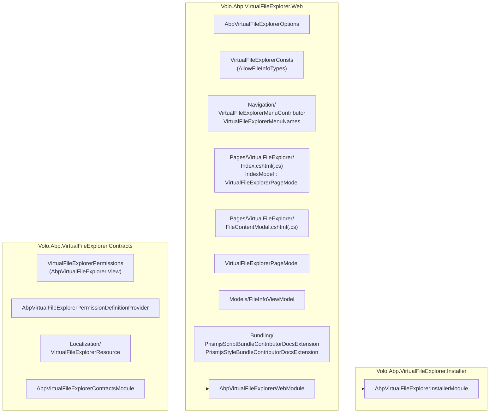
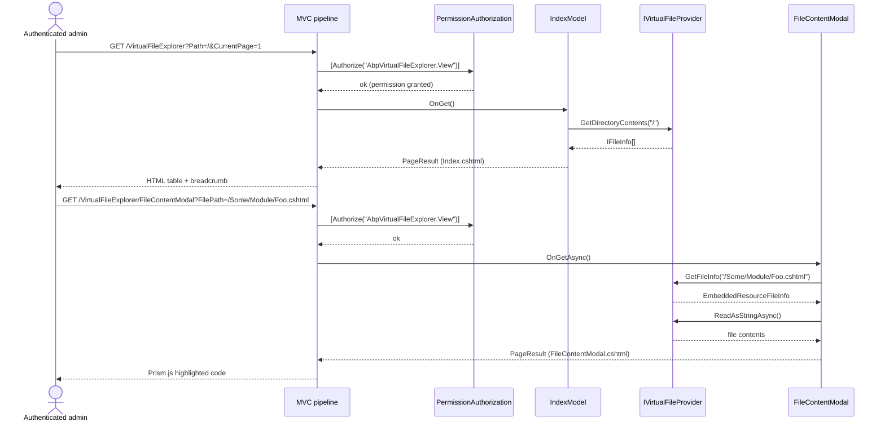

The **Virtual File Explorer** module is ABP's built-in browser for the [Virtual File System](/core/volo-abp-core). It exposes one Razor Page — `/VirtualFileExplorer` — that walks the merged `IVirtualFileProvider` tree, paginates the contents of each directory, and renders a syntax-highlighted preview when you click an individual file. It is a *development-time* tool: it lets you see exactly which embedded `.cshtml`, `.json`, `.svg`, or asset file is being served by which module, which is invaluable when you are overriding views or debugging "where did this localization come from?".

Source: [`modules/virtual-file-explorer/src`](https://github.com/abpframework/abp/tree/dev/modules/virtual-file-explorer/src).

<Info>
**No application service:** despite the contracts package name, this module does **not** publish an `AppService`. There is no `IVirtualFileExplorerAppService` and no HTTP API. The browsing logic lives directly inside the `IndexModel` Razor Page Model and uses `IVirtualFileProvider` synchronously — there is nothing to call remotely.
</Info>

## Project layout



Each box matches a folder under `modules/virtual-file-explorer/src/`. The Contracts package is intentionally separate because the **permission definition** belongs in a contracts-only assembly (so HTTP API hosts or microservice fronts that don't ship UI can still register the permission).

## What you actually see

`modules/virtual-file-explorer/src/Volo.Abp.VirtualFileExplorer.Web/Pages/VirtualFileExplorer/Index.cshtml` renders three things:

1. A breadcrumb navigation built from the current path.
2. A paginated table of directories and files (folders first, files second; alphabetical inside each group).
3. A modal launched per-file by `FileContentModal.cshtml` that streams the file contents into a Prism.js syntax-highlighted block.

The page is reachable at `~/VirtualFileExplorer` once a host application depends on `AbpVirtualFileExplorerWebModule`. The menu contributor adds it under the main menu — see [Menu integration](#menu-integration).

## Contracts: permissions and localization

`modules/virtual-file-explorer/src/Volo.Abp.VirtualFileExplorer.Contracts/Volo/Abp/VirtualFileExplorer/` defines the single permission and the localization resource.

### VirtualFileExplorerPermissions

```csharp modules/virtual-file-explorer/src/Volo.Abp.VirtualFileExplorer.Contracts/Volo/Abp/VirtualFileExplorer/VirtualFileExplorerPermissions.cs
using Volo.Abp.Reflection;

namespace Volo.Abp.VirtualFileExplorer;

public static class VirtualFileExplorerPermissions
{
    public const string GroupName = "AbpVirtualFileExplorer";

    public const string View = GroupName + ".View";

    public static string[] GetAll()
    {
        return ReflectionHelper.GetPublicConstantsRecursively(typeof(VirtualFileExplorerPermissions));
    }
}
```

`AbpVirtualFileExplorer.View` is the single permission this module exposes. Both the Razor Pages and the menu contributor (covered below) gate themselves on it; the [Permission Management](/modules/permission-management/overview) module surfaces it in the admin permission tree thanks to `AbpVirtualFileExplorerPermissionDefinitionProvider` in the same folder.

### AbpVirtualFileExplorerContractsModule

```csharp modules/virtual-file-explorer/src/Volo.Abp.VirtualFileExplorer.Contracts/Volo/Abp/VirtualFileExplorer/AbpVirtualFileExplorerContractsModule.cs
public class AbpVirtualFileExplorerContractsModule : AbpModule
{
    public override void ConfigureServices(ServiceConfigurationContext context)
    {
        Configure<AbpVirtualFileSystemOptions>(options =>
        {
            options.FileSets.AddEmbedded<AbpVirtualFileExplorerContractsModule>();
        });

        Configure<AbpLocalizationOptions>(options =>
        {
            options.Resources
                .Add<VirtualFileExplorerResource>("en")
                .AddVirtualJson("/Volo/Abp/VirtualFileExplorer/Localization/Resources");
        });
    }
}
```

The contracts module registers the `VirtualFileExplorerResource` localization resource (the JSON files live under `Localization/Resources/`) and exposes its own assembly through the [Virtual File System](/core/volo-abp-core) — a satisfying recursion, given the module's whole purpose is to browse that file system.

## Web layer: the page model

`Pages/VirtualFileExplorer/Index.cshtml.cs` is where the actual tree walking happens. It is intentionally a Razor Page Model (not an `AppService`) because `IVirtualFileProvider` is a per-host singleton — there is no value in exposing it over HTTP from a different process.

### Page-level base type

All pages in the module share a tiny base class that wires up the localization resource:

```csharp modules/virtual-file-explorer/src/Volo.Abp.VirtualFileExplorer.Web/Pages/VirtualFileExplorer/VirtualFileExplorerPageModel.cs
using Localization;
using Volo.Abp.AspNetCore.Mvc.UI.RazorPages;
using Volo.Abp.VirtualFileExplorer.Localization;

namespace Volo.Abp.VirtualFileExplorer.Web.Pages.VirtualFileExplorer;

public abstract class VirtualFileExplorerPageModel : AbpPageModel
{
    protected VirtualFileExplorerPageModel()
    {
        LocalizationResourceType = typeof(VirtualFileExplorerResource);
        ObjectMapperContext = typeof(AbpVirtualFileExplorerWebModule);
    }
}
```

Both `IndexModel` and `FileContentModal` inherit from `AbpPageModel` (via this base) so they get the standard ABP Razor Pages plumbing — see [AbpPageModel](/aspnetcore/mvc-module).

### IndexModel — directory listing

`IndexModel` is the workhorse. It accepts a `Path` query string, a `CurrentPage`, and a `PageSize`, then asks `IVirtualFileProvider` for the directory contents at that path, filters them by `VirtualFileExplorerConsts.AllowFileInfoTypes`, sorts directories before files, and constructs a pager and view-model list.

```csharp modules/virtual-file-explorer/src/Volo.Abp.VirtualFileExplorer.Web/Pages/VirtualFileExplorer/Index.cshtml.cs
[Authorize(VirtualFileExplorerPermissions.View)]
public class IndexModel : VirtualFileExplorerPageModel
{
    [BindProperty(SupportsGet = true)]
    public string Path { get; set; } = "/";

    [BindProperty(SupportsGet = true)]
    public int CurrentPage { get; set; } = 1;

    [BindProperty(SupportsGet = true)]
    public int PageSize { get; set; } = 10;

    public List<FileInfoViewModel> FileInfoList { get; set; }

    public PagerModel PagerModel { get; set; }

    public string PathNavigation { get; set; }

    protected IVirtualFileProvider VirtualFileProvider { get; }

    public IndexModel(IVirtualFileProvider virtualFileProvider)
    {
        VirtualFileProvider = virtualFileProvider;
    }

    public virtual IActionResult OnGet()
    {
        var query = VirtualFileProvider.GetDirectoryContents(Path)
            .Where(d => VirtualFileExplorerConsts.AllowFileInfoTypes.Contains(d.GetType().Name))
            .OrderByDescending(f => f.IsDirectory).ToList();

        PagerModel = new PagerModel(query.Count, PageSize, CurrentPage, PageSize, $"{Url.Content("~/")}VirtualFileExplorer?Path={Path}&PageSize={PageSize}");

        SetViewModel(query.Skip((CurrentPage - 1) * PageSize).Take(PageSize));
        SetPathNavigation();

        return Page();
    }
```

The `[Authorize(VirtualFileExplorerPermissions.View)]` attribute is what enforces the permission — every request to `/VirtualFileExplorer` runs through ABP's permission-aware authorization filter.

### File-type filter — VirtualFileExplorerConsts

The `AllowFileInfoTypes` constant decides which physical file-info implementations the browser will surface:

```csharp modules/virtual-file-explorer/src/Volo.Abp.VirtualFileExplorer.Web/VirtualFileExplorerConsts.cs
namespace Volo.Abp.VirtualFileExplorer.Web;

public static class VirtualFileExplorerConsts
{
    public static readonly string[] AllowFileInfoTypes = { "VirtualDirectoryFileInfo", "EmbeddedResourceFileInfo", "ManifestDirectoryInfo", "ManifestFileInfo" };
}
```

These four type names correspond to:

- `VirtualDirectoryFileInfo` — a directory inside the merged virtual file tree.
- `EmbeddedResourceFileInfo` — a file embedded into one of the loaded assemblies (i.e. `[assembly: ...]` resources).
- `ManifestDirectoryInfo` / `ManifestFileInfo` — the resource-manifest variants used by Microsoft's `Microsoft.Extensions.FileProviders.Embedded`.

Anything else (physical file system, custom providers) is filtered out. If you have a custom `IFileProvider` that you want included, override this list at startup.

### SetViewModel — the per-row mapping

```csharp modules/virtual-file-explorer/src/Volo.Abp.VirtualFileExplorer.Web/Pages/VirtualFileExplorer/Index.cshtml.cs
private void SetViewModel(IEnumerable<IFileInfo> fileInfos)
{
    FileInfoList = new List<FileInfoViewModel>();

    foreach (var fileInfo in fileInfos)
    {
        var fileInfoViewModel = new FileInfoViewModel()
        {
            IsDirectory = fileInfo.IsDirectory,
            Icon = "fas fa-file",
            FileType = "file",
            Length = fileInfo.Length + " bytes",
            FileName = fileInfo.Name,
            LastUpdateTime = fileInfo.LastModified.LocalDateTime
        };

        var filePath = fileInfo.PhysicalPath ?? $"{Path.EnsureEndsWith('/')}{fileInfo.Name}"; ;

        if (fileInfo.IsDirectory)
        {
            fileInfoViewModel.Icon = "fas fa-folder";
            fileInfoViewModel.FileType = "folder";
            fileInfoViewModel.Length = "/";
            fileInfoViewModel.FileName = $"<a href='{Url.Content("~/")}VirtualFileExplorer?path={filePath}'>{fileInfo.Name}</a>";
        }
        else
        {
            if (fileInfo is EmbeddedResourceFileInfo embeddedResourceFileInfo)
            {
                fileInfoViewModel.FilePath = embeddedResourceFileInfo.VirtualPath;
            }
            else
            {
                fileInfoViewModel.FilePath = filePath;
            }

        }

        FileInfoList.Add(fileInfoViewModel);
    }
}
```

Notes:

- Directories get a `<a href=...>VirtualFileExplorer?path=...</a>` link directly in their `FileName` — that's why `FileName` ends up being rendered as raw HTML by the cshtml.
- Files store both a display `FileName` and a `FilePath` used by the modal. For `EmbeddedResourceFileInfo` the `VirtualPath` (i.e. `/MyModule/foo.cshtml`) is preserved; for other types the fall-through path is `Path/Name`.
- `LastUpdateTime` uses `fileInfo.LastModified.LocalDateTime` — embedded resource files report the assembly's build timestamp here, so seeing identical "last modified" for every file in a folder is expected.

### FileInfoViewModel

```csharp modules/virtual-file-explorer/src/Volo.Abp.VirtualFileExplorer.Web/Models/FileInfoViewModel.cs
public class FileInfoViewModel
{
    public string FilePath { get; set; }
    public string Icon { get; set; }
    public string FileType { get; set; }
    public string Length { get; set; }
    public string FileName { get; set; }
    public DateTime LastUpdateTime { get; set; }
    public bool IsDirectory { get; set; }
}
```

This is the row shape the Razor view iterates over. Nothing in this view-model is reused outside the Web project.

### Breadcrumb construction — SetPathNavigation

The breadcrumb is built as a raw HTML `<nav class="breadcrumb">` block. The shape is "Back to root → segment1 → segment2 → …", with each segment becoming a clickable link.

```csharp modules/virtual-file-explorer/src/Volo.Abp.VirtualFileExplorer.Web/Pages/VirtualFileExplorer/Index.cshtml.cs
private void SetPathNavigation()
{
    var navigationBuild = new StringBuilder();
    var pathArray = Path.Split('/').Where(p => !p.IsNullOrWhiteSpace());
    var href = $"{Url.Content("~/")}VirtualFileExplorer?path=";

    navigationBuild.Append($"<nav aria-label='breadcrumb'>" +
                           $" <ol class='breadcrumb'>" +
                           $"<li class='breadcrumb-item'><a href='{href}/'>{L["BackToRoot"]}</a></li>");

    foreach (var item in pathArray)
    {
        href += "/" + item;
        navigationBuild.Append($"<li class='breadcrumb-item'><a href='{href}'>{item}</a></li>");
    }

    navigationBuild.Append("</ol></nav>");

    PathNavigation = navigationBuild.ToString();
}
```

### FileContentModal — file preview

`Pages/VirtualFileExplorer/FileContentModal.cshtml.cs` handles "view this file" clicks. It resolves the file via `IVirtualFileProvider.GetFileInfo(FilePath)`, reads it via `ReadAsStringAsync()`, and returns the Razor page that pipes the string into the Prism.js-decorated `<pre>` block in `FileContentModal.cshtml`.

```csharp modules/virtual-file-explorer/src/Volo.Abp.VirtualFileExplorer.Web/Pages/VirtualFileExplorer/FileContentModal.cshtml.cs
[Authorize(VirtualFileExplorerPermissions.View)]
public class FileContentModal : PageModel
{
    [Required]
    [BindProperty(SupportsGet = true)]
    public string FilePath { get; set; }

    public string Content { get; set; }

    protected IVirtualFileProvider VirtualFileProvider { get; }

    public FileContentModal(IVirtualFileProvider virtualFileProvider)
    {
        VirtualFileProvider = virtualFileProvider;
    }

    public virtual async Task<IActionResult> OnGetAsync()
    {
        var fileInfo = VirtualFileProvider.GetFileInfo(FilePath);
        if (fileInfo == null || fileInfo.IsDirectory)
        {
            return NotFound();
        }

        Content = await fileInfo.ReadAsStringAsync();

        return Page();
    }
}
```

The modal returns `NotFound()` for directories and for missing paths — this is the source of the 404 you may have hit if you ever bookmarked a file URL that has since been deleted from the tree.

## Request flow



The entire flow is per-request and stateless — there's no caching, no temp files. The `IFileInfo` API exposes both length and content streams, but the module reads the full content into a string for the modal (so very large embedded resources will allocate proportionally).

## Menu integration

```csharp modules/virtual-file-explorer/src/Volo.Abp.VirtualFileExplorer.Web/Navigation/VirtualFileExplorerMenuContributor.cs
public class VirtualFileExplorerMenuContributor : IMenuContributor
{
    public virtual Task ConfigureMenuAsync(MenuConfigurationContext context)
    {
        if (context.Menu.Name != StandardMenus.Main)
        {
            return Task.CompletedTask;
        }

        var l = context.GetLocalizer<VirtualFileExplorerResource>();

        context.Menu.Items.Add(new ApplicationMenuItem(
                VirtualFileExplorerMenuNames.Index,
                l["Menu:VirtualFileExplorer"],
                icon: "fa fa-file", url: "~/VirtualFileExplorer")
            .RequirePermissions(VirtualFileExplorerPermissions.View)
        );

        return Task.CompletedTask;
    }
}
```

The menu item is registered on `StandardMenus.Main` and gated with `.RequirePermissions(VirtualFileExplorerPermissions.View)` so menu rendering goes through the [Permission Management](/modules/permission-management/overview) check before showing the link. `VirtualFileExplorerMenuNames` exposes the menu key:

```csharp modules/virtual-file-explorer/src/Volo.Abp.VirtualFileExplorer.Web/Navigation/VirtualFileExplorerMenuNames.cs
public class VirtualFileExplorerMenuNames
{
    public const string GroupName = "AbpVirtualFileExplorer";

    public const string Index = GroupName + ".Index";
}
```

## Module wiring

```csharp modules/virtual-file-explorer/src/Volo.Abp.VirtualFileExplorer.Web/AbpVirtualFileExplorerWebModule.cs
[DependsOn(typeof(AbpAspNetCoreMvcUiBootstrapModule))]
[DependsOn(typeof(AbpAspNetCoreMvcUiThemeSharedModule))]
[DependsOn(typeof(AbpVirtualFileExplorerContractsModule))]
public class AbpVirtualFileExplorerWebModule : AbpModule
{
    public override void PreConfigureServices(ServiceConfigurationContext context)
    {
        PreConfigure<IMvcBuilder>(mvcBuilder =>
        {
            mvcBuilder.AddApplicationPartIfNotExists(typeof(AbpVirtualFileExplorerWebModule).Assembly);
        });
    }

    public override void ConfigureServices(ServiceConfigurationContext context)
    {
        var virtualFileExplorerOptions = context.Services.ExecutePreConfiguredActions<AbpVirtualFileExplorerOptions>();

        if (virtualFileExplorerOptions.IsEnabled)
        {
            Configure<AbpNavigationOptions>(options =>
            {
                options.MenuContributors.Add(new VirtualFileExplorerMenuContributor());
            });

            Configure<AbpVirtualFileSystemOptions>(options =>
            {
                options.FileSets.AddEmbedded<AbpVirtualFileExplorerWebModule>("Volo.Abp.VirtualFileExplorer.Web");
            });

            Configure<AbpBundleContributorOptions>(options =>
            {
                options
                    .Extensions<PrismjsStyleBundleContributor>()
                    .Add<PrismjsStyleBundleContributorDocsExtension>();

                options
                    .Extensions<PrismjsScriptBundleContributor>()
                    .Add<PrismjsScriptBundleContributorDocsExtension>();
            });
        }
    }
}
```

A couple of things stand out:

- The whole module is gated on `AbpVirtualFileExplorerOptions.IsEnabled`. The default is `true` (see below), but you can flip it off in `PreConfigureServices` if you want to ship the assembly without the page wired up — useful for staging tear-downs.
- It registers itself with `mvcBuilder.AddApplicationPartIfNotExists(...)` so the host's MVC discovers the Razor Pages in this assembly without a manual `app.MapRazorPages` change.
- `PrismjsStyleBundleContributorDocsExtension` / `PrismjsScriptBundleContributorDocsExtension` extend the existing Prism.js bundle from [`Volo.Abp.AspNetCore.Mvc.UI.Packages.Prismjs`](/aspnetcore/mvc-ui-packages) with extra languages required by the modal (XML/HTML/Razor syntax highlighting).

### AbpVirtualFileExplorerOptions

```csharp modules/virtual-file-explorer/src/Volo.Abp.VirtualFileExplorer.Web/AbpVirtualFileExplorerOptions.cs
namespace Volo.Abp.VirtualFileExplorer.Web;

public class AbpVirtualFileExplorerOptions
{
    /// <summary>
    /// Default: true.
    /// </summary>
    public bool IsEnabled { get; set; } = true;
}
```

Toggle it via `PreConfigure<AbpVirtualFileExplorerOptions>(o => o.IsEnabled = false)` in your host module — typically done conditionally on the hosting environment so the explorer is only shipped to development builds.

## When to install it

<CardGroup cols={2}>
  <Card title="Development hosts" icon="screwdriver-wrench">
    Ship the module to dev/staging so contributors can see exactly which assembly serves a given `.cshtml`. Pair with [`AddVirtualFiles<TModule>`](/core/volo-abp-core).
  </Card>
  <Card title="Verify overrides" icon="layer-group">
    Confirm a Razor view override is being picked up by checking which file the explorer returns at the conflicting virtual path — saves a round of "is my override correct?" debugging.
  </Card>
  <Card title="Audit localization" icon="language">
    The localization JSON files for every module are embedded; you can browse them at runtime via the explorer to see the exact resource the resolver loaded.
  </Card>
  <Card title="Production hosts" icon="ban">
    Disable in production. Set `AbpVirtualFileExplorerOptions.IsEnabled = false` or only register the module in `Development`. Exposing the embedded tree publicly leaks internals.
  </Card>
</CardGroup>

## Related pages

<CardGroup cols={2}>
  <Card title="Core runtime" icon="cube" href="/core/volo-abp-core">
    `AbpVirtualFileSystemOptions`, `IVirtualFileProvider`, and the file-set composition the explorer walks.
  </Card>
  <Card title="MVC module" icon="window-maximize" href="/aspnetcore/mvc-module">
    `AbpPageModel`, menu contributors, and Razor Pages wiring used throughout the Web project.
  </Card>
  <Card title="Permission Management" icon="lock" href="/modules/permission-management/overview">
    Where `AbpVirtualFileExplorer.View` shows up in the admin permission tree.
  </Card>
  <Card title="MVC UI packages" icon="box" href="/aspnetcore/mvc-ui-packages">
    The Prism.js bundles the explorer extends for syntax highlighting.
  </Card>
</CardGroup>
