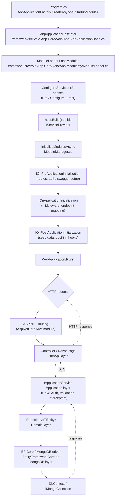

ABP is a modular monolith framework: a single ASP.NET Core process boots one *startup module* and the kernel transitively loads every module it `[DependsOn]`. This page traces the bootstrap and request paths through the concrete files under `framework/src/Volo.Abp.Core/Volo/Abp/` — `AbpApplicationBase.cs`, `AbpApplicationFactory.cs`, `Modularity/AbpModule.cs`, `Modularity/ModuleManager.cs`, `Modularity/ModuleLoader.cs`, `Modularity/ServiceConfigurationContext.cs`, `Modularity/DependsOnAttribute.cs`, `IOnApplicationInitialization.cs`, `Modularity/IOnPreApplicationInitialization.cs`, `Modularity/IOnPostApplicationInitialization.cs`, `IOnApplicationShutdown.cs`, and `ApplicationInitializationContext.cs`. The layering suffixes referenced throughout (`.Domain.Shared`, `.Domain`, `.Application.Contracts`, `.Application`, `.HttpApi`, `.HttpApi.Client`, `.Web`, `.Blazor`, `.EntityFrameworkCore`, `.MongoDB`, `.Installer`) are explained in detail in [Layered Architecture](/overview/layered-architecture) — here we focus on how the runtime composes them.

## The modular monolith model

Every ABP application is a graph of modules rooted at a single startup module. The graph is declared with `DependsOnAttribute` (see `framework/src/Volo.Abp.Core/Volo/Abp/Modularity/DependsOnAttribute.cs`) and loaded by `ModuleLoader` (`framework/src/Volo.Abp.Core/Volo/Abp/Modularity/ModuleLoader.cs`, 106 lines). The loader performs a topological sort so that dependencies are always configured and initialized before their dependents.

```csharp
// framework/src/Volo.Abp.Core/Volo/Abp/Modularity/DependsOnAttribute.cs
[AttributeUsage(AttributeTargets.Class, AllowMultiple = true)]
public class DependsOnAttribute : Attribute, IDependedTypesProvider
{
    public Type[] DependedTypes { get; }

    public DependsOnAttribute(params Type[]? dependedTypes)
    {
        DependedTypes = dependedTypes ?? Type.EmptyTypes;
    }

    public virtual Type[] GetDependedTypes() => DependedTypes;
}
```

A representative module declaration — `modules/identity/src/Volo.Abp.Identity.Domain/Volo/Abp/Identity/AbpIdentityDomainModule.cs` (the dependencies are mirrored in the auto‑generated `Volo.Abp.Identity.Domain.abppkg.analyze.json` next to the project) — chains four ancestors:

| `DependsOn` argument                | Source assembly                          |
| ----------------------------------- | ---------------------------------------- |
| `AbpDddDomainModule`                | `framework/src/Volo.Abp.Ddd.Domain`      |
| `AbpIdentityDomainSharedModule`     | `modules/identity/src/Volo.Abp.Identity.Domain.Shared` |
| `AbpUsersDomainModule`              | `modules/users`                          |
| `AbpMapperlyModule`                 | `framework/src/Volo.Abp.Mapperly`        |

The exact list is recorded in `modules/identity/src/Volo.Abp.Identity.Domain/Volo.Abp.Identity.Domain.abppkg.analyze.json` — that file is regenerated by the build and consumed by the ABP Studio tooling. See [Solution Conventions](/overview/solution-conventions) for how `.abppkg*` files are emitted.

<Note>
  Modules are POCOs implementing `IAbpModule` (or — almost always — deriving from `AbpModule`). They are *not* MEF parts, not Autofac modules, and not ASP.NET hosted services. The kernel discovers them only by walking `DependsOn` from `StartupModuleType`.
</Note>

## `AbpApplicationBase` — the kernel of the bootstrap

`framework/src/Volo.Abp.Core/Volo/Abp/AbpApplicationBase.cs` is the abstract base for every ABP application instance. Two concrete subclasses ship in the same folder: `AbpApplicationWithInternalServiceProvider` (the kernel owns and builds the DI container) and `AbpApplicationWithExternalServiceProvider` (the host — e.g. `WebApplication.CreateBuilder` — owns the `IServiceCollection`). Both are produced by `AbpApplicationFactory` (`framework/src/Volo.Abp.Core/Volo/Abp/AbpApplicationFactory.cs`).

```csharp
// framework/src/Volo.Abp.Core/Volo/Abp/AbpApplicationBase.cs (constructor)
internal AbpApplicationBase(Type startupModuleType,
                            IServiceCollection services,
                            Action<AbpApplicationCreationOptions>? optionsAction)
{
    StartupModuleType = startupModuleType;
    Services = services;

    services.TryAddObjectAccessor<IServiceProvider>();
    var options = new AbpApplicationCreationOptions(services);
    optionsAction?.Invoke(options);

    services.AddSingleton<IAbpApplication>(this);
    services.AddSingleton<IApplicationInfoAccessor>(this);
    services.AddSingleton<IModuleContainer>(this);
    services.AddSingleton<IAbpHostEnvironment>(new AbpHostEnvironment { EnvironmentName = options.Environment });

    services.AddCoreServices();
    services.AddCoreAbpServices(this, options);

    Modules = LoadModules(services, options);

    if (!options.SkipConfigureServices) ConfigureServices();
}
```

Notable invariants the constructor encodes:

| Step                                       | Why it matters                                                   |
| ------------------------------------------ | ---------------------------------------------------------------- |
| `services.AddSingleton<IAbpApplication>(this)` | Every module can resolve `IAbpApplication` to walk `Modules`.    |
| `services.AddSingleton<IModuleContainer>(this)` | `ModuleManager` reads `_moduleContainer.Modules` to iterate.     |
| `services.AddCoreServices()`               | Registers `ObjectAccessor<T>`, `IInitLoggerFactory`, etc.        |
| `LoadModules(...)`                         | Calls `IModuleLoader.LoadModules` — topological sort happens there. |
| `ConfigureServices()`                      | Drives `Pre/ConfigureServices/Post` across all modules in order. |

### Loading modules

`LoadModules` simply forwards to the singleton `IModuleLoader`:

```csharp
// framework/src/Volo.Abp.Core/Volo/Abp/AbpApplicationBase.cs
protected virtual IReadOnlyList<IAbpModuleDescriptor> LoadModules(
    IServiceCollection services, AbpApplicationCreationOptions options)
{
    return services
        .GetSingletonInstance<IModuleLoader>()
        .LoadModules(services, StartupModuleType, options.PlugInSources);
}
```

`ModuleLoader` (`framework/src/Volo.Abp.Core/Volo/Abp/Modularity/ModuleLoader.cs`) walks `DependsOnAttribute` transitively, includes any types contributed by `options.PlugInSources` (the public extension point for runtime plugins), and emits an `IAbpModuleDescriptor` per module — each descriptor knows its `Type`, the constructed `Instance`, the owning assembly and its `AllAssemblies` (the module assembly plus anything contributed by `AdditionalAssemblyAttribute` from `framework/src/Volo.Abp.Core/Volo/Abp/Modularity/AdditionalAssemblyAttribute.cs`).

## `AbpModule` — the per‑module surface

Modules inherit from `AbpModule` (`framework/src/Volo.Abp.Core/Volo/Abp/Modularity/AbpModule.cs`), which implements all six lifecycle interfaces at once with empty virtual hooks so that authors override only what they need:

```csharp
// framework/src/Volo.Abp.Core/Volo/Abp/Modularity/AbpModule.cs
public abstract class AbpModule :
    IAbpModule,
    IOnPreApplicationInitialization,
    IOnApplicationInitialization,
    IOnPostApplicationInitialization,
    IOnApplicationShutdown,
    IPreConfigureServices,
    IPostConfigureServices
{
    protected internal bool SkipAutoServiceRegistration { get; protected set; }

    protected internal ServiceConfigurationContext ServiceConfigurationContext
    {
        get
        {
            if (_serviceConfigurationContext == null)
                throw new AbpException($"{nameof(ServiceConfigurationContext)} is only available in the {nameof(ConfigureServices)}, {nameof(PreConfigureServices)} and {nameof(PostConfigureServices)} methods.");
            return _serviceConfigurationContext;
        }
        internal set => _serviceConfigurationContext = value;
    }
    // ...overrides for Pre/Configure/Post ServicesAsync and On(Pre|Post)?ApplicationInitializationAsync...
}
```

| Hook                                  | Phase                | Receives                              |
| ------------------------------------- | -------------------- | ------------------------------------- |
| `PreConfigureServices`                | Service registration | `ServiceConfigurationContext`         |
| `ConfigureServices`                   | Service registration | `ServiceConfigurationContext`         |
| `PostConfigureServices`               | Service registration | `ServiceConfigurationContext`         |
| `OnPreApplicationInitialization`      | Initialization       | `ApplicationInitializationContext`    |
| `OnApplicationInitialization`         | Initialization       | `ApplicationInitializationContext`    |
| `OnPostApplicationInitialization`     | Initialization       | `ApplicationInitializationContext`    |
| `OnApplicationShutdown`               | Shutdown             | `ApplicationShutdownContext`          |

`SkipAutoServiceRegistration` flips off the convention scan: when `false`, `AbpApplicationBase.ConfigureServices` calls `Services.AddAssembly(assembly)` for every assembly the module contributes, picking up `[Dependency]`/`ITransientDependency`/`ISingletonDependency`/`IScopedDependency` registrations. See [/core/overview](/core/overview) for the convention scanner.

### `ServiceConfigurationContext`

`framework/src/Volo.Abp.Core/Volo/Abp/Modularity/ServiceConfigurationContext.cs` defines the only object passed across all three `*ConfigureServices` phases:

```csharp
public class ServiceConfigurationContext
{
    public IServiceCollection Services { get; }
    public IConfiguration Configuration => _configuration ??= Services.GetConfiguration();
    public IDictionary<string, object?> Items { get; }
    public object? this[string key]
    {
        get => Items.GetOrDefault(key);
        set => Items[key] = value;
    }
}
```

The `Items` dictionary is how modules share state with each other during registration without resolving services from a non‑built provider. Common idioms include stashing an options snapshot keyed by string so a depending module can mutate it in its own `ConfigureServices`.

### `ApplicationInitializationContext`

`framework/src/Volo.Abp.Core/Volo/Abp/ApplicationInitializationContext.cs` is even smaller — it is a single‑property carrier for the *scoped* service provider used during initialization:

```csharp
public class ApplicationInitializationContext : IServiceProviderAccessor
{
    public IServiceProvider ServiceProvider { get; set; }

    public ApplicationInitializationContext(IServiceProvider serviceProvider)
    {
        Check.NotNull(serviceProvider, nameof(serviceProvider));
        ServiceProvider = serviceProvider;
    }
}
```

Modules typically pull out the `IApplicationBuilder` (in ASP.NET hosts), `IEndpointRouteBuilder`, or any registered service from this provider. Note `AbpApplicationBase` creates a scope around module init / shutdown so scoped dependencies (DbContexts, UoW providers) can be resolved.

## `ModuleManager` — the lifecycle driver

`framework/src/Volo.Abp.Core/Volo/Abp/Modularity/ModuleManager.cs` runs the initialization and shutdown phases. It iterates over a *list of lifecycle contributors* configured via `AbpModuleLifecycleOptions`:

```csharp
// framework/src/Volo.Abp.Core/Volo/Abp/Modularity/ModuleManager.cs
public class ModuleManager : IModuleManager, ISingletonDependency
{
    public ModuleManager(IModuleContainer moduleContainer,
                        ILogger<ModuleManager> logger,
                        IOptions<AbpModuleLifecycleOptions> options,
                        IServiceProvider serviceProvider)
    {
        _moduleContainer = moduleContainer;
        _logger = logger;
        _lifecycleContributors = options.Value.Contributors
            .Select(serviceProvider.GetRequiredService)
            .Cast<IModuleLifecycleContributor>()
            .ToArray();
    }

    public virtual async Task InitializeModulesAsync(ApplicationInitializationContext context)
    {
        foreach (var contributor in _lifecycleContributors)
        foreach (var module in _moduleContainer.Modules)
        {
            try { await contributor.InitializeAsync(context, module.Instance); }
            catch (Exception ex) { throw new AbpInitializationException(..., ex); }
        }
        _logger.LogInformation("Initialized all ABP modules.");
    }

    public virtual async Task ShutdownModulesAsync(ApplicationShutdownContext context)
    {
        var modules = _moduleContainer.Modules.Reverse().ToList();
        foreach (var contributor in _lifecycleContributors)
        foreach (var module in modules)
            await contributor.ShutdownAsync(context, module.Instance);
    }
}
```

Two important properties of this loop:

1. **Outer loop is the contributor.** The default contributors registered in `framework/src/Volo.Abp.Core/Volo/Abp/Modularity/DefaultModuleLifecycleContributor.cs` (67 lines) run in order `OnPreApplicationInitialization` → `OnApplicationInitialization` → `OnPostApplicationInitialization`. Each contributor walks every module *before* the next contributor fires, so all modules see Pre before any sees Initialization.
2. **Shutdown reverses module order.** Modules registered last shut down first, mirroring DI/disposal expectations.

The default contributors look like:

```csharp
// framework/src/Volo.Abp.Core/Volo/Abp/Modularity/DefaultModuleLifecycleContributor.cs
public class OnApplicationInitializationModuleLifecycleContributor : ModuleLifecycleContributorBase
{
    public async override Task InitializeAsync(ApplicationInitializationContext context, IAbpModule module)
    {
        if (module is IOnApplicationInitialization onApplicationInitialization)
            await onApplicationInitialization.OnApplicationInitializationAsync(context);
    }
    public override void Initialize(ApplicationInitializationContext context, IAbpModule module)
        => (module as IOnApplicationInitialization)?.OnApplicationInitialization(context);
}
```

The `IOnApplicationInitialization` interface (`framework/src/Volo.Abp.Core/Volo/Abp/IOnApplicationInitialization.cs`) is intentionally minimal:

```csharp
public interface IOnApplicationInitialization
{
    Task OnApplicationInitializationAsync(ApplicationInitializationContext context);
    void OnApplicationInitialization(ApplicationInitializationContext context);
}
```

The sibling `IOnApplicationShutdown` (`framework/src/Volo.Abp.Core/Volo/Abp/IOnApplicationShutdown.cs`) follows the same shape but carries an `ApplicationShutdownContext` defined in `framework/src/Volo.Abp.Core/Volo/Abp/ApplicationShutdownContext.cs`.

## The three service phases

`AbpApplicationBase.ConfigureServices()` and its `Async` twin both run three passes over the loaded `Modules` list. The pseudocode below is the *exact* shape from the source:

```csharp
// framework/src/Volo.Abp.Core/Volo/Abp/AbpApplicationBase.cs
var context = new ServiceConfigurationContext(Services);
Services.AddSingleton(context);
foreach (var m in Modules)
    if (m.Instance is AbpModule abpModule)
        abpModule.ServiceConfigurationContext = context;

// 1) PreConfigureServices
foreach (var m in Modules.Where(m => m.Instance is IPreConfigureServices))
    ((IPreConfigureServices)m.Instance).PreConfigureServices(context);

// 2) ConfigureServices  (also runs Services.AddAssembly for convention scan)
var seen = new HashSet<Assembly>();
foreach (var m in Modules)
{
    if (m.Instance is AbpModule abpModule && !abpModule.SkipAutoServiceRegistration)
        foreach (var asm in m.AllAssemblies)
            if (seen.Add(asm)) Services.AddAssembly(asm);
    m.Instance.ConfigureServices(context);
}

// 3) PostConfigureServices
foreach (var m in Modules.Where(m => m.Instance is IPostConfigureServices))
    ((IPostConfigureServices)m.Instance).PostConfigureServices(context);
```

Each phase wraps every call in `try/catch` and rethrows `AbpInitializationException` annotated with the failing module's `AssemblyQualifiedName`, which is invaluable when a remote module fails registration.

| Phase                  | Allowed actions                                                          |
| ---------------------- | ------------------------------------------------------------------------ |
| `PreConfigureServices` | `services.PreConfigure<TOptions>(...)`, register *contributors* depending modules will mutate. |
| `ConfigureServices`    | Bulk of registrations: `services.AddTransient`, `services.Configure<>`, etc. |
| `PostConfigureServices`| Final overrides: replace registrations, configure `IOptions` after every module had its say. |

## End‑to‑end request flow

The Mermaid diagram below ties the bootstrap to a runtime HTTP request through an ABP application that depends on the `Volo.Abp.AspNetCore.Mvc` host module. The numbered labels correspond to file paths inside the repo.



The dotted arrows (`-.->`) show the return path. A few module‑specific entry points are worth pointing at:

| Concrete module                              | Where it plugs into the flow                                          |
| -------------------------------------------- | --------------------------------------------------------------------- |
| `framework/src/Volo.Abp.AspNetCore.Mvc`      | Adds MVC services in `ConfigureServices`, calls `UseConfiguredEndpoints` in `OnApplicationInitialization`. |
| `framework/src/Volo.Abp.Autofac`             | Replaces the default DI container with Autofac at composition root.    |
| `framework/src/Volo.Abp.Uow`                 | Wraps `IApplicationService` calls in a Unit of Work via interception.  |
| `framework/src/Volo.Abp.Authorization`       | Inserts the policy/permission checks before the application method runs. |
| `framework/src/Volo.Abp.EntityFrameworkCore` | Registers `AbpDbContext<T>`, repositories, change tracker integration. |
| `framework/src/Volo.Abp.MongoDB`             | Equivalent for Mongo: `AbpMongoDbContext`, `MongoDbRepository<>`.       |

## Layer projects in a typical module

Each pre‑built module ships the same set of layered project suffixes. The Identity module (`modules/identity/src/`) is the canonical example:

| Project                                              | Layer                                  | Built from                                  |
| ---------------------------------------------------- | -------------------------------------- | ------------------------------------------- |
| `Volo.Abp.Identity.Domain.Shared`                    | Domain.Shared (constants, enums, DTOs shared with HttpApi.Client) | `modules/identity/src/Volo.Abp.Identity.Domain.Shared` |
| `Volo.Abp.Identity.Domain`                           | Domain (aggregates, domain services, repository interfaces) | `modules/identity/src/Volo.Abp.Identity.Domain` |
| `Volo.Abp.Identity.Application.Contracts`            | Application.Contracts (service contracts, DTOs) | `modules/identity/src/Volo.Abp.Identity.Application.Contracts` |
| `Volo.Abp.Identity.Application`                      | Application (implementations of contracts) | `modules/identity/src/Volo.Abp.Identity.Application` |
| `Volo.Abp.Identity.HttpApi`                          | HttpApi (controllers exposing application services as REST) | `modules/identity/src/Volo.Abp.Identity.HttpApi` |
| `Volo.Abp.Identity.HttpApi.Client`                   | HttpApi.Client (dynamic C# proxies)    | `modules/identity/src/Volo.Abp.Identity.HttpApi.Client` |
| `Volo.Abp.Identity.Web`                              | Web (Razor Pages UI for MVC host)      | `modules/identity/src/Volo.Abp.Identity.Web` |
| `Volo.Abp.Identity.Blazor`                           | Blazor (shared components)             | `modules/identity/src/Volo.Abp.Identity.Blazor` |
| `Volo.Abp.Identity.Blazor.Server`                    | Blazor.Server                          | `modules/identity/src/Volo.Abp.Identity.Blazor.Server` |
| `Volo.Abp.Identity.Blazor.WebAssembly`               | Blazor.WebAssembly                     | `modules/identity/src/Volo.Abp.Identity.Blazor.WebAssembly` |
| `Volo.Abp.Identity.EntityFrameworkCore`              | EntityFrameworkCore (DbContext + repos)| `modules/identity/src/Volo.Abp.Identity.EntityFrameworkCore` |
| `Volo.Abp.Identity.MongoDB`                          | MongoDB (Mongo DbContext + repos)      | `modules/identity/src/Volo.Abp.Identity.MongoDB` |
| `Volo.Abp.Identity.Installer`                        | Installer (CLI install metadata)       | `modules/identity/src/Volo.Abp.Identity.Installer` |

Each of these is a separate `AbpModule` subclass with its own `DependsOn`. The Domain module above declares `[DependsOn(typeof(AbpIdentityDomainSharedModule), typeof(AbpDddDomainModule), ...)]`; the EntityFrameworkCore module additionally depends on `AbpEntityFrameworkCoreModule`. The Web/Blazor modules depend on their UI host module from `framework/src/Volo.Abp.AspNetCore.Mvc.UI*` or `framework/src/Volo.Abp.AspNetCore.Components.*`.

<Note>
  The `.Installer` project never participates at runtime — it carries metadata used by `abp add-module` (see [/cli/overview](/cli/overview)) to know which packages to add to which target project. It is *not* an `AbpModule`.
</Note>

## Factory entry points

Hosts almost never construct `AbpApplicationBase` directly — they call `AbpApplicationFactory` (`framework/src/Volo.Abp.Core/Volo/Abp/AbpApplicationFactory.cs`). The async overloads `SkipConfigureServices` and then await `ConfigureServicesAsync`, which is necessary if any module uses `await` in `*ConfigureServicesAsync`:

```csharp
// framework/src/Volo.Abp.Core/Volo/Abp/AbpApplicationFactory.cs
public async static Task<IAbpApplicationWithExternalServiceProvider> CreateAsync<TStartupModule>(
    IServiceCollection services, Action<AbpApplicationCreationOptions>? optionsAction = null)
    where TStartupModule : IAbpModule
{
    var app = Create(typeof(TStartupModule), services, options =>
    {
        options.SkipConfigureServices = true;
        optionsAction?.Invoke(options);
    });
    await app.ConfigureServicesAsync();
    return app;
}
```

A typical web host wires it up like:

```csharp
var builder = WebApplication.CreateBuilder(args);
await builder.Services.AddApplicationAsync<MyWebModule>(); // extension uses AbpApplicationFactory
var app = builder.Build();
await app.InitializeApplicationAsync(); // calls ModuleManager.InitializeModulesAsync
app.Run();
```

The extension methods live in `framework/src/Volo.Abp.AspNetCore/Microsoft/AspNetCore/Builder/AbpApplicationBuilderExtensions.cs`, `framework/src/Volo.Abp.AspNetCore/Microsoft/Extensions/DependencyInjection/WebApplicationBuilderExtensions.cs`, and `framework/src/Volo.Abp.Core/Microsoft/Extensions/DependencyInjection/ServiceCollectionApplicationExtensions.cs`; they bridge ABP's lifecycle into ASP.NET Core's `IHost` lifetime.

## Shutdown

`ShutdownAsync` mirrors `InitializeModulesAsync`:

```csharp
// framework/src/Volo.Abp.Core/Volo/Abp/AbpApplicationBase.cs
public virtual async Task ShutdownAsync()
{
    using (var scope = ServiceProvider.CreateScope())
    {
        await scope.ServiceProvider
            .GetRequiredService<IModuleManager>()
            .ShutdownModulesAsync(new ApplicationShutdownContext(scope.ServiceProvider));
    }
}
```

Modules that hooked `IOnApplicationShutdown` get a final chance to stop background workers, flush logs, dispose pooled connections, etc. Because `ModuleManager.ShutdownModulesAsync` walks modules in reverse, a dependent module always shuts down before its dependencies — symmetrical to the initialization order.

## Cross‑references

<CardGroup cols={3}>
  <Card title="Core kernel" icon="cube" href="/core/overview">`Volo.Abp.Core` internals.</Card>
  <Card title="Modularity deep dive" icon="puzzle-piece" href="/core/modularity">`ModuleLoader`, plug‑in sources, `AbpModuleDescriptor`.</Card>
  <Card title="Layered architecture" icon="layer-group" href="/overview/layered-architecture">DDD layer responsibilities mapped to project suffixes.</Card>
  <Card title="Data" icon="database" href="/data/overview">How EFCore / MongoDB modules plug into a request.</Card>
  <Card title="Identity module" icon="user-shield" href="/modules/identity/overview">A worked example of the lifecycle described here.</Card>
  <Card title="Templates" icon="file-code" href="/templates/overview">How `templates/app/aspnet-core` builds a startup module graph.</Card>
</CardGroup>

<Warning>
  Do not resolve services from `ServiceConfigurationContext.Services` during `ConfigureServices` — the provider is not built yet. Use `ApplicationInitializationContext.ServiceProvider` (only available in `OnApplicationInitialization*`) when you need to resolve and run code.
</Warning>
