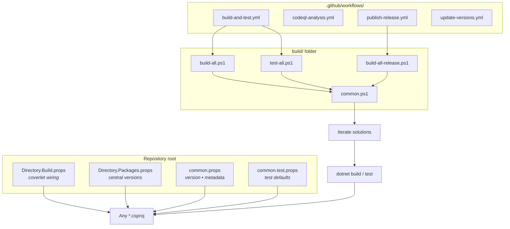

ABP's build system is *file‑based* and intentionally simple: a handful of MSBuild `.props` at the repository root configure every C# project; a handful of PowerShell scripts in `build/` drive `dotnet build` and `dotnet test` across the dozen+ solutions that make up the repo; and a small set of GitHub workflows in `.github/workflows/` run those same scripts on every PR. This page is the orientation map for the four entry points (`common.props`, `Directory.Build.props`, `Directory.Packages.props`, `common.test.props` at the repo root), the four driver scripts (`build/build-all.ps1`, `build/build-all-release.ps1`, `build/common.ps1`, `build/test-all.ps1`), and the eight CI workflows. Deeper detail lives at [Build & Release Overview](/build/overview) and [Build Scripts](/build/build-scripts).

<Info>
**Source roots referenced on this page.** Everything sits in the repository root or one folder deep:

- `common.props`, `Directory.Build.props`, `Directory.Packages.props`, `common.test.props` — repo root.
- `build/build-all.ps1`, `build/build-all-release.ps1`, `build/common.ps1`, `build/test-all.ps1` — solution drivers.
- `.github/workflows/*.yml` — eight CI workflows.

The CLI tool `abp` is *not* part of the build system; see [Studio](/cli/overview) for that.
</Info>

## The four root MSBuild files

Every C# project under `framework/`, `modules/`, `templates/`, and `test/` imports the same set of root‑level MSBuild files. They are evaluated *implicitly* by the .NET SDK (`Directory.Build.props`, `Directory.Packages.props`) or *explicitly* by a project's `<Import>` element (`common.props`, `common.test.props`).

| File                       | Purpose                                                          | How it's loaded            |
| -------------------------- | ---------------------------------------------------------------- | -------------------------- |
| `Directory.Build.props`    | Identifies test projects so coverlet is injected automatically   | Implicit, walks up the tree |
| `Directory.Packages.props` | Central package version pinning (`ManagePackageVersionsCentrally`) | Implicit                   |
| `common.props`             | Shared package metadata (`Version`, NuGet tags, source link)      | `<Import Project="...\common.props" />` |
| `common.test.props`        | Test‑project defaults (config files, runtime config)              | `<Import>` from test csprojs |

### `Directory.Build.props`

`Directory.Build.props` at the repo root is the *minimal* file that the .NET SDK loads for every project below it. ABP uses it for one job — flagging test projects:

```xml
<!-- Directory.Build.props -->
<Project>
  <PropertyGroup>
    <IsTestProject Condition="$(MSBuildProjectFullPath.Contains('test')) and ($(MSBuildProjectName.EndsWith('.Tests')) or $(MSBuildProjectName.EndsWith('.TestBase')))">true</IsTestProject>
  </PropertyGroup>

  <ItemGroup>
    <PackageReference Condition="'$(IsTestProject)' == 'true'" Include="coverlet.collector">
      <Version Condition="$(MSBuildProjectFullPath.Contains('templates'))">6.0.4</Version>
      <PrivateAssets>all</PrivateAssets>
      <IncludeAssets>runtime; build; native; contentfiles; analyzers</IncludeAssets>
    </PackageReference>
  </ItemGroup>
</Project>
```

Because the SDK walks up the directory tree for `Directory.Build.props`, **any** `*.Tests` or `*.TestBase` project below the repo root automatically gets `coverlet.collector` — there is no per‑project boilerplate.

### `Directory.Packages.props`

`Directory.Packages.props` switches the entire repo to [central package management](https://learn.microsoft.com/en-us/nuget/consume-packages/central-package-management):

```xml
<!-- Directory.Packages.props -->
<Project>
  <PropertyGroup>
    <ManagePackageVersionsCentrally>true</ManagePackageVersionsCentrally>
    <CentralPackageFloatingVersionsEnabled>true</CentralPackageFloatingVersionsEnabled>
  </PropertyGroup>
  <ItemGroup>
    <PackageVersion Include="AlibabaCloud.SDK.Dysmsapi20170525" Version="4.0.0" />
    <PackageVersion Include="Autofac" Version="8.4.0" />
    <PackageVersion Include="AutoMapper" Version="14.0.0" />
    ...
  </ItemGroup>
</Project>
```

Individual csprojs declare `<PackageReference Include="Autofac" />` *without* `Version=`; the version comes from this file. That is why every project in the monorepo is guaranteed to compile against the same package graph.

### `common.props`

`common.props` (repo root) is the *opinionated* file that every shipping package imports explicitly. Every `Volo.Abp.*.csproj` starts with two `<Import>` lines pointing here:

```xml
<!-- common.props (excerpt) -->
<Project>
  <PropertyGroup>
    <LangVersion>latest</LangVersion>
    <Version>10.0.1</Version>
    <LeptonXVersion>5.0.1</LeptonXVersion>
    <NoWarn>$(NoWarn);CS1591;CS0436</NoWarn>
    <PackageIconUrl>https://abp.io/assets/abp_nupkg.png</PackageIconUrl>
    <PackageProjectUrl>https://abp.io/</PackageProjectUrl>
    <PackageLicenseExpression>LGPL-3.0-only</PackageLicenseExpression>
    <RepositoryUrl>https://github.com/abpframework/abp/</RepositoryUrl>
    <PackageReadmeFile>NuGet.md</PackageReadmeFile>
    <GenerateDocumentationFile>true</GenerateDocumentationFile>
  </PropertyGroup>
  <ItemGroup>
    <PackageReference Include="Microsoft.SourceLink.GitHub">
      <PrivateAssets>all</PrivateAssets>
    </PackageReference>
  </ItemGroup>
  ...
</Project>
```

The `Version` element here is the single source of truth for the NuGet package version of *every* `Volo.Abp.*` package. The `<ItemGroup Condition="$(AssemblyName.EndsWith('HttpApi.Client'))">` block embeds `*generate-proxy.json` for client proxy assemblies — the same machinery covered in [Dynamic Client Proxies](/aspnetcore/mvc-controllers-and-conventions).

### `common.test.props`

`common.test.props` is the smaller sibling for test projects. Project files in `test/` and `*.Tests/` reference it explicitly:

```xml
<!-- common.test.props -->
<Project>
  <PropertyGroup>
    <LangVersion>latest</LangVersion>
    <NoWarn>$(NoWarn);CS1591;CS0436</NoWarn>
    <GenerateRuntimeConfigurationFiles>true</GenerateRuntimeConfigurationFiles>
    <GenerateAssemblyConfigurationAttribute>false</GenerateAssemblyConfigurationAttribute>
    <GenerateAssemblyCompanyAttribute>false</GenerateAssemblyCompanyAttribute>
    <GenerateAssemblyProductAttribute>false</GenerateAssemblyProductAttribute>
  </PropertyGroup>
</Project>
```

Together with `Directory.Build.props` (which adds coverlet automatically) this is everything a test csproj needs apart from its `<ProjectReference>` list.

## The PowerShell drivers in `build/`

`ls build/` shows the entire shipping driver set:

```
build/build-all-release.ps1
build/build-all.ps1
build/common.ps1
build/test-all.ps1
```

Four scripts, all dot‑sourcing a single shared file (`common.ps1`) that defines which solutions to iterate.

### `build/common.ps1` — the solution list

`build/common.ps1` defines `$solutionPaths` (relative paths to every `.sln` ABP ships) and switches between "dev mode" and "full mode" based on the `-f` argument:

```powershell
# build/common.ps1
$full = $args[0]
$rootFolder = (Get-Item -Path "./" -Verbose).FullName

# Dev mode: framework + the modules that change most often
$solutionPaths = @(
    "../framework",
    "../modules/basic-theme",
    "../modules/users",
    "../modules/permission-management",
    "../modules/setting-management",
    "../modules/feature-management",
    "../modules/identity",
    "../modules/identityserver",
    "../modules/openiddict",
    "../modules/tenant-management",
    "../modules/audit-logging",
    "../modules/background-jobs",
    "../modules/account",
    "../modules/cms-kit",
    "../modules/blob-storing-database"
)

if ($full -eq "-f") {
    # Full mode adds slower modules, templates, and source-code
    $solutionPaths += (
        "../modules/client-simulation",
        "../modules/virtual-file-explorer",
        "../modules/docs",
        "../modules/blogging",
        "../templates/module/aspnet-core",
        "../templates/app/aspnet-core",
        "../templates/console",
        "../templates/app-nolayers/aspnet-core",
        "../abp_io/AbpIoLocalization",
        "../source-code"
    )
    if ($env:OS -eq "Windows_NT") {
        $solutionPaths += "../templates/wpf"
    }
}
```

The "dev mode" warning is printed in red‑on‑yellow to remind you to pass `-f` before opening a release PR. See [Build Scripts](/build/build-scripts) for the full rationale.

### `build/build-all.ps1` — Debug compile of every solution

`build/build-all.ps1` dot‑sources `common.ps1` and runs `dotnet build` per solution:

```powershell
# build/build-all.ps1
$full = $args[0]
. ".\common.ps1" $full

foreach ($solutionPath in $solutionPaths) {
    $solutionAbsPath = (Join-Path $rootFolder $solutionPath)
    Set-Location $solutionAbsPath
    dotnet build
    if (-Not $?) {
        Write-Host ("Build failed for the solution: " + $solutionPath)
        Set-Location $rootFolder
        exit $LASTEXITCODE
    }
}
```

Two switches matter: pass nothing for dev mode (just the inner ring of modules), pass `-f` to compile everything including templates.

### `build/build-all-release.ps1` — Release compile with parallelism

`build/build-all-release.ps1` is the same loop with `--configuration Release -- /maxcpucount`. It's what the release pipeline calls before `nupkg/pack.ps1` packs NuGet packages:

```powershell
# build/build-all-release.ps1
. ".\common.ps1" -f

foreach ($solutionPath in $solutionPaths) {
    $solutionAbsPath = (Join-Path $rootFolder $solutionPath)
    Set-Location $solutionAbsPath
    dotnet build --configuration Release -- /maxcpucount
    if (-Not $?) {
        Write-Host ("Build failed for the solution: " + $solutionPath)
        Set-Location $rootFolder
        exit $LASTEXITCODE
    }
}
```

It hard‑codes `-f` because a release artifact must contain the templates.

### `build/test-all.ps1` — Run xUnit + collect coverage

`build/test-all.ps1` reuses `$solutionPaths` and runs `dotnet test` with the X‑Plat coverage collector that `Directory.Build.props` wired up:

```powershell
# build/test-all.ps1
$full = $args[0]
. ".\common.ps1" $full

foreach ($solutionPath in $solutionPaths) {
    $solutionAbsPath = (Join-Path $rootFolder $solutionPath)
    Set-Location $solutionAbsPath
    dotnet test --no-build --no-restore --collect:"XPlat Code Coverage"
    if (-Not $?) {
        Write-Host ("Test failed for the solution: " + $solutionPath)
        Set-Location $rootFolder
        exit $LASTEXITCODE
    }
}
```

`--no-build --no-restore` assumes you already ran `build-all.ps1`; this is exactly the order the CI workflow uses.

## End‑to‑end build flow



Read this as: the four root files configure each csproj implicitly; the four scripts batch‑drive every solution; the four headline workflows call those scripts.

## The GitHub workflows

`ls .github/workflows/` ships eight YAML files. They split into three buckets:

<CardGroup cols={2}>
  <Card title="Verification (run on PRs)" icon="vial">
    `build-and-test.yml`, `codeql-analysis.yml`, `labeler.yml`, `cancel-workflow.yml`.
  </Card>
  <Card title="Release & maintenance" icon="rocket">
    `publish-release.yml`, `update-versions.yml`, `auto-pr.yml`, `image-compression.yml`, `angular.yml`.
  </Card>
</CardGroup>

### `.github/workflows/build-and-test.yml`

This is the workflow that gates every PR. It installs PowerShell, sets up .NET 10, and shells out to the two driver scripts:

```yaml
# .github/workflows/build-and-test.yml (excerpt)
jobs:
  build-test:
    runs-on: ubuntu-22.04
    timeout-minutes: 50
    if: ${{ !github.event.pull_request.draft }}
    steps:
    - uses: jlumbroso/free-disk-space@main
    - uses: PSModule/install-powershell@v1
      with:
        Version: latest
    - uses: actions/checkout@v2
    - uses: actions/setup-dotnet@master
      with:
        dotnet-version: 10.0.x
    - name: Build All
      run: ./build-all.ps1
      working-directory: ./build
      shell: pwsh
    - name: Test All
      run: ./test-all.ps1
      working-directory: ./build
      shell: pwsh
    - name: Codecov
      uses: codecov/codecov-action@v2
```

The `paths:` filter at the top of the file restricts triggers to `framework/`, `modules/`, `templates/`, the root `Directory.*.props`, and the workflow file itself — doc‑only changes do not run the build.

### `.github/workflows/codeql-analysis.yml`

CodeQL static analysis on `dev` and every `rel-*` branch. The `paths:` filter looks at `*.cs`, `*.cshtml`, `*.csproj`, `*.razor`, `*.js` — i.e. compiled code — so it skips MDX edits.

### `.github/workflows/publish-release.yml`

Manually triggered (`workflow_dispatch`). Inputs are `tag_name`, `prerelease`, and `branchName`. It calls `actions/create-release@v1` and produces a GitHub Release; the actual NuGet/npm push is driven by `nupkg/push_packages.ps1` and `npm/publish-*.ps1` outside of this workflow (see [Deploy scripts](/build/deploy-scripts)).

### `.github/workflows/update-versions.yml`

Triggered on `release: published`. It bumps `latest-versions.json` (at the repo root) and opens a follow‑up PR — keeping the version that the template downloader uses in sync with the latest published release.

### Other workflows

<Accordion title="Per-workflow summary">
- `auto-pr.yml` — when `rel-10.0` is pushed, opens an automatic PR merging `dev` back, keeping the release branch evergreen.
- `cancel-workflow.yml` — cancels superseded runs to save CI minutes.
- `labeler.yml` — applies `pr-labeler` based on `.github/labeler.yml` rules.
- `image-compression.yml` — runs `calibreapp/image-actions` on PRs that touch images.
- `angular.yml` — runs Angular unit tests for the `npm/ng-packs` workspace; this is the only workflow that uses Node instead of dotnet.
</Accordion>

## How a contributor's PR flows through the system

<Steps>
  <Step title="Edit a csproj or .cs">
    Your csproj inherits `Directory.Build.props` and `Directory.Packages.props` automatically; if it's a shipping package, it also imports `common.props`. There is nothing to add by hand.
  </Step>
  <Step title="Push the branch">
    `build-and-test.yml` triggers if the diff touches one of the watched paths. `codeql-analysis.yml` triggers if the diff includes `.cs`, `.cshtml`, `.csproj`, `.razor`, or `.js`.
  </Step>
  <Step title="CI runs build-all.ps1">
    The job dot‑sources `build/common.ps1` (dev mode, no `-f`) and runs `dotnet build` against the inner ring of solutions.
  </Step>
  <Step title="CI runs test-all.ps1">
    Same loop, this time `dotnet test --no-build --no-restore` with X‑Plat coverage; results are uploaded by `codecov/codecov-action@v2`.
  </Step>
  <Step title="Release branch merge">
    `auto-pr.yml` keeps `rel-10.0` synced with `dev`. When a maintainer triggers `publish-release.yml`, a tag is created; `update-versions.yml` then refreshes `latest-versions.json`.
  </Step>
</Steps>

## Common tasks

<Tabs>
  <Tab title="Build the whole repo locally">
    ```pwsh
    cd build
    ./build-all.ps1 -f
    ```
    Dev mode (no `-f`) is faster and covers the modules you most often edit; full mode mirrors CI plus templates.
  </Tab>
  <Tab title="Run every test">
    ```pwsh
    cd build
    ./test-all.ps1 -f
    ```
    Same solution iteration as `build-all.ps1`; coverage XMLs land per project and Codecov picks them up in CI.
  </Tab>
  <Tab title="Release‑configuration build">
    ```pwsh
    cd build
    ./build-all-release.ps1
    ```
    Hard‑coded `-f`. This is exactly the command that precedes `nupkg/pack.ps1` during a release.
  </Tab>
  <Tab title="Bump a NuGet version">
    Open `common.props` at the repo root and edit `<Version>`. That single change propagates to every `Volo.Abp.*.csproj` because they all `<Import Project="...\common.props" />`.
  </Tab>
</Tabs>

## Where to look for what

<Accordion title="Cheat sheet">
| If you want to…                                  | Open                                                |
| ------------------------------------------------ | --------------------------------------------------- |
| Bump every shipping package version              | `common.props` (`<Version>`)                        |
| Add a new NuGet dependency, repo‑wide            | `Directory.Packages.props` (`<PackageVersion …>`)   |
| Add coverlet to a new test framework             | already automatic via `Directory.Build.props`       |
| Add a solution to the dev iteration              | `build/common.ps1` (`$solutionPaths`)               |
| Add a solution that should *only* run in `-f`    | `build/common.ps1` (under `if ($full -eq "-f")`)    |
| Change what CI runs on PRs                       | `.github/workflows/build-and-test.yml`              |
| Change what CodeQL scans                         | `.github/workflows/codeql-analysis.yml` (paths)     |
| Cut a release                                    | `.github/workflows/publish-release.yml` (dispatch)  |
</Accordion>

## What's next

<CardGroup cols={2}>
  <Card title="Build & Release Overview" icon="layer-group" href="/build/overview">
    The page‑level overview of `build/`, `deploy/`, `nupkg/`, and `npm/` — the four release folders.
  </Card>
  <Card title="Build Scripts" icon="terminal" href="/build/build-scripts">
    Per‑script reference for `build-all.ps1`, `build-all-release.ps1`, `common.ps1`, `test-all.ps1` with their parameters.
  </Card>
  <Card title="CI & Versioning" icon="code-branch" href="/build/ci-and-versioning">
    Branch model, version bumping (`update-versions.yml`), and how `latest-versions.json` flows back into templates.
  </Card>
  <Card title="Repository Layout" icon="folder-tree" href="/overview/repository-layout">
    What lives in `framework/`, `modules/`, `templates/`, `test/`, `tools/`, etc.
  </Card>
</CardGroup>
