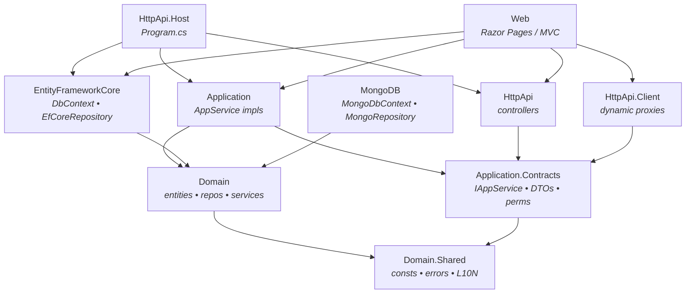

ABP applications follow a deliberate, opinionated layered structure. Every solution produced by the [`templates/app/aspnet-core`](https://github.com/abpframework/abp/tree/dev/templates/app/aspnet-core) template ships with the same ten‑plus projects, each with a fixed suffix (`.Domain.Shared`, `.Domain`, `.Application.Contracts`, `.Application`, `.EntityFrameworkCore`, `.MongoDB`, `.HttpApi`, `.HttpApi.Client`, `.HttpApi.Host`, `.Web`) and a fixed direction of dependencies. This page walks each layer using the concrete files under `templates/app/aspnet-core/src/` so you can map every concept directly to source code, then explains the dependency rules that make those projects compose into a working modular monolith. The same suffixes appear inside every framework module — see for example [`modules/identity/src/`](https://github.com/abpframework/abp/tree/dev/modules/identity/src) and the per‑layer pages such as [Identity Domain](/modules/identity/domain), [Identity EF Core](/modules/identity/efcore), and [Identity MongoDB](/modules/identity/mongodb).

<Info>
**Source root for everything on this page.** The reference solution is `templates/app/aspnet-core/`. The 23 projects under `templates/app/aspnet-core/src/` (listed below) are what `abp new` instantiates for a layered MVC / Blazor / Angular solution. The `MyCompanyName.MyProjectName.*` prefix is a token replaced by the CLI; the suffix after the first dot is what matters and never changes.
</Info>

## Why a layered structure at all?

Every ABP module — and every application built with ABP — is a small graph of assemblies wired together by [modularity](/core/modularity) and [DependsOn](/overview/architecture). The layered structure exists to enforce three rules that are invisible at runtime but critical at compile time:

1.  **Contracts travel outward, implementations stay inward.** `*.Application.Contracts` and `*.HttpApi.Client` are referenced by *consumers*; the concrete `*.Application` and `*.HttpApi` are referenced only by hosts. This is what enables ABP's [Dynamic C# HTTP API Client Proxies](/aspnetcore/mvc-controllers-and-conventions).
2.  **Persistence is pluggable.** `*.EntityFrameworkCore` and `*.MongoDB` are siblings, never dependencies of each other; the `*.Domain` project knows nothing about either. See [EF Core](/data/entityframeworkcore) and [MongoDB](/data/mongodb).
3.  **Localization and constants live on the outside.** `*.Domain.Shared` carries `Consts`, error codes, enums, and localization resources, so both client and server can reference them without dragging in EF Core or MVC.

The pattern is identical for application‑level projects (`MyCompanyName.MyProjectName.*`) and for framework module projects (`Volo.Abp.<ModuleName>.*`). The same eight‑to‑twelve‑project shape repeats everywhere.

## The projects in `templates/app/aspnet-core/src/`

`ls templates/app/aspnet-core/src/` enumerates the canonical set:

| Project folder                                              | Role                                                      |
| ----------------------------------------------------------- | --------------------------------------------------------- |
| `MyCompanyName.MyProjectName.Domain.Shared`                 | Constants, error codes, enums, localization, shared DTOs   |
| `MyCompanyName.MyProjectName.Domain`                        | Entities, aggregates, domain services, repositories       |
| `MyCompanyName.MyProjectName.Application.Contracts`         | Application service *interfaces*, DTOs, permission defs   |
| `MyCompanyName.MyProjectName.Application`                   | `IApplicationService` implementations, AutoMapper profiles |
| `MyCompanyName.MyProjectName.EntityFrameworkCore`           | `DbContext`, EF Core repositories, migrations             |
| `MyCompanyName.MyProjectName.MongoDB`                       | `MongoDbContext`, MongoDB repositories                    |
| `MyCompanyName.MyProjectName.HttpApi`                       | API controllers — usually `ApiController` shims           |
| `MyCompanyName.MyProjectName.HttpApi.Client`                | Dynamic client proxies for the public HTTP API            |
| `MyCompanyName.MyProjectName.HttpApi.Host`                  | Stand‑alone API host (`Program.cs`)                       |
| `MyCompanyName.MyProjectName.HttpApi.HostWithIds`           | API + bundled IdentityServer/OpenIddict variant           |
| `MyCompanyName.MyProjectName.Web`                           | MVC / Razor Pages UI                                      |
| `MyCompanyName.MyProjectName.Web.Host`                      | Standalone Web host (tiered scenario)                     |
| `MyCompanyName.MyProjectName.Blazor` *(several variants)*   | Blazor WASM / Server / WebApp UIs                         |
| `MyCompanyName.MyProjectName.AuthServer`                    | OpenIddict auth server (tiered)                           |
| `MyCompanyName.MyProjectName.DbMigrator`                    | Console app for `dotnet run` migrations + seeding         |

The non‑UI core — `Domain.Shared`, `Domain`, `Application.Contracts`, `Application`, one persistence project, `HttpApi`, `HttpApi.Client`, and one host — is always present. The Blazor and tiered host variants are optional and are filtered out by the `abp new` template parameters.

## Dependency direction

The single most important picture for an ABP solution is which arrow points in which direction.



Read this as: **a project may reference any project it has an arrow to, and no others.** `Domain` references only `Domain.Shared`; `Application` references `Application.Contracts` and `Domain`; `EntityFrameworkCore` references `Domain` (never `Application`); hosts compose everything they need at the edge.

<Note>
`EntityFrameworkCore` and `MongoDB` are **mutually exclusive at runtime** but **not exclusive in the repo** — both projects exist, both compile, and a deployment picks one by referencing it from its `HttpApi.Host` (or equivalent). The CLI tooling strips the unused one from generated solutions.
</Note>

## `Domain.Shared` — the outermost ring

`templates/app/aspnet-core/src/MyCompanyName.MyProjectName.Domain.Shared/` ships with:

- `MyProjectNameDomainSharedModule.cs` — the module class.
- `MyProjectNameDomainErrorCodes.cs` — string constants used by `BusinessException`.
- `MyProjectNameGlobalFeatureConfigurator.cs`, `MyProjectNameModuleExtensionConfigurator.cs` — extension hooks.
- `Localization/` — embedded `*.json` localization files.
- `MultiTenancy/` — tenant‑related shared constants.

The module declaration in `templates/app/aspnet-core/src/MyCompanyName.MyProjectName.Domain.Shared/MyProjectNameDomainSharedModule.cs` lists every `*DomainSharedModule` it depends on — the *shared* projects from the framework modules:

```csharp
[DependsOn(
    typeof(AbpAuditLoggingDomainSharedModule),
    typeof(AbpBackgroundJobsDomainSharedModule),
    typeof(AbpFeatureManagementDomainSharedModule),
    typeof(AbpIdentityDomainSharedModule),
    typeof(AbpOpenIddictDomainSharedModule),
    typeof(AbpPermissionManagementDomainSharedModule),
    typeof(AbpSettingManagementDomainSharedModule),
    typeof(AbpTenantManagementDomainSharedModule)
)]
public class MyProjectNameDomainSharedModule : AbpModule
{
    public override void PreConfigureServices(ServiceConfigurationContext context) { ... }
    public override void ConfigureServices(ServiceConfigurationContext context) { ... }
}
```

<Note>
Because `Domain.Shared` is the bottom of the graph, anything you put here ends up referenced by every other layer — including UI projects. Use it for **plain constants and types**, never for EF Core or MVC types.
</Note>

## `Domain` — entities, repositories, domain services

`templates/app/aspnet-core/src/MyCompanyName.MyProjectName.Domain/` holds:

- `MyProjectNameDomainModule.cs` — declares dependencies on `*DomainModule` projects.
- `MyProjectNameConsts.cs` — domain constants such as default DB schema.
- `Data/` — `IDataSeedContributor` implementations.
- `OpenIddict/`, `Settings/` — domain‑level configuration for module integrations.

The module class in `templates/app/aspnet-core/src/MyCompanyName.MyProjectName.Domain/MyProjectNameDomainModule.cs` pulls in every `*DomainModule` plus `MyProjectNameDomainSharedModule`. The repository interfaces declared here (e.g. `IBookRepository`) are paired with EF Core or MongoDB implementations in the persistence projects, never in this one. See [Repositories](/ddd/repositories) for the contract / implementation split.

## `Application.Contracts` — the public surface for clients

`templates/app/aspnet-core/src/MyCompanyName.MyProjectName.Application.Contracts/` is the smallest project that *consumers* of your application service can reference:

- `MyProjectNameApplicationContractsModule.cs` — the module class.
- `MyProjectNameDtoExtensions.cs` — extension property registrations for DTOs (`Configure` is called from `PreConfigureServices`).
- `Permissions/` — `MyProjectNamePermissions` constants and a `MyProjectNamePermissionDefinitionProvider` that declares the permission tree.

The module declaration is short and pulls in every `*ApplicationContractsModule` it needs:

```csharp
// templates/app/aspnet-core/src/MyCompanyName.MyProjectName.Application.Contracts/MyProjectNameApplicationContractsModule.cs
[DependsOn(
    typeof(MyProjectNameDomainSharedModule),
    typeof(AbpAccountApplicationContractsModule),
    typeof(AbpFeatureManagementApplicationContractsModule),
    typeof(AbpIdentityApplicationContractsModule),
    typeof(AbpPermissionManagementApplicationContractsModule),
    typeof(AbpSettingManagementApplicationContractsModule),
    typeof(AbpTenantManagementApplicationContractsModule),
    typeof(AbpObjectExtendingModule)
)]
public class MyProjectNameApplicationContractsModule : AbpModule
{
    public override void PreConfigureServices(ServiceConfigurationContext context)
    {
        MyProjectNameDtoExtensions.Configure();
    }
}
```

<Note>
Because `Application.Contracts` references only `Domain.Shared`, you can ship its NuGet package to client tools (Blazor WebAssembly, MAUI, Angular, etc.) without leaking EF Core or your `Domain` aggregates.
</Note>

## `Application` — orchestration over `Domain`

`templates/app/aspnet-core/src/MyCompanyName.MyProjectName.Application/` contains:

- `MyProjectNameApplicationModule.cs` (depends on `MyProjectNameApplicationContractsModule` and `MyProjectNameDomainModule`).
- `MyProjectNameAppService.cs` — common base class derived from `ApplicationService`.
- `MyProjectNameAutoMapperProfile.cs` — DTO ↔ entity mappings.
- One application service per aggregate, implementing the interfaces from `Application.Contracts`.

This is the only layer that has *both* `Domain` and the contracts on its references, which is why it is the right place to orchestrate aggregates, raise events, and shape DTOs.

## Persistence siblings: `EntityFrameworkCore` and `MongoDB`

`templates/app/aspnet-core/src/MyCompanyName.MyProjectName.EntityFrameworkCore/` and `templates/app/aspnet-core/src/MyCompanyName.MyProjectName.MongoDB/` are *siblings* — each references `Domain` and provides the concrete repositories that fulfil interfaces declared there. Pick one per deployment.

<Tabs>
  <Tab title="EntityFrameworkCore">
    Contains `MyProjectNameDbContext`, `MyProjectNameDbContextModelCreatingExtensions`, EF Core `IBookRepository` implementations, and Migrations. The module wires the DbContext via `AddAbpDbContext`. See [Identity EF Core](/modules/identity/efcore) for a worked example of the same pattern inside a framework module.
  </Tab>
  <Tab title="MongoDB">
    Contains `MyProjectNameMongoDbContext`, the `IBookRepository` implementations on top of `MongoDbRepository`, and the module's `AddMongoDbContext`. See [Identity MongoDB](/modules/identity/mongodb) for a worked example.
  </Tab>
</Tabs>

Because `Domain` is the only project they both reference, *swapping persistence is purely a host‑level decision*: change which `*DbContextModule` your `HttpApi.Host` depends on, and nothing in `Domain` or `Application` changes.

## `HttpApi` and `HttpApi.Client` — symmetric API pairs

`templates/app/aspnet-core/src/MyCompanyName.MyProjectName.HttpApi/` ships the server‑side controllers — usually thin wrappers that delegate to application services and exist mostly to set route templates. `templates/app/aspnet-core/src/MyCompanyName.MyProjectName.HttpApi.Client/` ships the *client* side: dynamic proxy registrations driven by `Application.Contracts` interfaces and the [Dynamic C# HTTP API Client Proxies](/aspnetcore/mvc-controllers-and-conventions) machinery.

The pair is symmetric: any caller that references `HttpApi.Client` can `IBookAppService` over HTTP, and any host that references `HttpApi` exposes the same interface as controllers. That symmetry is what makes ABP solutions reshape from "single host" to "microservices" without rewriting application code.

## Hosts: `HttpApi.Host`, `Web`, `Blazor.*`, `AuthServer`

A *host* is a project with a `Program.cs`. Hosts pull every layer they need together:

- `templates/app/aspnet-core/src/MyCompanyName.MyProjectName.HttpApi.Host/MyProjectNameHttpApiHostModule.cs` — references `HttpApi`, `Application`, and the chosen persistence project.
- `templates/app/aspnet-core/src/MyCompanyName.MyProjectName.Web/` — references `HttpApi`, `Application`, persistence, plus `Volo.Abp.AspNetCore.Mvc.UI.Theme.LeptonXLite` for the UI.
- `templates/app/aspnet-core/src/MyCompanyName.MyProjectName.Blazor*/` — Blazor variants; see [Blazor overview](/blazor/overview).
- `templates/app/aspnet-core/src/MyCompanyName.MyProjectName.AuthServer/` — present in tiered solutions; hosts OpenIddict.
- `templates/app/aspnet-core/src/MyCompanyName.MyProjectName.DbMigrator/` — console host that runs `IDataSeeder` and EF Core migrations.

Each host has its own `appsettings.json`, its own DI composition root, and its own `[DependsOn]` chain.

## Test projects mirror the layout

`ls templates/app/aspnet-core/test/` gives the test counterparts:

```
MyCompanyName.MyProjectName.Application.Tests
MyCompanyName.MyProjectName.Domain.Tests
MyCompanyName.MyProjectName.EntityFrameworkCore.Tests
MyCompanyName.MyProjectName.HttpApi.Client.ConsoleTestApp
MyCompanyName.MyProjectName.MongoDB.Tests
MyCompanyName.MyProjectName.TestBase
MyCompanyName.MyProjectName.Web.Tests
```

Each `*.Tests` project mirrors a `src` project and shares the `MyCompanyName.MyProjectName.TestBase` foundation. See [Testing](/testing/overview) for the test base modules.

## Mapping to framework modules

Every framework module ships its own copy of this layered shape under `modules/<name>/src/`:

<CardGroup cols={2}>
  <Card title="Identity" icon="user-shield" href="/modules/identity/overview">
    `modules/identity/src/Volo.Abp.Identity.Domain.Shared`, `…Domain`, `…Application.Contracts`, `…Application`, `…EntityFrameworkCore`, `…MongoDB`, `…HttpApi`, `…HttpApi.Client`, `…Web`, `…Blazor`, `…AspNetCore`.
  </Card>
  <Card title="Tenant Management" icon="building" href="/modules/tenant-management/overview">
    `modules/tenant-management/src/Volo.Abp.TenantManagement.*` — same eleven suffixes.
  </Card>
  <Card title="Permission Management" icon="key" href="/modules/permission-management/overview">
    `modules/permission-management/src/Volo.Abp.PermissionManagement.*` — same shape with extra `Identity` and `OpenIddict` adapter projects.
  </Card>
  <Card title="Audit Logging" icon="scroll" href="/modules/audit-logging/overview">
    `modules/audit-logging/src/Volo.Abp.AuditLogging.*` — minimal subset (no UI).
  </Card>
</CardGroup>

## Per‑layer cheat sheet

<Accordion title="Where do I put X?">
| Concern                                  | Layer                              |
| ---------------------------------------- | ---------------------------------- |
| Localization JSON, error codes, enums    | `Domain.Shared`                    |
| Entity, aggregate, domain service        | `Domain`                           |
| Repository interface                     | `Domain`                           |
| Repository implementation (EF Core)      | `EntityFrameworkCore`              |
| Repository implementation (MongoDB)      | `MongoDB`                          |
| DTO, application service interface       | `Application.Contracts`            |
| Permission name constants & providers    | `Application.Contracts`            |
| Application service class, AutoMapper    | `Application`                      |
| API controller                           | `HttpApi`                          |
| Dynamic client proxy registration        | `HttpApi.Client`                   |
| `Program.cs`, `appsettings.json`         | `HttpApi.Host` / `Web` / `Blazor*` |
| EF Core migrations                       | `EntityFrameworkCore`              |
| `IDataSeedContributor`                   | `Domain`                           |
| Run‑on‑deploy console seeding/migrating  | `DbMigrator`                       |
</Accordion>

<Accordion title="Allowed references at a glance">
- `Domain.Shared` → *nothing in this solution* (only framework `*DomainShared` modules).
- `Domain` → `Domain.Shared`.
- `Application.Contracts` → `Domain.Shared`.
- `Application` → `Application.Contracts`, `Domain`.
- `EntityFrameworkCore` → `Domain`.
- `MongoDB` → `Domain`.
- `HttpApi` → `Application.Contracts`.
- `HttpApi.Client` → `Application.Contracts`.
- `HttpApi.Host` → `HttpApi`, `Application`, persistence.
- `Web` → `HttpApi.Client` *or* `HttpApi`, `Application`, persistence (depending on tiered vs single‑host).
</Accordion>

## How the modular monolith composes layered solutions

Every project above is an `AbpModule`. The startup module of a host (e.g. `MyProjectNameHttpApiHostModule`) declares `[DependsOn]` on its sibling modules; the [ModuleLoader](/core/modularity) topologically sorts them and runs `PreConfigureServices` / `ConfigureServices` / `OnApplicationInitialization` in dependency order. The layered structure exists to make that graph *predictable* — the rule of thumb is that a module's `[DependsOn]` should look exactly like its `.csproj` `ProjectReference` list.

For the runtime side of this story see [Architecture](/overview/architecture) (lifecycle, contributors, request path). For the *file* layout of the whole repo see [Repository Layout](/overview/repository-layout). For module / project naming details see [Solution Conventions](/overview/solution-conventions).

## What's next

<CardGroup cols={2}>
  <Card title="Architecture & Lifecycle" icon="diagram-project" href="/overview/architecture">
    How the modules above boot together — `AbpApplicationBase`, `ModuleManager`, `IOnApplicationInitialization`.
  </Card>
  <Card title="Solution Conventions" icon="rulers" href="/overview/solution-conventions">
    Naming rules, `.abppkg` / `.abppkg.analyze.json` files, csproj patterns.
  </Card>
  <Card title="Build System" icon="gears" href="/overview/build-system">
    How `templates/app/aspnet-core` is compiled and tested in CI via the `build/` scripts.
  </Card>
  <Card title="DDD Building Blocks" icon="cubes" href="/ddd/overview">
    The `Domain.Shared`, `Domain`, `Application.Contracts`, `Application` pages explain each ring in detail.
  </Card>
</CardGroup>
