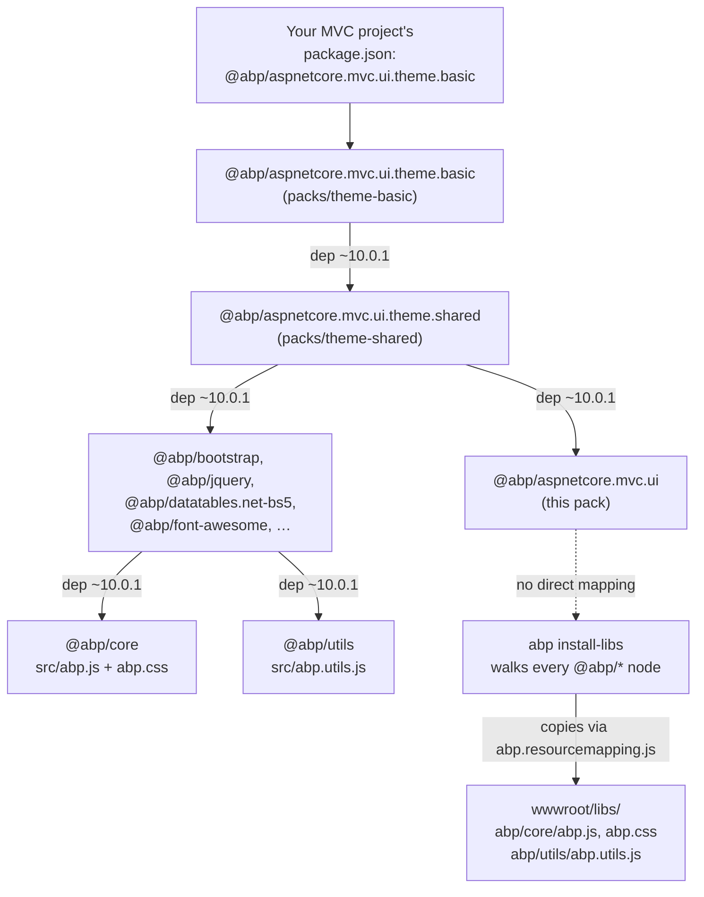
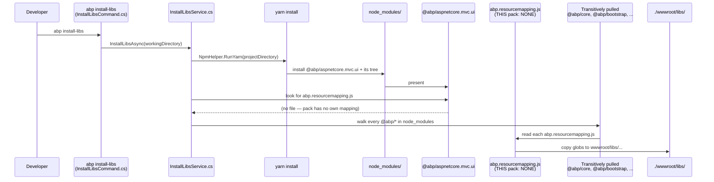

`npm/packs/aspnetcore.mvc.ui/` is the **client-side anchor pack** for the MVC UI. It is published to npm as `@abp/aspnetcore.mvc.ui`, declared as a dependency of `@abp/aspnetcore.mvc.ui.theme.shared`, and is the place ABP keeps the *client* side of its MVC UI helpers (the `abp.js`, `abp.utils.js`, `abp.jquery.js` family that every Razor page expects on the window).

It is a "thin pack" — at this version it carries no `src/` of its own and no `abp.resourcemapping.js`. Its job is purely **dependency anchoring**: ensuring `ansi-colors` (used by ABP's build scripts) is on the dependency graph and that the pack is published in lock-step with the C# `Volo.Abp.AspNetCore.Mvc.UI` package. The actual `abp.js` / `abp.utils.js` files are owned by the sibling packs **`@abp/core`** (`abp.js`, `abp.css`) and **`@abp/utils`** (`abp.utils.js`), which the `theme.shared` graph pulls in transitively — see [packs/jquery-and-utilities](/packs/jquery-and-utilities) and [packs/theme-shared](/packs/theme-shared) for the call chain.

## File layout

```
npm/packs/aspnetcore.mvc.ui/
├── README.md
├── package.json
└── package-lock.json
```

That is the complete file list. The package is intentionally minimal because in ABP's split:

- the **C# tag helpers, view components, `IAbpClientScriptService`, anti-forgery middleware** live in `framework/src/Volo.Abp.AspNetCore.Mvc.UI/` and `Volo.Abp.AspNetCore.Mvc.UI.Bootstrap`/`Volo.Abp.AspNetCore.Mvc.UI.Bundling`/`Volo.Abp.AspNetCore.Mvc.UI.Packages` (see [aspnetcore/mvc-ui-packages](/aspnetcore/mvc-ui-packages));
- the **client-side runtime** (`abp.js`, `abp.css`, `abp.utils`) lives in the lower-level `@abp/core` and `@abp/utils` packs.

`@abp/aspnetcore.mvc.ui` exists so the *name* of the C# library has a 1:1 client-side counterpart on npm.

## `package.json`

```json
{
  "version": "10.0.1",
  "name": "@abp/aspnetcore.mvc.ui",
  "repository": {
    "type": "git",
    "url": "https://github.com/abpframework/abp.git",
    "directory": "npm/packs/aspnetcore.mvc.ui"
  },
  "publishConfig": { "access": "public" },
  "dependencies": {
    "ansi-colors": "^4.1.3"
  },
  "gitHead": "bb4ea17d5996f01889134c138d00b6c8f858a431",
  "homepage": "https://abp.io",
  "license": "LGPL-3.0",
  "keywords": [
    "aspnetcore", "boilerplate", "framework", "web", "best-practices",
    "angular", "maui", "blazor", "mvc", "csharp", "webapp"
  ]
}
```

Key facts:

- **Scope:** `@abp/aspnetcore.mvc.ui` — the canonical client-side counterpart to the `Volo.Abp.AspNetCore.Mvc.UI` NuGet package.
- **`access: public`** — npm scoped packages default to private; ABP explicitly publishes this one as public.
- **`ansi-colors ^4.1.3`** — the only runtime dependency. Used by the ABP build/install scripts that consume this package transitively.
- **`directory`** — points back to this folder inside the monorepo so npmjs.org's "source" link resolves correctly.

## The role on the dependency graph



Because every other `@abp/<lib>` pack lists `@abp/core` (and many list `@abp/utils`) as a dependency, those files always make it to `wwwroot/libs/abp/core/`. `@abp/aspnetcore.mvc.ui` is therefore *not* the carrier of `abp.js` — it is the **named placeholder** that makes the graph topology match the C# module topology.

## The ABP client runtime it represents

`@abp/aspnetcore.mvc.ui`'s reason to exist is the **client-side UI helpers** every ABP MVC page expects. Those files are owned by the sibling packs but consumed *through* a chain rooted here:

- **`abp.js`** — the global `abp` object: `abp.appPath`, `abp.log`, `abp.notify`, `abp.message`, `abp.ui.block/unblock`, `abp.event.on/trigger`, the auto-paths and `abp.toAbsAppPath` helpers. Implemented in:

  ```
  npm/packs/core/src/abp.js
  ```

  Shipped via `@abp/core`'s `abp.resourcemapping.js`:

  ```js
  // npm/packs/core/abp.resourcemapping.js
  module.exports = {
      mappings: {
          "@node_modules/@abp/core/src/*": "@libs/abp/core/"
      }
  }
  ```

  Excerpt from `abp.js` (`npm/packs/core/src/abp.js`):

  ```js
  var abp = abp || {};
  (function () {

      /* Application paths *****************************************/

      //Current application root path (including virtual directory if exists).
      var baseElement = document.querySelector('base');
      var baseHref = baseElement ? baseElement.getAttribute('href') : null;
      abp.appPath = baseHref || abp.appPath || '/';

      abp.pageLoadTime = new Date();

      //Converts given path to absolute path using abp.appPath variable.
      abp.toAbsAppPath = function (path) {
          if (path.indexOf('/') == 0) {
              path = path.substring(1);
          }
          return abp.appPath + path;
      };

      /* LOGGING ***************************************************/
      //Implements Logging API that provides secure & controlled usage of console.log

      abp.log = abp.log || {};

      abp.log.levels = {
          DEBUG: 1,
          INFO: 2,
          WARN: 3,
          // ...
      };
  })();
  ```

- **`abp.utils.js`** — DOM and URL utility belt. Implemented in `npm/packs/utils/src/` and shipped via `@abp/utils`. See [packs/jquery-and-utilities](/packs/jquery-and-utilities).

- **`abp.css`** — the framework's neutral base styles (loading overlays, message boxes, RTL flips). Shipped together with `abp.js` from `@abp/core`.

These three files are the **only** ones every ABP MVC view truly requires; everything else (Bootstrap, jQuery, DataTables) is optional but conventional.

## Matching C# package

In the C# tree the equivalent module is:

```
framework/src/Volo.Abp.AspNetCore.Mvc.UI/
├── AbpAspNetCoreMvcUiModule.cs
├── Volo/Abp/AspNetCore/Mvc/UI/
│   ├── Bundling/                # IBundleContributor / IScriptBundleContributor / IStyleBundleContributor base
│   ├── Theming/                 # IThemeManager, ThemeOptions
│   ├── Branding/                # IBrandingProvider
│   ├── Bootstrap/               # AbpButtonTagHelper, AbpAlertTagHelper, … (Bootstrap-aware tag helpers)
│   └── Layout/                  # ILayoutHookManager
└── …
```

There is also a **dedicated packaging module** — `Volo.Abp.AspNetCore.Mvc.UI.Packages` — that contains one `*ScriptContributor` / `*StyleContributor` per third-party library. See [aspnetcore/mvc-ui-packages](/aspnetcore/mvc-ui-packages) for the catalogue. Each contributor's `AddFiles("/libs/<x>/...")` calls target files staged by an `@abp/<x>` pack documented in this section.

## How `abp install-libs` treats this pack



`InstallLibsService` does **not** require every `@abp/<x>` pack to have an `abp.resourcemapping.js` — it simply skips those that don't. `@abp/aspnetcore.mvc.ui` is one such "graph node, no payload" pack.

## What `abp.utils.js` looks like

Just as `@abp/core` ships `abp.js`, `@abp/utils` ships `abp.utils.js`. Together they make up the **client runtime** that the wider `aspnetcore.mvc.ui` family represents.

`@abp/utils` lives at `npm/packs/utils/`:

```
npm/packs/utils/
├── package.json
├── abp.resourcemapping.js
├── angular.json
├── jest.config.js
├── ngcc.config.js
├── projects/                        # Angular-style sub-projects (build infra)
├── tsconfig.base.json
├── tsconfig.json
├── tslint.json
└── ...
```

Unlike most packs, `@abp/utils` has a small TypeScript build pipeline (`angular.json` + `tsconfig.*` + `jest.config.js`) — its sources are typed and tested. The publish step produces a `dist/` that the resource mapping then exposes to consumers.

The corresponding entry on the C# bundle side is `Volo.Abp.AspNetCore.Mvc.UI.Packages.Utils.UtilsScriptContributor` — it adds `/libs/abp/utils/abp.utils.js` to whichever bundle includes the `Core` contributor (the `Global` bundle does, via `Volo.Abp.AspNetCore.Mvc.UI.Theme.Shared`).

`abp.utils.js` provides:

- **URL helpers** — `abp.utils.formatString`, `abp.utils.replaceAll`, `abp.utils.toPascalCase`.
- **Cookie helpers** — `abp.utils.setCookieValue`, `abp.utils.getCookieValue`, `abp.utils.deleteCookie`. Used by the language switcher and anti-forgery cookie reads.
- **Anti-forgery token discovery** — `abp.security.antiForgery.getToken()` and the matching `__RequestVerificationToken` header injection used by `abp.ajax` (defined in `abp.js`) and by `abp.libs.datatables` (defined in the DataTables shim).
- **Tiny RTL helpers** — `abp.localization.isRtl(culture)` is invoked by the Bootstrap RTL bundle decision.

These three (`abp.js`, `abp.css`, `abp.utils.js`) are the **only files genuinely required** for an ABP MVC page to function at runtime. Everything else (Bootstrap, jQuery, DataTables, Font Awesome) is presentational.

## How a new "ABP UI helper" file is added

For symmetry with the wider documentation, the actual procedure to extend the ABP client runtime:

<Steps>
  <Step title="Decide where">
    - DOM/URL helper with no jQuery dependency → `npm/packs/utils/src/`.
    - High-level UI (`abp.ui.block`, `abp.message`, …) → `npm/packs/core/src/abp.js`.
    - jQuery-coupled bridge → its own pack under `npm/packs/<name>/src/`.
  </Step>
  <Step title="Add the file">
    e.g. `npm/packs/core/src/abp.notify.js`. The existing `abp.resourcemapping.js` already says `@node_modules/@abp/core/src/*` → `@libs/abp/core/`, so the file is staged automatically.
  </Step>
  <Step title="Register a contributor">
    In `Volo.Abp.AspNetCore.Mvc.UI.Packages/Volo/Abp/AspNetCore/Mvc/UI/Packages/Core/CoreScriptContributor.cs`, add `context.Files.AddIfNotContains("/libs/abp/core/abp.notify.js")`.
  </Step>
  <Step title="Re-publish">
    Bump `@abp/core`'s patch version, run `npm/publish-mvc.ps1`, and consumers receive the new file at their next `yarn install` + `abp install-libs`.
  </Step>
</Steps>

## When you'd interact with this pack directly

You almost never list `@abp/aspnetcore.mvc.ui` in your own project's `package.json` — it arrives transitively via `@abp/aspnetcore.mvc.ui.theme.basic` → `@abp/aspnetcore.mvc.ui.theme.shared` → here. There are two situations where the explicit name matters:

1. **Building a custom theme pack.** If you're publishing `@yourorg/aspnetcore.mvc.ui.theme.custom`, mirror what `theme.shared`/`theme.basic` do (see those pages) and list `@abp/aspnetcore.mvc.ui` as a peer/version-pinned dependency so the same client-runtime version is used.
2. **Diagnosing a version mismatch.** When `yarn list @abp/aspnetcore.mvc.ui` shows two versions in the tree (e.g. consumer pinned a newer `theme.shared` than your custom module exposed), the unify-fix is to update either the upstream theme dep or your own peer dep.

## Field-by-field walkthrough of `package.json`

| Field | Value | Why |
| --- | --- | --- |
| `name` | `@abp/aspnetcore.mvc.ui` | npm-scoped name, lowercase, dot-separated to mirror the C# namespace `Volo.Abp.AspNetCore.Mvc.UI`. |
| `version` | `10.0.1` | Bumped in lock-step with every `@abp/*` pack by `npm/lerna.json`. |
| `repository.directory` | `npm/packs/aspnetcore.mvc.ui` | Makes the "source" link on npmjs.org resolve to *this* folder, not the repo root. |
| `publishConfig.access` | `public` | Required so scoped packages publish without `--access=public` at the CLI. |
| `dependencies.ansi-colors` | `^4.1.3` | The only direct runtime dep. Used by ABP's build/install helpers that pull this pack transitively. |
| `gitHead` | release commit SHA | npm records this automatically on publish; useful for diffing two npm releases against the monorepo. |
| `homepage` | `https://abp.io` | Standard. |
| `license` | `LGPL-3.0` | Same license as the ABP framework itself. |
| `keywords` | `aspnetcore`, `blazor`, `mvc`, … | npm search hints. |

There is intentionally no `main`, no `module`, no `exports`, no `types`, no `scripts.build`. The pack is not meant to be `import`-ed; it exists to (a) be installed and (b) anchor the dependency graph.

## Common confusions and answers

- **"Why is `abp.js` not in this pack?"** — Because it lives in `@abp/core` and is shared between the MVC UI and Blazor Server. Putting it in `@abp/aspnetcore.mvc.ui` would force Blazor Server consumers to pull in this MVC-flavoured graph just to get the runtime.
- **"Why does the pack exist at all if it has no payload?"** — Naming parity. Every `Volo.Abp.AspNetCore.Mvc.UI*` C# package has a matching `@abp/aspnetcore.mvc.ui*` npm pack. Tooling (ABP Studio's package wizard, the `add-package` CLI command) relies on this 1:1.
- **"Should I add `@abp/aspnetcore.mvc.ui` to my project's `package.json` directly?"** — Usually no — it arrives transitively via `theme.basic` (or your theme). Adding it directly does no harm but is redundant.
- **"What about a future where `abp.js` is published from here?"** — There is no public roadmap for that; the pack's deliberately-thin shape keeps the door open for either consolidation (move `abp.js` *into* this pack) or further split, depending on Blazor needs.

## Where it ends up in a real project

After `abp new MyApp -u mvc; cd MyApp; abp install-libs`:

```
MyApp.Web/
├── package.json                                     # one dep: @abp/aspnetcore.mvc.ui.theme.basic
├── node_modules/
│   ├── @abp/aspnetcore.mvc.ui/                      # this pack — graph node only
│   ├── @abp/aspnetcore.mvc.ui.theme.basic/          # consumer-listed
│   ├── @abp/aspnetcore.mvc.ui.theme.shared/         # umbrella
│   ├── @abp/core/                                   # abp.js, abp.css
│   ├── @abp/utils/                                  # abp.utils.js (TypeScript-built)
│   ├── @abp/bootstrap/  jquery/  font-awesome/  …
│   └── … (rest of the resolved tree)
└── wwwroot/libs/
    ├── abp/core/abp.js                               # from @abp/core
    ├── abp/core/abp.css                              # from @abp/core
    ├── abp/utils/abp.utils.js                        # from @abp/utils
    ├── bootstrap/css/bootstrap.css                   # from @abp/bootstrap
    ├── bootstrap/js/bootstrap.bundle.min.js          # from @abp/bootstrap
    └── … (~20 sub-folders)
```

`@abp/aspnetcore.mvc.ui` is present in `node_modules/` (its purpose: be present so the C# library has its npm counterpart) but contributes **no files** to `wwwroot/libs/`.

## Cross-references

<CardGroup cols={3}>
  <Card title="Packs overview" icon="boxes-stacked" href="/packs/overview">
    The full pack catalogue + the install-libs flow diagram.
  </Card>
  <Card title="MVC UI Packages" icon="cube" href="/aspnetcore/mvc-ui-packages">
    C# bundle contributors that pair 1:1 with these npm packs.
  </Card>
  <Card title="install-libs CLI" icon="terminal" href="/cli/install-libs-and-add-package">
    The CLI command that copies files from `@abp/*` packs into `wwwroot/libs/`.
  </Card>
  <Card title="UI overview" icon="palette" href="/ui/overview">
    How themes assemble bundle contributors that point at these staged files.
  </Card>
  <Card title="Theme: Shared" icon="layer-group" href="/packs/theme-shared">
    The umbrella pack that lists this one as a transitive dependency.
  </Card>
  <Card title="jQuery & utilities" icon="hammer" href="/packs/jquery-and-utilities">
    Where `abp.utils.js` actually ships from (`@abp/utils`).
  </Card>
</CardGroup>
