This is the "UI framework + grid + charts + icons" tier of `@abp/<lib>` packs. Every package here is referenced by `@abp/aspnetcore.mvc.ui.theme.shared` ([packs/theme-shared](/packs/theme-shared)) directly or transitively, which means every default ABP MVC project ships them. Each pack wraps one upstream library, declares pinned versions, and writes files under `wwwroot/libs/<name>/` via `abp install-libs`.

Packs documented here:

- `@abp/bootstrap` — Bootstrap 5
- `@abp/bootstrap-datepicker` — bootstrap-datepicker
- `@abp/bootstrap-daterangepicker` — bootstrap-daterangepicker (ABP fork)
- `@abp/datatables.net` — DataTables core
- `@abp/datatables.net-bs4` — Bootstrap 4 styling
- `@abp/datatables.net-bs5` — Bootstrap 5 styling (default)
- `@abp/chart.js` — Chart.js v4
- `@abp/flag-icon-css` — legacy flag-icon-css family
- `@abp/flag-icons` — current flag-icons family
- `@abp/font-awesome` — `@fortawesome/fontawesome-free`

## `@abp/bootstrap`

```json
{
  "version": "10.0.1",
  "name": "@abp/bootstrap",
  "dependencies": {
    "@abp/core": "~10.0.1",
    "bootstrap": "^5.3.8"
  }
}
```

```js
// abp.resourcemapping.js
module.exports = {
    mappings: {
        "@node_modules/bootstrap/dist/css/bootstrap.css*":         "@libs/bootstrap/css/",
        "@node_modules/bootstrap/dist/css/bootstrap.min.css*":     "@libs/bootstrap/css/",
        "@node_modules/bootstrap/dist/css/bootstrap.rtl.css*":     "@libs/bootstrap/css/",
        "@node_modules/bootstrap/dist/css/bootstrap.rtl.min.css*": "@libs/bootstrap/css/",
        "@node_modules/bootstrap/dist/js/bootstrap.bundle*":       "@libs/bootstrap/js/",
        "@node_modules/@abp/bootstrap/src/*.*":                    "@libs/bootstrap/js/"
    }
}
```

The trailing `*` in `bootstrap.css*` etc. is intentional: it also picks up the matching `.map` sourcemap files. The `bootstrap.bundle*` glob captures `bootstrap.bundle.js`, `bootstrap.bundle.min.js`, and their `.map` companions in one line.

`src/` files shipped from this pack:

```
npm/packs/bootstrap/src/
├── bootstrap.enable.popovers.everywhere.js     # opts in popovers globally
└── bootstrap.enable.tooltips.everywhere.js     # opts in tooltips globally
```

Bootstrap 5 made popovers and tooltips **opt-in**; these shims restore the v4 behaviour by calling `new bootstrap.Tooltip(el)` / `new bootstrap.Popover(el)` on every `[data-bs-toggle="tooltip"]`/`[data-bs-toggle="popover"]` element after page load. That's why most ABP Razor markup can just write `data-bs-toggle="tooltip"` and expect it to work.

C# counterpart: `Volo.Abp.AspNetCore.Mvc.UI.Packages.Bootstrap.{BootstrapScriptContributor,BootstrapStyleContributor}` ([aspnetcore/mvc-ui-packages](/aspnetcore/mvc-ui-packages)).

## `@abp/bootstrap-datepicker`

```json
{
  "version": "10.0.1",
  "name": "@abp/bootstrap-datepicker",
  "dependencies": { "bootstrap-datepicker": "^1.10.1" }
}
```

```js
// abp.resourcemapping.js
module.exports = {
    mappings: {
        "@node_modules/bootstrap-datepicker/dist/js/bootstrap-datepicker.min.js":  "@libs/bootstrap-datepicker/",
        "@node_modules/bootstrap-datepicker/dist/css/bootstrap-datepicker.min.css": "@libs/bootstrap-datepicker/",
        "@node_modules/bootstrap-datepicker/dist/css/bootstrap-datepicker.css.map": "@libs/bootstrap-datepicker/",
        "@node_modules/bootstrap-datepicker/dist/locales/*.*":                      "@libs/bootstrap-datepicker/locales/"
    }
}
```

Listed directly in `theme.shared`. Provides every locale file under `wwwroot/libs/bootstrap-datepicker/locales/` so language switching at runtime "just works".

## `@abp/bootstrap-daterangepicker`

```json
{
  "version": "10.0.1",
  "name": "@abp/bootstrap-daterangepicker",
  "dependencies": { "bootstrap-daterangepicker": "^3.1.0" }
}
```

```js
// abp.resourcemapping.js
module.exports = {
    mappings: {
        "@node_modules/@abp/bootstrap-daterangepicker/src/daterangepicker.js": "@libs/bootstrap-daterangepicker/",
        "@node_modules/bootstrap-daterangepicker/daterangepicker.css":         "@libs/bootstrap-daterangepicker/",
    }
}
```

The JS source is **ABP's own fork** (`@node_modules/@abp/bootstrap-daterangepicker/src/daterangepicker.js`), not the upstream's. Why: the upstream `bootstrap-daterangepicker` hardcodes a dependency on Moment.js; ABP's MVC UI is Luxon-first ([packs/theme-shared](/packs/theme-shared) lists both `@abp/luxon` and `@abp/moment` — the latter only for legacy compatibility). The ABP fork replaces Moment's API surface with a thinner adapter that prefers Luxon when available.

The CSS still comes from upstream — it's pure presentation and doesn't depend on the JS date library.

## DataTables family

DataTables is shipped as three packs — one core, two styling adapters.

### `@abp/datatables.net`

```json
{
  "version": "10.0.1",
  "name": "@abp/datatables.net",
  "dependencies": {
    "@abp/jquery":    "~10.0.1",
    "datatables.net": "^2.3.4"
  }
}
```

```js
// abp.resourcemapping.js
module.exports = {
    mappings: {
        "@node_modules/datatables.net/js/dataTables.min.js": "@libs/datatables.net/js/"
    }
}
```

The engine only — no CSS. CSS comes from one of the `*-bs4` / `*-bs5` adapters.

### `@abp/datatables.net-bs5` (default)

```json
{
  "version": "10.0.1",
  "name": "@abp/datatables.net-bs5",
  "dependencies": {
    "@abp/datatables.net": "~10.0.1",
    "datatables.net-bs5":  "^2.3.4"
  }
}
```

```js
// abp.resourcemapping.js
module.exports = {
    mappings: {
        "@node_modules/datatables.net-bs5/css/dataTables.bootstrap5.css": "@libs/datatables.net-bs5/css/",
        "@node_modules/datatables.net-bs5/js/dataTables.bootstrap5.js":   "@libs/datatables.net-bs5/js/"
    }
}
```

Pulled in by `@abp/aspnetcore.mvc.ui.theme.shared` ([packs/theme-shared](/packs/theme-shared)). The Bootstrap-5-styled DataTable is what `<abp-table>` and the standard `<table data-table="..">` patterns render against.

### `@abp/datatables.net-bs4`

```json
{
  "version": "10.0.1",
  "name": "@abp/datatables.net-bs4",
  "dependencies": {
    "@abp/datatables.net": "~10.0.1",
    "datatables.net-bs4":  "^2.3.4"
  }
}
```

```js
// abp.resourcemapping.js
module.exports = {
    mappings: {
        "@node_modules/datatables.net-bs4/css/dataTables.bootstrap4.css": "@libs/datatables.net-bs4/css/",
        "@node_modules/datatables.net-bs4/js/dataTables.bootstrap4.js":   "@libs/datatables.net-bs4/js/"
    }
}
```

Kept for projects that still target Bootstrap 4 (e.g. LeptonX has a BS4 build). Not pulled by default in modern projects — list it explicitly in your `package.json` if needed.

## `@abp/chart.js`

```json
{
  "version": "10.0.1",
  "name": "@abp/chart.js",
  "dependencies": { "chart.js": "^4.5.0" }
}
```

```js
// abp.resourcemapping.js
module.exports = {
    mappings: {
        "@node_modules/chart.js/dist/*.*": "@libs/chart.js/"
    }
}
```

Chart.js v4. Note this pack has **no `@abp/core` dependency** — Chart.js is framework-agnostic. The single mapping ships every file under `chart.js/dist/`, including UMD and ES-module flavours and `*.map` source maps.

Used by ABP's dashboard widgets and any custom widget you build via the `IWidgetManager` pipeline ([aspnetcore/mvc-ui-widgets](/aspnetcore/mvc-ui-widgets)).

## Icon packs

ABP ships *three* icon packs because of historical naming and to allow projects to choose between them.

### `@abp/font-awesome`

```json
{
  "version": "10.0.1",
  "name": "@abp/font-awesome",
  "dependencies": {
    "@abp/core":                       "~10.0.1",
    "@fortawesome/fontawesome-free":   "^7.0.1"
  }
}
```

```js
// abp.resourcemapping.js
module.exports = {
    mappings: {
        "@node_modules/@fortawesome/fontawesome-free/css/all.css":      "@libs/@fortawesome/fontawesome-free/css/",
        "@node_modules/@fortawesome/fontawesome-free/css/v4-shims.css": "@libs/@fortawesome/fontawesome-free/css/",
        "@node_modules/@fortawesome/fontawesome-free/webfonts/*.*":     "@libs/@fortawesome/fontawesome-free/webfonts/"
    }
}
```

Three mappings:

- `css/all.css` — every icon class (solid, regular, brands).
- `css/v4-shims.css` — fall-back classes for Font Awesome 4 names; lets old markup keep working under v7.
- `webfonts/*.*` — the `.woff2`, `.ttf`, `.svg` files referenced by `all.css`.

Note the destination — `@libs/@fortawesome/fontawesome-free/...` — preserves the `@scope/name` shape. The `@` in `@libs/@fortawesome/...` is a real folder name on disk under `wwwroot/libs/`.

### `@abp/flag-icons` (current)

```json
{
  "version": "10.0.1",
  "name": "@abp/flag-icons",
  "dependencies": { "flag-icons": "7.5.0" }
}
```

```js
// abp.resourcemapping.js
module.exports = {
    mappings: {
        "@node_modules/flag-icons/css/*":          "@libs/flag-icons/css",
        "@node_modules/flag-icons/flags/1x1/*":    "@libs/flag-icons/flags/1x1"
    }
}
```

The current `flag-icons` package (note the **exact** pin `7.5.0` — no `^`, no `~` — because flag-icons reshuffles file paths between minors and ABP has decided to lock the exact version). Used by the language-switcher dropdown to show square (1:1) flag glyphs.

### `@abp/flag-icon-css` (legacy)

```json
{
  "version": "10.0.1",
  "name": "@abp/flag-icon-css",
  "dependencies": { "flag-icon-css": "^4.1.7" }
}
```

```js
// abp.resourcemapping.js
module.exports = {
    mappings: {
        "@node_modules/flag-icon-css/css/*":       "@libs/flag-icon-css/css",
        "@node_modules/flag-icon-css/flags/1x1/*": "@libs/flag-icon-css/flags/1x1"
    }
}
```

The earlier `flag-icon-css` package (renamed upstream to `flag-icons` at v4 → v5). Kept available for projects whose CSS still references `.flag-icon` classes (old name) rather than `.fi` (new name).

## Combined staging tree

After `abp install-libs` with a `package.json` that includes `@abp/aspnetcore.mvc.ui.theme.shared` (which pulls in every pack on this page except the `bs4` adapter and the legacy `flag-icon-css`):

```
wwwroot/libs/
├── bootstrap/
│   ├── css/   bootstrap.css, bootstrap.min.css, bootstrap.rtl.css,
│   │         bootstrap.rtl.min.css, *.map
│   └── js/    bootstrap.bundle.js, bootstrap.bundle.min.js, *.map,
│             bootstrap.enable.popovers.everywhere.js,
│             bootstrap.enable.tooltips.everywhere.js
├── bootstrap-datepicker/
│   ├── bootstrap-datepicker.min.js
│   ├── bootstrap-datepicker.min.css
│   ├── bootstrap-datepicker.css.map
│   └── locales/    bootstrap-datepicker.<lang>.min.js (every locale)
├── bootstrap-daterangepicker/
│   ├── daterangepicker.js   (ABP Luxon-friendly fork)
│   └── daterangepicker.css  (upstream)
├── datatables.net/js/
│   └── dataTables.min.js
├── datatables.net-bs5/
│   ├── css/   dataTables.bootstrap5.css
│   └── js/    dataTables.bootstrap5.js
├── chart.js/
│   └── (every file in chart.js/dist/)
├── @fortawesome/fontawesome-free/
│   ├── css/      all.css, v4-shims.css
│   └── webfonts/ (all webfont files)
└── flag-icons/
    ├── css/       (every CSS file)
    └── flags/1x1/ (every flag SVG)
```

## C# pairing

Each pack pairs 1:1 with a `*ScriptContributor` / `*StyleContributor` under `framework/src/Volo.Abp.AspNetCore.Mvc.UI.Packages/Volo/Abp/AspNetCore/Mvc/UI/Packages/`. The subfolder names and file paths they reference:

| Pack | C# folder | Files referenced |
| --- | --- | --- |
| `@abp/bootstrap` | `Bootstrap/` | `/libs/bootstrap/css/bootstrap.css`, `/libs/bootstrap/js/bootstrap.bundle.min.js`, the two `enable.*.everywhere.js` shims |
| `@abp/bootstrap-datepicker` | `BootstrapDatepicker/` | `/libs/bootstrap-datepicker/bootstrap-datepicker.min.{js,css}` |
| `@abp/bootstrap-daterangepicker` | `BootstrapDaterangepicker/` | `/libs/bootstrap-daterangepicker/daterangepicker.{js,css}` |
| `@abp/datatables.net` | `DataTables/` | `/libs/datatables.net/js/dataTables.min.js` |
| `@abp/datatables.net-bs5` | `DataTables/` (style adapter contributor) | `/libs/datatables.net-bs5/...` |
| `@abp/chart.js` | `ChartJs/` | `/libs/chart.js/chart.umd.js` |
| `@abp/font-awesome` | `FontAwesome/` | `/libs/@fortawesome/fontawesome-free/css/all.css` |
| `@abp/flag-icons` (current) | `FlagIcons/` | `/libs/flag-icons/css/flag-icons.css` |
| `@abp/flag-icon-css` (legacy) | `FlagIconCss/` | `/libs/flag-icon-css/css/flag-icon.css` |

The contributor catalogue is at [aspnetcore/mvc-ui-packages](/aspnetcore/mvc-ui-packages).

## How a bundle reaches a Razor view

```mermaid
flowchart LR
    P["package.json:<br/>@abp/aspnetcore.mvc.ui.theme.basic"]
    S["@abp/aspnetcore.mvc.ui.theme.shared<br/>(15 deps incl. bootstrap, font-awesome, datatables.net-bs5, ...)"]
    Libs["wwwroot/libs/bootstrap/js/bootstrap.bundle.min.js<br/>wwwroot/libs/@fortawesome/fontawesome-free/css/all.css<br/>..."]
    Contrib["BootstrapScriptContributor.cs<br/>FontAwesomeStyleContributor.cs<br/>DataTablesBs5StyleContributor.cs"]
    Std["SharedThemeGlobalScriptContributor.cs<br/>+ BasicThemeGlobalScriptContributor.cs<br/>(register the contributors above into 'Global')"]
    Tag["&lt;abp-script bundle-name='Global' /&gt;<br/>&lt;abp-style bundle-name='Global' /&gt;<br/>(in Themes/Basic/Layouts/Application.cshtml)"]

    P -->|deps| S
    S -->|abp install-libs| Libs
    Libs -.referenced by.-> Contrib
    Contrib --> Std --> Tag
```



## Notes on version pins

- **Bootstrap (`^5.3.8`)** — caret allows 5.3.x patches and 5.x minors. Bootstrap follows semver tightly within the 5.x line.
- **Font Awesome (`^7.0.1`)** — caret across the 7.x line; an upgrade to 8.x will be a deliberate ABP minor.
- **DataTables (`^2.3.4`)** — caret; DataTables 2.x is a stable line.
- **flag-icons (`7.5.0`, exact)** — exact pin because upstream rearranges `flags/<ratio>/*` paths between minor versions. A bump requires updating the mapping if path conventions change.
- **Chart.js (`^4.5.0`)** — caret across 4.x.

All `@abp/*` deps inside these packs are tilde-pinned (`~10.0.1`), as for every other pack in this section.

## Cross-references

<CardGroup cols={3}>
  <Card title="Packs overview" icon="boxes-stacked" href="/packs/overview">
    The pack catalogue + install-libs flow.
  </Card>
  <Card title="Theme: Shared" icon="layer-group" href="/packs/theme-shared">
    Lists `@abp/bootstrap`, `@abp/datatables.net-bs5`, `@abp/font-awesome`, both datepickers directly.
  </Card>
  <Card title="Theme: Basic" icon="palette" href="/packs/theme-basic">
    The concrete theme pack consumers reference.
  </Card>
  <Card title="jQuery & utilities" icon="hammer" href="/packs/jquery-and-utilities">
    `@abp/jquery` and friends — DataTables and the Bootstrap shims sit on top of these.
  </Card>
  <Card title="MVC UI Packages" icon="cube" href="/aspnetcore/mvc-ui-packages">
    C# bundle contributors that reference every staged file above.
  </Card>
  <Card title="install-libs CLI" icon="terminal" href="/cli/install-libs-and-add-package">
    The CLI command that copies these files into wwwroot/libs/.
  </Card>
</CardGroup>
