`npm/packs/aspnetcore.mvc.ui.theme.basic/` is the **client-side counterpart of the Basic theme**, published to npm as `@abp/aspnetcore.mvc.ui.theme.basic`. It is the npm package you list in a new MVC project's `package.json` to bring in *every* JS/CSS asset the Basic theme needs — and through its single dependency on `@abp/aspnetcore.mvc.ui.theme.shared` it transitively pulls in the entire `bootstrap + jquery + datatables-bs5 + font-awesome + sweetalert2 + select2 + lodash + luxon + moment + datepicker + daterangepicker + timeago + malihu-scrollbar + jquery-form + jquery-validation-unobtrusive` set.

The Basic theme's *server-side* code (Razor pages, layouts, view components, branding hooks) lives in `framework/src/Volo.Abp.AspNetCore.Mvc.UI.Theme.Basic/` — see [ui/basic-theme](/ui/basic-theme). This page is purely about the npm side.

## File layout

```
npm/packs/aspnetcore.mvc.ui.theme.basic/
├── README.md
└── package.json
```

Like several theme-tier packs, `theme.basic` is a **graph-only pack**: no `abp.resourcemapping.js`, no `src/`. Its job is to declare the single dependency on `theme.shared`, which in turn declares the full library set. `install-libs` walks the graph and stages every reachable pack's mappings.

## `package.json`

```json
{
  "version": "10.0.1",
  "name": "@abp/aspnetcore.mvc.ui.theme.basic",
  "repository": {
    "type": "git",
    "url": "https://github.com/abpframework/abp.git",
    "directory": "npm/packs/aspnetcore.mvc.ui.theme.basic"
  },
  "publishConfig": { "access": "public" },
  "dependencies": {
    "@abp/aspnetcore.mvc.ui.theme.shared": "~10.0.1"
  },
  "gitHead": "bb4ea17d5996f01889134c138d00b6c8f858a431",
  "homepage": "https://abp.io",
  "license": "LGPL-3.0",
  "keywords": [
    "aspnetcore", "boilerplate", "framework", "web", "best-practices",
    "angular", "maui", "blazor", "mvc", "csharp", "webapp"
  ]
}
```

The single line that matters:

```json
"@abp/aspnetcore.mvc.ui.theme.shared": "~10.0.1"
```

`~10.0.1` (tilde) means "**accept 10.0.x patches, refuse 10.1.x**". This is ABP's house convention for every `@abp/*` internal dependency — the `npm/replace-with-tilde.js` script rewrites pre-publish `workspace:*` or `^` references to this tilde-pinned form so that all packs in a release move atomically.

## What gets staged when a project depends on this

Because `theme.basic` itself ships no mapping, the file payload comes entirely from the transitive `theme.shared` graph. Concretely, a typical new MVC project's `wwwroot/libs/` after `abp install-libs` contains:

```
wwwroot/libs/
├── abp/
│   ├── core/      abp.js, abp.css
│   └── utils/     abp.utils.js
├── bootstrap/
│   ├── css/       bootstrap.css, bootstrap.rtl.css, *.min.css, *.map
│   └── js/        bootstrap.bundle.js, bootstrap.bundle.min.js,
│                  bootstrap.enable.popovers.everywhere.js,
│                  bootstrap.enable.tooltips.everywhere.js
├── bootstrap-datepicker/
├── bootstrap-daterangepicker/
├── datatables.net/js/
├── datatables.net-bs5/{css,js}/
├── @fortawesome/fontawesome-free/{css,webfonts}/
├── jquery/
├── jquery-form/
├── jquery-validation/
├── jquery-validation-unobtrusive/
├── lodash/  luxon/  moment/  timeago/
├── select2/  sweetalert2/
└── malihu-custom-scrollbar-plugin/
```

Each subfolder corresponds to one `@abp/<x>` pack documented elsewhere in this section ([packs/theme-shared](/packs/theme-shared), [packs/bootstrap-and-datatables](/packs/bootstrap-and-datatables), [packs/jquery-and-utilities](/packs/jquery-and-utilities)).

## How the C# Basic theme references those staged files

The matching C# theme is `Volo.Abp.AspNetCore.Mvc.UI.Theme.Basic` ([ui/basic-theme](/ui/basic-theme)). It does **not** reference individual file paths — instead it composes its bundles from the **bundle contributors** in `Volo.Abp.AspNetCore.Mvc.UI.Packages` ([aspnetcore/mvc-ui-packages](/aspnetcore/mvc-ui-packages)):

```csharp
// framework/src/Volo.Abp.AspNetCore.Mvc.UI.Theme.Basic/...Bundling/...
options.ScriptBundles
    .Configure(BasicThemeBundles.Scripts.Global, bundle =>
    {
        bundle.AddBaseBundles(StandardBundles.Scripts.Global);
        bundle.AddContributors(
            typeof(BootstrapScriptContributor),
            typeof(JqueryFormScriptContributor),
            typeof(JqueryValidationScriptContributor),
            typeof(JqueryValidationUnobtrusiveScriptContributor),
            typeof(LuxonScriptContributor),
            // ...
        );
    });
```

Each of those contributors then references files under `/libs/<x>/...` — the exact paths the matching `@abp/<x>` pack writes via `abp.resourcemapping.js`.

The chain is therefore:

```mermaid
flowchart LR
    A["package.json<br/>@abp/aspnetcore.mvc.ui.theme.basic"]
    B["@abp/aspnetcore.mvc.ui.theme.shared<br/>(meta-pack, deps only)"]
    C["@abp/bootstrap, jquery, datatables.net-bs5,<br/>font-awesome, select2, sweetalert2, …"]
    D["abp install-libs"]
    E["wwwroot/libs/bootstrap/js/...<br/>wwwroot/libs/jquery/..."]
    F["BootstrapScriptContributor.cs<br/>JqueryScriptContributor.cs<br/>(Volo.Abp.AspNetCore.Mvc.UI.Packages)"]
    G["Basic theme's Global script bundle"]
    H["Layout cshtml: &lt;abp-script bundle-name='Global' /&gt;"]

    A --> B --> C --> D --> E -.referenced by.-> F --> G --> H
```



## Replacing the Basic theme with LeptonX or your own

When a project switches to LeptonX or a bespoke theme:

1. The **C# `[DependsOn]` chain** points at a different `*Theme*Module` (e.g. `VoloAbpAspNetCoreMvcUiLeptonXThemeModule`).
2. The **`package.json`** swaps `@abp/aspnetcore.mvc.ui.theme.basic` for the theme's pack (e.g. `@volo/abp.aspnetcore.mvc.ui.theme.leptonx`).
3. The new theme pack still depends on `@abp/aspnetcore.mvc.ui.theme.shared`, so all the underlying `@abp/bootstrap` / `@abp/jquery` files keep being staged identically.

This is why `theme.basic` is a single-dep meta-package — themes are stackable, and the *shared* layer is the common substrate.

## Reading `package-lock` / publish notes

- The pack publishes with a **`gitHead`** field locked to the release commit (`bb4ea17d5996f01889134c138d00b6c8f858a431` at the time of this writing); useful when bisecting between two npm releases.
- `publishConfig.access: public` is mandatory for scoped packages — the publish script (`npm/publish-mvc.ps1`) relies on this so it doesn't need `--access` flags.
- No `src/` and no `abp.resourcemapping.js` means `npm pack` ships only `README.md` + `package.json`, which is enough for npm to resolve the dependency tree.

## What's *not* in this pack (and where it lives instead)

A common confusion: nothing about the **server-side Basic theme** lives in this npm pack. The C# Razor side — layouts, partials, branding, the `<vc:abp-page-toolbar>` view component, etc. — lives in:

```
framework/src/Volo.Abp.AspNetCore.Mvc.UI.Theme.Basic/
├── AbpAspNetCoreMvcUiThemeBasicModule.cs
├── BasicThemeManager.cs
├── Themes/
│   └── Basic/
│       ├── Layouts/
│       │   ├── Application.cshtml          # The actual MVC layout
│       │   └── Empty.cshtml                # Login-page layout
│       ├── Components/
│       │   ├── Toolbar/                    # Default toolbar pieces
│       │   ├── PageAlerts/
│       │   └── ...
│       └── Bundling/
│           ├── BasicThemeBundles.cs        # bundle names
│           ├── BasicThemeGlobalScriptContributor.cs
│           └── BasicThemeGlobalStyleContributor.cs
└── ...
```

See [/ui/basic-theme](/ui/basic-theme) for the server-side details. This npm pack is purely "the client-side staging plumbing for that theme".

The split keeps responsibilities clear:

| Concern | Lives in | Tested via |
| --- | --- | --- |
| **Razor layouts, view components, tag helpers** | `framework/src/Volo.Abp.AspNetCore.Mvc.UI.Theme.Basic` | `framework/test/Volo.Abp.AspNetCore.Mvc.UI.Theme.Basic.Tests` |
| **Bundle composition (which contributor in which bundle)** | `BasicThemeGlobalScriptContributor.cs` + `BasicThemeGlobalStyleContributor.cs` | end-to-end render tests |
| **File staging (`bootstrap.bundle.js`, `dataTables.bootstrap5.css`, …)** | this npm pack's dep graph + each leaf pack's `abp.resourcemapping.js` | `abp install-libs` on a sample project |
| **`abp.js` runtime** | `@abp/core` ([packs/overview](/packs/overview)) | the runtime itself |

## When you'd write a custom theme pack

If you're building `@yourorg/aspnetcore.mvc.ui.theme.customtheme`, model it after this pack:

<Steps>
  <Step title="Create the pack folder">
    `npm/packs/aspnetcore.mvc.ui.theme.customtheme/` with `package.json` + `README.md`.
  </Step>
  <Step title="Declare the single dep">
    ```json
    "dependencies": {
      "@abp/aspnetcore.mvc.ui.theme.shared": "~10.0.1"
    }
    ```

    Plus any *additional* libraries your theme needs (e.g. a custom icon font, an extra carousel library) listed as their own `@abp/*` packs.
  </Step>
  <Step title="(Optional) Ship a theme-specific src/">
    If your theme has its own theme CSS file or JS shim, place it in `src/` and add a mapping. Typically you'd publish your theme's CSS *inside the C# module's embedded resources*, not here.
  </Step>
  <Step title="Author the matching C# module">
    `Volo.Abp.AspNetCore.Mvc.UI.Theme.CustomTheme` with `[DependsOn(typeof(AbpAspNetCoreMvcUiThemeSharedModule))]` and your own `Themes/CustomTheme/Layouts/Application.cshtml`. See [/ui/basic-theme](/ui/basic-theme) for the layout structure.
  </Step>
  <Step title="Wire bundles">
    Author `CustomThemeGlobalScriptContributor.cs` / `CustomThemeGlobalStyleContributor.cs` that `AddBaseBundles(StandardBundles.Scripts.Global)` (inherits from `theme.shared`) and `AddContributors(typeof(MyExtraContributor))` for anything extra.
  </Step>
</Steps>

## Local debugging tips

- After `abp install-libs`, check `wwwroot/libs/bootstrap/js/bootstrap.bundle.js` exists. If it doesn't, your `package.json` is probably missing `@abp/aspnetcore.mvc.ui.theme.basic` (or `theme.shared` directly).
- `yarn why @abp/aspnetcore.mvc.ui.theme.shared` should list `@abp/aspnetcore.mvc.ui.theme.basic` as the requester in a Basic-themed project.
- If you see two different versions of `@abp/aspnetcore.mvc.ui.theme.shared` in `yarn list`, an internal module is pinned to an older minor — update it to the current ABP version, since the contributor list in `Volo.Abp.AspNetCore.Mvc.UI.Packages` advances with each minor.

## Resolved tree for a default ABP MVC project

A vanilla `abp new MyApp -u mvc` produces a `package.json` that lists `@abp/aspnetcore.mvc.ui.theme.basic`. After `yarn install` the resolved `@abp/*` tree is:

```
@abp/aspnetcore.mvc.ui.theme.basic@10.0.1
└── @abp/aspnetcore.mvc.ui.theme.shared@10.0.1
    ├── @abp/aspnetcore.mvc.ui@10.0.1
    ├── @abp/bootstrap@10.0.1
    │   └── @abp/core@10.0.1
    ├── @abp/bootstrap-datepicker@10.0.1
    ├── @abp/bootstrap-daterangepicker@10.0.1
    ├── @abp/datatables.net-bs5@10.0.1
    │   └── @abp/datatables.net@10.0.1
    │       └── @abp/jquery@10.0.1
    │           └── @abp/core@10.0.1
    ├── @abp/font-awesome@10.0.1
    │   └── @abp/core@10.0.1
    ├── @abp/jquery-form@10.0.1
    │   └── @abp/jquery@10.0.1
    ├── @abp/jquery-validation-unobtrusive@10.0.1
    │   └── @abp/jquery-validation@10.0.1
    │       └── @abp/jquery@10.0.1
    ├── @abp/lodash@10.0.1
    ├── @abp/luxon@10.0.1
    ├── @abp/malihu-custom-scrollbar-plugin@10.0.1
    ├── @abp/moment@10.0.1
    ├── @abp/select2@10.0.1
    ├── @abp/sweetalert2@10.0.1
    └── @abp/timeago@10.0.1
```

Every leaf in this tree contributes a chunk of files to `wwwroot/libs/`. Compare against the table in [packs/theme-shared](/packs/theme-shared) for the destination folders.

## Sample `package.json` for a real ABP MVC project

This is the typical `package.json` written by `abp new <name> -u mvc` (with names tweaked):

```json
{
  "version": "1.0.0",
  "name": "myapp.web",
  "private": true,
  "dependencies": {
    "@abp/aspnetcore.mvc.ui.theme.basic": "~10.0.1"
  }
}
```

That's the entire file. One dep, transitively pulling everything documented across this section.

When the project adds the Account or CMS Kit modules, additional `@abp/*` packs join:

```json
{
  "dependencies": {
    "@abp/aspnetcore.mvc.ui.theme.basic": "~10.0.1",
    "@abp/cms-kit": "~10.0.1",                                    // see packs/cms-kit-packs
    "@abp/blogging": "~10.0.1"                                    // optional, see same
  }
}
```

Note: there's no requirement to also list `@abp/aspnetcore.mvc.ui.theme.shared` — it's pulled via `theme.basic`. Adding it explicitly does no harm but is redundant.

## Frequently asked

- **"My project lists `@abp/aspnetcore.mvc.ui.theme.basic` but `wwwroot/libs/bootstrap/` is empty."**
  - Did you run `abp install-libs`? `yarn install` alone only fills `node_modules/`; the copy pass is the CLI step.
  - Does the project have a sibling `package.json` next to its `.csproj`? `InstallLibsService.FindAllProjects` only processes `.csproj` files with an adjacent `package.json`.
- **"I'm building LeptonX — do I need this pack?"** No. LeptonX has its own `@volo/abp.aspnetcore.mvc.ui.theme.leptonx` pack that pulls `theme.shared` directly. The Basic pack is for the **Basic** theme only.
- **"Can I delete some files from `wwwroot/libs/` to slim down?"** The next `abp install-libs` re-creates them. To actually slim things down, narrow the bundles (omit contributors from `Global` in your custom theme) rather than the staging.
- **"How is the published JS minified?"** It isn't by `install-libs` — that's a verbatim copy. The bundling/minification pipeline (`Volo.Abp.AspNetCore.Mvc.UI.Bundling` — see [/ui/minify-and-bundling](/ui/minify-and-bundling)) handles minification at runtime in Development and via the offline bundling tool for Production.

## Cross-references

<CardGroup cols={3}>
  <Card title="Packs overview" icon="boxes-stacked" href="/packs/overview">
    The pack catalogue + install-libs flow.
  </Card>
  <Card title="Theme.Shared pack" icon="layer-group" href="/packs/theme-shared">
    The 15-dependency meta-pack this one wraps.
  </Card>
  <Card title="aspnetcore.mvc.ui pack" icon="cube" href="/packs/aspnetcore-mvc-ui">
    The deeper-level pack pulled in transitively.
  </Card>
  <Card title="C# Basic theme" icon="palette" href="/ui/basic-theme">
    The server-side counterpart (layouts, components, bundle config).
  </Card>
  <Card title="MVC UI Packages" icon="cube" href="/aspnetcore/mvc-ui-packages">
    Where the actual ScriptContributors / StyleContributors live.
  </Card>
  <Card title="install-libs CLI" icon="terminal" href="/cli/install-libs-and-add-package">
    The CLI that materializes wwwroot/libs/ from this dependency graph.
  </Card>
</CardGroup>
