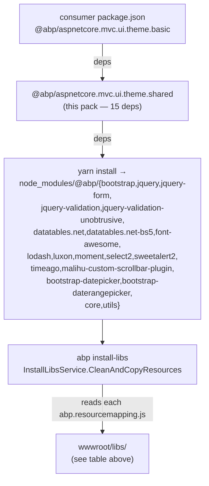

`npm/packs/aspnetcore.mvc.ui.theme.shared/` is the **umbrella npm package** for the MVC UI's shared theme assets. It is published as `@abp/aspnetcore.mvc.ui.theme.shared` and is the single dependency every concrete theme pack (Basic, LeptonX, custom) lists. Through its 15-strong `dependencies` block it declares the *exact* set of `@abp/<lib>` packs an ABP MVC application needs — and `abp install-libs` walks each one to populate `./wwwroot/libs/`.

The C# counterpart (`Volo.Abp.AspNetCore.Mvc.UI.Theme.Shared`) is documented at [/ui/theme-shared](/ui/theme-shared). Where that page covers tag helpers, the page toolbar pipeline, error pages and the `Global` standard bundle, *this* page covers what those bundles **point at on disk** and where the files come from.

## File layout

```
npm/packs/aspnetcore.mvc.ui.theme.shared/
├── README.md
├── package.json
└── yarn.lock
```

No `src/`, no `abp.resourcemapping.js`. The pack contributes *only* a dependency list; every staged file comes from a transitively reachable pack.

## `package.json` — the 15 deps

```json
{
  "version": "10.0.1",
  "name": "@abp/aspnetcore.mvc.ui.theme.shared",
  "repository": {
    "type": "git",
    "url": "https://github.com/abpframework/abp.git",
    "directory": "npm/packs/aspnetcore.mvc.ui.theme.shared"
  },
  "publishConfig": { "access": "public" },
  "dependencies": {
    "@abp/aspnetcore.mvc.ui":               "~10.0.1",
    "@abp/bootstrap":                       "~10.0.1",
    "@abp/bootstrap-datepicker":            "~10.0.1",
    "@abp/bootstrap-daterangepicker":       "~10.0.1",
    "@abp/datatables.net-bs5":              "~10.0.1",
    "@abp/font-awesome":                    "~10.0.1",
    "@abp/jquery-form":                     "~10.0.1",
    "@abp/jquery-validation-unobtrusive":   "~10.0.1",
    "@abp/lodash":                          "~10.0.1",
    "@abp/luxon":                           "~10.0.1",
    "@abp/malihu-custom-scrollbar-plugin":  "~10.0.1",
    "@abp/moment":                          "~10.0.1",
    "@abp/select2":                         "~10.0.1",
    "@abp/sweetalert2":                     "~10.0.1",
    "@abp/timeago":                         "~10.0.1"
  },
  "license": "LGPL-3.0",
  "homepage": "https://abp.io"
}
```

Every entry is `~10.0.1` — the tilde pinning produced by `npm/replace-with-tilde.js` at publish time. The full chain of *implicit* transitive packs (because `@abp/jquery-form` → `@abp/jquery`, `@abp/datatables.net-bs5` → `@abp/datatables.net`, `@abp/bootstrap` → `@abp/core`, etc.) gives roughly twenty `@abp/<x>` packs in a fully-resolved tree.

## What each dependency contributes

| Dependency | Upstream | Staged into `wwwroot/libs/` | Documented in |
| --- | --- | --- | --- |
| `@abp/aspnetcore.mvc.ui` | — | (graph node, no payload) | [/packs/aspnetcore-mvc-ui](/packs/aspnetcore-mvc-ui) |
| `@abp/bootstrap` | `bootstrap ^5.3.8` | `bootstrap/css/*`, `bootstrap/js/*` | [/packs/bootstrap-and-datatables](/packs/bootstrap-and-datatables) |
| `@abp/bootstrap-datepicker` | `bootstrap-datepicker ^1.10.1` | `bootstrap-datepicker/*` | [/packs/bootstrap-and-datatables](/packs/bootstrap-and-datatables) |
| `@abp/bootstrap-daterangepicker` | `bootstrap-daterangepicker ^3.1.0` | `bootstrap-daterangepicker/*` | [/packs/bootstrap-and-datatables](/packs/bootstrap-and-datatables) |
| `@abp/datatables.net-bs5` | `datatables.net-bs5 ^2.3.4` | `datatables.net-bs5/{css,js}/*` | [/packs/bootstrap-and-datatables](/packs/bootstrap-and-datatables) |
| `@abp/font-awesome` | `@fortawesome/fontawesome-free ^7.0.1` | `@fortawesome/fontawesome-free/{css,webfonts}/*` | [/packs/bootstrap-and-datatables](/packs/bootstrap-and-datatables) |
| `@abp/jquery-form` | `jquery-form ^4.3.0` | `jquery-form/jquery.form.min.js` | [/packs/jquery-and-utilities](/packs/jquery-and-utilities) |
| `@abp/jquery-validation-unobtrusive` | `jquery-validation-unobtrusive ^4.0.0` | `jquery-validation-unobtrusive/jquery.validate.unobtrusive.js` | [/packs/jquery-and-utilities](/packs/jquery-and-utilities) |
| `@abp/lodash` | `lodash` | `lodash/lodash.min.js` | — (utility, identical pattern) |
| `@abp/luxon` | `luxon` | `luxon/luxon.min.js` | — |
| `@abp/malihu-custom-scrollbar-plugin` | upstream | `malihu-custom-scrollbar-plugin/*` | — |
| `@abp/moment` | `moment` | `moment/{moment.js,locale/*}` | — |
| `@abp/select2` | `select2` | `select2/dist/*` | — |
| `@abp/sweetalert2` | `sweetalert2` | `sweetalert2/dist/*` | — |
| `@abp/timeago` | `timeago` | `timeago/jquery.timeago.js` | — |

Implicit transitives — `@abp/jquery` (via `jquery-form` / `jquery-validation-unobtrusive`), `@abp/jquery-validation` (via `jquery-validation-unobtrusive`), `@abp/datatables.net` (via `datatables.net-bs5`), `@abp/core` (via `bootstrap`, `jquery`, `font-awesome`, …) — also resolve and contribute their own `abp.resourcemapping.js` outputs.

## How `install-libs` materialises this



## Pairing with the C# `Theme.Shared` module

The Razor-side counterpart is `Volo.Abp.AspNetCore.Mvc.UI.Theme.Shared` ([/ui/theme-shared](/ui/theme-shared)). Its `StandardBundles.Scripts.Global` and `Styles.Global` bundles are wired in **`SharedThemeGlobalScriptContributor.cs` / `SharedThemeGlobalStyleContributor.cs`** and they chain through the per-library contributors in `Volo.Abp.AspNetCore.Mvc.UI.Packages` ([/aspnetcore/mvc-ui-packages](/aspnetcore/mvc-ui-packages)). The exact `/libs/<x>/...` paths those contributors register are the destinations declared in each child pack's `abp.resourcemapping.js`.

So the rule of thumb when adding a new library to the shared theme:

<Steps>
  <Step title="Create the npm pack">
    Under `npm/packs/<lib>/` add a `package.json` + `abp.resourcemapping.js` + (optional) `src/` shim folder.
  </Step>
  <Step title="Wire it into theme.shared">
    Add `"@abp/<lib>": "~X.Y.Z"` to *this* pack's `package.json`. Without that, consumers never get the files.
  </Step>
  <Step title="Add the C# contributor">
    Create `Volo.Abp.AspNetCore.Mvc.UI.Packages/<Lib>/<Lib>ScriptContributor.cs` referencing `/libs/<lib>/...` — the same paths the mapping wrote to.
  </Step>
  <Step title="Register in StandardBundles">
    Either in `Volo.Abp.AspNetCore.Mvc.UI.Theme.Shared`'s `SharedThemeGlobalScriptContributor` (if every theme should ship it) or in a concrete theme's bundle config.
  </Step>
</Steps>

## Why so many small packs instead of one giant one

Three reasons:

1. **Per-library version bumps.** When jQuery 3.7.1 → 3.7.2 ships, only `@abp/jquery` needs a patch release; the rest of the graph is untouched. Tilde-pinning at every edge means consumers get the patch for free at their next `yarn install`.
2. **Independent C# contributor.** Each library has its own `*ScriptContributor` / `*StyleContributor` C# class. Splitting at the same boundary keeps the bundle composition unit-testable.
3. **Opt-out without forking.** A theme that doesn't need DataTables can declare its own meta-pack that omits `@abp/datatables.net-bs5` — same shape as `theme.shared`, smaller dep list.

## Notes on the upstream pins

Tilde and caret usage in the dep list is *intentional*:

- **`~` (tilde) on `@abp/*` deps** — the only `@abp/*` version that satisfies `~10.0.1` is `10.0.x`. All `@abp/*` packs publish together; we want them lock-stepped.
- **`^` (caret) on upstream deps** — inside each leaf pack (`@abp/bootstrap` → `"bootstrap": "^5.3.8"`, `@abp/font-awesome` → `"@fortawesome/fontawesome-free": "^7.0.1"`), caret allows the latest minor/patch of the upstream library without re-publishing the wrapper.

## The transitive graph in full

Resolving every dependency declared by `theme.shared` (and the deps of those deps) produces this tree of `@abp/*` packs in `node_modules/`:

```
@abp/aspnetcore.mvc.ui.theme.shared
├── @abp/aspnetcore.mvc.ui                          (no payload)
├── @abp/bootstrap                                  → bootstrap/{css,js}/
│   └── @abp/core                                   → abp/core/{abp.js,abp.css}
├── @abp/bootstrap-datepicker                       → bootstrap-datepicker/
├── @abp/bootstrap-daterangepicker                  → bootstrap-daterangepicker/
├── @abp/datatables.net-bs5                         → datatables.net-bs5/{css,js}/
│   └── @abp/datatables.net                         → datatables.net/js/
│       └── @abp/jquery                             → jquery/, abp/jquery/
│           └── @abp/core
├── @abp/font-awesome                               → @fortawesome/fontawesome-free/{css,webfonts}/
│   └── @abp/core
├── @abp/jquery-form                                → jquery-form/
│   └── @abp/jquery
├── @abp/jquery-validation-unobtrusive              → jquery-validation-unobtrusive/
│   └── @abp/jquery-validation                      → jquery-validation/
│       └── @abp/jquery
├── @abp/lodash                                     → lodash/
├── @abp/luxon                                      → luxon/
├── @abp/malihu-custom-scrollbar-plugin             → malihu-custom-scrollbar-plugin/
├── @abp/moment                                     → moment/
├── @abp/select2                                    → select2/
├── @abp/sweetalert2                                → sweetalert2/
└── @abp/timeago                                    → timeago/
```

The arrows on the right are the rough destination folders each pack's `abp.resourcemapping.js` produces under `wwwroot/libs/`. The final consumer ends up with **about 20 sub-folders** under `wwwroot/libs/`, all driven by the one line `"@abp/aspnetcore.mvc.ui.theme.shared": "~10.0.1"` (typically arrived at via `theme.basic`).

## Inspecting the resolved graph

If you want to confirm the resolved versions in a project:

```bash
# in your MVC project's web folder:
yarn why @abp/aspnetcore.mvc.ui.theme.shared
# why is this pack here?

yarn list --pattern "@abp/*"
# every @abp/* pack pulled into node_modules
```

Common diagnosis paths:

- **Missing `wwwroot/libs/<x>/`** after `abp install-libs` → check the corresponding `@abp/<x>` pack is in `yarn list`. If absent, the chain from your `package.json` to it is broken (likely a stale custom theme pack).
- **Two different `@abp/<x>` versions** in `yarn list` → the older one is pinned by some module. Bump it to the current ABP version and re-run `yarn install` then `abp install-libs`.
- **An `@abp/<x>` is in `node_modules` but no files under `wwwroot/libs/<x>/`** → the pack genuinely has no `abp.resourcemapping.js` (see `@abp/aspnetcore.mvc.ui` for an example) — that's expected.

## Why the umbrella exists as a *separate* pack

It would be technically possible for `@abp/aspnetcore.mvc.ui.theme.basic` to inline the 15 dependencies directly. ABP keeps them in a separate `theme.shared` pack for two reasons:

1. **Theme stacking.** Both `Basic` and any custom theme can declare `"@abp/aspnetcore.mvc.ui.theme.shared": "~X.Y.Z"` and inherit the same baseline. The C# side already does this (`Volo.Abp.AspNetCore.Mvc.UI.Theme.Shared` is a `[DependsOn]` of every concrete theme module).
2. **One place to bump.** When ABP swaps `moment` for `luxon` (in progress over recent versions), they edit *one* `package.json` — `theme.shared` — and every theme inherits the new graph.

## Operational notes

### Adding a dependency to the umbrella

If a new library needs to be available to every MVC project:

<Steps>
  <Step title="Create the leaf pack">
    Add `npm/packs/<lib>/` with `package.json` + `abp.resourcemapping.js` mirroring the existing leaf packs (see [packs/jquery-and-utilities](/packs/jquery-and-utilities) for the simplest examples).
  </Step>
  <Step title="Append it to theme.shared">
    Add `"@abp/<lib>": "~10.0.1"` (or current version) to *this* pack's `package.json` `dependencies` block. The lerna versioning ensures the patch goes out together.
  </Step>
  <Step title="Author the C# contributor pair">
    In `framework/src/Volo.Abp.AspNetCore.Mvc.UI.Packages/Volo/Abp/AspNetCore/Mvc/UI/Packages/<Lib>/`, write `<Lib>ScriptContributor.cs` and (if styling) `<Lib>StyleContributor.cs` referencing the exact `/libs/<lib>/...` paths the mapping wrote.
  </Step>
  <Step title="Wire it into a bundle">
    Either register in `Volo.Abp.AspNetCore.Mvc.UI.Theme.Shared`'s `SharedThemeGlobalScriptContributor.AddContributors(typeof(<Lib>ScriptContributor))` (every theme picks it up) or in a concrete theme's contributor (only Basic / LeptonX / your custom theme picks it up).
  </Step>
</Steps>

### Removing a dependency

Removing one is the reverse. Note: the C# contributor stays usable for projects that explicitly want it — only the umbrella-driven implicit inclusion goes away.

### Replacing Moment with Luxon

`theme.shared` still lists both `@abp/moment` and `@abp/luxon`. ABP is mid-migration:

- New code uses Luxon (`abp.libs.datatables`, the new Datepicker bridge).
- Older legacy code (`bootstrap-daterangepicker` original API, third-party widgets) still expects Moment globally.

Removing `@abp/moment` is a planned future minor; until then both ship in the umbrella to keep behaviour identical.

## Field-by-field walkthrough

| Field in `package.json` | Value | Why |
| --- | --- | --- |
| `name` | `@abp/aspnetcore.mvc.ui.theme.shared` | Mirrors the C# `Volo.Abp.AspNetCore.Mvc.UI.Theme.Shared`. |
| `version` | `10.0.1` | Released in lock-step with the rest of the `@abp/*` graph; rewritten to tildes in dependents by `npm/replace-with-tilde.js`. |
| `publishConfig.access` | `public` | Required for scoped publish. |
| `dependencies` (15 entries) | each `~10.0.1` | Forces the rest of the graph to a single ABP minor. |
| `repository.directory` | `npm/packs/aspnetcore.mvc.ui.theme.shared` | npmjs.org's "source" link. |
| `license` | `LGPL-3.0` | Same as the rest of ABP. |

No `main`, no `module`, no `exports` — the pack carries dep metadata only.

## What this pack is *not*

- **Not the C# `Theme.Shared` module.** That's `framework/src/Volo.Abp.AspNetCore.Mvc.UI.Theme.Shared` — see [/ui/theme-shared](/ui/theme-shared). It ships layouts, the `Global` standard bundle name, the page toolbar pipeline.
- **Not a layout.** No Razor here. No CSS here either — it only declares dependencies.
- **Not theme-specific.** Even bespoke themes (`@yourorg/aspnetcore.mvc.ui.theme.custom`) typically pull this in to share the JS/CSS baseline rather than re-list every leaf.

## A worked example: from `package.json` to a rendered button

To make the chain concrete, here's what happens when a Razor view renders a button that needs jQuery + Bootstrap + jQuery-Validation:

<Steps>
  <Step title="`package.json` declares the theme">
    The MVC project's `package.json` lists `@abp/aspnetcore.mvc.ui.theme.basic`. `theme.basic` → `theme.shared` → leaf packs as documented above.
  </Step>
  <Step title="`abp install-libs` stages files">
    `wwwroot/libs/jquery/jquery.js`, `wwwroot/libs/bootstrap/js/bootstrap.bundle.min.js`, `wwwroot/libs/jquery-validation/jquery.validate.js` materialise on disk.
  </Step>
  <Step title="`SharedThemeGlobalScriptContributor` composes the bundle">
    On startup, `Volo.Abp.AspNetCore.Mvc.UI.Theme.Shared`'s `SharedThemeGlobalScriptContributor` adds `JqueryScriptContributor`, `BootstrapScriptContributor`, `JqueryValidationScriptContributor` (and more) to the `StandardBundles.Scripts.Global` bundle.
  </Step>
  <Step title="Each contributor registers a /libs/ file">
    Each `*ScriptContributor.AddFiles("/libs/<lib>/<file>.js", context)` writes the public path that the runtime serves.
  </Step>
  <Step title="Layout emits the bundle reference">
    `Themes/Basic/Layouts/Application.cshtml` says `<abp-script bundle-name="@BasicThemeBundles.Scripts.Global" />`, which the bundling middleware materialises as either individual `<script src=…>` tags (Dev) or a single minified bundle URL (Prod).
  </Step>
  <Step title="Browser executes; ABP UI works">
    The browser fetches all three files from `/libs/...`, jQuery, Bootstrap, and jQuery-Validation become globals, the page's `data-val-required` attributes light up.
  </Step>
</Steps>

This pack — `@abp/aspnetcore.mvc.ui.theme.shared` — is the link in step 1 that makes the entire pipeline downstream possible. Drop it, and step 2 has nothing to stage; drop it on a custom theme, and step 3's contributors have no files to reference.

## Frequently asked

- **"Do I list this in my project's `package.json`?"** Usually no — the concrete theme pack (`@abp/aspnetcore.mvc.ui.theme.basic`, `@volo/abp.aspnetcore.mvc.ui.theme.leptonx`, …) pulls it transitively.
- **"Why does my project still get `moment` even though I only use Luxon?"** Because `@abp/moment` is declared here for back-compat (some older code paths still call `moment(...)`). It's planned to be removed in a future minor.
- **"Adding `@abp/aspnetcore.mvc.ui.theme.shared` directly is fine, right?"** Yes — it just adds a redundant entry to the resolution graph. Yarn dedupes.
- **"Can I shrink the staged tree by overriding a leaf pack?"** Not via this pack. Use a *custom* meta pack that omits the dep, then point your `package.json` at that meta pack instead of `theme.basic`.
- **"Does this pack carry any CSS of its own?"** No. The shared *theme*'s CSS lives in the C# `Volo.Abp.AspNetCore.Mvc.UI.Theme.Shared` module's embedded resources — see [/ui/theme-shared](/ui/theme-shared).

## Cross-references

<CardGroup cols={3}>
  <Card title="Packs overview" icon="boxes-stacked" href="/packs/overview">
    The full pack catalogue + install-libs flow diagram.
  </Card>
  <Card title="Theme: Basic" icon="palette" href="/packs/theme-basic">
    The single-dependency pack that lists *this* one.
  </Card>
  <Card title="aspnetcore.mvc.ui pack" icon="cube" href="/packs/aspnetcore-mvc-ui">
    The graph anchor pack listed here as the first dependency.
  </Card>
  <Card title="C# Theme.Shared" icon="layer-group" href="/ui/theme-shared">
    The server-side companion (layouts, page toolbar pipeline).
  </Card>
  <Card title="MVC UI Packages" icon="cube" href="/aspnetcore/mvc-ui-packages">
    The contributor catalogue that *references* every file staged from this graph.
  </Card>
  <Card title="install-libs CLI" icon="terminal" href="/cli/install-libs-and-add-package">
    The command that walks this dep graph and copies files into wwwroot/libs/.
  </Card>
</CardGroup>
