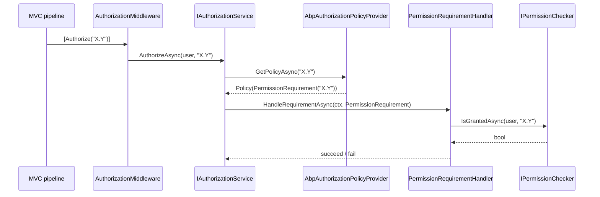

ABP's authorization layer is a thin shim over ASP.NET Core's native authorization stack. Rather than introducing a new abstraction, ABP plugs into `Microsoft.AspNetCore.Authorization` so that every `[Authorize("Some.Permission")]` attribute, `[Authorize(Policy = "Some.Permission")]` controller, and `IAuthorizationService.AuthorizeAsync(...)` call you write resolves through the same permission pipeline. The seam is `AbpAuthorizationPolicyProvider`, which synthesizes policies on demand from `PermissionDefinition` entries.

This page covers the **policy / `[Authorize]` side** of the stack. The actual *grant* side — who has which permission and how the value providers are evaluated — is on the [Permissions](/security/permissions) page.

## Source layout

```
framework/src/Volo.Abp.Authorization.Abstractions/Volo/Abp/Authorization/
├── AbpAuthorizationAbstractionsModule.cs
├── AlwaysAllowAuthorizationService.cs
├── AlwaysAllowMethodInvocationAuthorizationService.cs
├── IAbpAuthorizationPolicyProvider.cs
├── IAbpAuthorizationService.cs
├── IMethodInvocationAuthorizationService.cs
├── MethodInvocationAuthorizationContext.cs
├── PermissionRequirement.cs
├── PermissionRequirementHandler.cs
├── PermissionsRequirement.cs
├── PermissionsRequirementHandler.cs
└── Permissions/                      ← see /security/permissions

framework/src/Volo.Abp.Authorization/Volo/Abp/Authorization/
├── AbpAuthorizationErrorCodes.cs
├── AbpAuthorizationModule.cs
├── AbpAuthorizationPolicyProvider.cs
├── AbpAuthorizationService.cs
├── AuthorizationInterceptor.cs
├── AuthorizationInterceptorRegistrar.cs
├── MethodInvocationAuthorizationService.cs
└── Permissions/                      ← see /security/permissions
```

The split is deliberate: anything you would reference from a *contracts* assembly (a `PermissionRequirement`, the `AlwaysAllowAuthorizationService` you swap into integration tests) lives in `.Abstractions`. The runtime that *resolves* policies and runs the interceptor lives in the main `Volo.Abp.Authorization` package.

## The composition root: `AbpAuthorizationModule`

`framework/src/Volo.Abp.Authorization/Volo/Abp/Authorization/AbpAuthorizationModule.cs`:

```csharp
[DependsOn(
    typeof(AbpAuthorizationAbstractionsModule),
    typeof(AbpSecurityModule),
    typeof(AbpLocalizationModule),
    typeof(AbpMultiTenancyModule)
)]
public class AbpAuthorizationModule : AbpModule
{
    public override void PreConfigureServices(ServiceConfigurationContext context)
    {
        context.Services.OnRegistered(AuthorizationInterceptorRegistrar.RegisterIfNeeded);
        AutoAddDefinitionProviders(context.Services);
    }

    public override void ConfigureServices(ServiceConfigurationContext context)
    {
        context.Services.AddAuthorizationCore();

        context.Services.AddSingleton<IAuthorizationHandler, PermissionRequirementHandler>();
        context.Services.AddSingleton<IAuthorizationHandler, PermissionsRequirementHandler>();

        context.Services.TryAddTransient<DefaultAuthorizationPolicyProvider>();

        Configure<AbpPermissionOptions>(options =>
        {
            options.ValueProviders.Add<UserPermissionValueProvider>();
            options.ValueProviders.Add<RolePermissionValueProvider>();
            options.ValueProviders.Add<ClientPermissionValueProvider>();
        });
        // ... localization, virtual file system, exception localization
    }
}
```

Three things are happening here:

1. `OnRegistered(AuthorizationInterceptorRegistrar.RegisterIfNeeded)` — every service that is registered into the DI container after this module loads is inspected for `[Authorize]` attributes. If found, the [`AuthorizationInterceptor`](/core/dynamic-proxy-and-aspects) is woven in via Castle.DynamicProxy, so application services authorize **even when invoked without going through ASP.NET Core MVC**.
2. `AddAuthorizationCore()` plus the two requirement handlers and `DefaultAuthorizationPolicyProvider` make ABP's policy provider override the framework default while preserving the framework default as a fallback.
3. The default permission value providers — `User`, `Role`, `Client` — are registered. They are documented on the [Permissions](/security/permissions) page.

`AutoAddDefinitionProviders` walks the container for `IPermissionDefinitionProvider` implementations and stuffs them into `AbpPermissionOptions.DefinitionProviders` so every module's permissions are picked up without manual wiring.

## `AbpAuthorizationOptions` and `AbpPermissionOptions`

`Volo.Abp.Authorization.Abstractions/Volo/Abp/Authorization/Permissions/AbpPermissionOptions.cs` carries the lists the module above mutates:

- `DefinitionProviders` — the `Type` list of every discovered `IPermissionDefinitionProvider`.
- `ValueProviders` — the ordered list of `IPermissionValueProvider` types.

There is no separate `AbpAuthorizationOptions`; the authorization *policy* configuration is the framework-standard `Microsoft.AspNetCore.Authorization.AuthorizationOptions`. You configure it the usual way:

```csharp
public override void ConfigureServices(ServiceConfigurationContext context)
{
    Configure<AuthorizationOptions>(options =>
    {
        // Explicit policy: "OnlyHumans" rejects when AbpClaimTypes.ClientId is present.
        options.AddPolicy("OnlyHumans", p => p.RequireAssertion(ctx =>
            ctx.User.FindFirst(AbpClaimTypes.ClientId) == null));
    });
}
```

These policies coexist with the permission-name policies that `AbpAuthorizationPolicyProvider` synthesizes (see below).

## `IAbpAuthorizationPolicyProvider`

`framework/src/Volo.Abp.Authorization.Abstractions/Volo/Abp/Authorization/IAbpAuthorizationPolicyProvider.cs`:

```csharp
public interface IAbpAuthorizationPolicyProvider : IAuthorizationPolicyProvider
{
    Task<List<string>> GetPoliciesNamesAsync();
}
```

It extends ASP.NET Core's `IAuthorizationPolicyProvider` with a single extra method — *list every policy name ABP knows about* — used by the Permission Management UI to populate the grants tree and by the dynamic client proxy to know which policies it can ask the server about.

### The implementation

`framework/src/Volo.Abp.Authorization/Volo/Abp/Authorization/AbpAuthorizationPolicyProvider.cs`:

```csharp
public class AbpAuthorizationPolicyProvider
    : DefaultAuthorizationPolicyProvider, IAbpAuthorizationPolicyProvider, ITransientDependency
{
    private readonly AuthorizationOptions _options;
    private readonly IPermissionDefinitionManager _permissionDefinitionManager;

    public AbpAuthorizationPolicyProvider(
        IOptions<AuthorizationOptions> options,
        IPermissionDefinitionManager permissionDefinitionManager)
        : base(options)
    {
        _permissionDefinitionManager = permissionDefinitionManager;
        _options = options.Value;
    }

    public override async Task<AuthorizationPolicy?> GetPolicyAsync(string policyName)
    {
        var policy = await base.GetPolicyAsync(policyName);
        if (policy != null)
        {
            return policy;
        }

        var permission = await _permissionDefinitionManager.GetOrNullAsync(policyName);
        if (permission != null)
        {
            //TODO: Optimize & Cache!
            var policyBuilder = new AuthorizationPolicyBuilder(Array.Empty<string>());
            policyBuilder.Requirements.Add(new PermissionRequirement(policyName));
            return policyBuilder.Build();
        }

        return null;
    }

    public async Task<List<string>> GetPoliciesNamesAsync()
    {
        return _options.GetPoliciesNames()
            .Union((await _permissionDefinitionManager.GetPermissionsAsync())
                .Select(p => p.Name))
            .ToList();
    }
}
```

The flow is:

1. Ask the *built-in* `DefaultAuthorizationPolicyProvider` first — explicit policies registered via `AddPolicy(...)` win.
2. If nothing matched, look up the name as a `PermissionDefinition`. If it exists, synthesize a one-shot `AuthorizationPolicy` whose only requirement is `PermissionRequirement(name)`.
3. The `PermissionRequirementHandler` (registered in the module) calls `IPermissionChecker.IsGrantedAsync` against the policy name — covered on the [Permissions](/security/permissions) page.

This is the magic that lets you write `[Authorize("BookStore.Authors.Edit")]` without ever having to manually `AddPolicy("BookStore.Authors.Edit", …)`.

## The `[Authorize]` integration

You use the *standard* `Microsoft.AspNetCore.Authorization.AuthorizeAttribute`. Three shapes are common:

```csharp
// 1. Just authentication required.
[Authorize]
public class MyAppService : ApplicationService { }

// 2. A permission name — resolved via AbpAuthorizationPolicyProvider.
[Authorize(BookStorePermissions.Books.Create)]
public Task<BookDto> CreateAsync(CreateBookInput input) { ... }

// 3. A traditional policy name registered via AddPolicy(...).
[Authorize(Policy = "OnlyHumans")]
public Task<BookDto> GetAsync(Guid id) { ... }
```

Because `AuthorizationInterceptorRegistrar.RegisterIfNeeded` wires `AuthorizationInterceptor` onto every type whose methods or class carries `[Authorize]`, those attributes are also enforced when the service is called *outside* an HTTP request — e.g. from a background job, distributed event handler, or another service.

`Volo.Abp.Authorization.Abstractions` also exposes `IMethodInvocationAuthorizationService`, the contract the interceptor calls into; `MethodInvocationAuthorizationService` walks the attribute list and ultimately delegates to `IAbpAuthorizationService`.

## `IAbpAuthorizationService` and the `AuthorizeAsync` extensions

`Volo.Abp.Authorization.Abstractions/Volo/Abp/Authorization/IAbpAuthorizationService.cs` extends ASP.NET Core's `IAuthorizationService` with one new property — `ClaimsPrincipal CurrentPrincipal { get; }` — so call sites can authorize *the current principal* without first plumbing through `IHttpContextAccessor`.

Common call shapes:

```csharp
public class OrderAppService : ApplicationService
{
    private readonly IAuthorizationService _authorizationService;

    public OrderAppService(IAuthorizationService authorizationService)
    {
        _authorizationService = authorizationService;
    }

    public async Task RefundAsync(Guid orderId)
    {
        // Throws AbpAuthorizationException if not granted.
        await _authorizationService.CheckAsync("Orders.Refund");

        // Or check without throwing:
        if (await _authorizationService.IsGrantedAsync("Orders.Refund.OverLimit"))
        {
            // ...
        }

        // Resource-based:
        var order = await _orderRepository.GetAsync(orderId);
        await _authorizationService.CheckAsync(order, new OperationAuthorizationRequirement
        {
            Name = "Refund"
        });
    }
}
```

`CheckAsync` and `IsGrantedAsync` are extension methods on the standard `IAuthorizationService` that ship in `Volo.Abp.Authorization` and are usable from *any* code path that has the framework reference.

## `AlwaysAllowAuthorizationService` — the test helper

When you write integration tests, you typically do not want to set up a full user, claims, and permission grants just to call an application service. `Volo.Abp.Authorization.Abstractions` ships a noop implementation:

`framework/src/Volo.Abp.Authorization.Abstractions/Volo/Abp/Authorization/AlwaysAllowAuthorizationService.cs`:

```csharp
public class AlwaysAllowAuthorizationService : IAbpAuthorizationService
{
    public IServiceProvider ServiceProvider { get; }
    public ClaimsPrincipal CurrentPrincipal => _currentPrincipalAccessor.Principal;
    private readonly ICurrentPrincipalAccessor _currentPrincipalAccessor;

    public AlwaysAllowAuthorizationService(
        IServiceProvider serviceProvider,
        ICurrentPrincipalAccessor currentPrincipalAccessor)
    {
        ServiceProvider = serviceProvider;
        _currentPrincipalAccessor = currentPrincipalAccessor;
    }

    public Task<AuthorizationResult> AuthorizeAsync(
        ClaimsPrincipal user, object? resource, IEnumerable<IAuthorizationRequirement> requirements)
        => Task.FromResult(AuthorizationResult.Success());

    public Task<AuthorizationResult> AuthorizeAsync(
        ClaimsPrincipal user, object? resource, string policyName)
        => Task.FromResult(AuthorizationResult.Success());
}
```

Plus a sibling — `AlwaysAllowMethodInvocationAuthorizationService` — for the interceptor side. In a test module:

```csharp
public override void ConfigureServices(ServiceConfigurationContext context)
{
    context.Services.AddAlwaysAllowAuthorization();
}
```

That extension method (in `Volo.Abp.Authorization.Abstractions`) replaces the standard `IAuthorizationService` and `IMethodInvocationAuthorizationService` with the always-allow variants in one call. ABP's own test base modules already do this.

<Warning>
  Never register `AlwaysAllowAuthorizationService` in a production host. It bypasses **every** `[Authorize]` attribute and every `IAuthorizationService.AuthorizeAsync` call, including the ones inside framework modules.
</Warning>

## Requirements and handlers

`Volo.Abp.Authorization.Abstractions/Volo/Abp/Authorization/PermissionRequirement.cs` and `PermissionsRequirement.cs` are the two requirements ABP synthesizes — singular (for one permission) and plural (for an `[Authorize(Permissions = new[] { "A", "B" })]` style). Their handlers — `PermissionRequirementHandler` and `PermissionsRequirementHandler` — are singletons (registered in `AbpAuthorizationModule.ConfigureServices`) that resolve `IPermissionChecker` from the request scope and forward to it.

The code path for an HTTP request is:



The chunk below the `IPermissionChecker` is documented on the [Permissions](/security/permissions) page.

## Error codes

`framework/src/Volo.Abp.Authorization/Volo/Abp/Authorization/AbpAuthorizationErrorCodes.cs` defines the namespaced strings that `AbpAuthorizationException` raises into — these surface as localized "You are not authorized" messages via the `AbpAuthorizationResource`. The exception itself is `Volo.Abp.Authorization.AbpAuthorizationException` (in `Volo.Abp.Authorization.Abstractions`), and it is what `IAuthorizationService.CheckAsync(...)` throws on denial.

## Cross-references

<CardGroup cols={2}>
  <Card title="Permission resolution" icon="key" href="/security/permissions">
    What happens after `PermissionRequirementHandler` calls `IPermissionChecker` — value providers, the grant store, multi-tenancy filtering.
  </Card>
  <Card title="Current principal" icon="user-shield" href="/security/security-helpers">
    Where the `ClaimsPrincipal` that `[Authorize]` evaluates comes from — `ICurrentPrincipalAccessor`, `ICurrentUser`, `ICurrentClient`.
  </Card>
  <Card title="Permission Management module" icon="boxes-stacked" href="/modules/permission-management">
    The database-backed `IPermissionStore`, grant management UI, and `IPermissionGrantRepository` that ABP applications usually consume on top of this layer.
  </Card>
  <Card title="Interception pipeline" icon="layer-group" href="/core/dynamic-proxy-and-aspects">
    The Castle.DynamicProxy machinery that makes `[Authorize]` enforced for *every* call site, not just HTTP.
  </Card>
</CardGroup>
