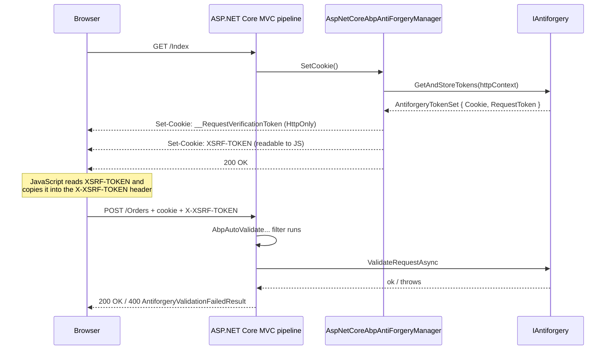

ABP layers its own *auto-validating* anti-forgery pipeline on top of ASP.NET Core's built-in `IAntiforgery`. The goal is to make the right thing happen by default: every authenticated, mutating HTTP request goes through CSRF validation; AJAX clients can read the token from a non-`HttpOnly` cookie and echo it in a header; and **non-browser clients** (e.g. SDK calls with a bearer token but no cookie) are exempt automatically.

The pipeline lives in `framework/src/Volo.Abp.AspNetCore.Mvc/Volo/Abp/AspNetCore/Mvc/AntiForgery/`.

## Source layout

```
framework/src/Volo.Abp.AspNetCore.Mvc/Volo/Abp/AspNetCore/Mvc/AntiForgery/
├── AbpAntiForgeryCookieNameProvider.cs
├── AbpAntiForgeryOptions.cs
├── AbpAutoValidateAntiforgeryTokenAttribute.cs
├── AbpAutoValidateAntiforgeryTokenAuthorizationFilter.cs
├── AbpValidateAntiForgeryTokenAttribute.cs
├── AbpValidateAntiforgeryTokenAuthorizationFilter.cs
├── AspNetCoreAbpAntiForgeryManager.cs
└── IAbpAntiForgeryManager.cs
```

Eight files. Three of them — `AbpAntiForgeryOptions`, the auto-validate filter, the cookie-name provider — carry the bulk of the behaviour.

## `AbpAntiForgeryOptions`

`framework/src/Volo.Abp.AspNetCore.Mvc/Volo/Abp/AspNetCore/Mvc/AntiForgery/AbpAntiForgeryOptions.cs`:

```csharp
public class AbpAntiForgeryOptions
{
    public CookieBuilder TokenCookie { get; }
    public string? AuthCookieSchemaName { get; set; }
    public bool AutoValidate { get; set; } = true;
    public Predicate<Type> AutoValidateFilter { get; set; }
    public HashSet<string> AutoValidateIgnoredHttpMethods { get; set; }

    public AbpAntiForgeryOptions()
    {
        AutoValidateFilter = type => true;

        TokenCookie = new CookieBuilder
        {
            Name        = "XSRF-TOKEN",
            HttpOnly    = false,                    // JS must read it
            IsEssential = true,
            SameSite    = SameSiteMode.None,
            Expiration  = TimeSpan.FromDays(3650)   // 10 years
        };

        AuthCookieSchemaName = "Identity.Application";

        AutoValidateIgnoredHttpMethods = new HashSet<string> { "GET", "HEAD", "TRACE", "OPTIONS" };
    }
}
```

The defaults encode several conventions:

- **`XSRF-TOKEN`** as the cookie name — the de facto standard for SPA frameworks (Angular, Axios, etc.) that auto-echo it as the `X-XSRF-TOKEN` request header.
- **`HttpOnly = false`** — the cookie *must* be readable from JavaScript so the SPA can copy it into the header.
- **`SameSite = None`** — necessary when the SPA host is on a different sub-domain than the API host.
- **`AuthCookieSchemaName = "Identity.Application"`** — the cookie name pattern ABP looks for to decide *if* the request is browser-issued; covered below.
- **`AutoValidate = true`** — the global auto-validate filter is on by default; *every* controller is covered unless `AutoValidateFilter(type)` returns `false`.
- **`AutoValidateIgnoredHttpMethods`** — safe methods skip validation by default (per the [RFC](https://datatracker.ietf.org/doc/html/rfc7231#section-4.2.1)).

Override in your host module:

```csharp
public override void ConfigureServices(ServiceConfigurationContext context)
{
    Configure<AbpAntiForgeryOptions>(options =>
    {
        options.TokenCookie.Name = "XSRF-CONTOSO";
        options.AutoValidateFilter = type =>
            !type.Namespace!.StartsWith("Contoso.PublicForms");
    });
}
```

## `IAbpAntiForgeryManager`

`framework/src/Volo.Abp.AspNetCore.Mvc/Volo/Abp/AspNetCore/Mvc/AntiForgery/IAbpAntiForgeryManager.cs`:

```csharp
public interface IAbpAntiForgeryManager
{
    void SetCookie();
    string GenerateToken();
}
```

A two-method API: drop the cookie into the response, or just hand back the token so the caller can stuff it in a meta-tag.

### `AspNetCoreAbpAntiForgeryManager`

```csharp
public class AspNetCoreAbpAntiForgeryManager : IAbpAntiForgeryManager, ITransientDependency
{
    protected AbpAntiForgeryOptions Options { get; }
    protected HttpContext HttpContext => _httpContextAccessor.HttpContext!;

    private readonly IAntiforgery _antiforgery;
    private readonly IHttpContextAccessor _httpContextAccessor;

    public AspNetCoreAbpAntiForgeryManager(
        IAntiforgery antiforgery,
        IHttpContextAccessor httpContextAccessor,
        IOptions<AbpAntiForgeryOptions> options)
    {
        _antiforgery = antiforgery;
        _httpContextAccessor = httpContextAccessor;
        Options = options.Value;
    }

    public virtual void SetCookie()
    {
        HttpContext.Response.Cookies.Append(
            Options.TokenCookie.Name!,
            GenerateToken(),
            Options.TokenCookie.Build(HttpContext)
        );
    }

    public virtual string GenerateToken()
    {
        return _antiforgery.GetAndStoreTokens(_httpContextAccessor.HttpContext!).RequestToken!;
    }
}
```

`GetAndStoreTokens` is the standard ASP.NET Core call that mints the request token and stores its companion in the framework's `__RequestVerificationToken` cookie; ABP then *separately* writes the request token into the `XSRF-TOKEN` cookie so JavaScript can read it.

Razor pages call `SetCookie()` once per page (the `_Layout.cshtml` does it); SPA hosts call it in an early-pipeline middleware (`UseAbpSecurityHeaders` and friends include it).

## Auto-validation: the attribute pair

### `AbpAutoValidateAntiforgeryTokenAttribute`

`framework/src/Volo.Abp.AspNetCore.Mvc/Volo/Abp/AspNetCore/Mvc/AntiForgery/AbpAutoValidateAntiforgeryTokenAttribute.cs`:

```csharp
[AttributeUsage(AttributeTargets.Class | AttributeTargets.Method,
    AllowMultiple = false, Inherited = true)]
public class AbpAutoValidateAntiforgeryTokenAttribute : Attribute, IFilterFactory, IOrderedFilter
{
    public int Order { get; set; } = 1000;
    public bool IsReusable => true;

    public IFilterMetadata CreateInstance(IServiceProvider serviceProvider)
        => serviceProvider.GetRequiredService<AbpAutoValidateAntiforgeryTokenAuthorizationFilter>();
}
```

A filter factory that hands ASP.NET Core the auto-validate authorization filter. The default `Order = 1000` is deliberate: it runs *after* authentication so an unauthenticated request that fails CSRF still returns `401` (or redirects to login) rather than `400`.

The attribute is **registered globally** by the ABP MVC integration, so you do not have to apply it manually. The companion `AbpValidateAntiForgeryTokenAttribute` (same file shape) is the *explicit* variant for `[Authorize]`-style per-action opt-in.

### `AbpAutoValidateAntiforgeryTokenAuthorizationFilter`

```csharp
public class AbpAutoValidateAntiforgeryTokenAuthorizationFilter
    : AbpValidateAntiforgeryTokenAuthorizationFilter, ITransientDependency
{
    private readonly AbpAntiForgeryOptions _options;

    public AbpAutoValidateAntiforgeryTokenAuthorizationFilter(
        IAntiforgery antiforgery,
        AbpAntiForgeryCookieNameProvider antiForgeryCookieNameProvider,
        IOptions<AbpAntiForgeryOptions> options,
        ILogger<AbpValidateAntiforgeryTokenAuthorizationFilter> logger)
        : base(antiforgery, antiForgeryCookieNameProvider, logger)
    {
        _options = options.Value;
    }

    protected override bool ShouldValidate(AuthorizationFilterContext context)
    {
        if (!_options.AutoValidate)             return false;

        if (context.ActionDescriptor.IsControllerAction())
        {
            var controllerType = context.ActionDescriptor
                .AsControllerActionDescriptor().ControllerTypeInfo.AsType();
            if (!_options.AutoValidateFilter(controllerType)) return false;
        }

        if (IsIgnoredHttpMethod(context))       return false;

        return base.ShouldValidate(context);
    }
}
```

The decision tree:

1. `AutoValidate` master switch off → skip.
2. Controller is in the user-defined opt-out predicate → skip.
3. HTTP method is in `AutoValidateIgnoredHttpMethods` (`GET` / `HEAD` / `TRACE` / `OPTIONS`) → skip.
4. Otherwise fall through to the base filter's `ShouldValidate`, which inspects the cookies.

### `AbpValidateAntiforgeryTokenAuthorizationFilter`

`framework/src/Volo.Abp.AspNetCore.Mvc/Volo/Abp/AspNetCore/Mvc/AntiForgery/AbpValidateAntiforgeryTokenAuthorizationFilter.cs`:

```csharp
public class AbpValidateAntiforgeryTokenAuthorizationFilter
    : IAsyncAuthorizationFilter, IAntiforgeryPolicy, ITransientDependency
{
    public async Task OnAuthorizationAsync(AuthorizationFilterContext context)
    {
        if (!context.IsEffectivePolicy<IAntiforgeryPolicy>(this))
        {
            _logger.LogInformation(
                "Skipping the execution of current filter as its not the most effective filter implementing the policy "
                + typeof(IAntiforgeryPolicy));
            return;
        }

        if (ShouldValidate(context))
        {
            try
            {
                await _antiforgery.ValidateRequestAsync(context.HttpContext);
            }
            catch (AntiforgeryValidationException exception)
            {
                _logger.LogWarning(exception.Message, exception);
                context.Result = new AntiforgeryValidationFailedResult();
            }
        }
    }

    protected virtual bool ShouldValidate(AuthorizationFilterContext context)
    {
        var authCookieName = _antiForgeryCookieNameProvider.GetAuthCookieNameOrNull();

        // Always perform antiforgery validation when request contains authentication cookie
        if (authCookieName != null &&
            context.HttpContext.Request.Cookies.ContainsKey(authCookieName))
        {
            return true;
        }

        var antiForgeryCookieName = _antiForgeryCookieNameProvider.GetAntiForgeryCookieNameOrNull();

        // No need to validate if antiforgery cookie is not sent.
        // That means the request is sent from a non-browser client.
        // See https://github.com/aspnet/Antiforgery/issues/115
        if (antiForgeryCookieName != null &&
            !context.HttpContext.Request.Cookies.ContainsKey(antiForgeryCookieName))
        {
            return false;
        }

        return true;
    }
}
```

Two rules that together get the *non-browser exemption* right:

- **Auth cookie present → validate.** If the request rides an `Identity.Application` cookie, this is unambiguously a browser; CSRF is mandatory.
- **No XSRF cookie at all → skip.** The XSRF cookie is dropped by ABP onto every browser response. A request with no XSRF cookie is therefore *not* a browser session (most commonly an HTTP API client wielding a bearer token). Bearer-only callers cannot be CSRF-attacked the same way, so validation is skipped.

This is the bit that makes the same controller endpoint serve both a Razor page POST (browser, cookie auth, CSRF enforced) and an external API client (bearer token, no XSRF cookie, no CSRF) without forking the action.

## `AbpAntiForgeryCookieNameProvider`

`framework/src/Volo.Abp.AspNetCore.Mvc/Volo/Abp/AspNetCore/Mvc/AntiForgery/AbpAntiForgeryCookieNameProvider.cs`:

```csharp
public class AbpAntiForgeryCookieNameProvider : ITransientDependency
{
    private readonly IOptionsMonitor<CookieAuthenticationOptions> _namedOptionsAccessor;
    private readonly AbpAntiForgeryOptions _abpAntiForgeryOptions;

    public virtual string? GetAuthCookieNameOrNull()
    {
        if (_abpAntiForgeryOptions.AuthCookieSchemaName == null) return null;
        return _namedOptionsAccessor.Get(_abpAntiForgeryOptions.AuthCookieSchemaName)
            ?.Cookie?.Name;
    }

    public virtual string? GetAntiForgeryCookieNameOrNull()
        => _abpAntiForgeryOptions.TokenCookie.Name;
}
```

A tiny indirection that decouples the auth-cookie *name* from the auth *scheme* name. Hosts that customise their cookie scheme (`.AddCookie("MyCookie", ...)`) only need to set `AbpAntiForgeryOptions.AuthCookieSchemaName = "MyCookie"`; the rest of the pipeline keeps working.

## The token round-trip



## Configuring the SPA side

For an Angular host the convention is automatic — `HttpClientXsrfModule` reads `XSRF-TOKEN` and writes `X-XSRF-TOKEN`. For Axios:

```ts
axios.defaults.xsrfCookieName = 'XSRF-TOKEN';
axios.defaults.xsrfHeaderName = 'X-XSRF-TOKEN';
```

For server-side Razor pages, the standard `@Html.AntiForgeryToken()` is rendered by the layout *and* the ABP token is emitted from `SetCookie()` — either path works because `IAntiforgery.GetAndStoreTokens` is idempotent on a given request.

## Opting out per controller

When you have a public endpoint that *must* be reachable without CSRF — e.g. a Stripe webhook — use the predicate or the auto-validate filter:

```csharp
Configure<AbpAntiForgeryOptions>(options =>
{
    options.AutoValidateFilter = type =>
        type != typeof(StripeWebhookController) &&
        type != typeof(TwilioCallbackController);
});
```

Or do it locally with `[IgnoreAntiforgeryToken]` (a built-in ASP.NET Core attribute) — the ABP filter respects the standard policy resolution (`context.IsEffectivePolicy<IAntiforgeryPolicy>`) so the lowest-scoped attribute wins.

## Common gotchas

- **The auth cookie name must match.** If you renamed your cookie scheme but left `AuthCookieSchemaName` at the default `"Identity.Application"`, browser sessions will be silently exempted. Set it explicitly when you customise the scheme.
- **`SameSite = None` requires HTTPS.** The default is `SameSite.None` because cross-site SPA hosts are common; this requires `Secure = true`, which is automatic when your host is HTTPS. On plain-HTTP development the cookie will be rejected — use HTTPS even locally.
- **Bearer-only APIs do not need CSRF.** If your API ships only bearer tokens (JWT, OIDC client credentials) you can flip `AutoValidate = false` entirely and rely on the cookie-absent skip rule. The filter is then a true no-op.
- **WebSockets / SignalR.** The filter only runs on MVC actions. SignalR has its own anti-forgery story (`AbpSignalRSecurityOptions`).

## Cross-references

<CardGroup cols={2}>
  <Card title="Identity module" icon="user-shield" href="/modules/identity">
    Owns the auth cookie name (`Identity.Application`) that `AbpAntiForgeryCookieNameProvider` looks up.
  </Card>
  <Card title="Authorization" icon="shield-halved" href="/security/authorization">
    Companion CSRF *and* authorization filter ordering — both at `Order = 1000`, both running after authentication.
  </Card>
  <Card title="String encryption" icon="key" href="/security/string-encryption">
    `IStringEncryptionService` is unrelated to CSRF tokens but shares the same module composition pattern.
  </Card>
  <Card title="Current user" icon="user" href="/security/security-helpers">
    `ICurrentPrincipalAccessor.Principal` is what `IAntiforgery.ValidateRequestAsync` compares the token's user claim against.
  </Card>
</CardGroup>
