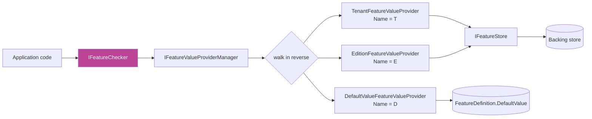
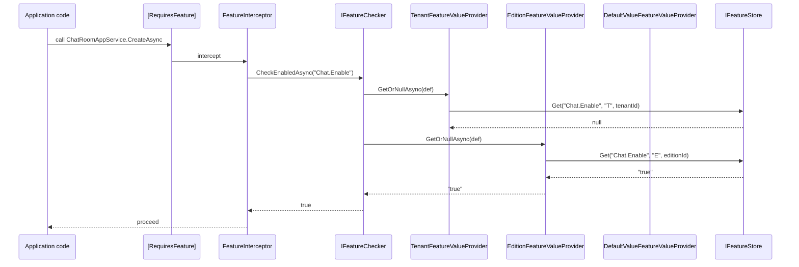

Features answer a different question than permissions: *for this tenant / edition, is this capability turned on, and if so, what is its value?* They are the primitive that SaaS billing tiers ride on top of — a `Standard` edition might have `ReportingFeatures.MaxRowsPerExport = "10000"` while `Premium` has `"unlimited"`, and a particular tenant may have `Chat.Enable = "true"` even though their edition would normally have it off.

Everything on this page lives under `framework/src/Volo.Abp.Features/Volo/Abp/Features/`. The [Feature Management module](/modules/feature-management) provides the database-backed `IFeatureStore`, admin endpoints, and the UI; this layer is what the rest of the framework consumes regardless of whether that module is plugged in.

## Source layout

```
framework/src/Volo.Abp.Features/Volo/Abp/Features/
├── AbpFeatureErrorCodes.cs
├── AbpFeatureOptions.cs
├── AbpFeaturesModule.cs
├── DefaultValueFeatureValueProvider.cs
├── DisableFeatureCheckAttribute.cs
├── EditionFeatureValueProvider.cs
├── FeatureChecker.cs
├── FeatureCheckerBase.cs
├── FeatureCheckerExtensions.cs
├── FeatureDefinition.cs
├── FeatureDefinitionContext.cs
├── FeatureDefinitionManager.cs
├── FeatureDefinitionProvider.cs
├── FeatureGroupDefinition.cs
├── FeatureInterceptor.cs
├── FeatureInterceptorRegistrar.cs
├── FeatureValue.cs
├── FeatureValueProvider.cs
├── FeatureValueProviderManager.cs
├── IFeatureChecker.cs
├── IFeatureDefinitionManager.cs
├── IFeatureDefinitionProvider.cs
├── IFeatureStore.cs
├── IFeatureValueProvider.cs
├── NullFeatureStore.cs
├── RequiresFeatureAttribute.cs
├── StaticFeatureDefinitionStore.cs
└── TenantFeatureValueProvider.cs
```

## `AbpFeaturesModule`

`framework/src/Volo.Abp.Features/Volo/Abp/Features/AbpFeaturesModule.cs`:

```csharp
[DependsOn(
    typeof(AbpLocalizationModule),
    typeof(AbpMultiTenancyModule),
    typeof(AbpValidationModule),
    typeof(AbpAuthorizationAbstractionsModule)
)]
public class AbpFeaturesModule : AbpModule
{
    public override void PreConfigureServices(ServiceConfigurationContext context)
    {
        context.Services.OnRegistered(FeatureInterceptorRegistrar.RegisterIfNeeded);
        AutoAddDefinitionProviders(context.Services);
    }

    public override void ConfigureServices(ServiceConfigurationContext context)
    {
        context.Services.Configure<AbpFeatureOptions>(options =>
        {
            options.ValueProviders.Add<DefaultValueFeatureValueProvider>();
            options.ValueProviders.Add<EditionFeatureValueProvider>();
            options.ValueProviders.Add<TenantFeatureValueProvider>();
        });
        // ... localization + exception localization wiring
    }
}
```

Two big take-aways:

- `FeatureInterceptorRegistrar.RegisterIfNeeded` weaves an interceptor onto every service that carries `[RequiresFeature]`, so the attribute is enforced for *every* call site.
- The three default providers register in the *registration* order shown — but they are **evaluated in reverse** inside `FeatureChecker.GetOrNullAsync`. The intent is: `Tenant` overrides `Edition` overrides `Default`.

## Defining features

### `FeatureDefinition`

`framework/src/Volo.Abp.Features/Volo/Abp/Features/FeatureDefinition.cs`:

```csharp
public class FeatureDefinition : ICanCreateChildFeature
{
    public string Name { get; }
    public ILocalizableString DisplayName { get; set; }
    public ILocalizableString? Description { get; set; }
    public FeatureDefinition? Parent { get; private set; }
    public IReadOnlyList<FeatureDefinition> Children { get; }
    public string? DefaultValue { get; set; }
    public bool IsVisibleToClients { get; set; }
    public bool IsAvailableToHost { get; set; }
    public List<string> AllowedProviders { get; }
    public Dictionary<string, object?> Properties { get; }
    public IStringValueType? ValueType { get; set; }   // ToggleStringValueType by default
}
```

Notable properties:

- **`DefaultValue`** — a string. `IFeatureChecker.IsEnabledAsync` will `bool.Parse` it for boolean features; the typed helpers below cast for numeric / enum-shaped features.
- **`IsVisibleToClients`** — whether a tenant's UI can read this feature value (some features are server-only knobs).
- **`IsAvailableToHost`** — whether the *host* tenant can have this feature; some features only make sense inside a tenant context.
- **`AllowedProviders`** — when non-empty, restricts the value provider chain to just the listed names (e.g. `"T"` to forbid edition-level overrides).
- **`ValueType`** — drives the management UI input. Defaults to `ToggleStringValueType` (a checkbox); also `SelectionStringValueType`, `FreeTextStringValueType`, `NumericValueType`, etc.

### `FeatureGroupDefinition`

```csharp
public class FeatureGroupDefinition : ICanCreateChildFeature
{
    public string Name { get; }
    public ILocalizableString DisplayName { get; set; }
    public IReadOnlyList<FeatureDefinition> Features { get; }

    public virtual FeatureDefinition AddFeature(
        string name,
        string? defaultValue = null,
        ILocalizableString? displayName = null,
        ILocalizableString? description = null,
        IStringValueType? valueType = null,
        bool isVisibleToClients = true,
        bool isAvailableToHost = true) { ... }

    public virtual List<FeatureDefinition> GetFeaturesWithChildren();
}
```

### A definition provider

```csharp
public class MyChatFeatureDefinitionProvider : FeatureDefinitionProvider
{
    public override void Define(IFeatureDefinitionContext context)
    {
        var group = context.AddGroup("Chat", L("Feature:Chat"));

        var chatEnable = group.AddFeature(
            ChatFeatures.Enable,
            defaultValue: "false",
            displayName: L("Feature:Chat.Enable"),
            valueType: new ToggleStringValueType());

        group.AddFeature(
            ChatFeatures.MaxConcurrentRooms,
            defaultValue: "5",
            displayName: L("Feature:Chat.MaxConcurrentRooms"),
            valueType: new FreeTextStringValueType(new NumericValueValidator(1, 1000)));
    }

    private static LocalizableString L(string name) =>
        LocalizableString.Create<MyChatResource>(name);
}
```

`FeatureDefinitionProvider` is the convenience base, identical in shape to `PermissionDefinitionProvider` — auto-registered by `AutoAddDefinitionProviders` in the module.

## `IFeatureChecker` — the read path

`framework/src/Volo.Abp.Features/Volo/Abp/Features/IFeatureChecker.cs`:

```csharp
public interface IFeatureChecker
{
    Task<string?> GetOrNullAsync(string name);
    Task<bool> IsEnabledAsync(string name);
}
```

Everything is a string at the wire level; typed accessors live in `FeatureCheckerExtensions`:

```csharp
public static async Task<T> GetAsync<T>(
    this IFeatureChecker featureChecker, string name, T defaultValue = default) where T : struct
{
    var value = await featureChecker.GetOrNullAsync(name);
    return value?.To<T>() ?? defaultValue;
}

public static async Task<bool> IsEnabledAsync(
    this IFeatureChecker featureChecker, bool requiresAll, params string[] featureNames) { ... }

public static async Task CheckEnabledAsync(this IFeatureChecker featureChecker, string featureName)
{
    if (!(await featureChecker.IsEnabledAsync(featureName)))
        throw new AbpAuthorizationException(code: AbpFeatureErrorCodes.FeatureIsNotEnabled)
            .WithData("FeatureName", featureName);
}
```

So you call `featureChecker.GetAsync<int>("Chat.MaxConcurrentRooms")` or `featureChecker.CheckEnabledAsync("Chat.Enable")` in application code; the latter throws `AbpAuthorizationException` (with a feature-specific error code) on failure.

### `FeatureCheckerBase`

`framework/src/Volo.Abp.Features/Volo/Abp/Features/FeatureCheckerBase.cs`:

```csharp
public abstract class FeatureCheckerBase : IFeatureChecker, ITransientDependency
{
    public abstract Task<string?> GetOrNullAsync(string name);

    public virtual async Task<bool> IsEnabledAsync(string name)
    {
        var value = await GetOrNullAsync(name);
        if (value.IsNullOrEmpty()) return false;

        try { return bool.Parse(value!); }
        catch (Exception ex)
        {
            throw new AbpException(
                $"The value '{value}' for the feature '{name}' should be a boolean, but was not!",
                ex);
        }
    }
}
```

`IsEnabledAsync` simply parses the string; anything not parseable as `bool` is treated as an exception, which means you should reach for `GetAsync<int>(…)` / `GetOrNullAsync(…)` for non-boolean features rather than `IsEnabledAsync`.

### `FeatureChecker` — provider chain walk

`framework/src/Volo.Abp.Features/Volo/Abp/Features/FeatureChecker.cs`:

```csharp
public class FeatureChecker : FeatureCheckerBase
{
    protected AbpFeatureOptions Options { get; }
    protected IServiceProvider ServiceProvider { get; }
    protected IFeatureDefinitionManager FeatureDefinitionManager { get; }
    protected IFeatureValueProviderManager FeatureValueProviderManager { get; }

    public override async Task<string?> GetOrNullAsync(string name)
    {
        var featureDefinition = await FeatureDefinitionManager.GetAsync(name);
        var providers = FeatureValueProviderManager.ValueProviders.Reverse();

        if (featureDefinition.AllowedProviders.Any())
        {
            providers = providers.Where(p =>
                featureDefinition.AllowedProviders.Contains(p.Name));
        }

        return await GetOrNullValueFromProvidersAsync(providers, featureDefinition);
    }

    protected virtual async Task<string?> GetOrNullValueFromProvidersAsync(
        IEnumerable<IFeatureValueProvider> providers, FeatureDefinition feature)
    {
        foreach (var provider in providers)
        {
            var value = await provider.GetOrNullAsync(feature);
            if (value != null) return value;
        }
        return null;
    }
}
```

Two non-obvious bits:

1. **`.Reverse()`** — the registration order (`Default`, `Edition`, `Tenant`) is walked back-to-front so the most specific provider can shadow the more general ones. The first non-null value wins.
2. The walk **stops as soon as a value is found**. If the `TenantFeatureValueProvider` returns `"false"`, the `EditionFeatureValueProvider` is *not* consulted — even if it would have returned `"true"`.

## The provider chain



### `FeatureValueProvider` base

```csharp
public abstract class FeatureValueProvider : IFeatureValueProvider, ITransientDependency
{
    public abstract string Name { get; }
    protected IFeatureStore FeatureStore { get; }

    protected FeatureValueProvider(IFeatureStore featureStore)
        => FeatureStore = featureStore;

    public abstract Task<string?> GetOrNullAsync(FeatureDefinition feature);
}
```

### `DefaultValueFeatureValueProvider`

```csharp
public class DefaultValueFeatureValueProvider : FeatureValueProvider
{
    public const string ProviderName = "D";
    public override string Name => ProviderName;

    public override Task<string?> GetOrNullAsync(FeatureDefinition setting)
    {
        return Task.FromResult<string?>(setting.DefaultValue);
    }
}
```

The terminal fallback: returns `FeatureDefinition.DefaultValue` literally. Because it is walked **last** (after reversal it is the *first* in the reverse walk it's the last), it only matters when no tenant or edition value exists.

### `EditionFeatureValueProvider`

`framework/src/Volo.Abp.Features/Volo/Abp/Features/EditionFeatureValueProvider.cs`:

```csharp
public class EditionFeatureValueProvider : FeatureValueProvider
{
    public const string ProviderName = "E";
    public override string Name => ProviderName;

    public async override Task<string?> GetOrNullAsync(FeatureDefinition feature)
    {
        var editionId = await FindEditionIdAsync();
        if (editionId == null) return null;
        return await FeatureStore.GetOrNullAsync(feature.Name, Name, editionId.Value.ToString());
    }

    protected virtual async Task<Guid?> FindEditionIdAsync()
    {
        var editionId = PrincipalAccessor.Principal?.FindEditionId();
        if (editionId != null) return editionId;
        if (CurrentTenant.Id == null) return null;

        var tenant = await TenantStore.FindAsync(CurrentTenant.Id.Value);
        return tenant?.EditionId;
    }
}
```

It tries the `edition_id` claim first (set by the OpenIddict integration on tenant logins) before falling back to `ITenantStore.FindAsync(tenantId).EditionId`. `null` ↔ no edition ↔ skip provider.

### `TenantFeatureValueProvider`

```csharp
public class TenantFeatureValueProvider : FeatureValueProvider
{
    public const string ProviderName = "T";
    public override string Name => ProviderName;
    protected ICurrentTenant CurrentTenant { get; }

    public override async Task<string?> GetOrNullAsync(FeatureDefinition feature)
    {
        return await FeatureStore.GetOrNullAsync(
            feature.Name, Name, CurrentTenant.Id?.ToString());
    }
}
```

`CurrentTenant.Id` is `null` for the host — a tenant-scope feature read on the host returns `null` and falls through to edition / default. Multi-tenancy semantics live in `ICurrentTenant`; see [Security helpers](/security/security-helpers).

## `IFeatureStore`

`framework/src/Volo.Abp.Features/Volo/Abp/Features/IFeatureStore.cs`:

```csharp
public interface IFeatureStore
{
    Task<string?> GetOrNullAsync(string name, string? providerName, string? providerKey);
}
```

Identical shape to `IPermissionStore`. The default `NullFeatureStore` returns `null` for everything; the [Feature Management module](/modules/feature-management) replaces it with an EF Core implementation that reads from `AbpFeatureValues`.

## `[RequiresFeature]`

`framework/src/Volo.Abp.Features/Volo/Abp/Features/RequiresFeatureAttribute.cs`:

```csharp
[AttributeUsage(AttributeTargets.Class | AttributeTargets.Method)]
public class RequiresFeatureAttribute : Attribute
{
    public string[] Features { get; }
    public bool RequiresAll { get; set; }   // default false ⇒ any-of

    public RequiresFeatureAttribute(params string[] features)
    {
        Features = features ?? Array.Empty<string>();
    }
}
```

Usage:

```csharp
[RequiresFeature(ChatFeatures.Enable)]
public class ChatRoomAppService : ApplicationService { ... }

[RequiresFeature(ChatFeatures.Enable, ChatFeatures.PrivateRooms, RequiresAll = true)]
public Task<RoomDto> CreatePrivateAsync(CreateRoomInput input) { ... }
```

`FeatureInterceptor` (`framework/src/Volo.Abp.Features/Volo/Abp/Features/FeatureInterceptor.cs`) is wired in by `FeatureInterceptorRegistrar` and calls `IMethodInvocationFeatureCheckerService` → `IFeatureChecker.CheckEnabledAsync` for every invocation. On failure it throws `AbpAuthorizationException` with the error code defined in `AbpFeatureErrorCodes`.

`DisableFeatureCheckAttribute` (in the same folder) is the per-method opt-out — useful when the attribute is on a base class but one method must remain open.

## Caching and dynamic definitions

`FeatureDefinitionManager` consults two stores:

- `StaticFeatureDefinitionStore` — runs every `IFeatureDefinitionProvider` once at first access, caches the resulting `FeatureGroupDefinition` map.
- `IDynamicFeatureDefinitionStore` — defaults to `NullDynamicFeatureDefinitionStore`. The [Feature Management module](/modules/feature-management) plugs in a database-backed implementation so SaaS hosts can introduce features at runtime.

Lookup order is static first, dynamic fallback.

## Adding a custom value provider

Suppose you want a `User`-scope feature override for power-users:

```csharp
public class UserFeatureValueProvider : FeatureValueProvider
{
    public const string ProviderName = "U";
    public override string Name => ProviderName;
    protected ICurrentUser CurrentUser { get; }

    public UserFeatureValueProvider(IFeatureStore featureStore, ICurrentUser currentUser)
        : base(featureStore)
    {
        CurrentUser = currentUser;
    }

    public override async Task<string?> GetOrNullAsync(FeatureDefinition feature)
    {
        if (CurrentUser.Id == null) return null;
        return await FeatureStore.GetOrNullAsync(feature.Name, Name, CurrentUser.Id.ToString());
    }
}
```

Wire it ahead of the tenant provider so it wins:

```csharp
public override void PreConfigureServices(ServiceConfigurationContext context)
{
    PreConfigure<AbpFeatureOptions>(options =>
    {
        options.ValueProviders.Add<UserFeatureValueProvider>();
    });
}
```

Because `FeatureChecker` walks in **reverse** of registration order, the entry added last is consulted first; so place `UserFeatureValueProvider` *after* `TenantFeatureValueProvider` in registration order to make it shadow tenant + edition + default.

## End-to-end sequence



## Cross-references

<CardGroup cols={2}>
  <Card title="Feature Management module" icon="boxes-stacked" href="/modules/feature-management">
    The database-backed `IFeatureStore`, `IFeatureManager` admin API, and the management UI.
  </Card>
  <Card title="Global features" icon="globe" href="/security/global-features">
    Compile-time / startup-time feature gating that suppresses entire modules rather than per-tenant capability.
  </Card>
  <Card title="Permissions" icon="key" href="/security/permissions">
    The per-user companion to features — when the decision is "can *this user* do X?" rather than "is X enabled for this tenant?".
  </Card>
  <Card title="Settings" icon="sliders" href="/security/settings">
    Layered *value* configuration with a similar provider chain but a different scope set (user / tenant / global / config / default).
  </Card>
</CardGroup>
