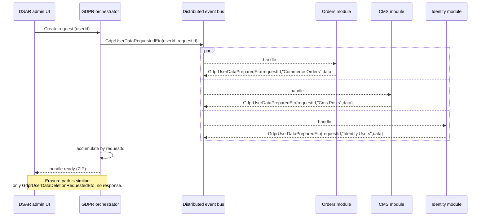

ABP's GDPR story is split into two pieces. The *commercial* GDPR module ships the admin UI, the data-subject-access-request workflow, and the file-download pipeline; this **abstractions** package — `Volo.Abp.Gdpr.Abstractions` — defines the bare minimum every host needs to participate in those workflows: the contracts a module exports to declare *I own some personal data about this user* and the distributed events that orchestrate the export / erasure dance.

If your code stores anything tied to a user's identity — orders, audit logs, content, configuration — and you want it included in data subject access reports or wiped on a "right to be forgotten" request, the seam is here.

## Source layout

```
framework/src/Volo.Abp.Gdpr.Abstractions/Volo/Abp/Gdpr/
├── AbpGdprAbstractionsModule.cs
├── GdprDataInfo.cs
├── GdprUserDataDeletionRequestedEto.cs
├── GdprUserDataPreparedEto.cs
├── GdprUserDataProviderContext.cs
└── GdprUserDataRequestedEto.cs
```

This is intentionally tiny. The package is a *contracts* assembly — every module that participates references it without pulling in the management infrastructure.

## `AbpGdprAbstractionsModule`

`framework/src/Volo.Abp.Gdpr.Abstractions/Volo/Abp/Gdpr/AbpGdprAbstractionsModule.cs`:

```csharp
public class AbpGdprAbstractionsModule : AbpModule
{
}
```

Pure marker module. Reference the assembly with `[DependsOn(typeof(AbpGdprAbstractionsModule))]` so the framework loader picks up the included types — that is the entire job.

## `GdprDataInfo`

`framework/src/Volo.Abp.Gdpr.Abstractions/Volo/Abp/Gdpr/GdprDataInfo.cs`:

```csharp
[Serializable]
public class GdprDataInfo : Dictionary<string, string>
{
}
```

A thin alias for `Dictionary<string, string>`. The key is whatever your module wants to label the bucket (`"profile"`, `"orders"`, `"comments"`, `"audit-logs"`); the value is the *serialized payload* — typically JSON, but the contract is byte-for-byte opaque: it is whatever your module wants to ship into the export bundle. Picking JSON keeps everything portable and inspectable.

Why a `Dictionary<string, string>` instead of a typed shape? Because each provider owns a different schema and the orchestrating layer should not depend on any of them. The flat key/value map lets the export pipeline merge results from N independent modules into a single JSON tree.

Example payload from a hypothetical comments module:

```csharp
var data = new GdprDataInfo
{
    ["comments-summary"] = JsonSerializer.Serialize(new
    {
        TotalCount = 42,
        FirstPostedAt = "2021-04-13T10:13:00Z",
        LastPostedAt  = "2024-08-02T17:48:00Z"
    }),
    ["comments"] = JsonSerializer.Serialize(commentRecords)
};
```

## `GdprUserDataProviderContext`

```csharp
public class GdprUserDataProviderContext
{
    public Guid UserId { get; set; }
}
```

The carrier passed to *every* personal-data provider. Just the user id today; future fields (a `DateTime` cut-off, a `string` correlation id, a `CancellationToken`) can be added without breaking the wire format because `Eto` payloads are versioned independently — see below.

A typical provider — implemented in your domain layer, called by the GDPR module — looks like this:

```csharp
public class CommentsGdprUserDataProvider : IGdprUserDataProvider, ITransientDependency
{
    private readonly ICommentRepository _comments;

    public CommentsGdprUserDataProvider(ICommentRepository comments)
        => _comments = comments;

    public async Task<GdprDataInfo> GetGdprDataAsync(GdprUserDataProviderContext context)
    {
        var rows = await _comments.GetListByAuthorAsync(context.UserId);
        return new GdprDataInfo
        {
            ["comments"] = JsonSerializer.Serialize(rows)
        };
    }
}
```

<Note>
  The `IGdprUserDataProvider` interface itself is part of the commercial Gdpr domain package; the **abstractions** package only standardizes the payload shape (`GdprDataInfo`) and the context carrier (`GdprUserDataProviderContext`). That keeps the contracts file lean and lets the export orchestrator evolve independently of providers.
</Note>

## The Eto pipeline

GDPR work is *asynchronous*: a host may collect data from many bounded contexts, each running in its own service, before assembling the export. ABP's distributed event bus is what stitches them together. Three Etos live in the abstractions package, in the order they occur:

### 1. `GdprUserDataRequestedEto` — the kick-off

`framework/src/Volo.Abp.Gdpr.Abstractions/Volo/Abp/Gdpr/GdprUserDataRequestedEto.cs`:

```csharp
[Serializable]
public class GdprUserDataRequestedEto
{
    public Guid UserId    { get; set; }
    public Guid RequestId { get; set; }
}
```

Published by the GDPR module when an admin or self-service request is created. Every module that exposes personal data subscribes via `ILocalEventHandler<GdprUserDataRequestedEto>` (or the distributed variant), looks up the user's records, and publishes a `GdprUserDataPreparedEto` of its own.

`RequestId` is the correlation token — it survives across service hops and ties everything back to the original DSAR record.

### 2. `GdprUserDataPreparedEto` — the per-provider response

`framework/src/Volo.Abp.Gdpr.Abstractions/Volo/Abp/Gdpr/GdprUserDataPreparedEto.cs`:

```csharp
[Serializable]
public class GdprUserDataPreparedEto
{
    public Guid          RequestId { get; set; }
    public string        Provider  { get; set; } = default!;
    public GdprDataInfo  Data      { get; set; } = default!;
}
```

Published by each provider when it has finished collecting:

- `RequestId` ties the chunk back to the originating `GdprUserDataRequestedEto`.
- `Provider` is the namespaced name of the bounded context that produced this chunk (e.g. `"Commerce.Orders"`, `"Identity.Users"`, `"Cms.Comments"`). The orchestrator uses this to deduplicate and to label the export bundle's top-level keys.
- `Data` is the actual `GdprDataInfo` payload.

The orchestrator accumulates `GdprUserDataPreparedEto` messages by `RequestId` until either (a) every registered provider has reported, or (b) a configured timeout elapses — at which point the bundle is sealed and made available for download.

### 3. `GdprUserDataDeletionRequestedEto` — the erasure path

```csharp
[Serializable]
public class GdprUserDataDeletionRequestedEto
{
    public Guid UserId { get; set; }
}
```

Published when a "right to be forgotten" request is approved. Every provider subscribes and irreversibly removes (or anonymizes — there is no fourth Eto saying *which* it picked, the choice is per-bounded-context) every record tied to `UserId`. The simpler shape — no `RequestId` — reflects that deletion is *fire-and-forget*: nothing is collected, and the orchestrator only needs to log the audit entry.

### The flow



## Why this layer is so thin

The whole abstractions package is roughly thirty lines of code. That is deliberate:

- **No interfaces.** A provider implements a *commercial* interface in the GDPR domain package; the abstractions only standardize the payload and event shapes. A module can publish a `GdprUserDataPreparedEto` without ever referencing the orchestrator's interfaces.
- **No DTOs beyond `GdprDataInfo`.** Anything else is encoded inside the string values — typically as JSON. This keeps the wire format stable as schema requirements change.
- **No assumptions about transport.** The Etos are plain `[Serializable]` POCOs; whether the bus is in-memory, RabbitMQ, Kafka, or Azure Service Bus is the host's choice. See the distributed event bus documentation for details.

The framework's job here is to **make every module able to participate** in personal-data export and erasure, not to dictate the workflow.

## Putting it together

A complete in-process implementation that wires a custom module into the GDPR pipeline:

```csharp
[DependsOn(typeof(AbpGdprAbstractionsModule), typeof(MyCmsDomainModule))]
public class MyCmsGdprModule : AbpModule { }

public class MyCmsGdprDataCollector :
    ILocalEventHandler<GdprUserDataRequestedEto>,
    ILocalEventHandler<GdprUserDataDeletionRequestedEto>,
    ITransientDependency
{
    private const string ProviderName = "MyCms.Posts";

    private readonly IPostRepository _posts;
    private readonly ILocalEventBus _events;

    public MyCmsGdprDataCollector(IPostRepository posts, ILocalEventBus events)
    {
        _posts = posts;
        _events = events;
    }

    public async Task HandleEventAsync(GdprUserDataRequestedEto eventData)
    {
        var posts = await _posts.GetListByAuthorAsync(eventData.UserId);

        await _events.PublishAsync(new GdprUserDataPreparedEto
        {
            RequestId = eventData.RequestId,
            Provider  = ProviderName,
            Data = new GdprDataInfo
            {
                ["posts"] = JsonSerializer.Serialize(posts.Select(p => new
                {
                    p.Id, p.Title, p.Body, p.CreationTime
                }))
            }
        });
    }

    public async Task HandleEventAsync(GdprUserDataDeletionRequestedEto eventData)
    {
        await _posts.DeleteByAuthorAsync(eventData.UserId);
    }
}
```

No reference to the commercial GDPR module is required; the only thing the host needs is *something* that subscribes to and forwards these events into the orchestrator that owns the final bundle.

## Threading rules

- Both event handlers run on whatever scope the bus delivers them to. If you use the distributed event bus they will be in a fresh `IUnitOfWork`, so the repositories above are safe to call directly.
- `GdprUserDataPreparedEto` is published on every successful collection; the orchestrator is responsible for handling re-deliveries idempotently. Including the same `(RequestId, Provider)` tuple twice should be a no-op.
- For deletion, **do not** await the export. Deletion can race with an in-flight export; pick a policy (cancel the export, or finish it first) in the orchestrator, not in the provider.

## Versioning the Etos

`GdprUserDataRequestedEto`, `GdprUserDataPreparedEto`, and `GdprUserDataDeletionRequestedEto` are `[Serializable]` POCOs without explicit `[EventName]` attributes — the framework will derive the event name from the CLR type name when published on the distributed bus. Two practical consequences:

- **Do not rename them.** Renaming would break in-flight consumers that subscribe by event-name string. If you need to evolve a payload, *add* a property — the binary formatter and the JSON serializer the framework defaults to are both forward-compatible with extra fields.
- **Pin a stable event name** if you cross language boundaries. ABP supports `[EventName("abp.gdpr.user-data-requested")]`-style attributes for hosts that exchange events with non-.NET services; apply them in your *own* derived classes if you are exporting events out of an ABP host, rather than mutating the framework types.

## Local vs distributed delivery

Both `ILocalEventBus` and `IDistributedEventBus` deliver the same Etos. The choice is up to your topology:

<CardGroup cols={2}>
  <Card title="Single-host monolith" icon="cube">
    Use `ILocalEventBus` — handlers run in the publisher's request scope, you can share the publisher's `IUnitOfWork`, and there is no transport cost. Good for the first cut of a GDPR pipeline.
  </Card>
  <Card title="Microservices" icon="diagram-project">
    Use `IDistributedEventBus` — handlers run in independent processes, each with their own DB and unit of work. The orchestrator and providers can live in different bounded contexts and be deployed independently.
  </Card>
</CardGroup>

The contract is identical either way: a handler implements `ILocalEventHandler<T>` *or* `IDistributedEventHandler<T>` (or both), and the bus picks the right one. The abstractions package does not care which transport you choose.

## What an orchestrator does

The framework abstractions do not ship an orchestrator — that lives in the commercial GDPR module. For reference, a minimal in-process implementation pinning the moving parts together looks like this:

```csharp
public class InProcessGdprOrchestrator :
    ILocalEventHandler<GdprUserDataPreparedEto>,
    ITransientDependency
{
    private readonly IDistributedCache<GdprAggregateCacheItem, Guid> _cache;

    public async Task HandleEventAsync(GdprUserDataPreparedEto eventData)
    {
        var item = await _cache.GetAsync(eventData.RequestId)
                   ?? new GdprAggregateCacheItem();

        item.ChunksByProvider[eventData.Provider] = eventData.Data;

        await _cache.SetAsync(eventData.RequestId, item,
            new DistributedCacheEntryOptions {
                AbsoluteExpirationRelativeToNow = TimeSpan.FromHours(24)
            });

        // When every registered provider has reported, seal the bundle.
        if (item.ChunksByProvider.Count >= _expectedProviders.Count)
        {
            await SealBundleAsync(eventData.RequestId, item);
        }
    }
}
```

The orchestrator decides:

- **How long to wait** for slow providers.
- **What to do if a provider crashes** — re-publish the request, or seal a partial bundle with a warning.
- **Where the final bundle goes** — typically a ZIP into a blob store, downloadable via a time-limited signed URL.
- **Whether to push a notification** when the bundle is ready (email, in-app inbox, etc.).

None of this is dictated by the abstractions. They are a *contract* — every host implements the orchestrator that fits its compliance posture.

## Cross-references

<CardGroup cols={2}>
  <Card title="Identity module" icon="user-shield" href="/modules/identity">
    The user store whose `Guid UserId` is the only identifier the abstractions carry — and whose own `IGdprUserDataProvider` is the canonical example.
  </Card>
  <Card title="Setting management" icon="sliders" href="/security/settings">
    Settings can hold personal data (e.g. preferred language); the export bundle typically includes the user-scope rows surfaced via `ISettingProvider`.
  </Card>
  <Card title="Distributed event bus" icon="diagram-project" href="/ddd/application">
    How the Etos defined here are actually delivered — in-process or across service boundaries — and what unit-of-work semantics apply on each side.
  </Card>
  <Card title="Auditing" icon="file-shield" href="/modules/audit-logging">
    Audit logs are typically the *largest* personal-data bucket; the auditing module ships its own provider that emits one `GdprDataInfo` chunk per export.
  </Card>
</CardGroup>
