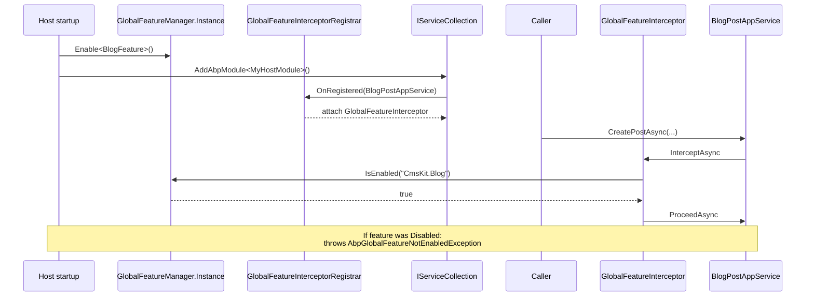

The [Features](/security/features) layer answers *is this enabled for this tenant?*. **Global features** answer a different question: *is this enabled in this deployment at all?* — and that decision is made **once, at host startup**, with no per-request state, no claim lookups, and no database read. If a global feature is off, the framework treats the affected types as if they were not even composed: invoking them throws, and DI registrations that depend on `IGlobalFeatureCheckingEnabled` can be conditionally suppressed.

Everything on this page lives in `framework/src/Volo.Abp.GlobalFeatures/Volo/Abp/GlobalFeatures/`.

## When to reach for this layer

<CardGroup cols={2}>
  <Card title="Module-scope on/off" icon="globe">
    "We do not ship the CMS in this deployment." Disable `CmsKitGlobalFeatures.Blog` and every blog controller / app service refuses to run.
  </Card>
  <Card title="Multi-product SKUs" icon="layer-group">
    A single codebase that builds three products by selecting different global features in `PreConfigureServices`.
  </Card>
  <Card title="Heavy compile-time deps" icon="bolt">
    The feature ships an analyzer / file system / Hangfire job; disabling it removes the startup cost for hosts that don't need it.
  </Card>
  <Card title="Compatibility flags" icon="rotate">
    A behaviour change you want existing hosts to opt-in to with a single line of code.
  </Card>
</CardGroup>

For **per-tenant** capability gating use the [Features](/security/features) layer instead — `GlobalFeatureManager` does **not** consult the tenant context.

## Source layout

```
framework/src/Volo.Abp.GlobalFeatures/Volo/Abp/GlobalFeatures/
├── AbpGlobalFeatureErrorCodes.cs
├── AbpGlobalFeatureNotEnabledException.cs
├── AbpGlobalFeaturesModule.cs
├── GlobalFeature.cs
├── GlobalFeatureDictionary.cs
├── GlobalFeatureHelper.cs
├── GlobalFeatureInterceptor.cs
├── GlobalFeatureInterceptorRegistrar.cs
├── GlobalFeatureManager.cs
├── GlobalFeatureNameAttribute.cs
├── GlobalModuleFeatures.cs
├── GlobalModuleFeaturesDictionary.cs
├── IGlobalFeatureCheckingEnabled.cs
└── RequiresGlobalFeatureAttribute.cs
```

## `GlobalFeatureManager`

`framework/src/Volo.Abp.GlobalFeatures/Volo/Abp/GlobalFeatures/GlobalFeatureManager.cs`:

```csharp
public class GlobalFeatureManager
{
    public static GlobalFeatureManager Instance { get; protected set; } = new GlobalFeatureManager();

    public Dictionary<object, object> Configuration { get; }
    public GlobalModuleFeaturesDictionary Modules { get; }
    protected HashSet<string> EnabledFeatures { get; }

    protected internal GlobalFeatureManager()
    {
        EnabledFeatures = new HashSet<string>();
        Configuration = new Dictionary<object, object>();
        Modules = new GlobalModuleFeaturesDictionary(this);
    }

    public virtual bool IsEnabled<TFeature>() => IsEnabled(typeof(TFeature));
    public virtual bool IsEnabled(Type featureType)
        => IsEnabled(GlobalFeatureNameAttribute.GetName(featureType));
    public virtual bool IsEnabled(string featureName)
        => EnabledFeatures.Contains(featureName);

    public virtual void Enable<TFeature>()  => Enable(typeof(TFeature));
    public virtual void Enable(Type featureType) => Enable(GlobalFeatureNameAttribute.GetName(featureType));
    public virtual void Enable(string featureName) => EnabledFeatures.AddIfNotContains(featureName);

    public virtual void Disable<TFeature>() => Disable(typeof(TFeature));
    public virtual void Disable(Type featureType) => Disable(GlobalFeatureNameAttribute.GetName(featureType));
    public virtual void Disable(string featureName) => EnabledFeatures.Remove(featureName);

    public virtual IEnumerable<string> GetEnabledFeatureNames() => EnabledFeatures;
}
```

Three things to notice:

1. **`static Instance`** — there is exactly one `GlobalFeatureManager` per process. It is set before module loading begins; module code that decides whether to register services typically reads `GlobalFeatureManager.Instance.IsEnabled(...)`.
2. **In-memory `HashSet<string>`** — no thread-safe contract for *runtime* mutation. You write to it during `PreConfigureServices`; you do not toggle features in response to a request.
3. **`Configuration`** dictionary — an open `Dictionary<object, object>` used by modules to stash per-feature options keyed by `Type`. The eShopOnAbp templates use this for ports, queue names, etc.

## `[GlobalFeatureName]` and `IGlobalFeature`

`framework/src/Volo.Abp.GlobalFeatures/Volo/Abp/GlobalFeatures/GlobalFeatureNameAttribute.cs`:

```csharp
[AttributeUsage(AttributeTargets.Class)]
public class GlobalFeatureNameAttribute : Attribute
{
    public string Name { get; }

    public GlobalFeatureNameAttribute(string name)
        => Name = Check.NotNullOrWhiteSpace(name, nameof(name));

    public static string GetName<TFeature>() => GetName(typeof(TFeature));

    public static string GetName(Type type)
    {
        var attribute = type.GetCustomAttributes<GlobalFeatureNameAttribute>().FirstOrDefault();
        if (attribute == null)
            throw new AbpException(
                $"{type.AssemblyQualifiedName} should define the {typeof(GlobalFeatureNameAttribute).FullName} atttribute!");
        return attribute.Name;
    }
}
```

Every type used as a global feature must be marked with `[GlobalFeatureName("…")]`. The string is the canonical name — it's what the `HashSet<string>` and the `[RequiresGlobalFeature]` attribute compare against. Types **without** the attribute throw an `AbpException` the first time they are passed to `IsEnabled<T>` / `Enable<T>`, which surfaces typos early.

`GlobalFeature` (`framework/src/Volo.Abp.GlobalFeatures/Volo/Abp/GlobalFeatures/GlobalFeature.cs`) is the convenience base that combines a name with an `Enable()` / `Disable()` API on top of a module bundle:

```csharp
public abstract class GlobalFeature
{
    public GlobalModuleFeatures Module { get; }
    public GlobalFeatureManager FeatureManager { get; }
    public string FeatureName { get; }

    public bool IsEnabled
    {
        get => FeatureManager.IsEnabled(FeatureName);
        set => SetEnabled(value);
    }

    protected GlobalFeature(GlobalModuleFeatures module)
    {
        Module = module;
        FeatureManager = Module.FeatureManager;
        FeatureName = GlobalFeatureNameAttribute.GetName(GetType());
    }

    public virtual void Enable()  => FeatureManager.Enable(FeatureName);
    public virtual void Disable() => FeatureManager.Disable(FeatureName);
    public void SetEnabled(bool isEnabled)
    {
        if (isEnabled) Enable(); else Disable();
    }
}
```

`GlobalModuleFeatures` (in `GlobalModuleFeatures.cs`) is the bag a module exposes — typically a single sealed nested class — that owns a set of `GlobalFeature` instances and offers `Enable<T>`/`Disable<T>` shortcuts:

```csharp
public abstract class GlobalModuleFeatures
{
    public GlobalFeatureManager FeatureManager { get; }
    protected GlobalFeatureDictionary AllFeatures { get; }

    public virtual void Enable<TFeature>() where TFeature : GlobalFeature
        => GetFeature<TFeature>().Enable();

    public virtual void Disable<TFeature>() where TFeature : GlobalFeature
        => GetFeature<TFeature>().Disable();

    public virtual void EnableAll()  { foreach (var f in AllFeatures.Values) f.Enable(); }
    public virtual void DisableAll() { foreach (var f in AllFeatures.Values) f.Disable(); }
}
```

### A module-shaped declaration

A module that wants to expose two togglable areas — say a `Blog` and `Forum` — declares them like so:

```csharp
[GlobalFeatureName(Name)]
public class BlogFeature : GlobalFeature
{
    public const string Name = "CmsKit.Blog";
    public BlogFeature(GlobalModuleFeatures module) : base(module) { }
}

[GlobalFeatureName(Name)]
public class ForumFeature : GlobalFeature
{
    public const string Name = "CmsKit.Forum";
    public ForumFeature(GlobalModuleFeatures module) : base(module) { }
}

public class CmsKitGlobalFeatures : GlobalModuleFeatures
{
    public BlogFeature Blog { get; }
    public ForumFeature Forum { get; }

    public CmsKitGlobalFeatures(GlobalFeatureManager featureManager) : base(featureManager)
    {
        Blog  = AddFeature(new BlogFeature(this));
        Forum = AddFeature(new ForumFeature(this));
    }

    private T AddFeature<T>(T feature) where T : GlobalFeature
    {
        AllFeatures[feature.FeatureName] = feature;
        return feature;
    }
}

public static class CmsKitGlobalFeatureExtensions
{
    public static CmsKitGlobalFeatures CmsKit(this GlobalModuleFeaturesDictionary dict)
    {
        if (!dict.ContainsKey("CmsKit"))
            dict["CmsKit"] = new CmsKitGlobalFeatures(dict.FeatureManager);
        return (CmsKitGlobalFeatures)dict["CmsKit"];
    }
}
```

A host then flips features at startup:

```csharp
public class MyHostModule : AbpModule
{
    public override void PreConfigureServices(ServiceConfigurationContext context)
    {
        GlobalFeatureManager.Instance.Modules.CmsKit().Blog.Enable();
        GlobalFeatureManager.Instance.Modules.CmsKit().Forum.Disable();
    }
}
```

## `[RequiresGlobalFeature]`

`framework/src/Volo.Abp.GlobalFeatures/Volo/Abp/GlobalFeatures/RequiresGlobalFeatureAttribute.cs`:

```csharp
[AttributeUsage(AttributeTargets.Class)]
public class RequiresGlobalFeatureAttribute : Attribute
{
    public Type? Type { get; }
    public string? Name { get; }

    public RequiresGlobalFeatureAttribute(Type type)
        => Type = Check.NotNull(type, nameof(type));

    public RequiresGlobalFeatureAttribute(string name)
        => Name = Check.NotNullOrWhiteSpace(name, nameof(name));

    public virtual string GetFeatureName()
        => Name ?? GlobalFeatureNameAttribute.GetName(Type!);
}
```

You can name the feature either by its type (which then must carry `[GlobalFeatureName]`) or by string. Both forms are used in the ABP codebase.

Apply it to a controller, application service, or domain service:

```csharp
[RequiresGlobalFeature(typeof(BlogFeature))]
public class BlogPostAppService : ApplicationService { ... }
```

When the feature is **off** and someone invokes the service, the interceptor in the next section throws.

## `GlobalFeatureInterceptor`

`framework/src/Volo.Abp.GlobalFeatures/Volo/Abp/GlobalFeatures/GlobalFeatureInterceptor.cs`:

```csharp
public class GlobalFeatureInterceptor : AbpInterceptor, ITransientDependency
{
    public override async Task InterceptAsync(IAbpMethodInvocation invocation)
    {
        if (AbpCrossCuttingConcerns.IsApplied(invocation.TargetObject,
                AbpCrossCuttingConcerns.GlobalFeatureChecking))
        {
            await invocation.ProceedAsync();
            return;
        }

        if (invocation.TargetObject != null &&
            !GlobalFeatureHelper.IsGlobalFeatureEnabled(
                invocation.TargetObject.GetType(), out var attribute))
        {
            throw new AbpGlobalFeatureNotEnabledException(
                    code: AbpGlobalFeatureErrorCodes.GlobalFeatureIsNotEnabled)
                .WithData("ServiceName",       invocation.TargetObject.GetType().FullName!)
                .WithData("GlobalFeatureName", attribute!.Name!);
        }

        await invocation.ProceedAsync();
    }
}
```

`GlobalFeatureHelper.IsGlobalFeatureEnabled`:

```csharp
public static bool IsGlobalFeatureEnabled(Type type, out RequiresGlobalFeatureAttribute? attribute)
{
    attribute = ReflectionHelper.GetSingleAttributeOrDefault<RequiresGlobalFeatureAttribute>(type);
    return attribute == null || GlobalFeatureManager.Instance.IsEnabled(attribute.GetFeatureName());
}
```

`GlobalFeatureInterceptorRegistrar` (sibling file) is wired in `AbpGlobalFeaturesModule.PreConfigureServices` and only attaches the interceptor to types that carry the attribute, so there is no overhead on services that opt out.

The thrown exception carries a structured error code (`AbpGlobalFeatureErrorCodes.GlobalFeatureIsNotEnabled`) and two `Data` slots — `ServiceName` and `GlobalFeatureName` — so the exception localization layer can turn it into a clear message.

## `IGlobalFeatureCheckingEnabled`

`IGlobalFeatureCheckingEnabled.cs` is an empty marker interface:

```csharp
public interface IGlobalFeatureCheckingEnabled { }
```

It is consumed by the interceptor registrar — types that implement it always get the interceptor attached, even without `[RequiresGlobalFeature]` — and by module code that wants to *suppress* a registration unless a feature is on. The typical pattern lives in *conditional* `ConfigureServices` blocks:

```csharp
public override void ConfigureServices(ServiceConfigurationContext context)
{
    if (!GlobalFeatureManager.Instance.IsEnabled<BlogFeature>())
    {
        context.Services.RemoveAll<IBlogService>();
    }
}
```

## The flow



## Composition rules of thumb

<Note>
  **Decide at PreConfigure, not Configure.** Module entry points that *consume* the feature toggles look at `GlobalFeatureManager.Instance.IsEnabled(...)` during their own `PreConfigureServices` / `ConfigureServices`, because by `OnPostApplicationInitialization` it is too late to suppress a registration.
</Note>

- A global feature **must not** be confused with a `RequiresFeatureAttribute` (per-tenant). Mixing them up is a common gotcha — `[RequiresFeature]` consults the per-request `IFeatureChecker`, `[RequiresGlobalFeature]` consults the in-process `GlobalFeatureManager`.
- The static `GlobalFeatureManager.Instance` is process-wide. If you run multiple ABP applications in-proc (rare) they share its state.
- The interceptor only enforces *at invocation time*. If a service is registered but never resolved, the throw never happens. That is intentional: it lets the DI graph stay valid while individual features can still be disabled.

## Cross-references

<CardGroup cols={2}>
  <Card title="Features (per-tenant)" icon="toggle-on" href="/security/features">
    The runtime sibling — tenant- and edition-scoped capability gating with a database-backed `IFeatureStore`.
  </Card>
  <Card title="Modularity" icon="puzzle-piece" href="/core/modularity">
    `PreConfigureServices` / `ConfigureServices` ordering — where you call `GlobalFeatureManager.Instance.Modules.X().Y.Enable()`.
  </Card>
  <Card title="Dynamic proxy & aspects" icon="layer-group" href="/core/dynamic-proxy-and-aspects">
    How `GlobalFeatureInterceptor` is woven onto attribute-marked types via the same Castle.DynamicProxy pipeline as `[Authorize]` and `[UnitOfWork]`.
  </Card>
  <Card title="Feature Management module" icon="boxes-stacked" href="/modules/feature-management">
    The administration UI for *per-tenant* features — note the contrast with the static, startup-only nature of global features.
  </Card>
</CardGroup>
