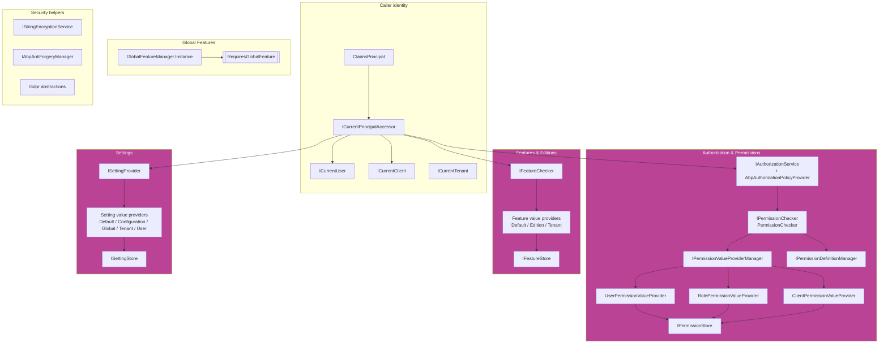

ABP's security story is not a single module — it is a small, layered stack of independent packages that collectively answer the questions *who is calling?*, *what are they allowed to do?*, *what is enabled for them?*, *what do they prefer?*, *what is private?*, and *how do we move secrets safely on the wire?*. Each layer lives in its own NuGet project under `framework/src/`, and each layer is consumed by — but does not depend on — the modules built on top of it (Identity, OpenIddict, Permission Management, Feature Management, Setting Management, Account, Tenant Management, GDPR).

This **Security** group is the reference for the framework-level primitives. The user-facing modules that *administer* these primitives (granting permissions, switching features per tenant, editing settings in the UI) are documented separately under the modules tab — links inline below.

## The security stack at a glance



The boxes correspond one-to-one with the pages in this group.

## Pages in this group

<CardGroup cols={2}>
  <Card title="Authorization" icon="shield-halved" href="/security/authorization">
    `AbpAuthorizationModule`, `AbpAuthorizationPolicyProvider`, `IAbpAuthorizationService`, the `[Authorize]` integration, and the `AlwaysAllowAuthorizationService` test helper in `Volo.Abp.Authorization` / `.Abstractions`.
  </Card>
  <Card title="Permissions" icon="key" href="/security/permissions">
    `IPermissionChecker`, `PermissionDefinitionContext`, `PermissionGroupDefinition`, `PermissionDefinition`, `IPermissionStore`, `PermissionGrantInfo`, and the `User` / `Role` / `Client` value-provider chain.
  </Card>
  <Card title="Features" icon="toggle-on" href="/security/features">
    `FeatureDefinition`, `IFeatureChecker`, the `Default` / `Edition` / `Tenant` value providers, `IFeatureStore`, and the `[RequiresFeature]` attribute in `Volo.Abp.Features`.
  </Card>
  <Card title="Global features" icon="globe" href="/security/global-features">
    `GlobalFeatureManager`, `GlobalFeature`, `[GlobalFeatureName]`, and `[RequiresGlobalFeature]` for compile-time / startup-time module gating in `Volo.Abp.GlobalFeatures`.
  </Card>
  <Card title="Settings" icon="sliders" href="/security/settings">
    `SettingDefinition`, `ISettingProvider`, `ISettingStore`, and the `Default` / `Configuration` / `Global` / `Tenant` / `User` value-provider hierarchy used by the Setting Management module.
  </Card>
  <Card title="Security helpers" icon="user-shield" href="/security/security-helpers">
    `ICurrentPrincipalAccessor`, `ICurrentUser`, `ICurrentClient`, `AbpClaimTypes`, and the `IAbpClaimsPrincipalContributor` extension surface in `Volo.Abp.Security`.
  </Card>
  <Card title="GDPR abstractions" icon="file-shield" href="/security/gdpr-abstractions">
    `Volo.Abp.Gdpr.Abstractions` — `GdprDataInfo`, `GdprUserDataProviderContext`, and the request/prepared/deletion Etos that drive personal-data export and erasure.
  </Card>
  <Card title="CSRF / anti-forgery" icon="lock" href="/security/csrf-anti-forgery">
    `AbpAntiForgeryOptions`, `IAbpAntiForgeryManager`, `AbpAutoValidateAntiforgeryTokenAttribute`, and the `XSRF-TOKEN` cookie wiring used by every ABP MVC / Razor Pages app.
  </Card>
  <Card title="String encryption" icon="key" href="/security/string-encryption">
    `IStringEncryptionService`, `StringEncryptionService` (AES-CBC + `Rfc2898DeriveBytes`), and `AbpStringEncryptionOptions` for symmetric protection of setting values, connection strings, and secrets.
  </Card>
</CardGroup>

## Layered responsibilities

<Note>
  The framework packages on this page are **abstractions plus default in-process implementations**. The production-grade implementations — the database-backed permission grant store, the management UI for permissions, features, and settings, the tenant-aware edition system — live in the [Permission Management](/modules/permission-management), [Feature Management](/modules/feature-management), [Setting Management](/modules/setting-management), and [Identity](/modules/identity) modules.
</Note>

| Concern | Framework package | Default in-memory impl | Real backend module |
| --- | --- | --- | --- |
| Authorization policies | `Volo.Abp.Authorization` | `AbpAuthorizationPolicyProvider` | n/a (ASP.NET Core native) |
| Permission grants | `Volo.Abp.Authorization` + `.Abstractions` | `NullPermissionStore` | [Permission Management](/modules/permission-management) |
| Feature values | `Volo.Abp.Features` | `NullFeatureStore` | [Feature Management](/modules/feature-management) |
| Setting values | `Volo.Abp.Settings` | `NullSettingStore` | [Setting Management](/modules/setting-management) |
| Global module features | `Volo.Abp.GlobalFeatures` | `GlobalFeatureManager.Instance` static | configured at startup |
| Current user / client | `Volo.Abp.Security` | `ThreadCurrentPrincipalAccessor` | [Identity](/modules/identity) populates claims |
| AES symmetric crypto | `Volo.Abp.Security` | `StringEncryptionService` | n/a |
| CSRF token | `Volo.Abp.AspNetCore.Mvc` | `AspNetCoreAbpAntiForgeryManager` | n/a |
| GDPR contracts | `Volo.Abp.Gdpr.Abstractions` | (events only) | Account / Identity / custom providers |

## The check pipeline, in one sentence each

- **Authorization** — ASP.NET Core's `IAuthorizationService` is intercepted by `AbpAuthorizationPolicyProvider`, which maps a permission name onto a synthesized `AuthorizationPolicy` whose only requirement is `PermissionRequirement(name)`; the handler ultimately calls `IPermissionChecker.IsGrantedAsync`.
- **Permissions** — `PermissionChecker` walks `IPermissionValueProviderManager.ValueProviders` (`U`, `R`, `C` by default) in order; the first `Granted` wins unless any provider returns `Prohibited`, which short-circuits to denied.
- **Features** — `FeatureChecker.GetOrNullAsync` walks the providers in **reverse** (so the most specific scope wins) — `Tenant` → `Edition` → `Default` — and returns the first non-null string value, parsed via `FeatureCheckerExtensions.IsEnabledAsync`.
- **Global features** — `GlobalFeatureManager.Instance.IsEnabled(name)` is a synchronous in-memory `HashSet<string>` check populated once at host startup; interceptors throw `AbpGlobalFeatureNotEnabledException` for `[RequiresGlobalFeature]` types when the feature is off.
- **Settings** — `SettingProvider.GetOrNullAsync` walks the providers in reverse (`User` → `Tenant` → `Global` → `Configuration` → `Default`); encrypted definitions are decrypted via `ISettingEncryptionService` on the way out.

## When to use what

<CardGroup cols={2}>
  <Card title="Use Permissions when…" icon="key">
    The decision is **per user / role / client** and **administrable at runtime** through the Permission Management UI. Examples: `Author.Edit`, `Orders.Refund`, `Tenant.Delete`.
  </Card>
  <Card title="Use Features when…" icon="toggle-on">
    The decision is **per tenant / edition** and represents a *subscription tier* or a billing-driven capability. Examples: `Chat.Enable`, `Reporting.MaxRowsPerExport`, `Bot.MaxConcurrentJobs`.
  </Card>
  <Card title="Use Global features when…" icon="globe">
    The decision is **per deployment** and the rest of the host should not even *compose* the related types. Examples: `eShop.PaymentRequest`, `Cms.BlogModule`.
  </Card>
  <Card title="Use Settings when…" icon="sliders">
    The decision is a **value** (not a boolean), is **layered** across host / tenant / user, and you want a single resolution order across the stack. Examples: `Abp.Localization.DefaultLanguage`, `Abp.Mailing.Smtp.Host`, `Identity.Password.RequiredLength`.
  </Card>
</CardGroup>

## What the security stack does *not* cover

This group is intentionally about *authorization decisions* and *secret material*. The orthogonal concerns live elsewhere:

- **Authentication / token issuance** — see the [OpenIddict module](/modules/openiddict), the JWT bearer integration in `Volo.Abp.AspNetCore.Authentication.JwtBearer`, and the [Account module](/modules/account).
- **User accounts, roles, password hashing** — see the [Identity module](/modules/identity), which is what populates the `ClaimsPrincipal` that `ICurrentPrincipalAccessor` later reads.
- **Audit logging and security log** — `Volo.Abp.SecurityLog`, documented under the auditing group.
- **Data protection at rest** — handled by EF Core value converters that consume `IStringEncryptionService`.
- **TLS, HSTS, CSP** — these are ASP.NET Core platform concerns; ABP does not wrap them.

## Source roots referenced by this group

| Page | Source root |
| --- | --- |
| [Authorization](/security/authorization) | `framework/src/Volo.Abp.Authorization/Volo/Abp/Authorization/` + `framework/src/Volo.Abp.Authorization.Abstractions/Volo/Abp/Authorization/` |
| [Permissions](/security/permissions) | `framework/src/Volo.Abp.Authorization/Volo/Abp/Authorization/Permissions/` |
| [Features](/security/features) | `framework/src/Volo.Abp.Features/Volo/Abp/Features/` |
| [Global features](/security/global-features) | `framework/src/Volo.Abp.GlobalFeatures/Volo/Abp/GlobalFeatures/` |
| [Settings](/security/settings) | `framework/src/Volo.Abp.Settings/Volo/Abp/Settings/` |
| [Security helpers](/security/security-helpers) | `framework/src/Volo.Abp.Security/Volo/Abp/Security/Claims/` |
| [GDPR abstractions](/security/gdpr-abstractions) | `framework/src/Volo.Abp.Gdpr.Abstractions/Volo/Abp/Gdpr/` |
| [CSRF / anti-forgery](/security/csrf-anti-forgery) | `framework/src/Volo.Abp.AspNetCore.Mvc/Volo/Abp/AspNetCore/Mvc/AntiForgery/` |
| [String encryption](/security/string-encryption) | `framework/src/Volo.Abp.Security/Volo/Abp/Security/Encryption/` |

## Reading order

For a first pass, follow the pages top-to-bottom in the order they appear in this group — that mirrors how the runtime composes:

1. **[Authorization](/security/authorization)** introduces `AbpAuthorizationModule`, the policy provider, and the `[Authorize]` integration. You do not have to read it line-by-line; the key idea is "ASP.NET Core's `IAuthorizationService` is intact; the policy provider synthesizes permission policies on demand".
2. **[Permissions](/security/permissions)** is the deep dive on the actual *grant evaluation* — the `User` / `Role` / `Client` value providers, the `IPermissionStore` contract, the multi-tenancy side filter. Read it once; you will refer back to the provider chain diagram a lot.
3. **[Features](/security/features)** introduces the parallel stack for tenant-scoped capability gating. The shape (`*Definition` + `*Store` + `*ValueProvider` chain + `Requires*` attribute + interceptor) becomes a template you will recognise everywhere.
4. **[Global features](/security/global-features)** flips the same vocabulary to startup-time. Reading it after the per-tenant page makes the contrast obvious.
5. **[Settings](/security/settings)** applies the same `*Definition` + `*Store` + `ValueProvider` pattern to free-form values, with five layers instead of three.
6. **[Security helpers](/security/security-helpers)** doubles back to the identity primitives every previous layer was implicitly reading from. It is short, and worth re-reading after the four core pages.
7. **[GDPR abstractions](/security/gdpr-abstractions)** is independent — read it any time you need to make a module participate in personal-data export / erasure.
8. **[CSRF / anti-forgery](/security/csrf-anti-forgery)** and **[String encryption](/security/string-encryption)** are utility pages. Glance at them when you are wiring a host; they do not have to be re-read.

## Defaults you usually need to override in production

<Warning>
  The framework defaults are tuned to make `dotnet new abp` *boot* without configuration, not to be secure. Before you ship, audit at minimum:
</Warning>

- **`AbpStringEncryptionOptions.DefaultPassPhrase`, `InitVectorBytes`, `DefaultSalt`** — the defaults are public; see [String encryption](/security/string-encryption).
- **`AbpAntiForgeryOptions.AuthCookieSchemaName`** — set this if you customised the cookie scheme, otherwise auto-validation may silently skip browser sessions.
- **`AbpClaimsPrincipalFactoryOptions.IsDynamicClaimsEnabled`** — off by default. Flip it on (and keep `IsRemoteRefreshEnabled = true`) to refresh `DynamicClaims` per request, which removes the need to log out / in after a role change but adds per-request HTTP traffic.
- **The `Settings:` section in `appsettings.json`** — `ConfigurationSettingValueProvider` reads from this prefix; values you check into the repo are visible to anyone who can clone the repo.
- **`AbpPermissionOptions.DeletedPermissions` / `DeletedPermissionGroups`** — the surgical opt-out for permissions defined by upstream modules; combine with `IPermissionDefinitionProvider.PreDefine` / `PostDefine` to mutate the definition tree before it's cached.

## Where authentication fits

This group does **not** cover authentication — it starts from "we have a `ClaimsPrincipal`, what now?". The packages that produce that principal are:

- **`Volo.Abp.AspNetCore.Authentication.JwtBearer`** — validates inbound JWTs and maps the `sub` / `role` / `client_id` claims onto `AbpClaimTypes`.
- **`Volo.Abp.AspNetCore.Authentication.OAuth` / `.OpenIdConnect`** — server-side OIDC client integration for hosts that delegate auth.
- **[OpenIddict module](/modules/openiddict)** — issues tokens for first-party clients and runs the `/connect/authorize`, `/connect/token`, `/connect/userinfo` endpoints.
- **[Identity module](/modules/identity)** — owns the user/role store that the password grant and external-provider flows write into.
- **[Account module](/modules/account)** — the Razor pages / Blazor / Angular UIs for login, register, forgot-password, two-factor, impersonation.

By the time any of the abstractions on this overview page are reached, those layers have already populated `HttpContext.User`. Everything below is *after* the principal exists.

## Cross-cutting interception

Three of the layers in this group install **Castle.DynamicProxy** interceptors during module loading — they all hang off the same registrar pattern documented in [Dynamic proxy & aspects](/core/dynamic-proxy-and-aspects):

| Layer | Interceptor | Attached when… |
| --- | --- | --- |
| Authorization | `AuthorizationInterceptor` | the target carries `[Authorize]` or implements `IAvoidDuplicateCrossCuttingConcerns` plus the marker |
| Features | `FeatureInterceptor` | the target carries `[RequiresFeature]` |
| Global features | `GlobalFeatureInterceptor` | the target carries `[RequiresGlobalFeature]` or implements `IGlobalFeatureCheckingEnabled` |

That means every application service, controller, domain service, and background job that picks up one of those attributes is **transparently enforced** without you having to call `_authorizationService.CheckAsync(...)` or `_featureChecker.CheckEnabledAsync(...)` yourself. The interceptors also short-circuit when the cross-cutting concern is already applied higher up the call stack — see `AbpCrossCuttingConcerns` in the core runtime — so wrapping a controller in an attribute does not re-run the check inside the application service it delegates to.

## A worked example

Putting four of these layers together for a realistic application service. The service:

- requires login *and* the `BookStore.Authors.Create` permission (Authorization + Permissions),
- is only available to tenants on an edition where `BookStore.Enable` is on (Features),
- is fully suppressed in deployments that don't ship the BookStore module (Global features),
- reads the configured author-name format from `Abp.BookStore.NameFormat` (Settings),
- runs as a particular user / tenant context (Security helpers).

```csharp
[Authorize(BookStorePermissions.Authors.Create)]
[RequiresFeature(BookStoreFeatures.Enable)]
[RequiresGlobalFeature(typeof(BookStoreFeature))]
public class AuthorAppService : ApplicationService, IAuthorAppService
{
    private readonly IAuthorRepository _authors;
    private readonly ISettingProvider _settings;

    public AuthorAppService(IAuthorRepository authors, ISettingProvider settings)
    {
        _authors = authors;
        _settings = settings;
    }

    public async Task<AuthorDto> CreateAsync(CreateAuthorInput input)
    {
        var format = await _settings.GetOrNullAsync("Abp.BookStore.NameFormat");
        var name = string.Format(format ?? "{0} {1}", input.FirstName, input.LastName);

        var author = new Author(GuidGenerator.Create(), name)
        {
            TenantId = CurrentTenant.Id   // ICurrentTenant
        };
        await _authors.InsertAsync(author);
        return ObjectMapper.Map<Author, AuthorDto>(author);
    }
}
```

Every annotation on the class maps to exactly one page in this group. The implementation has no security-related code other than reading `CurrentTenant.Id`; the interceptors and the policy provider do everything else.

## Idioms you will see repeatedly

The security layer reuses a small set of shapes across packages. Recognising them once means each new page is shorter to read:

<CardGroup cols={2}>
  <Card title="*Definition + *DefinitionProvider" icon="cube">
    `PermissionDefinition` / `FeatureDefinition` / `SettingDefinition` are immutable shape descriptors. They are produced by `I*DefinitionProvider` implementations during startup and cached in a `Static*DefinitionStore`.
  </Card>
  <Card title="I*Store" icon="database">
    `IPermissionStore` / `IFeatureStore` / `ISettingStore` are the *value* contracts. Each one takes a definition name, a provider name (`"U"`, `"R"`, `"T"`, …), and a provider key (a user id, a tenant id, …). Defaults are `Null*Store`; production hosts swap in EF Core implementations.
  </Card>
  <Card title="ValueProvider chain" icon="diagram-project">
    `I*ValueProvider` instances are walked in order by the corresponding manager. Permissions: first granted *or* short-circuit on prohibit. Features / settings: walked in reverse, first non-null wins.
  </Card>
  <Card title="[Requires*] + Interceptor" icon="layer-group">
    `[Authorize]` / `[RequiresFeature]` / `[RequiresGlobalFeature]` are caught by per-layer interceptors during DI registration and enforced on *every* call site, not just HTTP.
  </Card>
</CardGroup>

Once these four shapes click, the rest of the source tree reads almost mechanically.

## Boot-time vs request-time decisions

A useful mental split when wading through the source tree: every primitive in this group lands on one side of a clean line — does it decide at *boot time* or at *request time*?

| Primitive | Decision time | Why |
| --- | --- | --- |
| `GlobalFeatureManager.IsEnabled` | boot | written once during `PreConfigureServices`, then read forever |
| `IPermissionDefinitionProvider` / `IFeatureDefinitionProvider` / `ISettingDefinitionProvider` | boot | run once into `Static*DefinitionStore` |
| `ConfigurationSettingValueProvider` | boot-ish | reads `IConfiguration`, which is rebuilt on file change but otherwise static |
| `IPermissionChecker.IsGrantedAsync` | request | walks the value-provider chain per call |
| `IFeatureChecker.IsEnabledAsync` | request | same |
| `ISettingProvider.GetOrNullAsync` | request | same |
| `ICurrentPrincipalAccessor.Principal` | request | `AsyncLocal` per scope |
| `IStringEncryptionService.Encrypt/Decrypt` | request | pure function of inputs |

Anything in the "boot" row is *unsafe* to change mid-flight: don't mutate `GlobalFeatureManager.Instance` from a request handler, don't `services.Configure<…>` outside the module entry points, don't expect a definition provider to re-run after `OnApplicationInitialization`. Anything in the "request" row is *safe* to call from any thread or scope — it consults the current ambient state every time.
