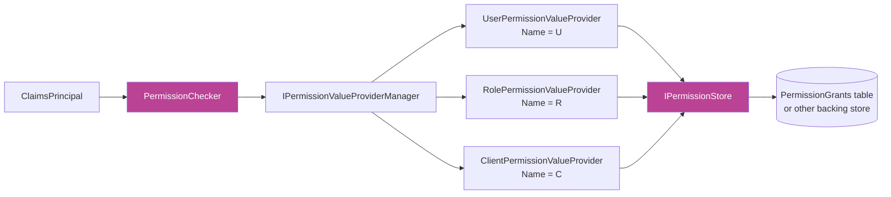
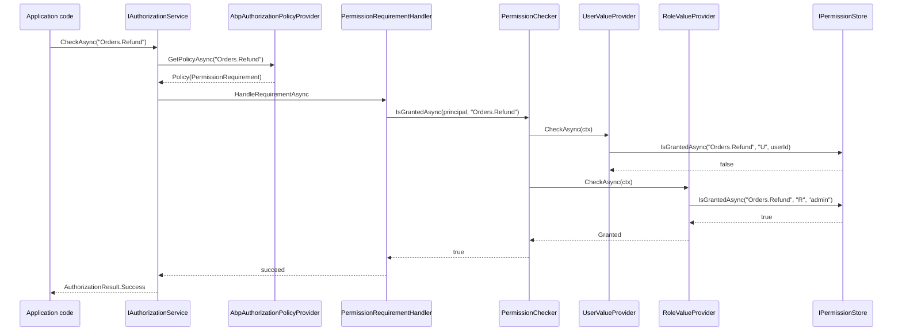

If [Authorization](/security/authorization) is the *who do I ask?* layer, **Permissions** is the *what is the answer?* layer. Everything on this page lives under `framework/src/Volo.Abp.Authorization.Abstractions/Volo/Abp/Authorization/Permissions/` (contracts) and `framework/src/Volo.Abp.Authorization/Volo/Abp/Authorization/Permissions/` (default implementations).

Two big ideas:

1. Permissions are **defined** by `IPermissionDefinitionProvider` implementations and surface as `PermissionDefinition` instances grouped into `PermissionGroupDefinition` buckets. The grant *administration* UI (Permission Management module) walks these definitions to render its tree.
2. Permissions are **checked** by `IPermissionChecker`, which delegates to an ordered chain of `IPermissionValueProvider`s — one per "scope": user, role, client — that each consult `IPermissionStore` to read concrete `PermissionGrantInfo` records.

## Source layout

```
framework/src/Volo.Abp.Authorization.Abstractions/Volo/Abp/Authorization/Permissions/
├── AbpPermissionOptions.cs
├── AlwaysAllowPermissionChecker.cs
├── ICanAddChildPermission.cs
├── IPermissionChecker.cs
├── IPermissionDefinitionContext.cs
├── IPermissionDefinitionManager.cs
├── IPermissionDefinitionProvider.cs
├── IPermissionStore.cs
├── IPermissionValueProvider.cs
├── IPermissionValueProviderManager.cs
├── MultiplePermissionGrantResult.cs
├── NullPermissionStore.cs
├── PermissionDefinition.cs
├── PermissionDefinitionContext.cs
├── PermissionDefinitionContextExtensions.cs
├── PermissionDefinitionProvider.cs
├── PermissionGrantInfo.cs
├── PermissionGrantResult.cs
├── PermissionGroupDefinition.cs
├── PermissionStateContext.cs
├── PermissionValueCheckContext.cs
├── PermissionValueProvider.cs
└── PermissionValuesCheckContext.cs

framework/src/Volo.Abp.Authorization/Volo/Abp/Authorization/Permissions/
├── ClientPermissionValueProvider.cs
├── PermissionChecker.cs
├── PermissionDefinitionManager.cs
├── PermissionValueProviderManager.cs
├── RolePermissionValueProvider.cs
├── StaticPermissionDefinitionStore.cs
├── UserPermissionValueProvider.cs
└── … (state checkers, telemetry, dynamic store)
```

## Defining permissions

### `PermissionDefinition`

`framework/src/Volo.Abp.Authorization.Abstractions/Volo/Abp/Authorization/Permissions/PermissionDefinition.cs`:

```csharp
public class PermissionDefinition :
    IHasSimpleStateCheckers<PermissionDefinition>,
    ICanAddChildPermission
{
    public string Name { get; }
    public PermissionDefinition? Parent { get; private set; }
    public MultiTenancySides MultiTenancySide { get; set; }
    public List<string> Providers { get; }
    public List<ISimpleStateChecker<PermissionDefinition>> StateCheckers { get; }
    public ILocalizableString DisplayName { get; set; }
    public IReadOnlyList<PermissionDefinition> Children { get; }
    public Dictionary<string, object?> Properties { get; }
    public bool IsEnabled { get; set; }

    protected internal PermissionDefinition(
        string name,
        ILocalizableString? displayName = null,
        MultiTenancySides multiTenancySide = MultiTenancySides.Both,
        bool isEnabled = true) { ... }

    public virtual PermissionDefinition AddChild(
        string name,
        ILocalizableString? displayName = null,
        MultiTenancySides multiTenancySide = MultiTenancySides.Both,
        bool isEnabled = true) { ... }

    public virtual PermissionDefinition WithProperty(string key, object value);
    public virtual PermissionDefinition WithProviders(params string[] providers);
}
```

Key fields you actually configure:

- **`Name`** — globally unique. Convention: `Module.Resource.Action`, e.g. `BookStore.Authors.Create`.
- **`MultiTenancySide`** — `Host` / `Tenant` / `Both`. The checker filters by this against the current tenant side (see below).
- **`Providers`** — when non-empty, *restricts* which value-provider names may grant this permission. E.g. a host-only permission may set `Providers = ["U", "R"]` to forbid client grants.
- **`IsEnabled`** — a hard kill switch; a disabled permission is always denied, but is still present in the definition tree.
- **`Children` / `AddChild`** — parent/child is enforced **only at the UI level**: when a child is granted the parent should be granted. The grant pipeline itself does not require it.

### `PermissionGroupDefinition`

`framework/src/Volo.Abp.Authorization.Abstractions/Volo/Abp/Authorization/Permissions/PermissionGroupDefinition.cs` groups permissions for display:

```csharp
public class PermissionGroupDefinition : ICanAddChildPermission
{
    public string Name { get; }
    public ILocalizableString DisplayName { get; set; }
    public IReadOnlyList<PermissionDefinition> Permissions { get; }

    public virtual PermissionDefinition AddPermission(
        string name,
        ILocalizableString? displayName = null,
        MultiTenancySides multiTenancySide = MultiTenancySides.Both,
        bool isEnabled = true) { ... }

    public virtual List<PermissionDefinition> GetPermissionsWithChildren();
    public PermissionDefinition? GetPermissionOrNull(string name);
}
```

Groups are how the management UI renders columns; they have **no effect on grant evaluation**.

### `IPermissionDefinitionProvider` / `PermissionDefinitionProvider`

Every module that owns permissions ships one of these. From the abstractions package:

```csharp
public interface IPermissionDefinitionProvider
{
    void PreDefine(IPermissionDefinitionContext context);
    void Define(IPermissionDefinitionContext context);
    void PostDefine(IPermissionDefinitionContext context);
}

public abstract class PermissionDefinitionProvider
    : IPermissionDefinitionProvider, ITransientDependency
{
    public virtual void PreDefine(IPermissionDefinitionContext context) { }
    public abstract void Define(IPermissionDefinitionContext context);
    public virtual void PostDefine(IPermissionDefinitionContext context) { }
}
```

A realistic implementation:

```csharp
public class BookStorePermissionDefinitionProvider : PermissionDefinitionProvider
{
    public override void Define(IPermissionDefinitionContext context)
    {
        var group = context.AddGroup(BookStorePermissions.GroupName, L("Permission:BookStore"));

        var booksPermission = group.AddPermission(
            BookStorePermissions.Books.Default, L("Permission:Books"));

        booksPermission.AddChild(
            BookStorePermissions.Books.Create, L("Permission:Books.Create"));
        booksPermission.AddChild(
            BookStorePermissions.Books.Edit, L("Permission:Books.Edit"));
        booksPermission.AddChild(
            BookStorePermissions.Books.Delete, L("Permission:Books.Delete"));
    }

    private static LocalizableString L(string name) =>
        LocalizableString.Create<BookStoreResource>(name);
}
```

The auto-discovery hook in `AbpAuthorizationModule.PreConfigureServices` finds this type and adds it to `AbpPermissionOptions.DefinitionProviders` — no manual registration required.

### `PermissionDefinitionContext`

`framework/src/Volo.Abp.Authorization.Abstractions/Volo/Abp/Authorization/Permissions/PermissionDefinitionContext.cs`:

```csharp
public class PermissionDefinitionContext : IPermissionDefinitionContext
{
    public IServiceProvider ServiceProvider { get; }
    public Dictionary<string, PermissionGroupDefinition> Groups { get; }
    internal IPermissionDefinitionProvider? CurrentProvider { get; set; }

    public virtual PermissionGroupDefinition AddGroup(
        string name, ILocalizableString? displayName = null) { ... }

    public virtual PermissionGroupDefinition GetGroup(string name) { ... }
    public virtual PermissionGroupDefinition? GetGroupOrNull(string name) { ... }
    public virtual void RemoveGroup(string name) { ... }
    public virtual PermissionDefinition? GetPermissionOrNull(string name) { ... }
}
```

The `CurrentProvider` field is stamped onto every group / permission via the `KnownPropertyNames.CurrentProviderName` property so the management UI can show *which module* defined a given permission.

Use `context.GetGroup("…")` or `context.GetPermissionOrNull("…")` in your `PreDefine` / `PostDefine` to *mutate or remove* permissions defined by upstream modules — e.g. an extension module that wants to remove `Identity.Roles.Create` and add its own.

## Checking permissions

### `IPermissionChecker`

`framework/src/Volo.Abp.Authorization.Abstractions/Volo/Abp/Authorization/Permissions/IPermissionChecker.cs`:

```csharp
public interface IPermissionChecker
{
    Task<bool> IsGrantedAsync(string name);
    Task<bool> IsGrantedAsync(ClaimsPrincipal? claimsPrincipal, string name);
    Task<MultiplePermissionGrantResult> IsGrantedAsync(string[] names);
    Task<MultiplePermissionGrantResult> IsGrantedAsync(
        ClaimsPrincipal? claimsPrincipal, string[] names);
}
```

`MultiplePermissionGrantResult` carries a `Dictionary<string, PermissionGrantResult>` plus `AllGranted` / `AllProhibited` shortcuts. `PermissionGrantResult` is one of `Undefined`, `Granted`, `Prohibited`.

### `PermissionChecker` — the canonical impl

`framework/src/Volo.Abp.Authorization/Volo/Abp/Authorization/Permissions/PermissionChecker.cs`:

```csharp
public class PermissionChecker : IPermissionChecker, ITransientDependency
{
    protected IPermissionDefinitionManager PermissionDefinitionManager { get; }
    protected ICurrentPrincipalAccessor PrincipalAccessor { get; }
    protected ICurrentTenant CurrentTenant { get; }
    protected IPermissionValueProviderManager PermissionValueProviderManager { get; }
    protected ISimpleStateCheckerManager<PermissionDefinition> StateCheckerManager { get; }

    public virtual async Task<bool> IsGrantedAsync(
        ClaimsPrincipal? claimsPrincipal, string name)
    {
        var permission = await PermissionDefinitionManager.GetOrNullAsync(name);
        if (permission == null) return false;
        if (!permission.IsEnabled) return false;
        if (!await StateCheckerManager.IsEnabledAsync(permission)) return false;

        var multiTenancySide = claimsPrincipal?.GetMultiTenancySide()
                               ?? CurrentTenant.GetMultiTenancySide();
        if (!permission.MultiTenancySide.HasFlag(multiTenancySide)) return false;

        var isGranted = false;
        var context = new PermissionValueCheckContext(permission, claimsPrincipal);
        foreach (var provider in PermissionValueProviderManager.ValueProviders)
        {
            if (context.Permission.Providers.Any() &&
                !context.Permission.Providers.Contains(provider.Name))
            {
                continue;
            }

            var result = await provider.CheckAsync(context);
            if (result == PermissionGrantResult.Granted) isGranted = true;
            else if (result == PermissionGrantResult.Prohibited) return false;
        }

        return isGranted;
    }
}
```

Walk it from the top:

1. Look the name up. Unknown / disabled / state-rejected → `false`.
2. Filter by multi-tenancy side — a `Host`-only permission is denied for tenant principals and vice versa.
3. Iterate `PermissionValueProviderManager.ValueProviders` in order. Skip providers whose name is not in `permission.Providers` when that list is set.
4. The first **`Prohibited`** short-circuits to denied. Otherwise the result is `true` iff **any** provider returned `Granted`.

The plural `IsGrantedAsync(string[] names)` overload (also in `PermissionChecker.cs`) is similar but batches calls into `IPermissionValueProvider.CheckAsync(PermissionValuesCheckContext)` so a backing store can answer "is X, Y, Z granted to this user?" in a single round-trip.

### The provider stack



Order matches `AbpAuthorizationModule.ConfigureServices`:

```csharp
Configure<AbpPermissionOptions>(options =>
{
    options.ValueProviders.Add<UserPermissionValueProvider>();
    options.ValueProviders.Add<RolePermissionValueProvider>();
    options.ValueProviders.Add<ClientPermissionValueProvider>();
});
```

Adding your own (e.g. an `OrganizationUnit` provider) is just a matter of registering a new `PermissionValueProvider` and inserting it into `ValueProviders` at the position you want.

### `PermissionValueProvider` base

`framework/src/Volo.Abp.Authorization.Abstractions/Volo/Abp/Authorization/Permissions/PermissionValueProvider.cs`:

```csharp
public abstract class PermissionValueProvider : IPermissionValueProvider, ITransientDependency
{
    public abstract string Name { get; }
    protected IPermissionStore PermissionStore { get; }

    protected PermissionValueProvider(IPermissionStore permissionStore)
        => PermissionStore = permissionStore;

    public abstract Task<PermissionGrantResult> CheckAsync(PermissionValueCheckContext context);
    public abstract Task<MultiplePermissionGrantResult> CheckAsync(PermissionValuesCheckContext context);
}
```

Concrete providers (`U`, `R`, `C`) read the relevant claim from the principal and call into `IPermissionStore` with their own provider name.

### `UserPermissionValueProvider`

`framework/src/Volo.Abp.Authorization/Volo/Abp/Authorization/Permissions/UserPermissionValueProvider.cs`:

```csharp
public class UserPermissionValueProvider : PermissionValueProvider
{
    public const string ProviderName = "U";
    public override string Name => ProviderName;

    public override async Task<PermissionGrantResult> CheckAsync(PermissionValueCheckContext context)
    {
        var userId = context.Principal?.FindFirst(AbpClaimTypes.UserId)?.Value;
        if (userId == null) return PermissionGrantResult.Undefined;

        return await PermissionStore.IsGrantedAsync(context.Permission.Name, Name, userId)
            ? PermissionGrantResult.Granted
            : PermissionGrantResult.Undefined;
    }
}
```

Reads `AbpClaimTypes.UserId` from the principal — see [Security helpers](/security/security-helpers) — and asks the store "is `Permission.Name` granted to provider key `userId` under provider name `U`?".

### `RolePermissionValueProvider`

`framework/src/Volo.Abp.Authorization/Volo/Abp/Authorization/Permissions/RolePermissionValueProvider.cs`:

```csharp
public class RolePermissionValueProvider : PermissionValueProvider
{
    public const string ProviderName = "R";
    public override string Name => ProviderName;

    public override async Task<PermissionGrantResult> CheckAsync(PermissionValueCheckContext context)
    {
        var roles = context.Principal?
            .FindAll(AbpClaimTypes.Role).Select(c => c.Value).ToArray();
        if (roles == null || !roles.Any())
            return PermissionGrantResult.Undefined;

        foreach (var role in roles.Distinct())
        {
            if (await PermissionStore.IsGrantedAsync(context.Permission.Name, Name, role))
                return PermissionGrantResult.Granted;
        }
        return PermissionGrantResult.Undefined;
    }
}
```

Iterates every `AbpClaimTypes.Role` claim; first match wins.

### `ClientPermissionValueProvider`

`framework/src/Volo.Abp.Authorization/Volo/Abp/Authorization/Permissions/ClientPermissionValueProvider.cs`:

```csharp
public class ClientPermissionValueProvider : PermissionValueProvider
{
    public const string ProviderName = "C";
    public override string Name => ProviderName;
    protected ICurrentTenant CurrentTenant { get; }

    public override async Task<PermissionGrantResult> CheckAsync(PermissionValueCheckContext context)
    {
        var clientId = context.Principal?.FindFirst(AbpClaimTypes.ClientId)?.Value;
        if (clientId == null) return PermissionGrantResult.Undefined;

        using (CurrentTenant.Change(null))
        {
            return await PermissionStore.IsGrantedAsync(context.Permission.Name, Name, clientId)
                ? PermissionGrantResult.Granted
                : PermissionGrantResult.Undefined;
        }
    }
}
```

Two subtleties:

- The claim is `AbpClaimTypes.ClientId`, populated by the OpenIddict / IdentityServer integration for machine-to-machine tokens.
- The check runs inside `CurrentTenant.Change(null)` — client grants are **host-side**; a confidential M2M client owns its permissions regardless of which tenant context the request is wearing.

## The grant store

### `IPermissionStore`

`framework/src/Volo.Abp.Authorization.Abstractions/Volo/Abp/Authorization/Permissions/IPermissionStore.cs`:

```csharp
public interface IPermissionStore
{
    Task<bool> IsGrantedAsync(string name, string providerName, string providerKey);
    Task<MultiplePermissionGrantResult> IsGrantedAsync(
        string[] names, string providerName, string providerKey);
}
```

`providerName` is the value-provider name (`U` / `R` / `C` / custom), `providerKey` is whatever that provider keyed on (a user ID, a role name, a client ID).

### `NullPermissionStore`

The default when no module replaces it — `NullPermissionStore` returns `false` for every check, effectively denying everything. The real implementation lives in the [Permission Management module](/modules/permission-management) and reads from a `PermissionGrants` table.

### `PermissionGrantInfo`

`framework/src/Volo.Abp.Authorization.Abstractions/Volo/Abp/Authorization/Permissions/PermissionGrantInfo.cs`:

```csharp
public class PermissionGrantInfo
{
    public string Name { get; }
    public bool IsGranted { get; }
    public string? ProviderName { get; }
    public string? ProviderKey { get; }

    public PermissionGrantInfo(
        string name, bool isGranted,
        string? providerName = null, string? providerKey = null) { ... }
}
```

The DTO returned by management endpoints and consumed by `PermissionGrantInfoListExtensions` for filtering. The list extensions live alongside in the abstractions package and provide helpers like `GetGranted(...)`, `GetProhibited(...)`, and `Add(...)` for building up batched results.

## Static vs dynamic definition stores

`PermissionDefinitionManager` does not just call providers each time — it caches into two stores:

- `StaticPermissionDefinitionStore` (`framework/src/Volo.Abp.Authorization/Volo/Abp/Authorization/Permissions/StaticPermissionDefinitionStore.cs`) — runs every registered `IPermissionDefinitionProvider` once, lazily, and caches the resulting `PermissionGroupDefinition` map in process.
- `IDynamicPermissionDefinitionStore` — defaults to `NullDynamicPermissionDefinitionStore` but is overridden by the [Permission Management module](/modules/permission-management) to read **runtime-added** permissions from the database (so SaaS hosts can add module-shaped permissions without redeploying).

`PermissionDefinitionManager.GetAsync(name)` consults both, static first.

## `AlwaysAllowPermissionChecker`

Mirror image of `AlwaysAllowAuthorizationService` for the test bench:

```csharp
public class AlwaysAllowPermissionChecker : IPermissionChecker
{
    public Task<bool> IsGrantedAsync(string name) => Task.FromResult(true);
    public Task<bool> IsGrantedAsync(ClaimsPrincipal? p, string name) => Task.FromResult(true);
    // ... batched overloads
}
```

Registered automatically by the `AddAlwaysAllowAuthorization()` extension covered on the [Authorization](/security/authorization) page.

## End-to-end check sequence



## Cross-references

<CardGroup cols={2}>
  <Card title="Authorization policy" icon="shield-halved" href="/security/authorization">
    How `[Authorize("X.Y")]` resolves to a `PermissionRequirement` via `AbpAuthorizationPolicyProvider`.
  </Card>
  <Card title="Permission Management module" icon="boxes-stacked" href="/modules/permission-management">
    The database-backed `IPermissionStore`, the management UI, and the `IPermissionManager` administration API.
  </Card>
  <Card title="Current principal" icon="user-shield" href="/security/security-helpers">
    Where `AbpClaimTypes.UserId` / `AbpClaimTypes.Role` / `AbpClaimTypes.ClientId` come from.
  </Card>
  <Card title="Features (tenant gating)" icon="toggle-on" href="/security/features">
    The companion stack for *capabilities* gated per tenant / edition rather than per user.
  </Card>
</CardGroup>
