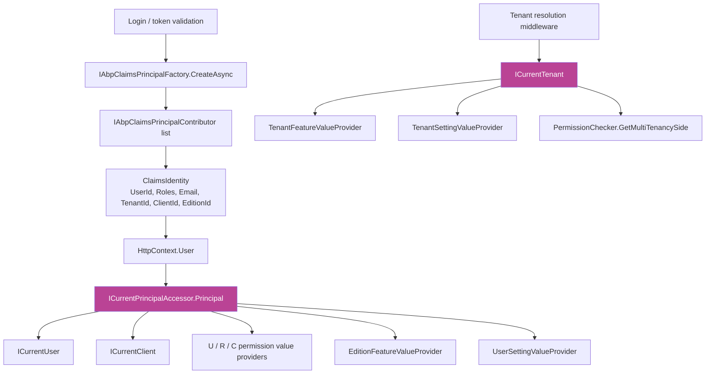

The `[Authorize]`, `IPermissionChecker`, `IFeatureChecker`, and `ISettingProvider` layers all ask the same first question: *who is calling?* They answer it by consulting a thin set of *accessor* abstractions that surface the current `ClaimsPrincipal`, project it onto strongly-typed shapes (`ICurrentUser`, `ICurrentClient`), and combine it with a separate **tenant context** primitive (`ICurrentTenant`).

This page covers the framework-level abstractions in `framework/src/Volo.Abp.Security/Volo/Abp/Security/`. The *production-grade* `ClaimsPrincipal` — the one populated with `userid`, `tenantid`, `role`, `client_id`, `edition_id`, custom roles — comes from the [Identity module](/modules/identity) and the [OpenIddict module](/modules/openiddict). Password hashing lives there too: `IPasswordHasher<TUser>` is the standard ASP.NET Core Identity contract; ABP does not replace it.

## Source layout

```
framework/src/Volo.Abp.Security/Volo/Abp/Security/
├── AbpSecurityModule.cs
├── Claims/
│   ├── AbpClaimTypes.cs
│   ├── AbpClaimsPrincipalContributorContext.cs
│   ├── AbpClaimsPrincipalFactory.cs
│   ├── AbpClaimsPrincipalFactoryOptions.cs
│   ├── AbpDynamicClaim.cs
│   ├── AbpDynamicClaimCacheItem.cs
│   ├── AbpDynamicClaimsPrincipalContributorBase.cs
│   ├── CurrentPrincipalAccessorBase.cs
│   ├── CurrentPrincipalAccessorExtensions.cs
│   ├── IAbpClaimsPrincipalContributor.cs
│   ├── IAbpClaimsPrincipalFactory.cs
│   ├── IAbpDynamicClaimsPrincipalContributor.cs
│   ├── ICurrentPrincipalAccessor.cs
│   ├── RemoteDynamicClaimsPrincipalContributorBase.cs
│   ├── RemoteDynamicClaimsPrincipalContributorCacheBase.cs
│   └── ThreadCurrentPrincipalAccessor.cs
├── Clients/
│   └── ICurrentClient.cs
├── Users/
│   └── ICurrentUser.cs
└── Encryption/                                 ← see /security/string-encryption
```

`ICurrentTenant` lives in `framework/src/Volo.Abp.MultiTenancy.Abstractions/Volo/Abp/MultiTenancy/ICurrentTenant.cs` — separate package, but used together with the rest of this page.

## `ICurrentPrincipalAccessor`

`framework/src/Volo.Abp.Security/Volo/Abp/Security/Claims/ICurrentPrincipalAccessor.cs`:

```csharp
public interface ICurrentPrincipalAccessor
{
    ClaimsPrincipal Principal { get; }
    IDisposable Change(ClaimsPrincipal principal);
}
```

A single, ambient `ClaimsPrincipal` plus a scoped *swap*. Every framework consumer (`PermissionChecker`, `UserPermissionValueProvider`, `EditionFeatureValueProvider`, the auditing module, the `ICurrentUser` shim) ultimately reads from this property.

### `CurrentPrincipalAccessorBase`

`framework/src/Volo.Abp.Security/Volo/Abp/Security/Claims/CurrentPrincipalAccessorBase.cs`:

```csharp
public abstract class CurrentPrincipalAccessorBase : ICurrentPrincipalAccessor
{
    public ClaimsPrincipal Principal => _currentPrincipal.Value ?? GetClaimsPrincipal();

    private readonly AsyncLocal<ClaimsPrincipal> _currentPrincipal = new();

    protected abstract ClaimsPrincipal GetClaimsPrincipal();

    public virtual IDisposable Change(ClaimsPrincipal principal) => SetCurrent(principal);

    private IDisposable SetCurrent(ClaimsPrincipal principal)
    {
        var parent = Principal;
        _currentPrincipal.Value = principal;
        return new DisposeAction<(AsyncLocal<ClaimsPrincipal>, ClaimsPrincipal)>(
            static state => { var (cur, p) = state; cur.Value = p; },
            (_currentPrincipal, parent));
    }
}
```

Two things to understand:

1. The `AsyncLocal<ClaimsPrincipal>` is the **swap buffer**. When you call `Change(...)` the new principal is visible *for the rest of the current async flow*, and the previous one is restored on dispose. That makes it safe to spin up background work and impersonate a user without polluting the caller's scope.
2. `GetClaimsPrincipal()` is the **default source** consulted only when no swap is active. In a console / worker, that source is the thread-bound principal:

```csharp
public class ThreadCurrentPrincipalAccessor : CurrentPrincipalAccessorBase, ISingletonDependency
{
    protected override ClaimsPrincipal GetClaimsPrincipal()
        => (Thread.CurrentPrincipal as ClaimsPrincipal)!;
}
```

In an ASP.NET Core host, `AbpAspNetCoreSecurityModule` registers an `HttpContextCurrentPrincipalAccessor` instead, which reads from `HttpContext.User`.

### Swap helpers

`framework/src/Volo.Abp.Security/Volo/Abp/Security/Claims/CurrentPrincipalAccessorExtensions.cs`:

```csharp
public static class CurrentPrincipalAccessorExtensions
{
    public static IDisposable Change(this ICurrentPrincipalAccessor cpa, Claim claim)
        => cpa.Change(new[] { claim });

    public static IDisposable Change(this ICurrentPrincipalAccessor cpa, IEnumerable<Claim> claims)
        => cpa.Change(new ClaimsIdentity(claims));

    public static IDisposable Change(this ICurrentPrincipalAccessor cpa, ClaimsIdentity claimsIdentity)
        => cpa.Change(new ClaimsPrincipal(claimsIdentity));
}
```

Idiomatic usage when running code "as another user" — e.g. inside a background job:

```csharp
using (_currentPrincipalAccessor.Change(impersonatedClaims))
{
    await _orderAppService.RefundAsync(orderId);
}
```

`ICurrentUser` / `IPermissionChecker` / `ISettingProvider` all observe the swap.

## `ICurrentUser`

`framework/src/Volo.Abp.Security/Volo/Abp/Users/ICurrentUser.cs`:

```csharp
public interface ICurrentUser
{
    bool IsAuthenticated { get; }
    Guid? Id { get; }
    string? UserName { get; }
    string? Name { get; }
    string? SurName { get; }
    string? PhoneNumber { get; }
    bool PhoneNumberVerified { get; }
    string? Email { get; }
    bool EmailVerified { get; }
    Guid? TenantId { get; }
    string[] Roles { get; }

    Claim? FindClaim(string claimType);
    Claim[] FindClaims(string claimType);
    Claim[] GetAllClaims();
    bool IsInRole(string roleName);
}
```

It is a thin, strongly-typed *projection* of the ambient `ClaimsPrincipal`. The default implementation (`CurrentUser` in the same package) is essentially:

```csharp
public Guid? Id => _currentPrincipalAccessor.Principal
    ?.FindFirst(AbpClaimTypes.UserId)?.Value.To<Guid?>();

public string[] Roles => _currentPrincipalAccessor.Principal
    ?.FindAll(AbpClaimTypes.Role).Select(c => c.Value).ToArray() ?? Array.Empty<string>();
```

Use it everywhere you would otherwise dig into `ClaimsPrincipal` claims — it is faster, it is impersonation-aware (because the swap is on `ICurrentPrincipalAccessor`), and it survives the move from one host model to another.

## `ICurrentClient`

`framework/src/Volo.Abp.Security/Volo/Abp/Clients/ICurrentClient.cs`:

```csharp
public interface ICurrentClient
{
    string? Id { get; }
    bool IsAuthenticated { get; }
}
```

The machine-to-machine companion to `ICurrentUser`. `Id` is the `client_id` claim that OpenIddict sets when authentication came from a client credentials grant; `IsAuthenticated` is `Id != null`. The default implementation reads `AbpClaimTypes.ClientId` from `ICurrentPrincipalAccessor.Principal`.

This is what `ClientPermissionValueProvider` keys off — see [Permissions](/security/permissions).

## `ICurrentTenant`

`framework/src/Volo.Abp.MultiTenancy.Abstractions/Volo/Abp/MultiTenancy/ICurrentTenant.cs`:

```csharp
public interface ICurrentTenant
{
    bool IsAvailable { get; }
    Guid? Id { get; }
    string? Name { get; }
    IDisposable Change(Guid? id, string? name = null);
}
```

Although it lives in the multi-tenancy package, `ICurrentTenant` is part of the same "ambient identity" set:

- It is **separate** from `ICurrentUser.TenantId`. `ICurrentUser.TenantId` reports the tenant the *user* belongs to; `ICurrentTenant.Id` reports the tenant the *current execution* is **operating on**. They are normally equal but can diverge — e.g. when a host admin enters a tenant's data via `CurrentTenant.Change(tenantId)`.
- It exposes the same `IDisposable Change(...)` swap pattern as `ICurrentPrincipalAccessor`. Both are `AsyncLocal`.
- It is what every consumer (`TenantFeatureValueProvider`, `TenantSettingValueProvider`, `PermissionChecker.GetMultiTenancySide`, EF Core data filters) reads.

## `AbpClaimTypes`

`framework/src/Volo.Abp.Security/Volo/Abp/Security/Claims/AbpClaimTypes.cs`:

```csharp
public static class AbpClaimTypes
{
    public static string UserName            { get; set; } = ClaimTypes.Name;
    public static string Name                { get; set; } = ClaimTypes.GivenName;
    public static string SurName             { get; set; } = ClaimTypes.Surname;
    public static string UserId              { get; set; } = ClaimTypes.NameIdentifier;
    public static string Role                { get; set; } = ClaimTypes.Role;
    public static string Email               { get; set; } = ClaimTypes.Email;
    public static string EmailVerified       { get; set; } = "email_verified";
    public static string PhoneNumber         { get; set; } = "phone_number";
    public static string PhoneNumberVerified { get; set; } = "phone_number_verified";
    public static string TenantId            { get; set; } = "tenantid";
    public static string ClientId            { get; set; } = "client_id";
    public static string EditionId           { get; set; } = "edition_id";
    public static string ImpersonatorUserId  { get; set; } = "impersonator_user_id";
    // ... and more
}
```

The names are static **and assignable**, so a host can map them to OpenID Connect equivalents at startup (`AbpClaimTypes.UserId = "sub"`, etc.). Every framework code path that reads a claim reads from this table, so the change is universal.

## `IAbpClaimsPrincipalContributor`

The contract for *adding claims to the principal at login time*:

```csharp
public interface IAbpClaimsPrincipalContributor
{
    Task ContributeAsync(AbpClaimsPrincipalContributorContext context);
}
```

`AbpClaimsPrincipalContributorContext` carries the in-flight `ClaimsIdentity` plus `IServiceProvider`. Every contributor discovered in the container (auto-collected by `AbpSecurityModule.PostConfigureServices` via `AutoAddClaimsPrincipalContributors`) gets a chance to push claims onto the identity. ABP itself ships contributors that copy `UserName` / `Name` / `Email` from the user store onto the principal; modules like Identity, OpenIddict, and the impersonation features ship more.

`IAbpClaimsPrincipalFactory.CreateAsync` orchestrates them:

```csharp
public interface IAbpClaimsPrincipalFactory
{
    Task<ClaimsPrincipal> CreateAsync(ClaimsPrincipal? existsClaimsPrincipal = null);
    Task<ClaimsPrincipal> CreateDynamicAsync(ClaimsPrincipal? existsClaimsPrincipal = null);
}
```

The non-dynamic variant is called once at login; the dynamic variant is called on every request when `AbpClaimsPrincipalFactoryOptions.IsDynamicClaimsEnabled = true` (the "remote refresh" pattern lets micro-frontends keep their role / email claims current without forcing a re-login).

## `AbpClaimsPrincipalFactoryOptions`

```csharp
public class AbpClaimsPrincipalFactoryOptions
{
    public ITypeList<IAbpClaimsPrincipalContributor>        Contributors        { get; }
    public ITypeList<IAbpDynamicClaimsPrincipalContributor> DynamicContributors { get; }
    public List<string>                                     DynamicClaims       { get; }
    public bool   IsRemoteRefreshEnabled { get; set; }
    public string RemoteRefreshUrl       { get; set; }
    public Dictionary<string, List<string>> ClaimsMap { get; set; }
    public bool   IsDynamicClaimsEnabled { get; set; }

    public AbpClaimsPrincipalFactoryOptions()
    {
        Contributors        = new TypeList<IAbpClaimsPrincipalContributor>();
        DynamicContributors = new TypeList<IAbpDynamicClaimsPrincipalContributor>();
        DynamicClaims = new List<string>
        {
            AbpClaimTypes.UserName, AbpClaimTypes.Name, AbpClaimTypes.SurName,
            AbpClaimTypes.Role, AbpClaimTypes.Email, AbpClaimTypes.EmailVerified,
            AbpClaimTypes.PhoneNumber, AbpClaimTypes.PhoneNumberVerified
        };
        RemoteRefreshUrl = "/api/account/dynamic-claims/refresh";
        IsRemoteRefreshEnabled = true;
        ClaimsMap = new Dictionary<string, List<string>>
        {
            { AbpClaimTypes.UserName, new(){ "preferred_username", "unique_name", ClaimTypes.Name }},
            { AbpClaimTypes.Name,     new(){ "given_name", ClaimTypes.GivenName }},
            { AbpClaimTypes.SurName,  new(){ "family_name", ClaimTypes.Surname }},
            { AbpClaimTypes.Role,     new(){ "role", "roles", ClaimTypes.Role }},
            { AbpClaimTypes.Email,    new(){ "email", ClaimTypes.Email }},
        };
        IsDynamicClaimsEnabled = false;
    }
}
```

`ClaimsMap` is the translation table that lets the framework cope with incoming tokens that use OIDC-flavoured claim names; `DynamicClaims` is the subset of claims worth refreshing on every request.

## How identity flows through the security stack



## `IPasswordHasher` — where to find it

ABP does **not** ship its own password hasher. The default for user accounts is the standard ASP.NET Core Identity `IPasswordHasher<TUser>` (PBKDF2 with HMAC-SHA256), exposed via the [Identity module](/modules/identity)'s `IdentityUserManager`. The framework only owns the *symmetric* encryption primitive `IStringEncryptionService` — see [String encryption](/security/string-encryption) — which is used for setting values, persisted connection strings, and a couple of token-encryption use cases. They are not interchangeable: a password is never decrypted in any direction.

## Permission management options

`Volo.Abp.Authorization.Abstractions/Volo/Abp/Authorization/Permissions/AbpPermissionOptions.cs`:

```csharp
public class AbpPermissionOptions
{
    public ITypeList<IPermissionDefinitionProvider> DefinitionProviders { get; }
    public ITypeList<IPermissionValueProvider>      ValueProviders      { get; }
    public HashSet<string> DeletedPermissions       { get; }
    public HashSet<string> DeletedPermissionGroups  { get; }
}
```

This is the options-bag every layer of the permission stack hangs configuration off. `DefinitionProviders` and `ValueProviders` are populated by `AbpAuthorizationModule` plus auto-discovery; `DeletedPermissions` / `DeletedPermissionGroups` let a downstream module *remove* a permission (or whole group) defined by an upstream module from the resolved definition tree.

## Cross-references

<CardGroup cols={2}>
  <Card title="Authorization" icon="shield-halved" href="/security/authorization">
    What the framework does once it has a principal — policy provider, `[Authorize]`, `IAuthorizationService`.
  </Card>
  <Card title="Permissions" icon="key" href="/security/permissions">
    The `U` / `R` / `C` value providers that read `AbpClaimTypes.UserId`, `Role`, and `ClientId` from this accessor.
  </Card>
  <Card title="Identity module" icon="user" href="/modules/identity">
    Where the user store lives, where roles come from, and where `IPasswordHasher<TUser>` is configured.
  </Card>
  <Card title="Multi-tenancy" icon="boxes-stacked" href="/modules/tenant-management">
    The companion stack that owns `ICurrentTenant` resolution and the tenant resolution middleware.
  </Card>
</CardGroup>
