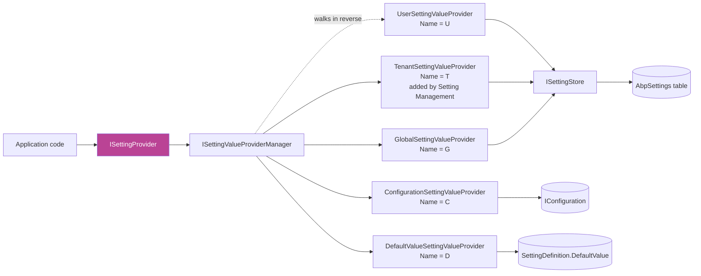
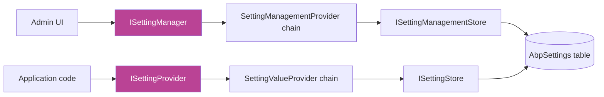
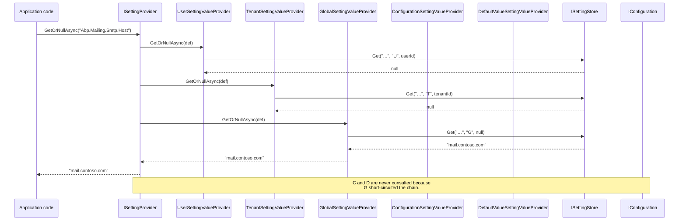

Settings are ABP's answer to *layered configuration values*. They look a lot like [Features](/security/features) — definition providers, a `*Definition` shape, a chain of value providers, an `I*Store` for backing storage — but they answer a more general question: *what is the value of this setting for the current user, in the current tenant, on this host, given the configuration file?* The provider chain is wider (five default layers) and the values are arbitrary strings (with built-in encryption for secrets).

The framework code lives in `framework/src/Volo.Abp.Settings/Volo/Abp/Settings/`. The administration UI, the SQL/Mongo-backed `ISettingStore`, and the `SettingManagementProvider` chain live in the [Setting Management module](/modules/setting-management).

## Source layout

```
framework/src/Volo.Abp.Settings/Volo/Abp/Settings/
├── AbpSettingOptions.cs
├── AbpSettingsModule.cs
├── ConfigurationSettingValueProvider.cs
├── DefaultValueSettingValueProvider.cs
├── GlobalSettingValueProvider.cs
├── IDynamicSettingDefinitionStore.cs
├── ISettingDefinitionContext.cs
├── ISettingDefinitionManager.cs
├── ISettingDefinitionProvider.cs
├── ISettingEncryptionService.cs
├── ISettingProvider.cs
├── ISettingStore.cs
├── ISettingValueProvider.cs
├── ISettingValueProviderManager.cs
├── IStaticSettingDefinitionStore.cs
├── NullDynamicSettingDefinitionStore.cs
├── NullSettingStore.cs
├── SettingDefinition.cs
├── SettingDefinitionContext.cs
├── SettingDefinitionManager.cs
├── SettingDefinitionProvider.cs
├── SettingEncryptionService.cs
├── SettingProvider.cs
├── SettingProviderExtensions.cs
├── SettingValue.cs
├── SettingValueProvider.cs
├── SettingValueProviderManager.cs
├── StaticSettingDefinitionStore.cs
└── UserSettingValueProvider.cs
```

## `AbpSettingsModule`

`framework/src/Volo.Abp.Settings/Volo/Abp/Settings/AbpSettingsModule.cs`:

```csharp
[DependsOn(
    typeof(AbpLocalizationAbstractionsModule),
    typeof(AbpSecurityModule),
    typeof(AbpDataModule)
)]
public class AbpSettingsModule : AbpModule
{
    public override void PreConfigureServices(ServiceConfigurationContext context)
    {
        AutoAddDefinitionProviders(context.Services);
    }

    public override void ConfigureServices(ServiceConfigurationContext context)
    {
        Configure<AbpSettingOptions>(options =>
        {
            options.ValueProviders.Add<DefaultValueSettingValueProvider>();
            options.ValueProviders.Add<ConfigurationSettingValueProvider>();
            options.ValueProviders.Add<GlobalSettingValueProvider>();
            options.ValueProviders.Add<UserSettingValueProvider>();
        });
    }
}
```

The four providers shown plus a fifth one — `TenantSettingValueProvider` — that is added by the [Setting Management module](/modules/setting-management) when present. Just like with features, the registration order matters: the chain is **walked in reverse**, so the *last* provider added wins.

`AbpSettingOptions`:

```csharp
public class AbpSettingOptions
{
    public ITypeList<ISettingDefinitionProvider> DefinitionProviders { get; }
    public ITypeList<ISettingValueProvider>      ValueProviders      { get; }
    public HashSet<string>                       DeletedSettings     { get; }
    public bool ReturnOriginalValueIfDecryptFailed { get; set; }   // default true
}
```

`DeletedSettings` lets a downstream module *remove* an upstream module's setting from the resolved definition list; `ReturnOriginalValueIfDecryptFailed` is the safety valve for hosts that flip `IsEncrypted` on existing rows.

## Defining settings

### `SettingDefinition`

`framework/src/Volo.Abp.Settings/Volo/Abp/Settings/SettingDefinition.cs`:

```csharp
public class SettingDefinition
{
    public string Name { get; }
    public ILocalizableString DisplayName { get; set; }
    public ILocalizableString? Description { get; set; }
    public string? DefaultValue { get; set; }
    public bool IsVisibleToClients { get; set; }   // default false
    public List<string> Providers { get; }
    public bool IsInherited { get; set; }          // default true
    public Dictionary<string, object> Properties { get; }
    public bool IsEncrypted { get; set; }          // default false
}
```

Notable knobs:

- **`IsVisibleToClients`** — opt-in client visibility (Razor pages / Blazor / Angular can read it). Defaults to `false` because settings often hold secrets.
- **`IsInherited`** — when `false`, a tenant's lookup will **not** fall back to global / configuration / default; it will simply return `null` if nothing is set on the tenant scope. Useful for per-tenant-mandatory values like brand colours.
- **`IsEncrypted`** — when `true`, the value is encrypted on `SettingProvider` set and decrypted on read via `ISettingEncryptionService` (which itself wraps [`IStringEncryptionService`](/security/string-encryption)).
- **`Providers`** — restricts the value-provider chain by name; an empty list (the default) allows all providers.

### `ISettingDefinitionProvider` / `SettingDefinitionProvider`

```csharp
public interface ISettingDefinitionProvider
{
    void Define(ISettingDefinitionContext context);
}

public abstract class SettingDefinitionProvider : ISettingDefinitionProvider, ITransientDependency
{
    public abstract void Define(ISettingDefinitionContext context);
}
```

A representative implementation:

```csharp
public class MailingSettingDefinitionProvider : SettingDefinitionProvider
{
    public override void Define(ISettingDefinitionContext context)
    {
        context.Add(
            new SettingDefinition(MailingSettings.Smtp.Host,
                defaultValue: "127.0.0.1"),
            new SettingDefinition(MailingSettings.Smtp.Port,
                defaultValue: "25"),
            new SettingDefinition(MailingSettings.Smtp.UserName,
                defaultValue: ""),
            new SettingDefinition(MailingSettings.Smtp.Password,
                defaultValue: "", isEncrypted: true),
            new SettingDefinition(MailingSettings.DefaultFromAddress,
                defaultValue: "noreply@mydomain.com",
                isVisibleToClients: true));
    }
}
```

`AutoAddDefinitionProviders` in `AbpSettingsModule.PreConfigureServices` discovers this type and stuffs it into `AbpSettingOptions.DefinitionProviders` so no manual registration is needed.

## `ISettingProvider` — the read path

`framework/src/Volo.Abp.Settings/Volo/Abp/Settings/ISettingProvider.cs`:

```csharp
public interface ISettingProvider
{
    Task<string?> GetOrNullAsync(string name);
    Task<List<SettingValue>> GetAllAsync(string[] names);
    Task<List<SettingValue>> GetAllAsync();
}
```

Typed accessors live in `SettingProviderExtensions`:

```csharp
await settingProvider.GetAsync<int>("Identity.Password.RequiredLength");
await settingProvider.IsTrueAsync("Abp.Mailing.Smtp.EnableSsl");
```

These wrap `GetOrNullAsync` and parse via `Volo.Abp.TypeConverters`.

## `SettingProvider` — the canonical impl

`framework/src/Volo.Abp.Settings/Volo/Abp/Settings/SettingProvider.cs`:

```csharp
public class SettingProvider : ISettingProvider, ITransientDependency
{
    protected ISettingDefinitionManager SettingDefinitionManager { get; }
    protected ISettingEncryptionService SettingEncryptionService { get; }
    protected ISettingValueProviderManager SettingValueProviderManager { get; }

    public virtual async Task<string?> GetOrNullAsync(string name)
    {
        var setting   = await SettingDefinitionManager.GetAsync(name);
        var providers = Enumerable.Reverse(SettingValueProviderManager.Providers);

        if (setting.Providers.Any())
        {
            providers = providers.Where(p => setting.Providers.Contains(p.Name));
        }

        //TODO: How to implement setting.IsInherited?

        var value = await GetOrNullValueFromProvidersAsync(providers, setting);
        if (value != null && setting.IsEncrypted)
        {
            value = SettingEncryptionService.Decrypt(setting, value);
        }

        return value;
    }

    protected virtual async Task<string?> GetOrNullValueFromProvidersAsync(
        IEnumerable<ISettingValueProvider> providers, SettingDefinition setting)
    {
        foreach (var provider in providers)
        {
            var value = await provider.GetOrNullAsync(setting);
            if (value != null) return value;
        }
        return null;
    }
}
```

The pattern is identical to `FeatureChecker.GetOrNullAsync`:

1. Walk providers **in reverse** of registration so the most specific one wins.
2. Apply `setting.Providers` filter if set.
3. The first non-null value wins — short-circuiting.
4. Decrypt on the way out when `IsEncrypted` is set.

The `GetAllAsync` overloads do the same thing, batched into a per-provider `GetAllAsync(SettingDefinition[])` call so a SQL store can answer "every setting for this user" in a single round-trip.

## The provider chain



### `DefaultValueSettingValueProvider`

```csharp
public class DefaultValueSettingValueProvider : SettingValueProvider
{
    public const string ProviderName = "D";
    public override string Name => ProviderName;

    public override Task<string?> GetOrNullAsync(SettingDefinition setting)
        => Task.FromResult(setting.DefaultValue);

    public override Task<List<SettingValue>> GetAllAsync(SettingDefinition[] settings)
        => Task.FromResult(settings.Select(x => new SettingValue(x.Name, x.DefaultValue)).ToList());
}
```

The terminal fallback. Returns `SettingDefinition.DefaultValue` literally.

### `ConfigurationSettingValueProvider`

`framework/src/Volo.Abp.Settings/Volo/Abp/Settings/ConfigurationSettingValueProvider.cs`:

```csharp
public class ConfigurationSettingValueProvider : ISettingValueProvider, ITransientDependency
{
    public const string ConfigurationNamePrefix = "Settings:";
    public const string ProviderName = "C";
    public string Name => ProviderName;

    public virtual Task<string?> GetOrNullAsync(SettingDefinition setting)
        => Task.FromResult(Configuration[ConfigurationNamePrefix + setting.Name]);

    public Task<List<SettingValue>> GetAllAsync(SettingDefinition[] settings)
        => Task.FromResult(settings
            .Select(x => new SettingValue(x.Name,
                Configuration[ConfigurationNamePrefix + x.Name]))
            .ToList());
}
```

Reads from the standard `IConfiguration` under a `Settings:` prefix. So in `appsettings.json`:

```json
{
  "Settings": {
    "Abp.Mailing.Smtp.Host": "mail.contoso.com",
    "Abp.Mailing.Smtp.Port": "587"
  }
}
```

This is the canonical way to override defaults at deployment time without touching the database.

### `GlobalSettingValueProvider`

```csharp
public class GlobalSettingValueProvider : SettingValueProvider
{
    public const string ProviderName = "G";
    public override string Name => ProviderName;

    public override Task<string?> GetOrNullAsync(SettingDefinition setting)
        => SettingStore.GetOrNullAsync(setting.Name, Name, null);

    public override Task<List<SettingValue>> GetAllAsync(SettingDefinition[] settings)
        => SettingStore.GetAllAsync(settings.Select(x => x.Name).ToArray(), Name, null);
}
```

Hits the store with `providerKey = null` — i.e. the *host-level / global* row. The Setting Management module's UI's "Global" tab edits these.

### `UserSettingValueProvider`

`framework/src/Volo.Abp.Settings/Volo/Abp/Settings/UserSettingValueProvider.cs`:

```csharp
public class UserSettingValueProvider : SettingValueProvider
{
    public const string ProviderName = "U";
    public override string Name => ProviderName;
    protected ICurrentUser CurrentUser { get; }

    public override async Task<string?> GetOrNullAsync(SettingDefinition setting)
    {
        if (CurrentUser.Id == null) return null;
        return await SettingStore.GetOrNullAsync(
            setting.Name, Name, CurrentUser.Id.ToString());
    }
}
```

Reads `ICurrentUser.Id` (`null` for anonymous calls) and keys the lookup with it.

### `TenantSettingValueProvider`

Lives in the [Setting Management](/modules/setting-management) module (not the framework package):

```csharp
public class TenantSettingValueProvider : SettingValueProvider
{
    public const string ProviderName = "T";
    public override string Name => ProviderName;
    protected ICurrentTenant CurrentTenant { get; }

    public override async Task<string?> GetOrNullAsync(SettingDefinition setting)
        => await SettingStore.GetOrNullAsync(
            setting.Name, Name, CurrentTenant.Id?.ToString());
}
```

The Setting Management module also inserts it into `AbpSettingOptions.ValueProviders` between `Global` and `User` so the final read order — outermost-first — becomes:

```
User → Tenant → Global → Configuration → Default
```

## `ISettingStore`

`framework/src/Volo.Abp.Settings/Volo/Abp/Settings/ISettingStore.cs`:

```csharp
public interface ISettingStore
{
    Task<string?> GetOrNullAsync(string name, string? providerName, string? providerKey);

    Task<List<SettingValue>> GetAllAsync(
        string[] names, string? providerName, string? providerKey);
}
```

Same shape as `IPermissionStore` / `IFeatureStore` — `providerName` is the value-provider name (`U`/`T`/`G`/`C`/`D`/custom), `providerKey` is whatever that provider keyed on (user id, tenant id, `null` for global).

`NullSettingStore` returns `null` for everything; the [Setting Management module](/modules/setting-management) replaces it with a `SettingManagementStore` that reads from the `AbpSettings` table.

## `SettingManagementProvider` (admin write path)

When you build administration UIs you do **not** go through `SettingValueProvider` — those are read-only. The Setting Management module ships a parallel chain rooted at `SettingManagementProvider`:

`modules/setting-management/src/Volo.Abp.SettingManagement.Domain/Volo/Abp/SettingManagement/SettingManagementProvider.cs`:

```csharp
public abstract class SettingManagementProvider : ISettingManagementProvider
{
    public abstract string Name { get; }
    protected ISettingManagementStore SettingManagementStore { get; }

    public virtual async Task<string> GetOrNullAsync(SettingDefinition setting, string providerKey)
        => await SettingManagementStore.GetOrNullAsync(
            setting.Name, Name, NormalizeProviderKey(providerKey));

    public virtual async Task SetAsync(SettingDefinition setting, string value, string providerKey)
        => await SettingManagementStore.SetAsync(
            setting.Name, value, Name, NormalizeProviderKey(providerKey));

    public virtual async Task ClearAsync(SettingDefinition setting, string providerKey)
        => await SettingManagementStore.DeleteAsync(
            setting.Name, Name, NormalizeProviderKey(providerKey));

    protected virtual string NormalizeProviderKey(string providerKey) => providerKey;
}
```

Concrete implementations — `DefaultSettingManagementProvider`, `GlobalSettingManagementProvider`, `TenantSettingManagementProvider`, `UserSettingManagementProvider` — plug into `ISettingManager`, the API the admin UI calls (`SetGlobalAsync`, `SetForTenantAsync`, etc.). Read access still goes through the framework's `ISettingProvider`.



Both chains end at the same SQL table, but the *read* chain layers default + configuration in front while the *write* chain stays narrowly scoped to the row being edited.

## Encryption

`ISettingEncryptionService` is the per-setting wrapper:

```csharp
public class SettingEncryptionService : ISettingEncryptionService, ITransientDependency
{
    private readonly IStringEncryptionService _stringEncryptionService;
    public string? Encrypt(SettingDefinition definition, string? plainValue)
        => _stringEncryptionService.Encrypt(plainValue);
    public string? Decrypt(SettingDefinition definition, string? encryptedValue)
        => _stringEncryptionService.Decrypt(encryptedValue);
}
```

For an `IsEncrypted = true` setting, `SettingProvider.GetOrNullAsync` decrypts on read; `SettingManagementProvider.SetAsync` encrypts on write. The AES key material comes from [`AbpStringEncryptionOptions`](/security/string-encryption) — configure it in production!

## Static and dynamic definition stores

`SettingDefinitionManager` consults `StaticSettingDefinitionStore` (built from `ISettingDefinitionProvider` invocations) and an `IDynamicSettingDefinitionStore` (defaults to `NullDynamicSettingDefinitionStore`). The [Setting Management module](/modules/setting-management) replaces the dynamic store with a database-backed one so SaaS hosts can introduce new settings at runtime.

## End-to-end resolution



## Cross-references

<CardGroup cols={2}>
  <Card title="Setting Management module" icon="boxes-stacked" href="/modules/setting-management">
    The database-backed `ISettingStore`, `ISettingManager` admin API, the management UI, and the `SettingManagementProvider` write chain.
  </Card>
  <Card title="String encryption" icon="key" href="/security/string-encryption">
    The `IStringEncryptionService` and `AbpStringEncryptionOptions` that back `IsEncrypted` settings.
  </Card>
  <Card title="Features" icon="toggle-on" href="/security/features">
    The companion stack for *boolean / capability* gating per tenant rather than free-form values.
  </Card>
  <Card title="Identity module" icon="user-shield" href="/modules/identity">
    Owns settings like `Abp.Identity.Password.RequiredLength`, `Abp.Identity.Lockout.MaxFailedAccessAttempts` — defined as `SettingDefinition`s and consumed via `ISettingProvider`.
  </Card>
</CardGroup>
