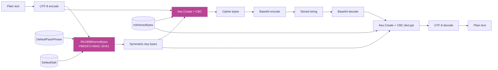

`Volo.Abp.Security` ships one symmetric-encryption primitive: `IStringEncryptionService`. It is what every `IsEncrypted = true` [setting](/security/settings) decrypts through, what the `IConnectionStringResolver` defaults to when stored credentials need to round-trip through the database, and what any module reaches for when it wants a *non-hashing* string-in / string-out cipher.

It is **not** a password hasher. Passwords are one-way; this is two-way. For password hashing you want `IPasswordHasher<TUser>` from ASP.NET Core Identity — see [Security helpers](/security/security-helpers).

Source: `framework/src/Volo.Abp.Security/Volo/Abp/Security/Encryption/`.

## Source layout

```
framework/src/Volo.Abp.Security/Volo/Abp/Security/Encryption/
├── AbpStringEncryptionOptions.cs
├── IStringEncryptionService.cs
└── StringEncryptionService.cs
```

Three files. The contract, the AES-CBC implementation, and the options. No more, no less.

## `IStringEncryptionService`

`framework/src/Volo.Abp.Security/Volo/Abp/Security/Encryption/IStringEncryptionService.cs`:

```csharp
/// <summary>
/// Can be used to simply encrypt/decrypt texts.
/// Use <see cref="AbpStringEncryptionOptions"/> to configure default values.
/// </summary>
public interface IStringEncryptionService
{
    /// <param name="plainText">The text in plain format</param>
    /// <param name="passPhrase">A phrase to use as the encryption key (optional, uses default if not provided)</param>
    /// <param name="salt">Salt value (optional, uses default if not provided)</param>
    string? Encrypt(string? plainText, string? passPhrase = null, byte[]? salt = null);

    string? Decrypt(string? cipherText, string? passPhrase = null, byte[]? salt = null);
}
```

Two methods, both symmetric, both nullable-in / nullable-out so you can pipe values straight through `setting.IsEncrypted ? service.Encrypt(v) : v` without conditional gymnastics. The optional `passPhrase` / `salt` per-call overrides exist for the rare case where you want a single host to manage multiple key sets (e.g. one per tenant).

### The fast path

```csharp
// Encrypt for storage
var stored = _enc.Encrypt(secret);

// Decrypt on read
var plain = _enc.Decrypt(stored);
```

`null`/empty inputs round-trip as `null`. `Decrypt` returns `null` for `null` *or* `""` so callers do not have to special-case empties.

## `StringEncryptionService` — the implementation

`framework/src/Volo.Abp.Security/Volo/Abp/Security/Encryption/StringEncryptionService.cs`:

```csharp
public class StringEncryptionService : IStringEncryptionService, ITransientDependency
{
    protected AbpStringEncryptionOptions Options { get; }

    public StringEncryptionService(IOptions<AbpStringEncryptionOptions> options)
    {
        Options = options.Value;
    }

    public virtual string? Encrypt(string? plainText, string? passPhrase = null, byte[]? salt = null)
    {
        if (plainText == null) return null;

        passPhrase ??= Options.DefaultPassPhrase;
        salt       ??= Options.DefaultSalt;

        var plainTextBytes = Encoding.UTF8.GetBytes(plainText);
        using var password   = new Rfc2898DeriveBytes(passPhrase, salt);
        var keyBytes         = password.GetBytes(Options.Keysize / 8);
        using var symmetric  = Aes.Create();
        symmetric.Mode       = CipherMode.CBC;
        using var encryptor  = symmetric.CreateEncryptor(keyBytes, Options.InitVectorBytes);
        using var memory     = new MemoryStream();
        using var crypto     = new CryptoStream(memory, encryptor, CryptoStreamMode.Write);
        crypto.Write(plainTextBytes, 0, plainTextBytes.Length);
        crypto.FlushFinalBlock();
        return Convert.ToBase64String(memory.ToArray());
    }

    public virtual string? Decrypt(string? cipherText, string? passPhrase = null, byte[]? salt = null)
    {
        if (string.IsNullOrEmpty(cipherText)) return null;

        passPhrase ??= Options.DefaultPassPhrase;
        salt       ??= Options.DefaultSalt;

        var cipherTextBytes = Convert.FromBase64String(cipherText);
        using var password   = new Rfc2898DeriveBytes(passPhrase, salt);
        var keyBytes         = password.GetBytes(Options.Keysize / 8);
        using var symmetric  = Aes.Create();
        symmetric.Mode       = CipherMode.CBC;
        using var decryptor  = symmetric.CreateDecryptor(keyBytes, Options.InitVectorBytes);
        using var memory     = new MemoryStream(cipherTextBytes);
        using var crypto     = new CryptoStream(memory, decryptor, CryptoStreamMode.Read);

        var plainTextBytes = new byte[cipherTextBytes.Length];
        var totalReadCount = 0;
        while (totalReadCount < cipherTextBytes.Length)
        {
            var buffer = new byte[cipherTextBytes.Length];
            var readCount = crypto.Read(buffer, 0, buffer.Length);
            if (readCount == 0) break;
            for (var i = 0; i < readCount; i++)
                plainTextBytes[i + totalReadCount] = buffer[i];
            totalReadCount += readCount;
        }
        return Encoding.UTF8.GetString(plainTextBytes, 0, totalReadCount);
    }
}
```

What is happening at each step:

1. **Key derivation** — `Rfc2898DeriveBytes(passPhrase, salt)` runs PBKDF2-HMAC-SHA1 over the pass-phrase to expand it into a `Keysize / 8`-byte symmetric key. SHA1 is what the framework's `Rfc2898DeriveBytes(string, byte[])` constructor uses; this is *not* a password-hashing function, it is key-stretching for a derived AES key.
2. **AES-CBC** — `Aes.Create()` returns the platform's best AES implementation (AES-NI on x86). `CipherMode.CBC` means a fixed `InitVectorBytes` IV is used; *the same plaintext encrypts to the same ciphertext* under the default options. This is fine for storage equality lookups (encrypted settings can still be queried for non-null) but it means the cipher does not provide message-secrecy in the IND-CPA sense unless you vary the IV.
3. **Base64 output** — the ciphertext is base64-encoded so it round-trips through `nvarchar` columns and JSON without further escaping.

### Properties of the default implementation

<CardGroup cols={2}>
  <Card title="Symmetric, single key" icon="key">
    One key derived from `DefaultPassPhrase + DefaultSalt`. Useful for "obscure values at rest within a host"; not useful for inter-host secrecy.
  </Card>
  <Card title="Deterministic ciphertext" icon="repeat">
    Fixed IV ⇒ same plaintext encrypts to same ciphertext. Lets you compare encrypted values for equality but breaks IND-CPA.
  </Card>
  <Card title="No authentication tag" icon="triangle-exclamation">
    CBC without HMAC. Modified ciphertext will either decrypt to garbage or throw; corruption is detected by *consumers* (parsing), not by the cipher itself.
  </Card>
  <Card title="Not for high-value secrets" icon="shield-halved">
    Use Azure Key Vault, AWS KMS, or `Microsoft.AspNetCore.DataProtection` for anything outside the storage-obfuscation use case.
  </Card>
</CardGroup>

## `AbpStringEncryptionOptions`

`framework/src/Volo.Abp.Security/Volo/Abp/Security/Encryption/AbpStringEncryptionOptions.cs`:

```csharp
public class AbpStringEncryptionOptions
{
    /// <summary>Default: 256.</summary>
    public int Keysize { get; set; }

    /// <summary>Default value: "gsKnGZ041HLL4IM8"</summary>
    public string DefaultPassPhrase { get; set; }

    /// <summary>Default: Encoding.ASCII.GetBytes("jkE49230Tf093b42")</summary>
    public byte[] InitVectorBytes { get; set; }

    /// <summary>Default: Encoding.ASCII.GetBytes("hgt!16kl")</summary>
    public byte[] DefaultSalt { get; set; }

    public AbpStringEncryptionOptions()
    {
        Keysize            = 256;
        DefaultPassPhrase  = "gsKnGZ041HLL4IM8";
        InitVectorBytes    = Encoding.ASCII.GetBytes("jkE49230Tf093b42");
        DefaultSalt        = Encoding.ASCII.GetBytes("hgt!16kl");
    }
}
```

<Warning>
  The default `DefaultPassPhrase`, `InitVectorBytes`, and `DefaultSalt` are **public knowledge** — they are in the open-source framework. Anything you encrypted under the defaults can be decrypted by anyone who reads this file. Always set host-specific values before storing real secrets.
</Warning>

## Bound to configuration in `AbpSecurityModule`

`framework/src/Volo.Abp.Security/Volo/Abp/Security/AbpSecurityModule.cs` reads `IConfiguration` and binds whichever sub-keys the host has set:

```csharp
var configuration = context.Services.GetConfiguration();
context.Services.Configure<AbpStringEncryptionOptions>(options =>
{
    var keySize = configuration["StringEncryption:KeySize"];
    if (!keySize.IsNullOrWhiteSpace() && int.TryParse(keySize, out var intValue))
        options.Keysize = intValue;

    var defaultPassPhrase = configuration["StringEncryption:DefaultPassPhrase"];
    if (!defaultPassPhrase.IsNullOrWhiteSpace())
        options.DefaultPassPhrase = defaultPassPhrase!;

    var initVectorBytes = configuration["StringEncryption:InitVectorBytes"];
    if (!initVectorBytes.IsNullOrWhiteSpace())
        options.InitVectorBytes = Encoding.ASCII.GetBytes(initVectorBytes!);

    var defaultSalt = configuration["StringEncryption:DefaultSalt"];
    if (!defaultSalt.IsNullOrWhiteSpace())
        options.DefaultSalt = Encoding.ASCII.GetBytes(defaultSalt!);
});
```

So in `appsettings.json`:

```json
{
  "StringEncryption": {
    "KeySize": 256,
    "DefaultPassPhrase": "${ABP_STRING_ENCRYPTION_PASSPHRASE}",
    "InitVectorBytes":   "${ABP_STRING_ENCRYPTION_IV}",
    "DefaultSalt":       "${ABP_STRING_ENCRYPTION_SALT}"
  }
}
```

with the actual values fed from environment variables or a secret store. The IV and salt are read as raw ASCII bytes — the IV must be `Keysize / 8` bytes long (32 for the default 256-bit key) and the salt should be 8 or more bytes for PBKDF2 to behave correctly.

### Generating host-specific material

A throw-away console snippet:

```csharp
using System.Security.Cryptography;
using System.Text;

// 32 chars ≈ 32 bytes — long enough for AES-256 IV
Console.WriteLine("PassPhrase: " + Convert.ToBase64String(RandomNumberGenerator.GetBytes(24)));
Console.WriteLine("IV (32 ASCII bytes): " + RandomString(32));
Console.WriteLine("Salt (16 ASCII bytes): " + RandomString(16));

static string RandomString(int length)
{
    const string chars = "ABCDEFGHIJKLMNOPQRSTUVWXYZabcdefghijklmnopqrstuvwxyz0123456789";
    Span<byte> buf = stackalloc byte[length];
    RandomNumberGenerator.Fill(buf);
    var sb = new StringBuilder(length);
    foreach (var b in buf) sb.Append(chars[b % chars.Length]);
    return sb.ToString();
}
```

Persist the output once per host and rotate when you would rotate any other deployment secret.

## How callers use it

The most common consumer is the [Settings](/security/settings) layer via `ISettingEncryptionService`, which is just a wrapper that scopes encryption to a `SettingDefinition`:

```csharp
public class SettingEncryptionService : ISettingEncryptionService, ITransientDependency
{
    private readonly IStringEncryptionService _stringEncryptionService;
    public SettingEncryptionService(IStringEncryptionService s) => _stringEncryptionService = s;

    public string? Encrypt(SettingDefinition definition, string? plainValue)
        => _stringEncryptionService.Encrypt(plainValue);

    public string? Decrypt(SettingDefinition definition, string? encryptedValue)
        => _stringEncryptionService.Decrypt(encryptedValue);
}
```

You can layer per-definition policies (e.g. *use a different pass-phrase for definitions whose name starts with `Tenant:`*) by overriding this service and forwarding to `_stringEncryptionService.Encrypt(plainValue, perDefinitionPassphrase)`.

Other in-tree consumers:

- `Volo.Abp.AspNetCore.Authentication.OAuth` — encrypts the client secret stored in `AbpRemoteServiceOptions`.
- `Volo.Abp.IdentityServer` / `Volo.Abp.OpenIddict` — encrypt some token-lifecycle metadata.
- Any application that wants a quick `protected SecretValue { get; set; }` on an entity, paired with an EF Core value converter.

## End-to-end pipeline



## Operational guidance

<Note>
  **Treat the pass-phrase like any other production secret.** Store it in an environment variable, a Kubernetes secret, or your cloud provider's secret manager. Never commit it. Rotate alongside your other production secrets — but plan the migration: rotated material cannot decrypt values written under the old pass-phrase. The standard approach is a *re-encrypt batch job* that reads with the old key (held aside for the transition window) and writes with the new key.
</Note>

- For values protected against **only** casual database snooping (e.g. SMTP passwords): the defaults plus a host-specific pass-phrase are fine.
- For values protected against **other tenants on the same host** (e.g. tenant API keys): consider per-tenant `passPhrase` overrides on the `Encrypt` / `Decrypt` calls. Each tenant's secrets are then decryptable only with its own key.
- For values protected against **disclosed-database breaches** (PII, credentials with downstream privilege): step up to `Microsoft.AspNetCore.DataProtection` or a KMS-backed envelope-encryption scheme — `IStringEncryptionService` is not designed for that threat model.

## Cross-references

<CardGroup cols={2}>
  <Card title="Settings" icon="sliders" href="/security/settings">
    `SettingDefinition.IsEncrypted` triggers `ISettingEncryptionService`, which forwards to this service.
  </Card>
  <Card title="Setting Management" icon="boxes-stacked" href="/modules/setting-management">
    The admin write path that encrypts on `SetGlobalAsync` / `SetForTenantAsync` / `SetForCurrentUserAsync`.
  </Card>
  <Card title="Security helpers" icon="user-shield" href="/security/security-helpers">
    The companion pieces of `Volo.Abp.Security` — claims, current user/client/tenant — distinct from this two-way cipher.
  </Card>
  <Card title="Identity module" icon="user" href="/modules/identity">
    For password hashing — `IPasswordHasher<TUser>` is one-way and lives in Identity, not here.
  </Card>
</CardGroup>
