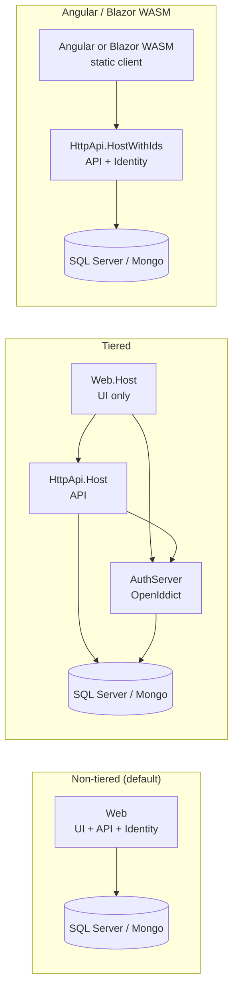

The `app` template under [`templates/app/aspnet-core/`](https://github.com/abpframework/abp/tree/dev/templates/app/aspnet-core) is the **flagship** ABP startup solution. It is multi-project, follows Domain-Driven Design layering, and supports every UI / database / topology combination ABP officially ships. Everything in this page comes straight from the files in that folder.

```text
templates/app/aspnet-core/
├── MyCompanyName.MyProjectName.slnx          # Solution (lightweight XML)
├── MyCompanyName.MyProjectName.sln.DotSettings  # Rider / ReSharper settings
├── NuGet.Config                              # Restore feeds
├── README.md
├── common.props                              # MSBuild base for every src/* project
├── src/                                      # All runtime projects
└── test/                                     # All test projects
```

Run [`abp new`](/cli/new-command) without `-t` (or with `-t app`) to get this layout. The CLI keeps only the `src/` projects that match your `-u`, `-d`, `--tiered`, and `--separate-auth-server` flags.

## Domain layer

<AccordionGroup>
  <Accordion title="MyCompanyName.MyProjectName.Domain.Shared">
    **Role:** constants, enums, localization keys, and DTO-free types **shared by every other project** (including HTTP API clients). No EF Core / no MongoDB references. Always shipped.
  </Accordion>
  <Accordion title="MyCompanyName.MyProjectName.Domain">
    **Role:** entities, aggregate roots, repositories interfaces, domain services, domain events. Depends on `Domain.Shared` plus `Volo.Abp.Ddd.Domain`. This is where your business invariants live.
  </Accordion>
</AccordionGroup>

## Application layer

<AccordionGroup>
  <Accordion title="MyCompanyName.MyProjectName.Application.Contracts">
    **Role:** application service **interfaces** plus their request / response DTOs and permission definitions. Referenced by API clients so callers don't drag in the implementation.
  </Accordion>
  <Accordion title="MyCompanyName.MyProjectName.Application">
    **Role:** implementations of the application service interfaces. Orchestrates the domain, applies authorization, maps DTOs via AutoMapper, raises distributed events.
  </Accordion>
</AccordionGroup>

## Persistence

<AccordionGroup>
  <Accordion title="MyCompanyName.MyProjectName.EntityFrameworkCore">
    **Role:** `DbContext`, entity configurations, repository implementations, and EF Core migrations. Pruned when `--database-provider mongodb`.
  </Accordion>
  <Accordion title="MyCompanyName.MyProjectName.MongoDB">
    **Role:** MongoDB context, collection mappings, and repository implementations. Pruned when `--database-provider ef`.
  </Accordion>
</AccordionGroup>

## HTTP boundary

<AccordionGroup>
  <Accordion title="MyCompanyName.MyProjectName.HttpApi">
    **Role:** the **controllers** (frequently auto-generated from `IApplicationService`s via ABP's dynamic API controllers). Hosts the controller assembly only — no `Program.cs`.
  </Accordion>
  <Accordion title="MyCompanyName.MyProjectName.HttpApi.Client">
    **Role:** typed HTTP client proxies for `Application.Contracts`. Lets other .NET hosts call this app via `IXService` without touching `HttpClient` directly.
  </Accordion>
  <Accordion title="MyCompanyName.MyProjectName.HttpApi.Host">
    **Role:** standalone web host for the API (used in `--tiered`, `--separate-auth-server`, and Angular layouts). Bootstraps Swagger, OpenIddict client, controllers, and CORS.
  </Accordion>
  <Accordion title="MyCompanyName.MyProjectName.HttpApi.HostWithIds">
    **Role:** "API + identity" combined host — same as `HttpApi.Host` but also hosts the OpenIddict authorization server. Used when you pick Angular UI without `--separate-auth-server`.
  </Accordion>
</AccordionGroup>

## Auth server

<AccordionGroup>
  <Accordion title="MyCompanyName.MyProjectName.AuthServer">
    **Role:** dedicated **OpenIddict** authorization server host. Only generated when `--separate-auth-server` is passed (or implied by `--tiered` with certain UI choices). Owns login UI, consent screens, and token issuance.
  </Accordion>
</AccordionGroup>

## MVC / Razor Pages UI

<AccordionGroup>
  <Accordion title="MyCompanyName.MyProjectName.Web">
    **Role:** Razor Pages + ABP MVC UI host. Hosts pages, theme assets, menus, and (in non-tiered mode) also the dynamic controllers from `HttpApi`. This is the project for `-u mvc`.
  </Accordion>
  <Accordion title="MyCompanyName.MyProjectName.Web.Host">
    **Role:** Razor Pages host that **delegates the API and auth server** to other hosts. Used in the `-u mvc --tiered` topology where `Web.Host` is only the front-end and talks to `HttpApi.Host` + `AuthServer`.
  </Accordion>
</AccordionGroup>

## Blazor UI

ABP has gone through several Blazor topologies and the template ships them all so the CLI can pick the right one. Conceptually:

- **`Blazor`** — classic Blazor WebAssembly client app.
- **`Blazor.Client`** — Blazor WebAssembly project used as the **client part** of a Blazor United / WebApp setup.
- **`Blazor.Server`** — Blazor Server-side (SignalR circuits) standalone host.
- **`Blazor.Server.Tiered`** — Blazor Server-side host that talks to a remote `HttpApi.Host`.
- **`Blazor.WebApp`** — .NET 8+ Blazor Web App (interactive auto / server) host.
- **`Blazor.WebApp.Client`** — WASM-rendered part of the Blazor Web App.
- **`Blazor.WebApp.Tiered`** — Tiered version of the Blazor Web App host (API on a separate host).
- **`Blazor.WebApp.Tiered.Client`** — Client part for the tiered Blazor Web App.

<AccordionGroup>
  <Accordion title="MyCompanyName.MyProjectName.Blazor">
    **Role:** the classic Blazor WebAssembly client (pre-.NET-8). Self-contained WASM app that talks to `HttpApi.Host`. Bootstrap via `WebAssemblyHostBuilder` (see Program.cs below).
  </Accordion>
  <Accordion title="MyCompanyName.MyProjectName.Blazor.Client">
    **Role:** the **WASM render-mode client** used by `Blazor.WebApp` host. Contains the components that need to run in the browser. Shares modules with the server-side render via `MyProjectNameBlazorClientModule`.
  </Accordion>
  <Accordion title="MyCompanyName.MyProjectName.Blazor.Server">
    **Role:** Blazor Server host (single-tier). All rendering happens on the server over SignalR. Used by `-u blazor-server` without `--tiered`.
  </Accordion>
  <Accordion title="MyCompanyName.MyProjectName.Blazor.Server.Tiered">
    **Role:** Blazor Server host configured to call a **remote** API (`HttpApi.Host`) and auth server. Used by `-u blazor-server --tiered`.
  </Accordion>
  <Accordion title="MyCompanyName.MyProjectName.Blazor.WebApp">
    **Role:** .NET 8 Blazor Web App host. Supports interactive auto / server / WASM render modes from a single project. Selected by `-u blazor-webapp`.
  </Accordion>
  <Accordion title="MyCompanyName.MyProjectName.Blazor.WebApp.Client">
    **Role:** WASM project loaded by `Blazor.WebApp` for components marked `@rendermode InteractiveAuto` / `InteractiveWebAssembly`.
  </Accordion>
  <Accordion title="MyCompanyName.MyProjectName.Blazor.WebApp.Tiered">
    **Role:** Blazor Web App host wired to a remote `HttpApi.Host`. Selected by `-u blazor-webapp --tiered`.
  </Accordion>
  <Accordion title="MyCompanyName.MyProjectName.Blazor.WebApp.Tiered.Client">
    **Role:** WASM project for the tiered Blazor Web App. Same component code, but knows the API lives on a different origin.
  </Accordion>
</AccordionGroup>

## Database migrator

<AccordionGroup>
  <Accordion title="MyCompanyName.MyProjectName.DbMigrator">
    **Role:** standalone console app you run once after `abp new` (and on every deploy) to apply EF Core migrations and seed initial data — tenants, the admin user, default roles, demo content. See its `Program.cs` excerpt below.
  </Accordion>
</AccordionGroup>

## Test layer

```text
test/
├── MyCompanyName.MyProjectName.Application.Tests/         # xUnit tests for app services
├── MyCompanyName.MyProjectName.Domain.Tests/              # xUnit tests for domain logic
├── MyCompanyName.MyProjectName.EntityFrameworkCore.Tests/ # EF-specific tests (SQLite in-memory)
├── MyCompanyName.MyProjectName.HttpApi.Client.ConsoleTestApp/  # Manual smoke-test console for HTTP client
├── MyCompanyName.MyProjectName.MongoDB.Tests/             # MongoDB-specific tests (Mongo2Go)
├── MyCompanyName.MyProjectName.TestBase/                  # Shared test fixtures, data seed
└── MyCompanyName.MyProjectName.Web.Tests/                 # MVC integration tests
```

`TestBase` is what every other test project depends on — it registers a fresh DI container per test, seeds a deterministic dataset, and provides an `IIdentitySession` impersonating an admin user.

## The Program.cs shape that repeats across every host

All web hosts in this template share the same five-step bootstrap. Here is the `Web` project verbatim:

```csharp templates/app/aspnet-core/src/MyCompanyName.MyProjectName.Web/Program.cs
public async static Task<int> Main(string[] args)
{
    Log.Logger = new LoggerConfiguration()
#if DEBUG
        .MinimumLevel.Debug()
#else
        .MinimumLevel.Information()
#endif
        .MinimumLevel.Override("Microsoft", LogEventLevel.Information)
        .MinimumLevel.Override("Microsoft.EntityFrameworkCore", LogEventLevel.Warning)
        .Enrich.FromLogContext()
        .WriteTo.Async(c => c.File("Logs/logs.txt"))
        .WriteTo.Async(c => c.Console())
        .CreateLogger();

    try
    {
        Log.Information("Starting web host.");
        var builder = WebApplication.CreateBuilder(args);
        builder.Host.AddAppSettingsSecretsJson()
            .UseAutofac()
            .UseSerilog();
        await builder.AddApplicationAsync<MyProjectNameWebModule>();
        var app = builder.Build();
        await app.InitializeApplicationAsync();
        await app.RunAsync();
        return 0;
    }
    catch (Exception ex)
    {
        if (ex is HostAbortedException)
        {
            throw;
        }

        Log.Fatal(ex, "Host terminated unexpectedly!");
        return 1;
    }
    finally
    {
        Log.CloseAndFlush();
    }
}
```

`HttpApi.Host`, `AuthServer`, `Web.Host`, `Blazor.Server`, `Blazor.WebApp`, and their tiered variants all reproduce this exact body — only the log message and the `TModule` change. For example, `AuthServer/Program.cs`:

```csharp templates/app/aspnet-core/src/MyCompanyName.MyProjectName.AuthServer/Program.cs
Log.Information("Starting MyCompanyName.MyProjectName.AuthServer.");
var builder = WebApplication.CreateBuilder(args);
builder.Host.AddAppSettingsSecretsJson()
    .UseAutofac()
    .UseSerilog();
await builder.AddApplicationAsync<MyProjectNameAuthServerModule>();
var app = builder.Build();
await app.InitializeApplicationAsync();
await app.RunAsync();
return 0;
```

And `HttpApi.Host/Program.cs`:

```csharp templates/app/aspnet-core/src/MyCompanyName.MyProjectName.HttpApi.Host/Program.cs
Log.Information("Starting MyCompanyName.MyProjectName.HttpApi.Host.");
var builder = WebApplication.CreateBuilder(args);
builder.Host.AddAppSettingsSecretsJson()
    .UseAutofac()
    .UseSerilog();
await builder.AddApplicationAsync<MyProjectNameHttpApiHostModule>();
var app = builder.Build();
await app.InitializeApplicationAsync();
await app.RunAsync();
return 0;
```

The Blazor WASM client is the **only** host that breaks the pattern. It does not have `Serilog`, does not use Autofac on the WASM side, and uses `WebAssemblyHostBuilder`:

```csharp templates/app/aspnet-core/src/MyCompanyName.MyProjectName.Blazor.Client/Program.cs
public async static Task Main(string[] args)
{
    var builder = WebAssemblyHostBuilder.CreateDefault(args);
    var application = await builder.AddApplicationAsync<MyProjectNameBlazorClientModule>(options =>
    {
        options.UseAutofac();
    });

    var host = builder.Build();

    await application.InitializeApplicationAsync(host.Services);

    await host.RunAsync();
}
```

## DbMigrator

`DbMigrator` is a console app — no `WebApplication`, no Autofac (it uses `IHostBuilder` directly). It registers a single hosted service that runs migrations and exits:

```csharp templates/app/aspnet-core/src/MyCompanyName.MyProjectName.DbMigrator/Program.cs
class Program
{
    static async Task Main(string[] args)
    {
        Log.Logger = new LoggerConfiguration()
            .MinimumLevel.Information()
            .MinimumLevel.Override("Microsoft", LogEventLevel.Warning)
            .MinimumLevel.Override("Volo.Abp", LogEventLevel.Warning)
#if DEBUG
                .MinimumLevel.Override("MyCompanyName.MyProjectName", LogEventLevel.Debug)
#else
                .MinimumLevel.Override("MyCompanyName.MyProjectName", LogEventLevel.Information)
#endif
                .Enrich.FromLogContext()
            .WriteTo.Async(c => c.File("Logs/logs.txt"))
            .WriteTo.Async(c => c.Console())
            .CreateLogger();

        await CreateHostBuilder(args).RunConsoleAsync();
    }

    public static IHostBuilder CreateHostBuilder(string[] args) =>
        Host.CreateDefaultBuilder(args)
            .AddAppSettingsSecretsJson()
            .ConfigureLogging((context, logging) => logging.ClearProviders())
            .ConfigureServices((hostContext, services) =>
            {
                services.AddHostedService<DbMigratorHostedService>();
            });
}
```

Run it once after generation:

```bash
dotnet run --project src/Acme.Bookstore.DbMigrator
```

See [Project building](/cli/project-building) for the rest of the post-`abp new` checklist.

## Topology decisions visualised



Pick the layout, then count the hosts: non-tiered MVC = 1 host (`Web`) + `DbMigrator`. Tiered MVC = 3 hosts (`Web.Host`, `HttpApi.Host`, `AuthServer`) + `DbMigrator`. Angular SPA = 1 host (`HttpApi.HostWithIds`) + the Angular workspace + `DbMigrator`.

## Solution-level files

<AccordionGroup>
  <Accordion title="MyCompanyName.MyProjectName.slnx">
    The `.slnx` lightweight solution format. The CLI rewrites this file after pruning so that only the surviving projects are listed.
  </Accordion>
  <Accordion title="MyCompanyName.MyProjectName.sln.DotSettings">
    Rider / ReSharper team settings. Defines naming rules (ABP uses `_camelCase` for private fields, `PascalCase` for everything else), formatter overrides, and the code cleanup profile. **Check this file in.**
  </Accordion>
  <Accordion title="common.props">
    MSBuild file imported by every `.csproj` under `src/`. Sets `<TargetFramework>`, `<Nullable>enable</Nullable>`, source link, deterministic builds, and the central `Volo.Abp` version property.
  </Accordion>
  <Accordion title="NuGet.Config">
    Restore sources. Open-source generation lists nuget.org only; ABP Commercial generation adds the commercial myget feed.
  </Accordion>
  <Accordion title="README.md">
    Short orientation document that ends up at the repo root of the generated solution.
  </Accordion>
</AccordionGroup>

## Next

<CardGroup cols={2}>
  <Card title="Angular workspace pair" icon="angular" href="/templates/app-template-angular">
    The matching `templates/app/angular/` SPA generated when you pick `-u angular`.
  </Card>
  <Card title="abp new flags" icon="terminal" href="/cli/new-command">
    Every `-u`, `-d`, `--tiered`, `--separate-auth-server` combination and what they prune.
  </Card>
  <Card title="Building the solution" icon="hammer" href="/cli/project-building">
    `abp install-libs`, `dotnet build`, running `DbMigrator`, and starting the hosts in order.
  </Card>
  <Card title="No-layers alternative" icon="cube" href="/templates/app-nolayers-aspnet-core">
    Same DDD building blocks fused into a single project per host.
  </Card>
</CardGroup>
