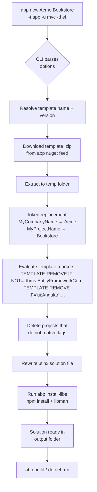

ABP ships a family of **startup templates** that live under [`templates/`](https://github.com/abpframework/abp/tree/dev/templates) in the framework repository. Each template is a real, buildable solution with `MyCompanyName.MyProjectName` placeholders. The [`abp new`](/cli/new-command) command downloads the requested template, replaces placeholders, evaluates conditional blocks (e.g. `<TEMPLATE-REMOVE IF-NOT='dbms:PostgreSQL'>` markers), wires up the chosen DBMS / UI / mobile flags, and writes the result to disk.

This page is the map. Pick the template that matches your target architecture, then jump to its dedicated page for the full project layout, the real `Program.cs` excerpts, and conventions you can rely on.

<Info>
All templates are versioned alongside the framework. When you run `abp new` the CLI fetches the template package for the **same version** as your installed CLI (or the version you pass with `-v`). See [`abp new`](/cli/new-command) for the full command reference.
</Info>

<Info>
**About `app-pro` and `microservice`.** These ship as part of the commercial **ABP Studio / ABP Platform** product, not this open-source repository — there are no `templates/app-pro/` or `templates/microservice/` folders in `abpframework/abp`. The pages below cover only the templates that live in this repo: `app`, `app-nolayers`, `module`, `console`, `maui`, `wpf`. If you need a layered Pro template (LeptonX commercial theme, additional modules, SaaS extras) or a microservice solution, generate it from [abp.io](https://abp.io) instead.
</Info>

## Template families at a glance

<CardGroup cols={2}>
  <Card title="Layered application (DDD)" icon="layer-group" href="/templates/app-template-aspnet-core">
    The canonical multi-project solution: `Domain.Shared`, `Domain`, `Application.Contracts`, `Application`, `EntityFrameworkCore` / `MongoDB`, `HttpApi`, `HttpApi.Host`, `Web`, `DbMigrator`, plus optional `AuthServer` and Blazor hosts. Template id: `app`.
  </Card>
  <Card title="Layered Angular SPA" icon="angular" href="/templates/app-template-angular">
    The Angular workspace that pairs with the layered backend. Lives under `templates/app/angular/`. Generated by `abp new ... -u angular`.
  </Card>
  <Card title="Single-project app (no layers)" icon="cube" href="/templates/app-nolayers-aspnet-core">
    One project per host (MVC, Blazor Server, Blazor WebAssembly), no `Domain`/`Application` split. Template id: `app-nolayers`.
  </Card>
  <Card title="Single-project Angular" icon="square-code" href="/templates/app-nolayers-angular">
    The matching Angular workspace for the no-layers backend. Same Angular skeleton, simpler API surface.
  </Card>
  <Card title="Module" icon="puzzle-piece" href="/templates/module-template">
    Produces a **reusable ABP module** (NuGet + npm) with its own `Domain`, `Application`, `HttpApi`, optional Angular sub-package, and a `host/` folder for local debugging. Template id: `module`.
  </Card>
  <Card title="Console host" icon="terminal" href="/templates/console-template">
    Minimal console application that bootstraps an ABP application (`Host.CreateApplicationBuilder` + `AddApplicationAsync<TModule>()`). Template id: `console`.
  </Card>
  <Card title=".NET MAUI" icon="mobile-screen" href="/templates/maui-template">
    Cross-platform mobile / desktop client. `MauiApp.CreateBuilder().ConfigureContainer(new AbpAutofacServiceProviderFactory(...))`. Template id: `maui`.
  </Card>
  <Card title="WPF" icon="window-restore" href="/templates/wpf-template">
    Windows desktop client. Bootstraps via `AbpApplicationFactory.CreateAsync<TModule>()` in `App.xaml.cs`. Template id: `wpf`.
  </Card>
</CardGroup>

## Repository layout

```text
templates/
├── Directory.Packages.props      # Central package versions for all templates
├── NuGet.Config                  # Restore sources (nuget.org + abp myget)
├── zip-templates.ps1             # Packs each template into a .zip used by abp new
├── app/                          # Layered DDD template
│   ├── aspnet-core/              #   .NET solution
│   └── angular/                  #   Angular workspace
├── app-nolayers/                 # Single-project template
│   ├── aspnet-core/
│   └── angular/
├── console/                      # Console host
├── maui/                         # .NET MAUI client
├── module/                       # Reusable module
│   ├── aspnet-core/
│   └── angular/
└── wpf/                          # WPF desktop client
```

`zip-templates.ps1` is the script the build pipeline runs to package each folder into the `.zip` archives the CLI downloads. If you fork ABP and ship a custom template, this is the entry point.

## Mapping `abp new` flags to templates

| Flag value (`-t` / `--template`) | Folder | Page |
| --- | --- | --- |
| `app` (default) | `templates/app/aspnet-core/` (+ `angular/` when `-u angular`) | [Layered ASP.NET Core](/templates/app-template-aspnet-core), [Layered Angular](/templates/app-template-angular) |
| `app-nolayers` | `templates/app-nolayers/aspnet-core/` (+ `angular/`) | [No-layers ASP.NET Core](/templates/app-nolayers-aspnet-core), [No-layers Angular](/templates/app-nolayers-angular) |
| `module` | `templates/module/aspnet-core/` (+ `angular/`) | [Module template](/templates/module-template) |
| `console` | `templates/console/` | [Console template](/templates/console-template) |
| `maui` | `templates/maui/` | [MAUI template](/templates/maui-template) |
| `wpf` | `templates/wpf/` | [WPF template](/templates/wpf-template) |

The orthogonal flags — `-u` (UI), `-d` (database), `-m` (mobile), `--tiered`, `--separate-auth-server`, `--public-website`, `--no-ui` — toggle which of the projects listed on each template page actually end up in the generated solution. The template files contain `<TEMPLATE-REMOVE>` / `<TEMPLATE-IF>` markers that the CLI evaluates server-side.

## How `abp new` instantiates a template



`<TEMPLATE-REMOVE>` markers are plain comments inside source files. For example, the no-layers `Program.cs` carries:

```csharp templates/app-nolayers/aspnet-core/MyCompanyName.MyProjectName.Host/Program.cs
public async static Task<int> Main(string[] args)
{
//<TEMPLATE-REMOVE IF-NOT='dbms:PostgreSQL'>
    // https://www.npgsql.org/efcore/release-notes/6.0.html#opting-out-of-the-new-timestamp-mapping-logic
    AppContext.SetSwitch("Npgsql.EnableLegacyTimestampBehavior", true);

//</TEMPLATE-REMOVE>
    var loggerConfiguration = new LoggerConfiguration()
```

When `--database-provider` is anything other than `PostgreSQL`, the block between the markers is stripped before the file lands on disk.

## What every layered template guarantees

Every layered host (the `Web`, `HttpApi.Host`, `AuthServer`, and Blazor variants under `templates/app/aspnet-core/src/`) shares the same `Main` shape — Serilog bootstrap, Autofac container, `AddApplicationAsync<TModule>()`, and `InitializeApplicationAsync()`:

```csharp templates/app/aspnet-core/src/MyCompanyName.MyProjectName.Web/Program.cs
Log.Information("Starting web host.");
var builder = WebApplication.CreateBuilder(args);
builder.Host.AddAppSettingsSecretsJson()
    .UseAutofac()
    .UseSerilog();
await builder.AddApplicationAsync<MyProjectNameWebModule>();
var app = builder.Build();
await app.InitializeApplicationAsync();
await app.RunAsync();
return 0;
```

That four-line bootstrap (`AddAppSettingsSecretsJson` → `UseAutofac` → `UseSerilog` → `AddApplicationAsync<T>`) is the **template invariant**. Every other host file you read in these template pages will follow the same shape with a different `TModule` and a different log message. Knowing this lets you skim quickly: the only file that materially differs per host is `MyProjectNameXxxModule.cs`.

<Info>
For the console / MAUI / WPF templates the shape changes because the host is not a `WebApplication`. See each page for the actual `Program.cs` / `MauiProgram.cs` / `App.xaml.cs` excerpt.
</Info>

## Common files you'll see in every template

<AccordionGroup>
  <Accordion title="MyCompanyName.MyProjectName.slnx">
    XML solution file (the new lightweight `.slnx` format) listing every project. The CLI rewrites this after pruning projects that don't match your flags.
  </Accordion>
  <Accordion title="common.props">
    MSBuild `<Project>` file imported by every `.csproj`. Sets `<TargetFramework>`, treats warnings, enables nullable, configures source link, and defines the central ABP version property.
  </Accordion>
  <Accordion title="NuGet.Config">
    Restore sources. Always includes nuget.org and the ABP Commercial myget feed (commented out in the open-source templates; uncommented when you generate from ABP.IO Suite).
  </Accordion>
  <Accordion title="Directory.Packages.props (templates/ root only)">
    Central package management for all templates. Real solutions generated by `abp new` get a copy of the relevant subset.
  </Accordion>
  <Accordion title="MyCompanyName.MyProjectName.sln.DotSettings">
    ReSharper / Rider settings file. Carries naming rules, formatter overrides, and code cleanup profiles tuned for ABP code style.
  </Accordion>
</AccordionGroup>

## Choosing a template

<Steps>
  <Step title="Pick an architecture">
    Multi-team, long-lived product → layered `app`. Internal tool, single-team CRUD → `app-nolayers`. Reusable feature for many products → `module`.
  </Step>
  <Step title="Pick a UI">
    `-u mvc` (Razor Pages + jQuery), `-u blazor` (WASM), `-u blazor-server`, `-u blazor-webapp` (interactive auto), `-u angular`, or `--no-ui` for a headless backend.
  </Step>
  <Step title="Pick a database provider">
    `-d ef` (EF Core, default) or `-d mongodb`. Templates ship both `EntityFrameworkCore` and `MongoDB` projects; the CLI removes the one you didn't pick.
  </Step>
  <Step title="Pick deployment topology">
    Add `--tiered` to split the API host from the web host. Add `--separate-auth-server` to give OpenIddict its own host. Add `--public-website` to scaffold a public-facing marketing site project.
  </Step>
  <Step title="Generate and build">
    `abp new Acme.Bookstore -t app -u mvc -d ef` then `dotnet build` and `dotnet run --project src/Acme.Bookstore.Web`. See [Project building](/cli/project-building) for the full post-generation workflow.
  </Step>
</Steps>

## Bootstrap shape per host type

Every template generates a host whose entry point follows one of three patterns. Knowing which pattern your chosen template uses makes the per-page bootstrap excerpts easier to read.

<AccordionGroup>
  <Accordion title="WebApplication-based hosts (layered + no-layers ASP.NET Core, module hosts)">
    Used by every ASP.NET Core host: `Web`, `HttpApi.Host`, `AuthServer`, `Blazor.Server`, `Blazor.WebApp`, plus all their tiered variants, plus every `host/*` project in the module template.

    ```csharp
    var builder = WebApplication.CreateBuilder(args);
    builder.Host.AddAppSettingsSecretsJson()
        .UseAutofac()
        .UseSerilog();
    await builder.AddApplicationAsync<TModule>();
    var app = builder.Build();
    await app.InitializeApplicationAsync();
    await app.RunAsync();
    ```
  </Accordion>
  <Accordion title="Generic-host hosts (console + DbMigrator)">
    The console template and `DbMigrator` use the generic host builder. Configuration, logging, and Autofac are wired explicitly.

    ```csharp
    var builder = Host.CreateApplicationBuilder(args);
    builder.Configuration.AddAppSettingsSecretsJson();
    builder.Logging.ClearProviders().AddSerilog();
    builder.ConfigureContainer(builder.Services.AddAutofacServiceProviderFactory());
    builder.Services.AddHostedService<MyProjectNameHostedService>();
    await builder.Services.AddApplicationAsync<TModule>();
    var host = builder.Build();
    await host.InitializeAsync();
    await host.RunAsync();
    ```
  </Accordion>
  <Accordion title="Factory-based hosts (WPF, Blazor WASM client, MAUI)">
    UI frameworks that own their own composition root call `AbpApplicationFactory.CreateAsync<TModule>()` (WPF), `WebAssemblyHostBuilder.CreateDefault(...)` + `AddApplicationAsync<TModule>` (Blazor WASM), or `MauiApp.CreateBuilder()` with `AbpAutofacServiceProviderFactory` (MAUI).

    ```csharp
    // WPF
    _abpApplication = await AbpApplicationFactory.CreateAsync<TModule>(options =>
    {
        options.UseAutofac();
    });
    await _abpApplication.InitializeAsync();
    ```
  </Accordion>
</AccordionGroup>

## Where each template ends up after `abp new`

Templates live as **source** in the framework repo and as **packed `.zip` files** on the CLI's download server. `zip-templates.ps1` is the bridge. Mapping:

| Repo folder | Packed name | CLI flag |
| --- | --- | --- |
| `templates/app/aspnet-core/` + `templates/app/angular/` | `app` | `abp new <name>` (default) |
| `templates/app-nolayers/aspnet-core/` + `templates/app-nolayers/angular/` | `app-nolayers` | `abp new <name> -t app-nolayers` |
| `templates/module/aspnet-core/` + `templates/module/angular/` | `module` | `abp new <name> -t module` |
| `templates/console/` | `console` | `abp new <name> -t console` |
| `templates/maui/` | `maui` | `abp new <name> -t maui` |
| `templates/wpf/` | `wpf` | `abp new <name> -t wpf` |

Custom templates work the same way — pack a folder with `zip-templates.ps1`, publish it as a NuGet package with the right id, and point `abp new` at it with `-t <package-id>` and `--template-source <feed>`.

## Template versioning

Templates are released **in lockstep** with the framework. The CLI resolves the template version from:

1. `--version` / `-v` on `abp new`, if you passed it.
2. The version of the installed `Volo.Abp.Cli` (or `abp-cli`) tool.
3. The latest stable version on the configured NuGet feed.

<Info>
If you need to pin a generated solution to a specific framework version — for example, to reproduce a customer's bug on a release branch — pass `-v 9.3.2` (or whatever) to `abp new` and the same version is baked into every `<PackageReference>` in the output.
</Info>

## Picking by use case

<AccordionGroup>
  <Accordion title="Building a SaaS product with web + mobile + reusable features">
    Layered [`app`](/templates/app-template-aspnet-core) for the backend (`-u angular` or `-u blazor-webapp --tiered`). Carve every feature beyond MVP into its own [`module`](/templates/module-template). Add a [`maui`](/templates/maui-template) client that references the layered backend's `HttpApi.Client` packages.
  </Accordion>
  <Accordion title="Building an internal tool fast">
    [`app-nolayers`](/templates/app-nolayers-aspnet-core) with `-u mvc -d ef`. One project, no `DbMigrator` — `Program.cs` handles migrations. Skip the SPA unless you actually need it.
  </Accordion>
  <Accordion title="Shipping a reusable feature for sale">
    [`module`](/templates/module-template) with both `aspnet-core` and `angular`. The `host/` folder lets you demo it; the `src/` packages are what customers consume.
  </Accordion>
  <Accordion title="Worker for distributed events / batch jobs">
    [`console`](/templates/console-template). Add `[DependsOn(typeof(AbpEventBusRabbitMqModule))]` (or your message broker) and `IHostedService`s for the work.
  </Accordion>
  <Accordion title="Windows-only desktop tool">
    [`wpf`](/templates/wpf-template). Bring your favourite MVVM stack on top.
  </Accordion>
  <Accordion title="Cross-platform mobile / desktop">
    [`maui`](/templates/maui-template). Reference the backend's `HttpApi.Client` package to call application services with strong types.
  </Accordion>
</AccordionGroup>

## Common gotchas

<AccordionGroup>
  <Accordion title="Wrong UI flag for the template">
    `-u angular` is valid for `app`, `app-nolayers`, and `module` only. `console`, `maui`, and `wpf` reject UI flags because they bring their own UI shell.
  </Accordion>
  <Accordion title="MongoDB + EF migrations">
    `--database-provider mongodb` deletes the `EntityFrameworkCore` project, but the `DbMigrator` still ships — its hosted service handles Mongo seeding too. No EF migrations are generated.
  </Accordion>
  <Accordion title="Tiered without separate auth server">
    Some UI/topology combinations imply specific hosts. For example `-u angular` without `--separate-auth-server` keeps `HttpApi.HostWithIds` (API+identity combined), not `HttpApi.Host` + `AuthServer`.
  </Accordion>
  <Accordion title="Generated solution doesn't restore">
    Almost always missing the right NuGet sources. Open `NuGet.Config` and check the feeds — open-source generation lists nuget.org; ABP Commercial generation lists the myget feed and requires `dotnet nuget add source` for your token.
  </Accordion>
</AccordionGroup>

## Next steps

<CardGroup cols={2}>
  <Card title="abp new reference" icon="terminal" href="/cli/new-command">
    Every flag, every combination, and the exact strings the CLI accepts.
  </Card>
  <Card title="Building a generated solution" icon="hammer" href="/cli/project-building">
    `abp install-libs`, `abp bundle`, NPM, and the `DbMigrator` boot sequence.
  </Card>
  <Card title="Layered ASP.NET Core template" icon="layer-group" href="/templates/app-template-aspnet-core">
    The flagship template — project-by-project tour.
  </Card>
  <Card title="Module template" icon="puzzle-piece" href="/templates/module-template">
    For building reusable feature packages.
  </Card>
</CardGroup>
