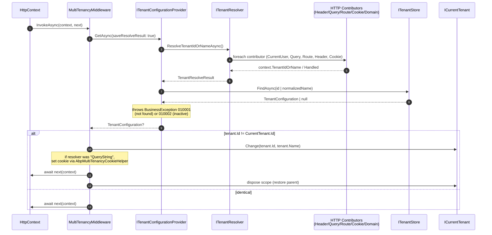

ABP's web integration layer for multi‑tenancy lives in `framework/src/Volo.Abp.AspNetCore.MultiTenancy/Volo/Abp/AspNetCore/MultiTenancy/`, with an MVC/Razor UI overlay in `framework/src/Volo.Abp.AspNetCore.Mvc.UI.MultiTenancy/`. This layer plugs into the framework‑level resolver chain ([`/tenancy/multi-tenancy-core`](/tenancy/multi-tenancy-core)) by registering a handful of `ITenantResolveContributor` implementations that read the tenant id or name from HTTP transport — headers, query string, route values, cookies, form fields or the host name — and by exposing a single middleware (`MultiTenancyMiddleware`) that resolves the tenant once per request and opens an `ICurrentTenant.Change` scope around the rest of the pipeline.

This page covers the middleware, every built‑in HTTP contributor, the options that bind them together, and the Razor pages that implement the user‑facing tenant switch.

## How the middleware fits in the pipeline



## MultiTenancyMiddleware

Source: `Volo.Abp.AspNetCore.MultiTenancy/Volo/Abp/AspNetCore/MultiTenancy/MultiTenancyMiddleware.cs`.

```csharp
public class MultiTenancyMiddleware : AbpMiddlewareBase, ITransientDependency
{
    public ILogger<MultiTenancyMiddleware> Logger { get; set; }

    private readonly ITenantConfigurationProvider _tenantConfigurationProvider;
    private readonly ICurrentTenant _currentTenant;
    private readonly AbpAspNetCoreMultiTenancyOptions _options;
    private readonly ITenantResolveResultAccessor _tenantResolveResultAccessor;

    public MultiTenancyMiddleware(
        ITenantConfigurationProvider tenantConfigurationProvider,
        ICurrentTenant currentTenant,
        IOptions<AbpAspNetCoreMultiTenancyOptions> options,
        ITenantResolveResultAccessor tenantResolveResultAccessor)
    {
        Logger = NullLogger<MultiTenancyMiddleware>.Instance;
        _tenantConfigurationProvider = tenantConfigurationProvider;
        _currentTenant = currentTenant;
        _tenantResolveResultAccessor = tenantResolveResultAccessor;
        _options = options.Value;
    }

    public async override Task InvokeAsync(HttpContext context, RequestDelegate next)
    {
        TenantConfiguration? tenant = null;
        try
        {
            tenant = await _tenantConfigurationProvider.GetAsync(saveResolveResult: true);
        }
        catch (Exception e)
        {
            Logger.LogException(e);

            if (await _options.MultiTenancyMiddlewareErrorPageBuilder(context, e))
            {
                return;
            }
        }

        if (tenant?.Id != _currentTenant.Id)
        {
            using (_currentTenant.Change(tenant?.Id, tenant?.Name))
            {
                if (_tenantResolveResultAccessor.Result != null &&
                    _tenantResolveResultAccessor.Result.AppliedResolvers.Contains(
                        QueryStringTenantResolveContributor.ContributorName))
                {
                    AbpMultiTenancyCookieHelper.SetTenantCookie(
                        context, _currentTenant.Id, _options.TenantKey);
                }

                var requestCulture = await TryGetRequestCultureAsync(context);
                if (requestCulture != null)
                {
                    CultureInfo.CurrentCulture = requestCulture.Culture;
                    CultureInfo.CurrentUICulture = requestCulture.UICulture;
                    AbpRequestCultureCookieHelper.SetCultureCookie(context, requestCulture);
                    context.Items[AbpRequestLocalizationMiddleware.HttpContextItemName] = true;
                }

                await next(context);
            }
        }
        else
        {
            await next(context);
        }
    }
}
```

<Steps>
  <Step title="Resolve the tenant">
    Calls `ITenantConfigurationProvider.GetAsync(saveResolveResult: true)`. The `saveResolveResult` flag tells the provider to write the `TenantResolveResult` into `ITenantResolveResultAccessor` so the middleware (and later code) can inspect which contributor won.
  </Step>
  <Step title="Handle resolution failures">
    A `BusinessException` thrown by the provider (`010001` not found, `010002` inactive) is logged and forwarded to `MultiTenancyMiddlewareErrorPageBuilder`. If that builder returns `true`, the middleware short‑circuits the pipeline without calling `next`.
  </Step>
  <Step title="Open an ICurrentTenant scope only when needed">
    The middleware compares `tenant?.Id` to `_currentTenant.Id`. If they match (typically both null on the host) it skips the `Change` call entirely — preserving any outer scope that some upstream code may already have opened.
  </Step>
  <Step title="Persist the tenant if it came from the query string">
    When `QueryString` is the resolver that won, the middleware writes a `__tenant` cookie so subsequent requests resolve without the explicit query. This is the classic "switch by URL, remember via cookie" UX.
  </Step>
  <Step title="Re-apply request culture">
    Tenant‑scoped default languages can differ from the host's. The middleware re‑reads `LocalizationSettingNames.DefaultLanguage` inside the new tenant scope and overrides `CultureInfo.Current{UI}Culture` if needed.
  </Step>
</Steps>

<Note>
`AbpMiddlewareBase` is ABP's base class for middleware that participates in DI as `ITransientDependency`; the framework attaches it to the pipeline via `app.UseMultiTenancy()` (an extension method that ultimately calls `app.UseMiddleware<MultiTenancyMiddleware>()`).
</Note>

## AbpAspNetCoreMultiTenancyOptions

Source: `AbpAspNetCoreMultiTenancyOptions.cs`.

```csharp
public class AbpAspNetCoreMultiTenancyOptions
{
    /// <summary>Default: <see cref="TenantResolverConsts.DefaultTenantKey"/> ("__tenant").</summary>
    public string TenantKey { get; set; }

    /// <summary>Return true to stop the pipeline, false to continue.</summary>
    public Func<HttpContext, Exception, Task<bool>> MultiTenancyMiddlewareErrorPageBuilder { get; set; }

    public AbpAspNetCoreMultiTenancyOptions()
    {
        TenantKey = TenantResolverConsts.DefaultTenantKey;
        MultiTenancyMiddlewareErrorPageBuilder = async (context, exception) =>
        {
            // ... default error page logic (see below) ...
        };
    }
}
```

`TenantKey` is the single string used by *every* HTTP contributor to look up its value — the header name, query parameter name, route token, cookie name and form field name all default to `__tenant`. Override it once and all contributors stay consistent:

```csharp
Configure<AbpAspNetCoreMultiTenancyOptions>(options =>
{
    options.TenantKey = "X-Tenant-Id";
});
```

### Error handling

The default `MultiTenancyMiddlewareErrorPageBuilder` does three things:

1. Inspects `ITenantResolveResultAccessor.Result`. If the only winning contributor was `CurrentUser` and the user is cookie‑authenticated, it signs them out — the assumption is that a stale auth cookie is pointing at a deleted/inactive tenant.
2. Clears the `__tenant` cookie when the `Cookie` resolver was involved.
3. Writes `Abp-Tenant-Resolve-Error` response header with the exception message; for AJAX requests it serializes a `RemoteServiceErrorResponse` JSON; otherwise it renders `MultiTenancyMiddlewareErrorPage` (a Razor page bundled with the package).

You can replace the whole delegate to integrate with your own error UI:

```csharp
Configure<AbpAspNetCoreMultiTenancyOptions>(options =>
{
    options.MultiTenancyMiddlewareErrorPageBuilder = async (ctx, ex) =>
    {
        ctx.Response.StatusCode = StatusCodes.Status404NotFound;
        await ctx.Response.WriteAsJsonAsync(new { error = "tenant_unavailable" });
        return true; // stop the pipeline
    };
});
```

<Warning>
Always return `true` when you've written a response, otherwise the middleware will continue calling `next(context)` with no tenant scope set — resulting in queries running as host. Returning `false` is appropriate only when you want the downstream pipeline to handle the request anyway (e.g., redirect to a login page that itself doesn't need a tenant).
</Warning>

## Contributor base class — HttpTenantResolveContributorBase

All HTTP contributors derive from a single base. Source: `HttpTenantResolveContributorBase.cs`.

```csharp
public abstract class HttpTenantResolveContributorBase : TenantResolveContributorBase
{
    public override async Task ResolveAsync(ITenantResolveContext context)
    {
        var httpContext = context.GetHttpContext();
        if (httpContext == null) return;

        try
        {
            await ResolveFromHttpContextAsync(context, httpContext);
        }
        catch (Exception e)
        {
            context.ServiceProvider
                .GetRequiredService<ILogger<HttpTenantResolveContributorBase>>()
                .LogWarning(e.ToString());
        }
    }

    protected virtual async Task ResolveFromHttpContextAsync(
        ITenantResolveContext context, HttpContext httpContext)
    {
        var tenantIdOrName = await GetTenantIdOrNameFromHttpContextOrNullAsync(
            context, httpContext);

        if (!tenantIdOrName.IsNullOrEmpty())
        {
            context.TenantIdOrName = tenantIdOrName;
        }
    }

    protected abstract Task<string?> GetTenantIdOrNameFromHttpContextOrNullAsync(
        ITenantResolveContext context, HttpContext httpContext);
}
```

Two important behaviors:

- It silently degrades to a no‑op when there is no `HttpContext` — that's how the same options object works for background jobs and message consumers (the chain just skips HTTP contributors).
- Exceptions in `GetTenantIdOrNameFromHttpContextOrNullAsync` are logged but never propagated, so a malformed cookie or header can't take the whole request down.

`context.GetHttpContext()` is an extension method that pulls `IHttpContextAccessor` from the context's `ServiceProvider`. `context.GetAbpAspNetCoreMultiTenancyOptions()` does the same for the options object.

## Contributor ordering

`AbpAspNetCoreMultiTenancyModule.ConfigureServices` adds the HTTP contributors after the framework module has already inserted `CurrentUserTenantResolveContributor`:

```csharp
[DependsOn(typeof(AbpMultiTenancyModule), typeof(AbpAspNetCoreModule))]
public class AbpAspNetCoreMultiTenancyModule : AbpModule
{
    public override void ConfigureServices(ServiceConfigurationContext context)
    {
        Configure<AbpTenantResolveOptions>(options =>
        {
            options.TenantResolvers.Add(new QueryStringTenantResolveContributor());
            options.TenantResolvers.Add(new RouteTenantResolveContributor());
            options.TenantResolvers.Add(new HeaderTenantResolveContributor());
            options.TenantResolvers.Add(new CookieTenantResolveContributor());
        });
    }
}
```

The resulting effective order is:

<Tabs>
  <Tab title="1. CurrentUser">
    `Handled = true` if the request is authenticated. Wins unconditionally for logged‑in users; ensures tenant‑scoped users cannot escape into another tenant via URL tampering.
  </Tab>
  <Tab title="2. QueryString">
    `?__tenant=Acme`. When this contributor wins, the middleware *also* persists a `__tenant` cookie. Used by the tenant switch UI.
  </Tab>
  <Tab title="3. Route">
    Route value `__tenant` from `{controller}/{__tenant}/...` patterns. Rarely used; helpful for per‑tenant route segments.
  </Tab>
  <Tab title="4. Header">
    HTTP header `__tenant`. The recommended choice for backend‑to‑backend service calls and for SPA clients that store the tenant alongside the access token.
  </Tab>
  <Tab title="5. Cookie">
    Cookie `__tenant`. Used by the browser after a `QueryString` win has persisted the choice.
  </Tab>
  <Tab title="Fallback">
    If still unresolved and `AbpTenantResolveOptions.FallbackTenant` is set, the resolver returns that as a `FallbackTenant` applied‑resolver entry.
  </Tab>
</Tabs>

<Note>
`DomainTenantResolveContributor` and `FormTenantResolveContributor` exist but are **not** added by default. Add them explicitly when you need subdomain‑per‑tenant or form‑post‑based switching.
</Note>

## Built-in HTTP contributors

### HeaderTenantResolveContributor

Source: `HeaderTenantResolveContributor.cs`.

```csharp
public class HeaderTenantResolveContributor : HttpTenantResolveContributorBase
{
    public const string ContributorName = "Header";
    public override string Name => ContributorName;

    protected override Task<string?> GetTenantIdOrNameFromHttpContextOrNullAsync(
        ITenantResolveContext context, HttpContext httpContext)
    {
        if (httpContext.Request.Headers.IsNullOrEmpty())
            return Task.FromResult((string?)null);

        var tenantIdKey = context.GetAbpAspNetCoreMultiTenancyOptions().TenantKey;
        var tenantIdHeader = httpContext.Request.Headers[tenantIdKey];

        if (tenantIdHeader == string.Empty || tenantIdHeader.Count < 1)
            return Task.FromResult((string?)null);

        if (tenantIdHeader.Count > 1)
        {
            Log(context, $"HTTP request includes more than one {tenantIdKey} header value. "
                       + $"First one will be used. All of them: "
                       + $"{tenantIdHeader.JoinAsString(", ")}");
        }

        return Task.FromResult(tenantIdHeader.First());
    }
}
```

<Note>
If the client sends multiple `__tenant` headers the contributor uses the first and logs a warning. Reverse proxies that fan out multi‑header values can silently change semantics — log scraping for this warning is a useful belt‑and‑suspenders check.
</Note>

### QueryStringTenantResolveContributor

Source: `QueryStringTenantResolveContributor.cs`.

```csharp
public class QueryStringTenantResolveContributor : HttpTenantResolveContributorBase
{
    public const string ContributorName = "QueryString";
    public override string Name => ContributorName;

    protected override Task<string?> GetTenantIdOrNameFromHttpContextOrNullAsync(
        ITenantResolveContext context, HttpContext httpContext)
    {
        if (httpContext.Request.QueryString.HasValue)
        {
            var tenantKey = context.GetAbpAspNetCoreMultiTenancyOptions().TenantKey;
            if (httpContext.Request.Query.ContainsKey(tenantKey))
            {
                var tenantValue = httpContext.Request.Query[tenantKey].ToString();
                if (tenantValue.IsNullOrWhiteSpace())
                {
                    context.Handled = true;
                    return Task.FromResult<string?>(null);
                }

                return Task.FromResult(tenantValue)!;
            }
        }

        return Task.FromResult<string?>(null);
    }
}
```

The empty‑value branch is significant: `?__tenant=` (no value) explicitly *sets* host mode by marking the context `Handled = true` *without* setting a tenant id. This is how the tenant switcher signs back into the host side.

### RouteTenantResolveContributor

Source: `RouteTenantResolveContributor.cs`.

```csharp
public class RouteTenantResolveContributor : HttpTenantResolveContributorBase
{
    public const string ContributorName = "Route";
    public override string Name => ContributorName;

    protected override Task<string?> GetTenantIdOrNameFromHttpContextOrNullAsync(
        ITenantResolveContext context, HttpContext httpContext)
    {
        var tenantId = httpContext.GetRouteValue(
            context.GetAbpAspNetCoreMultiTenancyOptions().TenantKey);
        return Task.FromResult(tenantId != null ? Convert.ToString(tenantId) : null);
    }
}
```

Use this with route templates such as `app.MapControllerRoute("multitenant", "{__tenant}/{controller=Home}/{action=Index}/{id?}");` — the captured segment becomes the tenant identifier.

### CookieTenantResolveContributor

Source: `CookieTenantResolveContributor.cs`.

```csharp
public class CookieTenantResolveContributor : HttpTenantResolveContributorBase
{
    public const string ContributorName = "Cookie";
    public override string Name => ContributorName;

    protected override Task<string?> GetTenantIdOrNameFromHttpContextOrNullAsync(
        ITenantResolveContext context, HttpContext httpContext)
    {
        return Task.FromResult(
            httpContext.Request.Cookies[
                context.GetAbpAspNetCoreMultiTenancyOptions().TenantKey]);
    }
}
```

The companion writer is `AbpMultiTenancyCookieHelper.SetTenantCookie` (called from the middleware) which writes the cookie with appropriate path/expiration settings. A `null` tenant id deletes the cookie.

### FormTenantResolveContributor

Source: `FormTenantResolveContributor.cs`.

```csharp
[Obsolete("This may make some features of ASP NET Core unavailable, "
        + "Will be removed in future versions.")]
public class FormTenantResolveContributor : HttpTenantResolveContributorBase
{
    public const string ContributorName = "Form";
    public override string Name => ContributorName;

    protected override async Task<string?> GetTenantIdOrNameFromHttpContextOrNullAsync(
        ITenantResolveContext context, HttpContext httpContext)
    {
        if (!httpContext.Request.HasFormContentType) return null;

        var form = await httpContext.Request.ReadFormAsync();
        return form[context.GetAbpAspNetCoreMultiTenancyOptions().TenantKey];
    }
}
```

<Warning>
The form contributor is marked `[Obsolete]` because calling `ReadFormAsync()` in middleware buffers the request body and can break antiforgery, model binding and streaming uploads. Prefer the header or query‑string contributor; use this one only for legacy clients that can't be changed.
</Warning>

### DomainTenantResolveContributor

Source: `DomainTenantResolveContributor.cs`.

```csharp
public class DomainTenantResolveContributor : HttpTenantResolveContributorBase
{
    public const string ContributorName = "Domain";
    public override string Name => ContributorName;

    private static readonly string[] ProtocolPrefixes = { "http://", "https://" };

    private readonly string _domainFormat;

    public DomainTenantResolveContributor(string domainFormat)
    {
        _domainFormat = domainFormat.RemovePreFix(ProtocolPrefixes);
    }

    protected override Task<string?> GetTenantIdOrNameFromHttpContextOrNullAsync(
        ITenantResolveContext context, HttpContext httpContext)
    {
        if (!httpContext.Request.Host.HasValue)
            return Task.FromResult<string?>(null);

        var hostName = httpContext.Request.Host.Value.RemovePreFix(ProtocolPrefixes);
        var extractResult = FormattedStringValueExtracter.Extract(
            hostName, _domainFormat, ignoreCase: true);

        context.Handled = true;

        return Task.FromResult(extractResult.IsMatch
            ? extractResult.Matches[0].Value
            : null);
    }
}
```

The domain format uses a `{0}` placeholder, e.g. `"{0}.mycompany.com"` matches `acme.mycompany.com` and returns `"acme"`. Note `context.Handled = true` is set even on a non‑match: the contributor's contract is "if this is a subdomain‑per‑tenant deployment, the host name is authoritative — don't fall back to cookies."

Wire it explicitly:

```csharp
Configure<AbpTenantResolveOptions>(options =>
{
    options.TenantResolvers.Insert(0,
        new DomainTenantResolveContributor("{0}.mycompany.com"));
});
```

## ITenantResolveResultAccessor

The middleware writes the `TenantResolveResult` here so downstream code (and the error page builder) can ask *which* contributor resolved the tenant. The accessor is HTTP‑context‑bound — `HttpContextTenantResolveResultAccessor` stores the result on `HttpContext.Items` — and falls back to a `NullTenantResolveResultAccessor` for non‑HTTP code.

Typical usage:

```csharp
if (_tenantResolveResultAccessor.Result?.AppliedResolvers.Contains(
        HeaderTenantResolveContributor.ContributorName) == true)
{
    // came from machine-to-machine call, allow looser CSRF rules
}
```

## MVC/UI overlay — the tenant switch

`framework/src/Volo.Abp.AspNetCore.Mvc.UI.MultiTenancy/` provides:

- `Pages/Abp/MultiTenancy/AbpTenantAppService.cs` and `AbpTenantController.cs` — a lookup endpoint used by the modal to validate the typed tenant name.
- `Pages/Abp/MultiTenancy/TenantSwitchModal.cshtml(.cs)` — the Razor partial rendered by `<abp-tenant-switch />`‑style tag helpers.
- `AbpAspNetCoreMvcUiMultiTenancyModule` — module that wires the above into the application's UI pipeline.

The modal posts a `__tenant=<name>` to the current URL as a GET redirect, which causes `QueryStringTenantResolveContributor` to win on the next request — which in turn triggers the cookie write in `MultiTenancyMiddleware`. The whole flow uses the contributors documented above; there is no special tenant‑switch contributor.

<Note>
The brief mentioned an `MvcAbpTenantResolveContributor`; that class does not exist in the current source. The MVC UI relies entirely on the standard `QueryString` + `Cookie` contributor pair to persist the switch.
</Note>

## Wiring everything together

<Steps>
  <Step title="Reference the package">
    Add `Volo.Abp.AspNetCore.MultiTenancy` to your web project (and `Volo.Abp.AspNetCore.Mvc.UI.MultiTenancy` if you want the switch modal).
  </Step>
  <Step title="Depend on the module">
    `[DependsOn(typeof(AbpAspNetCoreMultiTenancyModule))]` on your web host module. This pulls in `AbpMultiTenancyModule` transitively.
  </Step>
  <Step title="Enable in options">
    `Configure<AbpMultiTenancyOptions>(o => o.IsEnabled = true);` — without this the rest of the framework treats the app as single‑tenant.
  </Step>
  <Step title="Place the middleware">
    `app.UseMultiTenancy()` must come *after* `UseAuthentication` (so `ICurrentUser.TenantId` is populated when `CurrentUserTenantResolveContributor` runs) and *before* `UseAuthorization`/`UseRouting` for endpoints that need the tenant scope while authorizing.
  </Step>
  <Step title="Customize the chain if needed">
    Insert `DomainTenantResolveContributor` at position 0 for subdomain routing, or remove `CookieTenantResolveContributor` for stateless APIs.
  </Step>
</Steps>

Example pipeline order:

```csharp
public override void OnApplicationInitialization(ApplicationInitializationContext context)
{
    var app = context.GetApplicationBuilder();

    app.UseAbpRequestLocalization();
    app.UseStaticFiles();
    app.UseRouting();
    app.UseAuthentication();
    app.UseAbpOpenIddictValidation();   // if applicable
    app.UseMultiTenancy();              // <-- here
    app.UseAuthorization();
    app.UseAbpSerilogEnrichers();
    app.UseConfiguredEndpoints();
}
```

<Warning>
Putting `UseMultiTenancy` *before* `UseAuthentication` causes `CurrentUserTenantResolveContributor` to see an unauthenticated user and skip itself, meaning a malicious request could override the tenant via the `__tenant` query string even for a logged‑in user.
</Warning>

## Cross-references

- [`/tenancy/multi-tenancy-core`](/tenancy/multi-tenancy-core) — the resolver chain, `ICurrentTenant`, `ITenantStore` and the framework‑level contracts these contributors plug into.
- [`/tenancy/data-filtering`](/tenancy/data-filtering) — what the `ICurrentTenant.Change` scope opened by the middleware actually does for EF Core and MongoDB queries.
- [`/security/security-helpers`](/security/security-helpers) — `ICurrentUser.TenantId`, claim mapping and how authentication interacts with `CurrentUserTenantResolveContributor`.
- [`/core/dependency-injection`](/core/dependency-injection) — the `ITransientDependency` / `AbpMiddlewareBase` patterns.
- [`/modules/tenant-management/overview`](/modules/tenant-management/overview) — the user‑facing tenant CRUD UI that ultimately drives the tenants the contributors resolve.
- [`/flows/multi-tenancy-resolution`](/flows/multi-tenancy-resolution) — animated request flow that highlights each contributor's decision points.
