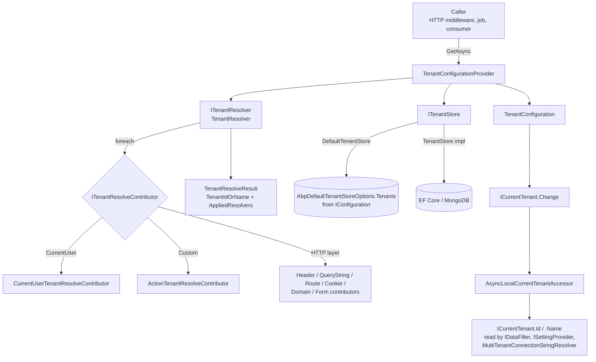

ABP's multi‑tenancy primitives live in two NuGet packages whose source sits at `framework/src/Volo.Abp.MultiTenancy.Abstractions/Volo/Abp/MultiTenancy/` (interfaces, value objects, options, exceptions) and `framework/src/Volo.Abp.MultiTenancy/Volo/Abp/MultiTenancy/` (default implementations and DI wiring). This split lets a domain layer reference the abstractions without pulling in the resolver chain, and it lets background jobs, message consumers and console hosts use the same `ICurrentTenant` scope that the ASP.NET Core middleware sets up. This page walks each type from the abstractions inward, showing where it is registered and who consumes it.

The companion pages cover the HTTP transport ([`/tenancy/multi-tenancy-aspnetcore`](/tenancy/multi-tenancy-aspnetcore)), the data layer filter ([`/tenancy/data-filtering`](/tenancy/data-filtering)) and the persistent CRUD module ([`/tenancy/tenant-management-module`](/tenancy/tenant-management-module)).

## How the pieces fit together



## Enabling and disabling

`AbpMultiTenancyOptions` is the single central switch. Source: `Volo.Abp.MultiTenancy.Abstractions/Volo/Abp/MultiTenancy/AbpMultiTenancyOptions.cs`.

```csharp
public class AbpMultiTenancyOptions
{
    /// <summary>
    /// A central point to enable/disable multi-tenancy.
    /// Default: false.
    /// </summary>
    public bool IsEnabled { get; set; }

    /// <summary>
    /// Database style for tenants.
    /// Default: <see cref="MultiTenancyDatabaseStyle.Hybrid"/>.
    /// </summary>
    public MultiTenancyDatabaseStyle DatabaseStyle { get; set; }
        = MultiTenancyDatabaseStyle.Hybrid;
}
```

`IsEnabled` is consulted across the framework — by authorization (`[Authorize]` against tenant‑scoped policies), the navigation menu provider, the feature checker, and so on — and is the gate that downstream pages assume is `true`. `DatabaseStyle` is informational: `Hybrid` (default), `SingleDatabase` and `MultipleDatabase` describe how connection strings will be allocated across tenants and influence migrations tooling.

Configure it in `ConfigureServices`:

```csharp
Configure<AbpMultiTenancyOptions>(options =>
{
    options.IsEnabled = true;
});
```

<Warning>
Setting `IsEnabled = true` does not by itself protect your data. The `IMultiTenant` query filter is what actually scopes queries; see [`/tenancy/data-filtering`](/tenancy/data-filtering). What `IsEnabled` controls is *whether the rest of the framework treats this app as multi-tenant* — for example, exposing the tenant switch UI, requiring `TenantId` in claims, and so on.
</Warning>

## ICurrentTenant — the ambient scope

`ICurrentTenant` is the entry point every other component uses. Source: `Volo.Abp.MultiTenancy.Abstractions/Volo/Abp/MultiTenancy/ICurrentTenant.cs`.

```csharp
public interface ICurrentTenant
{
    bool IsAvailable { get; }
    Guid? Id { get; }
    string? Name { get; }

    IDisposable Change(Guid? id, string? name = null);
}
```

The default implementation, `CurrentTenant` (transient), delegates to `ICurrentTenantAccessor` to read and replace the ambient value. Source: `Volo.Abp.MultiTenancy/Volo/Abp/MultiTenancy/CurrentTenant.cs`.

```csharp
public class CurrentTenant : ICurrentTenant, ITransientDependency
{
    public virtual bool IsAvailable => Id.HasValue;
    public virtual Guid? Id   => _currentTenantAccessor.Current?.TenantId;
    public string? Name       => _currentTenantAccessor.Current?.Name;

    private readonly ICurrentTenantAccessor _currentTenantAccessor;

    public CurrentTenant(ICurrentTenantAccessor currentTenantAccessor)
    {
        _currentTenantAccessor = currentTenantAccessor;
    }

    public IDisposable Change(Guid? id, string? name = null)
        => SetCurrent(id, name);

    private IDisposable SetCurrent(Guid? tenantId, string? name = null)
    {
        var parentScope = _currentTenantAccessor.Current;
        _currentTenantAccessor.Current = new BasicTenantInfo(tenantId, name);

        return new DisposeAction<ValueTuple<ICurrentTenantAccessor, BasicTenantInfo?>>(
            static (state) =>
            {
                var (accessor, parent) = state;
                accessor.Current = parent;
            },
            (_currentTenantAccessor, parentScope));
    }
}
```

`Change(null)` switches to the host (no tenant); `Change(someGuid)` switches into that tenant. The returned `IDisposable` restores the previous scope when disposed — so the canonical usage is a `using` block:

```csharp
using (_currentTenant.Change(targetTenantId))
{
    // queries, settings reads and connection-string lookups
    // here observe targetTenantId
}
// previous tenant restored automatically
```

<Note>
Because `Change` returns the parent scope inside a `DisposeAction`, scopes nest correctly across async boundaries — the captured `parentScope` is restored even if an `await` resumes on a different thread.
</Note>

### AsyncLocalCurrentTenantAccessor

The ambient slot itself is a singleton wrapping `AsyncLocal<BasicTenantInfo?>`. Source: `Volo.Abp.MultiTenancy/Volo/Abp/MultiTenancy/AsyncLocalCurrentTenantAccessor.cs`.

```csharp
public class AsyncLocalCurrentTenantAccessor : ICurrentTenantAccessor
{
    public static AsyncLocalCurrentTenantAccessor Instance { get; } = new();

    public BasicTenantInfo? Current
    {
        get => _currentScope.Value;
        set => _currentScope.Value = value;
    }

    private readonly AsyncLocal<BasicTenantInfo?> _currentScope;

    private AsyncLocalCurrentTenantAccessor()
    {
        _currentScope = new AsyncLocal<BasicTenantInfo?>();
    }
}
```

It is wired by `AbpMultiTenancyModule` as a singleton: `context.Services.AddSingleton<ICurrentTenantAccessor>(AsyncLocalCurrentTenantAccessor.Instance);`.

<Warning>
Do not implement `ICurrentTenantAccessor` yourself unless you understand the async‑flow semantics of `AsyncLocal<T>` — background jobs rely on its copy‑on‑capture behavior so parallel consumers don't leak scopes into each other.
</Warning>

### BasicTenantInfo

The value carried in the `AsyncLocal`. Source: `BasicTenantInfo.cs`.

```csharp
public class BasicTenantInfo
{
    /// <summary>Null indicates the host. Not null value for a tenant.</summary>
    public Guid? TenantId { get; }

    /// <summary>Name of the tenant if TenantId is not null.</summary>
    public string? Name { get; }

    public BasicTenantInfo(Guid? tenantId, string? name = null)
    {
        TenantId = tenantId;
        Name = name;
    }
}
```

This struct‑like object is immutable; `Change` always allocates a new instance and swaps it atomically into the `AsyncLocal`.

## TenantConfiguration

`TenantConfiguration` is the DTO that travels between `ITenantStore`, `TenantConfigurationProvider` and `MultiTenantConnectionStringResolver`. Source: `Volo.Abp.MultiTenancy.Abstractions/Volo/Abp/MultiTenancy/TenantConfiguration.cs`.

```csharp
[Serializable]
public class TenantConfiguration
{
    public Guid Id { get; set; }
    public string Name { get; set; } = default!;
    public string NormalizedName { get; set; } = default!;
    public ConnectionStrings? ConnectionStrings { get; set; }
    public bool IsActive { get; set; }
    public Guid? EditionId { get; set; }

    public TenantConfiguration() { IsActive = true; }

    public TenantConfiguration(Guid id, string name) : this()
    {
        Check.NotNull(name, nameof(name));
        Id = id;
        Name = name;
        ConnectionStrings = new ConnectionStrings();
    }

    public TenantConfiguration(Guid id, string name, string normalizedName,
        Guid? editionId = null) : this(id, name)
    {
        NormalizedName = normalizedName;
        EditionId = editionId;
    }
}
```

It is intentionally a flat, serializable shape — `TenantConfigurationCacheItem` wraps it in a distributed cache entry inside the `TenantStore` used by the tenant management module.

## ITenantStore

The store is a read‑only lookup interface. Source: `ITenantStore.cs`.

```csharp
public interface ITenantStore
{
    Task<TenantConfiguration?> FindAsync(string normalizedName);
    Task<TenantConfiguration?> FindAsync(Guid id);
    Task<IReadOnlyList<TenantConfiguration>> GetListAsync(bool includeDetails = false);

    [Obsolete("Use FindAsync method.")]
    TenantConfiguration? Find(string normalizedName);

    [Obsolete("Use FindAsync method.")]
    TenantConfiguration? Find(Guid id);
}
```

### DefaultTenantStore (configuration-backed)

If no other store is registered, `DefaultTenantStore` reads from `AbpDefaultTenantStoreOptions.Tenants`, which is bound to `IConfiguration`. Source: `Volo.Abp.MultiTenancy/Volo/Abp/MultiTenancy/ConfigurationStore/DefaultTenantStore.cs`.

```csharp
[Dependency(TryRegister = true)]
public class DefaultTenantStore : ITenantStore, ITransientDependency
{
    private readonly AbpDefaultTenantStoreOptions _options;

    public DefaultTenantStore(IOptionsMonitor<AbpDefaultTenantStoreOptions> options)
    {
        _options = options.CurrentValue;
    }

    public Task<TenantConfiguration?> FindAsync(string normalizedName)
        => Task.FromResult(Find(normalizedName));

    public Task<TenantConfiguration?> FindAsync(Guid id)
        => Task.FromResult(Find(id));

    public Task<IReadOnlyList<TenantConfiguration>> GetListAsync(bool includeDetails = false)
        => Task.FromResult<IReadOnlyList<TenantConfiguration>>(_options.Tenants);

    public TenantConfiguration? Find(string normalizedName)
        => _options.Tenants?.FirstOrDefault(t => t.NormalizedName == normalizedName);

    public TenantConfiguration? Find(Guid id)
        => _options.Tenants?.FirstOrDefault(t => t.Id == id);
}
```

The `[Dependency(TryRegister = true)]` attribute means: only register this implementation if no other `ITenantStore` is registered yet. That is the seam through which the tenant management module's `TenantStore` (cached, EF Core/Mongo backed) takes over once you depend on `AbpTenantManagementDomainModule`.

Configure tenants via `appsettings.json`:

```json
{
  "AbpDefaultTenantStoreOptions": {
    "Tenants": [
      {
        "Id": "0e7d61b0-7d80-44a4-9c4d-bd4f0e8c1f4f",
        "Name": "Acme",
        "NormalizedName": "ACME",
        "IsActive": true,
        "ConnectionStrings": {
          "Default": "Server=...;Database=Acme;..."
        }
      }
    ]
  }
}
```

`AbpMultiTenancyModule.ConfigureServices` binds this section automatically:

```csharp
Configure<AbpDefaultTenantStoreOptions>(configuration);
```

<Note>
The `ConfigurationStore` package is enough for small SaaS deployments where tenants are static. Switch to the management module ([`/tenancy/tenant-management-module`](/tenancy/tenant-management-module)) when you need self‑service onboarding, per‑tenant features, or runtime connection string changes.
</Note>

## ITenantResolver and contributors

`ITenantResolver` is the chain coordinator; the actual resolution logic lives in `ITenantResolveContributor` implementations.

### Interfaces

```csharp
public interface ITenantResolver
{
    Task<TenantResolveResult> ResolveTenantIdOrNameAsync();
}

public interface ITenantResolveContributor
{
    string Name { get; }
    Task ResolveAsync(ITenantResolveContext context);
}
```

`ITenantResolveContext` exposes the in‑flight result plus a `ServiceProvider` (scoped) for contributors that need to resolve more services:

```csharp
public class TenantResolveContext : ITenantResolveContext
{
    public IServiceProvider ServiceProvider { get; }
    public string? TenantIdOrName { get; set; }
    public bool Handled { get; set; }

    public bool HasResolvedTenantOrHost()
        => Handled || TenantIdOrName != null;

    public TenantResolveContext(IServiceProvider serviceProvider)
        => ServiceProvider = serviceProvider;
}
```

Note the distinction: setting `TenantIdOrName` to a value stops the chain (a tenant was found); setting `Handled = true` *also* stops the chain — meaning "this contributor authoritatively says the host is the answer, do not try further contributors."

### TenantResolver

Source: `Volo.Abp.MultiTenancy/Volo/Abp/MultiTenancy/TenantResolver.cs`.

```csharp
public class TenantResolver : ITenantResolver, ITransientDependency
{
    private readonly IServiceProvider _serviceProvider;
    private readonly AbpTenantResolveOptions _options;

    public TenantResolver(IOptions<AbpTenantResolveOptions> options,
        IServiceProvider serviceProvider)
    {
        _serviceProvider = serviceProvider;
        _options = options.Value;
    }

    public virtual async Task<TenantResolveResult> ResolveTenantIdOrNameAsync()
    {
        var result = new TenantResolveResult();

        using (var serviceScope = _serviceProvider.CreateScope())
        {
            var context = new TenantResolveContext(serviceScope.ServiceProvider);

            foreach (var tenantResolver in _options.TenantResolvers)
            {
                await tenantResolver.ResolveAsync(context);
                result.AppliedResolvers.Add(tenantResolver.Name);

                if (context.HasResolvedTenantOrHost())
                {
                    result.TenantIdOrName = context.TenantIdOrName;
                    break;
                }
            }
        }

        if (result.TenantIdOrName.IsNullOrEmpty()
            && !string.IsNullOrWhiteSpace(_options.FallbackTenant))
        {
            result.TenantIdOrName = _options.FallbackTenant;
            result.AppliedResolvers.Add(TenantResolverNames.FallbackTenant);
        }

        return result;
    }
}
```

Three things worth noting:

1. Each call creates a fresh DI scope so contributors can resolve scoped services without leaking them.
2. The first contributor that *resolves anything or sets `Handled`* wins; the loop short‑circuits.
3. If nothing matches, `AbpTenantResolveOptions.FallbackTenant` lets you pin a development/testing default.

### AbpTenantResolveOptions

Source: `AbpTenantResolveOptions.cs`.

```csharp
public class AbpTenantResolveOptions
{
    [NotNull]
    public List<ITenantResolveContributor> TenantResolvers { get; }

    /// <summary>
    /// Fallback tenant to use when no other resolver resolves a tenant.
    /// </summary>
    public string? FallbackTenant { get; set; }

    public AbpTenantResolveOptions()
    {
        TenantResolvers = new List<ITenantResolveContributor>();
    }
}
```

`TenantResolvers` is an ordered list. `AbpMultiTenancyModule` pre‑inserts the `CurrentUser` contributor at position 0; ASP.NET Core adds `QueryString`, `Route`, `Header`, `Cookie` (see [`/tenancy/multi-tenancy-aspnetcore`](/tenancy/multi-tenancy-aspnetcore)). You can `Insert` / `Add` / `Remove` to customize the chain.

### Built-in contributors (framework layer)

<Accordion title="CurrentUserTenantResolveContributor — read tenant from the auth principal">

Source: `Volo.Abp.MultiTenancy/Volo/Abp/MultiTenancy/CurrentUserTenantResolveContributor.cs`.

```csharp
public class CurrentUserTenantResolveContributor : TenantResolveContributorBase
{
    public const string ContributorName = "CurrentUser";

    public override string Name => ContributorName;

    public override Task ResolveAsync(ITenantResolveContext context)
    {
        var currentUser = context.ServiceProvider.GetRequiredService<ICurrentUser>();
        if (currentUser.IsAuthenticated)
        {
            context.Handled = true;
            context.TenantIdOrName = currentUser.TenantId?.ToString();
        }

        return Task.CompletedTask;
    }
}
```

If the request is authenticated, this contributor *always* wins (it sets `Handled = true`). That means an authenticated tenant user cannot escape into another tenant by sending a query‑string override — which is exactly the intended security model. The contributor is inserted at position 0 by `AbpMultiTenancyModule`.
</Accordion>

<Accordion title="ActionTenantResolveContributor — inline lambda for tests and special cases">

Source: `ActionTenantResolveContributor.cs`.

```csharp
public class ActionTenantResolveContributor : TenantResolveContributorBase
{
    public const string ContributorName = "Action";
    public override string Name => ContributorName;

    private readonly Action<ITenantResolveContext> _resolveAction;

    public ActionTenantResolveContributor(Action<ITenantResolveContext> resolveAction)
    {
        Check.NotNull(resolveAction, nameof(resolveAction));
        _resolveAction = resolveAction;
    }

    public override Task ResolveAsync(ITenantResolveContext context)
    {
        _resolveAction(context);
        return Task.CompletedTask;
    }
}
```

Useful in integration tests:

```csharp
Configure<AbpTenantResolveOptions>(options =>
{
    options.TenantResolvers.Insert(0, new ActionTenantResolveContributor(ctx =>
    {
        ctx.TenantIdOrName = "test-tenant";
    }));
});
```
</Accordion>

<Accordion title="TenantResolveContributorBase — recommended base class">

```csharp
public abstract class TenantResolveContributorBase : ITenantResolveContributor
{
    public abstract string Name { get; }
    public abstract Task ResolveAsync(ITenantResolveContext context);
}
```

Always derive from this base — ASP.NET Core uses `HttpTenantResolveContributorBase` ([`/tenancy/multi-tenancy-aspnetcore`](/tenancy/multi-tenancy-aspnetcore#httptenantresolvecontributorbase)) that adds HTTP fallbacks.
</Accordion>

### TenantResolveResult and known names

`TenantResolveResult` carries the resolved id/name plus diagnostics:

```csharp
public class TenantResolveResult
{
    public string? TenantIdOrName { get; set; }
    public List<string> AppliedResolvers { get; } = new();
}
```

`TenantResolverNames` and `TenantResolverConsts` hold the well‑known string constants:

```csharp
public static class TenantResolverNames
{
    public const string FallbackTenant = "FallbackTenant";
}

public class TenantResolverConsts
{
    public const string DefaultTenantKey = "__tenant";
}
```

The default tenant key `__tenant` is used by the HTTP contributors as the header name, query string parameter and cookie name unless overridden via `AbpAspNetCoreMultiTenancyOptions.TenantKey`.

## TenantConfigurationProvider — bringing it together

`TenantConfigurationProvider` ties the resolver to the store and applies activation policy. Source: `Volo.Abp.MultiTenancy/Volo/Abp/MultiTenancy/TenantConfigurationProvider.cs`.

```csharp
public class TenantConfigurationProvider : ITenantConfigurationProvider, ITransientDependency
{
    public virtual async Task<TenantConfiguration?> GetAsync(bool saveResolveResult = false)
    {
        var resolveResult = await TenantResolver.ResolveTenantIdOrNameAsync();
        if (saveResolveResult)
            TenantResolveResultAccessor.Result = resolveResult;

        TenantConfiguration? tenant = null;
        if (resolveResult.TenantIdOrName != null)
        {
            tenant = await FindTenantAsync(resolveResult.TenantIdOrName);

            if (tenant == null)
                throw new BusinessException("Volo.AbpIo.MultiTenancy:010001",
                    message: StringLocalizer["TenantNotFoundMessage"],
                    details: StringLocalizer["TenantNotFoundDetails",
                        resolveResult.TenantIdOrName]);

            if (!tenant.IsActive)
                throw new BusinessException("Volo.AbpIo.MultiTenancy:010002",
                    message: StringLocalizer["TenantNotActiveMessage"],
                    details: StringLocalizer["TenantNotActiveDetails",
                        resolveResult.TenantIdOrName]);
        }

        return tenant;
    }

    protected virtual async Task<TenantConfiguration?> FindTenantAsync(string tenantIdOrName)
    {
        if (Guid.TryParse(tenantIdOrName, out var parsedTenantId))
            return await TenantStore.FindAsync(parsedTenantId);

        return await TenantStore.FindAsync(
            TenantNormalizer.NormalizeName(tenantIdOrName)!);
    }
}
```

<Note>
There is no dedicated `TenantNotFoundException` class — the provider throws a `BusinessException` with the localizable error codes `Volo.AbpIo.MultiTenancy:010001` (not found) and `:010002` (inactive). `MultiTenancyMiddleware` catches these and rewrites them into the error page configured by `AbpAspNetCoreMultiTenancyOptions.MultiTenancyMiddlewareErrorPageBuilder` — see [`/tenancy/multi-tenancy-aspnetcore`](/tenancy/multi-tenancy-aspnetcore#error-handling).
</Note>

`ITenantNormalizer` (default: `UpperInvariantTenantNormalizer`) makes name lookups case‑insensitive by upper‑casing once at write and at read time.

## MultiTenantConnectionStringResolver

The connection string resolver translates `ICurrentTenant.Id` into a per‑tenant database connection. Source: `Volo.Abp.MultiTenancy/Volo/Abp/MultiTenancy/MultiTenantConnectionStringResolver.cs`.

```csharp
[Dependency(ReplaceServices = true)]
public class MultiTenantConnectionStringResolver : DefaultConnectionStringResolver
{
    public override async Task<string> ResolveAsync(string? connectionStringName = null)
    {
        if (_currentTenant.Id == null)
            return await base.ResolveAsync(connectionStringName);

        var tenant = await FindTenantConfigurationAsync(_currentTenant.Id.Value);
        if (tenant == null || tenant.ConnectionStrings.IsNullOrEmpty())
            return await base.ResolveAsync(connectionStringName);

        var tenantDefault = tenant.ConnectionStrings?.Default;
        if (connectionStringName == null ||
            connectionStringName == ConnectionStrings.DefaultConnectionStringName)
        {
            return !tenantDefault.IsNullOrWhiteSpace()
                ? tenantDefault!
                : Options.ConnectionStrings.Default!;
        }

        // specific connection string, mapped database fallbacks, then base
    }
}
```

`[Dependency(ReplaceServices = true)]` overrides `IConnectionStringResolver` whenever `Volo.Abp.MultiTenancy` is in the module graph. See [`/data/connection-strings`](/data/connection-strings) for the full algorithm and [`/tenancy/tenant-management-module`](/tenancy/tenant-management-module#per-tenant-connection-strings) for how the tenant CRUD module populates the entries.

## MultiTenancySides — annotating host/tenant intent

```csharp
[Flags]
public enum MultiTenancySides : byte
{
    Tenant = 1,
    Host = 2,
    Both = Tenant | Host
}
```

Source: `MultiTenancySides.cs`. It is used as a parameter to `[Authorize]`‑style attributes, feature definitions, setting definitions and menu contributors so that they can be scoped to host‑only or tenant‑only experiences. The framework includes `[IgnoreMultiTenancy]` for entities or services that should never be filtered:

```csharp
[AttributeUsage(AttributeTargets.All)]
public class IgnoreMultiTenancyAttribute : Attribute { }
```

## Module wiring summary

`AbpMultiTenancyModule.ConfigureServices` is the single place that registers everything:

```csharp
[DependsOn(
    typeof(AbpDataModule),
    typeof(AbpSecurityModule),
    typeof(AbpSettingsModule),
    typeof(AbpEventBusAbstractionsModule),
    typeof(AbpMultiTenancyAbstractionsModule)
)]
public class AbpMultiTenancyModule : AbpModule
{
    public override void ConfigureServices(ServiceConfigurationContext context)
    {
        context.Services.AddSingleton<ICurrentTenantAccessor>(
            AsyncLocalCurrentTenantAccessor.Instance);

        var configuration = context.Services.GetConfiguration();
        Configure<AbpDefaultTenantStoreOptions>(configuration);

        Configure<AbpSettingOptions>(options =>
        {
            options.ValueProviders.InsertAfter(
                t => t == typeof(GlobalSettingValueProvider),
                typeof(TenantSettingValueProvider));
        });

        Configure<AbpTenantResolveOptions>(options =>
        {
            options.TenantResolvers.Insert(0,
                new CurrentUserTenantResolveContributor());
        });
    }
}
```

<Steps>
  <Step title="Register the accessor as a singleton">
    `AsyncLocalCurrentTenantAccessor.Instance` is intentionally a process‑wide singleton — the per‑request state is inside the `AsyncLocal<T>`, not the accessor itself.
  </Step>
  <Step title="Bind tenant configuration">
    `Configure<AbpDefaultTenantStoreOptions>(configuration)` lets `appsettings.json` drive `DefaultTenantStore` out of the box.
  </Step>
  <Step title="Insert the tenant setting value provider">
    Settings are resolved through a chain; `TenantSettingValueProvider` is placed right after the global provider so tenant overrides take precedence over global defaults but defer to user/scoped overrides.
  </Step>
  <Step title="Pin the current-user contributor">
    `CurrentUserTenantResolveContributor` is inserted at position 0, so once authenticated the user's tenant claim authoritatively wins over any HTTP transport contributor added later.
  </Step>
</Steps>

## Cross-references

- [`/core/dependency-injection`](/core/dependency-injection) — the `ITransientDependency`/`[Dependency(ReplaceServices=true)]` patterns used throughout this module.
- [`/core/options-and-configuration`](/core/options-and-configuration) — how `AbpMultiTenancyOptions`, `AbpTenantResolveOptions`, `AbpDefaultTenantStoreOptions` are bound and read.
- [`/tenancy/multi-tenancy-aspnetcore`](/tenancy/multi-tenancy-aspnetcore) — the HTTP contributors and the middleware that drives `TenantConfigurationProvider.GetAsync(saveResolveResult: true)`.
- [`/tenancy/data-filtering`](/tenancy/data-filtering) — how `ICurrentTenant.Id` is consumed by EF Core and MongoDB.
- [`/security/security-helpers`](/security/security-helpers) — `ICurrentUser.TenantId` and the auth claim plumbing the `CurrentUser` contributor reads from.
- [`/modules/tenant-management/overview`](/modules/tenant-management/overview) — the persistent `ITenantStore` replacement.
- [`/flows/multi-tenancy-resolution`](/flows/multi-tenancy-resolution) — animated end‑to‑end flow that mirrors the diagram above.
