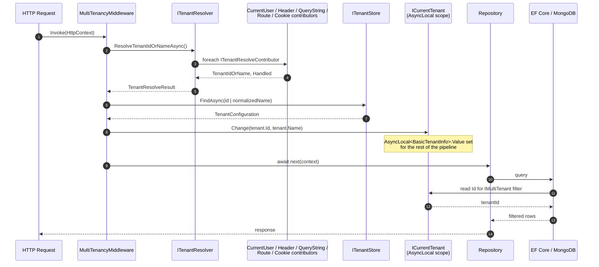

ABP's multi‑tenancy stack is split across two abstraction packages — `framework/src/Volo.Abp.MultiTenancy.Abstractions/` for contracts and `framework/src/Volo.Abp.MultiTenancy/` for the default implementations — with web integration in `framework/src/Volo.Abp.AspNetCore.MultiTenancy/` and an optional end‑to‑end CRUD experience in `modules/tenant-management/`. Together they implement a small, opinionated pipeline: each request flows through an ordered list of `ITenantResolveContributor` instances, the resolved tenant id or name is loaded from an `ITenantStore`, an `ICurrentTenant` scope is opened with `using (...)` semantics, and downstream consumers — settings, repositories, EF Core query filters, MongoDB aggregates and the connection string resolver — branch on `ICurrentTenant.Id`.

This section walks through every layer of that pipeline. Use the cards below to jump to the topic you need; each page cites concrete source paths under the abp repository so you can pivot from the documentation to the code without losing context.

## Pages in this section

<CardGroup cols={2}>
  <Card title="Multi-Tenancy Core" icon="cube" href="/tenancy/multi-tenancy-core">
    `AbpMultiTenancyOptions`, `ICurrentTenant`, `ITenantStore`, `ITenantResolver`, resolve contributors and the `AsyncLocal` scope accessor.
  </Card>
  <Card title="ASP.NET Core Integration" icon="globe" href="/tenancy/multi-tenancy-aspnetcore">
    `MultiTenancyMiddleware`, the HTTP resolve contributors (Header, QueryString, Route, Cookie, Form, Domain) and the tenant switch UI.
  </Card>
  <Card title="Data Filtering" icon="filter" href="/tenancy/data-filtering">
    How `IMultiTenant` becomes an EF Core global query filter and a MongoDB `$match` stage, with override patterns for host code.
  </Card>
  <Card title="Tenant Management Module" icon="building" href="/tenancy/tenant-management-module">
    The `Tenant` aggregate, `ITenantManager`, `ITenantRepository`, connection string management and how it plugs `ITenantStore`.
  </Card>
</CardGroup>

## The end-to-end request flow

The diagram below traces a single HTTP request from the browser to a repository query. `MultiTenancyMiddleware` is what ties the per‑request resolution to the ambient `ICurrentTenant` scope; everything after it — EF Core's `CreateFilterExpression`, MongoDB's `Aggregate.Match`, the settings system, the connection string resolver — reads `ICurrentTenant.Id` from `AsyncLocalCurrentTenantAccessor`.

<Note>
Steps 1–4 are framework‑agnostic — the same `ITenantResolver` is invoked from background jobs and message consumers via `TenantConfigurationProvider`. Steps 5–8 (the `using` scope) are what every multi‑tenant ABP feature reads.
</Note>

## Key abstractions at a glance

<Tabs>
  <Tab title="ICurrentTenant">
    The ambient scope. Reads `BasicTenantInfo` from `ICurrentTenantAccessor` and lets callers open a nested scope with `Change(Guid?)`. Defined in `framework/src/Volo.Abp.MultiTenancy.Abstractions/Volo/Abp/MultiTenancy/ICurrentTenant.cs`; default impl `CurrentTenant.cs` in the non‑abstractions package.
  </Tab>
  <Tab title="ITenantResolver">
    Walks `AbpTenantResolveOptions.TenantResolvers` in order until a contributor sets `TenantIdOrName` or `Handled = true`. See `TenantResolver.cs` and `AbpTenantResolveOptions.cs`.
  </Tab>
  <Tab title="ITenantStore">
    Looks up a `TenantConfiguration` by id or normalized name. Default is `DefaultTenantStore` (reads `AbpDefaultTenantStoreOptions.Tenants` from `IConfiguration`); the tenant‑management module replaces it with a cached EF Core/Mongo backed `TenantStore`.
  </Tab>
  <Tab title="IMultiTenant">
    Marker interface implemented by entities. `AbpDbContext.CreateFilterExpression` and `MongoDbRepository.GetMongoQueryableAsync` automatically add a `TenantId == CurrentTenantId` predicate when `IDataFilter.IsEnabled<IMultiTenant>()`.
  </Tab>
</Tabs>

## What you'll learn

<CardGroup cols={2}>
  <Card title="When to enable multi-tenancy" icon="toggle-on">
    `AbpMultiTenancyOptions.IsEnabled` is a central switch consulted by `Authorize`, `IFeatureChecker` and the navigation menu. See [`/tenancy/multi-tenancy-core`](/tenancy/multi-tenancy-core#enabling-and-disabling).
  </Card>
  <Card title="Resolver ordering and short-circuiting" icon="list-ol">
    Contributors set `context.Handled = true` to stop the chain even without resolving a tenant — used for explicit host requests. See [`/tenancy/multi-tenancy-aspnetcore`](/tenancy/multi-tenancy-aspnetcore#contributor-ordering).
  </Card>
  <Card title="Host vs. tenant data" icon="layer-group">
    `using (CurrentTenant.Change(null)) { ... }` is the canonical pattern to read host‑side data inside a tenant request. See [`/tenancy/data-filtering`](/tenancy/data-filtering#switching-tenants-at-runtime).
  </Card>
  <Card title="Per-tenant connection strings" icon="database">
    `MultiTenantConnectionStringResolver` replaces `DefaultConnectionStringResolver` to consult the resolved `TenantConfiguration.ConnectionStrings` first. See [`/tenancy/tenant-management-module`](/tenancy/tenant-management-module#per-tenant-connection-strings).
  </Card>
</CardGroup>

## Cross-cutting links

- [`/core/dependency-injection`](/core/dependency-injection) — `ICurrentTenant` is registered transient; `ICurrentTenantAccessor` is the singleton `AsyncLocal` carrier.
- [`/data/data-filtering`](/data/data-filtering) — the generic `IDataFilter<IMultiTenant>` toggle used by EF Core and MongoDB to opt in or out of tenant scoping.
- [`/security/security-helpers`](/security/security-helpers) — `ICurrentUser.TenantId` is what `CurrentUserTenantResolveContributor` reads to keep authenticated requests pinned to their user's tenant.
- [`/modules/tenant-management/overview`](/modules/tenant-management/overview) — the application‑level CRUD module that lights up the diagram by providing a persistent `ITenantStore`.
- [`/flows/multi-tenancy-resolution`](/flows/multi-tenancy-resolution) — end‑to‑end sequence flow with all extension points called out.

## Recommended reading order

<Steps>
  <Step title="Read the core abstractions">
    Start with [`/tenancy/multi-tenancy-core`](/tenancy/multi-tenancy-core) to understand `ICurrentTenant`, `ITenantStore` and `ITenantResolver` — they are framework‑level and used outside of ASP.NET Core too (background jobs, console hosts, message consumers).
  </Step>
  <Step title="Add the ASP.NET Core middleware">
    Then read [`/tenancy/multi-tenancy-aspnetcore`](/tenancy/multi-tenancy-aspnetcore) to see how the HTTP request becomes a tenant id and how the cookie/header/route resolvers cooperate.
  </Step>
  <Step title="Understand the data layer hook">
    [`/tenancy/data-filtering`](/tenancy/data-filtering) shows how EF Core query filters and MongoDB aggregates implement the `IMultiTenant` predicate. This is also where you'll learn to opt out for cross‑tenant administrative queries.
  </Step>
  <Step title="Plug in the management module">
    Finish with [`/tenancy/tenant-management-module`](/tenancy/tenant-management-module) to swap `DefaultTenantStore` for a real database‑backed store, manage connection strings, and expose a tenant CRUD UI.
  </Step>
</Steps>

<Warning>
Multi‑tenancy is disabled by default (`AbpMultiTenancyOptions.IsEnabled = false`). Single‑tenant apps still depend on `Volo.Abp.MultiTenancy` because of the data filter wiring, but `CurrentTenant.Id` will be `null` for every request and `IMultiTenant` filters become no‑ops. Enable it explicitly before relying on tenant resolution.
</Warning>

## Source layout cheat sheet

The multi‑tenancy stack is spread across four package roots in the abp repository. Each row of the table below maps a documentation page to the source folder where its types live, so you can jump from prose to code without searching.

| Page | Package root | Key types |
|------|--------------|-----------|
| [Tenancy Core](/tenancy/multi-tenancy-core) | `framework/src/Volo.Abp.MultiTenancy.Abstractions/` and `framework/src/Volo.Abp.MultiTenancy/` | `ICurrentTenant`, `ITenantResolver`, `ITenantStore`, `TenantConfiguration`, `AbpMultiTenancyOptions` |
| [ASP.NET Tenancy](/tenancy/multi-tenancy-aspnetcore) | `framework/src/Volo.Abp.AspNetCore.MultiTenancy/` and `Mvc.UI.MultiTenancy/` | `MultiTenancyMiddleware`, `HeaderTenantResolveContributor`, `QueryStringTenantResolveContributor`, `RouteTenantResolveContributor`, `CookieTenantResolveContributor`, `DomainTenantResolveContributor` |
| [Tenant Filtering](/tenancy/data-filtering) | `framework/src/Volo.Abp.EntityFrameworkCore/`, `Volo.Abp.MongoDB/`, `Volo.Abp.Ddd.Domain/` | `AbpDbContext.CreateFilterExpression`, `MongoDbRepository`, `RepositoryBase.ApplyDataFilters`, `IMultiTenant` |
| [Tenant Module](/tenancy/tenant-management-module) | `modules/tenant-management/src/Volo.Abp.TenantManagement.*/` | `Tenant`, `TenantManager`, `ITenantRepository`, `TenantStore`, `TenantAppService` |

## Common pitfalls

The behavior most often surprises developers in three places — keep these in mind as you read the deeper pages:

<Accordion title="The CurrentUser contributor wins over query string for logged-in users">

`CurrentUserTenantResolveContributor` sets `Handled = true` whenever the request is authenticated, which stops every later contributor in the chain. This is by design — a tenant user with a valid auth cookie cannot escape into another tenant by adding `?__tenant=otherTenant` to a URL. If you need an unauthenticated tenant switch (sign‑in screen, marketing landing), the QueryString contributor still fires; once auth completes, the user's claim takes over.

See [`/tenancy/multi-tenancy-aspnetcore`](/tenancy/multi-tenancy-aspnetcore#contributor-ordering) for the full ordering rationale and [`/security/security-helpers`](/security/security-helpers) for the `ICurrentUser.TenantId` claim mapping.

</Accordion>

<Accordion title="Reading the Tenant aggregate inside a tenant request">

`Tenant` is a host‑owned entity, but `AbpDbContext` applies the `IMultiTenant` filter to every `IMultiTenant` query — including the lookup that `TenantStore` runs to populate the cache. The framework handles this by wrapping the lookup in `using (CurrentTenant.Change(null)) { ... }`, switching to the host scope just for the read. If you write your own `Tenant`‑facing repository or app service, mirror the pattern.

See [`/tenancy/tenant-management-module`](/tenancy/tenant-management-module#tenantstore--the-persistent-itenantstore) for the canonical implementation.

</Accordion>

<Accordion title="Disabling the IMultiTenant filter leaks data — audit every site">

`IDataFilter.Disable<IMultiTenant>()` is the only sanctioned way to read across tenants in a single query. It is the right tool for host‑side reporting, usage analytics and migration utilities — but it is *not* safe to expose to tenant‑side endpoints. Use `[Authorize]` policies scoped to `MultiTenancySides.Host`, or check `ICurrentTenant.Id == null` before disabling, and treat every call site as a security‑sensitive review item.

See [`/tenancy/data-filtering`](/tenancy/data-filtering#switching-tenants-at-runtime) for the patterns and [`/data/data-filtering`](/data/data-filtering) for the `IDataFilter` abstraction itself.

</Accordion>

## When you only need part of the stack

You don't have to take everything at once. The packages compose so you can pick the slice that matches your scenario:

<CardGroup cols={2}>
  <Card title="Single-tenant app, never plans to change" icon="circle-minus">
    Don't depend on `Volo.Abp.MultiTenancy` at all. Most application templates default to this and add the package only when you opt in.
  </Card>
  <Card title="SaaS with a small static tenant list" icon="file-pen">
    `Volo.Abp.MultiTenancy` + `DefaultTenantStore` driven by `appsettings.json` is enough. No database tables, no CRUD UI.
  </Card>
  <Card title="Self-service tenant onboarding" icon="user-plus">
    Add `Volo.Abp.TenantManagement.Domain` + the EF Core/Mongo implementation to swap `DefaultTenantStore` for the persistent `TenantStore`.
  </Card>
  <Card title="Full admin UI and HTTP API" icon="window-maximize">
    Layer in `Volo.Abp.TenantManagement.Application`, `HttpApi` and the Razor/Blazor packages. See [`/modules/tenant-management/overview`](/modules/tenant-management/overview) for the full module map.
  </Card>
</CardGroup>

<Note>
Adding the management module is non‑destructive: tenants you previously listed in `appsettings.json` keep working until you migrate them. `DefaultTenantStore`'s `[Dependency(TryRegister = true)]` registration is replaced once `TenantStore` from the management module is registered earlier in the DI container.
</Note>

## Key terms

You will see these terms used precisely throughout the section. Skim them once before diving in so the deeper pages read more smoothly:

<Tabs>
  <Tab title="Host">
    The administrative side of a SaaS app. Represented by `ICurrentTenant.Id == null` and `IsAvailable == false`. Host code typically manages tenants, edits global settings, runs reports across tenants and owns the database schema for tables that aren't tenant‑scoped (settings, features, the `Tenant` aggregate itself).
  </Tab>
  <Tab title="Tenant">
    A single SaaS customer. Represented by `ICurrentTenant.Id == someGuid`. Inside a tenant scope, EF Core and MongoDB queries are automatically filtered to that tenant's rows; the connection string resolver consults `TenantConfiguration.ConnectionStrings`; settings fall back from tenant → global; the navigation menu hides host‑only entries.
  </Tab>
  <Tab title="Resolver chain">
    The ordered `List<ITenantResolveContributor>` in `AbpTenantResolveOptions.TenantResolvers`. `TenantResolver` walks the list; the first contributor that sets `TenantIdOrName` or `Handled = true` wins. Order matters — `CurrentUserTenantResolveContributor` is intentionally inserted at position 0 to lock authenticated users to their claim.
  </Tab>
  <Tab title="Tenant scope">
    A nested `using (CurrentTenant.Change(...))` block. The scope is carried by `AsyncLocal<BasicTenantInfo?>` so it survives `await`, flows through `Task.Run` continuations and isolates parallel work. Disposing the returned `IDisposable` restores the parent scope.
  </Tab>
  <Tab title="Data filter">
    The `IDataFilter<IMultiTenant>` toggle. Independent of `ICurrentTenant.Id`. Disabling the filter lets queries return cross‑tenant rows *without* changing the ambient tenant — the right tool for host reports; the wrong tool to use anywhere a tenant request can reach.
  </Tab>
</Tabs>

## Where multi-tenancy meets the rest of ABP

The tenant context isn't a standalone subsystem — every layer of the framework reads it. The list below highlights the integration points so you know what to look for when chasing a behavior:

<Accordion title="Authorization">

`MultiTenancySides` (`Tenant | Host | Both`) is the parameter you pass on permission, feature and setting definitions to scope them. `[Authorize]` evaluates against the current tenant's permission grants, and `IPermissionChecker` consults `ICurrentTenant.Id` when looking up grant providers. See [`/security/security-helpers`](/security/security-helpers).

</Accordion>

<Accordion title="Settings">

`AbpMultiTenancyModule` inserts `TenantSettingValueProvider` right after the global provider in `AbpSettingOptions.ValueProviders`. A setting read inside a tenant scope falls back: User → Tenant → Global → Default. Disabling multi‑tenancy doesn't remove the provider — it simply never produces a value because `ICurrentTenant.Id` stays null.

</Accordion>

<Accordion title="Features">

The features system mirrors settings — `TenantFeatureValueProvider` reads from the resolved tenant. The management module provisions per‑tenant feature overrides through the Feature Management UI when present.

</Accordion>

<Accordion title="Background jobs">

`BackgroundJobManager` stamps the current `TenantId` onto every queued job. The worker reads the stamp and opens `using (CurrentTenant.Change(jobArgs.TenantId))` before invoking the handler. The same pattern applies to RabbitMQ / Kafka distributed event consumers.

</Accordion>

<Accordion title="Auditing">

`AuditLog.TenantId` is populated automatically from the ambient `ICurrentTenant`. Audit logs are stored host‑side by default but partitioned per tenant in queries; the management module exposes per‑tenant log filters.

</Accordion>

<Accordion title="Distributed events">

`AbpDistributedEntityEventOptions` registers `TenantEto` so any tenant create/update/delete fires across the message bus. Identity, BlobStoring and other modules subscribe to provision per‑tenant resources.

</Accordion>

## At a glance: what each request does

For a typical authenticated request to a tenant‑scoped endpoint, the runtime cost of multi‑tenancy is roughly:

<CardGroup cols={2}>
  <Card title="One resolver invocation per request" icon="bolt">
    `MultiTenancyMiddleware` calls `TenantConfigurationProvider.GetAsync` once. The resolver chain short‑circuits at `CurrentUser` for authenticated requests; an unauthenticated request walks at most 4 HTTP contributors.
  </Card>
  <Card title="One ITenantStore lookup, cached" icon="layer-group">
    `TenantStore` reads from `IDistributedCache<TenantConfigurationCacheItem>` first. Misses populate the cache; the `TenantConfigurationCacheItemInvalidator` listens on entity and rename events to flush stale entries.
  </Card>
  <Card title="Zero allocations per query for filters" icon="filter">
    EF Core's global query filter is compiled once and parameterized by `CurrentTenantId`. With `UseDbFunction = true`, the predicate becomes a UDF call so the plan cache is shared across tenants.
  </Card>
  <Card title="One AsyncLocal write per scope change" icon="arrow-right-arrow-left">
    `ICurrentTenant.Change` swaps a single `AsyncLocal<BasicTenantInfo?>.Value`. The returned `DisposeAction` captures a value tuple; no closure allocation in the hot path.
  </Card>
</CardGroup>

## Failure modes you should know

The middleware swallows resolution failures into a configurable error page, but the underlying exceptions are worth recognizing in logs and tracing:

| Symptom | Probable cause | Where to look |
|---------|----------------|---------------|
| `BusinessException` code `Volo.AbpIo.MultiTenancy:010001` | Resolver returned a tenant id/name that the store does not know | `TenantConfigurationProvider.GetAsync` — usually a stale cookie or claim pointing at a deleted tenant |
| `BusinessException` code `:010002` | Tenant exists but `IsActive == false` | Same; the middleware then clears the auth/`__tenant` cookies if `MultiTenancyMiddlewareErrorPageBuilder` ran with the default delegate |
| Queries return host rows in a tenant request | `IDataFilter.Disable<IMultiTenant>()` was left enabled (likely a missing `using`) or filter was disabled in an outer scope | `IsMultiTenantFilterEnabled` on `AbpDbContext`; `IDataFilter.IsEnabled<IMultiTenant>()` at the call site |
| Authenticated user appears to "leak" between tenants | `MultiTenancyMiddleware` placed before `UseAuthentication` so `CurrentUserTenantResolveContributor` saw an anonymous user and let a query‑string override win | Application pipeline ordering, see [`/tenancy/multi-tenancy-aspnetcore`](/tenancy/multi-tenancy-aspnetcore#wiring-everything-together) |
| `MultiTenantConnectionStringResolver` falls back to the host connection string | `Tenant.ConnectionStrings` is empty or the requested name has no entry; resolver intentionally degrades rather than throwing | `TenantConfiguration.ConnectionStrings` and the per‑tenant rows in the database |

<Warning>
`BusinessException` codes are *not* HTTP status codes. The default error page builder returns 404 for AJAX requests, redirects for cookie‑authenticated GETs, and renders a Razor page otherwise — log the exception message and the `Abp-Tenant-Resolve-Error` response header to recognize these in production traces.
</Warning>

## Testing checklist

Before shipping a multi‑tenant feature, walk through this short list — it catches almost every "works on my machine" issue with tenancy:

<Steps>
  <Step title="Smoke-test the resolver chain in isolation">
    Build a small integration test that resolves `ITenantConfigurationProvider.GetAsync()` with `?__tenant=` set via a fake `IHttpContextAccessor`. If the result is `null`, your chain order is wrong; if it throws `010001`, your store is missing the row.
  </Step>
  <Step title="Verify the filter is enabled in the test host">
    `AbpMultiTenancyOptions.IsEnabled = true` must be set in your test module. Otherwise EF Core and MongoDB silently return cross‑tenant rows because `IsMultiTenantFilterEnabled` is `false`.
  </Step>
  <Step title="Assert tenant id on inserted rows">
    Inside a `using (CurrentTenant.Change(tid))` block, insert a row, then commit. Read it back outside the scope with `IDataFilter.Disable<IMultiTenant>()` and assert `TenantId == tid`. Catches accidental host‑side writes.
  </Step>
  <Step title="Exercise the host scope for any IMultiTenant aggregate you query host-side">
    If you ever call `_someRepo.GetListAsync()` from a host endpoint, wrap it in `using (CurrentTenant.Change(null))` — or use `IDataFilter.Disable<IMultiTenant>()` if you want every tenant's rows. Pick one and document the choice.
  </Step>
  <Step title="Run the test suite with both DefaultTenantStore and TenantStore">
    Configuration‑backed and persistent stores have different cache semantics. Test against both if your codebase supports either.
  </Step>
</Steps>
