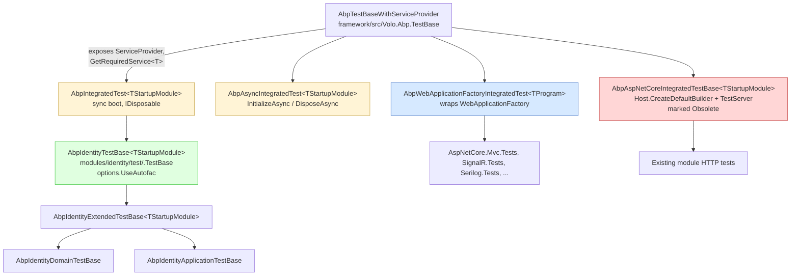

ABP does not ship a test runner. It ships a small set of **base classes** that boot a real `IAbpApplication` — same module graph, same DI container, same `[UnitOfWork]` interception — and hand your xUnit class an already-initialized `ServiceProvider`. Tests then resolve services and call them. This page is the entry point to that infrastructure: where each piece lives, when to pick which base class, and how modules layer their own test bases on top.

## What you actually inherit from

There are three layers, all in `framework/src/`:

<CardGroup cols={3}>
  <Card title="Volo.Abp.TestBase" icon="cube" href="/testing/testbase">
    `AbpIntegratedTest<TStartupModule>` boots a non-web module graph synchronously. `AbpAsyncIntegratedTest<TStartupModule>` does the same with async hooks. Both expose `ServiceProvider`, `Application`, and `TestServiceScope`.
  </Card>
  <Card title="Volo.Abp.AspNetCore.TestBase" icon="server" href="/testing/aspnetcore-testbase">
    Adds an in-memory `TestServer`. The new `AbpWebApplicationFactoryIntegratedTest<TProgram>` wraps `Microsoft.AspNetCore.Mvc.Testing.WebApplicationFactory`. The older `AbpAspNetCoreIntegratedTestBase<TStartupModule>` builds a `Host.CreateDefaultBuilder` pipeline.
  </Card>
  <Card title="Per-module test bases" icon="layer-group" href="/testing/module-test-patterns">
    Each module ships a `*.TestBase` project that derives from `AbpIntegratedTest<TStartupModule>`, configures Autofac, and seeds deterministic data (e.g. `AbpIdentityTestBase`, `AbpIdentityTestDataBuilder`).
  </Card>
</CardGroup>

The repo also has two large bodies of tests built on top:

<CardGroup cols={2}>
  <Card title="framework/test/" icon="flask" href="/testing/framework-test-suite">
    84 test projects covering the framework itself — `AbpTestBase` (shared helpers), `Volo.Abp.Core.Tests`, `Volo.Abp.Autofac.Tests`, `Volo.Abp.AspNetCore.*.Tests`, `Volo.Abp.EventBus.Tests`, `Volo.Abp.Caching.Tests`, and so on.
  </Card>
  <Card title="test/DistEvents/" icon="rabbit" href="/testing/dist-events-tests">
    Top-level console apps used for **manual** verification of distributed event flows (EF Core + RabbitMQ, MongoDB + Kafka, MongoDB + Rebus). Not xUnit — they boot real infrastructure.
  </Card>
</CardGroup>

## The class hierarchy at a glance



The leaf classes — `AbpIdentityDomainTestBase`, `AbpIdentityApplicationTestBase`, and friends in every other module — are what individual `[Fact]` classes inherit from.

## What's in scope on this page

The Testing section is a tour of the **infrastructure**, not a how-to for application authors. If you came here looking for "how do I test an `IFooAppService` in my own solution," start with the [Test Base guide](/aspnetcore/test-base) — the pages here document the framework code that guide builds on top of. You'll see:

- The exact source paths of every base class.
- The hook order during `AbpIntegratedTest`'s constructor.
- Why module test bases all call `options.UseAutofac()`.
- How `AbpAspNetCoreIntegratedTestBase` differs from `AbpWebApplicationFactoryIntegratedTest`.
- The full per-module test layout (Identity is the worked example).
- A categorized index of every test project in `framework/test/`.

If your question is "where is the prior art for testing X?" the [framework test suite](/testing/framework-test-suite) page is the index to skim first.

## Which base do I pick?

<AccordionGroup>
  <Accordion title="Pure unit test, no module graph">
    Just use xUnit + NSubstitute + Shouldly directly. ABP's `framework/test/AbpTestBase/` project provides a few helpers (`ServiceCollectionShouldlyExtensions`) but no base class — many of the smallest tests in `Volo.Abp.Core.Tests/` inherit from nothing.
  </Accordion>
  <Accordion title="Integration test that needs the DI container, options, and interception">
    Inherit `AbpIntegratedTest<TStartupModule>` (or `AbpAsyncIntegratedTest<TStartupModule>` if your boot path is async, e.g. async data seeding via `IDataSeeder`). See [TestBase](/testing/testbase).
  </Accordion>
  <Accordion title="Integration test that needs HTTP endpoints and middleware">
    Inherit `AbpWebApplicationFactoryIntegratedTest<TProgram>` (preferred) or `AbpAspNetCoreIntegratedTestBase<TStartupModule>` (legacy). See [AspNetCore TestBase](/testing/aspnetcore-testbase) and the [Test Base](/aspnetcore/test-base) guide.
  </Accordion>
  <Accordion title="Test against a real database">
    Module tests configure Sqlite in-memory (`Volo.Abp.EntityFrameworkCore.Sqlite`) or a `MongoDbFixture` (`Mongo2Go` / `EphemeralMongo`). See the [module test patterns](/testing/module-test-patterns) page for the Identity example.
  </Accordion>
</AccordionGroup>

## A canonical test class

This is the shape of nearly every integration test in the repo (here from `modules/identity/test/Volo.Abp.Identity.Domain.Tests/Volo/Abp/Identity/IdentityUserManager_Tests.cs`):

```csharp
public abstract class AbpIdentityDomainTestBase
    : AbpIdentityExtendedTestBase<AbpIdentityDomainTestModule>
{
}

public class IdentityUserManager_Tests : AbpIdentityDomainTestBase
{
    private readonly IdentityUserManager _userManager;
    private readonly IIdentityUserRepository _userRepository;
    private readonly IdentityTestData _testData;

    public IdentityUserManager_Tests()
    {
        _userManager = GetRequiredService<IdentityUserManager>();
        _userRepository = GetRequiredService<IIdentityUserRepository>();
        _testData = GetRequiredService<IdentityTestData>();
    }

    [Fact]
    public async Task SetRolesAsync()
    {
        var user = await _userRepository.GetAsync(_testData.UserJohnId);
        // ... call domain service, assert state
    }
}
```

The constructor of `AbpIdentityDomainTestBase` (inherited from `AbpIntegratedTest<>`) has already:

1. Built an `IServiceCollection`.
2. Called `services.AddApplication<AbpIdentityDomainTestModule>(o => o.UseAutofac())`.
3. Materialized the root `IServiceProvider` and a scoped `TestServiceScope`.
4. Called `Application.Initialize(...)` — which runs every module's `PreConfigureServices` / `ConfigureServices` / `OnApplicationInitialization` hook.
5. Run `IDataSeeder.SeedAsync()` and `AbpIdentityTestDataBuilder.Build()` so deterministic GUIDs in `IdentityTestData` resolve to real rows.

`GetRequiredService<T>()` is a thin wrapper over `ServiceProvider.GetRequiredService<T>()` from `AbpTestBaseWithServiceProvider`.

## What each page covers

| Page | What's in it |
| --- | --- |
| [TestBase](/testing/testbase) | `AbpIntegratedTest`, `AbpAsyncIntegratedTest`, the `BeforeAddApplication` / `AfterAddApplication` / `SetAbpApplicationCreationOptions` hook order, `AbpTestBaseModule`, the `Utils/TestCounter` helper. |
| [AspNetCore TestBase](/testing/aspnetcore-testbase) | `AbpWebApplicationFactoryIntegratedTest<TProgram>`, the obsolete `AbpAspNetCoreIntegratedTestBase`, `UseAbpTestServer`, `ITestServerAccessor`, `AspNetCoreTestProxyHttpClientFactory`, and the `AbpNoopHostLifetime`. |
| [Module test patterns](/testing/module-test-patterns) | The four-project layout (`.TestBase`, `.Domain.Tests`, `.Application.Tests`, `.EntityFrameworkCore.Tests`, `.MongoDB.Tests`) using `Volo.Abp.Identity` as the worked example, plus the data-builder pattern. |
| [Framework test suite](/testing/framework-test-suite) | A categorized index of the 84 projects under `framework/test/`. |
| [DistEvents tests](/testing/dist-events-tests) | The three manual sample apps under `test/DistEvents/` and what they verify. |

## Conventions you'll see everywhere

- **Test runner.** xUnit. Every `*.Tests.csproj` references `Microsoft.NET.Test.Sdk`, `xunit`, `xunit.extensibility.execution`, and `xunit.runner.visualstudio` via `common.test.props`.
- **Assertions.** Shouldly. `_user.UserName.ShouldBe("john")`.
- **Mocking.** NSubstitute. Used sparingly because the full module graph is typically booted instead of mocked.
- **Autofac.** Module test bases call `options.UseAutofac()` because ABP's property injection and dynamic proxy interception (`[UnitOfWork]`, `[Audited]`) are wired through `Volo.Abp.Autofac`. See [Modularity](/core/modularity).
- **No `await using`.** `AbpIntegratedTest` implements `IDisposable` (sync); `AbpAsyncIntegratedTest` implements xUnit's `IAsyncLifetime` pattern with `InitializeAsync`/`DisposeAsync`.

## The folder layout at a glance

```
framework/
├── src/
│   ├── Volo.Abp.TestBase/                     // base classes (see /testing/testbase)
│   │   └── Volo/Abp/
│   │       ├── AbpTestBaseModule.cs
│   │       ├── AbpTestBaseWithServiceProvider.cs
│   │       └── Testing/
│   │           ├── AbpIntegratedTest.cs
│   │           ├── AbpAsyncIntegratedTest.cs
│   │           └── Utils/{ITestCounter,TestCounter}.cs
│   └── Volo.Abp.AspNetCore.TestBase/          // HTTP layer (see /testing/aspnetcore-testbase)
│       └── Volo/Abp/AspNetCore/TestBase/
│           ├── AbpAspNetCoreTestBaseModule.cs
│           ├── AbpAspNetCoreIntegratedTestBase.cs   // [Obsolete]
│           ├── AbpAspNetCoreAsyncIntegratedTestBase.cs  // [Obsolete]
│           ├── AbpWebApplicationFactoryIntegratedTest.cs  // current
│           ├── ITestServerAccessor.cs / TestServerAccessor.cs
│           ├── AbpNoopHostLifetime.cs / TestNoopHostLifetime.cs
│           ├── WebHostBuilderExtensions.cs (UseAbpTestServer)
│           └── DynamicProxying/AspNetCoreTestProxyHttpClientFactory.cs
└── test/                                       // see /testing/framework-test-suite
    ├── AbpTestBase/                            // helpers, not a test project
    ├── Volo.Abp.TestApp/                       // shared mini-app
    └── Volo.Abp.{Name}.Tests/                  // 81 individual test projects

modules/
└── identity/test/                              // see /testing/module-test-patterns
    ├── Volo.Abp.Identity.TestBase/
    ├── Volo.Abp.Identity.Domain.Tests/
    ├── Volo.Abp.Identity.Application.Tests/
    ├── Volo.Abp.Identity.AspNetCore.Tests/
    ├── Volo.Abp.Identity.EntityFrameworkCore.Tests/
    └── Volo.Abp.Identity.MongoDB.Tests/

test/                                            // see /testing/dist-events-tests
├── AbpPerfTest/
└── DistEvents/
    ├── DistDemoApp.Shared/
    ├── DistDemoApp.EfCoreRabbitMq/
    ├── DistDemoApp.MongoDbKafka/
    └── DistDemoApp.MongoDbRebus/
```

## The complete hook order, end to end

When you write `public class MyTests : AbpIdentityDomainTestBase`, an awful lot happens before xUnit invokes a `[Fact]`. Spelling it out:

<Steps>
  <Step title="xUnit constructs the test class">
    Per `[Fact]`, xUnit creates a fresh instance. The constructor chain ultimately reaches `AbpIntegratedTest<TStartupModule>`'s constructor.
  </Step>
  <Step title="AbpIntegratedTest builds an IServiceCollection">
    `CreateServiceCollection()` (virtual, default `new ServiceCollection()`).
  </Step>
  <Step title="BeforeAddApplication runs">
    Empty by default; override to register substitutes before any ABP code sees them.
  </Step>
  <Step title="services.AddApplication&lt;TStartupModule&gt;(...) walks the [DependsOn] graph">
    For every module in dependency order: instantiate, call `PreConfigureServices`, then `ConfigureServices`. The Identity test module dependency chain is `AbpIdentityDomainTestModule → AbpIdentityEntityFrameworkCoreTestModule → AbpIdentityTestBaseModule → AbpTestBaseModule → AbpIdentityDomainModule → AbpAuthorizationModule → AbpAutofacModule → ...`.
  </Step>
  <Step title="AfterAddApplication runs">
    Empty by default; the place to call `services.Replace(...)` for a module-registered service you want to override.
  </Step>
  <Step title="CreateServiceProvider materializes the container">
    `services.BuildServiceProviderFromFactory()`. If `options.UseAutofac()` was called in `SetAbpApplicationCreationOptions`, this picks up the `AutofacServiceProviderFactory` and the dynamic-proxy interception is live.
  </Step>
  <Step title="A scope is created">
    `TestServiceScope = RootServiceProvider.CreateScope()`. Every resolution inside the test happens through this scope — so scoped registrations (DbContext, UoW, current-user accessor) survive across `[Fact]` calls within the same class instance.
  </Step>
  <Step title="Application.Initialize fires module lifecycle hooks">
    `OnPreApplicationInitialization`, `OnApplicationInitialization`, `OnPostApplicationInitialization`. The Identity test base seeds data here.
  </Step>
  <Step title="ServiceProvider field is assigned">
    Now `GetRequiredService<T>()` from `AbpTestBaseWithServiceProvider` works.
  </Step>
  <Step title="AfterInitialize hook runs">
    Last chance to warm up a service before the `[Fact]` body executes.
  </Step>
</Steps>

The `Dispose()` chain mirrors this in reverse — see [TestBase](/testing/testbase).

## Anti-patterns to avoid

<Warning>
- **Don't skip `UseAutofac()`.** The default Microsoft DI container can't do property injection or dynamic-proxy interception. Tests that need `[UnitOfWork]`, `[Audited]`, or property-injected `ILogger<T>` will silently misbehave.
- **Don't `services.AddScoped<DbContext>(...)` in a test module.** Use the same `AddAbpDbContext<TContext>(o => o.AddDefaultRepositories())` registration the production module would, and let `Volo.Abp.EntityFrameworkCore.Sqlite` (or `MongoSandbox` for Mongo) provide the substrate.
- **Don't override `Dispose` without calling `base.Dispose()`.** You'll leak the in-memory Sqlite handle that backs the next test class, and the failure surfaces several `[Fact]`s later as "table already exists."
- **Don't construct an `IAbpApplication` from inside a `[Fact]`.** The whole point of `AbpIntegratedTest` is that the constructor does it. If you want a per-test reset, create a new test class — that's how xUnit isolation is meant to work.
- **Don't depend on test ordering.** xUnit makes no guarantees about `[Fact]` order, and `AbpIntegratedTest` boots a fresh module graph per test anyway. If a test "only passes when run after another," the seed step is wrong.
</Warning>

## A quick mental model

If you remember nothing else from this section, remember the four-line summary:

1. `AbpIntegratedTest<TStartupModule>` is the constructor that says `services.AddApplication<TStartupModule>(o => o.UseAutofac()).Initialize(...)` so that `GetRequiredService<T>()` works.
2. `AbpWebApplicationFactoryIntegratedTest<TProgram>` is the same idea, with an `HttpClient` against an in-memory ASP.NET Core host instead.
3. Every official module ships an `Abp{Module}TestBase` that fixes a startup module which seeds deterministic data via `IDataSeeder` plus a `Abp{Module}TestDataBuilder`.
4. `framework/test/` is 81 instances of pattern 1 against in-memory backing stores; `test/DistEvents/` is a small set of console apps that test the same code against real brokers.

Pages on either side of this overview drill into each of those four points.

## Cross-references

- [Modularity](/core/modularity) — the `AddApplication<TStartupModule>` / `Initialize` calls the test bases use are the same ones a real ABP host calls.
- [Unit of Work](/data/unit-of-work) — domain and application tests rely on the `[UnitOfWork]` interceptor being live, which only happens because the Autofac container is configured.
- [Test Base (ASP.NET Core)](/aspnetcore/test-base) — guide-level walkthrough that links back to the source you'll see on [AspNetCore TestBase](/testing/aspnetcore-testbase).
- [Data Seeding](/data/data-seeding) — `IDataSeeder` and `IDataSeedContributor`, called inside `OnApplicationInitialization` by every module's test-base module.
- [Repository Layout](/overview/repository-layout) — where `framework/`, `modules/`, and `test/` live and how they relate.
- [Solution Conventions](/overview/solution-conventions) — naming rules that explain why every test project is `Volo.Abp.{Name}.Tests`.

<Tip>
If a test "can't find" a service, the cause is almost always that the wrong startup module was picked, not a DI bug. Re-check the `[DependsOn(...)]` chain on your test module — that closure is exactly what `AddApplication<T>()` walks.
</Tip>

## Frequently asked questions

<AccordionGroup>
  <Accordion title="Why do tests share a constructor between [Fact]s?">
    They don't — xUnit creates a *new* test class instance per `[Fact]`. That means the entire boot (build collection → `AddApplication` → `Initialize` → seed) runs once per fact. Module test bases mitigate cost by using in-memory backing stores (Sqlite, `MongoSandbox`, `Volo.Abp.MemoryDb`), so the boot is fast even when it's done thousands of times.
  </Accordion>
  <Accordion title="Can I share a database between [Fact]s?">
    Yes — use `IClassFixture<TFixture>` (xUnit's mechanism) and create a fixture that boots an `IAbpApplication` once, exposing the `IServiceProvider` for the whole class. None of the official module test bases do this because per-fact isolation is more important than boot speed, but `Volo.Abp.MongoDB.Tests` and friends use static fixtures (`MongoDbFixture`) to share the *infrastructure* while still recreating per-test ABP applications.
  </Accordion>
  <Accordion title="What about ICollectionFixture / [Collection]?">
    The framework's `Mongo` tests rely on a `static` `MongoDbFixture` rather than xUnit collection fixtures because the cost lives in starting `mongod`, not in starting an ABP application. The pattern is "start the substrate once globally; rebuild the module graph per test." Either xUnit mechanism (`ICollectionFixture` or a `static` initializer) is fine.
  </Accordion>
  <Accordion title="How do I assert that a distributed event fired?">
    Inside the module graph, the distributed event bus defaults to `LocalDistributedEventBus` — so a `[Fact]` can subscribe via `IDistributedEventBus` and a handler implementing `IDistributedEventHandler<TEto>`, then poke the producer and assert the handler ran. For *real* broker round-trips, you need the [DistEvents tests](/testing/dist-events-tests) sample apps. The unit-level coverage lives in `Volo.Abp.EventBus.Tests` — see [Framework test suite](/testing/framework-test-suite).
  </Accordion>
  <Accordion title="What about [UnitOfWork] in tests?">
    Already covered — `AbpIntegratedTest` plus `options.UseAutofac()` is enough. The interception is live. If you need a custom transaction boundary inside a `[Fact]`, resolve `IUnitOfWorkManager` and call `.Begin()` / `.CompleteAsync()` explicitly. See [Unit of Work](/data/unit-of-work).
  </Accordion>
  <Accordion title="How do I substitute IConfiguration or appsettings?">
    Override `BeforeAddApplication(IServiceCollection)` and call `services.ReplaceConfiguration(yourConfigRoot)`. Module test modules call the same extension to swap config providers — for example, `AbpIdentityEntityFrameworkCoreTestModule` injects a `ConnectionStrings:Default` pointing at the in-memory Sqlite handle.
  </Accordion>
  <Accordion title="What's the difference between AbpIntegratedTest and AbpTestBaseWithServiceProvider?">
    `AbpTestBaseWithServiceProvider` is just a bag of resolver helpers (`GetService`, `GetRequiredService`, keyed variants) over a *settable* `ServiceProvider` slot. `AbpIntegratedTest` inherits from it and supplies a `ServiceProvider` by actually booting an `IAbpApplication`. The `WebApplicationFactory`-based base inherits from `WebApplicationFactory<TProgram>` directly (not from `AbpTestBaseWithServiceProvider`) but re-implements the same resolver helpers — see [AspNetCore TestBase](/testing/aspnetcore-testbase).
  </Accordion>
</AccordionGroup>
