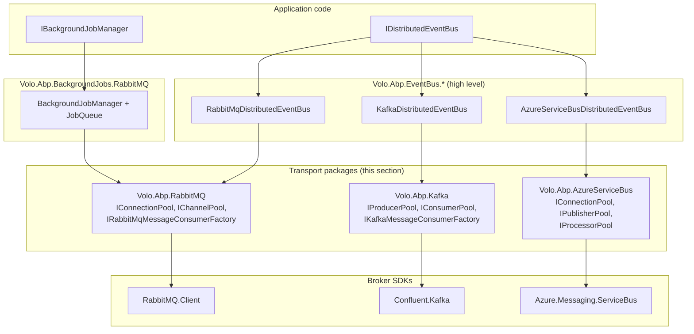

The packages described in this section live under `framework/src/Volo.Abp.RabbitMQ/`, `framework/src/Volo.Abp.Kafka/` and `framework/src/Volo.Abp.AzureServiceBus/`. They are *not* event-bus implementations — they are thin, opinionated wrappers around the official broker SDKs (`RabbitMQ.Client`, `Confluent.Kafka`, `Azure.Messaging.ServiceBus`) that provide:

- Named connections with sane defaults.
- Pooling of expensive objects (connections, channels, producers, consumers, processors).
- Lifecycle integration with the ABP module system — pools are disposed on `OnApplicationShutdown`.
- A small consumer abstraction so higher-level layers (distributed event bus, background jobs) can subscribe without touching SDK-specific receiver loops.

If you only ever use `IDistributedEventBus`, you may never reference these packages directly — but every RabbitMQ, Kafka and Azure Service Bus integration in ABP composes them. Understanding the surface here is what lets you tune prefetch, share a `ConnectionFactory` across modules, or pull a `ServiceBusSender` out of the DI container for one-off sends.

## When you reach for these packages

<CardGroup cols={2}>
  <Card title="Volo.Abp.RabbitMQ" icon="rabbit" href="/transports/rabbitmq">
    `IConnectionPool`, `IChannelPool`, `IRabbitMqMessageConsumerFactory`, exchange/queue declare configuration. Backing store for the RabbitMQ event bus and the RabbitMQ background-job manager.
  </Card>
  <Card title="Volo.Abp.Kafka" icon="bolt" href="/transports/kafka">
    `IProducerPool`, `IConsumerPool`, `IKafkaSerializer`, `IKafkaMessageConsumerFactory`. Backing store for the Kafka event bus. Wraps `Confluent.Kafka` `ProducerBuilder`/`ConsumerBuilder`.
  </Card>
  <Card title="Volo.Abp.AzureServiceBus" icon="cloud" href="/transports/azure-service-bus">
    `IConnectionPool`, `IPublisherPool`, `IProcessorPool`, `IAzureServiceBusMessageConsumerFactory`. Backing store for the Azure Service Bus event bus, topic-per-event-type.
  </Card>
  <Card title="Higher layers" icon="layer-group" href="/eventbus/abstractions">
    The distributed event bus and the background-job stores call into the pools above. Most app code only sees `IDistributedEventBus`, `IBackgroundJobManager`, etc.
  </Card>
</CardGroup>

## How the layers compose



Every arrow into the **Transports** band represents a DI dependency: the event bus or job manager receives the pool via constructor injection. Nothing about the transport layer assumes "event bus" semantics — it ships connections, channels, producers and consumers, and lets higher layers decide how to use them.

## Shared design rules

The three packages were written years apart but follow the same playbook. Knowing the rules makes each one easier to read.

### A `Connections` dictionary keyed by name

Every package exposes its options with a `Connections` collection that is a `Dictionary<string, T>` keyed by *connection name*. The default key is `"Default"`.

```csharp
// framework/src/Volo.Abp.RabbitMQ/Volo/Abp/RabbitMQ/RabbitMqConnections.cs
[Serializable]
public class RabbitMqConnections : Dictionary<string, ConnectionFactory>
{
    public const string DefaultConnectionName = "Default";

    [NotNull]
    public ConnectionFactory Default {
        get => this[DefaultConnectionName];
        set => this[DefaultConnectionName] = Check.NotNull(value, nameof(value));
    }
    // ...
    public ConnectionFactory GetOrDefault(string connectionName)
    {
        if (TryGetValue(connectionName, out var connectionFactory))
        {
            return connectionFactory;
        }
        return Default;
    }
}
```

`KafkaConnections` and `AzureServiceBusConnections` are structurally identical — only the value type differs (`ClientConfig` for both Kafka and Azure Service Bus, since both are wrappers around an SDK config object).

The contract is: ask the pool for a connection by name; if the name is unknown, fall back to `Default`. This means most apps configure only `Default` and never think about naming, while multi-broker apps can register more entries.

### Module binds options to a configuration section

Each `AbpModule.ConfigureServices` binds the options to a known root key in `IConfiguration`:

| Package | Configuration section |
| --- | --- |
| `AbpRabbitMqModule` | `"RabbitMQ"` |
| `AbpKafkaModule` | `"Kafka"` |
| `AbpAzureServiceBusModule` | `"Azure:ServiceBus"` |

```csharp
// framework/src/Volo.Abp.Kafka/Volo/Abp/Kafka/AbpKafkaModule.cs
public override void ConfigureServices(ServiceConfigurationContext context)
{
    var configuration = context.Services.GetConfiguration();
    Configure<AbpKafkaOptions>(configuration.GetSection("Kafka"));
}
```

So putting your bootstrap servers under `Kafka:Connections:Default:BootstrapServers` in `appsettings.json` is enough — no `services.Configure<AbpKafkaOptions>(...)` call required.

### Pools are `ISingletonDependency` and dispose on shutdown

The pools are registered as singletons and unwound during application shutdown:

```csharp
// framework/src/Volo.Abp.RabbitMQ/Volo/Abp/RabbitMQ/AbpRabbitMqModule.cs
public async override Task OnApplicationShutdownAsync(ApplicationShutdownContext context)
{
    await context.ServiceProvider
        .GetRequiredService<IChannelPool>()
        .DisposeAsync();

    await context.ServiceProvider
        .GetRequiredService<IConnectionPool>()
        .DisposeAsync();
}
```

`AbpKafkaModule` calls `IConsumerPool.Dispose()` and `IProducerPool.Dispose()` in the same hook. `AbpAzureServiceBusModule` doesn't override the shutdown hook — its pools implement `IAsyncDisposable` and are disposed by the broader DI graph.

The ordering matters: channels close before their parent connection; consumers/producers close before any shared client. The pools shown below all use `Stopwatch`-bounded waits (typically 10 s total) so a wedged broker can never block shutdown forever.

### Consumer factories scope a child service provider

Every package ships an `I*MessageConsumerFactory` whose only job is to hand out scoped consumer instances:

```csharp
// framework/src/Volo.Abp.RabbitMQ/Volo/Abp/RabbitMQ/RabbitMqMessageConsumerFactory.cs
public class RabbitMqMessageConsumerFactory : IRabbitMqMessageConsumerFactory, ISingletonDependency, IDisposable
{
    protected IServiceScope ServiceScope { get; }

    public RabbitMqMessageConsumerFactory(IServiceScopeFactory serviceScopeFactory)
    {
        ServiceScope = serviceScopeFactory.CreateScope();
    }

    public IRabbitMqMessageConsumer Create(
        ExchangeDeclareConfiguration exchange,
        QueueDeclareConfiguration queue,
        string? connectionName = null)
    {
        var consumer = ServiceScope.ServiceProvider.GetRequiredService<RabbitMqMessageConsumer>();
        consumer.Initialize(exchange, queue, connectionName);
        return consumer;
    }
    // ...
}
```

`KafkaMessageConsumerFactory` and `AzureServiceBusMessageConsumerFactory` follow the same shape. The factory itself is a singleton; the consumers it returns are *transient* but resolved from a single long-lived scope, so they stay alive for the application's lifetime. The doc-comment is explicit:

> *Avoid to create too many consumers since they are not disposed until end of the application.*

Treat each consumer as a permanent worker — create one per `(queue, subscription, topic+group, topic+subscription)` tuple at startup and keep it.

## Which broker for which workload

<Tabs>
  <Tab title="RabbitMQ">
    The most mature integration: used by both the distributed event bus (`Volo.Abp.EventBus.RabbitMQ`) and the background-job queue (`Volo.Abp.BackgroundJobs.RabbitMQ`). Per-event routing keys, per-service queues, AMQP-level durability. See [RabbitMQ event bus](/eventbus/rabbitmq) and [RabbitMQ background jobs](/background/jobs-rabbitmq).
  </Tab>
  <Tab title="Kafka">
    Highest-throughput, append-only log. Each event type maps to a topic; consumer groups give you horizontal partition replay. ABP wires a single `byte[]` value serializer and lets you customise the producer/consumer configs. See [Kafka event bus](/eventbus/kafka).
  </Tab>
  <Tab title="Azure Service Bus">
    Managed PaaS broker. Topic + subscription per event type, with automatic topic/subscription creation through `ServiceBusAdministrationClient`. Strict at-least-once with dead-lettering built into Azure. See [Azure Service Bus event bus](/eventbus/azure-service-bus).
  </Tab>
</Tabs>

## Pool types at a glance

| Concept | RabbitMQ | Kafka | Azure Service Bus |
| --- | --- | --- | --- |
| Connection | `IConnectionPool` → `IConnection` | (folded into producer/consumer) | `IConnectionPool` → `ServiceBusClient` + `ServiceBusAdministrationClient` |
| Send channel | `IChannelPool` → `IChannelAccessor` | `IProducerPool` → `IProducer<string, byte[]>` | `IPublisherPool` → `ServiceBusSender` |
| Receive worker | `IRabbitMqMessageConsumerFactory` | `IKafkaMessageConsumerFactory` | `IAzureServiceBusMessageConsumerFactory` |
| Recovery model | `AbpAsyncTimer` re-declares every 5 s (SDK auto-recovery disabled) | `AbpAsyncTimer` polls every 5 s | SDK `ServiceBusProcessor` event loop |
| Serializer | `IRabbitMqSerializer` (default `Utf8JsonRabbitMqSerializer`) | `IKafkaSerializer` (default `Utf8JsonKafkaSerializer`) | `IAzureServiceBusSerializer` (default `Utf8JsonAzureServiceBusSerializer`) |

The `IConnectionPool` columns are deliberately different. RabbitMQ separates "connection" (TCP) from "channel" (multiplexed logical session) — so ABP pools them separately. Kafka folds the connection inside the producer/consumer SDK objects, so the pool keys are simply `connectionName`. Azure Service Bus needs two clients per connection — a data-plane `ServiceBusClient` and a management-plane `ServiceBusAdministrationClient` — so the pool returns both.

### Auto-provisioning entities

Two of the three transports auto-create their broker entities. The contracts are written so that "first publish/consume creates the topology" is the default path:

| Transport | What it creates | Where |
| --- | --- | --- |
| RabbitMQ | Exchange + queue + bindings | `RabbitMqMessageConsumer` recovery tick — `ExchangeDeclareConfiguration` and `QueueDeclareConfiguration` are passed to the factory. |
| Azure Service Bus | Topic + subscription | `PublisherPool.GetAsync` / `ProcessorPool.GetAsync` call `SetupTopicAsync` / `SetupSubscriptionAsync` extensions on the admin client. |
| Kafka | Topic (optional, via `AbpKafkaOptions.ConfigureTopic`) | Not in the transport package — `Volo.Abp.EventBus.Kafka` does it explicitly when configured. |

Pre-create entities only when you need non-default properties (quorum queues, TTL policies, partition counts). Otherwise the transport will do the right thing.

## Minimum module wiring

You normally don't reference these packages directly — instead you depend on `Volo.Abp.EventBus.RabbitMQ`, `Volo.Abp.EventBus.Kafka`, `Volo.Abp.EventBus.AzureServiceBus`, or `Volo.Abp.BackgroundJobs.RabbitMQ`, all of which transitively pull the relevant transport package and `DependsOn` it.

If you *do* want raw access — e.g. to publish a Kafka message outside the event-bus pipeline — depend on the transport module directly:

<CodeGroup>

```csharp RabbitMQ
[DependsOn(typeof(AbpRabbitMqModule))]
public class MyModule : AbpModule { }
```

```csharp Kafka
[DependsOn(typeof(AbpKafkaModule))]
public class MyModule : AbpModule { }
```

```csharp Azure Service Bus
[DependsOn(typeof(AbpAzureServiceBusModule))]
public class MyModule : AbpModule { }
```

</CodeGroup>

Then inject `IChannelPool` / `IProducerPool` / `IPublisherPool` and use the broker SDK objects directly.

## Anatomy of a publish

Across the three packages, a typical publish path looks like:

<Steps>
  <Step title="Resolve the send object from a pool">
    `IChannelPool.AcquireAsync(...)` on RabbitMQ, `IProducerPool.Get(...)` on Kafka, `IPublisherPool.GetAsync(...)` on Azure. The pool is always a singleton; the object you get back is either shared (Kafka/Azure) or scoped via an accessor (RabbitMQ).
  </Step>
  <Step title="Auto-provision destination entities (Azure only)">
    `PublisherPool.GetAsync` quietly calls `SetupTopicAsync` on the admin client before returning the sender. The other two transports leave entity creation to the consumer side.
  </Step>
  <Step title="Serialize the payload">
    Use the transport-specific `I*Serializer`. Each defaults to `Utf8Json*Serializer` over `IJsonSerializer`, and each is a single replacement point if you need a different format.
  </Step>
  <Step title="Send">
    `Channel.BasicPublishAsync`, `producer.ProduceAsync`, `sender.SendMessageAsync`. Pool semantics ensure the underlying connection is shared.
  </Step>
  <Step title="Release / let GC do its job">
    On RabbitMQ, `using var accessor = ...` calls back into `ChannelPool.Release`. On Kafka and Azure, the producer/sender stays in the pool — there's nothing to release.
  </Step>
</Steps>

## Anatomy of a subscribe

Subscribe paths are even more uniform because every package centres on the same factory pattern:

<Steps>
  <Step title="Inject `I*MessageConsumerFactory`">
    All three are `ISingletonDependency`. Inject once.
  </Step>
  <Step title="Call `Create(...)` once per logical subscription">
    The doc-comments call this out explicitly: consumers are not disposed until end of application — don't loop, don't recreate.
  </Step>
  <Step title="Register callbacks via `OnMessageReceived`">
    Callbacks land in a `ConcurrentBag` inside the consumer. The transport invokes every callback on every message.
  </Step>
  <Step title="(RabbitMQ only) BindAsync routing keys">
    `IRabbitMqMessageConsumer.BindAsync` queues a bind command that the recovery timer applies. Safe to call before the broker is reachable.
  </Step>
  <Step title="Let the long-lived consumer run">
    For RabbitMQ and Kafka, an `AbpAsyncTimer` ticks every 5 seconds. For Azure, the SDK's `ServiceBusProcessor` drives the event loop. In all cases, the consumer outlives every request scope.
  </Step>
</Steps>

## What's in this section

<CardGroup cols={3}>
  <Card title="RabbitMQ transport" icon="rabbit" href="/transports/rabbitmq">
    Connection and channel pools, the consumer with its async timer recovery loop, and the exchange/queue declare configuration objects.
  </Card>
  <Card title="Kafka transport" icon="bolt" href="/transports/kafka">
    Producer and consumer pools backed by `ConcurrentDictionary<string, Lazy<...>>`, the `IKafkaSerializer` contract and the timer-based consumer loop.
  </Card>
  <Card title="Azure Service Bus transport" icon="cloud" href="/transports/azure-service-bus">
    Twin connection pool (client + administration client), publisher and processor pools, and the `SetupTopicAsync` / `SetupSubscriptionAsync` extension helpers.
  </Card>
</CardGroup>

<Tip>
  Every pool method takes a `connectionName` parameter that defaults to `null`. Passing `null` resolves to `"Default"` via `GetOrDefault`. Multi-tenant or multi-broker deployments are simply a matter of giving each broker a distinct name in `Connections` and threading that name through.
</Tip>

## Where to read next

- [Transports / RabbitMQ](/transports/rabbitmq) — pool internals, channel lifecycle, consumer recovery timer.
- [Transports / Kafka](/transports/kafka) — `Lazy<IProducer>` pooling, `EnableAutoCommit = false` consumer policy.
- [Transports / Azure Service Bus](/transports/azure-service-bus) — automatic topic/subscription provisioning, processor pool, dual client pool.
- [Event bus / RabbitMQ](/eventbus/rabbitmq) — how `RabbitMqDistributedEventBus` consumes the RabbitMQ transport.
- [Event bus / Kafka](/eventbus/kafka) — topic-per-event mapping over the Kafka transport.
- [Event bus / Azure Service Bus](/eventbus/azure-service-bus) — subscription strategy over the Azure transport.
- [Background jobs / RabbitMQ](/background/jobs-rabbitmq) — job manager and queue running on top of `Volo.Abp.RabbitMQ`.
